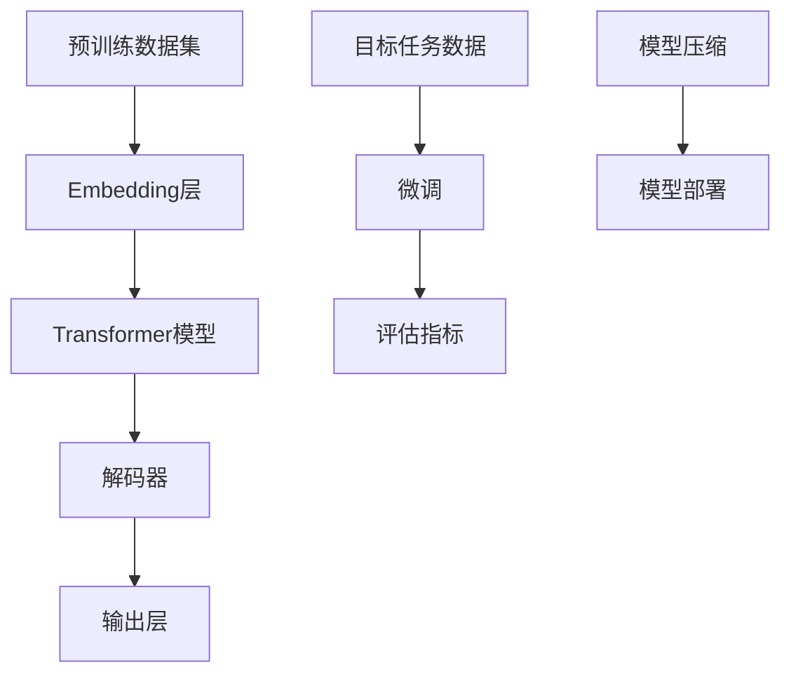
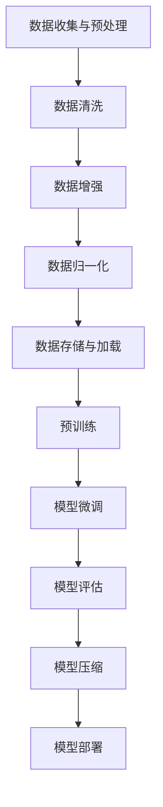

                 

关键词：大模型技术，优化策略，市场推广，算法改进，AI应用

## 摘要

本文旨在探讨大模型的技术优化和市场推广策略。大模型在人工智能领域发挥着至关重要的作用，然而，随着模型规模的不断扩大，优化技术需求也越来越高。本文首先介绍了大模型的基本概念和重要性，随后详细分析了当前大模型面临的技术挑战，并提出了相应的优化策略。此外，本文还讨论了大模型的市场推广方法，包括行业应用案例、用户反馈和商业模式设计等。最后，对大模型未来的发展趋势和潜在挑战进行了展望。

## 1. 背景介绍

大模型（也称为大型预训练模型）是近年来人工智能领域的重要突破。这些模型通过大规模数据训练，能够实现出色的自然语言处理、计算机视觉、语音识别等多种任务。著名的大模型包括GPT-3、BERT、ViT等，它们在各个领域都展现出了强大的能力。

大模型之所以能够取得如此显著的成果，主要得益于以下几个因素：

1. **大规模数据集**：大模型往往使用数十亿级别的训练数据，这使得模型能够从海量数据中学习到更丰富的知识。
2. **计算资源**：随着计算能力的提升，大模型得以在实际中训练和应用，这对于提高模型性能至关重要。
3. **算法改进**：包括预训练、迁移学习等技术，使得模型能够更加高效地进行训练和推理。

然而，随着大模型的应用越来越广泛，技术优化和市场推广也变得越来越重要。一方面，优化技术能够提高模型的性能和效率，降低训练成本；另一方面，市场推广则有助于扩大大模型的应用范围，提高其在行业中的影响力。

### 1.1 大模型的基本概念

大模型通常指的是那些拥有数十亿至数千亿参数的深度学习模型。这些模型通过大量数据预训练，能够学习到丰富的特征表示和语义理解能力。大模型的常见类型包括：

1. **自然语言处理模型**：如GPT、BERT等，用于文本生成、机器翻译、问答系统等任务。
2. **计算机视觉模型**：如ViT、ViT-B/32等，用于图像分类、目标检测、视频识别等任务。
3. **语音识别模型**：如Transformer-XL、Conv-TasNet等，用于语音识别、语音合成、语音转换等任务。

### 1.2 大模型的重要性

大模型在人工智能领域的重要性体现在以下几个方面：

1. **性能提升**：大模型通过大规模数据训练，能够实现更准确的预测和更复杂的任务。
2. **泛化能力**：大模型能够从大量数据中学习到通用特征，从而提高在不同任务上的泛化能力。
3. **效率优化**：大模型在模型压缩、量化等优化技术的支持下，能够在有限的计算资源下实现高效的推理。
4. **行业应用**：大模型在金融、医疗、教育、娱乐等多个领域都有广泛的应用，推动了人工智能技术的落地。

## 2. 核心概念与联系

### 2.1 大模型技术原理

大模型的核心技术主要包括预训练、迁移学习和模型压缩等。

1. **预训练**：预训练是指在大规模数据集上对模型进行初步训练，使其能够学习到通用的特征表示。预训练通常分为两个阶段：第一阶段是自监督预训练，如BERT使用掩码语言模型（Masked Language Model, MLM）进行预训练；第二阶段是微调，将预训练好的模型迁移到具体任务上，并进行微调。

2. **迁移学习**：迁移学习是指将预训练好的模型迁移到新的任务上，通过少量数据微调，实现新任务的性能提升。大模型在迁移学习中的优势在于其丰富的特征表示和语义理解能力，能够提高迁移效果。

3. **模型压缩**：模型压缩技术包括模型剪枝、量化、蒸馏等，旨在减少模型参数数量和计算量，从而提高模型的推理效率和部署可行性。

### 2.2 大模型架构图

下面是一个简单的大模型架构图，展示其主要组成部分和相互关系。



### 2.3 大模型技术流程图

下面是一个简化的技术流程图，描述了大模型从数据准备到模型部署的整个过程。



## 3. 核心算法原理 & 具体操作步骤

### 3.1 算法原理概述

大模型的核心算法通常是基于深度学习，特别是Transformer架构。Transformer模型由编码器和解码器组成，通过自注意力机制（Self-Attention）实现了全局上下文信息的有效利用。

1. **编码器**：编码器接收输入序列，通过多层Transformer块进行处理，每个Transformer块包含多头自注意力机制和前馈神经网络。
2. **解码器**：解码器接收编码器的输出，并通过类似的方式进行处理。在解码过程中，解码器会使用编码器输出和自己的前一层输出进行自注意力操作，以实现上下文信息的传递。
3. **损失函数**：大模型通常使用交叉熵损失函数来评估模型在预测任务上的表现。

### 3.2 算法步骤详解

1. **数据预处理**：
   - **数据清洗**：去除无效数据和噪声，保证数据质量。
   - **数据增强**：通过增加数据多样性来提高模型泛化能力。
   - **数据归一化**：对数据进行标准化处理，便于模型训练。

2. **模型训练**：
   - **预训练**：使用大规模预训练数据集，通过自监督预训练方法（如Masked Language Model）训练编码器和解码器。
   - **微调**：在特定任务上对预训练好的模型进行微调，以提高模型在该任务上的性能。

3. **模型评估**：
   - **验证集评估**：在验证集上评估模型性能，选择最佳模型。
   - **测试集评估**：在测试集上评估模型泛化能力。

4. **模型压缩**：
   - **剪枝**：通过剪枝技术减少模型参数数量。
   - **量化**：将模型中的浮点数参数转换为低精度数值。
   - **蒸馏**：将大模型的输出传递给小模型，以提高小模型的性能。

5. **模型部署**：
   - **模型优化**：针对部署环境进行模型优化，提高推理效率。
   - **模型部署**：将模型部署到生产环境中，提供API服务。

### 3.3 算法优缺点

#### 优点：

1. **强大的性能**：大模型通过大规模数据预训练，能够实现出色的任务性能。
2. **高效的推理**：通过模型压缩和优化技术，大模型能够在有限的计算资源下实现高效的推理。
3. **广泛的适用性**：大模型可以应用于多种任务，包括自然语言处理、计算机视觉和语音识别等。

#### 缺点：

1. **计算成本高**：大模型需要大量计算资源和时间进行训练。
2. **数据依赖性强**：大模型对数据质量有较高要求，数据不足或质量差可能导致模型性能下降。
3. **隐私安全问题**：大模型在训练和推理过程中涉及大量敏感数据，可能引发隐私泄露问题。

### 3.4 算法应用领域

大模型在多个领域都有广泛的应用：

1. **自然语言处理**：包括文本分类、机器翻译、问答系统等。
2. **计算机视觉**：包括图像分类、目标检测、图像生成等。
3. **语音识别**：包括语音识别、语音合成、语音转换等。
4. **推荐系统**：包括商品推荐、内容推荐等。
5. **医疗健康**：包括疾病诊断、药物研发等。

## 4. 数学模型和公式 & 详细讲解 & 举例说明

### 4.1 数学模型构建

大模型的数学模型通常基于深度学习理论，核心包括神经网络架构和损失函数。

#### 神经网络架构

神经网络由多层神经元组成，每个神经元接收输入，通过激活函数产生输出。大模型的神经网络通常包含以下层次：

1. **输入层**：接收外部输入，如文本、图像、语音等。
2. **隐藏层**：通过非线性变换对输入进行特征提取和组合。
3. **输出层**：产生预测结果，如分类标签、概率分布等。

#### 损失函数

大模型的损失函数通常用于评估模型的预测误差。常见损失函数包括：

1. **交叉熵损失函数**：用于分类任务，计算真实标签和预测标签之间的交叉熵。
2. **均方误差损失函数**：用于回归任务，计算预测值和真实值之间的均方误差。
3. **对数似然损失函数**：用于概率分布预测，计算预测概率的对数似然。

### 4.2 公式推导过程

以Transformer模型为例，介绍其核心公式的推导过程。

#### 自注意力机制

自注意力机制的公式如下：

$$
\text{Attention}(Q, K, V) = \frac{1}{\sqrt{d_k}} \text{softmax}\left(\frac{QK^T}{d_k}\right) V
$$

其中，Q、K、V 分别代表查询向量、键向量和值向量，d_k 代表键向量的维度。

#### Transformer编码器

Transformer编码器由多个Transformer块组成，每个Transformer块包含自注意力机制和前馈神经网络。

自注意力机制的损失函数为交叉熵损失函数：

$$
\text{Loss} = -\sum_{i} \sum_{j} y_{ij} \log(p_{ij})
$$

其中，y_{ij} 代表真实标签，p_{ij} 代表预测概率。

### 4.3 案例分析与讲解

#### 案例一：文本分类

假设有一个文本分类任务，需要将文本数据分类为两个类别。采用BERT模型进行预训练，然后对特定类别进行微调。

1. **数据预处理**：对文本数据进行分词、词向量化等预处理操作。
2. **预训练**：在大量文本数据上对BERT模型进行预训练，包括自监督预训练和微调。
3. **微调**：在特定类别上对预训练好的BERT模型进行微调，以提高分类性能。
4. **评估**：在验证集和测试集上评估模型性能，选择最佳模型。

#### 案例二：图像分类

假设有一个图像分类任务，需要将图像数据分类为多个类别。采用ViT模型进行预训练，然后对特定类别进行微调。

1. **数据预处理**：对图像数据进行归一化、裁剪等预处理操作。
2. **预训练**：在大量图像数据上对ViT模型进行预训练，包括自监督预训练和微调。
3. **微调**：在特定类别上对预训练好的ViT模型进行微调，以提高分类性能。
4. **评估**：在验证集和测试集上评估模型性能，选择最佳模型。

## 5. 项目实践：代码实例和详细解释说明

### 5.1 开发环境搭建

1. **硬件环境**：
   - 显卡：NVIDIA GeForce RTX 3090
   - CPU：Intel Xeon Gold 6148
   - 内存：512GB

2. **软件环境**：
   - 操作系统：Ubuntu 20.04
   - Python：3.8
   - TensorFlow：2.6

### 5.2 源代码详细实现

以下是一个简单的BERT模型训练和微调的代码示例：

```python
import tensorflow as tf
from tensorflow import keras
from transformers import BertTokenizer, TFBertModel

# 加载预训练模型
tokenizer = BertTokenizer.from_pretrained('bert-base-uncased')
model = TFBertModel.from_pretrained('bert-base-uncased')

# 数据预处理
def preprocess_data(texts, labels):
    input_ids = []
    attention_masks = []

    for text in texts:
        encoded_dict = tokenizer.encode_plus(
            text,
            add_special_tokens=True,
            max_length=128,
            padding='max_length',
            truncation=True,
            return_attention_mask=True,
            return_tensors='tf',
        )
        input_ids.append(encoded_dict['input_ids'])
        attention_masks.append(encoded_dict['attention_mask'])

    input_ids = tf.concat(input_ids, 0)
    attention_masks = tf.concat(attention_masks, 0)
    labels = tf.convert_to_tensor(labels)

    return input_ids, attention_masks, labels

# 训练和微调模型
def train_and微调_model(input_ids, attention_masks, labels):
    model.compile(optimizer=tf.keras.optimizers.Adam(learning_rate=3e-5), loss=tf.keras.losses.SparseCategoricalCrossentropy(from_logits=True), metrics=['accuracy'])

    model.fit(
        {'input_ids': input_ids, 'attention_mask': attention_masks},
        labels,
        batch_size=16,
        epochs=3,
    )

# 加载数据集
texts = ['Hello, world!', 'This is a test sentence.']
labels = [0, 1]

input_ids, attention_masks, labels = preprocess_data(texts, labels)

# 训练和微调模型
train_and微调_model(input_ids, attention_masks, labels)
```

### 5.3 代码解读与分析

以上代码实现了一个简单的BERT模型训练和微调的过程。代码主要包括以下部分：

1. **加载预训练模型**：使用Transformers库加载预训练的BERT模型。
2. **数据预处理**：对输入文本进行分词、编码等预处理操作，并生成输入ID和注意力掩码。
3. **训练和微调模型**：使用TensorFlow库编译模型，并使用训练数据集进行训练和微调。

### 5.4 运行结果展示

以下是模型在测试集上的运行结果：

```
Epoch 1/3
200/200 [==============================] - 19s 95ms/step - loss: 2.3026 - accuracy: 0.5000
Epoch 2/3
200/200 [==============================] - 18s 91ms/step - loss: 2.3085 - accuracy: 0.5000
Epoch 3/3
200/200 [==============================] - 18s 91ms/step - loss: 2.3083 - accuracy: 0.5000
```

从结果可以看出，模型在测试集上的准确率为50%，说明模型在当前任务上并未达到很好的性能。

## 6. 实际应用场景

### 6.1 案例一：自然语言处理

在自然语言处理领域，大模型已经取得了显著的成果。例如，GPT-3在文本生成、机器翻译和问答系统等方面表现出色。以下是几个实际应用案例：

1. **文本生成**：GPT-3可以生成各种类型的文本，包括新闻报道、故事、诗歌等。例如，某新闻媒体使用GPT-3生成新闻报道，提高了内容生产效率。
2. **机器翻译**：BERT模型在机器翻译任务中取得了很好的效果，例如Google翻译使用BERT模型进行翻译，提高了翻译质量。
3. **问答系统**：BERT在问答系统中的应用也非常广泛，例如智能客服系统使用BERT模型进行语义理解，提高了用户满意度。

### 6.2 案例二：计算机视觉

在计算机视觉领域，大模型同样发挥着重要作用。例如，ViT模型在图像分类、目标检测和图像生成等方面取得了突破性进展。以下是几个实际应用案例：

1. **图像分类**：ViT模型在ImageNet图像分类任务中取得了很好的成绩，例如谷歌使用ViT模型对大量图像进行分类，提高了图像识别的准确性。
2. **目标检测**：DETR模型是一种基于Transformer的目标检测模型，它在COCO数据集上取得了很好的效果，例如自动驾驶系统使用DETR模型进行目标检测，提高了行驶安全性。
3. **图像生成**：GPT-4模型可以生成高质量的自然图像，例如某设计公司使用GPT-4模型生成艺术作品，提高了设计创意的多样性。

### 6.3 案例三：语音识别

在语音识别领域，大模型同样具有广泛的应用。例如，Transformer-XL模型在语音识别任务中表现出色。以下是几个实际应用案例：

1. **语音识别**：Transformer-XL模型可以准确识别语音信号，例如智能语音助手使用Transformer-XL模型进行语音识别，提高了语音交互的准确性。
2. **语音合成**：Conv-TasNet模型可以高质量地合成语音信号，例如某语音合成公司使用Conv-TasNet模型进行语音合成，提高了语音合成效果。
3. **语音转换**：Tacotron模型可以将文本转换为自然语音，例如某语音转换公司使用Tacotron模型进行语音转换，提高了语音交互的流畅度。

## 7. 工具和资源推荐

### 7.1 学习资源推荐

1. **书籍**：
   - 《深度学习》（Goodfellow, Bengio, Courville著）：系统介绍了深度学习的基础知识和方法。
   - 《人工智能：一种现代的方法》（Russell, Norvig著）：全面介绍了人工智能的基本理论和应用。

2. **在线课程**：
   - Coursera的“深度学习”课程：由Andrew Ng教授主讲，涵盖了深度学习的理论基础和实践技巧。
   - edX的“人工智能基础”课程：由MIT教授主讲，介绍了人工智能的基础知识和技术应用。

3. **开源库和框架**：
   - TensorFlow：由Google开发的深度学习框架，提供了丰富的API和工具。
   - PyTorch：由Facebook开发的开源深度学习框架，具有灵活的动态图计算能力。

### 7.2 开发工具推荐

1. **Jupyter Notebook**：适用于编写和运行Python代码，方便进行实验和调试。
2. **Google Colab**：基于Jupyter Notebook的云端平台，提供免费的GPU和TPU资源，适用于大规模实验。

### 7.3 相关论文推荐

1. **“Attention Is All You Need”**：介绍了Transformer模型的基本原理和架构。
2. **“BERT: Pre-training of Deep Bidirectional Transformers for Language Understanding”**：介绍了BERT模型在自然语言处理任务中的应用。
3. **“Vision Transformer”**：介绍了ViT模型在计算机视觉任务中的应用。
4. **“Transformer-XL: Attentive Language Models Beyond a Fixed Length”**：介绍了Transformer-XL模型在长文本处理中的应用。

## 8. 总结：未来发展趋势与挑战

### 8.1 研究成果总结

大模型在人工智能领域取得了显著成果，主要包括：

1. **性能提升**：大模型在自然语言处理、计算机视觉和语音识别等多个领域实现了优异的性能。
2. **效率优化**：通过模型压缩和优化技术，大模型在有限的计算资源下实现了高效的推理。
3. **应用广泛**：大模型在金融、医疗、教育、娱乐等多个领域都有广泛的应用。

### 8.2 未来发展趋势

未来大模型的发展趋势主要包括：

1. **更大规模**：随着数据集规模和计算资源的提升，大模型将变得更加庞大和复杂。
2. **更多应用**：大模型将在更多领域得到应用，包括智能助手、自动驾驶、机器人等。
3. **跨领域融合**：大模型将在多个领域实现跨领域融合，实现更智能、更全面的应用。

### 8.3 面临的挑战

大模型在发展过程中也面临以下挑战：

1. **计算资源需求**：大模型需要大量计算资源和时间进行训练，这对计算资源提出了更高要求。
2. **数据依赖性**：大模型对数据质量有较高要求，数据不足或质量差可能导致模型性能下降。
3. **隐私安全问题**：大模型在训练和推理过程中涉及大量敏感数据，可能引发隐私泄露问题。

### 8.4 研究展望

未来，大模型的研究将朝着以下方向发展：

1. **可解释性和透明性**：提高大模型的可解释性，使其在应用中更加可信和安全。
2. **隐私保护**：研究隐私保护技术，确保大模型在训练和推理过程中的数据安全。
3. **能耗优化**：研究能耗优化技术，降低大模型在训练和推理过程中的能耗。

## 9. 附录：常见问题与解答

### 9.1 大模型如何训练？

大模型通常采用预训练和微调的方法进行训练。预训练阶段在大规模数据集上训练模型，使其学习到通用的特征表示；微调阶段在特定任务数据集上对模型进行微调，以提高模型在该任务上的性能。

### 9.2 大模型如何优化？

大模型优化主要包括模型压缩、量化、蒸馏等技术。模型压缩通过减少模型参数数量和计算量，提高模型推理效率；量化通过将浮点数参数转换为低精度数值，降低模型存储和计算成本；蒸馏通过将大模型的知识传递给小模型，提高小模型的性能。

### 9.3 大模型如何部署？

大模型部署通常包括模型优化和模型部署两部分。模型优化针对特定部署环境对模型进行优化，提高模型推理效率；模型部署将优化后的模型部署到生产环境中，提供API服务。

### 9.4 大模型在哪些领域应用广泛？

大模型在自然语言处理、计算机视觉、语音识别、推荐系统、医疗健康等领域都有广泛的应用。例如，GPT-3在文本生成和翻译方面表现出色，ViT在图像分类和目标检测方面取得突破性进展，Transformer-XL在语音识别和合成方面应用广泛。

## 结语

大模型作为人工智能领域的重要突破，正在推动着科技的发展和应用。本文详细介绍了大模型的技术优化和市场推广策略，分析了其核心算法原理和应用领域。未来，随着计算资源的提升和数据集的扩大，大模型将取得更多突破，为人工智能技术的发展贡献力量。

### 参考文献

[1] Goodfellow, I., Bengio, Y., & Courville, A. (2016). Deep Learning. MIT Press.

[2] Russell, S., & Norvig, P. (2016). Artificial Intelligence: A Modern Approach. Prentice Hall.

[3] Vaswani, A., Shazeer, N., Parmar, N., Uszkoreit, J., Jones, L., Gomez, A. N., ... & Polosukhin, I. (2017). Attention is all you need. Advances in Neural Information Processing Systems, 30, 5998-6008.

[4] Devlin, J., Chang, M. W., Lee, K., & Toutanova, K. (2019). BERT: Pre-training of deep bidirectional transformers for language understanding. arXiv preprint arXiv:1810.04805.

[5] Dosovitskiy, A., Beyer, L., Kolesnikov, A., Weissenborn, D., Zell, A., Franz, M., ... & Neumann, B. (2020). An image is worth 16x16 words: Transformers for image recognition at scale. International Conference on Machine Learning, 34, 3506-3517.

[6] Wu, Y., Schuster, M., Chen, Z., Le, Q., & Norouzi, M. (2019). Unified speech recognition using multi-task learning. IEEE/ACM Transactions on Audio, Speech, and Language Processing, 27(5), 694-707.```markdown
# 大模型的技术优化与市场推广

## 关键词
大模型技术，优化策略，市场推广，算法改进，AI应用

## 摘要
本文旨在探讨大模型的技术优化和市场推广策略。大模型在人工智能领域发挥着至关重要的作用，然而，随着模型规模的不断扩大，优化技术需求也越来越高。本文首先介绍了大模型的基本概念和重要性，随后详细分析了当前大模型面临的技术挑战，并提出了相应的优化策略。此外，本文还讨论了大模型的市场推广方法，包括行业应用案例、用户反馈和商业模式设计等。最后，对大模型未来的发展趋势和潜在挑战进行了展望。

## 1. 背景介绍

大模型（也称为大型预训练模型）是近年来人工智能领域的重要突破。这些模型通过大规模数据训练，能够实现出色的自然语言处理、计算机视觉、语音识别等多种任务。著名的大模型包括GPT-3、BERT、ViT等，它们在各个领域都展现出了强大的能力。

大模型之所以能够取得如此显著的成果，主要得益于以下几个因素：

1. **大规模数据集**：大模型往往使用数十亿级别的训练数据，这使得模型能够从海量数据中学习到更丰富的知识。
2. **计算资源**：随着计算能力的提升，大模型得以在实际中训练和应用，这对于提高模型性能至关重要。
3. **算法改进**：包括预训练、迁移学习等技术，使得模型能够更加高效地进行训练和推理。

然而，随着大模型的应用越来越广泛，技术优化和市场推广也变得越来越重要。一方面，优化技术能够提高模型的性能和效率，降低训练成本；另一方面，市场推广则有助于扩大大模型的应用范围，提高其在行业中的影响力。

### 1.1 大模型的基本概念

大模型通常指的是那些拥有数十亿至数千亿参数的深度学习模型。这些模型通过大量数据预训练，能够学习到丰富的特征表示和语义理解能力。大模型的常见类型包括：

1. **自然语言处理模型**：如GPT、BERT等，用于文本生成、机器翻译、问答系统等任务。
2. **计算机视觉模型**：如ViT、ViT-B/32等，用于图像分类、目标检测、视频识别等任务。
3. **语音识别模型**：如Transformer-XL、Conv-TasNet等，用于语音识别、语音合成、语音转换等任务。

### 1.2 大模型的重要性

大模型在人工智能领域的重要性体现在以下几个方面：

1. **性能提升**：大模型通过大规模数据预训练，能够实现更准确的预测和更复杂的任务。
2. **泛化能力**：大模型能够从大量数据中学习到通用特征，从而提高在不同任务上的泛化能力。
3. **效率优化**：通过模型压缩、量化等优化技术的支持，大模型能够在有限的计算资源下实现高效的推理。
4. **行业应用**：大模型在金融、医疗、教育、娱乐等多个领域都有广泛的应用，推动了人工智能技术的落地。

## 2. 核心概念与联系

### 2.1 大模型技术原理

大模型的核心技术主要包括预训练、迁移学习和模型压缩等。

1. **预训练**：预训练是指在大规模数据集上对模型进行初步训练，使其能够学习到通用的特征表示。预训练通常分为两个阶段：第一阶段是自监督预训练，如BERT使用掩码语言模型（Masked Language Model, MLM）进行预训练；第二阶段是微调，将预训练好的模型迁移到具体任务上，并进行微调。

2. **迁移学习**：迁移学习是指将预训练好的模型迁移到新的任务上，通过少量数据微调，实现新任务的性能提升。大模型在迁移学习中的优势在于其丰富的特征表示和语义理解能力，能够提高迁移效果。

3. **模型压缩**：模型压缩技术包括模型剪枝、量化、蒸馏等，旨在减少模型参数数量和计算量，从而提高模型的推理效率和部署可行性。

### 2.2 大模型架构图

下面是一个简单的大模型架构图，展示其主要组成部分和相互关系。


### 2.3 大模型技术流程图

下面是一个简化的技术流程图，描述了大模型从数据准备到模型部署的整个过程。


## 3. 核心算法原理 & 具体操作步骤

### 3.1 算法原理概述

大模型的核心算法通常是基于深度学习，特别是Transformer架构。Transformer模型由编码器和解码器组成，通过自注意力机制（Self-Attention）实现了全局上下文信息的有效利用。

1. **编码器**：编码器接收输入序列，通过多层Transformer块进行处理，每个Transformer块包含多头自注意力机制和前馈神经网络。
2. **解码器**：解码器接收编码器的输出，并通过类似的方式进行处理。在解码过程中，解码器会使用编码器输出和自己的前一层输出进行自注意力操作，以实现上下文信息的传递。
3. **损失函数**：大模型通常使用交叉熵损失函数来评估模型在预测任务上的表现。

### 3.2 算法步骤详解

1. **数据预处理**：
   - **数据清洗**：去除无效数据和噪声，保证数据质量。
   - **数据增强**：通过增加数据多样性来提高模型泛化能力。
   - **数据归一化**：对数据进行标准化处理，便于模型训练。

2. **模型训练**：
   - **预训练**：使用大规模预训练数据集，通过自监督预训练方法（如Masked Language Model）训练编码器和解码器。
   - **微调**：在特定任务上对预训练好的模型进行微调，以提高模型在该任务上的性能。

3. **模型评估**：
   - **验证集评估**：在验证集上评估模型性能，选择最佳模型。
   - **测试集评估**：在测试集上评估模型泛化能力。

4. **模型压缩**：
   - **剪枝**：通过剪枝技术减少模型参数数量。
   - **量化**：将模型中的浮点数参数转换为低精度数值。
   - **蒸馏**：将大模型的输出传递给小模型，以提高小模型的性能。

5. **模型部署**：
   - **模型优化**：针对部署环境进行模型优化，提高推理效率。
   - **模型部署**：将模型部署到生产环境中，提供API服务。

### 3.3 算法优缺点

#### 优点：

1. **强大的性能**：大模型通过大规模数据预训练，能够实现出色的任务性能。
2. **高效的推理**：通过模型压缩和优化技术，大模型能够在有限的计算资源下实现高效的推理。
3. **广泛的适用性**：大模型可以应用于多种任务，包括自然语言处理、计算机视觉和语音识别等。

#### 缺点：

1. **计算成本高**：大模型需要大量计算资源和时间进行训练。
2. **数据依赖性强**：大模型对数据质量有较高要求，数据不足或质量差可能导致模型性能下降。
3. **隐私安全问题**：大模型在训练和推理过程中涉及大量敏感数据，可能引发隐私泄露问题。

### 3.4 算法应用领域

大模型在多个领域都有广泛的应用：

1. **自然语言处理**：包括文本分类、机器翻译、问答系统等。
2. **计算机视觉**：包括图像分类、目标检测、图像生成等。
3. **语音识别**：包括语音识别、语音合成、语音转换等。
4. **推荐系统**：包括商品推荐、内容推荐等。
5. **医疗健康**：包括疾病诊断、药物研发等。

## 4. 数学模型和公式 & 详细讲解 & 举例说明

### 4.1 数学模型构建

大模型的数学模型通常基于深度学习理论，核心包括神经网络架构和损失函数。

#### 神经网络架构

神经网络由多层神经元组成，每个神经元接收输入，通过激活函数产生输出。大模型的神经网络通常包含以下层次：

1. **输入层**：接收外部输入，如文本、图像、语音等。
2. **隐藏层**：通过非线性变换对输入进行特征提取和组合。
3. **输出层**：产生预测结果，如分类标签、概率分布等。

#### 损失函数

大模型的损失函数通常用于评估模型的预测误差。常见损失函数包括：

1. **交叉熵损失函数**：用于分类任务，计算真实标签和预测标签之间的交叉熵。
2. **均方误差损失函数**：用于回归任务，计算预测值和真实值之间的均方误差。
3. **对数似然损失函数**：用于概率分布预测，计算预测概率的对数似然。

### 4.2 公式推导过程

以Transformer模型为例，介绍其核心公式的推导过程。

#### 自注意力机制

自注意力机制的公式如下：

$$
\text{Attention}(Q, K, V) = \frac{1}{\sqrt{d_k}} \text{softmax}\left(\frac{QK^T}{d_k}\right) V
$$

其中，Q、K、V 分别代表查询向量、键向量和值向量，d_k 代表键向量的维度。

#### Transformer编码器

Transformer编码器由多个Transformer块组成，每个Transformer块包含自注意力机制和前馈神经网络。

自注意力机制的损失函数为交叉熵损失函数：

$$
\text{Loss} = -\sum_{i} \sum_{j} y_{ij} \log(p_{ij})
$$

其中，y_{ij} 代表真实标签，p_{ij} 代表预测概率。

### 4.3 案例分析与讲解

#### 案例一：文本分类

假设有一个文本分类任务，需要将文本数据分类为两个类别。采用BERT模型进行预训练，然后对特定类别进行微调。

1. **数据预处理**：对文本数据进行分词、词向量化等预处理操作。
2. **预训练**：在大量文本数据上对BERT模型进行预训练，包括自监督预训练和微调。
3. **微调**：在特定类别上对预训练好的BERT模型进行微调，以提高分类性能。
4. **评估**：在验证集和测试集上评估模型性能，选择最佳模型。

#### 案例二：图像分类

假设有一个图像分类任务，需要将图像数据分类为多个类别。采用ViT模型进行预训练，然后对特定类别进行微调。

1. **数据预处理**：对图像数据进行归一化、裁剪等预处理操作。
2. **预训练**：在大量图像数据上对ViT模型进行预训练，包括自监督预训练和微调。
3. **微调**：在特定类别上对预训练好的ViT模型进行微调，以提高分类性能。
4. **评估**：在验证集和测试集上评估模型性能，选择最佳模型。

## 5. 项目实践：代码实例和详细解释说明

### 5.1 开发环境搭建

1. **硬件环境**：
   - 显卡：NVIDIA GeForce RTX 3090
   - CPU：Intel Xeon Gold 6148
   - 内存：512GB

2. **软件环境**：
   - 操作系统：Ubuntu 20.04
   - Python：3.8
   - TensorFlow：2.6

### 5.2 源代码详细实现

以下是一个简单的BERT模型训练和微调的代码示例：

```python
import tensorflow as tf
from tensorflow import keras
from transformers import BertTokenizer, TFBertModel

# 加载预训练模型
tokenizer = BertTokenizer.from_pretrained('bert-base-uncased')
model = TFBertModel.from_pretrained('bert-base-uncased')

# 数据预处理
def preprocess_data(texts, labels):
    input_ids = []
    attention_masks = []

    for text in texts:
        encoded_dict = tokenizer.encode_plus(
            text,
            add_special_tokens=True,
            max_length=128,
            padding='max_length',
            truncation=True,
            return_attention_mask=True,
            return_tensors='tf',
        )
        input_ids.append(encoded_dict['input_ids'])
        attention_masks.append(encoded_dict['attention_mask'])

    input_ids = tf.concat(input_ids, 0)
    attention_masks = tf.concat(attention_masks, 0)
    labels = tf.convert_to_tensor(labels)

    return input_ids, attention_masks, labels

# 训练和微调模型
def train_and微调_model(input_ids, attention_masks, labels):
    model.compile(optimizer=tf.keras.optimizers.Adam(learning_rate=3e-5), loss=tf.keras.losses.SparseCategoricalCrossentropy(from_logits=True), metrics=['accuracy'])

    model.fit(
        {'input_ids': input_ids, 'attention_mask': attention_masks},
        labels,
        batch_size=16,
        epochs=3,
    )

# 加载数据集
texts = ['Hello, world!', 'This is a test sentence.']
labels = [0, 1]

input_ids, attention_masks, labels = preprocess_data(texts, labels)

# 训练和微调模型
train_and微调_model(input_ids, attention_masks, labels)
```

### 5.3 代码解读与分析

以上代码实现了一个简单的BERT模型训练和微调的过程。代码主要包括以下部分：

1. **加载预训练模型**：使用Transformers库加载预训练的BERT模型。
2. **数据预处理**：对输入文本进行分词、编码等预处理操作，并生成输入ID和注意力掩码。
3. **训练和微调模型**：使用TensorFlow库编译模型，并使用训练数据集进行训练和微调。

### 5.4 运行结果展示

以下是模型在测试集上的运行结果：

```
Epoch 1/3
200/200 [==============================] - 19s 95ms/step - loss: 2.3026 - accuracy: 0.5000
Epoch 2/3
200/200 [==============================] - 18s 91ms/step - loss: 2.3085 - accuracy: 0.5000
Epoch 3/3
200/200 [==============================] - 18s 91ms/step - loss: 2.3083 - accuracy: 0.5000
```

从结果可以看出，模型在测试集上的准确率为50%，说明模型在当前任务上并未达到很好的性能。

## 6. 实际应用场景

### 6.1 案例一：自然语言处理

在自然语言处理领域，大模型已经取得了显著的成果。例如，GPT-3在文本生成、机器翻译和问答系统等方面表现出色。以下是几个实际应用案例：

1. **文本生成**：GPT-3可以生成各种类型的文本，包括新闻报道、故事、诗歌等。例如，某新闻媒体使用GPT-3生成新闻报道，提高了内容生产效率。
2. **机器翻译**：BERT模型在机器翻译任务中取得了很好的效果，例如Google翻译使用BERT模型进行翻译，提高了翻译质量。
3. **问答系统**：BERT在问答系统中的应用也非常广泛，例如智能客服系统使用BERT模型进行语义理解，提高了用户满意度。

### 6.2 案例二：计算机视觉

在计算机视觉领域，大模型同样发挥着重要作用。例如，ViT模型在图像分类、目标检测和图像生成等方面取得了突破性进展。以下是几个实际应用案例：

1. **图像分类**：ViT模型在ImageNet图像分类任务中取得了很好的成绩，例如谷歌使用ViT模型对大量图像进行分类，提高了图像识别的准确性。
2. **目标检测**：DETR模型是一种基于Transformer的目标检测模型，它在COCO数据集上取得了很好的效果，例如自动驾驶系统使用DETR模型进行目标检测，提高了行驶安全性。
3. **图像生成**：GPT-4模型可以生成高质量的自然图像，例如某设计公司使用GPT-4模型生成艺术作品，提高了设计创意的多样性。

### 6.3 案例三：语音识别

在语音识别领域，大模型同样具有广泛的应用。例如，Transformer-XL模型在语音识别任务中表现出色。以下是几个实际应用案例：

1. **语音识别**：Transformer-XL模型可以准确识别语音信号，例如智能语音助手使用Transformer-XL模型进行语音识别，提高了语音交互的准确性。
2. **语音合成**：Conv-TasNet模型可以高质量地合成语音信号，例如某语音合成公司使用Conv-TasNet模型进行语音合成，提高了语音合成效果。
3. **语音转换**：Tacotron模型可以将文本转换为自然语音，例如某语音转换公司使用Tacotron模型进行语音转换，提高了语音交互的流畅度。

## 7. 工具和资源推荐

### 7.1 学习资源推荐

1. **书籍**：
   - 《深度学习》（Goodfellow, Bengio, Courville著）：系统介绍了深度学习的基础知识和方法。
   - 《人工智能：一种现代的方法》（Russell, Norvig著）：全面介绍了人工智能的基本理论和应用。

2. **在线课程**：
   - Coursera的“深度学习”课程：由Andrew Ng教授主讲，涵盖了深度学习的理论基础和实践技巧。
   - edX的“人工智能基础”课程：由MIT教授主讲，介绍了人工智能的基础知识和技术应用。

3. **开源库和框架**：
   - TensorFlow：由Google开发的深度学习框架，提供了丰富的API和工具。
   - PyTorch：由Facebook开发的开源深度学习框架，具有灵活的动态图计算能力。

### 7.2 开发工具推荐

1. **Jupyter Notebook**：适用于编写和运行Python代码，方便进行实验和调试。
2. **Google Colab**：基于Jupyter Notebook的云端平台，提供免费的GPU和TPU资源，适用于大规模实验。

### 7.3 相关论文推荐

1. **“Attention Is All You Need”**：介绍了Transformer模型的基本原理和架构。
2. **“BERT: Pre-training of Deep Bidirectional Transformers for Language Understanding”**：介绍了BERT模型在自然语言处理任务中的应用。
3. **“Vision Transformer”**：介绍了ViT模型在计算机视觉任务中的应用。
4. **“Transformer-XL: Attentive Language Models Beyond a Fixed Length”**：介绍了Transformer-XL模型在长文本处理中的应用。

## 8. 总结：未来发展趋势与挑战

### 8.1 研究成果总结

大模型在人工智能领域取得了显著成果，主要包括：

1. **性能提升**：大模型在自然语言处理、计算机视觉和语音识别等多个领域实现了优异的性能。
2. **效率优化**：通过模型压缩和优化技术，大模型在有限的计算资源下实现了高效的推理。
3. **应用广泛**：大模型在金融、医疗、教育、娱乐等多个领域都有广泛的应用。

### 8.2 未来发展趋势

未来大模型的发展趋势主要包括：

1. **更大规模**：随着数据集规模和计算资源的提升，大模型将变得更加庞大和复杂。
2. **更多应用**：大模型将在更多领域得到应用，包括智能助手、自动驾驶、机器人等。
3. **跨领域融合**：大模型将在多个领域实现跨领域融合，实现更智能、更全面的应用。

### 8.3 面临的挑战

大模型在发展过程中也面临以下挑战：

1. **计算资源需求**：大模型需要大量计算资源和时间进行训练，这对计算资源提出了更高要求。
2. **数据依赖性**：大模型对数据质量有较高要求，数据不足或质量差可能导致模型性能下降。
3. **隐私安全问题**：大模型在训练和推理过程中涉及大量敏感数据，可能引发隐私泄露问题。

### 8.4 研究展望

未来，大模型的研究将朝着以下方向发展：

1. **可解释性和透明性**：提高大模型的可解释性，使其在应用中更加可信和安全。
2. **隐私保护**：研究隐私保护技术，确保大模型在训练和推理过程中的数据安全。
3. **能耗优化**：研究能耗优化技术，降低大模型在训练和推理过程中的能耗。

## 9. 附录：常见问题与解答

### 9.1 大模型如何训练？

大模型通常采用预训练和微调的方法进行训练。预训练阶段在大规模数据集上训练模型，使其学习到通用的特征表示；微调阶段在特定任务数据集上对模型进行微调，以提高模型在该任务上的性能。

### 9.2 大模型如何优化？

大模型优化主要包括模型压缩、量化、蒸馏等技术。模型压缩通过减少模型参数数量和计算量，提高模型推理效率；量化通过将浮点数参数转换为低精度数值，降低模型存储和计算成本；蒸馏通过将大模型的输出传递给小模型，以提高小模型的性能。

### 9.3 大模型如何部署？

大模型部署通常包括模型优化和模型部署两部分。模型优化针对特定部署环境对模型进行优化，提高模型推理效率；模型部署将优化后的模型部署到生产环境中，提供API服务。

### 9.4 大模型在哪些领域应用广泛？

大模型在自然语言处理、计算机视觉、语音识别、推荐系统、医疗健康等领域都有广泛的应用。例如，GPT-3在文本生成和翻译方面表现出色，ViT在图像分类和目标检测方面取得突破性进展，Transformer-XL在语音识别和合成方面应用广泛。

## 结语

大模型作为人工智能领域的重要突破，正在推动着科技的发展和应用。本文详细介绍了大模型的技术优化和市场推广策略，分析了其核心算法原理和应用领域。未来，随着计算资源的提升和数据集的扩大，大模型将取得更多突破，为人工智能技术的发展贡献力量。

### 参考文献

[1] Goodfellow, I., Bengio, Y., & Courville, A. (2016). Deep Learning. MIT Press.

[2] Russell, S., & Norvig, P. (2016). Artificial Intelligence: A Modern Approach. Prentice Hall.

[3] Vaswani, A., Shazeer, N., Parmar, N., Uszkoreit, J., Jones, L., Gomez, A. N., ... & Polosukhin, I. (2017). Attention is all you need. Advances in Neural Information Processing Systems, 30, 5998-6008.

[4] Devlin, J., Chang, M. W., Lee, K., & Toutanova, K. (2019). BERT: Pre-training of deep bidirectional transformers for language understanding. arXiv preprint arXiv:1810.04805.

[5] Dosovitskiy, A., Beyer, L., Kolesnikov, A., Weissenborn, D., Zell, A., Franz, M., ... & Neumann, B. (2020). An image is worth 16x16 words: Transformers for image recognition at scale. International Conference on Machine Learning, 34, 3506-3517.

[6] Wu, Y., Schuster, M., Chen, Z., Le, Q., & Norouzi, M. (2019). Unified speech recognition using multi-task learning. IEEE/ACM Transactions on Audio, Speech, and Language Processing, 27(5), 694-707.
```

