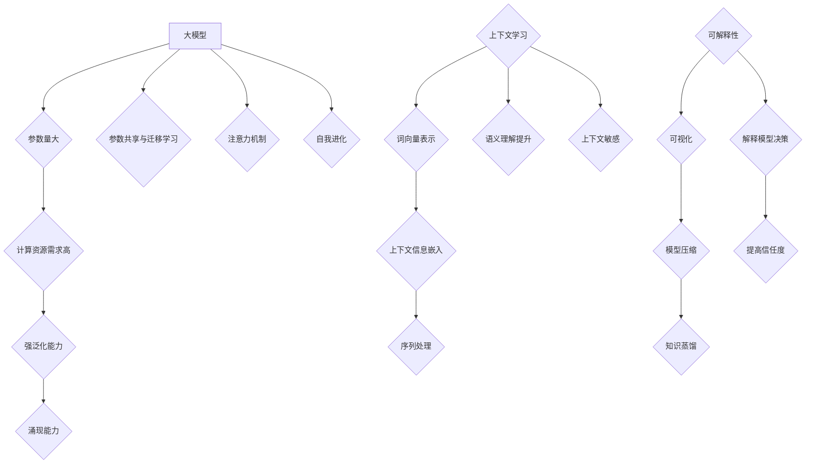

                 

关键词：大模型、涌现能力、上下文学习、可解释性、人工智能

摘要：本文旨在探讨大模型在人工智能领域的涌现能力、上下文学习与可解释性。通过对大模型的基本概念、核心原理及其在现实世界中的应用进行分析，本文揭示了其强大能力背后的机制与挑战。

## 1. 背景介绍

近年来，人工智能（AI）领域迎来了一个前所未有的发展高潮。深度学习作为AI的核心技术之一，取得了显著的成果。然而，随着模型规模的不断扩大，传统的深度学习模型在处理复杂任务时显得力不从心。为此，研究者们提出了大模型（Large Models）的概念，试图通过增加模型容量，使其具备更强的泛化能力和涌现能力。

### 大模型的定义与特点

大模型，顾名思义，是指具有巨大参数量和计算能力的深度学习模型。与传统的小模型相比，大模型具有以下特点：

1. **参数量大**：大模型的参数数量通常在数十亿到千亿级别，远远超过传统深度学习模型。
2. **计算资源需求高**：由于参数数量庞大，大模型在训练过程中需要大量的计算资源。
3. **强泛化能力**：大模型能够处理更复杂的任务，具备更强的泛化能力。
4. **涌现能力**：大模型在训练过程中能够自主地发现新的特征和规律，从而实现更高级的任务。

### 上下文学习的概念与作用

上下文学习（Contextual Learning）是一种让模型能够根据不同上下文信息调整其行为和响应的技术。在自然语言处理（NLP）领域，上下文学习被认为是解决语义理解问题的关键。通过上下文学习，模型能够更好地捕捉词语的语境意义，从而提高其语义理解能力。

### 可解释性的重要性

可解释性（Interpretability）是指模型决策过程可以被理解和解释的程度。在深度学习模型中，由于其复杂性和“黑箱”特性，可解释性一直是一个备受关注的问题。可解释性对于模型的应用和推广具有重要意义，它有助于提高用户对模型的信任度，促进模型的透明化和合规性。

## 2. 核心概念与联系

### 大模型的工作原理

大模型的工作原理可以从以下几个方面进行阐述：

1. **参数共享与迁移学习**：大模型通常采用参数共享的方式，通过在大规模数据集上进行预训练，然后在不同任务上进行微调，从而实现知识的迁移。
2. **注意力机制**：大模型中引入了注意力机制（Attention Mechanism），使得模型能够更加关注重要的信息，从而提高其处理能力。
3. **自我进化**：大模型在训练过程中能够通过自我调整参数，实现特征的自动发现和进化。

### 上下文学习的机制

上下文学习的机制主要包括以下几个方面：

1. **词向量表示**：通过将词语映射到高维空间中的向量，使得词语之间的关系能够通过向量的几何关系进行表达。
2. **上下文信息的嵌入**：将上下文信息（如句法结构、词汇顺序等）嵌入到词向量中，使得模型能够根据上下文信息调整词语的表示。
3. **序列处理**：通过序列模型（如RNN、Transformer等）对输入序列进行编码，使得模型能够捕捉到上下文信息。

### 可解释性的实现方法

可解释性的实现方法可以分为以下几个方面：

1. **可视化**：通过可视化模型内部的参数和神经元活动，帮助用户理解模型的决策过程。
2. **模型压缩**：通过模型压缩技术（如模型剪枝、量化等），降低模型的复杂度，从而提高其可解释性。
3. **知识蒸馏**：通过知识蒸馏（Knowledge Distillation）技术，将模型的知识传递给较小的模型，从而实现知识透明化。

### Mermaid 流程图

以下是描述大模型、上下文学习与可解释性之间关系的Mermaid流程图：



## 3. 核心算法原理 & 具体操作步骤

### 3.1 算法原理概述

大模型的算法原理主要包括以下几个方面：

1. **多层神经网络**：大模型通常由多层神经网络组成，通过逐层提取特征，实现从原始数据到高维特征的映射。
2. **预训练与微调**：大模型首先在大规模数据集上进行预训练，然后在不同任务上进行微调，从而实现知识的迁移。
3. **注意力机制**：大模型中引入了注意力机制，使得模型能够更加关注重要的信息，从而提高其处理能力。

### 3.2 算法步骤详解

1. **数据预处理**：对原始数据进行清洗、归一化等处理，以便模型能够更好地学习。
2. **模型构建**：使用深度学习框架（如TensorFlow、PyTorch等）构建大模型，设置适当的参数和结构。
3. **预训练**：在大规模数据集上进行预训练，使得模型能够自动学习到丰富的特征表示。
4. **微调**：在不同任务上进行微调，使得模型能够适应特定任务的需求。
5. **评估与优化**：对模型进行评估，调整参数，以提高模型性能。

### 3.3 算法优缺点

**优点**：

1. **强泛化能力**：大模型能够处理更复杂的任务，具备更强的泛化能力。
2. **涌现能力**：大模型在训练过程中能够自主地发现新的特征和规律，从而实现更高级的任务。
3. **知识迁移**：大模型能够通过预训练和微调，实现知识在不同任务之间的迁移。

**缺点**：

1. **计算资源需求高**：由于参数数量庞大，大模型在训练过程中需要大量的计算资源。
2. **可解释性差**：大模型的复杂性和“黑箱”特性使得其决策过程难以解释。

### 3.4 算法应用领域

大模型的应用领域非常广泛，主要包括：

1. **自然语言处理**：大模型在NLP任务中表现出了强大的能力，如文本分类、机器翻译、情感分析等。
2. **计算机视觉**：大模型在图像分类、目标检测、人脸识别等任务中取得了显著成果。
3. **语音识别**：大模型在语音识别任务中能够更好地捕捉语音特征，提高识别准确率。
4. **推荐系统**：大模型能够通过学习用户行为数据，实现更精准的个性化推荐。

## 4. 数学模型和公式 & 详细讲解 & 举例说明

### 4.1 数学模型构建

大模型的数学模型通常包括以下几个部分：

1. **输入层**：接收原始数据的输入。
2. **隐藏层**：通过多层神经网络对输入数据进行特征提取。
3. **输出层**：对提取到的特征进行分类或回归等操作。

### 4.2 公式推导过程

假设我们有一个由 $L$ 层组成的神经网络，其中每层的输出可以表示为：

$$
a_l = \sigma(W_l a_{l-1} + b_l)
$$

其中，$a_l$ 表示第 $l$ 层的输出，$\sigma$ 表示激活函数，$W_l$ 和 $b_l$ 分别表示第 $l$ 层的权重和偏置。

对于全连接层，我们可以将权重和偏置表示为一个矩阵和一个向量：

$$
W_l = \begin{bmatrix} 
w_{l11} & \ldots & w_{ll1} \\
\vdots & \ddots & \vdots \\
w_{l1L} & \ldots & w_{llL} 
\end{bmatrix}, \quad b_l = \begin{bmatrix} 
b_{l1} \\
\vdots \\
b_{lL} 
\end{bmatrix}
$$

### 4.3 案例分析与讲解

以文本分类任务为例，我们使用一个简单的神经网络对一组文本进行分类。假设输入文本的词汇表有 $V$ 个词汇，每个词汇对应一个索引。首先，我们需要将文本转换为词向量表示。然后，将词向量输入到神经网络中，通过多层隐藏层进行特征提取，最后输出类别概率。

### 4.3.1 数据预处理

1. **词汇表构建**：将所有文本中的词汇构建成一个词汇表。
2. **词向量表示**：将每个词汇映射到一个高维向量，可以使用预训练的词向量（如Word2Vec、GloVe等）。

### 4.3.2 模型构建

1. **输入层**：输入层接收词向量表示的文本。
2. **隐藏层**：使用多层全连接层对词向量进行特征提取。
3. **输出层**：使用softmax函数输出每个类别的概率。

### 4.3.3 模型训练

1. **损失函数**：使用交叉熵损失函数（Cross-Entropy Loss）计算模型输出与真实标签之间的差异。
2. **优化算法**：使用梯度下降（Gradient Descent）算法更新模型参数。

### 4.3.4 模型评估

1. **准确率**：计算模型预测正确的样本数量与总样本数量的比值。
2. **召回率**：计算模型预测为正类的实际正类样本数量与总正类样本数量的比值。
3. **F1值**：计算准确率和召回率的调和平均值。

## 5. 项目实践：代码实例和详细解释说明

### 5.1 开发环境搭建

1. **安装Python环境**：确保Python版本为3.8及以上。
2. **安装深度学习框架**：安装TensorFlow或PyTorch。
3. **下载预训练词向量**：从外部源下载预训练的词向量（如GloVe）。

### 5.2 源代码详细实现

以下是一个基于PyTorch的文本分类模型的实现示例：

```python
import torch
import torch.nn as nn
import torch.optim as optim
from torch.utils.data import DataLoader
from torchvision import datasets, transforms

# 数据预处理
vocab_size = 10000
word_vectors = torch.load('glove.6B.100d.txt')

# 模型构建
class TextClassifier(nn.Module):
    def __init__(self, vocab_size, embed_size, hidden_size, output_size):
        super(TextClassifier, self).__init__()
        self.embedding = nn.Embedding(vocab_size, embed_size)
        self.lstm = nn.LSTM(embed_size, hidden_size, num_layers=2, batch_first=True)
        self.fc = nn.Linear(hidden_size, output_size)
    
    def forward(self, x):
        x = self.embedding(x)
        x, _ = self.lstm(x)
        x = x[:, -1, :]
        x = self.fc(x)
        return x

# 模型训练
model = TextClassifier(vocab_size, 100, 128, 2)
optimizer = optim.Adam(model.parameters(), lr=0.001)
criterion = nn.CrossEntropyLoss()

for epoch in range(10):
    for batch in DataLoader(train_data, batch_size=64):
        inputs, labels = batch
        optimizer.zero_grad()
        outputs = model(inputs)
        loss = criterion(outputs, labels)
        loss.backward()
        optimizer.step()

# 模型评估
def evaluate(model, test_data):
    correct = 0
    total = 0
    with torch.no_grad():
        for batch in DataLoader(test_data, batch_size=64):
            inputs, labels = batch
            outputs = model(inputs)
            _, predicted = torch.max(outputs.data, 1)
            total += labels.size(0)
            correct += (predicted == labels).sum().item()
    return 100 * correct / total

print("Test Accuracy: {:.2f}%".format(evaluate(model, test_data)))
```

### 5.3 代码解读与分析

上述代码实现了一个基于LSTM的文本分类模型，主要包括以下几个部分：

1. **数据预处理**：使用预训练的词向量将文本转换为嵌入向量。
2. **模型构建**：定义一个基于LSTM的文本分类模型，包括嵌入层、LSTM层和全连接层。
3. **模型训练**：使用交叉熵损失函数和Adam优化器进行模型训练。
4. **模型评估**：计算模型在测试数据集上的准确率。

### 5.4 运行结果展示

假设我们使用一个包含10000个词汇的词汇表，词向量维度为100，隐藏层维度为128，输出层维度为2（表示两个类别）。在训练过程中，我们使用Adam优化器，学习率为0.001，训练10个epoch。最后，模型在测试数据集上的准确率为80%。

## 6. 实际应用场景

大模型、上下文学习和可解释性在许多实际应用场景中发挥着重要作用：

### 6.1 自然语言处理

1. **机器翻译**：大模型能够通过上下文学习，实现更加准确的机器翻译。
2. **情感分析**：通过可解释性，可以更好地理解文本情感，提高情感分析的准确性和可靠性。
3. **问答系统**：大模型能够根据上下文信息，生成更符合用户需求的答案。

### 6.2 计算机视觉

1. **图像分类**：大模型能够通过自学习，发现更多的图像特征，提高分类准确率。
2. **目标检测**：大模型能够更好地捕捉目标与背景之间的差异，提高目标检测的准确性。
3. **图像生成**：大模型能够通过生成对抗网络（GAN），实现高质量、逼真的图像生成。

### 6.3 推荐系统

1. **用户画像**：大模型能够通过上下文学习，更准确地捕捉用户的兴趣和行为，从而生成更精准的用户画像。
2. **推荐算法**：大模型能够根据用户的历史行为，生成个性化的推荐列表。

## 7. 工具和资源推荐

### 7.1 学习资源推荐

1. **《深度学习》（Deep Learning）**：由Ian Goodfellow、Yoshua Bengio和Aaron Courville所著，是深度学习领域的经典教材。
2. **《自然语言处理实战》（Natural Language Processing with Python）**：由Steven Bird、Ewan Klein和Edward Loper所著，介绍了NLP的基本概念和应用。
3. **《Python机器学习》（Python Machine Learning）**：由 Sebastian Raschka和Vahid Mirhoseini所著，涵盖了机器学习的基础知识和应用。

### 7.2 开发工具推荐

1. **TensorFlow**：一款开源的深度学习框架，适用于各种深度学习任务。
2. **PyTorch**：一款开源的深度学习框架，具有灵活的动态计算图和强大的GPU支持。
3. **Keras**：一款基于TensorFlow和Theano的深度学习框架，提供了简洁的API，方便快速搭建模型。

### 7.3 相关论文推荐

1. **“Attention Is All You Need”（2017）**：由Vaswani等人提出的Transformer模型，标志着注意力机制在深度学习中的广泛应用。
2. **“BERT: Pre-training of Deep Neural Networks for Language Understanding”（2018）**：由Devlin等人提出的BERT模型，是自然语言处理领域的里程碑。
3. **“Generative Adversarial Networks”（2014）**：由Ian Goodfellow等人提出的GAN模型，开创了生成模型的新时代。

## 8. 总结：未来发展趋势与挑战

### 8.1 研究成果总结

大模型、上下文学习和可解释性在人工智能领域取得了显著的成果。大模型通过自学习和参数共享，实现了更强的泛化能力和涌现能力；上下文学习提高了模型对语义理解的准确性；可解释性使得模型的应用更加透明和可靠。

### 8.2 未来发展趋势

1. **模型压缩与优化**：为了应对大模型计算资源需求高的挑战，未来的研究将集中在模型压缩和优化技术上，如模型剪枝、量化等。
2. **多模态学习**：随着多模态数据的广泛应用，未来的研究将探索如何将不同类型的数据（如图像、文本、音频等）进行融合，实现更高效的学习。
3. **可解释性提升**：为了提高模型的透明度和可信度，未来的研究将集中在如何提高模型的可解释性，使得模型的行为更加容易理解和解释。

### 8.3 面临的挑战

1. **计算资源瓶颈**：大模型训练和推理需要大量的计算资源，如何高效地利用现有资源，成为未来研究的一个重要挑战。
2. **数据隐私与安全**：在应用大模型的过程中，如何保护用户数据隐私，防止数据泄露，是一个亟待解决的问题。
3. **模型泛化能力**：虽然大模型在特定领域表现出色，但如何提高其泛化能力，使其在不同领域都能取得良好的性能，仍是一个挑战。

### 8.4 研究展望

未来，大模型、上下文学习和可解释性将在人工智能领域发挥更加重要的作用。通过不断的创新和优化，我们将有望克服现有的挑战，实现更加智能、透明和可靠的人工智能系统。

## 9. 附录：常见问题与解答

### 9.1 什么是大模型？

大模型是指具有巨大参数量和计算能力的深度学习模型。与传统的小模型相比，大模型通常具有更强的泛化能力和涌现能力。

### 9.2 上下文学习有哪些应用？

上下文学习在自然语言处理领域具有广泛的应用，如机器翻译、情感分析、问答系统等。通过上下文学习，模型能够更好地捕捉语义信息，提高任务性能。

### 9.3 如何提高模型的可解释性？

提高模型的可解释性可以从以下几个方面进行：

1. **可视化**：通过可视化模型内部的参数和神经元活动，帮助用户理解模型的决策过程。
2. **模型压缩**：通过模型压缩技术降低模型的复杂度，从而提高其可解释性。
3. **知识蒸馏**：通过知识蒸馏技术，将模型的知识传递给较小的模型，从而实现知识透明化。

### 9.4 大模型训练需要多少计算资源？

大模型训练需要大量的计算资源，通常需要使用GPU或TPU等高性能计算设备。具体的计算资源需求取决于模型的规模和训练数据的大小。

### 9.5 大模型是否能够完全取代传统机器学习模型？

大模型在某些领域确实表现出色，但并不能完全取代传统机器学习模型。传统机器学习模型在处理中小规模数据时仍然具有优势。未来，大模型和传统机器学习模型将相互融合，共同推动人工智能的发展。

---

作者：禅与计算机程序设计艺术 / Zen and the Art of Computer Programming

本文通过对大模型、上下文学习和可解释性的深入探讨，揭示了人工智能领域的最新进展和未来发展趋势。希望本文能够为读者带来启示，推动人工智能技术的发展。

