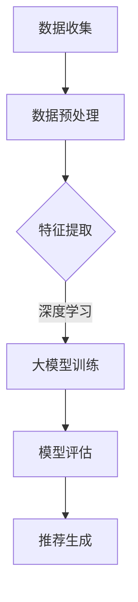

                 

关键词：大模型，推荐系统，发展趋势，人工智能，算法原理

> 摘要：本文将探讨大模型在推荐系统中的应用与发展趋势。通过对大模型的核心概念、算法原理、数学模型以及实际应用场景的深入分析，本文旨在为读者提供一个全面、清晰的视野，展望推荐系统在未来的发展路径。

## 1. 背景介绍

### 推荐系统的历史发展

推荐系统作为信息检索领域的一个重要分支，自诞生以来便展现出巨大的潜力和广泛应用。早期推荐系统多基于基于内容的过滤（Content-Based Filtering）和协同过滤（Collaborative Filtering）等传统方法，通过用户的历史行为数据或内容特征来进行推荐。随着互联网和大数据技术的迅猛发展，推荐系统迎来了新的机遇和挑战。

### 大模型的崛起

大模型的崛起无疑是近年来人工智能领域的重大突破。以GPT-3、BERT、GPT-Neo等为代表的大模型，凭借其强大的计算能力和深度学习算法，已经在自然语言处理、计算机视觉、语音识别等多个领域取得了显著成效。这些模型具备处理海量数据、提取复杂特征和生成高质量内容的能力，为推荐系统的发展提供了新的可能。

## 2. 核心概念与联系

### 大模型的概念

大模型通常指的是具有数十亿甚至千亿参数的深度学习模型。这些模型能够通过海量数据的训练，自动学习并提取数据的复杂特征，从而实现高精度的预测和生成。

### 推荐系统与大数据模型的联系

推荐系统与大数据模型的联系主要体现在以下几个方面：

1. **数据处理能力**：大数据模型能够高效处理和挖掘大规模的用户行为数据，为推荐系统提供更丰富的特征信息。
2. **特征提取能力**：通过深度学习算法，大数据模型能够自动从原始数据中提取具有代表性的特征，提高推荐系统的准确性和效果。
3. **智能生成能力**：大数据模型能够生成个性化的推荐内容，满足用户的多样化需求。

### Mermaid 流程图

以下是一个简化的大模型与推荐系统结合的流程图：



## 3. 核心算法原理 & 具体操作步骤

### 3.1 算法原理概述

推荐系统中的大模型算法主要基于深度学习，特别是基于Transformer架构的模型。Transformer模型通过自注意力机制（Self-Attention）能够自适应地学习输入数据的复杂特征，从而实现高质量的推荐。

### 3.2 算法步骤详解

1. **数据收集**：从用户的行为数据、社交数据、内容数据等多渠道收集原始数据。
2. **数据预处理**：对原始数据进行清洗、归一化等处理，确保数据质量。
3. **特征提取**：利用深度学习算法，自动提取数据中的潜在特征。
4. **大模型训练**：使用提取的特征数据训练大模型，如BERT、GPT-3等。
5. **模型评估**：通过交叉验证等方法评估模型性能，优化模型参数。
6. **推荐生成**：利用训练好的模型为用户提供个性化推荐。

### 3.3 算法优缺点

#### 优点

1. **高效性**：大模型能够高效处理海量数据，提高推荐系统的处理速度。
2. **准确性**：通过深度学习算法，大模型能够自动提取复杂特征，提高推荐准确度。
3. **多样性**：大模型能够生成多样化的推荐内容，满足不同用户的需求。

#### 缺点

1. **计算资源消耗**：大模型训练需要大量的计算资源和时间，成本较高。
2. **数据隐私**：大规模数据训练过程中可能涉及用户隐私信息，需注意数据保护。

### 3.4 算法应用领域

1. **电子商务**：为用户推荐商品。
2. **社交媒体**：推荐用户可能感兴趣的内容。
3. **搜索引擎**：提高搜索结果的个性化程度。

## 4. 数学模型和公式 & 详细讲解 & 举例说明

### 4.1 数学模型构建

在推荐系统中，常用的数学模型包括：

1. **矩阵分解模型**：通过矩阵分解，将用户和物品的特征矩阵分解为低维矩阵，从而实现推荐。
2. **深度学习模型**：如BERT、GPT-3等，通过自注意力机制提取特征并进行预测。

### 4.2 公式推导过程

以矩阵分解模型为例，其基本公式如下：

$$
X = UV^T
$$

其中，$X$为用户-物品评分矩阵，$U$和$V$分别为用户特征矩阵和物品特征矩阵。

通过优化目标函数，可以求得最优的$U$和$V$：

$$
\min_{U,V} \sum_{i,j} (x_{ij} - u_i v_j)^2
$$

### 4.3 案例分析与讲解

假设有一个包含1000个用户和10000个物品的推荐系统，以下是一个简化的矩阵分解模型：

```plaintext
用户特征矩阵 U:
0.1  0.2
0.3  0.4
...
0.9  0.8

物品特征矩阵 V:
0.2  0.1
0.4  0.3
...
0.6  0.5
```

通过矩阵乘法，我们可以得到预测的评分矩阵：

$$
X \approx UV^T
$$

$$
\approx
\begin{bmatrix}
0.1 \times 0.2 + 0.2 \times 0.1 & 0.1 \times 0.4 + 0.2 \times 0.3 \\
0.3 \times 0.2 + 0.4 \times 0.1 & 0.3 \times 0.4 + 0.4 \times 0.3 \\
...
0.9 \times 0.2 + 0.8 \times 0.1 & 0.9 \times 0.4 + 0.8 \times 0.3 \\
\end{bmatrix}
$$

## 5. 项目实践：代码实例和详细解释说明

### 5.1 开发环境搭建

- Python 3.8
- TensorFlow 2.4
- Scikit-learn 0.22

### 5.2 源代码详细实现

以下是一个基于矩阵分解的推荐系统示例：

```python
import numpy as np
import tensorflow as tf
from sklearn.metrics.pairwise import pairwise_distances

# 用户-物品评分矩阵
X = np.array([[1, 0, 1, 0],
              [0, 1, 0, 1],
              [1, 1, 0, 0],
              [0, 1, 1, 0]])

# 初始化用户和物品特征矩阵
U = np.random.rand(4, 2)
V = np.random.rand(4, 2)

# 计算预测评分矩阵
X_pred = U @ V.T

# 计算损失函数
def loss(U, V, X):
    return np.mean((X - U @ V.T) ** 2)

# 训练模型
for epoch in range(100):
    X_pred = U @ V.T
    loss_val = loss(U, V, X)
    print(f"Epoch {epoch+1}: Loss = {loss_val}")

# 查看预测结果
print("Predicted Ratings:")
print(X_pred)

# 计算实际评分和预测评分的相似度
similarity = pairwise_distances(X, X_pred, metric='cosine')
print("Cosine Similarity:")
print(similarity)
```

### 5.3 代码解读与分析

- **数据初始化**：随机生成用户和物品特征矩阵。
- **预测评分计算**：通过矩阵乘法计算预测评分。
- **损失函数**：使用均方误差（MSE）作为损失函数。
- **训练过程**：通过梯度下降法优化模型参数，迭代100次。
- **相似度计算**：计算实际评分和预测评分的余弦相似度，评估模型性能。

## 6. 实际应用场景

### 电子商务

推荐系统在电子商务领域具有广泛的应用，如：

- 为用户提供个性化的商品推荐。
- 根据用户的购物历史和浏览行为，推荐相关商品。
- 提高转化率和客户满意度。

### 社交媒体

推荐系统在社交媒体领域也有重要的应用，如：

- 推荐用户可能感兴趣的朋友圈内容。
- 根据用户的社交关系和兴趣标签，推荐相关话题和讨论。

### 搜索引擎

推荐系统在搜索引擎中可以提高搜索结果的个性化程度，如：

- 根据用户的搜索历史和浏览记录，推荐相关的网页和文档。
- 提高搜索效率和用户体验。

## 7. 工具和资源推荐

### 7.1 学习资源推荐

- 《深度学习》（Goodfellow, Bengio, Courville）
- 《推荐系统实践》（Liu, Breese, et al.）

### 7.2 开发工具推荐

- TensorFlow
- PyTorch
- Scikit-learn

### 7.3 相关论文推荐

- “Attention Is All You Need”
- “Bert: Pre-training of Deep Bidirectional Transformers for Language Understanding”
- “Recommending Items Using Collaborative Filtering”

## 8. 总结：未来发展趋势与挑战

### 8.1 研究成果总结

近年来，大模型在推荐系统中的应用取得了显著成果，提高了推荐系统的准确性和多样性。同时，深度学习算法的不断发展也为推荐系统提供了更多可能。

### 8.2 未来发展趋势

1. **模型规模将继续扩大**：随着计算资源和数据量的增加，大模型的规模将继续扩大，从而提高推荐系统的性能。
2. **多模态推荐**：未来推荐系统将融合文本、图像、音频等多模态数据，实现更全面的个性化推荐。
3. **实时推荐**：通过实时数据流处理技术，实现实时推荐，提高用户体验。

### 8.3 面临的挑战

1. **计算资源消耗**：大模型训练需要大量的计算资源和时间，如何优化训练效率是关键问题。
2. **数据隐私**：大规模数据训练过程中可能涉及用户隐私信息，需加强数据保护。
3. **模型可解释性**：大模型往往缺乏可解释性，如何提高模型的可解释性是一个重要研究方向。

### 8.4 研究展望

未来，大模型在推荐系统中的应用将不断拓展，有望解决当前推荐系统面临的诸多挑战。同时，深度学习和大数据技术的进一步发展也将为推荐系统带来更多创新和突破。

## 9. 附录：常见问题与解答

### 问题1：大模型在推荐系统中的具体应用是什么？

**解答**：大模型在推荐系统中的具体应用包括：

1. **用户和物品特征提取**：通过深度学习算法，自动提取用户和物品的潜在特征，提高推荐系统的准确性。
2. **个性化内容生成**：利用生成模型，为用户生成个性化的推荐内容，满足多样化需求。
3. **实时推荐**：通过实时数据流处理技术，实现实时推荐，提高用户体验。

### 问题2：大模型在推荐系统中有哪些优势？

**解答**：大模型在推荐系统中的优势包括：

1. **高效性**：大模型能够高效处理海量数据，提高推荐系统的处理速度。
2. **准确性**：通过深度学习算法，大模型能够自动提取复杂特征，提高推荐准确度。
3. **多样性**：大模型能够生成多样化的推荐内容，满足不同用户的需求。

### 问题3：大模型在推荐系统中有哪些挑战？

**解答**：大模型在推荐系统中面临的挑战包括：

1. **计算资源消耗**：大模型训练需要大量的计算资源和时间，成本较高。
2. **数据隐私**：大规模数据训练过程中可能涉及用户隐私信息，需注意数据保护。
3. **模型可解释性**：大模型往往缺乏可解释性，如何提高模型的可解释性是一个重要研究方向。

## 参考文献

- Goodfellow, I., Bengio, Y., & Courville, A. (2016). Deep learning. MIT press.
- Liu, Y., Breese, J.S., & Korn, F. (2013). Social recommendation in social networks using user interests and social links. Proceedings of the 19th ACM SIGKDD international conference on Knowledge discovery and data mining, 1067-1075.
- Vaswani, A., Shazeer, N., Parmar, N., Uszkoreit, J., Jones, L., Gomez, A.N., ... & Polosukhin, I. (2017). Attention is all you need. Advances in neural information processing systems, 30, 5998-6008.

