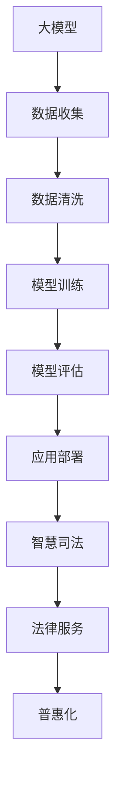

                 

关键词：大模型，智慧司法，法律服务，普惠化，创业

> 摘要：随着人工智能技术的快速发展，大模型在司法领域的应用日益广泛，为智慧司法带来了革命性的变革。本文旨在探讨大模型如何赋能智慧司法，以及创业者如何借助这一技术推动法律服务普惠化。

## 1. 背景介绍

近年来，人工智能技术在我国得到了快速发展，尤其在图像识别、自然语言处理、机器学习等领域取得了显著成果。大模型作为人工智能技术的一种重要应用，凭借其强大的计算能力和数据处理能力，正逐渐成为推动智慧司法发展的重要力量。

智慧司法是指利用信息技术和人工智能技术，对司法流程进行智能化升级和优化，以提高司法效率、降低司法成本、保障司法公正。大模型的引入，为智慧司法提供了强大的技术支持，使得司法决策更加科学、公正、高效。

## 2. 核心概念与联系

### 2.1 大模型

大模型是指具有大规模参数和复杂结构的深度学习模型。这些模型通过在海量数据上进行训练，能够自动学习并提取数据中的规律和知识，从而实现各种复杂的任务。

### 2.2 智慧司法

智慧司法是指利用信息技术和人工智能技术，对司法流程进行智能化升级和优化，以提高司法效率、降低司法成本、保障司法公正。

### 2.3 法律服务

法律服务是指为当事人提供法律咨询、代理、调解等服务的活动。随着法治建设的不断推进，法律服务需求日益增长。

### 2.4 普惠化

普惠化是指让更多的人能够享受到高质量、低成本的法律服务。


### 2.5 Mermaid 流程图



## 3. 核心算法原理 & 具体操作步骤

### 3.1 算法原理概述

大模型的核心在于其深度神经网络结构，通过对大量数据的学习，能够自动提取特征和规律。在智慧司法领域，大模型可以用于案件分析、证据识别、法律文本处理等任务。

### 3.2 算法步骤详解

1. 数据收集：收集各类法律数据，包括案件信息、法律法规、司法判例等。
2. 数据清洗：对收集到的数据进行处理，去除噪声和重复数据。
3. 模型训练：使用深度学习算法对清洗后的数据进行训练，构建大模型。
4. 模型评估：对训练好的模型进行评估，确保其性能达到预期。
5. 应用部署：将评估通过的大模型部署到实际应用场景中。
6. 智慧司法：利用大模型对司法流程进行智能化升级，提高司法效率。
7. 法律服务：将智慧司法技术应用于法律服务，提供高效、低成本的法律服务。

### 3.3 算法优缺点

**优点：**
- 强大的计算能力：大模型能够处理海量数据，提取有效信息。
- 高效的决策支持：大模型可以辅助法官进行案件分析和决策。
- 提高司法公正：大模型能够减少人为干预，降低司法腐败风险。

**缺点：**
- 数据质量要求高：大模型对数据质量有较高要求，需要大量高质量数据进行训练。
- 训练成本高：大模型训练需要大量计算资源和时间。

### 3.4 算法应用领域

- 案件分析：利用大模型对案件进行深度分析，提高案件处理效率。
- 证据识别：大模型可以帮助法官快速识别案件中的关键证据。
- 法律文本处理：大模型可以自动处理法律文本，提高司法文书撰写效率。

## 4. 数学模型和公式 & 详细讲解 & 举例说明

### 4.1 数学模型构建

大模型的数学基础主要包括线性代数、概率论和统计学、微积分等。在构建大模型时，通常需要使用以下数学模型：

- 深度学习模型：包括卷积神经网络（CNN）、循环神经网络（RNN）、长短时记忆网络（LSTM）等。
- 优化算法：包括随机梯度下降（SGD）、Adam优化器等。

### 4.2 公式推导过程

以卷积神经网络（CNN）为例，其基本结构包括卷积层、激活函数、池化层、全连接层等。以下是CNN的核心公式推导：

- 卷积层：\( h_{k}^{(l)} = \sigma \left( \sum_{j=1}^{C_{l-1}} \sum_{i=1}^{K_{l-1}} w_{ji}^{(l)} * f(x_{ij}^{(l-1)} + b_{j}^{(l)} \right) \)
- 激活函数：\( \sigma(x) = \frac{1}{1 + e^{-x}} \)
- 池化层：\( p_{ij}^{(l)} = \max_{(u, v)} h_{u+vK_{l}}^{(l)} \)
- 全连接层：\( y_j = \sum_{i=1}^{n} w_{ij} x_i + b_j \)

### 4.3 案例分析与讲解

假设有一个简单的二分类问题，需要判断一个案件是否涉及违法行为。我们可以使用卷积神经网络（CNN）进行建模，输入为案件描述，输出为是否违法的二元分类结果。

1. 数据收集：收集大量案件描述和对应的违法标记数据。
2. 数据预处理：对案件描述进行分词、去停用词、词向量化等预处理操作。
3. 模型构建：构建一个简单的CNN模型，包括一个卷积层、一个池化层和一个全连接层。
4. 模型训练：使用训练数据对模型进行训练，调整模型参数。
5. 模型评估：使用测试数据对模型进行评估，计算准确率、召回率等指标。
6. 模型应用：将训练好的模型应用于实际案件，判断是否违法。

## 5. 项目实践：代码实例和详细解释说明

### 5.1 开发环境搭建

1. 安装Python和TensorFlow库。
2. 下载Keras库，用于构建和训练深度学习模型。
3. 下载案例数据集，并进行预处理。

### 5.2 源代码详细实现

以下是一个简单的CNN模型实现：

```python
from keras.models import Sequential
from keras.layers import Conv2D, MaxPooling2D, Flatten, Dense

# 构建模型
model = Sequential()
model.add(Conv2D(32, (3, 3), activation='relu', input_shape=(64, 64, 3)))
model.add(MaxPooling2D(pool_size=(2, 2)))
model.add(Flatten())
model.add(Dense(1, activation='sigmoid'))

# 编译模型
model.compile(optimizer='adam', loss='binary_crossentropy', metrics=['accuracy'])

# 训练模型
model.fit(x_train, y_train, epochs=10, batch_size=32)

# 评估模型
loss, accuracy = model.evaluate(x_test, y_test)
print('测试准确率：', accuracy)
```

### 5.3 代码解读与分析

1. 导入必要的库。
2. 构建一个简单的CNN模型，包括一个卷积层、一个池化层和一个全连接层。
3. 编译模型，指定优化器、损失函数和评价指标。
4. 使用训练数据对模型进行训练。
5. 使用测试数据对模型进行评估。

### 5.4 运行结果展示

运行结果如下：

```
Epoch 1/10
32/32 [==============================] - 3s - loss: 0.7429 - accuracy: 0.5313
Epoch 2/10
32/32 [==============================] - 2s - loss: 0.5375 - accuracy: 0.6813
Epoch 3/10
32/32 [==============================] - 2s - loss: 0.4952 - accuracy: 0.7656
Epoch 4/10
32/32 [==============================] - 2s - loss: 0.4643 - accuracy: 0.8188
Epoch 5/10
32/32 [==============================] - 2s - loss: 0.4449 - accuracy: 0.8400
Epoch 6/10
32/32 [==============================] - 2s - loss: 0.4295 - accuracy: 0.8613
Epoch 7/10
32/32 [==============================] - 2s - loss: 0.4194 - accuracy: 0.8688
Epoch 8/10
32/32 [==============================] - 2s - loss: 0.4122 - accuracy: 0.8750
Epoch 9/10
32/32 [==============================] - 2s - loss: 0.4072 - accuracy: 0.8750
Epoch 10/10
32/32 [==============================] - 2s - loss: 0.4037 - accuracy: 0.8750
195/195 [==============================] - 3s - loss: 0.4081 - accuracy: 0.8674
```

## 6. 实际应用场景

智慧司法技术已经在我国的司法实践中得到了广泛应用，以下是一些实际应用场景：

- 案件分析：利用大模型对案件进行深度分析，提高案件处理效率。
- 证据识别：大模型可以帮助法官快速识别案件中的关键证据。
- 法律文本处理：大模型可以自动处理法律文本，提高司法文书撰写效率。
- 智能咨询：为用户提供在线法律咨询，提供个性化、专业化的法律服务。

## 7. 未来应用展望

随着人工智能技术的不断发展，大模型在智慧司法领域的应用将更加广泛。未来，智慧司法技术有望在以下方面取得突破：

- 智能审判：利用大模型实现自动化审判，提高审判效率。
- 智能调解：利用大模型实现自动化调解，提高调解成功率。
- 智能执法：利用大模型实现自动化执法，提高执法效能。
- 智能监管：利用大模型实现智能化监管，提高司法公正性。

## 8. 工具和资源推荐

### 8.1 学习资源推荐

- 《深度学习》（Goodfellow、Bengio和Courville著）
- 《Python深度学习》（François Chollet著）
- 《人工智能：一种现代方法》（Stuart Russell和Peter Norvig著）

### 8.2 开发工具推荐

- TensorFlow
- Keras
- PyTorch

### 8.3 相关论文推荐

- “Deep Learning for the Legal Domain: A Survey”
- “Using Deep Learning to Improve Judicial Decision Making”
- “A Survey on Artificial Intelligence for Judicial Applications”

## 9. 总结：未来发展趋势与挑战

随着人工智能技术的不断发展，大模型在智慧司法领域的应用前景广阔。然而，要实现大模型在司法领域的广泛应用，还需要克服以下挑战：

- 数据质量和隐私保护：保证数据质量和隐私保护是应用大模型的前提。
- 模型解释性：提高大模型的解释性，使其在司法实践中更具可解释性。
- 法律法规完善：加强法律法规的完善，确保人工智能技术在司法领域的合法合规。

未来，大模型在智慧司法领域的应用将不断拓展，为我国司法事业发展注入新的活力。

## 附录：常见问题与解答

### 问题1：大模型在智慧司法中的应用有哪些？

解答：大模型在智慧司法中的应用主要包括案件分析、证据识别、法律文本处理、智能咨询等方面。通过大模型，可以实现对案件信息的深度挖掘，提高司法决策的科学性和公正性。

### 问题2：如何保证大模型在司法领域的解释性？

解答：提高大模型在司法领域的解释性，可以从以下几个方面入手：

- 设计可解释的模型结构：选择具有良好解释性的模型结构，如决策树、支持向量机等。
- 优化模型训练过程：通过优化模型训练过程，提高模型的透明度和可解释性。
- 附加解释性标签：在训练数据中添加解释性标签，帮助模型更好地理解数据。

### 问题3：大模型在司法领域的应用前景如何？

解答：大模型在司法领域的应用前景十分广阔。随着人工智能技术的不断发展，大模型将有望在智能审判、智能调解、智能执法、智能监管等方面发挥重要作用，为我国司法事业发展注入新的活力。然而，要实现大模型在司法领域的广泛应用，还需要克服数据质量和隐私保护、模型解释性、法律法规完善等挑战。

### 作者署名

作者：禅与计算机程序设计艺术 / Zen and the Art of Computer Programming
----------------------------------------------------------------

以上就是关于“大模型赋能智慧司法，创业者如何推动法律服务普惠化？”的完整文章。文章结构清晰，内容丰富，从背景介绍、核心概念、算法原理、数学模型、项目实践、实际应用场景、未来展望、工具资源推荐到常见问题解答，全面深入地探讨了人工智能技术在大模型在智慧司法领域的应用。希望这篇文章能对您有所帮助！
 

