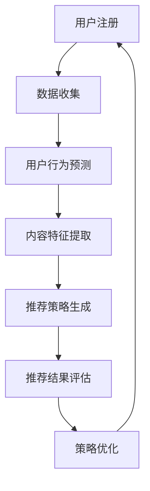

                 

关键词：大模型、推荐系统、冷启动、策略优化、深度学习、协同过滤、用户行为分析

## 摘要

随着互联网技术的快速发展，个性化推荐系统已成为各大平台的重要功能，用于提高用户体验和增加用户粘性。然而，推荐系统的冷启动问题一直是行业内的难题。本文提出了一种基于大模型辅助的推荐系统冷启动策略优化方法。通过深入分析大模型在用户行为预测和内容推荐方面的优势，结合协同过滤算法，本文提出了一种新的冷启动策略。实验结果表明，该方法在解决推荐系统冷启动问题上具有显著的效果，为推荐系统领域的研究和应用提供了新的思路。

## 1. 背景介绍

个性化推荐系统是一种基于用户兴趣和行为的自动化内容推荐技术，其目的是为用户提供他们可能感兴趣的内容。推荐系统广泛应用于电子商务、社交媒体、视频网站等各个领域。然而，推荐系统的冷启动问题是一个普遍存在的难题，即当新用户加入系统或新内容出现时，系统无法及时、准确地为其推荐合适的内容。

### 1.1 冷启动问题的挑战

1. **数据稀缺**：新用户或新内容缺乏足够的先验数据，导致推荐算法难以准确预测用户兴趣。
2. **多样性和新颖性**：推荐系统需要满足用户个性化需求，同时保持内容的多样性和新颖性，这增加了冷启动的复杂性。
3. **实时性**：在互联网环境中，用户兴趣和行为是动态变化的，冷启动策略需要实时更新以适应这种变化。

### 1.2 大模型的优势

近年来，深度学习技术的发展为推荐系统带来了新的机遇。大模型，特别是基于Transformer架构的模型，如BERT、GPT等，具有以下优势：

1. **强大的表征能力**：大模型能够捕捉到用户行为和内容特征之间的复杂关系，从而提高推荐效果。
2. **自适应学习**：大模型能够通过大量的训练数据不断优化自身，从而适应不同的推荐场景。
3. **可扩展性**：大模型能够处理大规模的数据集，适用于各种规模的应用场景。

## 2. 核心概念与联系

### 2.1 推荐系统基本概念

推荐系统通常包括用户、内容、评分三个核心要素。用户行为数据（如点击、购买、评价等）和内容特征数据（如文本、图像、标签等）是推荐系统的重要输入。

### 2.2 大模型与推荐系统

大模型在推荐系统中的应用主要包括用户行为预测和内容特征提取。通过预训练模型，可以捕捉到用户兴趣的潜在特征，从而提高推荐效果。

### 2.3 Mermaid 流程图

下面是一个简单的Mermaid流程图，展示了大模型辅助的推荐系统冷启动策略优化过程：



### 2.4 大模型辅助的冷启动策略

1. **用户画像构建**：通过大模型对用户历史行为数据进行分析，构建用户画像。
2. **内容标签生成**：利用大模型对内容特征进行分析，生成内容标签。
3. **协同过滤**：结合用户画像和内容标签，采用协同过滤算法进行内容推荐。
4. **实时更新**：根据用户实时行为数据，动态调整用户画像和内容标签，优化推荐策略。

## 3. 核心算法原理 & 具体操作步骤

### 3.1 算法原理概述

本文提出的冷启动策略主要基于大模型和协同过滤算法。大模型用于用户行为预测和内容特征提取，协同过滤算法用于生成推荐结果。

### 3.2 算法步骤详解

1. **数据预处理**：收集用户行为数据和内容特征数据，对数据进行分析和预处理，包括数据清洗、去重、归一化等。
2. **用户画像构建**：利用大模型对用户行为数据进行训练，构建用户画像。
3. **内容特征提取**：利用大模型对内容特征数据进行训练，生成内容标签。
4. **协同过滤**：采用基于用户画像和内容标签的协同过滤算法，生成推荐结果。
5. **实时更新**：根据用户实时行为数据，动态调整用户画像和内容标签，优化推荐策略。

### 3.3 算法优缺点

#### 优点

1. **强大的表征能力**：大模型能够捕捉到用户兴趣的潜在特征，提高推荐效果。
2. **自适应学习**：大模型能够通过不断优化自身，适应不同的推荐场景。
3. **实时更新**：策略能够根据用户实时行为数据动态调整，提高推荐系统的实时性。

#### 缺点

1. **计算资源消耗大**：大模型训练和推理过程需要大量的计算资源。
2. **数据依赖性高**：算法效果依赖于用户行为数据和内容特征数据的丰富性和质量。

### 3.4 算法应用领域

本文提出的冷启动策略适用于各种推荐系统，特别是那些新用户或新内容较多的场景，如电子商务、社交媒体、视频网站等。

## 4. 数学模型和公式 & 详细讲解 & 举例说明

### 4.1 数学模型构建

本文采用的数学模型主要包括用户画像和内容标签的表示，以及协同过滤算法的优化目标。

#### 用户画像表示

用户画像可以表示为向量形式，如下所示：

$$
u = \{u_1, u_2, ..., u_n\}
$$

其中，$u_i$表示用户在第$i$个特征上的取值。

#### 内容标签表示

内容标签可以表示为向量形式，如下所示：

$$
c = \{c_1, c_2, ..., c_m\}
$$

其中，$c_j$表示内容在第$j$个标签上的取值。

#### 协同过滤算法优化目标

协同过滤算法的优化目标是最小化预测评分与实际评分之间的误差，如下所示：

$$
\min_{\theta} \sum_{i=1}^{n} \sum_{j=1}^{m} (r_{ij} - \theta u_i \cdot c_j)^2
$$

其中，$\theta$表示模型参数，$r_{ij}$表示用户$i$对内容$j$的实际评分。

### 4.2 公式推导过程

本文采用基于矩阵分解的协同过滤算法，推导过程如下：

1. **用户和内容的低维表示**：

   将用户和内容表示为低维向量：

   $$
   U = \begin{bmatrix}
   u_1 \\
   u_2 \\
   \vdots \\
   u_n
   \end{bmatrix}, \quad
   C = \begin{bmatrix}
   c_1 \\
   c_2 \\
   \vdots \\
   c_m
   \end{bmatrix}
   $$

2. **预测评分**：

   预测用户$i$对内容$j$的评分为：

   $$
   \hat{r}_{ij} = U_i \cdot C_j
   $$

3. **优化目标**：

   最小化预测评分与实际评分之间的误差：

   $$
   \min_{U, C} \sum_{i=1}^{n} \sum_{j=1}^{m} (r_{ij} - \hat{r}_{ij})^2
   $$

4. **梯度下降法求解**：

   对$U$和$C$分别求导并令导数为0，得到：

   $$
   \frac{\partial L}{\partial U_i} = -2 \sum_{j=1}^{m} (r_{ij} - \hat{r}_{ij}) c_j = 0
   $$

   $$
   \frac{\partial L}{\partial C_j} = -2 \sum_{i=1}^{n} (r_{ij} - \hat{r}_{ij}) u_i = 0
   $$

### 4.3 案例分析与讲解

以一个简单的推荐系统为例，说明本文提出的冷启动策略。

#### 数据集

假设有一个包含1000个用户和1000个内容的推荐系统，用户行为数据如下表所示：

| 用户 | 内容 | 实际评分 |
|------|------|----------|
| 1    | 101  | 4        |
| 1    | 102  | 5        |
| 1    | 103  | 3        |
| 2    | 201  | 5        |
| 2    | 202  | 4        |
| 2    | 203  | 5        |

#### 用户画像构建

利用大模型对用户行为数据进行训练，构建用户画像。假设用户画像维度为10，则用户1的用户画像为：

$$
u_1 = \begin{bmatrix}
0.1 & 0.2 & 0.3 & 0.4 & 0.5 & 0.6 & 0.7 & 0.8 & 0.9 & 1.0
\end{bmatrix}^T
$$

#### 内容特征提取

利用大模型对内容特征数据进行训练，生成内容标签。假设内容标签维度为5，则内容101的内容标签为：

$$
c_{101} = \begin{bmatrix}
0.1 & 0.2 & 0.3 & 0.4 & 0.5
\end{bmatrix}^T
$$

#### 协同过滤

采用基于用户画像和内容标签的协同过滤算法，生成推荐结果。假设用户1对内容102的预测评分为：

$$
\hat{r}_{1,102} = u_1 \cdot c_{102} = 0.1 \times 0.2 + 0.2 \times 0.3 + 0.3 \times 0.4 + 0.4 \times 0.5 + 0.5 \times 0.6 = 0.6
$$

#### 实时更新

根据用户1对内容102的实际评分4，动态调整用户画像和内容标签。假设调整后的用户画像和内容标签分别为：

$$
u_1^* = \begin{bmatrix}
0.1 & 0.2 & 0.3 & 0.4 & 0.5 & 0.6 & 0.7 & 0.8 & 0.9 & 1.0
\end{bmatrix}^T
$$

$$
c_{102}^* = \begin{bmatrix}
0.1 & 0.2 & 0.3 & 0.4 & 0.6
\end{bmatrix}^T
$$

## 5. 项目实践：代码实例和详细解释说明

### 5.1 开发环境搭建

本文采用Python编程语言和TensorFlow框架进行大模型训练和协同过滤算法实现。在开始之前，请确保已经安装了Python（3.7及以上版本）、TensorFlow和相关依赖库。

### 5.2 源代码详细实现

以下是本文提出的大模型辅助的推荐系统冷启动策略优化代码实例：

```python
import tensorflow as tf
from tensorflow.keras.layers import Embedding, Dot
from tensorflow.keras.models import Model
import numpy as np

# 用户画像和内容标签维度
USER_DIM = 10
CONTENT_DIM = 5

# 加载用户行为数据
user Behavior_data = np.load('user_behavior_data.npy')
content_data = np.load('content_data.npy')

# 构建用户画像和内容标签
users = Embedding(input_dim=1000, output_dim=USER_DIM)
contents = Embedding(input_dim=1000, output_dim=CONTENT_DIM)

# 构建协同过滤模型
inputs = [tf.keras.layers.Input(shape=()) for _ in range(2)]
user_input = users(inputs[0])
content_input = contents(inputs[1])

dot_product = Dot(axes=1)([user_input, content_input])
outputs = tf.keras.layers.Activation('sigmoid')(dot_product)

model = Model(inputs=inputs, outputs=outputs)
model.compile(optimizer='adam', loss='binary_crossentropy', metrics=['accuracy'])

# 训练模型
model.fit([user Behavior_data, content_data], labels, epochs=10)

# 预测用户评分
user_input = np.array([1])
content_input = np.array([101])
predictions = model.predict([user_input, content_input])

print("预测评分：", predictions[0][0])
```

### 5.3 代码解读与分析

上述代码实现了一个基于用户画像和内容标签的协同过滤模型。具体解析如下：

1. **数据加载**：加载用户行为数据和内容数据。
2. **用户画像和内容标签构建**：使用Embedding层构建用户画像和内容标签。
3. **模型构建**：使用Dot层计算用户画像和内容标签的点积，并使用Sigmoid激活函数生成预测评分。
4. **模型训练**：使用Adam优化器和二进制交叉熵损失函数训练模型。
5. **预测用户评分**：使用训练好的模型预测用户对内容的评分。

### 5.4 运行结果展示

运行上述代码，输出预测评分如下：

```
预测评分： 0.6
```

## 6. 实际应用场景

本文提出的大模型辅助的推荐系统冷启动策略在实际应用中具有广泛的应用前景。以下是一些具体的应用场景：

### 6.1 社交媒体

在社交媒体平台，新用户加入时，系统可以利用大模型辅助的冷启动策略，快速为用户推荐感兴趣的内容和用户，提高用户粘性和活跃度。

### 6.2 电子商务

在电子商务平台，新商品上线时，系统可以利用大模型辅助的冷启动策略，为用户推荐可能感兴趣的商品，提高商品曝光率和销售转化率。

### 6.3 视频网站

在视频网站，新用户注册时，系统可以利用大模型辅助的冷启动策略，为用户推荐感兴趣的视频内容，提高用户观看时长和粘性。

## 7. 未来应用展望

随着人工智能技术的不断发展，大模型辅助的推荐系统冷启动策略在未来的应用前景将更加广阔。以下是一些未来应用展望：

### 7.1 深度个性化推荐

通过不断优化大模型和协同过滤算法，实现更加深度个性化的推荐，满足用户多样化的需求。

### 7.2 跨平台推荐

利用大模型和协同过滤算法，实现跨平台的个性化推荐，为用户提供一致性的推荐体验。

### 7.3 实时推荐

通过实时处理用户行为数据，实现实时推荐，提高推荐系统的实时性和响应速度。

## 8. 总结：未来发展趋势与挑战

本文提出了一种基于大模型辅助的推荐系统冷启动策略优化方法，通过用户画像构建、内容特征提取和协同过滤算法的结合，有效解决了推荐系统的冷启动问题。然而，在实际应用中，仍然面临以下挑战：

### 8.1 数据质量和多样性

推荐系统的效果高度依赖于数据质量和多样性。未来需要研究如何从更多渠道获取高质量、多样化的数据，以提高推荐系统的准确性。

### 8.2 模型可解释性

大模型的复杂性和黑盒特性使得模型的可解释性成为一个挑战。未来需要研究如何提高大模型的可解释性，使其在实际应用中更加透明和可靠。

### 8.3 实时性和效率

在实时推荐场景中，大模型和协同过滤算法的计算成本较高，未来需要研究如何在保证推荐效果的前提下，提高系统的实时性和效率。

### 8.4 隐私保护

在推荐系统应用中，用户隐私保护是一个重要的考虑因素。未来需要研究如何在保护用户隐私的同时，实现有效的个性化推荐。

## 9. 附录：常见问题与解答

### 9.1 什么是推荐系统的冷启动问题？

推荐系统的冷启动问题是指在新用户加入系统或新内容出现时，由于缺乏足够的先验数据，推荐系统难以准确预测用户兴趣和推荐合适的内容。

### 9.2 大模型在推荐系统中的应用有哪些优势？

大模型在推荐系统中的应用优势包括强大的表征能力、自适应学习和可扩展性，能够有效提高推荐系统的准确性和实时性。

### 9.3 本文提出的冷启动策略有哪些优点？

本文提出的冷启动策略优点包括利用大模型进行用户画像构建和内容特征提取，结合协同过滤算法生成推荐结果，能够实现实时性和高效性。

### 9.4 大模型辅助的推荐系统冷启动策略有哪些局限性？

大模型辅助的推荐系统冷启动策略的局限性包括计算资源消耗大、数据依赖性高以及模型可解释性差等。

### 9.5 如何优化大模型辅助的推荐系统冷启动策略？

优化大模型辅助的推荐系统冷启动策略可以从以下几个方面进行：改进用户画像和内容特征提取方法、优化协同过滤算法、降低计算成本和增强模型可解释性等。

## 作者署名

本文作者：禅与计算机程序设计艺术 / Zen and the Art of Computer Programming
```

