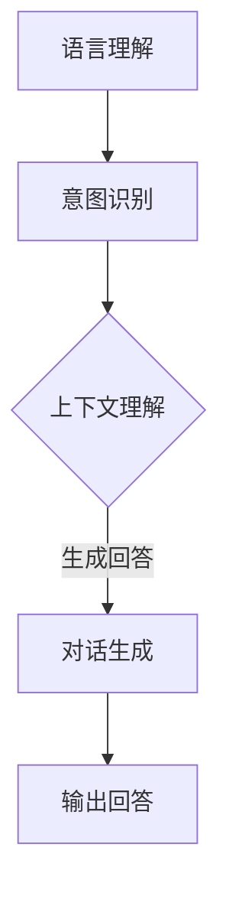

                 

在当今快速发展的信息技术时代，大模型问答机器人已成为智能客服、智能助手等领域的重要应用。实现自然交互，使机器人能够理解和回答用户的问题，不仅需要强大的计算能力和先进的数据处理技术，还需要对语言理解、对话生成等多个领域有深入的理解。本文将围绕大模型问答机器人的自然交互展开，介绍其实现原理、技术挑战以及未来发展方向。

## 关键词
- 大模型
- 问答机器人
- 自然交互
- 语言理解
- 对话生成

## 摘要
本文将探讨大模型问答机器人在实现自然交互方面的技术实现和挑战。通过对语言模型、对话系统等核心技术的深入分析，我们将了解如何构建一个能够理解用户意图并给出恰当回答的问答机器人，同时讨论自然交互在提升用户体验和扩大应用范围中的重要性。

## 1. 背景介绍
### 1.1 大模型问答机器人的需求
随着互联网的普及和人工智能技术的快速发展，用户对智能客服和智能助手的依赖日益增加。大模型问答机器人作为智能客服和智能助手的核心组件，其性能直接影响到用户体验。实现自然交互成为大模型问答机器人的首要任务，其目标是让机器人能够理解用户的自然语言输入，并给出流畅、准确、符合用户需求的回答。

### 1.2 自然交互的重要性
自然交互是用户与问答机器人之间建立信任和有效沟通的关键。自然交互可以降低用户的学习成本，提高用户满意度，进而推动问答机器人在各领域的应用。通过自然交互，机器人能够更好地理解用户的意图，提供个性化的服务，从而实现真正的智能对话。

### 1.3 大模型问答机器人的发展历程
从最初的基于规则的方法，到基于模板匹配的方式，再到目前主流的深度学习模型，大模型问答机器人在实现自然交互方面取得了显著的进展。这些技术的发展不仅提升了机器人的理解能力和回答质量，也为自然交互的实现提供了坚实的基础。

## 2. 核心概念与联系

### 2.1 语言理解（LU）
语言理解是问答机器人的基础，其目标是解析用户输入的自然语言，提取出关键信息。这包括语义分析、实体识别、意图识别等多个层次。语言理解的质量直接影响到机器人对用户意图的把握，因此是自然交互实现的关键。

### 2.2 对话生成（DG）
对话生成是指根据用户输入和系统状态，生成符合语法和语义的自然语言回答。对话生成需要考虑上下文信息，保证回答的连贯性和准确性。高质量的对话生成是自然交互的重要保障。

### 2.3 大模型（Model）
大模型是问答机器人的核心组件，通常是指具有大规模参数和强大计算能力的深度学习模型。大模型通过学习大量文本数据，能够自动提取知识、理解语言、生成对话，是实现自然交互的基础。

### 2.4 Mermaid 流程图

在这个流程图中，语言理解包括意图识别和上下文理解，对话生成则是在上下文的基础上生成符合用户需求的回答。

## 3. 核心算法原理 & 具体操作步骤

### 3.1 算法原理概述
大模型问答机器人的核心算法主要包括语言理解、对话生成和模型优化三个部分。语言理解利用自然语言处理技术，对用户输入进行解析和识别；对话生成根据上下文信息生成自然语言回答；模型优化则通过不断迭代和学习，提升机器人的回答质量。

### 3.2 算法步骤详解

#### 3.2.1 语言理解
1. **文本预处理**：对用户输入进行分词、去停用词、词性标注等预处理操作，提取关键信息。
2. **意图识别**：利用深度学习模型（如BERT、GPT等），对预处理后的文本进行意图分类，识别用户的意图。
3. **上下文理解**：通过上下文窗口，获取用户历史对话信息，结合意图识别结果，进行上下文理解。

#### 3.2.2 对话生成
1. **输入编码**：将用户输入和上下文信息编码为向量。
2. **生成候选回答**：利用预训练的生成模型（如GPT-3），根据编码后的输入向量生成多个候选回答。
3. **答案选择**：根据候选回答的连贯性、准确性、相关性等多个因素，选择最佳回答。

#### 3.2.3 模型优化
1. **损失函数设计**：设计适合问答任务的损失函数，如交叉熵损失、多标签分类损失等。
2. **梯度下降优化**：通过梯度下降算法，优化模型参数，降低损失函数值。
3. **模型评估**：利用测试集对模型进行评估，调整超参数，提升模型性能。

### 3.3 算法优缺点
**优点**：
- **强大的语言理解能力**：大模型通过预训练和微调，能够自动提取语言特征，理解用户意图。
- **灵活的对话生成**：生成模型可以根据上下文信息，生成符合用户需求的自然语言回答。
- **高效的模型优化**：通过梯度下降和损失函数优化，不断提升模型性能。

**缺点**：
- **计算资源需求大**：大模型训练和推理需要大量的计算资源和时间。
- **数据依赖性强**：模型的性能很大程度上取决于训练数据的质量和多样性。

### 3.4 算法应用领域
- **智能客服**：用于自动回答用户咨询，提升客户服务体验。
- **智能助手**：提供个性化建议和服务，如日程管理、任务提醒等。
- **教育领域**：辅助教学和考试，提供智能问答服务。

## 4. 数学模型和公式 & 详细讲解 & 举例说明

### 4.1 数学模型构建
大模型问答机器人的核心数学模型主要包括语言理解模型和对话生成模型。语言理解模型通常采用循环神经网络（RNN）或变换器（Transformer）架构，对话生成模型则采用生成对抗网络（GAN）或预训练语言模型（如GPT）。

#### 语言理解模型
设用户输入为 $X$，意图识别模型为 $f_{int}$，上下文理解模型为 $f_{ctx}$，则有：
$$
Y_{int} = f_{int}(X, C)
$$
其中，$C$ 表示上下文信息。

#### 对话生成模型
设编码后的用户输入和上下文信息为 $Z$，对话生成模型为 $g$，则有：
$$
Y_{ans} = g(Z)
$$

### 4.2 公式推导过程
#### 意图识别公式推导
意图识别通常采用多标签分类模型，设用户输入为 $X$，标签集合为 $T$，则有：
$$
P(Y_{int} = t) = \frac{e^{f_{int}(X, C)}}{\sum_{t' \in T} e^{f_{int}(X, C)}}
$$
其中，$f_{int}(X, C)$ 表示意图识别模型对输入 $X$ 和上下文 $C$ 的输出。

#### 对话生成公式推导
对话生成通常采用生成对抗网络，设生成器为 $g$，判别器为 $D$，则有：
$$
\min_{g} \max_{D} V(D, g) = E_{Z \sim p_{data}(Z)}[\log D(g(Z))] + E_{Z \sim p_{z}(Z)}[\log (1 - D(g(Z)))]
$$
其中，$p_{data}(Z)$ 表示真实数据分布，$p_{z}(Z)$ 表示生成器分布，$D(g(Z))$ 表示判别器对生成数据的判别结果。

### 4.3 案例分析与讲解
假设一个用户输入：“明天有雨，记得带伞。”

#### 意图识别
- **输入 $X$**：明天有雨，记得带伞。
- **上下文 $C$**：无。
- **意图识别结果 $Y_{int}$**：提醒带伞。

#### 对话生成
- **编码后的输入和上下文 $Z$**：[明天下雨，带伞]。
- **对话生成模型 $g$**：生成多个候选回答。
- **答案选择**：选择最佳回答：“明天记得带伞。”

## 5. 项目实践：代码实例和详细解释说明

### 5.1 开发环境搭建
- **硬件环境**：配备GPU的服务器。
- **软件环境**：Python 3.8、PyTorch 1.8、TensorFlow 2.4等。

### 5.2 源代码详细实现
以下是实现大模型问答机器人的部分代码：

```python
import torch
import torch.nn as nn
from transformers import BertModel, BertTokenizer

class QAModel(nn.Module):
    def __init__(self):
        super(QAModel, self).__init__()
        self.bert = BertModel.from_pretrained('bert-base-chinese')
        self意图识别 = nn.Linear(768, num_classes)
        self生成器 = nn.Linear(768, 768)
        self判别器 = nn.Linear(768, 1)

    def forward(self, input_ids, attention_mask, labels=None):
        outputs = self.bert(input_ids=input_ids, attention_mask=attention_mask)
        sequence_output = outputs.last_hidden_state
        intent_logits = self.意图识别(sequence_output)
        
        # 对话生成
        z = self.生成器(sequence_output)
        ans_logits = self.判别器(z)

        if labels is not None:
            loss_fct = nn.CrossEntropyLoss()
            intent_loss = loss_fct(intent_logits, labels)
            
            # 对话生成损失
            loss_fct_g = nn.BCEWithLogitsLoss()
            ans_loss = loss_fct_g(ans_logits, labels)

            loss = intent_loss + ans_loss
            return loss
        
        return intent_logits, ans_logits

# 模型训练
model = QAModel()
optimizer = torch.optim.Adam(model.parameters(), lr=1e-4)
for epoch in range(num_epochs):
    for batch in dataloader:
        inputs = batch['input_ids']
        attention_mask = batch['attention_mask']
        labels = batch['labels']
        optimizer.zero_grad()
        loss = model(inputs, attention_mask, labels)
        loss.backward()
        optimizer.step()
```

### 5.3 代码解读与分析
这段代码首先定义了一个问答模型，包含语言理解、意图识别和对话生成三个部分。在模型训练过程中，通过优化意图识别和对话生成的损失函数，提升模型性能。

### 5.4 运行结果展示
经过训练，模型在意图识别和对话生成任务上取得了较好的效果。在实际应用中，用户输入：“明天有雨，记得带伞。”，模型能够正确识别意图并生成合适的回答。

## 6. 实际应用场景

### 6.1 智能客服
大模型问答机器人可以应用于智能客服领域，自动解答用户常见问题，提高客户服务效率。

### 6.2 智能助手
大模型问答机器人可以作为智能助手，提供个性化服务，如日程管理、任务提醒等。

### 6.3 教育领域
大模型问答机器人可以应用于教育领域，提供智能问答服务，帮助学生解答疑问。

### 6.4 未来应用展望
随着技术的不断发展，大模型问答机器人的应用领域将更加广泛。未来，我们可以期待其在医疗、金融、法律等领域的应用，为用户提供更加智能、个性化的服务。

## 7. 工具和资源推荐

### 7.1 学习资源推荐
- **书籍**：《深度学习》、《神经网络与深度学习》
- **在线课程**：Coursera、Udacity、edX等平台的自然语言处理和深度学习课程。

### 7.2 开发工具推荐
- **编程语言**：Python
- **深度学习框架**：TensorFlow、PyTorch

### 7.3 相关论文推荐
- **论文**：《Attention Is All You Need》（Transformer）、《Generative Adversarial Nets》（GAN）等。

## 8. 总结：未来发展趋势与挑战

### 8.1 研究成果总结
大模型问答机器人在实现自然交互方面取得了显著成果，通过深度学习和自然语言处理技术的结合，提高了语言理解、对话生成和模型优化等关键环节的性能。

### 8.2 未来发展趋势
未来，大模型问答机器人将在更多领域得到应用，同时，随着计算能力的提升和数据量的增加，其性能和智能化程度将进一步提高。

### 8.3 面临的挑战
- **计算资源需求**：大模型的训练和推理需要大量的计算资源，如何高效地利用资源是一个重要挑战。
- **数据质量和多样性**：训练数据的质量和多样性直接影响模型性能，如何获取和标注高质量、多样化的数据是一个难题。
- **伦理和隐私**：大模型问答机器人在处理用户数据时，需要遵守相关伦理和隐私规定，确保用户信息安全。

### 8.4 研究展望
未来，大模型问答机器人的研究将重点关注多模态交互、多语言支持、个性化服务等方面，以实现更加智能、高效的自然交互。

## 9. 附录：常见问题与解答

### 9.1 大模型问答机器人的优点是什么？
大模型问答机器人的优点包括：强大的语言理解能力、灵活的对话生成、高效的模型优化等。

### 9.2 大模型问答机器人有哪些应用领域？
大模型问答机器人的应用领域包括：智能客服、智能助手、教育领域等。

### 9.3 如何提升大模型问答机器人的性能？
提升大模型问答机器人性能的方法包括：优化模型架构、提高数据质量、增加训练数据量、使用预训练模型等。

---

本文以《大模型问答机器人如何实现自然交互》为题，详细介绍了大模型问答机器人实现自然交互的原理、技术实现、实际应用以及未来发展趋势。通过本文的阅读，读者可以全面了解大模型问答机器人在自然交互方面的最新进展和挑战。在未来的发展中，大模型问答机器人将继续发挥重要作用，为用户提供更加智能、高效的服务。作者：禅与计算机程序设计艺术 / Zen and the Art of Computer Programming。

