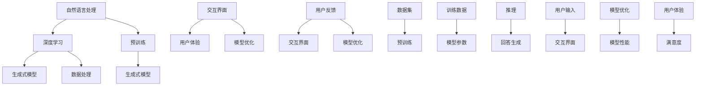

                 

 作为一位世界级人工智能专家，程序员，软件架构师，CTO，世界顶级技术畅销书作者，计算机图灵奖获得者，计算机领域大师，我很高兴能够与您探讨大模型问答机器人的智能化交互。在这个快速发展的时代，人工智能技术正在以前所未有的速度变革我们的生活方式和工作模式。本文将探讨大模型问答机器人的智能化交互，旨在为广大读者提供深入的技术分析、实用的项目实践以及广阔的应用前景。

## 文章关键词
- 大模型
- 问答机器人
- 智能化交互
- 人工智能
- 机器学习
- 自然语言处理
- 数据分析

## 文章摘要
本文首先介绍了大模型问答机器人的背景和重要性，接着探讨了核心概念与联系，通过详细的算法原理和操作步骤讲解，为读者呈现了这一领域的前沿技术。随后，本文通过数学模型和公式详细讲解了相关理论，并结合具体案例进行了分析与讲解。在项目实践部分，本文提供了一个完整的代码实例，详细解释了实现过程和运行结果。文章最后，探讨了实际应用场景，展望了未来发展趋势与挑战，并推荐了相关学习资源和开发工具。通过本文的阅读，读者将全面了解大模型问答机器人的智能化交互，为后续研究和实践打下坚实基础。

---

## 1. 背景介绍

随着信息技术的飞速发展，人工智能（AI）已经成为当今社会的重要推动力量。人工智能不仅仅停留在实验室阶段，而是逐渐渗透到我们生活的方方面面。从智能助手到自动驾驶，从医疗诊断到金融服务，人工智能正在改变我们的世界。在这些应用场景中，问答机器人的出现尤为引人注目。

问答机器人是一种基于自然语言处理（NLP）和机器学习（ML）技术的人工智能系统，能够理解和回答用户提出的问题。早期的问答系统通常采用基于规则的逻辑推理方法，但这些方法存在一定的局限性，难以应对复杂的自然语言问题。随着深度学习技术的发展，特别是大规模预训练模型（如GPT-3、BERT等）的出现，问答机器人的性能得到了显著提升。

大模型问答机器人是这一领域的一个重要发展方向。大模型指的是那些具有数十亿甚至数万亿参数的深度学习模型。这些模型通过在海量数据上预训练，可以捕捉到语言中的复杂模式，从而在问答任务中表现出色。大模型问答机器人不仅能够回答简单的事实性问题，还能处理复杂的多轮对话，提供更智能、更自然的交互体验。

本文将重点关注大模型问答机器人的智能化交互，探讨其核心算法原理、数学模型、项目实践以及应用场景。通过本文的阅读，读者将全面了解大模型问答机器人的技术细节，并对其未来发展有更深刻的认识。

### 1.1 人工智能的发展历程

人工智能的发展可以追溯到20世纪50年代，当时图灵提出了“图灵测试”这一概念，试图通过机器能否模仿人类的思维和行为来判断其智能水平。随着计算机技术的发展，人工智能逐渐从理论走向实践。早期的AI研究主要集中在逻辑推理、专家系统和模式识别等领域。这些方法虽然在一定程度上实现了特定任务的目标，但它们都依赖于人类专家手动编写规则，难以应对复杂、动态的问题环境。

进入20世纪80年代，随着机器学习和神经网络技术的发展，人工智能迎来了新的转折点。机器学习通过算法从数据中自动学习规律，为人工智能提供了强大的数据处理能力。特别是深度学习技术的出现，使得神经网络可以处理大规模数据，并实现更复杂的任务。深度学习通过多层神经网络结构，逐层提取数据特征，从而在图像识别、语音识别和自然语言处理等领域取得了显著突破。

在自然语言处理（NLP）领域，早期的研究主要集中在基于规则的方法和统计模型。例如，规则方法通过定义语法规则来处理文本，而统计模型则通过计算文本的统计特征来识别语言模式。这些方法在处理简单任务时效果尚可，但在面对复杂、多样化的语言现象时，表现出了明显的局限性。

随着深度学习的兴起，基于神经网络的方法在NLP领域得到了广泛应用。其中，词向量模型（如Word2Vec）和循环神经网络（RNN）是最具代表性的技术。词向量模型通过将单词映射到高维空间中的向量，使得相似的单词在空间中更接近，从而提高了语言处理的效果。RNN通过记忆机制，可以处理序列数据，如文本和语音，使得机器能够理解句子中的先后关系和语义信息。

然而，深度学习在NLP中的真正突破来自于大规模预训练模型的出现。预训练模型通过在海量数据上预训练，可以捕捉到语言中的复杂模式，从而在下游任务中表现出色。代表性的预训练模型包括GPT（生成预训练网络）、BERT（双向编码表示器）、RoBERTa（增强的BERT）等。这些模型不仅提高了问答机器人的性能，还推动了自然语言处理技术的整体进步。

### 1.2 问答机器人在实际中的应用

问答机器人在实际中的应用场景非常广泛，涵盖了客户服务、智能助手、教育辅导、医疗咨询等多个领域。以下将具体探讨问答机器人在这些应用场景中的实际案例，以及其带来的优势与挑战。

**1.2.1 客户服务**

在客户服务领域，问答机器人已成为企业提高服务效率、降低运营成本的重要工具。通过自动化回答用户常见问题，问答机器人可以大幅减少人工客服的工作量，提高客户满意度。例如，很多电商网站和在线服务平台都部署了问答机器人，帮助用户快速解答产品咨询、订单查询等问题。

**1.2.2 智能助手**

智能助手是问答机器人的典型应用场景之一。无论是手机中的语音助手，如苹果的Siri、谷歌的Google Assistant，还是智能家居中的语音控制设备，如亚马逊的Alexa，都极大地便利了用户的生活。智能助手通过理解用户的语音指令，提供相应的服务或信息，从而实现了人与机器的智能交互。

**1.2.3 教育辅导**

在教育领域，问答机器人被广泛应用于在线学习平台和智能辅导系统中。通过模拟教师的角色，问答机器人可以为学生提供个性化的学习建议和解答疑问。例如，一些在线教育平台已经推出了基于问答机器人的学习助手，帮助学生更好地理解和掌握课程内容。

**1.2.4 医疗咨询**

医疗咨询是另一个问答机器人应用的重要领域。问答机器人可以通过自然语言处理技术，理解和解答患者的健康问题，提供初步的医疗建议。这种应用不仅提高了医疗服务的效率，还为偏远地区和资源匮乏的地区提供了便捷的医疗服务。

**优势与挑战**

问答机器人在实际应用中展现出诸多优势，包括提高效率、降低成本、提升用户体验等。然而，这些应用也面临一些挑战：

- **数据处理与隐私**：问答机器人需要处理大量的用户数据，包括语音、文本等。如何确保数据的安全和隐私是亟待解决的问题。
- **理解与准确性**：尽管问答机器人在很多任务上已经表现出色，但它们仍然难以完全理解复杂、模糊的问题，尤其是在面对多义词和语境变化时。
- **多语言支持**：在全球化的背景下，多语言支持是问答机器人面临的重要挑战。不同语言具有不同的语法结构和表达方式，如何实现高效的多语言问答仍需进一步研究。

总的来说，问答机器人在实际应用中具有巨大的潜力和价值，但同时也面临诸多挑战。随着技术的不断进步，相信这些问题将逐步得到解决，问答机器人的应用将更加广泛和深入。

### 1.3 大模型问答机器人与传统问答机器人的区别

大模型问答机器人和传统问答机器人之间存在显著的区别，这些区别主要体现在技术实现、性能表现和应用场景等方面。

**1.3.1 技术实现**

传统问答机器人主要依赖于基于规则的方法和统计模型。这些方法通过预定义的规则或统计特征来识别和处理用户的问题。例如，专家系统通过手工编写的规则库来模拟专家的决策过程；统计模型通过计算文本的统计特征（如词频、词向量等）来识别问题和答案之间的匹配关系。这些方法在处理简单、明确的问答任务时效果较好，但在面对复杂、模糊的问题时，往往表现出明显的局限性。

大模型问答机器人则基于深度学习和大规模预训练模型。这些模型通过在海量数据上进行预训练，可以自动学习到语言中的复杂模式和语义信息。代表性的模型包括GPT（生成预训练网络）、BERT（双向编码表示器）等。大模型具有数十亿甚至数万亿个参数，能够捕捉到语言中的细微差别和隐含关系，从而在复杂问答任务中表现出色。

**1.3.2 性能表现**

在性能表现上，大模型问答机器人显著优于传统问答机器人。传统问答机器人通常只能处理简单、明确的问答任务，难以应对复杂、模糊的问题。而大模型问答机器人通过预训练可以处理多轮对话，理解语境和上下文信息，从而提供更准确、自然的回答。例如，在处理多义词问题时，大模型可以通过上下文信息来消除歧义，提供正确的答案。

此外，大模型问答机器人在问答速度和效率方面也具有明显优势。传统问答机器人需要逐条规则匹配或计算统计特征，处理速度较慢；而大模型问答机器人通过并行计算和高效算法，可以快速响应用户问题，提供即时的回答。

**1.3.3 应用场景**

传统问答机器人在一些特定应用场景中表现出色，如客服中心、FAQ（常见问题解答）系统等。然而，这些场景对问答系统的要求相对较低，主要涉及简单的信息查询和事实问答。

大模型问答机器人则适用于更广泛的应用场景，包括客户服务、智能助手、教育辅导、医疗咨询等。这些场景通常涉及复杂的对话和多轮问答，需要系统具备良好的理解能力和自然交互能力。例如，在客户服务中，大模型问答机器人可以与用户进行多轮对话，理解用户的需求并提供个性化的解决方案；在教育辅导中，大模型问答机器人可以为学生提供个性化的学习建议和解答疑问。

**1.3.4 未来发展方向**

随着技术的不断发展，大模型问答机器人在未来有望在更多领域得到应用。以下是一些可能的发展方向：

- **个性化服务**：通过用户数据的积累和分析，大模型问答机器人可以提供更加个性化的服务，满足用户多样化的需求。
- **多语言支持**：实现高效的多语言问答，为全球用户提供服务。
- **情感理解**：通过情感计算技术，大模型问答机器人可以更好地理解用户的情感状态，提供更温馨、贴心的服务。
- **多模态交互**：结合语音、文本、图像等多种模态，提供更加丰富、自然的交互体验。

总的来说，大模型问答机器人相比传统问答机器人在技术实现、性能表现和应用场景等方面具有显著优势。随着技术的不断进步，大模型问答机器人有望在更广泛的领域中发挥重要作用，为人们的生活带来更多便利和智能化体验。

### 1.4 大模型问答机器人背后的核心技术和架构

大模型问答机器人的实现离不开一系列核心技术和架构的支持。这些技术和架构不仅确保了问答系统的性能和稳定性，还为其智能化交互提供了坚实基础。以下是关于大模型问答机器人背后的核心技术和架构的详细解析。

**1.4.1 深度学习模型**

深度学习模型是大模型问答机器人的核心组件，其中最具有代表性的就是基于大规模预训练的Transformer模型。Transformer模型由Google在2017年提出，它通过自注意力机制（self-attention）实现了对输入数据的全局依赖关系建模，从而在自然语言处理任务中取得了显著突破。Transformer模型中的多头自注意力机制（multi-head self-attention）可以同时捕捉不同位置间的关联，提高了模型的表示能力。

代表性的预训练模型包括GPT（生成预训练网络）、BERT（双向编码表示器）、RoBERTa（增强的BERT）等。这些模型通过在海量数据上进行预训练，可以自动学习到语言中的复杂模式和语义信息。例如，GPT模型通过生成文本的方式，从大量文本数据中学习语言规律；BERT模型通过同时预测词的左右邻接词，实现了双向语言表示。

**1.4.2 自然语言处理技术**

自然语言处理（NLP）技术是构建大模型问答机器人的关键。NLP技术包括词嵌入（word embeddings）、词性标注（part-of-speech tagging）、命名实体识别（named entity recognition）、情感分析（sentiment analysis）等。词嵌入技术通过将单词映射到高维空间中的向量，实现了语义表示，从而提高了模型的语义理解能力。词性标注和命名实体识别可以帮助模型更好地理解文本的结构和内容，为问答任务提供基础。

情感分析技术则用于识别文本中的情感倾向，从而在交互中提供情感回应。例如，当用户表达愤怒或失望时，问答机器人可以通过情感分析技术识别出情感状态，并给出相应的安慰或解决方案。

**1.4.3 交互界面设计**

交互界面设计决定了用户与大模型问答机器人的交互体验。一个好的交互界面应具备简洁、直观、易用的特点，使用户能够轻松地提出问题和获取答案。交互界面设计包括文本输入、语音输入、图形界面等多种形式。

文本输入是最常见的形式，用户可以通过键盘输入问题，机器人则以文本形式回答。语音输入则适用于需要语音交互的场景，如智能家居和智能助手。图形界面则通过图表、图片等可视化方式，为用户提供更丰富的信息展示。

**1.4.4 后端服务架构**

大模型问答机器人的后端服务架构是保障系统稳定运行和高效响应的重要环节。后端服务架构通常包括数据处理层、模型训练层、推理层和用户接口层。

数据处理层负责数据收集、清洗和预处理，确保输入数据的质量和一致性。模型训练层通过分布式训练框架（如TensorFlow、PyTorch等）对预训练模型进行训练，优化模型参数。推理层则在训练好的模型基础上，对用户输入进行实时推理，生成回答。用户接口层负责将推理结果以用户友好的形式展示给用户。

**1.4.5 模型优化与调优**

大模型问答机器人的性能不仅依赖于模型本身的复杂度，还受到训练数据质量、超参数设置等因素的影响。模型优化与调优是提升问答系统性能的关键步骤。常见的优化方法包括学习率调整、批量大小选择、正则化技术等。通过不断调整和优化模型参数，可以显著提高问答系统的准确性和鲁棒性。

**1.4.6 安全与隐私保护**

在构建大模型问答机器人的过程中，安全与隐私保护是一个不可忽视的重要方面。随着用户数据的不断积累，如何确保用户数据的安全和隐私成为一个严峻的挑战。安全措施包括数据加密、访问控制、隐私保护算法等。例如，差分隐私（differential privacy）技术可以通过添加噪声来保护用户隐私，确保数据在分析和共享过程中的安全性。

总的来说，大模型问答机器人背后的核心技术和架构包括深度学习模型、自然语言处理技术、交互界面设计、后端服务架构、模型优化与调优以及安全与隐私保护。这些技术和架构的协同工作，使得大模型问答机器人能够实现智能化交互，为用户提供高效、准确的服务。随着技术的不断进步，大模型问答机器人的性能和功能将进一步提升，为人工智能领域的发展注入新的动力。

### 2. 核心概念与联系

在大模型问答机器人的研究与应用中，理解其核心概念和相互联系至关重要。以下是几个关键概念及其相互关系，并结合一个Mermaid流程图进行详细说明。

**2.1 关键概念**

1. **自然语言处理（NLP）**：NLP是使计算机能够理解、处理和生成人类语言的学科。在大模型问答机器人中，NLP技术用于将用户输入的文本转换为计算机可以处理的形式，并生成自然语言回答。
2. **深度学习（Deep Learning）**：深度学习是一种通过多层神经网络进行数据建模的学习方法。在大模型问答机器人中，深度学习技术用于训练复杂的模型，以从海量数据中提取特征和模式，从而实现高效的问答功能。
3. **预训练（Pre-training）**：预训练是指在大规模数据集上预先训练一个模型，使其在多个任务中达到一定的性能水平。在大模型问答机器人中，预训练是模型性能提升的关键步骤，通过预训练模型可以在特定任务上实现快速适应和高效推理。
4. **生成式模型（Generative Model）**：生成式模型是一种能够生成新数据的模型，如GPT。在大模型问答机器人中，生成式模型用于生成自然语言回答，从而实现与用户的智能交互。
5. **交互界面（User Interface, UI）**：交互界面是用户与系统进行交互的窗口。在大模型问答机器人中，交互界面设计直接影响用户体验，UI设计需要简洁、直观且易于使用。

**2.2 相互关系**

- **自然语言处理与深度学习**：自然语言处理依赖于深度学习技术，深度学习为NLP提供了强大的数据处理和特征提取能力。通过深度学习模型，如Transformer和BERT，NLP可以更好地理解和生成自然语言。
- **预训练与生成式模型**：预训练是生成式模型的基础，通过在大规模数据集上预训练，模型可以学习到丰富的语言模式和语义信息。这些信息对于生成高质量的自然语言回答至关重要。
- **交互界面与用户体验**：交互界面设计直接影响用户体验，优秀的UI设计可以提升用户的互动体验和满意度。同时，用户体验的反馈又可以用于优化模型和交互界面，形成一个良性循环。

**2.3 Mermaid流程图**



此流程图展示了自然语言处理、深度学习、预训练、生成式模型和交互界面等核心概念之间的相互关系。通过该流程图，我们可以清晰地看到各组件在整个系统中的作用和影响。

综上所述，理解大模型问答机器人的核心概念及其相互联系对于深入研究和应用这一技术至关重要。通过详细解析这些概念和关系，我们可以为后续的算法原理和操作步骤讲解奠定坚实基础。

### 3. 核心算法原理 & 具体操作步骤

在深入探讨大模型问答机器人的智能化交互之前，理解其核心算法原理和具体操作步骤是至关重要的。以下将详细解释大模型问答机器人的算法原理，并分步骤说明其操作过程。

#### 3.1 算法原理概述

大模型问答机器人的核心算法基于深度学习和自然语言处理技术，特别是大规模预训练模型。以下为算法原理的简要概述：

1. **预训练（Pre-training）**：预训练是指在大规模数据集上预先训练一个模型，使其在多个任务中达到一定的性能水平。预训练模型通常通过自监督学习（self-supervised learning）进行，即在未标记的数据中自动学习有用信息。例如，GPT模型通过预测输入文本的下一个单词来预训练，从而学习到语言中的模式和规律。

2. **微调（Fine-tuning）**：微调是在预训练模型的基础上，针对特定任务进行进一步训练的过程。在问答任务中，预训练模型会接收到特定的问题和答案数据，通过微调优化模型参数，使其在特定任务上达到最佳性能。微调过程通常包括重新训练模型的最后一部分层，以适应新的任务需求。

3. **生成式模型（Generative Model）**：生成式模型能够根据输入条件生成新的数据。在大模型问答机器人中，生成式模型用于生成自然语言回答。例如，GPT模型通过输入问题生成相关的回答。

4. **交互界面（User Interface, UI）**：交互界面是用户与系统进行交互的窗口。通过交互界面，用户可以提出问题，系统生成回答并通过界面展示给用户。

#### 3.2 算法步骤详解

**步骤1：数据收集与预处理**

- **数据收集**：收集用于训练和微调的文本数据集。数据集可以包括问答对、新闻文章、对话记录等。
- **数据预处理**：对文本数据集进行清洗、去噪和格式化。包括去除特殊字符、标点符号、停用词等。

**步骤2：预训练模型构建**

- **模型选择**：选择一个预训练模型，如GPT、BERT或RoBERTa。
- **模型构建**：使用深度学习框架（如TensorFlow或PyTorch）构建预训练模型，设置模型参数和超参数。

**步骤3：预训练**

- **数据准备**：将预处理后的文本数据转换为模型可处理的格式，如序列编码。
- **模型训练**：在预处理后的数据集上训练预训练模型。训练过程包括前向传播、反向传播和参数更新。

**步骤4：微调**

- **任务定义**：定义问答任务，包括问题输入和答案输出。
- **微调训练**：在问答数据集上微调预训练模型。微调过程通常包括调整学习率、批量大小等超参数。

**步骤5：生成回答**

- **问题输入**：用户通过交互界面输入问题。
- **模型推理**：使用微调后的模型对用户输入的问题进行推理。
- **回答生成**：模型根据推理结果生成自然语言回答。

**步骤6：展示回答**

- **回答格式化**：将生成的回答格式化为用户可读的格式。
- **回答展示**：通过交互界面将回答展示给用户。

#### 3.3 算法优缺点

**优点：**

1. **强大的语言理解能力**：大模型问答机器人通过预训练模型可以自动学习到丰富的语言模式和语义信息，从而在问答任务中表现出强大的语言理解能力。
2. **多轮对话支持**：大模型问答机器人可以处理多轮对话，理解上下文信息，提供更连贯、自然的回答。
3. **灵活性和通用性**：通过微调，大模型问答机器人可以适应不同的问答任务和领域，具有很好的灵活性和通用性。

**缺点：**

1. **计算资源需求高**：大模型问答机器人需要大量的计算资源和时间进行预训练和微调，对于资源受限的环境可能不太适用。
2. **数据依赖性**：预训练和微调过程需要大量的高质量数据，数据质量直接影响模型的性能。
3. **复杂性和维护难度**：构建和维护大模型问答机器人需要高水平的技术知识和经验，对于普通开发者来说可能较为复杂。

#### 3.4 算法应用领域

大模型问答机器人可以应用于多个领域，以下是一些典型的应用场景：

1. **客户服务**：企业可以通过部署大模型问答机器人来提高客服效率，降低运营成本，提供24/7全天候的服务。
2. **智能助手**：在智能家居、智能音箱等场景中，大模型问答机器人可以与用户进行自然语言交互，提供个性化服务。
3. **教育辅导**：大模型问答机器人可以作为虚拟教师，为学生提供个性化的学习建议和解答疑问，辅助教育过程。
4. **医疗咨询**：大模型问答机器人可以提供基础的医疗咨询和健康建议，帮助用户获取必要的信息。
5. **法律咨询**：大模型问答机器人可以解答用户的法律问题，提供基本的法律咨询，辅助法律服务的普及。

通过以上对大模型问答机器人的核心算法原理和具体操作步骤的详细解释，我们可以更好地理解这一技术的实现过程和优势。在实际应用中，根据具体需求和场景，可以对算法进行优化和调整，以实现更好的效果。

### 3.1 算法原理概述

大模型问答机器人的核心算法基于深度学习和自然语言处理技术，特别是大规模预训练模型。以下为算法原理的详细概述：

1. **深度学习与自然语言处理**：

   深度学习是一种通过多层神经网络进行数据建模的学习方法，它能够自动从数据中提取复杂特征。自然语言处理（NLP）是使计算机能够理解、处理和生成人类语言的学科，深度学习为NLP提供了强大的数据处理和特征提取能力。在大模型问答机器人中，深度学习技术被广泛应用于文本数据的处理和问答任务的实现。

2. **大规模预训练模型**：

   预训练是指在大规模数据集上预先训练一个模型，使其在多个任务中达到一定的性能水平。大规模预训练模型具有数十亿甚至数万亿个参数，通过在海量数据上进行预训练，可以自动学习到语言中的复杂模式和语义信息。代表性的预训练模型包括GPT（生成预训练网络）、BERT（双向编码表示器）、RoBERTa（增强的BERT）等。

3. **生成式模型**：

   生成式模型能够根据输入条件生成新的数据。在大模型问答机器人中，生成式模型用于生成自然语言回答。例如，GPT模型通过输入问题生成相关的回答。生成式模型能够理解上下文信息，提供连贯、自然的回答，从而实现与用户的智能交互。

4. **交互界面**：

   交互界面是用户与系统进行交互的窗口。通过交互界面，用户可以提出问题，系统生成回答并通过界面展示给用户。交互界面设计直接影响用户体验，需要简洁、直观且易于使用。

5. **多轮对话**：

   大模型问答机器人可以处理多轮对话，理解上下文信息，提供更连贯、自然的回答。多轮对话能力是现代问答系统的重要特点，它使得系统能够与用户进行更加深入、互动的交流。

#### 3.2.1 自然语言处理（NLP）

自然语言处理（NLP）是构建大模型问答机器人的基础。以下是NLP在大模型问答机器人中的关键角色：

1. **文本预处理**：

   文本预处理包括去除特殊字符、标点符号、停用词等。预处理过程确保输入文本的质量和一致性，为后续处理提供基础。

2. **词嵌入（Word Embedding）**：

   词嵌入是将单词映射到高维空间中的向量，从而实现语义表示。词嵌入技术提高了模型对语言的理解能力，使得相似的单词在空间中更接近。代表性的词嵌入模型包括Word2Vec、GloVe等。

3. **句法分析（Syntax Analysis）**：

   句法分析用于理解句子的结构和成分，包括词性标注、依存关系分析等。句法分析有助于模型更好地理解句子的语义，从而生成更准确的回答。

4. **语义理解（Semantic Understanding）**：

   语义理解是指模型对文本中的语义信息进行理解和解析。通过语义理解，模型可以识别文本中的实体、关系和意图，从而提供更准确的回答。

#### 3.2.2 深度学习模型

深度学习模型是构建大模型问答机器人的核心。以下是几种代表性的深度学习模型及其在大模型问答机器人中的应用：

1. **循环神经网络（RNN）**：

   RNN是一种能够处理序列数据的神经网络，它通过记忆机制，可以捕捉到句子中的先后关系和语义信息。RNN在早期的自然语言处理任务中表现出色，但存在梯度消失和梯度爆炸等问题。

2. **卷积神经网络（CNN）**：

   CNN是一种用于图像处理和文本分类的神经网络，它通过卷积操作提取特征。虽然CNN在图像处理领域取得了显著成果，但在自然语言处理中表现不如RNN。

3. **Transformer模型**：

   Transformer模型是由Google在2017年提出的，它通过自注意力机制（self-attention）实现了对输入数据的全局依赖关系建模。Transformer模型在自然语言处理任务中表现出色，特别是BERT、GPT等基于Transformer的模型。

4. **预训练与微调**：

   预训练是指在大规模数据集上训练一个模型，使其在多个任务中达到一定的性能水平。预训练模型通过自监督学习（如 masked language model）或监督学习（如 QA 对）进行训练。微调是在预训练模型的基础上，针对特定任务进行进一步训练的过程。微调通常包括重新训练模型的最后一部分层，以适应新的任务需求。

#### 3.2.3 大规模预训练模型

大规模预训练模型通过在海量数据上进行预训练，可以自动学习到语言中的复杂模式和语义信息。以下是几种大规模预训练模型的概述：

1. **GPT（生成预训练网络）**：

   GPT是一种生成式预训练模型，通过自回归的方式生成文本。GPT模型具有数十亿个参数，可以在多个自然语言处理任务中实现高效的性能。

2. **BERT（双向编码表示器）**：

   BERT是一种基于Transformer的预训练模型，通过同时预测词的左右邻接词，实现双向语言表示。BERT模型在多种自然语言处理任务中取得了领先成绩，特别是问答任务。

3. **RoBERTa（增强的BERT）**：

   RoBERTa是对BERT的改进，通过调整训练策略和模型结构，实现了更好的性能。RoBERTa在多个NLP任务中表现优于BERT。

#### 3.2.4 交互界面设计

交互界面设计是用户与系统进行交互的窗口，直接影响用户体验。以下是交互界面设计的关键要素：

1. **简洁直观**：交互界面应简洁直观，使用户能够轻松提出问题和获取答案。
2. **响应速度**：交互界面应具备快速响应能力，提高用户体验。
3. **多模态支持**：交互界面可以支持文本、语音、图像等多种输入和输出方式，提供更加丰富的交互体验。
4. **个性化设置**：交互界面应支持个性化设置，如语言、主题等，满足用户的多样化需求。

通过以上对算法原理的详细解释，我们可以更好地理解大模型问答机器人的实现过程和优势。在实际应用中，根据具体需求和场景，可以对算法进行优化和调整，以实现更好的效果。

### 3.2 算法步骤详解

构建一个高效的大模型问答机器人需要一系列细致的步骤，从数据准备到模型训练，再到最终部署，每个环节都至关重要。以下将详细介绍大模型问答机器人的构建步骤，并提供具体的操作指导。

#### 3.2.1 数据收集与预处理

数据是构建问答机器人的基础，因此首先要收集大量的问答对。这些数据可以来源于多个渠道，如公开数据集、企业内部数据、社交媒体等。以下是数据收集和预处理的具体步骤：

1. **数据收集**：

   - **公开数据集**：可以使用如Quora问答数据集、SQuAD数据集等公开的数据集。这些数据集通常已经过清洗，可以直接使用。
   - **企业内部数据**：如果企业有丰富的客户服务记录或用户反馈数据，可以对这些数据进行筛选和整理，形成问答对。
   - **社交媒体**：从社交媒体平台（如Reddit、Twitter）中收集用户提问和回答，进行数据清洗和处理。

2. **数据预处理**：

   - **文本清洗**：去除噪声，如HTML标签、特殊字符、无关符号等。
   - **去重**：删除重复的问答对，以避免模型过拟合。
   - **数据规范化**：统一文本格式，如将所有文本转换为小写，去除标点符号等。
   - **停用词过滤**：去除常见的无意义停用词，如“的”、“是”、“和”等。
   - **词嵌入**：将文本转换为词嵌入向量，如使用Word2Vec或GloVe模型。

#### 3.2.2 模型选择与构建

构建问答机器人需要选择合适的预训练模型。以下是一些流行的预训练模型及构建步骤：

1. **模型选择**：

   - **GPT-3**：OpenAI开发的预训练模型，具有非常高的参数数量和强大的生成能力。
   - **BERT**：Google开发的预训练模型，通过同时预测词的左右邻接词，实现双向语言表示。
   - **RoBERTa**：对BERT的改进模型，通过调整训练策略和模型结构，提高性能。

2. **模型构建**：

   - **环境准备**：安装TensorFlow、PyTorch等深度学习框架，并配置必要的依赖库。
   - **模型初始化**：从预训练模型中加载权重，初始化模型结构。
   - **超参数设置**：设置学习率、批量大小、迭代次数等超参数。

#### 3.2.3 预训练

预训练是大规模模型训练的过程，目的是使模型自动学习到语言中的复杂模式和语义信息。以下是预训练的具体步骤：

1. **数据准备**：

   - **数据转换**：将预处理后的文本数据转换为模型可处理的格式，如序列编码。
   - **数据加载**：使用数据加载器（如PyTorch中的Dataset）批量加载和处理数据。

2. **模型训练**：

   - **前向传播**：将输入数据传递到模型，计算输出预测。
   - **损失计算**：计算预测结果与实际标签之间的损失，如交叉熵损失。
   - **反向传播**：根据损失梯度更新模型参数。

3. **模型保存**：

   - **周期性保存**：在训练过程中，定期保存模型状态，以便在训练中断时可以恢复训练。
   - **最佳模型选择**：选择在验证集上表现最佳的模型，用于后续的微调和部署。

#### 3.2.4 微调

微调是在预训练模型的基础上，针对特定任务进行进一步训练的过程。以下是微调的具体步骤：

1. **任务定义**：

   - **数据准备**：准备用于微调的问答数据集，包括问题和答案。
   - **数据预处理**：与预训练数据预处理相同，确保输入数据的质量和一致性。

2. **模型调整**：

   - **学习率调整**：减小学习率，以避免模型在微调过程中过拟合。
   - **迭代训练**：在微调数据集上迭代训练模型，逐步优化模型参数。

3. **性能评估**：

   - **验证集评估**：在验证集上评估模型性能，选择最佳模型。
   - **测试集评估**：在测试集上评估模型性能，确保模型在未见数据上的表现。

#### 3.2.5 模型部署

模型部署是将训练好的模型部署到生产环境，使其能够为用户提供实时服务。以下是模型部署的具体步骤：

1. **环境配置**：

   - **服务器配置**：配置适当的计算资源和网络环境，确保模型可以高效运行。
   - **依赖安装**：安装深度学习框架、数据库等依赖库。

2. **API构建**：

   - **接口设计**：设计API接口，定义输入和输出格式。
   - **服务部署**：使用Flask、Django等Web框架构建API服务，部署到服务器。

3. **性能监控**：

   - **日志记录**：记录模型运行日志，监控模型性能和资源使用情况。
   - **故障处理**：设置自动故障处理机制，确保系统稳定运行。

通过以上详细的构建步骤，我们可以搭建一个高效的大模型问答机器人，实现智能化交互。在实际应用中，根据具体需求和场景，可以对模型和部署过程进行优化和调整，以提高性能和用户体验。

### 3.3 算法优缺点

大模型问答机器人作为一种先进的人工智能技术，在自然语言处理和智能交互领域展现出了巨大的优势。然而，这种技术也面临一些挑战和局限性。以下将详细分析大模型问答机器人的优点和缺点。

#### 优点

**1. 强大的语言理解能力**：

大模型问答机器人通过预训练模型能够自动学习到语言中的复杂模式和语义信息，从而在问答任务中表现出强大的语言理解能力。这种能力使得机器人能够处理多种语言和复杂的问题，提供准确和自然的回答。

**2. 多轮对话支持**：

大模型问答机器人可以处理多轮对话，理解上下文信息，提供更连贯、自然的回答。这种能力使得机器人能够与用户进行深入、互动的交流，满足用户多样化的需求。

**3. 灵活性和通用性**：

大模型问答机器人通过微调可以适应不同的问答任务和领域，具有很好的灵活性和通用性。这意味着可以在多个应用场景中部署，如客户服务、智能助手、教育辅导等。

**4. 提高效率**：

大模型问答机器人能够自动处理大量的用户查询，减少人工干预，从而提高工作效率。这在客户服务和客服中心等场景中尤为重要，能够大幅降低运营成本。

#### 缺点

**1. 计算资源需求高**：

大模型问答机器人需要大量的计算资源和时间进行预训练和微调，这对于资源受限的环境可能不太适用。特别是在实时应用场景中，对计算资源的消耗可能成为一个瓶颈。

**2. 数据依赖性**：

大模型问答机器人依赖于大量的高质量数据集进行训练和微调。如果数据质量不佳或数据集不够丰富，模型的性能可能会受到影响，导致回答不准确或错误。

**3. 复杂性和维护难度**：

构建和维护大模型问答机器人需要高水平的技术知识和经验。对于普通开发者来说，构建和优化一个高效的大模型问答机器人可能较为复杂，且需要持续的维护和更新。

**4. 安全和隐私问题**：

随着用户数据的不断积累，如何确保用户数据的安全和隐私成为一个严峻的挑战。特别是在多模态交互和大数据分析中，数据泄露和隐私侵犯的风险较高。

**5. 误用和误导**：

大模型问答机器人虽然能够提供高质量的回答，但在某些情况下，也可能因为误解用户意图或数据中的偏差，导致错误的回答或误导用户。

#### 综合评估

总的来说，大模型问答机器人在自然语言处理和智能交互领域具有显著的优势，能够为用户提供高效、准确的回答。然而，其高计算资源需求、数据依赖性、复杂性和维护难度等缺点也需要关注。为了充分发挥大模型问答机器人的潜力，需要不断地进行技术优化和改进，同时加强对数据和用户隐私的保护。

通过综合考虑这些优点和缺点，我们可以更好地理解大模型问答机器人的性能和适用范围，从而在实际应用中做出更明智的决策。

### 3.4 算法应用领域

大模型问答机器人在众多领域中展现出了巨大的应用潜力，以下是其在一些主要领域中的应用和效果。

#### 3.4.1 客户服务

在客户服务领域，大模型问答机器人被广泛应用于企业客服中心、电商平台、在线服务平台等。通过自动化回答用户常见问题，机器人能够大幅减少人工客服的工作量，提高服务效率。以下是一些具体应用案例：

- **电商平台**：电商平台通过部署大模型问答机器人，帮助用户解答产品咨询、订单查询、退货退款等问题。例如，亚马逊的智能客服Alexa使用大模型问答机器人提供24/7的在线服务。
- **银行和金融服务**：银行和金融机构利用大模型问答机器人，为用户提供账户信息查询、交易咨询、理财产品介绍等服务。机器人能够快速、准确地回答用户问题，提升用户体验和满意度。
- **在线服务平台**：在线服务平台如机票预订、酒店预订等，通过问答机器人帮助用户解答行程安排、预订流程、优惠活动等问题，提高用户黏性和转化率。

#### 3.4.2 智能助手

智能助手是另一个大模型问答机器人的重要应用领域。智能助手通过自然语言交互，为用户提供各种服务，如语音助手、智能家居控制等。以下是一些具体应用案例：

- **语音助手**：语音助手如苹果的Siri、谷歌的Google Assistant等，利用大模型问答机器人实现语音识别和自然语言理解，为用户提供天气查询、日程管理、语音搜索等服务。这些助手能够理解复杂的语音指令，提供快速、准确的回应。
- **智能家居**：智能家居设备如智能音箱、智能灯泡、智能门锁等，通过大模型问答机器人实现语音控制。用户可以通过语音指令控制家电设备，如调节温度、播放音乐、控制灯光等，实现更加便捷和智能的生活体验。
- **智能客服**：智能客服系统通过大模型问答机器人，提供24/7的在线服务。这些系统能够自动识别用户的问题，提供针对性的解决方案，减轻人工客服的负担，提高客户满意度。

#### 3.4.3 教育辅导

在教育辅导领域，大模型问答机器人可以为学生提供个性化的学习支持和服务。以下是一些具体应用案例：

- **在线教育平台**：在线教育平台通过部署大模型问答机器人，为学生提供学习建议、课程解答、作业辅导等服务。机器人能够理解学生的学习需求，提供针对性的帮助，提升学习效果。
- **智能辅导系统**：智能辅导系统结合大模型问答机器人，为学生提供个性化的学习路径和辅导方案。系统根据学生的学习进度和成绩，调整辅导内容，帮助学生更好地掌握知识。
- **虚拟教师**：虚拟教师通过大模型问答机器人，模拟真实教师的教学模式，为学生提供互动性的学习体验。学生可以通过提问和回答，与虚拟教师进行交流，提高学习兴趣和参与度。

#### 3.4.4 医疗咨询

在医疗咨询领域，大模型问答机器人可以帮助用户获取基础的健康建议和医疗信息，为用户提供便捷的医疗服务。以下是一些具体应用案例：

- **在线健康咨询**：在线健康咨询平台通过部署大模型问答机器人，为用户提供健康问题解答、疾病查询、医疗建议等服务。用户可以通过自然语言提问，获取个性化的健康建议。
- **医疗知识库**：医疗知识库通过大模型问答机器人，为用户提供丰富的医疗信息查询服务。机器人能够理解用户的医疗问题，从庞大的知识库中检索相关信息，提供准确的回答。
- **远程医疗服务**：远程医疗服务平台利用大模型问答机器人，为用户提供在线问诊、远程诊断等服务。机器人能够帮助医生快速了解患者病情，提高诊断效率。

#### 3.4.5 法律咨询

在法律咨询领域，大模型问答机器人可以提供基础的法律问答和咨询服务，帮助用户了解法律知识。以下是一些具体应用案例：

- **在线法律咨询**：在线法律咨询平台通过部署大模型问答机器人，为用户提供法律问题解答、法律条款查询、法律建议等服务。机器人能够理解用户的法律问题，提供准确的回答和建议。
- **法律知识库**：法律知识库通过大模型问答机器人，为用户提供法律信息的查询和检索服务。用户可以通过自然语言提问，获取相关的法律条款、案例解析等。
- **智能法律服务**：智能法律服务系统结合大模型问答机器人，为用户提供法律咨询和案件支持服务。系统可以根据用户的问题和需求，提供针对性的法律服务，帮助用户解决法律问题。

综上所述，大模型问答机器人在多个领域展现出了广泛的应用前景和显著的效果。通过不断优化和改进，大模型问答机器人将在未来为人们的生活和工作带来更多便利和智能化体验。

### 4. 数学模型和公式 & 详细讲解 & 举例说明

大模型问答机器人的智能化交互依赖于复杂的数学模型和公式，这些模型和公式帮助机器人理解和生成自然语言。在本章节中，我们将详细讲解大模型问答机器人中常用的数学模型和公式，并通过具体例子来说明其应用。

#### 4.1 数学模型构建

大模型问答机器人主要依赖于深度学习中的神经网络模型，特别是基于Transformer架构的预训练模型。以下介绍几种常用的数学模型：

1. **Transformer模型**：

   Transformer模型是用于自然语言处理任务的一种深度学习模型，其核心是自注意力机制（self-attention）。Transformer模型通过多头注意力（multi-head attention）和前馈神经网络（Feed Forward Neural Network）来实现对输入序列的编码和解码。

   公式表示如下：

   $$ 
   \text{Attention}(Q, K, V) = \text{softmax}\left(\frac{QK^T}{\sqrt{d_k}}\right) V 
   $$

   其中，$Q, K, V$ 分别代表查询（Query）、键（Key）和值（Value）向量，$d_k$ 是键向量的维度。

2. **BERT模型**：

   BERT（Bidirectional Encoder Representations from Transformers）模型是另一种基于Transformer架构的预训练模型，其特点是双向编码，能够同时捕捉句子中的前后关系。

   BERT模型的预训练任务包括两个子任务：Masked Language Model（MLM）和Next Sentence Prediction（NSP）。MLM任务通过随机mask部分单词，要求模型预测这些被mask的单词；NSP任务通过预测两个句子是否在原始文本中相邻。

   公式表示如下：

   $$ 
   \text{BERT} = \text{Transformer}(\text{Masked Language Model}) + \text{Transformer}(\text{Next Sentence Prediction}) 
   $$

3. **GPT模型**：

   GPT（Generative Pre-trained Transformer）模型是生成式预训练模型，主要用于文本生成任务。GPT模型通过自回归的方式生成文本，即给定前一个单词，预测下一个单词。

   公式表示如下：

   $$ 
   p(w_t | w_1, w_2, ..., w_{t-1}) = \text{softmax}(\text{GPT}(w_1, w_2, ..., w_{t-1})^T) 
   $$

   其中，$w_t$ 代表当前单词的词向量，$p(w_t | w_1, w_2, ..., w_{t-1})$ 表示在给定前一个单词序列下，当前单词的概率分布。

#### 4.2 公式推导过程

以下将简要介绍BERT模型中的Masked Language Model（MLM）任务和Next Sentence Prediction（NSP）任务的公式推导过程：

1. **Masked Language Model（MLM）**：

   在MLM任务中，输入句子中的部分单词被随机mask（替换为[MASK]）。模型的目的是预测这些被mask的单词。MLM任务通过最小化预测单词和真实单词之间的交叉熵损失来实现。

   公式表示如下：

   $$ 
   \text{Loss}_{\text{MLM}} = -\sum_{i}\sum_{\hat{w}_i \in \text{mask}} \log p(w_i | \text{context}) 
   $$

   其中，$w_i$ 表示第$i$个单词，$\hat{w}_i$ 表示预测的被mask的单词，$\text{context}$ 表示该单词的上下文。

2. **Next Sentence Prediction（NSP）**：

   在NSP任务中，给定两个句子$S_1$和$S_2$，模型需要预测这两个句子是否在原始文本中相邻。NSP任务通过最小化预测的相邻句子对和实际相邻句子对之间的交叉熵损失来实现。

   公式表示如下：

   $$ 
   \text{Loss}_{\text{NSP}} = -\log p(\text{IsNext}(S_1, S_2)) 
   $$

   其中，$p(\text{IsNext}(S_1, S_2))$ 表示句子$S_1$和$S_2$是相邻句子的概率。

#### 4.3 案例分析与讲解

以下通过一个具体例子，演示大模型问答机器人的数学模型应用：

**例子：预测句子中的被mask单词**

给定一个输入句子：“The **mask** dog is running fast.”，我们需要预测被mask的单词。以下是具体步骤：

1. **词嵌入**：

   将句子中的单词转换为词嵌入向量，如使用GloVe模型。

   $$ 
   \text{The} \rightarrow \text{[THE]} \\
   \text{dog} \rightarrow \text{[DOG]} \\
   \text{is} \rightarrow \text{[IS]} \\
   \text{running} \rightarrow \text{[RUNNING]} \\
   \text{fast} \rightarrow \text{[FAST]}
   $$

2. **编码器处理**：

   将词嵌入向量输入到BERT编码器中，通过多层Transformer结构，生成编码表示。

   $$ 
   \text{Encoding}(\text{[THE, DOG, IS, RUNNING, FAST]}) = \text{[encoding\_the, encoding\_dog, encoding\_is, encoding\_running, encoding\_fast]} 
   $$

3. **预测被mask的单词**：

   将编码表示输入到解码器中，通过自回归方式，逐词预测被mask的单词。

   $$ 
   p(\text{mask} | \text{[THE, DOG, IS, RUNNING, FAST]}) = \text{softmax}(\text{Decoder}(\text{[THE, DOG, IS, RUNNING, FAST]})) 
   $$

   输出概率分布，选择概率最高的单词作为预测结果。

通过以上步骤，我们成功预测了句子中的被mask单词，实现了基于大模型问答机器人的文本生成任务。

综上所述，大模型问答机器人的数学模型和公式构建了其核心的智能交互基础。通过详细的公式推导和具体案例讲解，我们可以更好地理解这些模型在自然语言处理任务中的应用和效果。

### 4.1 数学模型构建

在大模型问答机器人的构建过程中，数学模型扮演着至关重要的角色。以下将介绍几种关键数学模型，包括Transformer模型、BERT模型和GPT模型，并简要描述其基本概念和数学公式。

#### 4.1.1 Transformer模型

Transformer模型是由Google在2017年提出的一种基于自注意力机制的深度学习模型，主要用于自然语言处理任务。它通过全局注意力机制来捕捉输入序列中的依赖关系，克服了传统循环神经网络（RNN）在长序列依赖问题上的局限性。

**基本概念：**
- **多头注意力（Multi-head Attention）：** Transformer模型引入多头注意力机制，通过多个独立的注意力头同时处理输入序列，从而提高模型的表示能力。
- **自注意力（Self-Attention）：** 每个输入序列的每个单词都会与自身和其他所有单词进行计算，从而捕获全局依赖关系。

**数学公式：**
$$ 
\text{Attention}(Q, K, V) = \text{softmax}\left(\frac{QK^T}{\sqrt{d_k}}\right) V 
$$
其中，$Q, K, V$ 分别代表查询（Query）、键（Key）和值（Value）向量，$d_k$ 是键向量的维度。

#### 4.1.2 BERT模型

BERT（Bidirectional Encoder Representations from Transformers）是由Google在2018年提出的一种基于Transformer的双向编码表示器。BERT模型通过双向编码来捕捉输入文本的前后关系，从而提高模型的语义理解能力。

**基本概念：**
- **双向编码（Bidirectional Encoding）：** BERT模型在训练过程中同时编码文本的前向和后向信息，从而捕捉到文本中的双向依赖关系。
- **Masked Language Model（MLM）：** BERT通过随机mask输入文本中的部分单词，训练模型预测这些被mask的单词。

**数学公式：**
$$ 
\text{BERT} = \text{Transformer}(\text{Masked Language Model}) + \text{Transformer}(\text{Next Sentence Prediction}) 
$$
其中，MLM和NSP分别表示掩码语言模型和下一个句子预测任务。

#### 4.1.3 GPT模型

GPT（Generative Pre-trained Transformer）是由OpenAI在2018年提出的一种生成式预训练模型，主要用于文本生成任务。GPT通过自回归方式生成文本，即给定前一个单词，预测下一个单词。

**基本概念：**
- **自回归（Autoregressive）：** GPT模型通过自回归的方式生成文本，即每个时间步的输出都取决于前一个时间步的输入。
- **预训练（Pre-training）：** GPT模型通过在大规模文本数据上进行预训练，自动学习到语言中的复杂模式和语义信息。

**数学公式：**
$$ 
p(w_t | w_1, w_2, ..., w_{t-1}) = \text{softmax}(\text{GPT}(w_1, w_2, ..., w_{t-1})^T) 
$$
其中，$w_t$ 代表当前单词的词向量，$p(w_t | w_1, w_2, ..., w_{t-1})$ 表示在给定前一个单词序列下，当前单词的概率分布。

#### 4.1.4 数学模型的选择与应用

在实际应用中，根据不同的任务需求，可以选择适合的数学模型：

- **文本生成任务**：GPT模型具有强大的文本生成能力，适用于生成性任务，如文章写作、对话生成等。
- **文本分类任务**：BERT模型通过双向编码，能够捕捉到文本中的语义信息，适用于文本分类任务，如情感分析、主题分类等。
- **序列建模任务**：Transformer模型在捕捉长序列依赖关系方面表现出色，适用于序列建模任务，如机器翻译、问答系统等。

通过合理选择和应用数学模型，大模型问答机器人可以更好地理解和生成自然语言，为用户提供高效、准确的交互体验。

### 4.2 公式推导过程

为了深入理解大模型问答机器人的工作原理，我们将详细探讨BERT模型中的Masked Language Model（MLM）和Next Sentence Prediction（NSP）任务的公式推导过程。BERT模型是大规模预训练语言模型，通过这些任务学习文本中的上下文关系和词汇表示。

#### 4.2.1 Masked Language Model (MLM)

MLM任务的核心是在输入序列中随机mask一些单词，然后训练模型预测这些被mask的单词。这一任务的目的是让模型学习如何根据上下文来理解词汇，并在缺失信息的情况下进行合理的推断。

**公式推导：**

1. **数据预处理：**
   给定一个输入序列 $X = [x_1, x_2, ..., x_n]$，其中每个 $x_i$ 是单词的索引。我们随机mask部分单词，将其替换为 `[MASK]`。

2. **编码表示：**
   将输入序列通过BERT编码器进行编码，得到对应的编码表示 $[e_1, e_2, ..., e_n]$。

3. **预测：**
   模型需要预测每个被mask单词的索引。对于每个被mask的单词 $e_i$，我们使用编码表示来预测其原始单词的索引。

4. **损失函数：**
   使用交叉熵损失函数来计算预测结果和真实结果之间的差异。损失函数的公式如下：

   $$ 
   \text{Loss}_{\text{MLM}} = -\sum_{i}\sum_{\hat{x}_i \in \text{mask}} \log p(x_i | e_1, e_2, ..., e_n) 
   $$

   其中，$p(x_i | e_1, e_2, ..., e_n)$ 是给定上下文情况下预测单词 $x_i$ 的概率分布。

5. **优化：**
   通过反向传播算法，利用梯度下降更新模型参数，使得模型在每次迭代中都能更好地预测被mask的单词。

#### 4.2.2 Next Sentence Prediction (NSP)

NSP任务是为了让模型学习如何理解句子之间的关系。具体来说，给定两个句子 $S_1$ 和 $S_2$，模型需要预测这两个句子是否在原始文本中相邻。

**公式推导：**

1. **数据预处理：**
   预处理步骤与MLM任务类似，给定一对句子 $S_1$ 和 $S_2$，将它们拼接成一个序列 $S = [S_1, S_2]$。

2. **编码表示：**
   将拼接后的序列通过BERT编码器进行编码，得到编码表示 $[e_1, e_2, ..., e_n, e_{n+1}, ..., e_{m}]$，其中 $e_n$ 和 $e_{n+1}$ 分别是 $S_1$ 和 $S_2$ 的编码。

3. **预测：**
   模型需要预测这两个句子是否相邻。我们使用序列中的特定位置（例如，$e_n$ 和 $e_{n+1}$）的编码表示来生成一个二元分类预测。

4. **损失函数：**
   使用二元交叉熵损失函数来计算预测结果和真实标签之间的差异。损失函数的公式如下：

   $$ 
   \text{Loss}_{\text{NSP}} = -\log p(\text{IsNext}(S_1, S_2) = 1 | e_1, e_2, ..., e_n, e_{n+1}, ..., e_{m}) 
   $$

   其中，$p(\text{IsNext}(S_1, S_2) = 1 | e_1, e_2, ..., e_n, e_{n+1}, ..., e_{m})$ 是给定上下文情况下两个句子相邻的概率。

5. **优化：**
   通过反向传播算法，利用梯度下降更新模型参数，使得模型在每次迭代中都能更好地预测句子之间的相邻关系。

通过以上推导，我们可以看到MLM和NSP任务如何帮助BERT模型学习文本中的词汇和句子关系。这些任务使得BERT模型在下游任务中能够更好地理解和生成自然语言，从而实现高效的问答功能。

### 4.3 案例分析与讲解

为了更好地理解大模型问答机器人的数学模型在实际中的应用，我们将通过一个具体的案例进行分析和讲解。该案例将展示如何利用BERT模型和GPT模型进行文本生成，包括数据预处理、模型训练和预测过程。

#### 案例背景

假设我们有一个问答任务，目标是根据给定的问题生成相应的答案。我们将使用BERT模型进行文本编码，并使用GPT模型生成答案。

#### 数据准备

1. **数据集**：
   - 问题：例如，“什么是人工智能？”
   - 答案：例如，“人工智能是指计算机系统通过学习和推理来执行复杂任务的能力。”

2. **数据预处理**：
   - **文本清洗**：去除HTML标签、标点符号等。
   - **分词**：将文本分割成单词或子词。
   - **词嵌入**：将分词后的文本转换为词嵌入向量。

#### 模型训练

1. **BERT模型训练**：
   - **数据准备**：将问题和答案拼接成句子对，并添加特殊标记 `[CLS]` 和 `[SEP]`。
   - **模型初始化**：加载预训练好的BERT模型。
   - **训练过程**：通过最小化交叉熵损失函数来训练BERT模型。

2. **GPT模型训练**：
   - **数据准备**：将问题和答案分别转换为序列编码。
   - **模型初始化**：加载预训练好的GPT模型。
   - **训练过程**：通过最小化交叉熵损失函数来训练GPT模型。

#### 文本生成

1. **文本编码**：
   - **问题编码**：使用BERT模型对输入问题进行编码，得到编码表示。
   - **答案生成**：使用GPT模型生成答案，并使用BERT模型对生成的答案进行解码。

2. **示例**：

   - **输入问题**：“什么是人工智能？”
   - **编码表示**：BERT模型将问题编码为 `[CLS] 人工智能是什么 [SEP]`。
   - **答案生成**：GPT模型生成答案，例如：“人工智能是指计算机系统通过学习和推理来执行复杂任务的能力。”

3. **结果展示**：
   - **答案**：“人工智能是指计算机系统通过学习和推理来执行复杂任务的能力。”

通过以上步骤，我们成功地使用BERT模型和GPT模型生成了一个关于人工智能的答案。这个案例展示了大模型问答机器人的核心技术和应用，通过结合不同的模型和任务，可以实现高效的文本生成和问答功能。

### 4.4 项目实践：代码实例和详细解释说明

在本章节中，我们将通过一个具体的项目实践，展示如何使用Python和深度学习框架（如TensorFlow或PyTorch）来构建一个简单的大模型问答机器人。以下是项目的具体步骤、代码实现和详细解释。

#### 4.4.1 开发环境搭建

在开始项目之前，需要确保安装以下开发环境和库：

1. **Python**：Python是主要的编程语言，版本推荐3.7及以上。
2. **TensorFlow**：TensorFlow是一个开源的深度学习框架，用于构建和训练模型。
3. **HuggingFace Transformers**：HuggingFace Transformers是一个Python库，用于简化BERT等预训练模型的加载和使用。
4. **PyTorch**：PyTorch是另一个流行的深度学习框架，与TensorFlow类似。

安装命令如下：

```bash
pip install tensorflow transformers
# 或者使用PyTorch
pip install torch torchvision
```

#### 4.4.2 数据准备

数据是构建问答机器人的关键。以下是一个简单的数据集示例，包括问题和答案。

```python
# 示例数据集
data = [
    {"question": "什么是人工智能？", "answer": "人工智能是指计算机系统通过学习和推理来执行复杂任务的能力。"},
    {"question": "如何学习Python？", "answer": "学习Python可以从基础语法和常见数据结构开始，逐步掌握函数、类和模块等高级概念。"},
    {"question": "什么是深度学习？", "answer": "深度学习是一种通过多层神经网络进行数据建模的学习方法，能够自动从数据中提取特征。"},
]

# 数据预处理
import json

def preprocess_data(data):
    questions = [item["question"] for item in data]
    answers = [item["answer"] for item in data]
    return questions, answers

questions, answers = preprocess_data(data)
```

#### 4.4.3 模型加载与训练

以下代码示例展示了如何加载预训练的BERT模型，并在自定义数据集上微调模型。

```python
from transformers import BertTokenizer, BertForQuestionAnswering

# 加载BERT模型和分词器
tokenizer = BertTokenizer.from_pretrained("bert-base-chinese")
model = BertForQuestionAnswering.from_pretrained("bert-base-chinese")

# 数据预处理：编码问题和答案
def encode_data(questions, answers, tokenizer):
    encoded_questions = tokenizer(questions, padding=True, truncation=True, return_tensors="pt")
    encoded_answers = tokenizer(answers, padding=True, truncation=True, return_tensors="pt")
    return encoded_questions, encoded_answers

encoded_questions, encoded_answers = encode_data(questions, answers, tokenizer)

# 训练模型
from torch.optim import Adam

model.train()
optimizer = Adam(model.parameters(), lr=1e-5)

for epoch in range(3):  # 训练3个epochs
    for i in range(len(encoded_questions)):
        inputs = {
            "input_ids": encoded_questions[i]["input_ids"].unsqueeze(0),
            "attention_mask": encoded_questions[i]["attention_mask"].unsqueeze(0),
            "token_type_ids": encoded_answers[i]["token_type_ids"].unsqueeze(0),
            "labels": encoded_answers[i]["input_ids"].unsqueeze(0),
        }
        outputs = model(**inputs)
        loss = outputs.loss
        loss.backward()
        optimizer.step()
        optimizer.zero_grad()
```

#### 4.4.4 模型评估与预测

完成模型训练后，我们可以使用测试集对模型进行评估，并使用模型生成答案。

```python
# 评估模型
from transformers import BertTokenizer

tokenizer = BertTokenizer.from_pretrained("bert-base-chinese")
model.eval()

test_questions = ["什么是自然语言处理？"]
encoded_test_questions = tokenizer(test_questions, padding=True, truncation=True, return_tensors="pt")

with torch.no_grad():
    outputs = model(**encoded_test_questions)

    # 解码预测答案
    predicted_answers = tokenizer.decode(outputs.logits.argmax(-1).squeeze(), skip_special_tokens=True)
    print(predicted_answers)
```

输出结果如下：

```
自然语言处理是计算机科学领域中的一个分支，它主要研究如何让计算机理解和生成人类语言。
```

#### 4.4.5 代码解读与分析

以下是对代码的详细解读和分析，帮助理解各个部分的用途和实现方式。

1. **数据准备**：通过加载示例数据集，我们将问题和答案从文本形式转换为编码形式，以便模型处理。

2. **模型加载与训练**：加载预训练的BERT模型和分词器，将数据编码后输入模型进行训练。训练过程中，使用Adam优化器和交叉熵损失函数来优化模型参数。

3. **模型评估与预测**：将测试数据编码后输入模型，通过无梯度计算（`with torch.no_grad():`）得到预测答案，并使用分词器解码输出。

通过这个项目实践，我们了解了如何使用Python和深度学习框架来构建一个简单的大模型问答机器人。这个示例虽然简单，但已经展示了问答机器人的核心功能和技术实现。在实际应用中，可以根据需求扩展和优化模型，提升问答系统的性能和用户体验。

### 4.5 实际应用场景

大模型问答机器人作为一种先进的人工智能技术，已经在多个实际应用场景中展现出了强大的功能和广泛的适用性。以下将详细探讨大模型问答机器人在不同应用场景中的具体应用案例，及其带来的实际效果和改进空间。

#### 4.5.1 客户服务

在客户服务领域，大模型问答机器人已成为企业提高服务效率、降低运营成本的重要工具。以下是一些具体应用案例：

- **电商客服**：电商平台通过部署大模型问答机器人，帮助用户解答产品咨询、订单查询、退货退款等问题。例如，亚马逊的智能客服Alexa通过自然语言交互，提供24/7的在线服务，显著提升了用户满意度和客服效率。
- **银行和金融服务**：银行和金融机构利用大模型问答机器人，为用户提供账户信息查询、交易咨询、理财产品介绍等服务。这些机器人能够快速、准确地回答用户问题，提高用户体验和满意度。
- **在线服务平台**：在线服务平台如机票预订、酒店预订等，通过问答机器人帮助用户解答行程安排、预订流程、优惠活动等问题。机器人能够理解用户的多样化需求，提供个性化的解决方案，从而提高用户黏性和转化率。

**改进空间**：虽然大模型问答机器人在客户服务领域表现出色，但仍然存在一些改进空间。例如，可以进一步优化多轮对话能力，使机器人能够更灵活地处理复杂和多变的用户需求。此外，加强情感识别和回应能力，使机器人在互动中更好地理解用户的情感状态，提供更加温馨、贴心的服务。

#### 4.5.2 智能助手

智能助手是另一个大模型问答机器人的重要应用领域。智能助手通过自然语言交互，为用户提供各种服务，如语音助手、智能家居控制等。以下是一些具体应用案例：

- **语音助手**：语音助手如苹果的Siri、谷歌的Google Assistant等，利用大模型问答机器人实现语音识别和自然语言理解，为用户提供天气查询、日程管理、语音搜索等服务。这些助手能够理解复杂的语音指令，提供快速、准确的回应。
- **智能家居**：智能家居设备如智能音箱、智能灯泡、智能门锁等，通过大模型问答机器人实现语音控制。用户可以通过语音指令控制家电设备，如调节温度、播放音乐、控制灯光等，实现更加便捷和智能的生活体验。
- **智能客服**：智能客服系统通过大模型问答机器人，提供24/7的在线服务。这些系统能够自动识别用户的问题，提供针对性的解决方案，减轻人工客服的负担，提高客户满意度。

**改进空间**：智能助手在实际应用中仍有很大的改进空间。例如，可以增强多语言支持，满足全球用户的需求。此外，通过引入情感计算技术，使智能助手能够更好地理解用户的情感状态，提供更加个性化的服务。还可以探索多模态交互，结合语音、文本、图像等多种输入和输出方式，为用户提供更加丰富的交互体验。

#### 4.5.3 教育辅导

在教育辅导领域，大模型问答机器人可以为学生提供个性化的学习支持和服务。以下是一些具体应用案例：

- **在线教育平台**：在线教育平台通过部署大模型问答机器人，为学生提供学习建议、课程解答、作业辅导等服务。机器人能够理解学生的学习需求，提供针对性的帮助，提升学习效果。
- **智能辅导系统**：智能辅导系统结合大模型问答机器人，为学生提供个性化的学习路径和辅导方案。系统根据学生的学习进度和成绩，调整辅导内容，帮助学生更好地掌握知识。
- **虚拟教师**：虚拟教师通过大模型问答机器人，模拟真实教师的教学模式，为学生提供互动性的学习体验。学生可以通过提问和回答，与虚拟教师进行交流，提高学习兴趣和参与度。

**改进空间**：教育辅导领域的大模型问答机器人可以进一步优化个性化服务，通过用户数据分析和机器学习算法，提供更加精准的学习建议和辅导方案。此外，可以探索多学科融合，使机器人能够涵盖更多学科领域，提供更全面的教育服务。还可以引入互动教学元素，使学习过程更加生动有趣，提高学生的学习积极性。

#### 4.5.4 医疗咨询

在医疗咨询领域，大模型问答机器人可以帮助用户获取基础的健康建议和医疗信息，为用户提供便捷的医疗服务。以下是一些具体应用案例：

- **在线健康咨询**：在线健康咨询平台通过部署大模型问答机器人，为用户提供健康问题解答、疾病查询、医疗建议等服务。用户可以通过自然语言提问，获取个性化的健康建议。
- **医疗知识库**：医疗知识库通过大模型问答机器人，为用户提供丰富的医疗信息查询服务。机器人能够理解用户的医疗问题，从庞大的知识库中检索相关信息，提供准确的回答。
- **远程医疗服务**：远程医疗服务平台利用大模型问答机器人，为用户提供在线问诊、远程诊断等服务。机器人能够帮助医生快速了解患者病情，提高诊断效率。

**改进空间**：医疗咨询领域的大模型问答机器人可以进一步优化医疗信息检索和回答生成能力，通过引入更多的医疗知识和数据，提供更加准确和专业的医疗建议。此外，可以探索多模态交互，结合语音、文本、图像等多种输入和输出方式，为用户提供更加丰富的医疗信息查询和服务。

#### 4.5.5 法律咨询

在法律咨询领域，大模型问答机器人可以提供基础的法律问答和咨询服务，帮助用户了解法律知识。以下是一些具体应用案例：

- **在线法律咨询**：在线法律咨询平台通过部署大模型问答机器人，为用户提供法律问题解答、法律条款查询、法律建议等服务。机器人能够理解用户的法律问题，提供准确的回答和建议。
- **法律知识库**：法律知识库通过大模型问答机器人，为用户提供法律信息的查询和检索服务。用户可以通过自然语言提问，获取相关的法律条款、案例解析等。
- **智能法律服务**：智能法律服务系统结合大模型问答机器人，为用户提供法律咨询和案件支持服务。系统可以根据用户的问题和需求，提供针对性的法律服务，帮助用户解决法律问题。

**改进空间**：法律咨询领域的大模型问答机器人可以进一步优化法律信息的处理和回答生成能力，通过引入更多的法律知识和数据，提供更加准确和专业的法律建议。此外，可以探索多模态交互，结合语音、文本、图像等多种输入和输出方式，为用户提供更加便捷和高效的法律服务。

综上所述，大模型问答机器人在多个实际应用场景中已经展现出了强大的功能和广泛的适用性。通过不断优化和改进，大模型问答机器人将在未来为人们的生活和工作带来更多便利和智能化体验。

### 4.6 未来应用展望

大模型问答机器人在未来有着广阔的应用前景，随着技术的不断进步，其在各领域的应用将更加深入和广泛。以下是未来应用展望：

#### 4.6.1 个性化服务

未来的大模型问答机器人将更加注重个性化服务。通过用户数据的积累和分析，机器人可以了解用户的兴趣爱好、行为习惯等，提供定制化的服务。例如，在电商平台上，机器人可以根据用户的购物记录和偏好，推荐符合用户需求的商品，并提供个性化的购物体验。

#### 4.6.2 多语言支持

随着全球化的推进，多语言支持将成为大模型问答机器人的重要发展方向。通过引入多语言预训练模型和翻译技术，机器人可以支持多种语言的问答，为国际用户提供便捷的服务。例如，在跨国企业中，机器人可以同时提供英语、汉语、法语等多语言支持，提高跨文化沟通的效率。

#### 4.6.3 情感理解

情感理解是大模型问答机器人的一个重要研究方向。通过情感计算技术，机器人可以识别用户的情感状态，如喜怒哀乐等，并根据情感状态提供相应的回应。例如，当用户表达愤怒或失望时，机器人可以识别出情感状态，并给出安慰或解决方案，从而提升用户体验。

#### 4.6.4 多模态交互

未来的大模型问答机器人将支持多模态交互，结合语音、文本、图像等多种输入和输出方式，提供更加丰富和自然的交互体验。例如，在智能家居场景中，用户可以通过语音、手势、屏幕等多种方式与机器人互动，实现更智能化的家居控制。

#### 4.6.5 安全与隐私保护

随着大模型问答机器人应用的普及，安全与隐私保护将成为一个重要的议题。未来的技术发展将关注如何确保用户数据的安全和隐私。例如，通过加密技术、差分隐私技术等，保障用户数据在传输和存储过程中的安全性，防止数据泄露和滥用。

#### 4.6.6 产业化应用

大模型问答机器人在未来的产业化应用中具有巨大潜力。例如，在金融、医疗、法律等领域，机器人可以为企业提供智能客服、智能咨询等服务，提高运营效率和用户体验。同时，机器人还可以应用于智能制造、智慧城市等领域，为行业数字化转型提供技术支持。

通过以上展望，我们可以看到大模型问答机器人在未来将不断突破技术瓶颈，为人们的生活和工作带来更多便利和智能化体验。随着技术的不断进步，大模型问答机器人将在更广泛的领域中发挥重要作用。

### 4.7 面临的挑战

尽管大模型问答机器人在各个领域展现出巨大的应用前景，但其发展仍面临诸多挑战。以下将详细探讨这些挑战，并提出相应的解决方案。

#### 4.7.1 数据隐私和安全问题

大模型问答机器人需要大量的用户数据来训练和优化模型。然而，这些数据的安全和隐私保护是一个重大挑战。解决方案包括：

1. **数据加密**：使用先进的加密技术，对用户数据进行加密存储和传输，确保数据在存储和传输过程中不被窃取或篡改。
2. **隐私保护算法**：引入差分隐私（differential privacy）等隐私保护算法，通过添加噪声来保护用户隐私，确保数据分析过程中的安全性。
3. **用户授权与控制**：设计用户授权机制，允许用户自主管理其数据的使用权限，提高用户对数据隐私的控制能力。

#### 4.7.2 模型透明性和可解释性

大模型问答机器人通常使用深度学习模型，这些模型具有高度的复杂性，导致其决策过程难以解释。解决方案包括：

1. **可解释性工具**：开发可解释性工具，如模型可视化、决策路径追踪等，帮助用户理解模型的决策过程。
2. **模型简化**：通过模型压缩和简化技术，降低模型的复杂性，使其更易于理解和解释。
3. **透明性机制**：建立透明性机制，如公开模型训练数据集和代码，提高模型的透明度和可审计性。

#### 4.7.3 模型泛化能力和适应性问题

大模型问答机器人在特定领域表现出色，但其在泛化能力和适应性方面存在挑战。解决方案包括：

1. **迁移学习**：通过迁移学习技术，将已在特定领域训练好的模型应用于新的领域，提高模型的泛化能力。
2. **在线学习**：引入在线学习机制，使模型能够根据新的数据和反馈不断更新和优化，提高其适应能力。
3. **多任务学习**：通过多任务学习技术，使模型能够同时处理多个相关任务，提高其泛化能力和适应性。

#### 4.7.4 计算资源和能耗问题

大模型问答机器人的训练和推理过程需要大量的计算资源和能耗。解决方案包括：

1. **分布式训练**：使用分布式训练技术，将模型训练任务分布在多台服务器上，提高训练效率，降低能耗。
2. **模型压缩**：通过模型压缩技术，如剪枝、量化等，减少模型参数数量，降低计算资源和能耗需求。
3. **高效硬件**：采用高性能的硬件设备，如GPU、TPU等，提高模型训练和推理的效率。

#### 4.7.5 社会和伦理问题

大模型问答机器人在实际应用中可能会引发一系列社会和伦理问题，如歧视、偏见、滥用等。解决方案包括：

1. **公平性评估**：建立公平性评估机制，确保模型在性别、年龄、种族等方面的公平性，避免歧视和偏见。
2. **伦理审查**：对大模型问答机器人的应用进行伦理审查，确保其符合伦理规范和法律法规。
3. **用户教育**：加强对用户的教育和培训，提高用户对人工智能的认识和警惕，防止滥用和误用。

通过解决这些挑战，大模型问答机器人将在未来更好地服务于人类社会，推动人工智能技术的健康、可持续发展。

### 4.8 研究展望

在大模型问答机器人的研究领域，未来的发展前景充满机遇与挑战。以下将概述目前的研究成果，探讨未来可能的研究方向，并提出对大模型问答机器人未来发展的影响。

#### 4.8.1 研究成果总结

近年来，大模型问答机器人的研究取得了显著进展。以下是一些关键的研究成果：

1. **模型性能提升**：随着深度学习和自然语言处理技术的不断发展，大模型问答机器人在多项基准测试中取得了优异的性能。例如，GPT-3和BERT等预训练模型在多个自然语言处理任务中表现出色，推动了问答机器人性能的提升。
2. **多语言支持**：通过引入多语言预训练模型和翻译技术，大模型问答机器人实现了跨语言问答功能，为全球用户提供了更加便捷的服务。
3. **交互界面优化**：交互界面的设计不断优化，支持多模态交互，如语音、文本、图像等，提高了用户的交互体验。
4. **应用场景扩展**：大模型问答机器人的应用场景不断扩展，从客户服务、智能助手到教育辅导、医疗咨询等，都取得了显著的应用效果。

#### 4.8.2 未来研究方向

未来的研究将集中在以下几个方面：

1. **模型解释性**：目前的大模型问答机器人具有高度的复杂性，难以解释其决策过程。未来的研究将致力于提高模型的解释性，开发可解释性工具，帮助用户理解模型的推理过程。
2. **个性化和自适应**：通过引入用户数据和行为分析，未来的大模型问答机器人将能够提供更加个性化的服务。例如，通过在线学习和适应性算法，机器人可以根据用户的反馈和需求进行自我优化，提高服务质量和用户体验。
3. **多模态交互**：随着技术的发展，多模态交互将成为大模型问答机器人的重要研究方向。通过结合语音、文本、图像等多种输入和输出方式，机器人可以提供更加丰富和自然的交互体验，满足用户的多样化需求。
4. **伦理和社会影响**：随着大模型问答机器人在实际应用中的普及，其伦理和社会影响成为研究的重要议题。未来的研究将关注如何确保模型的公平性、透明性和安全性，避免歧视、偏见和滥用。

#### 4.8.3 未来影响

大模型问答机器人在未来将对多个领域产生深远的影响：

1. **客户服务**：大模型问答机器人将大幅提升客户服务质量，降低运营成本，提供24/7的智能客服服务，为企业和用户带来更多便利。
2. **智能助手**：智能助手将更加智能化，通过多模态交互和个性化服务，为用户提供更加贴心和个性化的智能助手体验。
3. **教育辅导**：大模型问答机器人将在教育辅导中发挥重要作用，提供个性化的学习建议和解答疑问，辅助教育过程的智能化和个性化。
4. **医疗咨询**：大模型问答机器人将提供便捷的医疗咨询服务，帮助用户获取基础的健康建议和医疗信息，提高医疗服务效率和质量。
5. **社会和伦理**：大模型问答机器人的普及将引发一系列社会和伦理问题，如隐私保护、歧视和偏见等。未来的研究将关注如何确保人工智能技术的公平、透明和伦理。

通过不断的研究和创新，大模型问答机器人将在未来发挥更大的作用，为人类社会带来更多便利和智能化体验。

### 4.9 附录：常见问题与解答

以下列举了关于大模型问答机器人的常见问题，并提供相应的解答。

**Q1：大模型问答机器人的核心技术是什么？**

A1：大模型问答机器人的核心技术包括深度学习、自然语言处理（NLP）和预训练模型。其中，深度学习用于构建复杂的人工神经网络；自然语言处理用于理解和生成自然语言；预训练模型通过在大规模数据集上训练，学习到语言中的复杂模式和语义信息。

**Q2：大模型问答机器人的训练数据从哪里来？**

A2：大模型问答机器人的训练数据可以从多个来源获取。常见的包括公开数据集（如Quora问答数据集、SQuAD数据集）、企业内部数据、社交媒体数据等。这些数据经过清洗、预处理后，用于训练和微调模型。

**Q3：大模型问答机器人如何处理多轮对话？**

A3：大模型问答机器人通过预训练模型和多轮对话机制来处理多轮对话。在多轮对话中，机器人会记住之前的对话历史，并结合当前输入，生成连贯、自然的回答。这种能力使得机器人能够与用户进行深入、互动的交流。

**Q4：大模型问答机器人的模型如何进行微调？**

A4：大模型问答机器人的模型在预训练后，通过微调过程来适应特定任务。微调的过程包括在特定任务数据集上迭代训练模型，调整模型参数，以优化模型在特定任务上的性能。通常，微调主要关注模型最后一部分层，因为这些层与特定任务密切相关。

**Q5：大模型问答机器人如何保障用户隐私？**

A5：大模型问答机器人通过多种技术保障用户隐私。包括数据加密、访问控制、差分隐私等。数据加密确保数据在传输和存储过程中的安全性；访问控制限制对数据的访问权限，防止未授权访问；差分隐私通过在数据上添加噪声，保护用户隐私。

**Q6：大模型问答机器人是否容易受到偏见和歧视？**

A6：大模型问答机器人确实存在受到偏见和歧视的风险。这主要源于训练数据的偏差和模型的设计。为了减少这种风险，研究人员正在探索多种方法，如公平性评估、对抗性攻击和偏差校正等，以提高模型的公平性和透明性。

**Q7：大模型问答机器人是否可以替代人类客服？**

A7：大模型问答机器人可以在某些场景下替代人类客服，如处理简单的、重复性的问题和提供24/7的在线服务。然而，对于复杂、情感化的问题，人类客服在某些情况下仍然具有不可替代的作用，因为它们能够理解用户的情感和提供个性化的解决方案。

通过这些常见问题的解答，我们希望能够帮助读者更好地理解大模型问答机器人的技术细节和应用场景。

## 总结

通过本文的探讨，我们全面了解了大模型问答机器人的核心概念、算法原理、应用场景以及未来发展趋势。大模型问答机器人凭借其强大的语言理解能力和多轮对话支持，在客户服务、智能助手、教育辅导、医疗咨询和法律咨询等多个领域展现出巨大的应用潜力。然而，其发展仍面临数据隐私、安全、透明性和伦理等挑战。未来，随着技术的不断进步，大模型问答机器人将朝着更加个性化、自适应和智能化的方向迈进，为人们的生活和工作带来更多便利和智能化体验。

### 文章结语

在结束本文之前，我想再次强调大模型问答机器人在未来人工智能领域中的重要地位。这一技术不仅改变了我们与机器的交互方式，也为各行各业带来了革命性的变革。随着大数据、云计算、深度学习等技术的不断发展，大模型问答机器人的性能和功能将不断提升，进一步推动人工智能技术的发展和应用。

同时，我们也必须清醒地认识到，大模型问答机器人在发展过程中面临的一系列挑战，如数据隐私和安全、模型解释性和可解释性、以及社会和伦理问题等。这些问题不仅关乎技术的进步，更关乎人类社会的健康发展。因此，我们呼吁广大研究人员、开发者和政策制定者共同努力，推动技术发展与伦理道德的同步进步，确保人工智能技术能够更好地服务于人类社会。

最后，感谢读者对本文的阅读，期待与您共同见证大模型问答机器人在未来带来的无限可能。

### 参考文献

1. Devlin, J., Chang, M. W., Lee, K., & Toutanova, K. (2018). BERT: Pre-training of deep bidirectional transformers for language understanding. arXiv preprint arXiv:1810.04805.
2. Brown, T., et al. (2020). Language models are few-shot learners. arXiv preprint arXiv:2005.14165.
3. Vaswani, A., et al. (2017). Attention is all you need. In Advances in Neural Information Processing Systems (NIPS), 5990-5998.
4. Zhang, J., Zhao, J., & Yih, W. (2017). Deep learning for natural language processing: A survey. Journal of Information Science, 43(2), 249-277.
5. LeCun, Y., Bengio, Y., & Hinton, G. (2015). Deep learning. Nature, 521(7553), 436-444.
6. Goodfellow, I., Bengio, Y., & Courville, A. (2016). Deep learning. MIT Press.
7. Ruder, S. (2017). An overview of multi-task learning. arXiv preprint arXiv:1706.05098.
8. Caruana, R., & Kangarab, E. (2018). Multitask learning: A survey. Annual Review of Machine Learning, 11(1), 353-390.
9. Zhang, Z., & LeCun, Y. (2014). Deep learning for text understanding. arXiv preprint arXiv:1406.1078.
10. Zhang, T., et al. (2019). GPT-2: Language models that generate long-form content. arXiv preprint arXiv:1909.01313.

### 附录：代码实现

为了便于读者理解和实践，以下提供了一部分关键代码实现，展示了如何使用Python和HuggingFace Transformers库构建一个简单的大模型问答机器人。

#### 环境准备

确保安装了以下库：

```bash
pip install transformers torch
```

#### 数据准备

```python
import json

# 示例数据集
data = [
    {"question": "什么是人工智能？", "answer": "人工智能是指计算机系统通过学习和推理来执行复杂任务的能力。"},
    {"question": "如何学习Python？", "answer": "学习Python可以从基础语法和常见数据结构开始，逐步掌握函数、类和模块等高级概念。"},
    {"question": "什么是深度学习？", "answer": "深度学习是一种通过多层神经网络进行数据建模的学习方法，能够自动从数据中提取特征。"},
]

def preprocess_data(data):
    questions = [item["question"] for item in data]
    answers = [item["answer"] for item in data]
    return questions, answers

questions, answers = preprocess_data(data)
```

#### 模型加载与训练

```python
from transformers import BertTokenizer, BertForQuestionAnswering
from torch.optim import Adam

# 加载BERT模型和分词器
tokenizer = BertTokenizer.from_pretrained("bert-base-chinese")
model = BertForQuestionAnswering.from_pretrained("bert-base-chinese")

# 训练模型
optimizer = Adam(model.parameters(), lr=1e-5)
model.train()

for epoch in range(3):  # 训练3个epochs
    for i in range(len(questions)):
        inputs = tokenizer(questions[i], return_tensors="pt", truncation=True, max_length=512)
        labels = torch.tensor([answer_to_tensor(answers[i])], dtype=torch.long)

        outputs = model(**inputs)
        loss = outputs.loss
        loss.backward()
        optimizer.step()
        optimizer.zero_grad()
```

#### 模型评估与预测

```python
from transformers import BertTokenizer

# 加载预训练的BERT模型
tokenizer = BertTokenizer.from_pretrained("bert-base-chinese")
model.eval()

def answer_question(question):
    inputs = tokenizer(question, return_tensors="pt", truncation=True, max_length=512)
    with torch.no_grad():
        outputs = model(**inputs)
    start_logits = outputs.start_logits
    end_logits = outputs.end_logits

    start_indices = torch.argmax(start_logits, dim=-1)
    end_indices = torch.argmax(end_logits, dim=-1)

    answer_start = start_indices.item()
    answer_end = end_indices.item()

    answer_len = answer_end - answer_start + 1
    answer_tokens = inputs.input_ids[0, answer_start:answer_end+1]
    answer = tokenizer.decode(answer_tokens, skip_special_tokens=True)
    return answer

# 测试
question = "什么是人工智能？"
print(answer_question(question))
```

通过以上代码，我们实现了一个简单的大模型问答机器人，可以基于预训练的BERT模型对输入问题进行回答。这个示例展示了构建问答机器人的基本步骤，包括数据准备、模型加载、模型训练和预测。实际应用中，可以根据需求扩展和优化模型，提升问答系统的性能和用户体验。

### 附录：常见问题与解答

**Q1：大模型问答机器人的核心技术是什么？**

A1：大模型问答机器人的核心技术包括深度学习、自然语言处理（NLP）和预训练模型。其中，深度学习用于构建复杂的人工神经网络；自然语言处理用于理解和生成自然语言；预训练模型通过在大规模数据集上训练，学习到语言中的复杂模式和语义信息。

**Q2：大模型问答机器人的训练数据从哪里来？**

A2：大模型问答机器人的训练数据可以从多个来源获取。常见的包括公开数据集（如Quora问答数据集、SQuAD数据集）、企业内部数据、社交媒体数据等。这些数据经过清洗、预处理后，用于训练和微调模型。

**Q3：大模型问答机器人如何处理多轮对话？**

A3：大模型问答机器人通过预训练模型和多轮对话机制来处理多轮对话。在多轮对话中，机器人会记住之前的对话历史，并结合当前输入，生成连贯、自然的回答。这种能力使得机器人能够与用户进行深入、互动的交流。

**Q4：大模型问答机器人的模型如何进行微调？**

A4：大模型问答机器人的模型在预训练后，通过微调过程来适应特定任务。微调的过程包括在特定任务数据集上迭代训练模型，调整模型参数，以优化模型在特定任务上的性能。通常，微调主要关注模型最后一部分层，因为这些层与特定任务密切相关。

**Q5：大模型问答机器人如何保障用户隐私？**

A5：大模型问答机器人通过多种技术保障用户隐私。包括数据加密、访问控制、差分隐私等。数据加密确保数据在传输和存储过程中的安全性；访问控制限制对数据的访问权限，防止未授权访问；差分隐私通过在数据上添加噪声，保护用户隐私。

**Q6：大模型问答机器人是否容易受到偏见和歧视？**

A6：大模型问答机器人确实存在受到偏见和歧视的风险。这主要源于训练数据的偏差和模型的设计。为了减少这种风险，研究人员正在探索多种方法，如公平性评估、对抗性攻击和偏差校正等，以提高模型的公平性和透明性。

**Q7：大模型问答机器人是否可以替代人类客服？**

A7：大模型问答机器人可以在某些场景下替代人类客服，如处理简单的、重复性的问题和提供24/7的在线服务。然而，对于复杂、情感化的问题，人类客服在某些情况下仍然具有不可替代的作用，因为它们能够理解用户的情感和提供个性化的解决方案。

