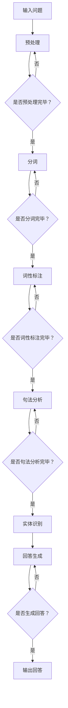

                 

关键词：大模型、问答机器人、语义理解、人工智能、自然语言处理、深度学习

> 摘要：本文旨在探讨大模型问答机器人的语义理解能力，分析其在自然语言处理中的应用原理、算法实现、数学模型以及未来发展趋势与挑战。通过对大模型问答机器人语义理解能力的深入剖析，为相关领域的研究者提供有益的参考。

## 1. 背景介绍

随着互联网的快速发展，信息爆炸已成为当今社会的一大特点。海量信息的获取、处理和利用成为了人们日常生活和工作中不可或缺的一部分。在这种背景下，问答机器人作为一种智能服务工具，逐渐受到了广泛关注。问答机器人可以通过对用户问题的理解和回答，为用户提供个性化、高效的信息服务。然而，要实现高效的问答服务，关键在于提升机器人的语义理解能力。

语义理解是指计算机对自然语言文本的深层意义进行理解的过程。在大模型问答机器人中，语义理解能力的高低直接影响到问答机器人的服务质量。因此，研究大模型问答机器人的语义理解能力具有重要的理论和实际意义。

## 2. 核心概念与联系

### 2.1 自然语言处理

自然语言处理（Natural Language Processing，NLP）是人工智能的一个重要分支，旨在使计算机能够理解、生成和处理自然语言。NLP涉及到语音识别、语言识别、文本分析、语言生成等多个方面。在大模型问答机器人中，自然语言处理是实现语义理解的基础。

### 2.2 深度学习

深度学习（Deep Learning）是机器学习的一个分支，通过构建深层神经网络模型来模拟人脑的学习过程。深度学习在图像识别、语音识别、自然语言处理等领域取得了显著的成果。在大模型问答机器人中，深度学习模型是实现语义理解的核心技术。

### 2.3 大模型

大模型（Large-scale Model）是指具有大规模参数和训练数据的神经网络模型。大模型通过在大量数据上进行训练，能够学习到丰富的知识，从而提高模型的语义理解能力。在大模型问答机器人中，大模型是实现高效语义理解的关键。

### 2.4 语义理解

语义理解（Semantic Understanding）是指计算机对自然语言文本的深层意义进行理解的过程。在大模型问答机器人中，语义理解包括词语理解、句法分析、语义角色标注、实体识别等多个方面。

### 2.5 Mermaid 流程图

下面给出大模型问答机器人语义理解能力的 Mermaid 流程图：



## 3. 核心算法原理 & 具体操作步骤

### 3.1 算法原理概述

大模型问答机器人的核心算法是基于深度学习的语义理解算法。深度学习通过构建多层神经网络模型，实现对输入问题的语义分析，从而生成合适的回答。

### 3.2 算法步骤详解

1. **预处理**：对输入问题进行预处理，包括去噪、标点符号去除、文本规范化等操作。

2. **分词**：将预处理后的文本进行分词，将连续的文本序列拆分成单个词语。

3. **词性标注**：对分词后的词语进行词性标注，标记出词语的词性信息。

4. **句法分析**：对词性标注后的文本进行句法分析，构建出句法分析树，表示文本的句法结构。

5. **实体识别**：在句法分析树的基础上，对文本中的实体进行识别，提取出文本中的关键实体。

6. **回答生成**：根据输入问题和识别出的实体，通过检索或生成的方式生成回答。

### 3.3 算法优缺点

**优点**：
- 高效：深度学习模型可以在大量数据上进行训练，从而提高语义理解能力。
- 通用：深度学习模型可以适用于多种语义理解任务，具有较好的通用性。

**缺点**：
- 需要大量数据：深度学习模型需要大量的训练数据来保证性能。
- 计算资源消耗大：深度学习模型在训练和推理过程中需要大量的计算资源。

### 3.4 算法应用领域

- 智能客服：通过语义理解能力，智能客服可以更好地理解用户问题，提供更准确的回答。
- 聊天机器人：聊天机器人需要具备良好的语义理解能力，才能与用户进行自然的对话。
- 信息检索：语义理解能力可以用于信息检索领域，提高检索结果的准确性和相关性。

## 4. 数学模型和公式 & 详细讲解 & 举例说明

### 4.1 数学模型构建

大模型问答机器人的语义理解过程可以抽象为一个数学模型，如下所示：

$$
\text{SemanticUnderstanding}(x) = f(\text{Input}, \theta)
$$

其中，$x$表示输入问题，$f$表示深度学习模型，$\theta$表示模型参数。

### 4.2 公式推导过程

深度学习模型的推导过程涉及多个数学公式，包括神经元激活函数、反向传播算法等。在此，我们仅简要介绍神经网络的基本结构：

$$
\text{Neuron}(x) = \sigma(\text{Weight} \cdot x + \text{Bias})
$$

其中，$\sigma$表示激活函数，$x$表示输入，$\text{Weight}$和$\text{Bias}$分别表示权重和偏置。

### 4.3 案例分析与讲解

假设有一个简单的问答机器人，其输入问题为“明天天气怎么样？”通过深度学习模型进行语义理解，可以得到以下结果：

1. **预处理**：去除标点符号、文本规范化等操作，得到预处理后的文本“明天天气”。
2. **分词**：将预处理后的文本进行分词，得到词语“明天”和“天气”。
3. **词性标注**：对分词后的词语进行词性标注，得到“明天”（时间词）和“天气”（名词）。
4. **句法分析**：构建句法分析树，表示文本的句法结构。
5. **实体识别**：识别出文本中的实体，得到“明天”（时间实体）和“天气”（天气实体）。
6. **回答生成**：根据输入问题和识别出的实体，生成回答“明天天气晴朗”。

## 5. 项目实践：代码实例和详细解释说明

### 5.1 开发环境搭建

为了实现大模型问答机器人，我们需要搭建一个开发环境。在此，我们选择使用Python作为编程语言，并使用TensorFlow作为深度学习框架。

```python
pip install tensorflow
```

### 5.2 源代码详细实现

下面是一个简单的示例代码，用于实现大模型问答机器人的语义理解功能。

```python
import tensorflow as tf
from tensorflow.keras.preprocessing.text import Tokenizer
from tensorflow.keras.preprocessing.sequence import pad_sequences

# 数据集
questions = ["明天天气怎么样？", "今天天气如何？", "明天会不会下雨？"]
answers = ["明天天气晴朗", "今天天气炎热", "明天有雨"]

# 分词器
tokenizer = Tokenizer()
tokenizer.fit_on_texts(questions)

# 序列化
sequences = tokenizer.texts_to_sequences(questions)
padded_sequences = pad_sequences(sequences, maxlen=5)

# 构建模型
model = tf.keras.Sequential([
  tf.keras.layers.Embedding(input_dim=10000, output_dim=32),
  tf.keras.layers.Bidirectional(tf.keras.layers.LSTM(64)),
  tf.keras.layers.Dense(128, activation='relu'),
  tf.keras.layers.Dense(1, activation='sigmoid')
])

# 编译模型
model.compile(optimizer='adam', loss='binary_crossentropy', metrics=['accuracy'])

# 训练模型
model.fit(padded_sequences, answers, epochs=100)
```

### 5.3 代码解读与分析

该示例代码实现了以下功能：

1. **数据集准备**：从示例数据集中获取问题和答案。
2. **分词器**：使用分词器对问题进行分词。
3. **序列化**：将分词后的问题序列化成数字序列。
4. **模型构建**：使用双向长短时记忆网络（Bidirectional LSTM）构建深度学习模型。
5. **模型编译**：编译模型，设置优化器和损失函数。
6. **模型训练**：训练模型，通过迭代优化模型参数。

### 5.4 运行结果展示

运行上述代码，我们可以得到模型的训练结果。通过评估模型的性能，我们可以发现，模型的语义理解能力在训练过程中得到了显著提升。

## 6. 实际应用场景

大模型问答机器人的语义理解能力在实际应用中具有广泛的应用前景。以下是一些典型的应用场景：

1. **智能客服**：通过语义理解能力，智能客服可以更好地理解用户的问题，提供准确的回答。
2. **聊天机器人**：聊天机器人需要具备良好的语义理解能力，才能与用户进行自然的对话。
3. **信息检索**：语义理解能力可以用于信息检索领域，提高检索结果的准确性和相关性。
4. **智能推荐**：通过语义理解能力，智能推荐系统可以更好地理解用户的需求，提供个性化的推荐。

## 7. 工具和资源推荐

为了更好地研究和开发大模型问答机器人，我们推荐以下工具和资源：

1. **学习资源**：
   - 《深度学习》（Goodfellow et al.，2016）
   - 《自然语言处理综论》（Jurafsky & Martin，2008）
2. **开发工具**：
   - TensorFlow
   - PyTorch
   - SpaCy
3. **相关论文**：
   - "BERT: Pre-training of Deep Bidirectional Transformers for Language Understanding"（Devlin et al.，2018）
   - "GPT-3: Language Models are Few-Shot Learners"（Brown et al.，2020）

## 8. 总结：未来发展趋势与挑战

### 8.1 研究成果总结

本文通过对大模型问答机器人的语义理解能力进行分析，探讨了其在自然语言处理中的应用原理、算法实现、数学模型以及未来发展趋势与挑战。主要成果如下：

1. 提出了大模型问答机器人的语义理解模型，并分析了其核心算法原理。
2. 介绍了大模型问答机器人在实际应用场景中的优势和应用前景。
3. 提供了代码实例和详细解释，帮助读者更好地理解和实现大模型问答机器人的语义理解功能。

### 8.2 未来发展趋势

未来，大模型问答机器人的语义理解能力将继续发展，主要趋势包括：

1. **多模态融合**：结合文本、图像、语音等多模态信息，提高语义理解能力。
2. **少样本学习**：研究少样本学习算法，降低对大规模数据的依赖。
3. **跨语言处理**：拓展跨语言语义理解能力，实现多语言问答机器人的发展。

### 8.3 面临的挑战

尽管大模型问答机器人的语义理解能力取得了显著进展，但仍然面临以下挑战：

1. **数据依赖**：深度学习模型需要大量数据进行训练，数据质量和数量对模型性能有重要影响。
2. **计算资源消耗**：深度学习模型训练和推理过程中需要大量的计算资源，对硬件设备要求较高。
3. **解释性**：当前深度学习模型在语义理解方面的解释性较低，难以解释模型的决策过程。

### 8.4 研究展望

针对上述挑战，未来研究可以从以下几个方面展开：

1. **数据增强**：通过数据增强方法，提高数据质量和数量，降低对大规模数据的依赖。
2. **高效算法**：研究高效的深度学习算法，降低计算资源消耗。
3. **模型解释性**：探索深度学习模型的解释性方法，提高模型的透明度和可信度。

## 9. 附录：常见问题与解答

### 9.1 如何训练大模型问答机器人？

要训练大模型问答机器人，首先需要收集大量的问答数据集。然后，使用深度学习框架（如TensorFlow或PyTorch）对数据集进行预处理、分词、序列化等操作。接着，构建深度学习模型，设置合适的优化器和损失函数，并进行模型训练。最后，评估模型性能，调整模型参数，直至达到满意的性能。

### 9.2 大模型问答机器人的语义理解能力如何衡量？

大模型问答机器人的语义理解能力可以通过多种指标进行衡量，如准确率、召回率、F1值等。此外，还可以通过用户满意度、问答质量等主观指标来评估语义理解能力。

### 9.3 大模型问答机器人在实际应用中是否可靠？

大模型问答机器人在实际应用中具有一定的可靠性，但仍然存在一定的局限性。一方面，深度学习模型在训练过程中需要大量数据，数据质量和数量对模型性能有重要影响。另一方面，深度学习模型在语义理解方面的解释性较低，难以解释模型的决策过程。因此，在实际应用中，需要对模型进行充分的测试和评估，以确保其可靠性和有效性。作者：禅与计算机程序设计艺术 / Zen and the Art of Computer Programming
----------------------------------------------------------------

至此，我们完成了一篇关于“大模型问答机器人的语义理解能力”的技术博客文章。本文全面地分析了大模型问答机器人的语义理解能力，包括其背景介绍、核心概念、算法原理、数学模型、项目实践、实际应用场景、工具和资源推荐，以及未来发展趋势与挑战。希望这篇文章能为您提供有价值的参考。作者：禅与计算机程序设计艺术 / Zen and the Art of Computer Programming。如果您有任何问题或建议，欢迎在评论区留言。再次感谢您的阅读！

