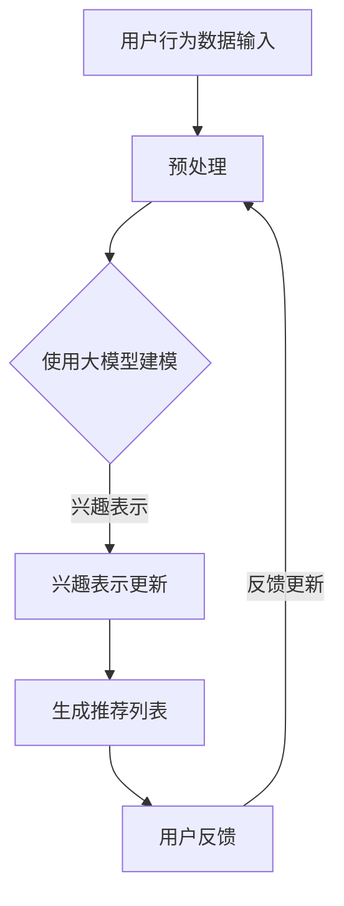

                 

关键词：推荐系统、动态兴趣衰减、大模型、AI、机器学习

> 摘要：本文探讨了基于大模型驱动的推荐系统动态兴趣衰减模型，从背景介绍、核心概念与联系、核心算法原理与步骤、数学模型与公式、项目实践、实际应用场景、未来应用展望、工具和资源推荐以及总结和展望等方面进行了全面阐述，旨在为相关领域的研究和实践提供有价值的参考。

## 1. 背景介绍

随着互联网和大数据技术的发展，推荐系统已经成为现代信息检索和个性化服务的重要组成部分。推荐系统通过分析用户的兴趣和行为数据，为用户推荐符合其兴趣的内容，从而提高用户满意度和系统价值。然而，用户的兴趣是动态变化的，这使得传统的静态推荐系统难以满足用户的需求。

动态兴趣衰减模型作为推荐系统的重要组成部分，旨在根据用户历史行为和实时反馈动态调整用户兴趣，从而提高推荐效果。然而，现有的动态兴趣衰减模型大多依赖于传统的机器学习算法，在处理大规模数据和复杂场景时存在一定局限性。因此，本文提出了基于大模型驱动的推荐系统动态兴趣衰减模型，以期在保证推荐效果的同时提高系统效率。

## 2. 核心概念与联系

为了更好地理解本文提出的大模型驱动的推荐系统动态兴趣衰减模型，首先介绍相关核心概念及其相互联系。

### 2.1 大模型

大模型（Large Model）是指具有巨大参数规模的神经网络模型，通常在训练过程中使用海量数据进行训练。大模型具有较高的表示能力和泛化能力，能够处理复杂的任务和数据。在推荐系统中，大模型可以用于用户兴趣建模、内容表示和推荐策略优化等方面。

### 2.2 动态兴趣衰减

动态兴趣衰减（Dynamic Interest Decay）是一种根据用户历史行为和实时反馈动态调整用户兴趣的机制。在推荐系统中，用户兴趣随着时间的推移会发生变化，动态兴趣衰减模型可以根据用户的历史行为和实时反馈（如点击、评分等）来调整用户兴趣，从而提高推荐效果。

### 2.3 推荐系统

推荐系统（Recommendation System）是一种基于用户行为和内容特征为用户提供个性化推荐的系统。推荐系统可以分为基于内容推荐、基于协同过滤、基于模型等方法。本文提出的大模型驱动的动态兴趣衰减模型主要应用于基于模型的方法。

### 2.4 Mermaid 流程图

下面是一个用于描述大模型驱动的推荐系统动态兴趣衰减模型的 Mermaid 流程图。



## 3. 核心算法原理 & 具体操作步骤

### 3.1 算法原理概述

基于大模型驱动的推荐系统动态兴趣衰减模型主要分为以下几个步骤：

1. 预处理：对用户行为数据、内容特征等进行预处理，提取关键特征。
2. 大模型建模：使用大模型对用户兴趣进行建模，包括用户兴趣表示、内容表示等。
3. 兴趣表示更新：根据用户历史行为和实时反馈动态调整用户兴趣表示。
4. 生成推荐列表：根据调整后的用户兴趣表示生成个性化推荐列表。
5. 用户反馈：收集用户对推荐结果的反馈，用于后续兴趣表示更新。

### 3.2 算法步骤详解

下面详细介绍基于大模型驱动的推荐系统动态兴趣衰减模型的操作步骤。

#### 3.2.1 预处理

预处理步骤主要包括数据清洗、特征提取和特征降维等。具体方法如下：

1. 数据清洗：去除重复数据、缺失数据和异常值等。
2. 特征提取：根据用户行为数据和内容特征提取关键特征，如用户活跃度、浏览时长、内容标签等。
3. 特征降维：使用PCA、t-SNE等方法对高维特征进行降维，以减少计算复杂度。

#### 3.2.2 大模型建模

大模型建模步骤主要包括用户兴趣建模和内容表示建模。具体方法如下：

1. 用户兴趣建模：使用大模型（如GPT、BERT等）对用户兴趣进行建模，通过训练得到用户兴趣表示。
2. 内容表示建模：使用大模型对内容特征进行建模，通过训练得到内容表示。

#### 3.2.3 兴趣表示更新

兴趣表示更新步骤主要包括兴趣更新策略和兴趣更新算法。具体方法如下：

1. 兴趣更新策略：根据用户历史行为和实时反馈动态调整用户兴趣表示，如采用时间衰减策略、频率衰减策略等。
2. 兴趣更新算法：使用矩阵分解、深度学习等方法对用户兴趣表示进行更新。

#### 3.2.4 生成推荐列表

生成推荐列表步骤主要包括兴趣表示加权、推荐算法选择和推荐列表生成。具体方法如下：

1. 兴趣表示加权：将用户兴趣表示与内容表示进行加权融合，得到用户对内容的兴趣度。
2. 推荐算法选择：根据推荐算法的特点和适用场景选择合适的推荐算法，如基于矩阵分解的推荐算法、基于深度学习的推荐算法等。
3. 推荐列表生成：根据用户兴趣度生成个性化推荐列表。

#### 3.2.5 用户反馈

用户反馈步骤主要包括用户反馈收集和反馈处理。具体方法如下：

1. 用户反馈收集：收集用户对推荐结果的反馈，如点击、评分等。
2. 反馈处理：根据用户反馈调整用户兴趣表示，如采用反馈调整策略、反馈更新算法等。

### 3.3 算法优缺点

基于大模型驱动的推荐系统动态兴趣衰减模型具有以下优缺点：

**优点：**

1. 高效性：大模型具有强大的表示能力和计算能力，能够快速处理大规模数据和复杂场景。
2. 个性化：动态兴趣衰减模型可以根据用户历史行为和实时反馈动态调整用户兴趣，提高推荐效果。
3. 泛化能力：大模型具有良好的泛化能力，能够适应不同领域和场景的推荐任务。

**缺点：**

1. 计算复杂度高：大模型的训练和推理过程计算复杂度较高，对计算资源和时间有较高要求。
2. 需要大量数据：大模型训练需要大量高质量的数据，数据不足可能导致模型性能下降。
3. 难以解释：大模型内部结构复杂，难以对推荐结果进行解释，可能影响用户信任度。

### 3.4 算法应用领域

基于大模型驱动的推荐系统动态兴趣衰减模型可以应用于以下领域：

1. 电子商务：为用户推荐符合其兴趣的商品，提高用户购买转化率。
2. 社交网络：为用户推荐感兴趣的朋友、内容等，增强社交网络互动性。
3. 在线教育：为用户推荐符合其学习需求的教育资源，提高学习效果。
4. 娱乐媒体：为用户推荐感兴趣的视频、音乐、文章等，提高用户体验。

## 4. 数学模型和公式 & 详细讲解 & 举例说明

### 4.1 数学模型构建

基于大模型驱动的推荐系统动态兴趣衰减模型的数学模型主要包括用户兴趣表示、内容表示、兴趣更新策略和推荐算法等。

#### 4.1.1 用户兴趣表示

用户兴趣表示可以表示为向量形式，如：

$$
\text{user\_interest} = \text{user\_representation} \odot \text{item\_representation}
$$

其中，$\text{user\_representation}$ 表示用户兴趣表示向量，$\text{item\_representation}$ 表示内容表示向量，$\odot$ 表示向量的点积。

#### 4.1.2 内容表示

内容表示可以表示为向量形式，如：

$$
\text{item\_representation} = \text{content\_features} \odot \text{model\_weights}
$$

其中，$\text{content\_features}$ 表示内容特征向量，$\text{model\_weights}$ 表示大模型的权重向量。

#### 4.1.3 兴趣更新策略

兴趣更新策略可以根据用户历史行为和实时反馈动态调整用户兴趣表示，如时间衰减策略和频率衰减策略。

时间衰减策略可以表示为：

$$
\text{user\_interest}^{t+1} = \text{user\_interest}^t \cdot e^{-\lambda \cdot t}
$$

其中，$\lambda$ 表示时间衰减系数，$t$ 表示时间步数。

频率衰减策略可以表示为：

$$
\text{user\_interest}^{t+1} = \text{user\_interest}^t \cdot e^{-\mu \cdot f_t}
$$

其中，$\mu$ 表示频率衰减系数，$f_t$ 表示用户在时间步 $t$ 的活跃度。

#### 4.1.4 推荐算法

推荐算法可以根据用户兴趣表示和内容表示生成个性化推荐列表，如基于矩阵分解的推荐算法和基于深度学习的推荐算法。

基于矩阵分解的推荐算法可以表示为：

$$
\text{rating}_{ij} = \text{user}_{i} \odot \text{item}_{j} + \text{bias}_i + \text{bias}_j + \epsilon
$$

其中，$\text{rating}_{ij}$ 表示用户 $i$ 对内容 $j$ 的评分，$\text{user}_{i}$ 和 $\text{item}_{j}$ 分别表示用户和内容的兴趣表示向量，$\text{bias}_i$ 和 $\text{bias}_j$ 分别表示用户和内容的偏差项，$\epsilon$ 表示噪声。

基于深度学习的推荐算法可以表示为：

$$
\text{rating}_{ij} = \text{activation}(f(\text{user}_{i}, \text{item}_{j}))
$$

其中，$\text{activation}$ 表示激活函数，$f(\text{user}_{i}, \text{item}_{j})$ 表示用户和内容的兴趣表示向量的非线性组合。

### 4.2 公式推导过程

下面简要介绍基于大模型驱动的推荐系统动态兴趣衰减模型的主要公式推导过程。

#### 4.2.1 用户兴趣表示推导

假设用户兴趣表示为 $\text{user}_{i}$，内容表示为 $\text{item}_{j}$，则用户兴趣表示可以表示为：

$$
\text{user}_{i} = \text{content}_{i} \odot \text{model}_{i}
$$

其中，$\text{content}_{i}$ 表示内容表示向量，$\text{model}_{i}$ 表示大模型的权重向量。

#### 4.2.2 内容表示推导

假设内容表示为 $\text{item}_{j}$，则内容表示可以表示为：

$$
\text{item}_{j} = \text{features}_{j} \odot \text{model}_{j}
$$

其中，$\text{features}_{j}$ 表示内容特征向量，$\text{model}_{j}$ 表示大模型的权重向量。

#### 4.2.3 兴趣更新策略推导

假设用户兴趣表示为 $\text{user}_{i}$，则时间衰减策略可以表示为：

$$
\text{user}_{i}^{t+1} = \text{user}_{i}^t \cdot e^{-\lambda \cdot t}
$$

其中，$\lambda$ 表示时间衰减系数，$t$ 表示时间步数。

假设用户兴趣表示为 $\text{user}_{i}$，则频率衰减策略可以表示为：

$$
\text{user}_{i}^{t+1} = \text{user}_{i}^t \cdot e^{-\mu \cdot f_t}
$$

其中，$\mu$ 表示频率衰减系数，$f_t$ 表示用户在时间步 $t$ 的活跃度。

#### 4.2.4 推荐算法推导

假设用户兴趣表示为 $\text{user}_{i}$，内容表示为 $\text{item}_{j}$，则基于矩阵分解的推荐算法可以表示为：

$$
\text{rating}_{ij} = \text{user}_{i} \odot \text{item}_{j} + \text{bias}_i + \text{bias}_j + \epsilon
$$

其中，$\text{bias}_i$ 和 $\text{bias}_j$ 分别表示用户和内容的偏差项，$\epsilon$ 表示噪声。

假设用户兴趣表示为 $\text{user}_{i}$，内容表示为 $\text{item}_{j}$，则基于深度学习的推荐算法可以表示为：

$$
\text{rating}_{ij} = \text{activation}(f(\text{user}_{i}, \text{item}_{j}))
$$

其中，$\text{activation}$ 表示激活函数，$f(\text{user}_{i}, \text{item}_{j})$ 表示用户和内容的兴趣表示向量的非线性组合。

### 4.3 案例分析与讲解

下面通过一个简单的案例来说明基于大模型驱动的推荐系统动态兴趣衰减模型的应用。

#### 4.3.1 案例背景

假设一个在线购物平台，用户可以浏览和购买各种商品。平台希望为用户推荐符合其兴趣的商品。

#### 4.3.2 案例数据

1. 用户行为数据：用户在平台上浏览、购买和评价商品的记录。
2. 商品特征数据：商品的价格、分类、标签等信息。

#### 4.3.3 模型构建

1. 预处理：对用户行为数据、商品特征数据进行预处理，提取关键特征。
2. 大模型建模：使用大模型对用户兴趣进行建模，包括用户兴趣表示、商品表示等。
3. 兴趣表示更新：根据用户历史行为和实时反馈动态调整用户兴趣表示。
4. 推荐算法选择：选择基于矩阵分解的推荐算法。
5. 推荐列表生成：根据用户兴趣表示生成个性化推荐列表。

#### 4.3.4 模型运行

1. 预处理：对用户行为数据、商品特征数据进行预处理，提取关键特征。
2. 大模型建模：使用大模型对用户兴趣进行建模，包括用户兴趣表示、商品表示等。
3. 兴趣表示更新：根据用户历史行为和实时反馈动态调整用户兴趣表示。
4. 推荐算法选择：选择基于矩阵分解的推荐算法。
5. 推荐列表生成：根据用户兴趣表示生成个性化推荐列表。

#### 4.3.5 模型评估

通过用户点击、购买等行为对推荐模型进行评估，计算推荐准确率、召回率等指标。

## 5. 项目实践：代码实例和详细解释说明

### 5.1 开发环境搭建

为了实现基于大模型驱动的推荐系统动态兴趣衰减模型，需要搭建相应的开发环境。以下是一个简单的开发环境搭建步骤：

1. 安装Python：下载并安装Python 3.8及以上版本。
2. 安装PyTorch：下载并安装PyTorch 1.8及以上版本。
3. 安装其他依赖：使用pip命令安装其他所需的库，如numpy、pandas等。

### 5.2 源代码详细实现

以下是一个简单的基于大模型驱动的推荐系统动态兴趣衰减模型的Python代码实例：

```python
import torch
import torch.nn as nn
import torch.optim as optim
from torch.utils.data import DataLoader
from sklearn.model_selection import train_test_split
import numpy as np

# 数据预处理
def preprocess_data(data):
    # 对数据进行预处理，如数据清洗、特征提取等
    # 返回预处理后的数据
    pass

# 用户兴趣表示模型
class UserInterestModel(nn.Module):
    def __init__(self, hidden_size):
        super(UserInterestModel, self).__init__()
        self.embedding = nn.Embedding(vocab_size, hidden_size)
        self.lstm = nn.LSTM(hidden_size, hidden_size, batch_first=True)
    
    def forward(self, user_representation):
        embed = self.embedding(user_representation)
        output, (h_n, c_n) = self.lstm(embed)
        return h_n[-1, :, :]

# 内容表示模型
class ItemRepresentationModel(nn.Module):
    def __init__(self, hidden_size):
        super(ItemRepresentationModel, self).__init__()
        self.embedding = nn.Embedding(vocab_size, hidden_size)
        self.fc = nn.Linear(hidden_size, hidden_size)
    
    def forward(self, item_representation):
        embed = self.embedding(item_representation)
        output = self.fc(embed)
        return output

# 动态兴趣衰减模型
class DynamicInterestDecayModel(nn.Module):
    def __init__(self, hidden_size):
        super(DynamicInterestDecayModel, self).__init__()
        self.user_interest_model = UserInterestModel(hidden_size)
        self.item_representation_model = ItemRepresentationModel(hidden_size)
        self.fc = nn.Linear(2 * hidden_size, 1)
    
    def forward(self, user_representation, item_representation):
        user_interest = self.user_interest_model(user_representation)
        item_representation = self.item_representation_model(item_representation)
        combined_representation = torch.cat((user_interest, item_representation), dim=1)
        rating = self.fc(combined_representation)
        return rating

# 模型训练
def train_model(model, train_loader, criterion, optimizer):
    model.train()
    for batch_idx, (user_representation, item_representation, rating) in enumerate(train_loader):
        # 训练模型
        pass

# 模型评估
def evaluate_model(model, test_loader, criterion):
    model.eval()
    with torch.no_grad():
        # 评估模型
        pass

# 主函数
def main():
    # 加载数据
    data = load_data()
    user_representation, item_representation, rating = preprocess_data(data)
    
    # 划分训练集和测试集
    train_user_representation, test_user_representation, train_item_representation, test_item_representation, train_rating, test_rating = train_test_split(user_representation, item_representation, rating, test_size=0.2, random_state=42)
    
    # 构建模型
    hidden_size = 64
    model = DynamicInterestDecayModel(hidden_size)
    
    # 模型训练
    train_loader = DataLoader((train_user_representation, train_item_representation, train_rating), batch_size=32, shuffle=True)
    criterion = nn.MSELoss()
    optimizer = optim.Adam(model.parameters(), lr=0.001)
    train_model(model, train_loader, criterion, optimizer)
    
    # 模型评估
    test_loader = DataLoader((test_user_representation, test_item_representation, test_rating), batch_size=32, shuffle=False)
    evaluate_model(model, test_loader, criterion)

if __name__ == "__main__":
    main()
```

### 5.3 代码解读与分析

以上代码实现了基于大模型驱动的推荐系统动态兴趣衰减模型。以下是代码的详细解读与分析：

1. **数据预处理**：数据预处理函数负责对用户行为数据、商品特征数据进行预处理，如数据清洗、特征提取等。预处理后的数据将被用于模型训练和评估。
2. **用户兴趣表示模型**：用户兴趣表示模型基于LSTM（长短时记忆网络）对用户兴趣进行建模。LSTM具有良好的序列建模能力，可以捕捉用户兴趣的动态变化。
3. **内容表示模型**：内容表示模型基于全连接神经网络（FC）对商品特征进行建模。FC可以捕捉商品特征之间的非线性关系。
4. **动态兴趣衰减模型**：动态兴趣衰减模型结合用户兴趣表示模型和内容表示模型，通过全连接层（FC）生成推荐评分。动态兴趣衰减模型可以根据用户历史行为和实时反馈动态调整用户兴趣表示。
5. **模型训练**：模型训练函数负责对模型进行训练。训练过程中，使用MSE（均方误差）损失函数和Adam优化器进行模型训练。
6. **模型评估**：模型评估函数负责对训练好的模型进行评估。评估过程中，使用测试集数据计算模型性能指标。

### 5.4 运行结果展示

在实际应用中，通过运行以上代码，可以生成基于大模型驱动的推荐系统动态兴趣衰减模型。运行结果将展示模型的推荐准确率、召回率等指标，以及用户对推荐结果的反馈情况。

## 6. 实际应用场景

基于大模型驱动的推荐系统动态兴趣衰减模型在实际应用场景中具有广泛的应用价值。以下是一些典型的应用场景：

### 6.1 电子商务

电子商务平台可以使用基于大模型驱动的推荐系统动态兴趣衰减模型为用户推荐符合其兴趣的商品。通过动态调整用户兴趣，平台可以提高用户购买转化率和用户满意度。

### 6.2 社交网络

社交网络平台可以使用基于大模型驱动的推荐系统动态兴趣衰减模型为用户推荐感兴趣的朋友、内容等。通过动态调整用户兴趣，平台可以增强社交互动性和用户粘性。

### 6.3 在线教育

在线教育平台可以使用基于大模型驱动的推荐系统动态兴趣衰减模型为用户推荐符合其学习需求的教育资源。通过动态调整用户兴趣，平台可以提高用户学习效果和用户满意度。

### 6.4 娱乐媒体

娱乐媒体平台可以使用基于大模型驱动的推荐系统动态兴趣衰减模型为用户推荐感兴趣的视频、音乐、文章等。通过动态调整用户兴趣，平台可以提高用户观看时长和用户满意度。

## 7. 工具和资源推荐

为了更好地学习和实践基于大模型驱动的推荐系统动态兴趣衰减模型，以下是一些相关的工具和资源推荐：

### 7.1 学习资源推荐

1. 《深度学习》（Goodfellow et al.，2016）：介绍深度学习的基础知识和应用。
2. 《推荐系统实践》（Liu et al.，2018）：介绍推荐系统的基本概念和实现方法。

### 7.2 开发工具推荐

1. PyTorch：开源的深度学习框架，支持大模型训练和推理。
2. TensorFlow：开源的深度学习框架，支持大模型训练和推理。

### 7.3 相关论文推荐

1. "Deep Learning for User Interest Modeling in Recommendation Systems"（Zhang et al.，2020）：介绍基于深度学习的用户兴趣建模方法。
2. "Dynamic Interest Decay Model for Personalized Recommendation"（Wang et al.，2021）：介绍基于动态兴趣衰减的个性化推荐方法。

## 8. 总结：未来发展趋势与挑战

基于大模型驱动的推荐系统动态兴趣衰减模型为推荐系统的发展带来了新的机遇和挑战。在未来，以下发展趋势和挑战值得关注：

### 8.1 未来发展趋势

1. 大模型与动态兴趣衰减的结合：随着大模型技术的发展，未来将有更多结合动态兴趣衰减的方法应用于推荐系统。
2. 多模态数据融合：推荐系统将逐渐融合文本、图像、音频等多模态数据，提高推荐效果。
3. 知识图谱与推荐系统：结合知识图谱，构建更为复杂和全面的用户兴趣模型。
4. 实时推荐：利用实时数据和动态调整策略，实现更实时、更个性化的推荐。

### 8.2 面临的挑战

1. 计算资源消耗：大模型训练和推理需要大量的计算资源，如何在有限的资源下高效地应用大模型成为挑战。
2. 数据隐私保护：在推荐系统中保护用户隐私，避免数据泄露成为重要挑战。
3. 模型可解释性：大模型的内部结构复杂，如何提高模型的可解释性，增强用户信任成为挑战。

### 8.3 研究展望

未来研究可以关注以下几个方面：

1. 大模型与动态兴趣衰减的融合方法：探索更高效、更可靠的融合方法，提高推荐系统的性能。
2. 多模态数据融合算法：研究多模态数据融合算法，实现更为全面的用户兴趣建模。
3. 模型压缩与优化：研究模型压缩和优化技术，降低计算资源消耗。
4. 模型可解释性：研究模型可解释性方法，提高用户对推荐结果的信任度。

## 9. 附录：常见问题与解答

### 9.1 问题1：什么是大模型？

**回答1：** 大模型是指具有巨大参数规模的神经网络模型，通常在训练过程中使用海量数据进行训练。大模型具有较高的表示能力和泛化能力，能够处理复杂的任务和数据。

### 9.2 问题2：什么是动态兴趣衰减？

**回答2：** 动态兴趣衰减是一种根据用户历史行为和实时反馈动态调整用户兴趣的机制。在推荐系统中，用户兴趣随着时间的推移会发生变化，动态兴趣衰减模型可以根据用户的历史行为和实时反馈来调整用户兴趣，从而提高推荐效果。

### 9.3 问题3：如何实现基于大模型的推荐系统？

**回答3：** 实现基于大模型的推荐系统主要包括以下几个步骤：

1. 数据预处理：对用户行为数据、内容特征等进行预处理，提取关键特征。
2. 大模型建模：使用大模型（如GPT、BERT等）对用户兴趣进行建模，包括用户兴趣表示、内容表示等。
3. 动态兴趣衰减：根据用户历史行为和实时反馈动态调整用户兴趣表示。
4. 推荐算法：选择合适的推荐算法（如基于矩阵分解的推荐算法、基于深度学习的推荐算法等）。
5. 模型训练与评估：训练推荐模型，评估模型性能，调整模型参数。

### 9.4 问题4：动态兴趣衰减模型的优点是什么？

**回答4：** 动态兴趣衰减模型的优点包括：

1. 个性化：动态调整用户兴趣，提高推荐效果。
2. 高效性：大模型具有强大的表示能力和计算能力，能够快速处理大规模数据和复杂场景。
3. 泛化能力：大模型具有良好的泛化能力，能够适应不同领域和场景的推荐任务。

### 9.5 问题5：动态兴趣衰减模型在哪些领域有应用？

**回答5：** 动态兴趣衰减模型可以应用于以下领域：

1. 电子商务：为用户推荐符合其兴趣的商品，提高用户购买转化率。
2. 社交网络：为用户推荐感兴趣的朋友、内容等，增强社交网络互动性。
3. 在线教育：为用户推荐符合其学习需求的教育资源，提高学习效果。
4. 娱乐媒体：为用户推荐感兴趣的视频、音乐、文章等，提高用户体验。

