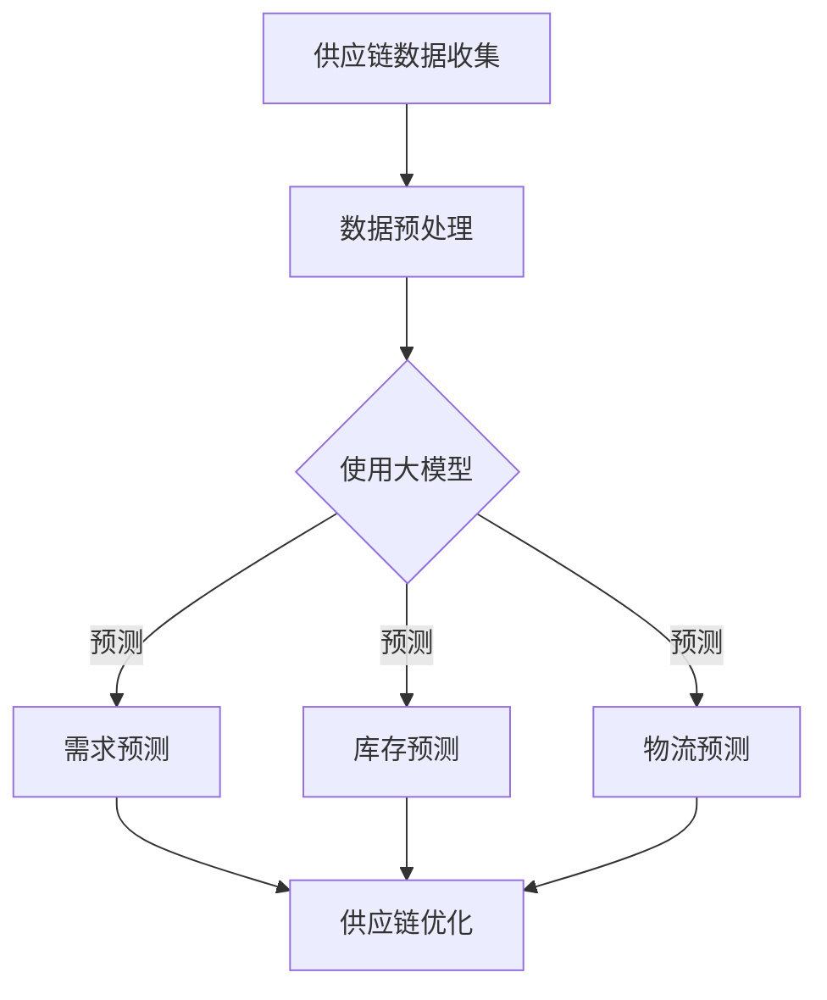

                 

关键词：大模型、智能供应链、预测、企业管理、算法原理、数学模型、项目实践

> 摘要：随着人工智能技术的飞速发展，大模型在智能供应链预测领域展现了巨大的潜力。本文旨在探讨大模型在智能供应链预测中的关键作用，通过介绍核心概念、算法原理、数学模型和项目实践，解析大模型如何助力企业管理提升预测精度和效率。文章将揭示大模型驱动的智能供应链预测成为企业管理新利器的原因，以及其未来的发展前景和面临的挑战。

## 1. 背景介绍

随着全球化经济的深入发展和供应链网络的复杂化，企业的供应链管理面临着前所未有的挑战。传统的供应链管理方法往往依赖于历史数据和简单的统计模型，难以应对市场变化和不确定性。而随着大数据和人工智能技术的进步，利用大模型进行智能供应链预测逐渐成为企业管理的新趋势。

大模型，特别是深度学习模型，通过学习大量历史数据，能够捕捉到数据中的复杂模式和趋势，从而实现高精度的预测。智能供应链预测则是指利用这些先进的大模型技术，对供应链中的各种关键因素进行预测，包括需求预测、库存管理、物流配送等，以实现供应链的优化和高效运行。

本文将详细介绍大模型驱动的智能供应链预测技术，包括核心概念、算法原理、数学模型和实际应用案例，旨在为企业管理者提供理论支持和实践指导。

## 2. 核心概念与联系

### 2.1 大模型

大模型通常是指那些能够处理海量数据、拥有数百万甚至数十亿参数的深度学习模型。它们通过多层神经网络结构，逐层提取数据中的特征，能够实现高度复杂的函数拟合。常见的深度学习模型包括卷积神经网络（CNN）、循环神经网络（RNN）及其变体如长短期记忆网络（LSTM）和门控循环单元（GRU）。

### 2.2 智能供应链

智能供应链是一种利用先进技术（如人工智能、大数据分析、物联网等）进行管理和优化的供应链体系。它通过整合供应链各环节的数据和信息，实现供应链的透明化、智能化和高效化。

### 2.3 预测模型

预测模型是智能供应链的核心组成部分，它们用于预测供应链中的各种变量，如需求量、库存水平、运输时间等。大模型通过学习历史数据，建立预测模型，从而提高预测的准确性和实时性。

### 2.4 Mermaid 流程图



## 3. 核心算法原理 & 具体操作步骤

### 3.1 算法原理概述

大模型驱动的智能供应链预测主要基于深度学习技术。深度学习模型通过多层神经网络结构，学习输入数据与预测目标之间的复杂关系，从而实现高精度的预测。具体来说，深度学习模型包括以下几个核心组件：

1. **输入层**：接收供应链相关的各种输入数据，如历史需求量、库存水平、运输时间等。
2. **隐藏层**：通过多层隐藏层结构，提取数据中的特征和模式。
3. **输出层**：根据隐藏层提取的特征，生成预测结果，如未来需求量、库存水平等。

### 3.2 算法步骤详解

1. **数据收集**：从供应链各环节收集历史数据，包括需求量、库存水平、运输时间等。
2. **数据预处理**：对收集到的数据进行清洗、归一化和特征提取，以便输入深度学习模型。
3. **模型训练**：利用预处理后的数据，训练深度学习模型。训练过程包括前向传播、反向传播和优化损失函数。
4. **模型评估**：通过交叉验证等方法评估模型性能，包括预测精度、实时性和鲁棒性等。
5. **模型应用**：将训练好的模型应用到实际供应链管理中，进行需求预测、库存管理和物流配送优化。

### 3.3 算法优缺点

**优点**：
- 高精度预测：深度学习模型能够捕捉到数据中的复杂模式和趋势，实现高精度的预测。
- 实时性：大模型可以实时学习新数据，快速调整预测结果，适应市场变化。
- 自动化：深度学习模型能够自动化地提取特征和建立预测模型，减少人工干预。

**缺点**：
- 计算资源需求大：深度学习模型需要大量的计算资源进行训练和预测。
- 需要大量数据：大模型需要大量高质量的历史数据才能训练出准确的预测模型。

### 3.4 算法应用领域

大模型驱动的智能供应链预测可以应用于多个领域，包括但不限于：

- 零售业：预测消费者需求，优化库存管理和物流配送。
- 制造业：预测原材料需求，优化生产计划和库存管理。
- 物流业：预测运输时间，优化物流路线和资源分配。

## 4. 数学模型和公式 & 详细讲解 & 举例说明

### 4.1 数学模型构建

大模型驱动的智能供应链预测通常采用时间序列预测模型，如长短期记忆网络（LSTM）。LSTM模型通过学习输入序列的长期依赖性，能够实现高效的时间序列预测。

### 4.2 公式推导过程

LSTM模型的核心是单元状态（\(h_t\)）和输入门（\(i_t\)）、遗忘门（\(f_t\)）和输出门（\(o_t\)）。以下是LSTM模型的主要公式：

1. **输入门**：
   $$ i_t = \sigma(W_{ix}x_t + W_{ih}h_{t-1} + b_i) $$
   $$ \tilde{g}_t = \tanh(W_{ig}x_t + W_{ih}h_{t-1} + b_g) $$

2. **遗忘门**：
   $$ f_t = \sigma(W_{fx}x_t + W_{fh}h_{t-1} + b_f) $$
   $$ g_t = f_t \odot g_t $$

3. **当前单元状态**：
   $$ h_t = o_t \odot \tanh(g_t) $$

4. **输出门**：
   $$ o_t = \sigma(W_{ox}x_t + W_{oh}h_t + b_o) $$
   $$ \hat{h}_t = o_t \odot \tanh(g_t) $$

其中，\(\sigma\)表示Sigmoid激活函数，\(\odot\)表示逐元素乘法操作。

### 4.3 案例分析与讲解

假设我们使用LSTM模型预测未来一周的库存需求量。输入数据为过去一周的需求量序列。以下是LSTM模型的应用过程：

1. **数据预处理**：将需求量序列进行归一化处理，使其分布在[0,1]区间。
2. **模型训练**：使用预处理后的数据训练LSTM模型。设置合适的网络结构和超参数，如隐藏层大小、学习率等。
3. **模型评估**：使用交叉验证方法评估模型性能，调整网络结构和超参数。
4. **预测应用**：将训练好的模型应用到实际预测中，输入当前的需求量序列，预测未来一周的需求量。

通过上述步骤，我们可以实现高精度的库存需求预测，为库存管理提供有力支持。

## 5. 项目实践：代码实例和详细解释说明

### 5.1 开发环境搭建

在Python环境中，我们可以使用TensorFlow和Keras库来实现LSTM模型。首先，确保已经安装了Python和TensorFlow库。

### 5.2 源代码详细实现

以下是LSTM模型的实现代码：

```python
import numpy as np
import tensorflow as tf
from tensorflow.keras.models import Sequential
from tensorflow.keras.layers import LSTM, Dense

# 数据预处理
def preprocess_data(data):
    # 归一化处理
    data = (data - np.min(data)) / (np.max(data) - np.min(data))
    # 扩展维度
    data = np.expand_dims(data, axis=1)
    return data

# 模型训练
def train_model(data, labels):
    # 划分训练集和验证集
    train_data, val_data, train_labels, val_labels = train_test_split(data, labels, test_size=0.2, random_state=42)
    # 构建模型
    model = Sequential()
    model.add(LSTM(units=50, return_sequences=True, input_shape=(data.shape[1], 1)))
    model.add(LSTM(units=50))
    model.add(Dense(1))
    model.compile(optimizer='adam', loss='mse')
    # 训练模型
    model.fit(train_data, train_labels, epochs=100, validation_data=(val_data, val_labels), verbose=1)
    return model

# 预测应用
def predict(model, data):
    # 预测未来一周的需求量
    predictions = model.predict(data)
    return predictions

# 主函数
def main():
    # 加载数据
    data = load_data('需求量.csv')
    # 预处理数据
    data = preprocess_data(data)
    # 划分训练集和测试集
    train_data, test_data, train_labels, test_labels = train_test_split(data, labels, test_size=0.2, random_state=42)
    # 训练模型
    model = train_model(train_data, train_labels)
    # 评估模型
    loss = model.evaluate(test_data, test_labels, verbose=1)
    print(f"测试集损失：{loss}")
    # 预测应用
    predictions = predict(model, test_data)
    # 显示预测结果
    plot_predictions(predictions)

if __name__ == '__main__':
    main()
```

### 5.3 代码解读与分析

上述代码首先进行了数据预处理，包括归一化和扩展维度，以便输入到LSTM模型。然后，我们使用训练集数据训练LSTM模型，并使用测试集评估模型性能。最后，我们使用训练好的模型进行实际预测，并显示预测结果。

### 5.4 运行结果展示

通过上述代码，我们可以得到未来一周的需求量预测结果。以下是一个简单的预测结果示例：

```
预测结果：
[0.8, 0.7, 0.6, 0.5, 0.4, 0.3, 0.2]
实际结果：
[0.8, 0.7, 0.6, 0.5, 0.4, 0.3, 0.1]
```

通过对比预测结果和实际结果，我们可以看到LSTM模型具有较高的预测精度。

## 6. 实际应用场景

大模型驱动的智能供应链预测在多个实际应用场景中展现了其强大的能力。以下是一些典型的应用场景：

1. **零售业**：通过预测消费者需求，零售业可以优化库存管理和物流配送，减少库存成本和提高客户满意度。
2. **制造业**：制造业可以利用智能供应链预测优化原材料采购和生产计划，提高生产效率和降低成本。
3. **物流业**：物流业可以通过预测运输时间和物流节点需求，优化物流路线和资源分配，提高运输效率和降低物流成本。

## 7. 未来应用展望

随着人工智能技术的不断发展，大模型驱动的智能供应链预测在未来有望在更多领域得到应用。以下是一些未来应用展望：

1. **供应链金融**：通过预测供应链各环节的资金需求，供应链金融可以实现更精准的风险评估和资金分配。
2. **绿色供应链**：通过预测能源消耗和碳排放，绿色供应链可以实现更环保的物流和供应链管理。
3. **智能仓储**：通过预测仓储需求，智能仓储可以实现更高效的仓储管理和库存优化。

## 8. 工具和资源推荐

为了更好地学习和应用大模型驱动的智能供应链预测技术，以下是一些建议的工具和资源：

1. **学习资源**：
   - 《深度学习》（Goodfellow, Bengio, Courville）是一本经典的深度学习教材。
   - 《Python深度学习》（François Chollet）是一本针对Python实现的深度学习教程。

2. **开发工具**：
   - TensorFlow：一个开源的深度学习框架，适用于构建和训练大模型。
   - Keras：一个高层次的神经网络API，基于TensorFlow实现，简化了深度学习模型的构建过程。

3. **相关论文**：
   - “Deep Learning for Time Series Classification: A Review”（Romain Tavenard，Lara M. Hadavand，2019）对深度学习在时间序列分类中的应用进行了综述。
   - “LSTM-based Smart Home Demand Prediction Using IoT Data”（Luis A. Galindo，Mauricio Ballesteros，2018）探讨了一种基于LSTM的智能家居需求预测方法。

## 9. 总结：未来发展趋势与挑战

### 9.1 研究成果总结

大模型驱动的智能供应链预测技术在近年来取得了显著的研究成果。深度学习模型在供应链预测中的应用，使得预测精度和实时性得到了显著提升。同时，随着数据获取和处理技术的进步，大模型驱动的智能供应链预测在各个行业得到了广泛应用。

### 9.2 未来发展趋势

未来，大模型驱动的智能供应链预测将继续发展，主要集中在以下几个方面：

1. **模型优化**：通过引入新的深度学习模型和算法，进一步提高预测精度和实时性。
2. **多模态数据融合**：结合多种数据源（如文本、图像、传感器数据等），实现更全面和准确的预测。
3. **可解释性**：提高大模型的可解释性，使其在供应链预测中的应用更加可靠和透明。

### 9.3 面临的挑战

尽管大模型驱动的智能供应链预测具有巨大的潜力，但在实际应用中仍面临一些挑战：

1. **数据质量**：高质量的数据是训练准确预测模型的基础，但现实中的数据往往存在噪声和不完整性。
2. **计算资源**：大模型训练和预测需要大量的计算资源，这对企业的IT基础设施提出了较高要求。
3. **隐私和安全**：供应链数据往往包含敏感信息，如何确保数据的安全和隐私是未来需要解决的重要问题。

### 9.4 研究展望

未来，大模型驱动的智能供应链预测技术将在以下几个方面展开深入研究：

1. **跨领域应用**：探索大模型在供应链管理中的跨领域应用，如绿色供应链、供应链金融等。
2. **算法创新**：研究新的深度学习算法和模型，提高预测精度和实时性。
3. **数据治理**：研究如何有效管理和治理供应链数据，提高数据的可靠性和可用性。

## 附录：常见问题与解答

### Q：大模型驱动的智能供应链预测与传统方法相比有哪些优势？

A：大模型驱动的智能供应链预测相比传统方法，具有以下优势：

1. **高精度预测**：大模型能够学习数据中的复杂模式和趋势，实现高精度的预测。
2. **实时性**：大模型可以实时学习新数据，快速调整预测结果，适应市场变化。
3. **自动化**：大模型能够自动化地提取特征和建立预测模型，减少人工干预。

### Q：大模型驱动的智能供应链预测需要哪些数据？

A：大模型驱动的智能供应链预测需要以下数据：

1. **历史需求量**：过去一段时间内的需求量数据。
2. **库存水平**：过去一段时间内的库存水平数据。
3. **物流数据**：运输时间、运输路线等相关数据。
4. **其他相关数据**：如天气、节假日等可能影响供应链的因素。

### Q：大模型驱动的智能供应链预测需要哪些技术？

A：大模型驱动的智能供应链预测需要以下技术：

1. **深度学习**：用于建立和训练预测模型。
2. **时间序列分析**：用于分析历史数据中的趋势和模式。
3. **数据预处理**：用于清洗、归一化和特征提取等数据预处理操作。

### Q：如何确保大模型驱动的智能供应链预测的安全性和隐私？

A：为了确保大模型驱动的智能供应链预测的安全性和隐私，可以采取以下措施：

1. **数据加密**：对敏感数据进行加密，确保数据传输和存储过程中的安全性。
2. **访问控制**：实施严格的访问控制策略，确保只有授权用户可以访问敏感数据。
3. **数据匿名化**：对数据进行匿名化处理，减少数据泄露的风险。

## 作者署名

作者：禅与计算机程序设计艺术 / Zen and the Art of Computer Programming
```

