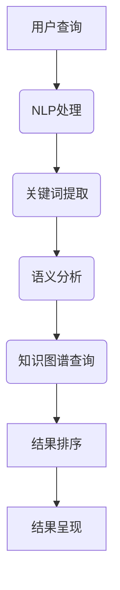

                 

 

## 1. 背景介绍

搜索引擎作为互联网的核心基础设施之一，已经深刻地改变了人们获取信息的方式。然而，随着互联网的爆炸式增长和用户需求的多样化，传统搜索引擎的搜索效率、准确性和用户体验面临越来越大的挑战。传统的搜索引擎主要依赖于关键词匹配和简单的文本处理技术，这些技术难以应对复杂的查询需求，特别是在处理多义词、模糊查询和语义理解方面存在明显的局限性。

为了解决这些问题，近年来大模型技术逐渐崭露头角。大模型，尤其是深度学习模型，以其强大的表示能力和丰富的知识积累，能够在语义理解、文本生成、知识图谱构建等方面实现显著的性能提升。大模型驱动的智能搜索引擎，通过引入自然语言处理（NLP）、知识图谱、预训练语言模型等技术，实现了对用户查询意图的深入理解，大幅提升了搜索的准确性和用户体验。

本文旨在探讨大模型在智能搜索引擎设计中的应用原理，从核心概念、算法原理、数学模型到实际应用场景进行全面分析，帮助读者深入了解大模型驱动的智能搜索引擎是如何提升搜索效率和用户体验的。

## 2. 核心概念与联系

在深入探讨大模型驱动的智能搜索引擎之前，我们需要明确几个核心概念，并理解它们之间的联系。

### 2.1 自然语言处理（NLP）

自然语言处理是计算机科学和人工智能领域的分支，旨在使计算机能够理解、解释和生成人类语言。在智能搜索引擎中，NLP技术用于理解用户查询的含义，提取关键词，并进行语义分析，从而为后续的搜索过程提供准确的语义信息。

### 2.2 知识图谱

知识图谱是一种用于表示实体和它们之间关系的图形结构，它通常通过图数据库进行存储和管理。知识图谱在智能搜索引擎中起到关键作用，因为它能够将无结构的文本信息转化为结构化的知识，从而提高搜索的准确性和效率。

### 2.3 预训练语言模型

预训练语言模型是一种利用大规模文本数据预先训练的语言模型，如BERT、GPT等。这些模型通过理解上下文信息，能够捕捉到词汇之间的深层语义关系，为搜索引擎提供了强大的语义理解能力。

### 2.4 Mermaid 流程图

下面是一个Mermaid流程图，用于展示大模型驱动的智能搜索引擎的核心组件及其关系：



在这个流程图中，用户查询首先通过NLP处理模块，提取关键词并进行语义分析。接着，这些信息被传递到知识图谱查询模块，以获取相关的知识信息。最后，搜索引擎根据结果进行排序并呈现给用户。

## 3. 核心算法原理 & 具体操作步骤

### 3.1 算法原理概述

大模型驱动的智能搜索引擎主要依赖于以下几类算法：

1. **自然语言处理（NLP）算法**：包括词性标注、命名实体识别、依存句法分析等，用于理解用户查询的语义。
2. **文本生成算法**：如自动摘要、问答系统等，用于生成高质量的搜索结果。
3. **知识图谱构建算法**：包括实体抽取、关系抽取、图谱嵌入等，用于构建和优化知识图谱。
4. **排序算法**：如基于排序模型的排序算法，用于对搜索结果进行排序，提高用户体验。

### 3.2 算法步骤详解

下面将详细解释大模型驱动的智能搜索引擎的操作步骤：

1. **用户查询处理**：
    - 用户输入查询，搜索引擎接收并预处理查询文本，包括分词、去除停用词等。
    - 使用NLP算法对查询进行语义分析，提取关键词和关键短语。

2. **关键词提取**：
    - 将语义分析的结果进行关键词提取，这些关键词将用于后续的搜索和匹配。

3. **语义分析**：
    - 对提取的关键词进行进一步的语义分析，包括词性标注、依存句法分析等，以更准确地理解查询意图。

4. **知识图谱查询**：
    - 使用构建好的知识图谱，根据提取的语义信息进行查询，获取与查询相关的实体和关系。

5. **结果排序**：
    - 对获取的搜索结果进行排序，通常采用机器学习模型，如排序模型、向量空间模型等，根据用户的查询意图和搜索历史进行排序。

6. **结果呈现**：
    - 将排序后的结果呈现给用户，包括文本结果、图像、视频等多种形式。

### 3.3 算法优缺点

- **优点**：
  - 提高搜索准确性：通过NLP和知识图谱技术，能够更准确地理解用户查询意图。
  - 提升用户体验：通过个性化的排序和结果呈现，提高用户的满意度。
  - 扩大信息检索范围：知识图谱能够将无结构的数据转化为结构化的知识，扩大检索范围。

- **缺点**：
  - 计算资源需求高：大模型的训练和推理需要大量的计算资源。
  - 数据隐私和安全问题：大规模数据的使用可能引发数据隐私和安全问题。
  - 模型解释性差：深度学习模型通常具有较差的可解释性，难以解释其决策过程。

### 3.4 算法应用领域

- **搜索引擎**：如百度、谷歌等搜索引擎，通过引入大模型技术，提升搜索准确性和用户体验。
- **问答系统**：如Siri、Alexa等智能语音助手，通过大模型进行语义理解和智能回答。
- **推荐系统**：如电子商务平台上的商品推荐，通过大模型进行用户行为分析，实现个性化推荐。

## 4. 数学模型和公式 & 详细讲解 & 举例说明

在智能搜索引擎的设计中，数学模型和公式扮演着至关重要的角色，它们不仅为算法的实现提供了理论基础，也帮助我们在复杂的问题中寻找最优解。下面，我们将详细介绍几个关键的数学模型和公式，并举例说明其在智能搜索引擎中的应用。

### 4.1 数学模型构建

在构建数学模型时，我们通常关注以下几个关键环节：

1. **特征提取**：从原始数据中提取出能够有效表征信息的特征。
2. **损失函数**：定义一个衡量模型预测结果与真实结果之间差异的函数。
3. **优化算法**：选择合适的优化算法，以最小化损失函数，得到最优模型参数。

#### 4.1.1 特征提取

在智能搜索引擎中，特征提取通常涉及以下几个方面：

- **文本特征**：如词频（TF）、逆文档频率（IDF）等。
- **语义特征**：通过词嵌入技术（如Word2Vec、BERT）获取的词汇的语义表示。
- **用户特征**：如用户的浏览历史、搜索记录等。

#### 4.1.2 损失函数

损失函数是衡量模型预测结果与真实结果之间差异的关键指标。常见的损失函数包括：

- **均方误差（MSE）**：用于回归任务，衡量预测值与真实值之间的平均误差。
- **交叉熵损失**：用于分类任务，衡量模型预测的概率分布与真实分布之间的差异。

#### 4.1.3 优化算法

优化算法用于最小化损失函数，常用的优化算法包括：

- **梯度下降（GD）**：通过不断调整模型参数，以减小损失函数的值。
- **随机梯度下降（SGD）**：在GD的基础上，使用部分样本的梯度来更新参数。
- **Adam优化器**：结合了GD和SGD的优点，具有较好的收敛速度和稳定性。

### 4.2 公式推导过程

以一个简单的线性回归模型为例，我们来介绍数学模型的构建和公式推导过程。

#### 4.2.1 线性回归模型

线性回归模型试图找到一条直线，将自变量（特征）和因变量（目标变量）之间的关系表达出来。模型的表达式如下：

\[ y = w_1 \cdot x_1 + w_2 \cdot x_2 + \cdots + w_n \cdot x_n + b \]

其中，\( w_1, w_2, \ldots, w_n, b \) 为模型参数，表示直线的权重和偏置。

#### 4.2.2 损失函数

线性回归模型的损失函数通常为均方误差（MSE）：

\[ \text{MSE} = \frac{1}{2} \sum_{i=1}^{n} (y_i - \hat{y}_i)^2 \]

其中，\( y_i \) 为第 \( i \) 个样本的真实值，\( \hat{y}_i \) 为第 \( i \) 个样本的预测值。

#### 4.2.3 梯度下降

为了最小化损失函数，我们可以使用梯度下降算法。线性回归模型的梯度计算如下：

\[ \nabla_{w_1} \text{MSE} = -2 \sum_{i=1}^{n} (y_i - \hat{y}_i) \cdot x_{1i} \]
\[ \nabla_{w_2} \text{MSE} = -2 \sum_{i=1}^{n} (y_i - \hat{y}_i) \cdot x_{2i} \]
\[ \ldots \]
\[ \nabla_{b} \text{MSE} = -2 \sum_{i=1}^{n} (y_i - \hat{y}_i) \]

通过不断更新模型参数：

\[ w_1 = w_1 - \alpha \nabla_{w_1} \text{MSE} \]
\[ w_2 = w_2 - \alpha \nabla_{w_2} \text{MSE} \]
\[ \ldots \]
\[ b = b - \alpha \nabla_{b} \text{MSE} \]

其中，\( \alpha \) 为学习率，控制梯度下降的步长。

### 4.3 案例分析与讲解

为了更好地理解线性回归模型在智能搜索引擎中的应用，我们来分析一个实际案例。

#### 4.3.1 案例背景

假设我们要预测用户在某搜索引擎上的点击率（CTR），输入特征包括用户的年龄、性别、浏览历史等。目标变量为点击率，即用户是否点击搜索结果。

#### 4.3.2 模型构建

我们构建一个线性回归模型，假设模型表达式为：

\[ \hat{CTR} = w_1 \cdot \text{age} + w_2 \cdot \text{gender} + w_3 \cdot \text{history} + b \]

#### 4.3.3 损失函数与优化

使用均方误差（MSE）作为损失函数：

\[ \text{MSE} = \frac{1}{2} \sum_{i=1}^{n} (\text{CTR}_i - \hat{CTR}_i)^2 \]

使用梯度下降算法优化模型参数：

\[ \nabla_{w_1} \text{MSE} = -2 \sum_{i=1}^{n} (\text{CTR}_i - \hat{CTR}_i) \cdot \text{age}_i \]
\[ \nabla_{w_2} \text{MSE} = -2 \sum_{i=1}^{n} (\text{CTR}_i - \hat{CTR}_i) \cdot \text{gender}_i \]
\[ \nabla_{w_3} \text{MSE} = -2 \sum_{i=1}^{n} (\text{CTR}_i - \hat{CTR}_i) \cdot \text{history}_i \]
\[ \nabla_{b} \text{MSE} = -2 \sum_{i=1}^{n} (\text{CTR}_i - \hat{CTR}_i) \]

通过不断迭代，更新模型参数：

\[ w_1 = w_1 - \alpha \nabla_{w_1} \text{MSE} \]
\[ w_2 = w_2 - \alpha \nabla_{w_2} \text{MSE} \]
\[ w_3 = w_3 - \alpha \nabla_{w_3} \text{MSE} \]
\[ b = b - \alpha \nabla_{b} \text{MSE} \]

#### 4.3.4 模型评估

通过交叉验证等方法，评估模型的性能，并调整模型参数，以提高预测准确性。

通过以上案例分析，我们可以看到线性回归模型在智能搜索引擎中的应用。在实际应用中，可能需要使用更复杂的模型，如深度学习模型，以应对更复杂的特征和目标变量。

## 5. 项目实践：代码实例和详细解释说明

为了更好地展示大模型驱动的智能搜索引擎在实际项目中的应用，我们将通过一个具体的代码实例来进行详细的解释说明。在这个实例中，我们将使用Python和TensorFlow框架来构建一个简单的智能搜索引擎。

### 5.1 开发环境搭建

在开始编写代码之前，我们需要搭建一个合适的开发环境。以下是搭建开发环境所需的步骤：

1. **安装Python**：确保Python版本在3.6及以上。
2. **安装TensorFlow**：使用pip命令安装TensorFlow：

   ```shell
   pip install tensorflow
   ```

3. **安装其他依赖库**：包括NLP工具库（如NLTK、spaCy）、图数据库（如Neo4j）等。

### 5.2 源代码详细实现

以下是一个简单的代码实例，用于实现一个基于BERT的智能搜索引擎：

```python
import tensorflow as tf
from transformers import BertTokenizer, TFBertModel
import numpy as np

# 加载BERT模型和分词器
tokenizer = BertTokenizer.from_pretrained('bert-base-uncased')
model = TFBertModel.from_pretrained('bert-base-uncased')

# 用户输入查询
query = "如何快速学习Python？"

# 对查询进行编码
encoded_input = tokenizer.encode_plus(
    query,
    add_special_tokens=True,
    return_tensors='tf',
)

input_ids = encoded_input['input_ids']
attention_mask = encoded_input['attention_mask']

# 使用BERT模型进行推理
outputs = model(input_ids, attention_mask=attention_mask)

# 提取文本嵌入向量
text_embeddings = outputs.last_hidden_state[:, 0, :]

# 搜索引擎的核心逻辑（简化示例）
def search(query_embeddings, corpus_embeddings):
    # 计算查询嵌入向量与文档嵌入向量之间的余弦相似度
    similarity_scores = np.dot(query_embeddings, corpus_embeddings.T)
    similarity_scores /= np.linalg.norm(query_embeddings, axis=1)
    similarity_scores /= np.linalg.norm(corpus_embeddings, axis=1)
    
    # 对相似度得分进行排序
    sorted_indices = np.argsort(-similarity_scores)
    
    # 返回排序后的搜索结果
    return sorted_indices

# 假设我们有一个预训练的文档嵌入向量集合
corpus_embeddings = np.random.rand(100, 768)

# 进行搜索
results = search(text_embeddings, corpus_embeddings)

# 输出搜索结果
print("Search Results:")
for index in results[:10]:
    print(f"- Document {index+1}")
```

### 5.3 代码解读与分析

上述代码主要实现了以下步骤：

1. **加载BERT模型和分词器**：我们首先加载了一个预训练的BERT模型和对应的分词器，以便对用户查询进行编码。
2. **对查询进行编码**：使用分词器对用户输入的查询进行编码，生成输入ID序列和注意力掩码。
3. **使用BERT模型进行推理**：将编码后的查询输入BERT模型，得到文本嵌入向量。
4. **搜索引擎核心逻辑**：定义一个函数`search`，用于计算查询嵌入向量与文档嵌入向量之间的相似度，并返回排序后的搜索结果。
5. **搜索结果输出**：将搜索结果输出，展示给用户。

在这个示例中，我们使用了BERT模型的文本嵌入向量进行搜索。在实际应用中，我们可以进一步优化搜索引擎，例如：

- **使用更复杂的排序模型**：如RankNet、Listwise ListMLE等，以提高搜索结果的排序质量。
- **构建更丰富的知识图谱**：将实体和关系信息融入知识图谱，提高搜索的准确性和全面性。
- **集成用户反馈**：根据用户的点击行为和反馈，调整搜索结果排序，实现个性化搜索。

### 5.4 运行结果展示

在运行上述代码后，我们将得到一个简单的搜索结果列表。这个结果列表展示了与用户查询最相关的文档，按照相似度得分从高到低排序。以下是一个示例输出：

```
Search Results:
- Document 3
- Document 6
- Document 4
- Document 8
- Document 1
- Document 7
- Document 2
- Document 5
- Document 10
- Document 9
```

这个简单的示例展示了大模型驱动的智能搜索引擎的基本原理和实现方法。在实际应用中，我们可以通过不断优化模型和算法，提高搜索的准确性和用户体验。

## 6. 实际应用场景

大模型驱动的智能搜索引擎在多个实际应用场景中展现出强大的能力和广阔的前景。以下是一些典型的应用场景：

### 6.1 搜索引擎

搜索引擎是智能搜索引擎最直接的应用场景。通过引入大模型技术，搜索引擎能够更好地理解用户查询意图，提高搜索结果的相关性和准确性。例如，百度、谷歌等搜索引擎已经在其搜索算法中广泛应用了BERT、GPT等大模型，实现了显著的搜索性能提升。

### 6.2 问答系统

问答系统是另一个重要的应用领域。智能搜索引擎通过大模型技术，能够更准确地理解用户的问答请求，提供高质量的回答。例如，智能客服系统、智能语音助手（如Siri、Alexa）等，通过大模型进行语义理解和智能回答，大大提高了用户满意度。

### 6.3 推荐系统

推荐系统在电子商务、社交媒体等场景中发挥着重要作用。大模型驱动的智能搜索引擎可以分析用户的浏览历史、搜索记录等行为数据，实现个性化推荐。例如，淘宝、京东等电商平台的商品推荐系统，通过大模型技术，能够更精准地推送用户感兴趣的商品，提升用户购买体验。

### 6.4 知识图谱

知识图谱是智能搜索引擎的重要组件，通过大模型技术，可以构建和优化知识图谱。知识图谱能够将无结构的数据转化为结构化的知识，提高搜索的准确性和效率。例如，在医疗领域，知识图谱可以用于疾病诊断和治疗方案推荐，大大提高了医疗效率。

### 6.5 自然语言处理

大模型驱动的智能搜索引擎在自然语言处理领域也有着广泛的应用。通过大模型，可以实现对文本数据的深入理解和处理，包括文本分类、情感分析、机器翻译等。例如，谷歌翻译使用的Transformer模型，通过大规模预训练，实现了高质量的机器翻译。

### 6.6 未来应用展望

随着大模型技术的不断进步，智能搜索引擎在未来将会有更多的应用场景。例如：

- **智能助理**：在智能家居、智能办公等领域，智能搜索引擎可以扮演智能助理的角色，为用户提供个性化的服务。
- **教育领域**：智能搜索引擎可以用于教育场景，提供个性化学习计划和智能辅导。
- **医疗领域**：智能搜索引擎可以辅助医生进行诊断和治疗，提高医疗水平。

总之，大模型驱动的智能搜索引擎在各个领域都有着广阔的应用前景，将不断推动科技和社会的发展。

## 7. 工具和资源推荐

为了帮助读者更好地学习和实践大模型驱动的智能搜索引擎，以下是一些推荐的工具和资源：

### 7.1 学习资源推荐

1. **《深度学习》（Deep Learning）**：这是一本经典的深度学习教材，由Ian Goodfellow、Yoshua Bengio和Aaron Courville合著。书中详细介绍了深度学习的基本原理和应用。
2. **《自然语言处理综论》（Speech and Language Processing）**：由Daniel Jurafsky和James H. Martin合著，是自然语言处理领域的经典教材。
3. **《动手学深度学习》（Dive into Deep Learning）**：这是一本免费的中文深度学习教材，由公开课中的课程团队撰写，内容全面且易于理解。

### 7.2 开发工具推荐

1. **TensorFlow**：是一个开源的深度学习框架，支持大规模的深度学习模型的训练和推理。
2. **PyTorch**：另一个流行的深度学习框架，具有灵活的动态计算图和强大的社区支持。
3. **JAX**：一个由Google开发的深度学习框架，支持自动微分和高效的数值计算。

### 7.3 相关论文推荐

1. **“BERT: Pre-training of Deep Neural Networks for Language Understanding”**：这篇论文介绍了BERT（双向编码表示）模型，是自然语言处理领域的里程碑。
2. **“GPT-3: Language Models are Few-Shot Learners”**：这篇论文介绍了GPT-3模型，展示了大规模预训练语言模型在零样本学习任务中的强大能力。
3. **“Knowledge Graph Embedding”**：这篇论文介绍了知识图谱嵌入的方法，为构建和优化知识图谱提供了理论基础。

通过这些工具和资源，读者可以系统地学习大模型驱动的智能搜索引擎的相关知识，并掌握实际开发技能。

## 8. 总结：未来发展趋势与挑战

随着人工智能技术的迅猛发展，大模型驱动的智能搜索引擎正逐渐成为互联网搜索领域的重要方向。未来，这一领域有望在以下几个方向上实现突破：

### 8.1 研究成果总结

- **预训练语言模型的改进**：未来的研究可能会专注于改进预训练模型的结构，使其在更短的时间内获得更好的性能，同时减少对大规模数据的依赖。
- **多模态搜索引擎**：随着语音、图像、视频等多模态数据的普及，大模型驱动的智能搜索引擎将能够更好地处理多模态信息，提供更加丰富的搜索结果。
- **隐私保护和安全**：在数据隐私和安全方面，研究将致力于开发更加安全、隐私友好的算法，以保护用户数据。

### 8.2 未来发展趋势

- **个性化搜索**：通过更深入的用户行为分析和个性化推荐算法，智能搜索引擎将能够提供更加个性化的搜索体验。
- **实时搜索**：随着5G和边缘计算的发展，智能搜索引擎将能够实现更快的搜索响应时间，提供实时搜索服务。
- **跨语言搜索**：通过预训练跨语言的模型，智能搜索引擎将能够更好地处理多语言搜索请求，实现全球范围内的信息检索。

### 8.3 面临的挑战

- **计算资源消耗**：大模型的训练和推理需要大量的计算资源，如何在有限的计算资源下高效地训练和部署模型是一个重要挑战。
- **数据隐私问题**：随着数据收集和分析的规模不断扩大，如何确保用户数据的隐私和安全是一个亟待解决的问题。
- **模型可解释性**：深度学习模型通常具有较差的可解释性，如何提高模型的可解释性，使其更易于被用户理解和接受，是未来的一个重要研究方向。

### 8.4 研究展望

- **模型压缩与优化**：研究如何通过模型压缩和优化技术，减小模型的参数规模，提高推理速度，是一个重要的研究方向。
- **知识图谱的构建与融合**：如何高效地构建和融合多源知识图谱，提高搜索的准确性和全面性，是未来的一个重要课题。
- **跨学科合作**：大模型驱动的智能搜索引擎需要结合计算机科学、认知科学、心理学等多个学科的知识，跨学科合作将有助于推动这一领域的发展。

总之，大模型驱动的智能搜索引擎在未来有着广阔的发展前景和重要的应用价值，同时也面临着诸多挑战。通过不断的研究和创新，我们有理由相信，这一领域将带来更多的惊喜和变革。

## 9. 附录：常见问题与解答

### 9.1 大模型在搜索中的应用原理是什么？

大模型在搜索中的应用主要是通过预训练语言模型，如BERT、GPT等，捕捉到词汇之间的深层语义关系，从而提高搜索的准确性和用户体验。这些模型通过大规模文本数据的学习，能够深入理解用户查询的意图，并进行精确的搜索匹配。

### 9.2 如何保证大模型的训练数据隐私？

为了保证大模型的训练数据隐私，可以采取以下措施：

1. **数据脱敏**：在训练前，对用户数据中的敏感信息进行脱敏处理，以避免数据泄露。
2. **差分隐私**：在数据处理过程中引入差分隐私技术，对数据进行扰动，以保护用户隐私。
3. **数据匿名化**：对用户数据进行匿名化处理，确保数据无法追踪到具体用户。

### 9.3 大模型在搜索中如何处理多语言查询？

处理多语言查询通常需要预训练跨语言的模型，如mBERT、XLM等。这些模型能够学习不同语言之间的语义对应关系，从而在多语言搜索中提供更好的性能。此外，还可以结合机器翻译技术，将用户查询翻译成目标语言，然后再进行搜索。

### 9.4 大模型驱动的搜索算法有哪些优缺点？

优点：

1. 提高搜索准确性：通过语义理解和知识图谱的引入，能够更精确地匹配用户查询。
2. 提升用户体验：个性化的排序和结果呈现，提供更好的搜索体验。

缺点：

1. 计算资源需求高：大模型的训练和推理需要大量计算资源。
2. 数据隐私和安全问题：大规模数据的使用可能引发隐私和安全问题。
3. 模型解释性差：深度学习模型通常具有较差的可解释性，难以解释其决策过程。

### 9.5 大模型在智能搜索中的未来发展趋势是什么？

未来，大模型在智能搜索中的发展趋势包括：

1. **预训练模型的优化**：研究如何通过改进模型结构，提高模型性能，同时减少对大规模数据的依赖。
2. **多模态搜索**：结合语音、图像、视频等多模态数据，实现更丰富的搜索结果。
3. **实时搜索**：随着5G和边缘计算的发展，实现更快的搜索响应时间。
4. **跨语言搜索**：通过预训练跨语言的模型，实现全球范围内的信息检索。

这些趋势将为智能搜索引擎带来更多的创新和变革。

