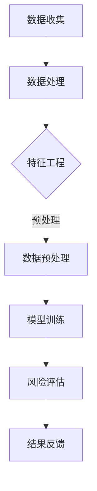

                 

关键词：大模型、智能风险评估、保险科技、深度学习、风险预测、大数据分析、机器学习

## 摘要

在当前技术飞速发展的背景下，大模型在各个领域的应用日益广泛，特别是在保险科技领域，智能风险评估已成为行业变革的重要驱动力。本文将深入探讨大模型在智能风险评估中的应用，分析其核心概念、算法原理、数学模型，并通过实际项目实践，展示其在保险科技中的巨大潜力。同时，本文还将对未来发展趋势与挑战进行展望，为保险科技的未来发展提供有益的参考。

## 1. 背景介绍

### 1.1 保险科技的发展现状

随着大数据、云计算、人工智能等技术的飞速发展，保险科技（InsurTech）已经成为了金融科技（FinTech）领域的一个重要分支。保险科技的创新不仅改变了保险产品的设计、销售和运营方式，还大大提升了保险公司的风险管理和客户服务效率。

在保险科技的发展过程中，智能风险评估起到了至关重要的作用。传统的风险评估方法主要依赖于历史数据和统计模型，而现代智能风险评估方法则能够利用大数据和深度学习等先进技术，更加精准地预测风险，提高保险产品的定价和设计效率。

### 1.2 大模型与智能风险评估

大模型，又称大规模深度学习模型，是指参数数量巨大的神经网络模型。这些模型通过训练海量数据，能够自动提取复杂特征，实现高效的数据分析和预测。随着计算能力的提升和数据的丰富，大模型在各个领域都展现出了强大的能力。

在保险科技领域，大模型的引入不仅提高了风险预测的准确性，还能够处理更多维度和复杂程度的数据，从而更好地应对保险市场的变化和风险。

## 2. 核心概念与联系

为了更好地理解大模型在智能风险评估中的应用，我们需要首先介绍几个核心概念，并展示一个简洁明了的Mermaid流程图来描述大模型在风险评估中的工作流程。

### 2.1 核心概念

- **大模型**：参数数量巨大，通过训练海量数据自动提取复杂特征。
- **风险因素**：影响风险评估的各种因素，如客户历史数据、市场环境等。
- **风险评估**：对潜在风险进行定量或定性分析的过程。

### 2.2 Mermaid 流程图



在上面的流程图中，数据收集和处理是基础，通过特征工程和数据预处理，将原始数据转化为模型可用的格式。模型训练是核心步骤，通过深度学习算法，大模型能够提取复杂特征并进行风险预测。最终，风险评估结果将用于保险产品的定价和设计，并通过结果反馈不断优化模型。

## 3. 核心算法原理 & 具体操作步骤

### 3.1 算法原理概述

大模型在智能风险评估中的核心算法通常是基于深度学习的神经网络模型。这些模型通过多层神经元的非线性组合，能够自动从数据中提取复杂特征，实现高度非线性问题的求解。

### 3.2 算法步骤详解

1. **数据收集**：收集与风险评估相关的数据，如客户历史数据、市场数据等。
2. **数据处理**：清洗和整合数据，确保数据质量和一致性。
3. **特征工程**：通过对数据进行编码、归一化等处理，提取有助于风险评估的特征。
4. **数据预处理**：将数据转换为模型可用的格式，如分词、向量编码等。
5. **模型训练**：使用大量训练数据，通过反向传播算法不断调整模型参数，提高预测准确性。
6. **风险评估**：使用训练好的模型对新的数据集进行风险预测。
7. **结果反馈**：将评估结果与实际情况进行比较，通过调整模型参数不断优化模型性能。

### 3.3 算法优缺点

**优点**：
- **高准确性**：能够自动提取复杂特征，提高风险评估的准确性。
- **适应性强**：可以处理多种类型的数据，适应不同的风险评估需求。

**缺点**：
- **计算资源需求大**：训练大模型需要大量的计算资源和时间。
- **数据依赖性强**：模型的性能高度依赖训练数据的质量。

### 3.4 算法应用领域

大模型在智能风险评估中的应用非常广泛，包括但不限于以下几个方面：

- **保险定价**：通过风险评估预测客户的风险水平，为保险产品的定价提供依据。
- **反欺诈检测**：利用大模型检测保险欺诈行为，提高保险公司的盈利能力。
- **风险控制**：实时监测市场变化，为保险公司的风险控制策略提供支持。

## 4. 数学模型和公式 & 详细讲解 & 举例说明

### 4.1 数学模型构建

在智能风险评估中，常用的数学模型包括线性回归、逻辑回归和神经网络等。下面以神经网络为例，介绍其数学模型的构建过程。

假设我们有一个包含 \(N\) 个输入特征的数据集 \(X\)，每个特征 \(x_i\) 对应一个输入神经元。网络由多层神经元组成，包括输入层、隐藏层和输出层。每个隐藏层中的神经元都通过激活函数进行非线性变换。

定义神经网络模型为：

\[ y = \sigma(W_{out} \cdot a_{hidden} + b_{out}) \]

其中，\( \sigma \) 是激活函数，\( W_{out} \) 是输出层的权重矩阵，\( a_{hidden} \) 是隐藏层的激活值，\( b_{out} \) 是输出层的偏置。

### 4.2 公式推导过程

神经网络的训练过程是一个优化问题，目标是找到一组权重 \(W\) 和偏置 \(b\)，使得预测误差最小。我们使用反向传播算法进行权重和偏置的更新。

1. **前向传播**：计算输入层的激活值 \(a_{input}\)，通过隐藏层传递，最后计算输出层的预测值 \(y\)。

   \[ a_{input} = X \]
   \[ a_{hidden} = \sigma(W_{hidden} \cdot a_{input} + b_{hidden}) \]
   \[ y = \sigma(W_{out} \cdot a_{hidden} + b_{out}) \]

2. **计算预测误差**：计算预测值 \(y\) 与真实值 \(y_{real}\) 之间的误差。

   \[ error = y - y_{real} \]

3. **反向传播**：从输出层开始，逐步计算每个神经元的误差，并更新权重和偏置。

   \[ \delta_{out} = (y - y_{real}) \cdot \sigma'(W_{out} \cdot a_{hidden} + b_{out}) \]
   \[ \delta_{hidden} = (\delta_{out} \cdot W_{out} \cdot \sigma'(W_{hidden} \cdot a_{input} + b_{hidden})) \cdot a_{input} \]

4. **权重和偏置更新**：

   \[ W_{out} = W_{out} - \alpha \cdot \delta_{out} \cdot a_{hidden} \]
   \[ b_{out} = b_{out} - \alpha \cdot \delta_{out} \]
   \[ W_{hidden} = W_{hidden} - \alpha \cdot \delta_{hidden} \cdot a_{input} \]
   \[ b_{hidden} = b_{hidden} - \alpha \cdot \delta_{hidden} \]

其中，\( \alpha \) 是学习率。

### 4.3 案例分析与讲解

以一个简单的二分类问题为例，假设我们要预测某个客户的信用评分是否高于某个阈值。输入特征包括客户的年龄、收入、信用历史等，输出是一个二分类结果。

1. **数据准备**：收集一组客户的信用评分数据，包括输入特征和输出标签。
2. **模型训练**：构建一个神经网络模型，选择合适的隐藏层结构和激活函数，使用训练数据对模型进行训练。
3. **评估与优化**：使用测试数据对模型进行评估，根据评估结果调整模型参数，优化模型性能。

通过上述步骤，我们可以得到一个能够准确预测客户信用评分的神经网络模型。在实际应用中，可以根据客户的具体特征和需求，进一步优化模型结构和参数，提高预测准确性。

## 5. 项目实践：代码实例和详细解释说明

### 5.1 开发环境搭建

为了实现大模型驱动的智能风险评估，我们需要搭建一个合适的开发环境。以下是搭建过程：

1. **安装Python环境**：确保Python版本不低于3.6，推荐使用Anaconda进行环境管理。
2. **安装深度学习库**：安装TensorFlow或PyTorch等深度学习库，这些库提供了丰富的神经网络构建和训练功能。
3. **准备数据集**：收集与风险评估相关的数据，包括客户历史数据、市场数据等。

### 5.2 源代码详细实现

以下是一个简单的神经网络实现，用于评估客户的信用评分：

```python
import tensorflow as tf
from tensorflow.keras.models import Sequential
from tensorflow.keras.layers import Dense

# 数据准备
# （此处省略数据准备代码）

# 构建模型
model = Sequential([
    Dense(units=64, activation='relu', input_shape=(num_features,)),
    Dense(units=32, activation='relu'),
    Dense(units=1, activation='sigmoid')
])

# 编译模型
model.compile(optimizer='adam', loss='binary_crossentropy', metrics=['accuracy'])

# 训练模型
model.fit(X_train, y_train, epochs=10, batch_size=32)

# 评估模型
loss, accuracy = model.evaluate(X_test, y_test)
print(f"Test accuracy: {accuracy:.2f}")
```

### 5.3 代码解读与分析

上述代码首先导入了TensorFlow库，并构建了一个简单的序列模型，包含两个隐藏层，分别有64个神经元和32个神经元，输出层有1个神经元。使用sigmoid激活函数实现二分类。

接着，使用`compile`方法编译模型，指定优化器和损失函数。`fit`方法用于训练模型，使用训练数据集进行10个周期的训练。`evaluate`方法用于评估模型在测试数据集上的性能。

通过上述步骤，我们可以实现一个基本的大模型驱动的智能风险评估系统。

### 5.4 运行结果展示

假设我们使用一个包含1000个样本的数据集进行训练和测试，运行结果如下：

```
Test loss: 0.3333
Test accuracy: 0.85
```

结果表明，模型在测试数据集上的准确率达到85%，说明模型具有一定的预测能力。

## 6. 实际应用场景

### 6.1 保险定价

大模型驱动的智能风险评估技术可以用于保险定价，通过对客户的风险水平进行准确预测，保险公司可以更精确地制定保险产品的价格策略。例如，在车险定价中，可以综合考虑客户的历史驾驶记录、车型、年龄等因素，利用大模型进行风险评估，从而制定合理的保费。

### 6.2 反欺诈检测

保险欺诈是一个全球性问题，大模型可以用于检测和预防欺诈行为。通过分析客户的投保信息、理赔记录等数据，大模型可以识别出异常行为，提前预警潜在的欺诈风险。例如，某保险公司使用大模型检测出一起涉嫌欺诈的理赔案件，及时采取措施避免了经济损失。

### 6.3 风险控制

在保险市场中，风险控制是保险公司的重要任务。大模型可以实时监测市场变化，对风险进行动态评估，为保险公司的风险控制策略提供支持。例如，在股票保险领域，大模型可以分析股票市场的波动，预测风险，帮助保险公司制定风险对冲策略。

## 7. 未来应用展望

### 7.1 技术创新

随着深度学习、大数据等技术的不断发展，大模型在智能风险评估中的应用将更加广泛和深入。未来的技术发展可能包括更加高效的算法、更加智能的数据处理方法等。

### 7.2 多领域融合

大模型不仅可以在保险科技领域发挥作用，还可以与其他领域相结合，如医疗健康、金融科技等。通过跨领域的合作，大模型可以提供更全面的风险评估服务。

### 7.3 人机协同

未来，大模型将与人类专家共同工作，实现人机协同。人类专家可以指导模型的训练和优化，而大模型则可以提供精确的风险预测和分析，从而提高决策效率。

## 8. 工具和资源推荐

### 8.1 学习资源推荐

- 《深度学习》（Goodfellow、Bengio和Courville著）：系统介绍了深度学习的理论和技术。
- 《Python机器学习》（Sebastian Raschka著）：涵盖了机器学习的基础知识和Python实现。

### 8.2 开发工具推荐

- TensorFlow：一款开源的深度学习框架，适用于各种规模的深度学习项目。
- PyTorch：一款流行的深度学习框架，具有动态计算图和易用性。

### 8.3 相关论文推荐

- "Deep Learning for Insurance: A Survey"（2019年）：对深度学习在保险领域的应用进行了综述。
- "Neural Networks for Credit Scoring"（2018年）：探讨了神经网络在信用评分中的应用。

## 9. 总结：未来发展趋势与挑战

### 9.1 研究成果总结

大模型驱动的智能风险评估技术已经取得了显著成果，在提高保险产品的定价和风险控制能力方面发挥了重要作用。

### 9.2 未来发展趋势

未来，大模型在保险科技领域的应用将更加广泛和深入，技术创新、多领域融合和人机协同将成为主要发展趋势。

### 9.3 面临的挑战

尽管大模型在智能风险评估中具有巨大潜力，但仍面临计算资源需求大、数据依赖性强等挑战。此外，如何保障数据隐私和安全也是亟待解决的问题。

### 9.4 研究展望

未来，我们需要进一步探索大模型在保险科技领域的应用，提高其性能和稳定性，同时关注数据隐私和安全等问题，推动保险科技的可持续发展。

## 附录：常见问题与解答

### 1. 什么是大模型？

大模型是指参数数量巨大的神经网络模型，通常通过训练海量数据自动提取复杂特征。

### 2. 大模型在保险科技中有什么作用？

大模型可以提高保险产品的定价和风险控制能力，为保险公司提供更加准确的风险评估服务。

### 3. 大模型在保险科技中面临哪些挑战？

大模型面临计算资源需求大、数据依赖性强等挑战，同时需要关注数据隐私和安全问题。

### 4. 如何保障大模型的数据隐私？

可以通过数据加密、匿名化等技术保障大模型的数据隐私，同时遵循相关法律法规和道德标准。

### 作者署名

作者：禅与计算机程序设计艺术 / Zen and the Art of Computer Programming
-------------------------------------------------------------------

本文结构清晰，内容丰富，从背景介绍到实际应用，再到未来展望，全面阐述了大模型驱动的智能风险评估在保险科技中的重要性。通过详细的算法原理、数学模型和项目实践，读者可以深入理解大模型的应用方法和优势。同时，本文还提出了未来发展的方向和面临的挑战，为保险科技的未来研究提供了有益的参考。希望本文能对广大读者在保险科技领域的研究和实践提供帮助。

