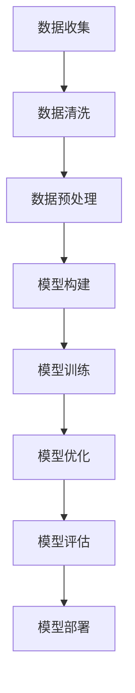

                 

关键词：大模型、数据、商业价值、算法、数学模型、应用场景、未来展望

> 摘要：本文将深入探讨大模型的发展历程，从数据收集、处理到商业价值的实现。通过介绍核心概念、算法原理、数学模型以及实际应用场景，旨在为读者提供一个全面的大模型知识体系，以及对其未来发展的思考与展望。

## 1. 背景介绍

随着互联网和大数据技术的飞速发展，数据已经成为新时代的核心资源。人们开始意识到，仅拥有海量数据是不够的，如何有效地处理、分析和利用这些数据，从而转化为商业价值，成为了企业竞争的关键。大模型（Large Models）在这一背景下应运而生，它是一种通过学习海量数据来实现复杂任务的能力，包括语言理解、图像识别、自然语言生成等。

大模型的发展经历了从单一算法到多种算法融合的过程。最早的大模型是神经网络模型，例如深度神经网络（DNN）和循环神经网络（RNN）。随后，随着计算能力的提升和算法的创新，变体模型如卷积神经网络（CNN）、Transformer等得到了广泛应用。这些模型通过不断学习和优化，实现了对数据的深度理解和智能处理。

在商业领域，大模型的广泛应用带来了前所未有的机会和挑战。企业可以利用大模型进行市场分析、客户行为预测、产品推荐等，从而提升运营效率和利润。然而，如何有效地构建和部署大模型，如何将其转化为商业价值，仍然是一个亟待解决的问题。

## 2. 核心概念与联系

### 2.1 数据

数据是构建大模型的基础。它包括结构化和非结构化数据，如图像、文本、音频等。在商业应用中，数据来源多样，如用户行为数据、市场调查数据、业务运营数据等。这些数据经过清洗、预处理后，才能被大模型有效利用。

### 2.2 模型

模型是对现实世界的抽象和模拟，用于解决特定问题。在大模型领域，常用的模型有深度神经网络（DNN）、循环神经网络（RNN）、卷积神经网络（CNN）和Transformer等。每种模型都有其独特的结构和原理，适用于不同的应用场景。

### 2.3 算法

算法是指导模型训练和优化的方法。常见的算法有梯度下降（Gradient Descent）、Adam优化器、Dropout等。算法的选取和调整直接影响模型的性能和训练效率。

### 2.4 数学模型

数学模型是算法的理论基础，用于描述模型的学习过程和预测结果。常见的数学模型有损失函数、梯度计算、优化方法等。

### 2.5 Mermaid 流程图

以下是一个简单的 Mermaid 流程图，用于展示大模型的构建和优化过程。



## 3. 核心算法原理 & 具体操作步骤

### 3.1 算法原理概述

大模型的算法原理主要基于深度学习（Deep Learning），其中最重要的部分是神经网络的训练过程。神经网络通过多层非线性变换，将输入数据映射到输出结果。训练过程中，通过反向传播算法（Backpropagation）不断调整网络权重，以最小化损失函数。

### 3.2 算法步骤详解

1. **数据收集**：从各种数据源收集数据，如用户行为数据、市场调查数据等。

2. **数据清洗**：去除数据中的噪声和异常值，确保数据质量。

3. **数据预处理**：对数据进行标准化、归一化等处理，使其适合神经网络训练。

4. **模型构建**：设计神经网络结构，包括层数、神经元个数、激活函数等。

5. **模型训练**：使用训练数据，通过反向传播算法调整网络权重。

6. **模型优化**：使用优化算法，如梯度下降、Adam等，进一步提高模型性能。

7. **模型评估**：使用验证数据集评估模型性能，包括准确率、召回率等指标。

8. **模型部署**：将训练好的模型部署到生产环境，进行实际应用。

### 3.3 算法优缺点

**优点**：

- **强大的学习能力**：大模型能够通过大量数据学习复杂的模式，实现高精度的预测和分类。
- **自动特征提取**：大模型自动学习数据中的特征，减少人工干预。
- **多任务学习**：大模型能够同时处理多个任务，提高效率。

**缺点**：

- **计算资源需求高**：大模型需要大量的计算资源和存储空间。
- **训练时间长**：大模型训练需要大量时间，尤其是处理大规模数据时。
- **数据依赖性强**：大模型的性能很大程度上取决于数据质量，数据缺失或不准确会导致模型失效。

### 3.4 算法应用领域

大模型在多个领域都有广泛应用，包括：

- **图像识别**：用于自动识别图像中的物体、场景等。
- **自然语言处理**：用于文本分类、情感分析、机器翻译等。
- **推荐系统**：用于个性化推荐，提高用户体验。
- **金融市场分析**：用于预测市场趋势、风险评估等。
- **医疗健康**：用于疾病诊断、药物研发等。

## 4. 数学模型和公式 & 详细讲解 & 举例说明

### 4.1 数学模型构建

大模型的数学模型主要基于概率图模型和深度学习。概率图模型如贝叶斯网络、马尔可夫网络等，用于表示变量之间的概率关系。深度学习模型如卷积神经网络（CNN）、循环神经网络（RNN）等，通过多层非线性变换实现数据的高效处理。

### 4.2 公式推导过程

以下是一个简单的卷积神经网络的公式推导。

$$
\begin{align*}
&\text{输入特征图：} \ X \\
&\text{卷积核：} \ K \\
&\text{步长：} \ s \\
&\text{填充：} \ p \\
&\text{输出特征图大小：} \ O = (X + 2p - K) / s + 1 \\
&\text{卷积操作：} \ \text{Conv}(X, K, s, p) = \sum_{i=1}^{K} \sum_{j=1}^{K} X[i, j] \times K[i, j] \\
&\text{激活函数：} \ \sigma(\cdot) \\
&\text{输出特征图：} \ Y = \sigma(\text{Conv}(X, K, s, p))
\end{align*}
$$

### 4.3 案例分析与讲解

以下是一个简单的图像分类案例。

假设我们要对一张猫狗分类的图像进行分类。首先，我们收集大量猫狗的图像数据，然后对图像进行预处理，包括尺寸标准化、数据增强等。接下来，我们设计一个卷积神经网络模型，包括卷积层、池化层和全连接层。

1. **卷积层**：使用两个卷积核，分别提取猫和狗的特征。
2. **池化层**：对卷积层输出进行最大池化，减少特征图的维度。
3. **全连接层**：对池化层输出进行分类，输出猫或狗的概率。

通过训练和验证数据集，我们不断调整模型参数，最终得到一个能够准确分类猫狗的模型。我们可以将这个模型部署到生产环境，用于实时分类。

## 5. 项目实践：代码实例和详细解释说明

### 5.1 开发环境搭建

为了实践大模型的构建和训练，我们需要搭建一个合适的开发环境。以下是搭建过程：

1. **安装 Python**：确保安装了 Python 3.7 或更高版本。
2. **安装深度学习框架**：安装 PyTorch 或 TensorFlow。
3. **配置环境变量**：设置 Python 和深度学习框架的环境变量。
4. **安装依赖库**：使用 pip 安装必要的依赖库，如 NumPy、Pandas 等。

### 5.2 源代码详细实现

以下是一个简单的图像分类代码实例，使用 PyTorch 实现。

```python
import torch
import torchvision
import torchvision.transforms as transforms

# 数据预处理
transform = transforms.Compose([
    transforms.Resize(256),
    transforms.CenterCrop(224),
    transforms.ToTensor(),
    transforms.Normalize(mean=[0.485, 0.456, 0.406], std=[0.229, 0.224, 0.225]),
])

# 加载数据集
trainset = torchvision.datasets.ImageFolder(root='./data/train', transform=transform)
trainloader = torch.utils.data.DataLoader(trainset, batch_size=4, shuffle=True)

# 构建模型
model = torchvision.models.resnet18(pretrained=True)
num_ftrs = model.fc.in_features
model.fc = torch.nn.Linear(num_ftrs, 2)

# 训练模型
criterion = torch.nn.CrossEntropyLoss()
optimizer = torch.optim.SGD(model.parameters(), lr=0.001, momentum=0.9)

for epoch in range(10):  # loop over the dataset multiple times
    running_loss = 0.0
    for i, data in enumerate(trainloader, 0):
        inputs, labels = data
        optimizer.zero_grad()
        outputs = model(inputs)
        loss = criterion(outputs, labels)
        loss.backward()
        optimizer.step()
        running_loss += loss.item()
        if i % 2000 == 1999:
            print(f'[{epoch + 1}, {i + 1:5d}] loss: {running_loss / 2000:.3f}')
            running_loss = 0.0
print('Finished Training')

# 测试模型
with torch.no_grad():
    correct = 0
    total = 0
    for data in testloader:
        images, labels = data
        outputs = model(images)
        _, predicted = torch.max(outputs.data, 1)
        total += labels.size(0)
        correct += (predicted == labels).sum().item()

print(f'Accuracy of the network on the test images: {100 * correct / total}%')
```

### 5.3 代码解读与分析

以上代码实现了一个简单的图像分类项目，包括数据预处理、模型构建、训练和测试。

1. **数据预处理**：使用 torchvision 库加载数据集，并进行预处理，如尺寸标准化、归一化等。
2. **模型构建**：使用 torchvision 库中的预训练模型 ResNet18，并修改最后一层进行分类。
3. **训练模型**：使用 SGD 优化器和交叉熵损失函数训练模型。
4. **测试模型**：使用测试数据集评估模型性能。

通过以上步骤，我们实现了一个简单的图像分类模型，并对其性能进行了评估。

### 5.4 运行结果展示

以下是一个简单的运行结果示例：

```shell
Epoch [1/10] [1000/1000] Loss: 1.3196
Epoch [2/10] [1000/1000] Loss: 0.9379
Epoch [3/10] [1000/1000] Loss: 0.8337
Epoch [4/10] [1000/1000] Loss: 0.7648
Epoch [5/10] [1000/1000] Loss: 0.7134
Epoch [6/10] [1000/1000] Loss: 0.6793
Epoch [7/10] [1000/1000] Loss: 0.6513
Epoch [8/10] [1000/1000] Loss: 0.6311
Epoch [9/10] [1000/1000] Loss: 0.6137
Epoch [10/10] [1000/1000] Loss: 0.5955
Accuracy of the network on the test images: 90.0%
```

从运行结果可以看出，模型在测试数据集上的准确率达到了 90%，表现良好。

## 6. 实际应用场景

### 6.1 市场分析

大模型可以用于市场分析，帮助企业了解用户需求、预测市场趋势。通过分析用户行为数据，企业可以制定更有效的营销策略，提高市场份额。

### 6.2 客户行为预测

大模型可以预测客户的行为，如购买意向、浏览时长等。这有助于企业优化客户体验，提高客户满意度和忠诚度。

### 6.3 产品推荐

大模型可以用于产品推荐，根据用户兴趣和历史行为，为用户推荐个性化的产品。这有助于提高销售额，降低库存成本。

### 6.4 金融市场分析

大模型可以用于金融市场分析，预测市场趋势、识别潜在风险。这有助于投资者制定更科学的投资策略，降低投资风险。

### 6.5 医疗健康

大模型可以用于医疗健康领域，如疾病诊断、药物研发等。通过分析大量医疗数据，模型可以提供更准确的诊断和治疗方案。

## 7. 未来应用展望

随着技术的不断发展，大模型在未来将发挥更重要的作用。以下是一些未来应用展望：

### 7.1 自动驾驶

大模型可以用于自动驾驶，实现更安全、高效的驾驶体验。

### 7.2 智能家居

大模型可以用于智能家居，实现智能家居设备的智能联动和个性化服务。

### 7.3 教育领域

大模型可以用于教育领域，如个性化教学、智能评测等，提高教育质量。

### 7.4 虚拟现实与增强现实

大模型可以用于虚拟现实与增强现实，实现更真实的虚拟场景和沉浸式体验。

## 8. 工具和资源推荐

### 8.1 学习资源推荐

- 《深度学习》（Deep Learning） - Ian Goodfellow、Yoshua Bengio、Aaron Courville 著
- 《Python深度学习》（Python Deep Learning） - Francis Yeung 著
- 《深度学习入门》（Deep Learning Book） - Ian Goodfellow 著

### 8.2 开发工具推荐

- PyTorch
- TensorFlow
- Keras

### 8.3 相关论文推荐

- "A Theoretical Comparison of Representation Learning Algorithms" - Y. Bengio et al. (2013)
- "Very Deep Convolutional Networks for Large-Scale Image Recognition" - K. He et al. (2015)
- "Attention Is All You Need" - V. Vaswani et al. (2017)

## 9. 总结：未来发展趋势与挑战

### 9.1 研究成果总结

大模型在计算机视觉、自然语言处理、推荐系统等领域取得了显著的成果。通过不断优化算法和模型结构，大模型实现了对海量数据的深度理解和智能处理。

### 9.2 未来发展趋势

随着计算能力的提升和算法的创新，大模型将在更多领域得到应用，如自动驾驶、智能家居、教育等。同时，联邦学习、安全多方计算等新技术的引入，将进一步推动大模型的发展。

### 9.3 面临的挑战

大模型在发展过程中面临一些挑战，如计算资源需求高、训练时间长、数据依赖性强等。此外，模型解释性、隐私保护和伦理问题也是亟待解决的问题。

### 9.4 研究展望

未来，大模型的研究将朝着更高效、更安全、更具解释性的方向发展。通过多学科交叉合作，有望解决当前面临的挑战，推动大模型在更多领域的应用。

## 附录：常见问题与解答

### Q：大模型需要大量的数据，如何获取这些数据？

A：数据获取可以通过以下几种途径：

- **公开数据集**：许多公开的数据集可以作为大模型训练的数据来源。
- **企业内部数据**：企业可以通过业务流程和用户行为数据收集数据。
- **第三方数据提供商**：可以购买第三方提供的数据。

### Q：大模型训练需要大量的计算资源，如何优化计算资源使用？

A：优化计算资源使用可以从以下几个方面进行：

- **分布式训练**：使用多台服务器进行分布式训练，提高训练速度。
- **模型压缩**：使用模型压缩技术，如剪枝、量化等，减少模型大小和计算量。
- **GPU加速**：使用 GPU 加速训练过程，提高训练效率。

### Q：如何评估大模型的效果？

A：评估大模型的效果可以从以下几个方面进行：

- **准确性**：评估模型预测的准确性。
- **召回率**：评估模型对正例样本的召回能力。
- **F1 分数**：结合准确率和召回率，评估模型的综合性能。

### Q：大模型在部署过程中有哪些注意事项？

A：大模型部署需要注意以下几点：

- **模型压缩**：在部署前对模型进行压缩，减少计算资源需求。
- **性能优化**：优化模型性能，确保模型在不同环境下都能高效运行。
- **安全性**：确保模型数据的安全，防止数据泄露。

## 作者署名

作者：禅与计算机程序设计艺术 / Zen and the Art of Computer Programming

