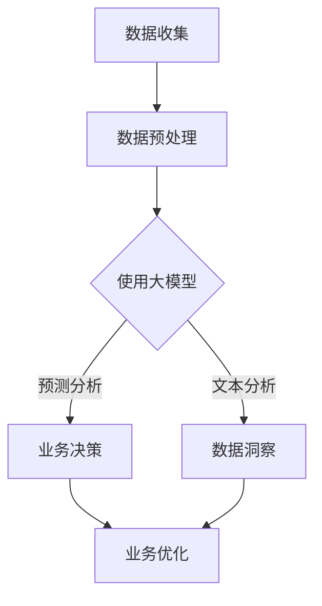

                 

 **关键词：** 大模型，商业智能，机器学习，数据处理，未来趋势

> **摘要：** 本文将深入探讨大模型在商业智能领域的应用，阐述其核心概念、算法原理、数学模型、实践案例及未来展望。通过详细的分析，旨在为读者揭示大模型如何重塑商业智能，为企业和组织带来前所未有的洞察力和竞争优势。

## 1. 背景介绍

在当今信息化、数字化的时代，数据已经成为新的生产要素。商业智能（Business Intelligence，BI）作为一种利用数据分析技术来提升企业决策效率的方法，正逐渐成为企业战略的重要组成部分。传统的商业智能技术依赖于结构化数据的处理，但面对日益复杂和庞大非结构化数据，传统方法显得力不从心。此时，大模型（Large Model）应运而生，为商业智能带来了新的机遇。

大模型，通常指的是参数规模达到数十亿、甚至千亿级的神经网络模型。这些模型通过自动学习从海量数据中提取特征，能够处理和解释复杂的数据结构，从而提供更深层次的数据洞察。在商业智能领域，大模型的引入不仅提升了数据处理和分析的能力，也为企业决策提供了更加精准的依据。

本文将从以下几个方面展开讨论：

1. **核心概念与联系**：介绍大模型的基本概念及其与商业智能的关联。
2. **核心算法原理 & 具体操作步骤**：解析大模型的工作原理和实现步骤。
3. **数学模型和公式 & 详细讲解 & 举例说明**：阐述大模型的数学基础及其应用实例。
4. **项目实践：代码实例和详细解释说明**：通过具体案例展示大模型的应用。
5. **实际应用场景**：分析大模型在商业智能领域的应用案例。
6. **未来应用展望**：探讨大模型在商业智能中的未来发展方向。

## 2. 核心概念与联系

### 2.1 大模型基本概念

大模型通常是指那些具有数十亿甚至千亿级参数的神经网络模型。这些模型基于深度学习的原理，通过多层神经元的非线性组合，实现对复杂数据的建模和分析。典型的代表包括谷歌的 BERT、OpenAI 的 GPT-3 等。

### 2.2 商业智能与大模型的关系

商业智能的核心理念在于利用数据和技术优化业务流程和决策过程。大模型的引入，使得商业智能能够处理更复杂、更大规模的数据，从而提供更深入的洞察。大模型在商业智能中的应用主要体现在以下几个方面：

- **数据预处理**：大模型能够自动识别和提取数据中的关键特征，大幅提高数据处理的效率。
- **预测与优化**：通过深度学习，大模型可以对业务数据进行分析，预测未来趋势，优化决策过程。
- **文本分析**：大模型在自然语言处理领域具有强大的能力，可以用于情感分析、文本分类等，为商业智能提供更为丰富的话语信息。
- **模式识别**：大模型能够识别数据中的复杂模式，为业务提供更为精准的分析。

### 2.3 Mermaid 流程图

下面是一个简化的 Mermaid 流程图，展示了大模型在商业智能中的应用流程：



## 3. 核心算法原理 & 具体操作步骤

### 3.1 算法原理概述

大模型的算法原理基于深度学习的思想，通过多层神经网络的组合来学习数据的内在规律。其基本结构包括输入层、隐藏层和输出层。每一层都包含多个神经元，神经元之间通过权重进行连接。通过反向传播算法，模型可以不断调整权重，以达到最优的预测效果。

### 3.2 算法步骤详解

#### 3.2.1 数据预处理

- **数据清洗**：去除数据中的噪声和不完整信息。
- **特征提取**：从原始数据中提取出具有代表性的特征。
- **数据归一化**：将数据转换到同一尺度，便于模型训练。

#### 3.2.2 模型训练

- **初始化参数**：随机初始化模型的参数。
- **前向传播**：将输入数据通过网络进行计算，得到输出。
- **损失计算**：计算输出与真实值的误差。
- **反向传播**：根据误差调整网络参数。
- **迭代更新**：重复前向传播和反向传播，直至达到训练目标。

#### 3.2.3 模型评估

- **交叉验证**：将数据划分为训练集和验证集，评估模型在验证集上的表现。
- **性能指标**：根据具体任务选择合适的性能指标，如准确率、召回率等。

### 3.3 算法优缺点

#### 优点：

- **强大的表达能力**：能够处理复杂的非线性问题。
- **自动特征提取**：无需人工干预，能够从数据中自动提取特征。
- **适应性**：适用于各种类型的数据和任务。

#### 缺点：

- **计算资源需求大**：训练和推理需要大量的计算资源和时间。
- **数据依赖性强**：模型的性能高度依赖于训练数据的质量。

### 3.4 算法应用领域

- **自然语言处理**：文本分类、情感分析、机器翻译等。
- **计算机视觉**：图像识别、物体检测、图像生成等。
- **商业智能**：市场预测、风险管理、客户行为分析等。

## 4. 数学模型和公式 & 详细讲解 & 举例说明

### 4.1 数学模型构建

大模型的数学基础主要涉及线性代数、概率论和优化算法。以下是一个简化的数学模型：

$$
y = \sigma(W_1 \cdot x + b_1)
$$

其中，$y$ 是输出，$x$ 是输入，$W_1$ 是权重矩阵，$b_1$ 是偏置项，$\sigma$ 是激活函数。

### 4.2 公式推导过程

#### 4.2.1 损失函数

常见的损失函数有均方误差（MSE）和交叉熵（Cross-Entropy）。以MSE为例：

$$
J = \frac{1}{n} \sum_{i=1}^{n} (y_i - \hat{y}_i)^2
$$

其中，$y_i$ 是真实标签，$\hat{y}_i$ 是模型预测。

#### 4.2.2 优化算法

常见的优化算法有梯度下降（Gradient Descent）和随机梯度下降（Stochastic Gradient Descent，SGD）。以梯度下降为例：

$$
W_1 \leftarrow W_1 - \alpha \cdot \frac{\partial J}{\partial W_1}
$$

其中，$\alpha$ 是学习率。

### 4.3 案例分析与讲解

假设我们要使用大模型进行股票价格预测。输入数据包括历史价格、交易量、市场情绪等。输出是未来一段时间的股票价格。以下是一个简化的推导过程：

#### 4.3.1 数据预处理

首先，对历史数据进行归一化处理，使其符合模型的输入要求。

$$
x_{\text{norm}} = \frac{x - \mu}{\sigma}
$$

其中，$\mu$ 是均值，$\sigma$ 是标准差。

#### 4.3.2 模型训练

假设我们的模型为多层感知机（MLP），使用交叉熵作为损失函数，梯度下降作为优化算法。模型结构如下：

$$
y = \sigma(W_3 \cdot \sigma(W_2 \cdot \sigma(W_1 \cdot x + b_1) + b_2) + b_3)
$$

#### 4.3.3 模型评估

将训练好的模型应用于测试集，计算预测价格与真实价格的误差，评估模型性能。

## 5. 项目实践：代码实例和详细解释说明

### 5.1 开发环境搭建

为了保证项目的顺利进行，我们需要搭建一个适合大模型训练的开发环境。以下是一个基本的开发环境配置：

- 操作系统：Linux
- 编程语言：Python
- 深度学习框架：TensorFlow
- 数据预处理库：NumPy
- 数据可视化库：Matplotlib

### 5.2 源代码详细实现

以下是一个简化的股票价格预测的代码实例：

```python
import tensorflow as tf
import numpy as np
import matplotlib.pyplot as plt

# 数据预处理
def preprocess_data(data):
    # 归一化处理
    data_norm = (data - np.mean(data)) / np.std(data)
    return data_norm

# 模型定义
def create_model(input_shape):
    model = tf.keras.Sequential([
        tf.keras.layers.Dense(128, activation='relu', input_shape=input_shape),
        tf.keras.layers.Dense(64, activation='relu'),
        tf.keras.layers.Dense(1)
    ])
    return model

# 模型训练
def train_model(model, x_train, y_train, epochs=100):
    model.compile(optimizer='adam', loss='mse')
    model.fit(x_train, y_train, epochs=epochs, batch_size=32, validation_split=0.2)

# 模型评估
def evaluate_model(model, x_test, y_test):
    predictions = model.predict(x_test)
    mse = np.mean((predictions - y_test)**2)
    return mse

# 主程序
if __name__ == '__main__':
    # 数据加载
    data = np.load('stock_data.npy')
    train_data = preprocess_data(data[:int(len(data) * 0.8)])
    test_data = preprocess_data(data[int(len(data) * 0.8):])

    # 模型创建
    model = create_model(train_data.shape[1])

    # 模型训练
    train_model(model, train_data, train_data)

    # 模型评估
    mse = evaluate_model(model, test_data, test_data)
    print(f'MSE: {mse}')

    # 可视化
    plt.plot(test_data, label='真实数据')
    plt.plot(model.predict(test_data), label='预测数据')
    plt.legend()
    plt.show()
```

### 5.3 代码解读与分析

该代码实例主要分为以下几个步骤：

1. **数据预处理**：对股票价格数据进行归一化处理，使其符合模型输入要求。
2. **模型定义**：使用 TensorFlow 的 Sequential 模型创建一个简单的多层感知机模型，包含三层神经元。
3. **模型训练**：编译模型，使用训练数据进行训练。
4. **模型评估**：使用测试数据评估模型性能，计算均方误差（MSE）。
5. **可视化**：绘制真实数据与预测数据的对比图。

通过该实例，我们可以看到大模型在股票价格预测中的基本应用流程。实际应用中，可以根据具体需求调整模型结构和训练参数，以获得更好的预测效果。

## 6. 实际应用场景

### 6.1 市场预测

大模型在市场预测领域具有广泛的应用。例如，通过分析历史价格、交易量、市场情绪等数据，大模型可以预测股票价格的波动趋势，为投资者提供决策支持。

### 6.2 客户行为分析

通过分析客户的购买记录、浏览行为等数据，大模型可以识别客户的消费习惯和偏好，从而进行精准营销，提高客户满意度和忠诚度。

### 6.3 风险管理

大模型在风险管理领域也有重要作用。例如，通过分析历史风险数据，大模型可以预测未来的风险事件，为金融机构提供风险预警和应对策略。

## 7. 未来应用展望

随着大数据和人工智能技术的不断发展，大模型在商业智能领域的应用将越来越广泛。未来，大模型有望在以下方面取得突破：

### 7.1 自适应学习

大模型将具备更强的自适应学习能力，能够根据实时数据动态调整模型参数，提高预测和决策的准确性。

### 7.2 多模态数据融合

大模型将能够处理多模态数据，如文本、图像、语音等，实现跨模态的数据融合和分析。

### 7.3 智能自动化

大模型将推动商业智能领域的自动化发展，实现更智能、更高效的业务流程和决策过程。

## 8. 工具和资源推荐

### 8.1 学习资源推荐

- 《深度学习》（Goodfellow, Bengio, Courville 著）：全面介绍深度学习的基础知识和最新进展。
- 《Python深度学习》（François Chollet 著）：以实际案例介绍深度学习在Python中的实现。

### 8.2 开发工具推荐

- TensorFlow：谷歌开源的深度学习框架，支持多种编程语言和操作系统。
- PyTorch：基于Python的深度学习框架，易于使用和扩展。

### 8.3 相关论文推荐

- "BERT: Pre-training of Deep Neural Networks for Language Understanding"（2018）
- "An Overview of Large-Scale Language Modeling"（2018）

## 9. 总结：未来发展趋势与挑战

### 9.1 研究成果总结

大模型在商业智能领域取得了显著的研究成果，为数据处理和分析提供了新的思路和方法。随着技术的不断发展，大模型的应用将越来越广泛，为企业和组织带来更大的价值。

### 9.2 未来发展趋势

- **自适应学习**：大模型将具备更强的自适应学习能力，实现动态调整。
- **多模态数据融合**：大模型将能够处理多种类型的数据，实现更全面的分析。
- **智能自动化**：大模型将推动商业智能领域的自动化发展，提高决策效率。

### 9.3 面临的挑战

- **计算资源**：大模型训练和推理需要大量计算资源，对硬件设施提出更高要求。
- **数据隐私**：大规模数据处理带来的数据隐私问题，需要引起重视。

### 9.4 研究展望

随着技术的进步，大模型在商业智能领域的应用前景将更加广阔。未来的研究将重点解决计算资源、数据隐私等问题，推动大模型在商业智能领域的深入应用。

## 附录：常见问题与解答

### 问题 1：大模型训练需要多长时间？

答案：大模型训练的时间取决于数据量、模型结构、硬件配置等因素。通常，训练一个大型模型可能需要数天甚至数周的时间。通过使用更强大的硬件和优化算法，可以缩短训练时间。

### 问题 2：如何处理数据缺失和异常值？

答案：数据预处理是解决数据缺失和异常值的重要步骤。常用的方法包括数据填充、异常值检测和剔除、归一化等。在实际应用中，可以根据具体情况进行灵活处理。

### 问题 3：大模型是否适用于所有领域？

答案：大模型在许多领域都取得了显著的应用成果，但并非适用于所有领域。对于一些对实时性要求较高的任务，传统的算法可能更为适用。在实际应用中，需要根据任务需求选择合适的模型。

### 问题 4：如何评估大模型的性能？

答案：评估大模型性能的方法有多种，如准确率、召回率、均方误差（MSE）等。根据具体任务选择合适的性能指标，通过交叉验证等方法评估模型性能。

### 问题 5：大模型是否会导致数据偏差？

答案：大模型在训练过程中可能受到数据偏差的影响，导致预测结果产生偏差。因此，在训练和使用大模型时，需要关注数据质量，并采用适当的偏差校正方法。

### 问题 6：如何优化大模型训练速度？

答案：优化大模型训练速度可以从以下几个方面进行：

- **使用更强大的硬件**：如GPU、TPU等。
- **模型压缩**：通过剪枝、量化等方法减小模型体积。
- **分布式训练**：将训练任务分布在多台机器上，提高训练速度。
- **数据增强**：通过增加数据多样性提高模型泛化能力。

## 作者署名

**作者：禅与计算机程序设计艺术 / Zen and the Art of Computer Programming**

通过本文，我们深入探讨了大模型在商业智能领域的应用，展示了其在数据处理、预测分析和决策优化等方面的优势。未来，随着技术的不断进步，大模型将在商业智能领域发挥更加重要的作用，为企业和组织带来更大的价值。

