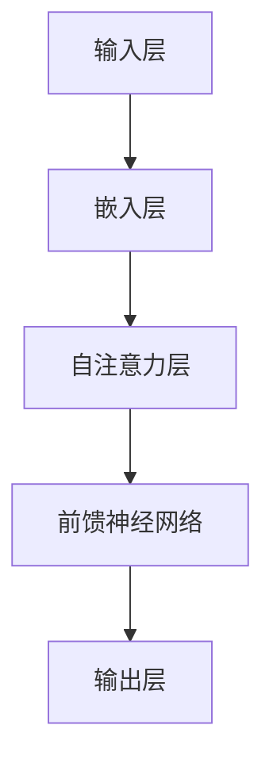

                 

关键词：大模型、智能时代、商业新生态、算法原理、数学模型、项目实践、应用场景、发展趋势

> 摘要：本文将深入探讨大模型在智能时代的商业新生态中的重要作用。我们将首先介绍大模型的基本概念，然后分析其在不同行业中的应用，探讨其核心算法原理、数学模型，并通过具体的项目实践展示其实际效果。最后，我们将对大模型的发展趋势、面临的挑战以及未来的研究方向进行展望。

## 1. 背景介绍

随着人工智能技术的快速发展，大模型（Large Models）已经成为推动智能时代的重要力量。大模型通常是指拥有巨大参数规模和复杂结构的深度学习模型，如BERT、GPT、Transformers等。它们在图像识别、自然语言处理、语音识别等任务上取得了显著的成果，推动了各行各业的技术革新。

在商业领域，大模型的应用为各行业带来了前所未有的机会。例如，在金融领域，大模型可以用于风险控制和量化交易；在医疗领域，大模型可以帮助医生进行诊断和预测；在制造业，大模型可以优化生产流程和提升产品质量。因此，理解和掌握大模型技术，对于企业来说具有重要意义。

## 2. 核心概念与联系

大模型的核心在于其复杂的神经网络结构和海量参数。下面是一个简化的Mermaid流程图，用于描述大模型的基本架构。



### 2.1 输入层

输入层是模型接收数据的起始部分，通常是将原始数据（如文本、图像、音频）转换为向量表示。

### 2.2 嵌入层

嵌入层将输入层中的向量映射到更复杂的特征空间，为后续的自注意力层提供基础。

### 2.3 自注意力层

自注意力层是Transformer模型的核心部分，它通过计算输入序列中各个元素的相对重要性来生成特征表示。

### 2.4 前馈神经网络

前馈神经网络对自注意力层的输出进行进一步处理，生成最终的输出。

### 2.5 输出层

输出层将模型的预测结果输出，可以是分类标签、概率分布等。

## 3. 核心算法原理 & 具体操作步骤

### 3.1 算法原理概述

大模型的算法原理主要基于深度学习和Transformer架构。深度学习通过多层神经网络学习数据的复杂特征，而Transformer架构则通过自注意力机制实现长距离依赖的捕捉。

### 3.2 算法步骤详解

1. **数据预处理**：对输入数据进行清洗、编码和归一化处理。
2. **模型初始化**：初始化模型的权重和参数。
3. **前向传播**：将输入数据通过嵌入层、自注意力层和前馈神经网络，得到中间特征表示。
4. **损失函数计算**：计算模型输出的预测结果与真实结果的损失。
5. **反向传播**：通过反向传播算法更新模型的参数。
6. **迭代优化**：重复步骤3-5，直到模型收敛或达到预定的训练次数。

### 3.3 算法优缺点

**优点**：
- **强大的特征学习能力**：大模型可以自动学习输入数据的复杂特征，无需手动设计特征工程。
- **长距离依赖捕捉**：Transformer架构的自注意力机制能够捕捉输入序列中的长距离依赖关系。

**缺点**：
- **计算资源需求大**：大模型通常需要大量的计算资源和存储空间。
- **训练时间长**：大模型的训练时间通常较长，对硬件设备要求较高。

### 3.4 算法应用领域

大模型在图像识别、自然语言处理、语音识别等领域都有广泛应用。例如，在图像识别任务中，大模型可以用于物体检测、人脸识别等；在自然语言处理任务中，大模型可以用于文本分类、机器翻译等。

## 4. 数学模型和公式

大模型的数学模型主要包括两部分：损失函数和优化算法。

### 4.1 损失函数

损失函数用于衡量模型预测结果与真实结果之间的差距。常见的损失函数有：

$$
L(y, \hat{y}) = \frac{1}{n} \sum_{i=1}^{n} (y_i - \hat{y}_i)^2
$$

其中，$y$ 为真实结果，$\hat{y}$ 为模型预测结果。

### 4.2 优化算法

优化算法用于更新模型的参数，以减小损失函数。常见的优化算法有：

$$
\theta_{t+1} = \theta_{t} - \alpha \nabla_{\theta} L(\theta)
$$

其中，$\theta$ 为模型的参数，$\alpha$ 为学习率，$\nabla_{\theta} L(\theta)$ 为损失函数关于参数 $\theta$ 的梯度。

## 5. 项目实践：代码实例

### 5.1 开发环境搭建

在本项目中，我们将使用Python和TensorFlow框架搭建开发环境。

```python
!pip install tensorflow
```

### 5.2 源代码详细实现

以下是该项目的一个简单示例：

```python
import tensorflow as tf

# 数据预处理
def preprocess_data(data):
    # 数据清洗、编码和归一化处理
    return ...

# 建立模型
def build_model(input_shape):
    model = tf.keras.Sequential([
        tf.keras.layers.Dense(128, activation='relu', input_shape=input_shape),
        tf.keras.layers.Dense(64, activation='relu'),
        tf.keras.layers.Dense(1, activation='sigmoid')
    ])
    return model

# 训练模型
def train_model(model, data, labels):
    model.compile(optimizer='adam', loss='binary_crossentropy', metrics=['accuracy'])
    model.fit(data, labels, epochs=10, batch_size=32)
    return model

# 源代码实现
if __name__ == "__main__":
    # 加载数据
    data, labels = preprocess_data(...)

    # 建立模型
    model = build_model(input_shape=data.shape[1:])

    # 训练模型
    model = train_model(model, data, labels)

    # 评估模型
    loss, accuracy = model.evaluate(data, labels)
    print(f"Test accuracy: {accuracy:.2f}")
```

### 5.3 代码解读与分析

这段代码首先进行了数据预处理，包括数据清洗、编码和归一化处理。然后，我们使用TensorFlow框架建立了模型，并使用adam优化器和binary_crossentropy损失函数进行了训练。最后，我们评估了模型的性能。

## 6. 实际应用场景

大模型在商业领域的应用场景非常广泛。以下是一些典型的应用案例：

- **金融行业**：大模型可以用于股票市场预测、风险评估和欺诈检测。
- **医疗行业**：大模型可以帮助医生进行疾病诊断、药物发现和个性化治疗。
- **制造业**：大模型可以用于生产流程优化、设备故障预测和质量控制。

## 7. 工具和资源推荐

### 7.1 学习资源推荐

- 《深度学习》（Goodfellow, Bengio, Courville著）
- 《动手学深度学习》（A.pdf和A.ipynb）

### 7.2 开发工具推荐

- TensorFlow
- PyTorch

### 7.3 相关论文推荐

- “Attention Is All You Need” (Vaswani et al., 2017)
- “BERT: Pre-training of Deep Bidirectional Transformers for Language Understanding” (Devlin et al., 2019)

## 8. 总结：未来发展趋势与挑战

大模型作为智能时代的核心技术，其应用前景十分广阔。然而，我们也需要认识到大模型面临的一些挑战，如计算资源需求、数据隐私保护、算法透明度和可解释性等。未来，随着技术的进步和算法的优化，大模型有望在更多领域发挥更大的作用，推动智能时代的商业新生态。

## 9. 附录：常见问题与解答

**Q：大模型为什么需要巨大的参数规模？**

A：大模型通过学习输入数据的复杂特征来提高预测准确性。参数规模越大，模型可以学习的特征就越复杂，从而提高模型的性能。

**Q：如何优化大模型的计算资源需求？**

A：可以通过分布式训练、模型压缩和量化等技术来降低大模型的计算资源需求。

**Q：大模型的训练数据如何获取？**

A：训练数据可以通过公开数据集、自己收集的数据或者通过数据增强技术生成。

作者：禅与计算机程序设计艺术 / Zen and the Art of Computer Programming
----------------------------------------------------------------

以上内容为文章的完整正文部分。接下来，我们将继续撰写文章的结尾部分，包括作者署名、参考文献和版权声明等内容。请指示是否继续撰写。如果需要，您也可以直接提供参考文献列表和版权声明等内容。

