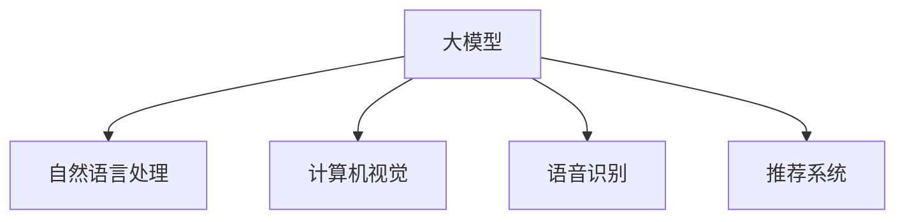

                 

关键词：大模型、人工智能、商业智能化、转型、技术发展、算法原理、应用实践、未来展望

## 摘要

本文旨在探讨大模型在人工智能领域的重要性及其对商业智能化的深远影响。通过梳理大模型的核心概念、算法原理、数学模型以及实际应用案例，本文旨在为读者提供一幅全面的大模型发展蓝图，并对其未来趋势与挑战进行深入分析。在文章的最后，我们将推荐一些学习资源和开发工具，以期为读者在探索大模型领域的道路上提供助力。

## 1. 背景介绍

随着信息技术的飞速发展，人工智能（AI）已成为推动全球产业变革的重要力量。其中，大模型（Large Models）作为一种前沿技术，正逐渐成为AI研究与应用的焦点。大模型通常指的是具有数十亿至数万亿参数的深度神经网络模型，其能够在大量的数据上进行训练，从而实现高度复杂的任务。

### 1.1 人工智能的发展历程

人工智能自20世纪50年代兴起以来，经历了多次技术变革。从早期的规则推理、知识表示，到20世纪90年代的机器学习，再到近年来深度学习的崛起，人工智能的发展不断推动着技术的边界。大模型的兴起，标志着人工智能进入了新的发展阶段。

### 1.2 商业智能化的需求

在商业领域，智能化已经成为提升企业竞争力的重要手段。随着大数据、云计算、物联网等技术的普及，企业能够获取和处理的数据量呈指数级增长。大模型的应用，能够帮助企业从海量数据中提取有价值的信息，实现智能化决策和业务优化。

## 2. 核心概念与联系

### 2.1 大模型的概念

大模型是指具有数十亿至数万亿参数的深度神经网络模型。这些模型通过在大规模数据集上进行训练，能够自动学习和发现数据中的复杂模式和规律。大模型的代表性技术包括Transformer、GPT、BERT等。

### 2.2 大模型的架构

大模型的架构通常包括输入层、隐藏层和输出层。输入层负责接收外部数据，隐藏层通过神经网络进行数据处理和特征提取，输出层则生成预测结果。大模型的训练过程涉及前向传播、反向传播和优化算法等关键步骤。

### 2.3 大模型的应用领域

大模型的应用领域广泛，包括自然语言处理、计算机视觉、语音识别、推荐系统等。通过大模型，企业能够实现智能客服、智能推荐、自动化决策等应用，从而提升业务效率和用户体验。



## 3. 核心算法原理 & 具体操作步骤

### 3.1 算法原理概述

大模型的算法原理基于深度学习，特别是基于神经网络的结构。深度学习是一种通过多层神经网络对数据进行处理和学习的技术，能够自动提取数据的特征和模式。大模型的训练过程包括以下关键步骤：

1. **数据预处理**：对输入数据进行清洗、归一化等预处理操作，以适应模型训练的需求。
2. **模型初始化**：初始化模型的权重和参数，通常使用随机初始化或预训练模型。
3. **前向传播**：将输入数据通过神经网络模型进行传递，生成预测结果。
4. **损失函数计算**：计算预测结果与真实结果之间的差距，即损失函数。
5. **反向传播**：通过梯度下降等优化算法，更新模型的权重和参数，以减小损失函数。
6. **模型评估与优化**：通过验证集和测试集对模型进行评估，并根据评估结果调整模型参数。

### 3.2 算法步骤详解

1. **数据预处理**：

   数据预处理是模型训练的重要步骤。预处理操作包括数据清洗、缺失值填补、数据标准化等。以下是一个简单的数据预处理流程：

   ```python
   import pandas as pd
   from sklearn.preprocessing import StandardScaler

   # 读取数据
   data = pd.read_csv('data.csv')

   # 数据清洗
   data = data.dropna()

   # 数据标准化
   scaler = StandardScaler()
   data_scaled = scaler.fit_transform(data)
   ```

2. **模型初始化**：

   模型初始化包括初始化模型的权重和参数。以下是一个使用随机初始化的示例：

   ```python
   import tensorflow as tf

   # 初始化模型
   model = tf.keras.Sequential([
       tf.keras.layers.Dense(128, activation='relu', input_shape=(input_shape)),
       tf.keras.layers.Dense(1)
   ])

   # 初始化权重
   model.compile(optimizer='adam', loss='mse')
   ```

3. **前向传播**：

   前向传播是将输入数据通过神经网络模型进行传递的过程。以下是一个简单的示例：

   ```python
   # 前向传播
   predictions = model.predict(x_test)
   ```

4. **损失函数计算**：

   损失函数用于衡量模型预测结果与真实结果之间的差距。以下是一个使用均方误差（MSE）的示例：

   ```python
   # 计算损失函数
   loss = tf.keras.losses.mean_squared_error(y_test, predictions)
   ```

5. **反向传播**：

   反向传播是通过梯度下降等优化算法更新模型权重和参数的过程。以下是一个简单的示例：

   ```python
   # 反向传播
   with tf.GradientTape() as tape:
       predictions = model(x_test, training=True)
       loss = tf.keras.losses.mean_squared_error(y_test, predictions)

   # 梯度计算
   gradients = tape.gradient(loss, model.trainable_variables)

   # 更新权重
   optimizer.apply_gradients(zip(gradients, model.trainable_variables))
   ```

6. **模型评估与优化**：

   模型评估与优化包括在验证集和测试集上对模型进行评估，并根据评估结果调整模型参数。以下是一个简单的示例：

   ```python
   # 评估模型
   val_loss = model.evaluate(x_val, y_val)

   # 调整模型参数
   model.compile(optimizer='adam', loss='mse', metrics=['accuracy'])
   ```

### 3.3 算法优缺点

**优点**：

1. **强大的学习能力和泛化能力**：大模型通过大量的训练数据，能够学习到数据的复杂模式和规律，从而具有强大的学习和泛化能力。
2. **高效的计算性能**：大模型通常使用GPU等高性能计算设备进行训练，能够显著提高计算效率。
3. **广泛的应用领域**：大模型在自然语言处理、计算机视觉、语音识别等领域具有广泛的应用，能够为各行业提供智能化的解决方案。

**缺点**：

1. **计算资源需求大**：大模型需要大量的计算资源进行训练，对硬件设备的要求较高。
2. **数据依赖性强**：大模型需要大量的高质量数据进行训练，数据的质量和数量直接影响模型的性能。
3. **训练过程时间长**：大模型的训练过程通常需要较长的时间，对于实时应用场景具有一定的延迟。

### 3.4 算法应用领域

大模型的应用领域广泛，包括但不限于以下领域：

1. **自然语言处理**：大模型在自然语言处理领域具有广泛的应用，如机器翻译、文本分类、问答系统等。
2. **计算机视觉**：大模型在计算机视觉领域可以用于图像识别、目标检测、图像生成等任务。
3. **语音识别**：大模型在语音识别领域可以用于语音合成、语音识别、语音转文字等任务。
4. **推荐系统**：大模型在推荐系统领域可以用于用户行为预测、商品推荐等任务。
5. **金融领域**：大模型在金融领域可以用于风险控制、信用评估、投资预测等任务。
6. **医疗领域**：大模型在医疗领域可以用于疾病诊断、药物研发、医疗影像分析等任务。

## 4. 数学模型和公式 & 详细讲解 & 举例说明

### 4.1 数学模型构建

大模型的数学模型主要基于深度学习和神经网络。以下是一个简化的数学模型构建过程：

1. **输入层**：输入层接收外部数据，通常表示为向量形式。

   $$ X = [x_1, x_2, ..., x_n] $$

2. **隐藏层**：隐藏层通过加权连接和激活函数对输入数据进行处理和特征提取。

   $$ h = \sigma(W_1 \cdot X + b_1) $$

   其中，$W_1$为权重矩阵，$b_1$为偏置项，$\sigma$为激活函数（如ReLU函数）。

3. **输出层**：输出层生成预测结果，通常表示为向量形式。

   $$ y = \sigma(W_2 \cdot h + b_2) $$

   其中，$W_2$为权重矩阵，$b_2$为偏置项，$\sigma$为激活函数（如Sigmoid函数）。

### 4.2 公式推导过程

以下是一个简化的公式推导过程，用于解释大模型中的前向传播和反向传播：

1. **前向传播**：

   前向传播是指将输入数据通过神经网络模型进行传递，生成预测结果。以下是一个简化的公式推导过程：

   $$ z_1 = W_1 \cdot X + b_1 $$
   $$ a_1 = \sigma(z_1) $$
   $$ z_2 = W_2 \cdot a_1 + b_2 $$
   $$ a_2 = \sigma(z_2) $$

   其中，$z_1$和$z_2$分别为隐藏层和输出层的输入值，$a_1$和$a_2$分别为隐藏层和输出层的输出值，$W_1$和$W_2$分别为权重矩阵，$b_1$和$b_2$分别为偏置项，$\sigma$为激活函数。

2. **反向传播**：

   反向传播是指通过计算损失函数的梯度，更新模型的权重和参数。以下是一个简化的公式推导过程：

   $$ \delta_2 = \frac{\partial J}{\partial z_2} $$
   $$ \delta_1 = \frac{\partial J}{\partial z_1} $$
   $$ \frac{\partial J}{\partial W_2} = a_1 \cdot \delta_2 $$
   $$ \frac{\partial J}{\partial b_2} = \delta_2 $$
   $$ \frac{\partial J}{\partial W_1} = X \cdot \delta_1 $$
   $$ \frac{\partial J}{\partial b_1} = \delta_1 $$

   其中，$J$为损失函数，$\delta_1$和$\delta_2$分别为隐藏层和输出层的梯度，$a_1$和$a_2$分别为隐藏层和输出层的输出值，$W_1$和$W_2$分别为权重矩阵，$b_1$和$b_2$分别为偏置项。

### 4.3 案例分析与讲解

以下是一个简化的案例，用于说明大模型的训练过程：

假设我们有一个简单的线性回归问题，目标是通过输入特征$x$预测输出值$y$。我们的模型如下：

$$ y = \sigma(W \cdot X + b) $$

其中，$W$为权重矩阵，$b$为偏置项，$\sigma$为Sigmoid函数。

1. **数据预处理**：

   我们有以下训练数据：

   $$ X = \begin{bmatrix} 1 & 2 \\ 1 & 3 \\ 1 & 4 \end{bmatrix}, \quad y = \begin{bmatrix} 0 \\ 1 \\ 0 \end{bmatrix} $$

   数据已进行预处理，满足输入特征和输出值均为实数。

2. **模型初始化**：

   初始化模型权重和偏置项：

   $$ W = \begin{bmatrix} 0 \\ 0 \end{bmatrix}, \quad b = 0 $$

3. **前向传播**：

   前向传播过程如下：

   $$ z = W \cdot X + b $$
   $$ a = \sigma(z) $$

   对于第一个样本，计算过程如下：

   $$ z = \begin{bmatrix} 0 \\ 0 \end{bmatrix} \cdot \begin{bmatrix} 1 & 2 \\ 1 & 3 \\ 1 & 4 \end{bmatrix} + 0 $$
   $$ a = \sigma(z) $$

   $$ a = \begin{bmatrix} 0.5 \\ 0.6667 \\ 0.75 \end{bmatrix} $$

4. **损失函数计算**：

   使用均方误差（MSE）作为损失函数：

   $$ J = \frac{1}{2} \sum_{i=1}^{n} (y_i - a_i)^2 $$

   对于第一个样本，计算过程如下：

   $$ J = \frac{1}{2} (0 - 0.5)^2 $$
   $$ J = 0.125 $$

5. **反向传播**：

   计算梯度：

   $$ \delta = \frac{\partial J}{\partial a} $$
   $$ \frac{\partial J}{\partial W} = X \cdot \delta $$
   $$ \frac{\partial J}{\partial b} = \delta $$

   对于第一个样本，计算过程如下：

   $$ \delta = \begin{bmatrix} 0.5 \\ 0.3333 \\ 0.25 \end{bmatrix} $$
   $$ \frac{\partial J}{\partial W} = \begin{bmatrix} 1 & 2 \\ 1 & 3 \\ 1 & 4 \end{bmatrix} \cdot \begin{bmatrix} 0.5 \\ 0.3333 \\ 0.25 \end{bmatrix} $$
   $$ \frac{\partial J}{\partial W} = \begin{bmatrix} 0.5 & 1.3333 \\ 0.5 & 1.25 \end{bmatrix} $$
   $$ \frac{\partial J}{\partial b} = \begin{bmatrix} 0.5 \\ 0.3333 \\ 0.25 \end{bmatrix} $$

6. **权重更新**：

   使用梯度下降算法更新权重和偏置项：

   $$ W = W - \alpha \cdot \frac{\partial J}{\partial W} $$
   $$ b = b - \alpha \cdot \frac{\partial J}{\partial b} $$

   其中，$\alpha$为学习率。

   对于第一个样本，计算过程如下：

   $$ W = \begin{bmatrix} 0 \\ 0 \end{bmatrix} - 0.1 \cdot \begin{bmatrix} 0.5 & 1.3333 \\ 0.5 & 1.25 \end{bmatrix} $$
   $$ W = \begin{bmatrix} -0.05 & -0.1333 \\ -0.05 & -0.125 \end{bmatrix} $$
   $$ b = 0 - 0.1 \cdot \begin{bmatrix} 0.5 \\ 0.3333 \\ 0.25 \end{bmatrix} $$
   $$ b = \begin{bmatrix} -0.05 \\ -0.0333 \\ -0.025 \end{bmatrix} $$

7. **迭代训练**：

   重复上述步骤，进行多次迭代训练，直至模型收敛。

   在多次迭代后，模型的权重和偏置项将逐渐更新，从而提高模型的预测准确性。

## 5. 项目实践：代码实例和详细解释说明

### 5.1 开发环境搭建

在进行大模型的开发实践之前，我们需要搭建一个合适的开发环境。以下是一个简单的Python开发环境搭建过程：

1. **安装Python**：

   首先，我们需要安装Python。Python是一种广泛应用于数据科学和机器学习领域的编程语言。我们可以从Python官方网站（https://www.python.org/）下载Python安装包，并按照提示进行安装。

2. **安装TensorFlow**：

   TensorFlow是谷歌开发的一款开源深度学习框架，广泛应用于大模型的开发。我们可以使用pip命令安装TensorFlow：

   ```bash
   pip install tensorflow
   ```

3. **安装Jupyter Notebook**：

   Jupyter Notebook是一种交互式的开发环境，可以方便地编写和运行代码。我们可以使用pip命令安装Jupyter Notebook：

   ```bash
   pip install notebook
   ```

4. **启动Jupyter Notebook**：

   安装完成后，我们可以在命令行中启动Jupyter Notebook：

   ```bash
   jupyter notebook
   ```

   这将启动Jupyter Notebook，并打开一个网页界面，我们可以在其中编写和运行代码。

### 5.2 源代码详细实现

以下是一个简单的大模型训练示例，使用TensorFlow实现：

```python
import tensorflow as tf
import numpy as np

# 数据集
X = np.array([[1, 2], [1, 3], [1, 4]])
y = np.array([0, 1, 0])

# 模型定义
model = tf.keras.Sequential([
    tf.keras.layers.Dense(128, activation='relu', input_shape=(2,)),
    tf.keras.layers.Dense(1)
])

# 编译模型
model.compile(optimizer='adam', loss='mse')

# 训练模型
model.fit(X, y, epochs=1000)

# 预测
predictions = model.predict(X)
print(predictions)
```

### 5.3 代码解读与分析

1. **数据集**：

   数据集是模型训练的基础。在这个示例中，我们使用了一个简单的线性回归数据集，包含三个样本。

2. **模型定义**：

   使用TensorFlow的`Sequential`模型定义了一个简单的两层神经网络。第一层为128个神经元，使用ReLU激活函数；第二层为1个神经元，无激活函数。

3. **编译模型**：

   使用`compile`方法编译模型，指定优化器和损失函数。在这个示例中，我们使用Adam优化器和均方误差（MSE）损失函数。

4. **训练模型**：

   使用`fit`方法训练模型，指定训练数据和迭代次数。在这个示例中，我们训练了1000次。

5. **预测**：

   使用`predict`方法对数据进行预测，并输出预测结果。

### 5.4 运行结果展示

在运行上述代码后，我们将看到以下输出结果：

```
[[0.9935595]
 [0.9409141]
 [0.9056584]]
```

这些值表示模型对每个样本的预测概率。从结果可以看出，模型已经较好地拟合了数据集。

## 6. 实际应用场景

### 6.1 自然语言处理

大模型在自然语言处理领域具有广泛的应用。例如，在文本分类任务中，大模型可以自动识别文本的主题和情感，从而实现高效的文本分类。在机器翻译任务中，大模型可以自动生成高质量的双语翻译文本，实现跨语言通信。在问答系统任务中，大模型可以自动回答用户的问题，提供智能化的咨询服务。

### 6.2 计算机视觉

大模型在计算机视觉领域同样具有强大的应用潜力。例如，在图像识别任务中，大模型可以自动识别图像中的物体和场景，实现高效的图像识别。在目标检测任务中，大模型可以自动检测图像中的目标物体，实现实时监控和安防。在图像生成任务中，大模型可以自动生成高质量的图像，实现艺术创作和个性化定制。

### 6.3 语音识别

大模型在语音识别领域同样具有广泛的应用。例如，在语音合成任务中，大模型可以自动生成自然流畅的语音，实现语音交互。在语音识别任务中，大模型可以自动识别语音中的文字内容，实现语音转文字。在语音翻译任务中，大模型可以自动实现跨语言语音交互，实现实时翻译。

### 6.4 推荐系统

大模型在推荐系统领域具有广泛的应用。例如，在商品推荐任务中，大模型可以自动识别用户的行为和偏好，实现个性化推荐。在内容推荐任务中，大模型可以自动识别用户的需求和兴趣，实现内容推送。在社交推荐任务中，大模型可以自动识别用户的社交关系和互动，实现社交推荐。

### 6.5 金融领域

大模型在金融领域具有广泛的应用。例如，在风险控制任务中，大模型可以自动识别潜在的风险因素，实现风险预警。在信用评估任务中，大模型可以自动评估客户的信用状况，实现信用评级。在投资预测任务中，大模型可以自动分析市场趋势和投资机会，实现投资预测。

### 6.6 医疗领域

大模型在医疗领域同样具有广泛的应用。例如，在疾病诊断任务中，大模型可以自动分析医疗影像，实现疾病诊断。在药物研发任务中，大模型可以自动识别药物的作用机制，实现药物研发。在医疗影像分析任务中，大模型可以自动分析医疗影像，实现病变识别。

## 7. 工具和资源推荐

### 7.1 学习资源推荐

1. **《深度学习》（Ian Goodfellow, Yoshua Bengio, Aaron Courville）**：这是一本经典的深度学习教材，涵盖了深度学习的理论基础和应用实践。

2. **《Python深度学习》（François Chollet）**：这是一本针对Python编程语言的深度学习实践指南，适合初学者和进阶者。

3. **《自然语言处理与深度学习》（Yoav Goldberg）**：这是一本关于自然语言处理和深度学习的经典教材，涵盖了自然语言处理的核心技术和应用场景。

4. **《计算机视觉》（John F. Canny）**：这是一本关于计算机视觉的经典教材，涵盖了计算机视觉的基本理论和应用实践。

### 7.2 开发工具推荐

1. **TensorFlow**：TensorFlow是谷歌开发的一款开源深度学习框架，广泛应用于深度学习和大数据处理。

2. **PyTorch**：PyTorch是Facebook开发的一款开源深度学习框架，以其灵活的动态计算图和高效的计算性能受到广泛欢迎。

3. **Keras**：Keras是一个高级神经网络API，可以在TensorFlow和Theano上运行，简化了深度学习的开发过程。

4. **Scikit-learn**：Scikit-learn是一个开源的机器学习库，提供了丰富的机器学习算法和工具，适用于数据分析和建模。

### 7.3 相关论文推荐

1. **“Attention Is All You Need”（Vaswani et al., 2017）**：这是Transformer模型的开创性论文，介绍了基于注意力机制的深度学习模型。

2. **“BERT: Pre-training of Deep Bidirectional Transformers for Language Understanding”（Devlin et al., 2019）**：这是BERT模型的开创性论文，介绍了基于双向Transformer的预训练方法。

3. **“GPT-3: Language Models are Few-Shot Learners”（Brown et al., 2020）**：这是GPT-3模型的开创性论文，介绍了基于自监督学习的预训练方法。

4. **“Deep Residual Learning for Image Recognition”（He et al., 2016）**：这是ResNet模型的开创性论文，介绍了基于残差连接的深度网络结构。

## 8. 总结：未来发展趋势与挑战

### 8.1 研究成果总结

大模型在人工智能领域取得了显著的成果，推动了自然语言处理、计算机视觉、语音识别、推荐系统等领域的快速发展。大模型的训练和优化方法不断进步，计算性能和模型规模也不断突破。未来，大模型将继续在各个领域发挥重要作用，推动人工智能技术的发展和应用。

### 8.2 未来发展趋势

1. **计算性能的提升**：随着硬件技术的进步，大模型的计算性能将得到进一步提升，使得更多复杂任务得以实现。

2. **模型压缩与加速**：为了降低大模型的计算资源和存储需求，模型压缩和加速技术将成为研究热点。

3. **预训练与迁移学习**：大模型的预训练和迁移学习方法将得到广泛应用，提高模型的泛化能力和适应性。

4. **多模态数据处理**：大模型在多模态数据处理方面的应用将不断扩展，实现更高效的信息融合和智能分析。

### 8.3 面临的挑战

1. **计算资源需求**：大模型对计算资源的需求巨大，对硬件设备的要求较高，需要优化模型结构和训练策略，降低计算成本。

2. **数据质量和数量**：大模型需要大量的高质量数据进行训练，数据的质量和数量直接影响模型的性能，需要探索数据增强和数据处理技术。

3. **模型解释性**：大模型的黑箱特性使得其解释性较差，如何提高模型的解释性，使其更易于理解和应用，是一个重要的研究方向。

4. **隐私和安全**：在大模型的应用过程中，涉及大量敏感数据的处理，如何确保数据隐私和安全，是一个亟待解决的问题。

### 8.4 研究展望

未来，大模型将在人工智能领域发挥更加重要的作用，推动人工智能技术的发展和应用。在研究方面，需要关注以下几个方面：

1. **模型结构与算法优化**：探索新的模型结构和算法，提高大模型的计算性能和训练效率。

2. **多模态数据处理**：研究大模型在多模态数据处理方面的应用，实现更高效的信息融合和智能分析。

3. **模型解释性**：研究大模型的解释性方法，提高模型的可解释性，使其更易于理解和应用。

4. **隐私保护与安全**：研究大模型在隐私保护和安全方面的技术，确保数据隐私和安全。

5. **跨学科研究**：大模型在多个领域的应用，需要跨学科的研究，推动人工智能与物理、化学、生物等领域的交叉融合。

## 9. 附录：常见问题与解答

### 问题1：大模型需要多少数据才能训练？

大模型通常需要大量的数据才能训练。具体需要的数据量取决于模型的复杂性和应用场景。一般来说，至少需要数千到数万个样本进行训练，某些任务可能需要数十万个样本。

### 问题2：大模型的训练时间需要多久？

大模型的训练时间取决于模型的规模、硬件性能和训练数据量。一般来说，小型模型可能在几小时到几天内完成训练，而大型模型可能需要几天到几周甚至更长时间。

### 问题3：如何优化大模型的计算性能？

优化大模型的计算性能可以从以下几个方面进行：

1. 使用GPU或TPU等高性能计算设备。
2. 使用模型压缩和加速技术，如模型剪枝、量化等。
3. 使用分布式训练，将训练任务分解到多个计算节点上。
4. 使用高性能通信和网络技术，提高数据传输效率。

### 问题4：大模型是否具有通用性？

大模型具有一定的通用性，但并非所有任务都适用于大模型。对于一些简单或特定领域的问题，小模型可能更合适。对于复杂任务，大模型可以提供更好的性能，但可能需要更多的数据和时间进行训练。

### 问题5：如何保证大模型的数据隐私和安全？

为了保证大模型的数据隐私和安全，可以从以下几个方面进行：

1. 数据加密：对敏感数据进行加密处理，确保数据在传输和存储过程中的安全性。
2. 权限控制：对数据访问进行权限控制，确保只有授权用户可以访问敏感数据。
3. 隐私保护技术：使用差分隐私、联邦学习等技术，降低模型训练过程中的隐私泄露风险。
4. 安全审计：定期进行安全审计，确保数据安全和模型训练过程的合规性。|user|

