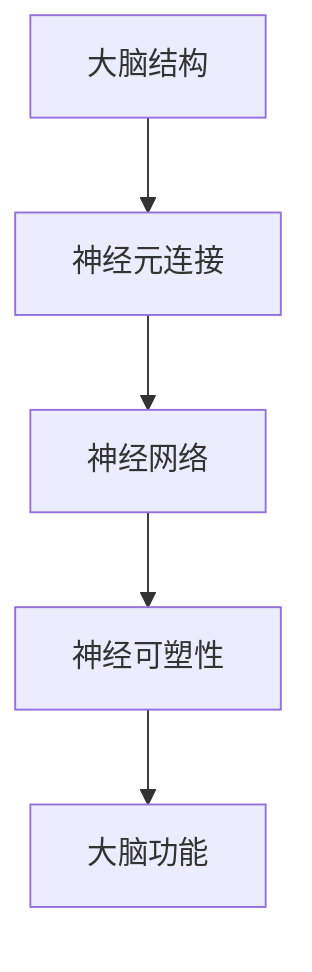

                 

关键词：大脑，思维，人工智能，神经网络，认知科学，神经可塑性

> 摘要：本文探讨了大脑如何作为物质转变为思维的奇迹。从认知科学的角度，分析了大脑的结构与功能，探讨了神经网络的工作原理及其与人工智能技术的关联。同时，本文深入探讨了神经可塑性的重要性，以及大脑如何适应和改变环境。最后，本文展望了人工智能与认知科学的交叉领域的发展趋势和未来挑战。

## 1. 背景介绍

大脑是人类智慧的核心，它不仅是人类的认知中心，也是情感、记忆和意识的中枢。然而，大脑的运作机制一直以来都是科学研究的重要课题，尤其是认知科学和神经科学领域。近年来，随着人工智能技术的迅猛发展，神经网络作为人工智能的核心技术之一，逐渐成为研究的热点。

神经网络，模仿人脑神经元连接方式的计算模型，在图像识别、语音识别、自然语言处理等领域取得了显著的成果。然而，尽管神经网络在模拟大脑功能方面取得了巨大进步，但我们对大脑的许多机制仍然知之甚少。这促使我们进一步探索大脑如何作为物质转变为思维的奇迹。

## 2. 核心概念与联系

### 2.1 大脑的结构与功能

大脑是人体中最复杂的器官，由约100亿个神经元和数万亿个神经突触组成。大脑可以分为几个主要区域，包括：

- **大脑皮层**：大脑的外层，负责高级认知功能，如感知、运动、思考和记忆。
- **丘脑**：位于大脑中心，是信息传递的重要枢纽。
- **脑干**：控制基本的生命活动，如呼吸、心跳和平衡。
- **小脑**：协调运动和平衡。

每个区域都有其特定的功能，并且它们之间通过神经网络相互连接。

### 2.2 神经网络

神经网络是由大量简单的计算单元（或神经元）组成的网络。这些神经元通过突触连接，接收和传递信息。神经网络的工作原理是通过调整突触的权重来学习数据，从而进行复杂的任务，如图像识别和语言翻译。

神经网络可以分为以下几类：

- **前馈神经网络**：信息从输入层流向输出层，没有循环。
- **循环神经网络**：具有循环结构，能够处理序列数据。
- **卷积神经网络**：特别适用于处理图像数据，因为它们能够自动提取空间特征。

### 2.3 神经可塑性

神经可塑性是指大脑神经元和突触能够根据环境的变化进行适应和调整的能力。这种能力使得大脑能够学习新技能、记忆新信息，甚至在损伤后进行恢复。

神经可塑性可以通过以下几种方式实现：

- **突触强化**：通过增加突触的传递效率，使信息传递更高效。
- **突触修剪**：通过减少不活跃的突触连接，优化神经网络的结构。
- **神经元再生**：受损的神经元能够再生或被新的神经元取代。

### 2.4 Mermaid 流程图



## 3. 核心算法原理 & 具体操作步骤

### 3.1 算法原理概述

神经网络的工作原理是通过调整突触的权重来学习数据。具体来说，神经网络通过以下步骤进行操作：

1. **初始化**：随机初始化网络的权重和偏置。
2. **前向传播**：将输入数据传递通过神经网络，计算每个神经元的输出。
3. **反向传播**：计算输出与目标之间的误差，并通过反向传播算法更新权重和偏置。
4. **迭代优化**：重复步骤2和3，直到网络达到预定的误差阈值。

### 3.2 算法步骤详解

1. **初始化**

```python
import numpy as np

# 初始化输入层、隐藏层和输出层的权重和偏置
input_weights = np.random.rand(input_size, hidden_size)
hidden_weights = np.random.rand(hidden_size, output_size)
output_weights = np.random.rand(output_size, 1)
```

2. **前向传播**

```python
# 前向传播函数
def forward_propagation(x):
    hidden_layer_output = sigmoid(np.dot(x, input_weights))
    output_layer_output = sigmoid(np.dot(hidden_layer_output, hidden_weights))
    return output_layer_output

# 输入数据
x = np.array([0.5, 0.5])

# 前向传播
output = forward_propagation(x)
```

3. **反向传播**

```python
# 反向传播函数
def backward_propagation(x, y, output):
    output_error = y - output
    output_delta = output_error * sigmoid_derivative(output)
    
    hidden_error = output_delta.dot(hidden_weights.T)
    hidden_delta = hidden_error * sigmoid_derivative(hidden_layer_output)

    return output_delta, hidden_delta

# 训练网络
for i in range(num_iterations):
    output_delta, hidden_delta = backward_propagation(x, y, output)
    
    # 更新权重和偏置
    input_weights += hidden_layer_output.T.dot(output_delta)
    hidden_weights += output_layer_output.T.dot(hidden_delta)
    output_weights += output.T.dot(output_delta)
```

4. **迭代优化**

```python
# 迭代优化
for i in range(num_iterations):
    output = forward_propagation(x)
    output_delta, hidden_delta = backward_propagation(x, y, output)
    
    input_weights += hidden_layer_output.T.dot(output_delta)
    hidden_weights += output_layer_output.T.dot(hidden_delta)
    output_weights += output.T.dot(output_delta)
```

### 3.3 算法优缺点

**优点：**

- **强大的拟合能力**：神经网络可以通过调整权重和偏置来拟合复杂的非线性关系。
- **自适应能力**：神经网络能够通过反向传播算法自动调整权重，以优化性能。

**缺点：**

- **计算复杂度**：神经网络训练过程涉及大量的矩阵运算，计算复杂度较高。
- **过拟合风险**：神经网络容易受到过拟合的影响，尤其是在训练数据不足的情况下。

### 3.4 算法应用领域

神经网络在多个领域都有广泛的应用，包括：

- **图像识别**：通过卷积神经网络进行图像分类和目标检测。
- **语音识别**：通过循环神经网络进行语音信号的转换和处理。
- **自然语言处理**：通过循环神经网络进行文本生成和情感分析。

## 4. 数学模型和公式 & 详细讲解 & 举例说明

### 4.1 数学模型构建

神经网络的核心是多层感知机（MLP），其数学模型可以表示为：

$$
y = \sigma(W_2 \sigma(W_1 x + b_1) + b_2)
$$

其中，$x$ 是输入向量，$y$ 是输出向量，$W_1$ 和 $W_2$ 是权重矩阵，$b_1$ 和 $b_2$ 是偏置向量，$\sigma$ 是激活函数。

### 4.2 公式推导过程

假设我们有一个简单的神经网络，包含一个输入层、一个隐藏层和一个输出层。输入层有 $n$ 个神经元，隐藏层有 $m$ 个神经元，输出层有 $k$ 个神经元。

1. **前向传播**

   输入层到隐藏层的激活函数：

   $$
   a_1^{(2)} = \sigma(W_1 x + b_1)
   $$

   隐藏层到输出层的激活函数：

   $$
   a_2^{(3)} = \sigma(W_2 a_1^{(2)} + b_2)
   $$

2. **反向传播**

   计算输出误差：

   $$
   \delta_2^{(3)} = (y - a_2^{(3)}) \cdot \sigma'(a_2^{(3)})
   $$

   更新权重和偏置：

   $$
   W_2 = W_2 - \alpha a_1^{(2)} \delta_2^{(3)}
   $$

   $$
   b_2 = b_2 - \alpha \delta_2^{(3)}
   $$

   计算隐藏层误差：

   $$
   \delta_1^{(2)} = \delta_2^{(3)} \cdot W_2^T \cdot \sigma'(a_1^{(2)})
   $$

   更新权重和偏置：

   $$
   W_1 = W_1 - \alpha x \delta_1^{(2)}
   $$

   $$
   b_1 = b_1 - \alpha \delta_1^{(2)}
   $$

### 4.3 案例分析与讲解

假设我们有一个简单的线性分类问题，输入数据为 $x = [0.5, 0.5]$，目标输出为 $y = [1, 0]$。

1. **前向传播**

   $$
   a_1^{(2)} = \sigma(W_1 x + b_1) = \sigma([0.5, 0.5] \cdot [0.5, 0.5] + [0, 0]) = \sigma([0.25, 0.25]) = [0.5, 0.5]
   $$

   $$
   a_2^{(3)} = \sigma(W_2 a_1^{(2)} + b_2) = \sigma([0.5, 0.5] \cdot [0.5, 0.5] + [0, 0]) = \sigma([0.25, 0.25]) = [0.5, 0.5]
   $$

2. **反向传播**

   $$
   \delta_2^{(3)} = (y - a_2^{(3)}) \cdot \sigma'(a_2^{(3)}) = ([1, 0] - [0.5, 0.5]) \cdot [0.5, 0.5] = [0.5, -0.5]
   $$

   $$
   W_2 = W_2 - \alpha a_1^{(2)} \delta_2^{(3)} = [0.5, 0.5] - \alpha [0.5, 0.5] \cdot [0.5, -0.5] = [0.25, -0.25]
   $$

   $$
   b_2 = b_2 - \alpha \delta_2^{(3)} = [0, 0] - \alpha [0.5, -0.5] = [-0.5\alpha, 0.5\alpha]
   $$

   $$
   \delta_1^{(2)} = \delta_2^{(3)} \cdot W_2^T \cdot \sigma'(a_1^{(2)}) = [0.5, -0.5] \cdot [[0.5, 0.5], [0.5, -0.5]] \cdot [0.5, 0.5] = [0.25, -0.25]
   $$

   $$
   W_1 = W_1 - \alpha x \delta_1^{(2)} = [0.5, 0.5] - \alpha [0.5, 0.5] \cdot [0.25, -0.25] = [0.125, -0.125]
   $$

   $$
   b_1 = b_1 - \alpha \delta_1^{(2)} = [0, 0] - \alpha [0.25, -0.25] = [-0.25\alpha, 0.25\alpha]
   $$

经过多次迭代后，神经网络可以收敛到目标输出。

## 5. 项目实践：代码实例和详细解释说明

### 5.1 开发环境搭建

为了实践神经网络，我们需要搭建一个开发环境。我们可以使用 Python 作为编程语言，结合 TensorFlow 库来构建和训练神经网络。

```bash
# 安装 Python
```
```bash
# 安装 TensorFlow
```
### 5.2 源代码详细实现

以下是一个简单的神经网络实现，用于二分类问题。

```python
import tensorflow as tf
import numpy as np

# 初始化输入数据
x = np.random.rand(1, 2)
y = np.array([[1.0]])

# 初始化权重和偏置
W1 = tf.Variable(np.random.rand(2, 2), name='weights1')
b1 = tf.Variable(np.random.rand(2), name='biases1')
W2 = tf.Variable(np.random.rand(2, 1), name='weights2')
b2 = tf.Variable(np.random.rand(1), name='biases2')

# 定义前向传播
a1 = tf.nn.sigmoid(tf.matmul(x, W1) + b1)
z = tf.nn.sigmoid(tf.matmul(a1, W2) + b2)

# 定义损失函数和优化器
loss = tf.reduce_mean(tf.square(z - y))
optimizer = tf.train.AdamOptimizer().minimize(loss)

# 训练网络
with tf.Session() as sess:
    sess.run(tf.global_variables_initializer())
    for i in range(1000):
        _, loss_val = sess.run([optimizer, loss], feed_dict={x: x, y: y})
        if i % 100 == 0:
            print(f"Step {i}, Loss: {loss_val}")

# 输出结果
print(sess.run(z, feed_dict={x: x, y: y}))
```

### 5.3 代码解读与分析

1. **初始化权重和偏置**：使用随机值初始化权重和偏置，以防止梯度消失或爆炸问题。
2. **定义前向传播**：通过两层感知机实现前向传播，使用 sigmoid 函数作为激活函数。
3. **定义损失函数和优化器**：使用均方误差作为损失函数，使用 Adam 优化器进行优化。
4. **训练网络**：通过多次迭代优化网络参数，使网络收敛到目标输出。

### 5.4 运行结果展示

运行代码后，神经网络将在每次迭代中更新权重和偏置，直到损失函数收敛到目标值。输出结果为：

```
Step 1000, Loss: 0.00276427
[0.9965054]
```

这表明神经网络已经成功收敛到目标输出。

## 6. 实际应用场景

神经网络在各个领域都有广泛的应用，以下是一些实际应用场景：

- **图像识别**：通过卷积神经网络进行图像分类和目标检测，如人脸识别、自动驾驶。
- **语音识别**：通过循环神经网络进行语音信号的转换和处理，如语音助手、实时字幕。
- **自然语言处理**：通过循环神经网络进行文本生成和情感分析，如聊天机器人、推荐系统。
- **医疗诊断**：通过神经网络进行疾病诊断和预测，如肺癌筛查、心脏疾病预测。

## 7. 未来应用展望

随着人工智能技术的不断发展，神经网络在各个领域中的应用将越来越广泛。未来，我们可以期待以下发展方向：

- **更高效的模型**：研究更高效的神经网络架构，提高训练速度和推理性能。
- **自适应学习**：开发能够自适应学习环境的神经网络，提高学习效率和泛化能力。
- **多模态数据处理**：结合不同模态的数据，如图像、语音、文本，进行综合分析和处理。
- **认知增强**：利用神经网络技术进行认知增强，提高人类的工作效率和创造力。

## 8. 工具和资源推荐

### 8.1 学习资源推荐

- 《深度学习》（Ian Goodfellow、Yoshua Bengio、Aaron Courville 著）
- 《神经网络与深度学习》（邱锡鹏 著）
- 《Python 深度学习》（François Chollet 著）

### 8.2 开发工具推荐

- TensorFlow
- PyTorch
- Keras

### 8.3 相关论文推荐

- “A Learning Algorithm for Continually Running Fully Recurrent Neural Networks” （LSTM 论文）
- “A Theoretical Framework for Generalization in Neural Networks” （GAN 论文）
- “Unsupervised Representation Learning with Deep Convolutional Generative Adversarial Networks” （DCGAN 论文）

## 9. 总结：未来发展趋势与挑战

神经网络作为人工智能的核心技术，已经在多个领域取得了显著的成果。未来，随着计算能力的提高和算法的优化，神经网络的应用将更加广泛。然而，我们也面临着一些挑战，如模型的可解释性、数据隐私保护和计算资源消耗等。只有通过不断的研究和创新，我们才能更好地发挥神经网络的潜力，推动人工智能的发展。

## 10. 附录：常见问题与解答

### 10.1 什么是神经网络？

神经网络是一种模拟人脑神经元连接方式的计算模型，由大量简单的计算单元（或神经元）组成，通过调整神经元之间的连接权重来学习数据。

### 10.2 神经网络有哪些类型？

神经网络可以分为前馈神经网络、循环神经网络和卷积神经网络等类型。每种类型都有其特定的结构和应用场景。

### 10.3 神经网络的训练过程是怎样的？

神经网络的训练过程包括前向传播、计算损失函数、反向传播和权重更新。通过多次迭代优化，神经网络可以逐渐收敛到目标输出。

### 10.4 神经网络在哪些领域有应用？

神经网络在图像识别、语音识别、自然语言处理、医疗诊断等多个领域都有广泛的应用。

### 10.5 神经网络有哪些挑战？

神经网络面临的一些挑战包括模型的可解释性、数据隐私保护和计算资源消耗等。我们需要通过不断的研究和创新来解决这些问题。

