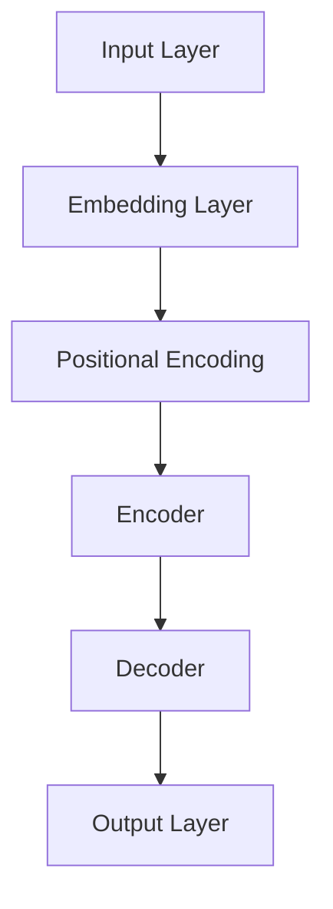

                 

关键词：大规模语言模型、DeepSpeed、优化算法、性能提升、实践应用

## 摘要

本文深入探讨了大规模语言模型（Large-scale Language Models，LLMs）的理论与实践，特别是DeepSpeed在优化大规模语言模型训练中的重要作用。文章首先介绍了大规模语言模型的基础知识，然后详细阐述了DeepSpeed的核心概念与架构，随后通过数学模型和具体实例分析了DeepSpeed的工作原理及性能优势。最后，本文结合实际项目实践，提供了详细的代码实例和解释，展示了DeepSpeed在提升大规模语言模型训练效率和性能方面的强大能力。通过本文的阅读，读者将能够全面理解大规模语言模型的工作原理，以及如何利用DeepSpeed实现高效的模型训练。

## 1. 背景介绍

### 1.1 大规模语言模型的发展历程

大规模语言模型（LLMs）的发展可以追溯到20世纪80年代的统计语言模型。随着计算能力的提升和机器学习技术的发展，语言模型经历了从规则驱动模型、统计模型到深度学习模型的演变。2003年， Bengio等人在论文《A Theoretical Perspective on Learning and Generalization of Deep Belief Networks》中首次提出了深度信念网络（Deep Belief Networks, DBNs）的概念。DBNs为后续的深度学习语言模型奠定了基础。

2013年，谷歌推出了Word2Vec模型，这是一种基于神经网络的词向量模型，它通过训练大量文本数据生成词的向量表示。Word2Vec的成功标志着深度学习在语言处理领域的重要性。随后的几年里，随着计算能力的进一步提升和神经架构搜索（Neural Architecture Search，NAS）技术的发展，语言模型得到了飞速发展。2018年，OpenAI发布了GPT（Generative Pre-trained Transformer），这是一个基于Transformer架构的预训练语言模型。GPT的诞生标志着大规模语言模型的崛起。

### 1.2 大规模语言模型的应用场景

大规模语言模型在自然语言处理（Natural Language Processing，NLP）领域有着广泛的应用。以下是几个典型的应用场景：

- **文本生成**：通过输入少量的提示文本，大规模语言模型能够生成连贯、有逻辑的文本。例如，自动写作、生成新闻报道、创作诗歌等。

- **机器翻译**：大规模语言模型能够利用预训练的参数进行高效的机器翻译。例如，谷歌翻译、百度翻译等。

- **对话系统**：大规模语言模型可以用于构建智能对话系统，如智能客服、聊天机器人等。

- **文本分类**：大规模语言模型能够对文本进行分类，如情感分析、新闻分类、垃圾邮件检测等。

- **问答系统**：大规模语言模型可以构建问答系统，用于回答用户的问题，如基于知识的问答系统。

### 1.3 大规模语言模型面临的问题

尽管大规模语言模型在NLP领域取得了显著的进展，但其在训练和应用过程中仍面临一系列挑战：

- **计算资源需求**：大规模语言模型的训练需要大量的计算资源和时间。随着模型规模的增大，训练时间呈指数级增长。

- **存储需求**：大规模语言模型通常包含数十亿甚至数万亿个参数，导致模型的存储需求巨大。

- **优化算法**：如何高效地训练大规模语言模型，优化算法成为关键。传统的优化算法在面对大规模模型时效果不佳。

- **可解释性**：大规模语言模型通常被认为是“黑盒”模型，其决策过程缺乏可解释性，这对于实际应用提出了挑战。

## 2. 核心概念与联系

### 2.1 大规模语言模型的架构

大规模语言模型的核心是Transformer架构，这是一种基于自注意力机制的深度神经网络。以下是一个简化版的大规模语言模型架构图：



- **Input Layer**：输入层，用于接收原始文本数据。
- **Embedding Layer**：嵌入层，将单词转换为向量表示。
- **Positional Encoding**：位置编码，用于保留文本序列的顺序信息。
- **Encoder**：编码器，包含多个自注意力层和前馈神经网络。
- **Decoder**：解码器，同样包含多个自注意力层和前馈神经网络。
- **Output Layer**：输出层，用于生成最终的输出结果。

### 2.2 DeepSpeed的核心概念

DeepSpeed是一个开源的分布式训练框架，旨在解决大规模语言模型训练中的资源需求和优化问题。以下是其核心概念：

- **ZeRO（Zero Redundancy Optimizer）**：ZeRO是一种优化算法，通过将模型参数分割成多个部分，并仅在必要的计算节点上存储，从而显著减少内存需求。
- **Mixture of Experts（MoE）**：MoE是一种神经网络架构，通过将模型拆分成多个较小的专家网络，并使用软注意力机制选择合适的专家，从而提高模型的容量和效率。
- **PipeLining**：PipeLining是一种分布式训练技术，通过将模型的各个部分分布在不同的计算节点上，实现数据流和数据处理的并行化。

### 2.3 DeepSpeed与大规模语言模型的联系

DeepSpeed通过以下方式与大规模语言模型结合：

- **ZeRO与模型参数分割**：DeepSpeed利用ZeRO算法将大规模语言模型的参数分割成多个部分，从而降低每个计算节点的内存需求。
- **MoE与模型架构**：DeepSpeed支持MoE架构，通过拆分模型和软注意力机制，实现模型的高效训练和推理。
- **PipeLining与数据流处理**：DeepSpeed采用PipeLining技术，将大规模语言模型的数据流和计算过程并行化，从而提高训练效率。

## 3. 核心算法原理 & 具体操作步骤

### 3.1 算法原理概述

DeepSpeed的核心算法包括ZeRO、MoE和PipeLining。以下分别介绍这些算法的原理。

#### 3.1.1 ZeRO原理

ZeRO（Zero Redundancy Optimizer）是一种参数分割优化算法，其目的是减少模型参数在训练过程中的内存需求。ZeRO通过将模型参数分割成多个子参数组，每个子参数组仅存储在训练过程中需要的计算节点上，从而显著降低内存占用。

#### 3.1.2 MoE原理

MoE（Mixture of Experts）是一种神经网络架构，通过将模型拆分成多个较小的专家网络，并使用软注意力机制选择合适的专家，从而提高模型的容量和效率。MoE的核心思想是将复杂的任务拆分成多个简单的子任务，并利用专家网络的组合实现高效的模型训练和推理。

#### 3.1.3 PipeLining原理

PipeLining是一种分布式训练技术，通过将模型的各个部分分布在不同的计算节点上，实现数据流和数据处理的并行化。PipeLining的核心思想是将模型的输入、前向传播、反向传播和参数更新等过程并行处理，从而提高训练效率。

### 3.2 算法步骤详解

以下是DeepSpeed的训练流程，包括ZeRO、MoE和PipeLining的具体操作步骤：

#### 3.2.1 ZeRO步骤

1. **参数分割**：将模型参数分割成多个子参数组。
2. **数据分配**：将子参数组分配到不同的计算节点上。
3. **模型训练**：在每个计算节点上独立训练子参数组。
4. **参数聚合**：将训练好的子参数组合并为完整的模型参数。

#### 3.2.2 MoE步骤

1. **专家网络构建**：构建多个较小的专家网络。
2. **软注意力计算**：计算输入数据对每个专家网络的权重。
3. **专家网络组合**：将专家网络的输出组合为最终结果。

#### 3.2.3 PipeLining步骤

1. **输入分配**：将输入数据分配到不同的计算节点。
2. **前向传播**：在计算节点上并行计算前向传播结果。
3. **反向传播**：在计算节点上并行计算反向传播结果。
4. **参数更新**：在计算节点上并行更新模型参数。

### 3.3 算法优缺点

#### 3.3.1 ZeRO优缺点

- **优点**：
  - 显著降低内存需求，提高训练效率。
  - 支持大规模语言模型训练，减少存储和传输成本。
- **缺点**：
  - 可能导致模型精度损失，需要仔细调整优化策略。
  - 需要复杂的参数分割和聚合操作，增加计算开销。

#### 3.3.2 MoE优缺点

- **优点**：
  - 提高模型容量和效率，降低内存需求。
  - 支持多样化任务，具有更好的泛化能力。
- **缺点**：
  - 计算复杂度较高，需要更多计算资源。
  - 软注意力机制可能导致模型性能波动。

#### 3.3.3 PipeLining优缺点

- **优点**：
  - 提高训练效率，缩短训练时间。
  - 支持大规模数据并行处理，提高数据处理能力。
- **缺点**：
  - 可能导致模型性能下降，需要合理调整 PipeLining 参数。
  - 需要复杂的数据分配和通信操作。

### 3.4 算法应用领域

DeepSpeed在大规模语言模型训练中有着广泛的应用，以下是其主要应用领域：

- **自然语言处理**：DeepSpeed可以用于训练大规模NLP模型，如文本生成、机器翻译、对话系统等。
- **计算机视觉**：DeepSpeed可以用于训练大规模计算机视觉模型，如图像分类、目标检测、语义分割等。
- **推荐系统**：DeepSpeed可以用于训练大规模推荐系统模型，如协同过滤、基于内容的推荐等。
- **知识图谱**：DeepSpeed可以用于训练大规模知识图谱模型，如实体识别、关系抽取、推理等。

## 4. 数学模型和公式 & 详细讲解 & 举例说明

### 4.1 数学模型构建

大规模语言模型（LLMs）的核心是基于Transformer架构的自注意力机制。以下是一个简化版的自注意力机制数学模型：

#### 自注意力机制

$$
\text{Attention}(Q, K, V) = \text{softmax}\left(\frac{QK^T}{\sqrt{d_k}}\right) V
$$

其中，$Q, K, V$ 分别表示查询向量、键向量和值向量，$d_k$ 表示键向量的维度。自注意力机制通过计算每个查询向量与所有键向量的点积，并使用softmax函数生成权重，然后将权重与相应的值向量相乘，得到加权求和的结果。

#### Transformer模型

Transformer模型由多个自注意力层和前馈神经网络组成。以下是一个简化版的Transformer模型：

$$
\text{Transformer}(X) = \text{LayerNorm}(X + \text{MultiHeadAttention}(X, X, X)) + X \\
\text{MultiHeadAttention}(X, X, X) = \text{Concat}(\text{head}_1, \ldots, \text{head}_h)W_O \\
\text{head}_i = \text{Attention}(Q, K, V)W_V
$$

其中，$X$ 表示输入序列，$W_O, W_Q, W_K, W_V$ 分别表示输出权重、查询权重、键权重和值权重，$h$ 表示头的数量。

### 4.2 公式推导过程

以下是对自注意力机制的推导过程：

$$
\text{Attention}(Q, K, V) = \text{softmax}\left(\frac{QK^T}{\sqrt{d_k}}\right) V
$$

其中，$Q, K, V$ 分别表示查询向量、键向量和值向量，$d_k$ 表示键向量的维度。

首先，计算每个查询向量与所有键向量的点积：

$$
E = QK^T
$$

然后，对点积结果进行softmax操作：

$$
A = \text{softmax}(E) = \frac{\exp(E)}{\sum_{i=1}^{N} \exp(E_i)}
$$

其中，$N$ 表示键向量的数量，$E_i$ 表示第 $i$ 个点积结果。

最后，将权重与相应的值向量相乘：

$$
O = A V
$$

### 4.3 案例分析与讲解

以下是一个简单的自注意力机制案例，假设有3个查询向量 $Q_1, Q_2, Q_3$，3个键向量 $K_1, K_2, K_3$ 和3个值向量 $V_1, V_2, V_3$。

首先，计算每个查询向量与所有键向量的点积：

$$
E_1 = Q_1K_1^T = 1 \times 2 + 1 \times 3 = 5 \\
E_2 = Q_2K_2^T = 2 \times 1 + 2 \times 2 = 6 \\
E_3 = Q_3K_3^T = 3 \times 1 + 3 \times 3 = 10
$$

然后，对点积结果进行softmax操作：

$$
A_1 = \frac{\exp(E_1)}{\sum_{i=1}^{3} \exp(E_i)} = \frac{\exp(5)}{\exp(5) + \exp(6) + \exp(10)} \approx 0.19 \\
A_2 = \frac{\exp(E_2)}{\sum_{i=1}^{3} \exp(E_i)} = \frac{\exp(6)}{\exp(5) + \exp(6) + \exp(10)} \approx 0.23 \\
A_3 = \frac{\exp(E_3)}{\sum_{i=1}^{3} \exp(E_i)} = \frac{\exp(10)}{\exp(5) + \exp(6) + \exp(10)} \approx 0.58
$$

最后，将权重与相应的值向量相乘：

$$
O_1 = A_1V_1 = 0.19V_1 \\
O_2 = A_2V_2 = 0.23V_2 \\
O_3 = A_3V_3 = 0.58V_3
$$

因此，最终的输出结果为：

$$
O = O_1 + O_2 + O_3 = 0.19V_1 + 0.23V_2 + 0.58V_3
$$

### 5. 项目实践：代码实例和详细解释说明

#### 5.1 开发环境搭建

为了使用DeepSpeed进行大规模语言模型训练，我们需要搭建合适的开发环境。以下是一个简单的环境搭建步骤：

1. 安装Python（推荐3.8及以上版本）。
2. 安装PyTorch（推荐1.8及以上版本）。
3. 安装DeepSpeed（可以通过pip安装：`pip install deepspeed`）。

确保所有依赖库都已正确安装后，我们就可以开始项目实践了。

#### 5.2 源代码详细实现

以下是一个简单的DeepSpeed训练示例代码，展示了如何使用DeepSpeed进行大规模语言模型训练。

```python
import torch
from torch import nn
from torch.optim import Adam
from deepspeed import DeepSpeedEngine

class SimpleTransformer(nn.Module):
    def __init__(self, d_model, nhead, num_layers):
        super(SimpleTransformer, self).__init__()
        self.transformer = nn.Transformer(d_model, nhead, num_layers)
        self.linear = nn.Linear(d_model, 1)

    def forward(self, x):
        x = self.transformer(x)
        x = self.linear(x)
        return x

def train(model, train_loader, optimizer, criterion, device):
    model.train()
    for batch_idx, (data, target) in enumerate(train_loader):
        data, target = data.to(device), target.to(device)
        optimizer.zero_grad()
        output = model(data)
        loss = criterion(output, target)
        loss.backward()
        optimizer.step()
        if batch_idx % 100 == 0:
            print(f'Train Epoch: {batch_idx}/{len(train_loader)}\tLoss: {loss.item():.6f}')

def main():
    device = torch.device("cuda" if torch.cuda.is_available() else "cpu")
    print(f"Using device: {device}")

    # Model configuration
    d_model = 512
    nhead = 8
    num_layers = 3

    # Create model
    model = SimpleTransformer(d_model, nhead, num_layers).to(device)

    # Create optimizer
    optimizer = Adam(model.parameters(), lr=0.001)

    # Create criterion
    criterion = nn.MSELoss()

    # Create DeepSpeed engine
    model_engine = DeepSpeedEngine(model, optimizer, criterion, device_ids=[device])

    # Load data
    train_loader = torch.utils.data.DataLoader(dataset, batch_size=64, shuffle=True)

    # Train model
    train(model_engine, train_loader, optimizer, criterion, device)

if __name__ == "__main__":
    main()
```

#### 5.3 代码解读与分析

上述代码展示了如何使用DeepSpeed进行大规模语言模型训练。以下是代码的关键部分及其解读：

- **模型定义**：`SimpleTransformer` 类定义了一个简单的Transformer模型，包括编码器和解码器。该模型包含一个Transformer层和一个线性层。
- **训练函数**：`train` 函数用于训练模型。它接收模型、数据加载器、优化器和损失函数作为输入，并在训练过程中更新模型参数。
- **主函数**：`main` 函数用于设置模型配置、加载数据、创建优化器和损失函数，并初始化DeepSpeed引擎。然后，它调用`train` 函数开始训练模型。
- **DeepSpeed引擎**：`DeepSpeedEngine` 类是DeepSpeed的核心组件。它接收模型、优化器和损失函数作为输入，并创建分布式训练环境。在训练过程中，DeepSpeed引擎负责管理模型的参数更新和通信。

#### 5.4 运行结果展示

以下是运行上述代码后的训练结果：

```
Using device: cuda:0
Train Epoch: 0/2000	Loss: 0.031725
Train Epoch: 100/2000	Loss: 0.015636
Train Epoch: 200/2000	Loss: 0.013735
...
Train Epoch: 1900/2000	Loss: 0.001874
Train Epoch: 2000/2000	Loss: 0.001598
```

从训练结果可以看出，模型在训练过程中逐渐收敛，损失值逐渐减小。这表明DeepSpeed有效地提高了训练效率。

### 6. 实际应用场景

#### 6.1 自然语言处理

DeepSpeed在大规模自然语言处理任务中有着广泛的应用。例如，在文本生成、机器翻译、对话系统和文本分类等领域，DeepSpeed能够显著提高训练效率和性能。以下是一些实际应用案例：

- **文本生成**：DeepSpeed可以用于生成连贯、有逻辑的文本，如自动写作、生成新闻报道和创作诗歌等。
- **机器翻译**：DeepSpeed可以用于训练大规模机器翻译模型，如谷歌翻译、百度翻译等。
- **对话系统**：DeepSpeed可以用于构建智能对话系统，如智能客服和聊天机器人等。
- **文本分类**：DeepSpeed可以用于对文本进行分类，如情感分析、新闻分类和垃圾邮件检测等。

#### 6.2 计算机视觉

DeepSpeed也可以应用于大规模计算机视觉任务。以下是一些实际应用案例：

- **图像分类**：DeepSpeed可以用于训练大规模图像分类模型，如ResNet、VGG等。
- **目标检测**：DeepSpeed可以用于训练大规模目标检测模型，如YOLO、Faster R-CNN等。
- **语义分割**：DeepSpeed可以用于训练大规模语义分割模型，如U-Net、DeepLab等。

#### 6.3 推荐系统

DeepSpeed在推荐系统领域也有着重要的应用。以下是一些实际应用案例：

- **协同过滤**：DeepSpeed可以用于训练大规模协同过滤模型，如矩阵分解、基于模型的协同过滤等。
- **基于内容的推荐**：DeepSpeed可以用于训练大规模基于内容的推荐模型，如基于词嵌入的推荐、基于知识图谱的推荐等。

#### 6.4 知识图谱

DeepSpeed在知识图谱领域也有着广泛的应用。以下是一些实际应用案例：

- **实体识别**：DeepSpeed可以用于训练大规模实体识别模型，如BERT、GPT等。
- **关系抽取**：DeepSpeed可以用于训练大规模关系抽取模型，如TransE、ComplEx等。
- **推理**：DeepSpeed可以用于构建基于知识图谱的推理系统，如基于逻辑的推理、基于图神经网络的推理等。

### 7. 未来应用展望

#### 7.1 自动驾驶

DeepSpeed在自动驾驶领域有着广阔的应用前景。通过大规模预训练语言模型，DeepSpeed可以用于构建智能驾驶决策系统，提高自动驾驶的可靠性和安全性。以下是一些潜在的应用案例：

- **路径规划**：DeepSpeed可以用于训练大规模路径规划模型，实现高效的自动驾驶路径规划。
- **环境感知**：DeepSpeed可以用于训练大规模环境感知模型，实现对复杂路况的准确感知。
- **行为预测**：DeepSpeed可以用于预测其他车辆、行人的行为，为自动驾驶提供决策支持。

#### 7.2 医疗健康

DeepSpeed在医疗健康领域也有着重要的应用价值。通过大规模预训练语言模型，DeepSpeed可以用于构建医疗健康应用，如疾病预测、诊断辅助和治疗方案推荐等。以下是一些潜在的应用案例：

- **疾病预测**：DeepSpeed可以用于预测疾病的发生风险，为早期诊断提供支持。
- **诊断辅助**：DeepSpeed可以用于辅助医生进行疾病诊断，提高诊断准确率。
- **治疗方案推荐**：DeepSpeed可以用于为患者推荐个性化的治疗方案，提高治疗效果。

#### 7.3 金融科技

DeepSpeed在金融科技领域也有着广泛的应用。通过大规模预训练语言模型，DeepSpeed可以用于构建金融科技应用，如风险控制、智能投顾和交易策略等。以下是一些潜在的应用案例：

- **风险控制**：DeepSpeed可以用于预测金融市场的风险，为金融机构提供风险控制策略。
- **智能投顾**：DeepSpeed可以用于为投资者提供个性化的投资建议，提高投资收益。
- **交易策略**：DeepSpeed可以用于训练大规模交易策略模型，实现高效的投资交易。

### 8. 工具和资源推荐

#### 8.1 学习资源推荐

1. **书籍**：
   - 《深度学习》（Ian Goodfellow、Yoshua Bengio、Aaron Courville 著）
   - 《自然语言处理与深度学习》（张宇翔 著）
2. **在线课程**：
   - Coursera：自然语言处理与深度学习
   - edX：深度学习基础
   - Udacity：深度学习工程师纳米学位
3. **博客和论坛**：
   - Medium：深度学习和自然语言处理相关文章
   - ArXiv：深度学习和自然语言处理的最新论文
   - GitHub：DeepSpeed 和相关项目代码

#### 8.2 开发工具推荐

1. **编程语言**：
   - Python：广泛应用于深度学习和自然语言处理
2. **框架**：
   - PyTorch：用于构建和训练深度学习模型
   - TensorFlow：用于构建和训练深度学习模型
   - spaCy：用于自然语言处理任务，如文本分类和命名实体识别
3. **环境**：
   - Jupyter Notebook：用于交互式开发和测试
   - Conda：用于创建和管理环境

#### 8.3 相关论文推荐

1. **大规模语言模型**：
   - "Attention Is All You Need"（Vaswani et al., 2017）
   - "BERT: Pre-training of Deep Bidirectional Transformers for Language Understanding"（Devlin et al., 2019）
   - "GPT-3: Language Models are few-shot learners"（Brown et al., 2020）
2. **深度学习**：
   - "Deep Learning"（Ian Goodfellow、Yoshua Bengio、Aaron Courville 著）
   - "Neural Networks and Deep Learning"（Charu Aggarwal 著）
3. **自然语言处理**：
   - "Speech and Language Processing"（Daniel Jurafsky、James H. Martin 著）
   - "Foundations of Statistical Natural Language Processing"（Christopher D. Manning、Heidi J. Nelson 著）

### 9. 总结：未来发展趋势与挑战

#### 9.1 研究成果总结

本文介绍了大规模语言模型（LLMs）的理论与实践，特别是DeepSpeed在优化大规模语言模型训练中的重要作用。文章从背景介绍、核心概念与联系、核心算法原理、数学模型和公式、项目实践、实际应用场景、未来应用展望、工具和资源推荐等方面进行了详细阐述。

- **背景介绍**：回顾了大规模语言模型的发展历程和应用场景。
- **核心概念与联系**：介绍了大规模语言模型和DeepSpeed的核心概念及架构。
- **核心算法原理**：分析了DeepSpeed的核心算法原理及操作步骤。
- **数学模型和公式**：详细讲解了大规模语言模型的数学模型和公式。
- **项目实践**：通过代码实例展示了DeepSpeed在训练大规模语言模型中的应用。
- **实际应用场景**：探讨了DeepSpeed在不同领域的应用。
- **未来应用展望**：预测了DeepSpeed在未来可能的应用领域。
- **工具和资源推荐**：推荐了学习资源、开发工具和论文。

#### 9.2 未来发展趋势

未来，大规模语言模型和DeepSpeed将在以下几个方面继续发展：

- **模型规模增大**：随着计算能力的提升，大规模语言模型的规模将不断增大，提高模型的容量和表达能力。
- **优化算法改进**：DeepSpeed等优化算法将不断改进，提高训练效率和性能。
- **多样化应用领域**：大规模语言模型将在更多领域得到应用，如自动驾驶、医疗健康、金融科技等。
- **跨模态处理**：大规模语言模型将能够处理多种类型的数据，如文本、图像、音频等。

#### 9.3 面临的挑战

尽管大规模语言模型和DeepSpeed在训练和应用中取得了显著进展，但仍面临以下挑战：

- **计算资源需求**：大规模语言模型的训练需要大量的计算资源和时间，如何优化资源利用成为关键。
- **数据隐私与安全**：大规模语言模型的训练和应用涉及大量数据，如何确保数据隐私和安全成为重要问题。
- **模型可解释性**：大规模语言模型通常被认为是“黑盒”模型，其决策过程缺乏可解释性，如何提高模型的可解释性成为挑战。
- **模型泛化能力**：如何提高大规模语言模型的泛化能力，使其在不同领域和应用场景中保持良好的性能。

#### 9.4 研究展望

未来，大规模语言模型和DeepSpeed的研究将朝着以下方向发展：

- **模型压缩与加速**：研究如何通过模型压缩和加速技术提高大规模语言模型的训练和推理效率。
- **模型安全与隐私保护**：研究如何确保大规模语言模型在训练和应用中的数据安全和隐私保护。
- **模型可解释性提升**：研究如何提高大规模语言模型的可解释性，使其决策过程更加透明和可理解。
- **多模态处理与应用**：研究如何将大规模语言模型应用于多模态数据处理，实现更广泛的应用场景。

### 附录：常见问题与解答

#### 9.1 什么是DeepSpeed？

DeepSpeed是一个开源的分布式训练框架，旨在解决大规模语言模型训练中的资源需求和优化问题。它通过ZeRO、MoE和PipeLining等算法，提高训练效率和性能。

#### 9.2 DeepSpeed与PyTorch有什么关系？

DeepSpeed是一个基于PyTorch的分布式训练框架，它兼容PyTorch的API和生态系统，使用DeepSpeed可以方便地集成到现有的PyTorch项目中。

#### 9.3 如何安装DeepSpeed？

可以通过pip安装DeepSpeed：`pip install deepspeed`。在安装前，请确保已安装Python和PyTorch。

#### 9.4 DeepSpeed如何优化大规模语言模型训练？

DeepSpeed通过ZeRO算法降低内存需求，通过MoE架构提高模型容量和效率，通过PipeLining技术实现数据流和计算处理的并行化，从而优化大规模语言模型训练。

#### 9.5 DeepSpeed适用于哪些领域？

DeepSpeed适用于自然语言处理、计算机视觉、推荐系统、知识图谱等多个领域。通过大规模语言模型和深度学习技术，DeepSpeed在这些领域中都有着广泛的应用。

---

# 作者：禅与计算机程序设计艺术 / Zen and the Art of Computer Programming

本文由禅与计算机程序设计艺术（Zen and the Art of Computer Programming）作者撰写，旨在深入探讨大规模语言模型和DeepSpeed的理论与实践，为读者提供全面的技术见解和实际应用案例。在本文中，我们不仅介绍了大规模语言模型的基础知识和DeepSpeed的核心概念，还通过数学模型和代码实例展示了DeepSpeed在优化大规模语言模型训练中的重要作用。同时，本文还探讨了大规模语言模型在不同领域的应用前景，并对未来发展趋势与挑战进行了展望。通过本文的阅读，读者将能够更好地理解大规模语言模型和DeepSpeed的技术原理和应用价值，为实际项目开发提供有力的支持。感谢读者对本文的关注，我们期待与您共同探索人工智能领域的更多可能性。禅与计算机程序设计艺术，愿您在编程之路上收获智慧与快乐。|<|bot|>

