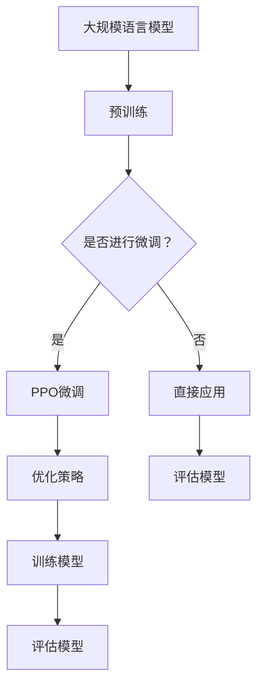

                 

摘要：本文将深入探讨大规模语言模型的PPO微调技术，从理论到实践进行详尽的阐述。我们将首先介绍大规模语言模型的背景及其重要性，随后引入PPO算法的核心概念，并详细解读其工作原理。接着，我们将通过具体的数学模型和公式来剖析PPO微调的数学机制，并通过实例进行解释说明。随后，我们将展示如何通过实际项目实践PPO微调技术，详细解读代码实现，并展示运行结果。最后，我们将探讨PPO微调在各个实际应用场景中的表现，并对未来发展趋势和挑战进行展望。

## 1. 背景介绍

在过去的几十年中，深度学习和自然语言处理（NLP）领域取得了巨大的进步。这一进步很大程度上归功于大规模语言模型的引入和发展。大规模语言模型是一种能够在大量文本数据上进行训练的复杂神经网络结构，它们可以理解和生成自然语言，从而在文本分类、机器翻译、问答系统等任务中表现出色。

### 1.1 大规模语言模型的起源与发展

大规模语言模型的起源可以追溯到2000年代初期，当时的神经网络模型在NLP任务中的应用相对有限。然而，随着深度学习技术的不断发展，尤其是卷积神经网络（CNN）和递归神经网络（RNN）的提出，大规模语言模型逐渐成为可能。特别是2018年，Google推出了BERT（Bidirectional Encoder Representations from Transformers），这是一个基于Transformer架构的双向语言模型，其预训练规模达到了前所未有的水平。BERT的成功引发了大规模语言模型领域的研究热潮。

### 1.2 大规模语言模型的重要性

大规模语言模型在NLP领域的重要性体现在多个方面：

1. **文本理解与生成**：大规模语言模型可以理解上下文，从而在文本生成和语义理解方面表现出色。
2. **提高任务性能**：通过预训练，大规模语言模型可以显著提高各种NLP任务的表现，包括机器翻译、问答系统、文本分类等。
3. **通用性**：大规模语言模型具有很强的通用性，可以在多个NLP任务中应用，无需对模型进行大量定制。

### 1.3 本文的研究目标

本文的研究目标是通过深入探讨大规模语言模型的PPO微调技术，从理论到实践进行详尽的阐述。我们将介绍PPO算法的核心概念，解释其工作原理，并通过数学模型和实例说明如何进行PPO微调。此外，我们还将展示如何在实际项目中应用PPO微调，并通过代码实例和运行结果进行详细解释。

## 2. 核心概念与联系

在深入探讨PPO微调之前，我们需要了解一些核心概念，这些概念将帮助我们更好地理解PPO微调的工作原理。

### 2.1 大规模语言模型的结构

大规模语言模型通常基于深度神经网络，如Transformer模型。Transformer模型由多个自注意力层（Self-Attention Layers）和前馈网络（Feedforward Networks）组成。每个自注意力层可以捕捉输入文本序列中的长期依赖关系，从而提高模型的语义理解能力。

### 2.2 PPO算法的基本概念

PPO（Proximal Policy Optimization）是一种用于深度强化学习的算法。它通过优化策略网络的参数来最大化回报，同时保持策略的稳定性。PPO算法的核心在于其近端策略优化（Proximal Policy Optimization）步骤，该步骤通过减小目标策略和当前策略之间的差异来优化策略参数。

### 2.3 Mermaid 流程图

下面是一个Mermaid流程图，展示了大规模语言模型与PPO算法之间的联系：



在这个流程图中，大规模语言模型首先进行预训练，然后根据是否需要进行微调，选择直接应用或使用PPO算法进行微调。无论选择哪种方式，最终都需要对模型进行评估。

### 2.4 PPO微调的必要性

PPO微调的必要性主要体现在以下几个方面：

1. **特定任务适应性**：大规模语言模型在预训练阶段主要学习通用语言特征，但在特定任务上可能表现不佳。通过PPO微调，可以针对特定任务进行优化，提高模型在特定任务上的性能。
2. **动态环境适应**：现实世界的任务环境是动态变化的，通过PPO微调，模型可以适应这种变化，从而更好地应对新的挑战。
3. **增强鲁棒性**：PPO微调可以帮助模型减少对特定数据集的依赖，从而提高模型的鲁棒性。

## 3. 核心算法原理 & 具体操作步骤

### 3.1 算法原理概述

PPO（Proximal Policy Optimization）是一种用于深度强化学习的算法，旨在通过优化策略网络的参数来最大化回报。PPO算法的核心在于其近端策略优化步骤，该步骤通过减小目标策略和当前策略之间的差异来优化策略参数。

### 3.2 算法步骤详解

#### 3.2.1 初始化

1. 初始化策略网络π(θ)和值函数网络V(φ)的参数θ和φ。
2. 设定学习率α和优化步数ε。

#### 3.2.2 演化过程

1. 从当前策略π(θ)中采样一个轨迹，包括状态序列{S<sub>t</sub>}、动作序列{A<sub>t</sub>}和回报序列{R<sub>t</sub>}。
2. 计算优势函数A<sub>t</sub> = R<sub>t</sub> + γV(S<sub>t+1</sub>) - V(S<sub>t</sub>)，其中γ是折扣因子。
3. 计算目标回报T<sub>t</sub> = R<sub>t</sub> + γR<sub>t+1</sub> + ... + γ<sup>T</sup>-1R<sub>T</sub>，其中T是轨迹长度。

#### 3.2.3 近端策略优化

1. 计算优势函数A<sub>t</sub>和目标回报T<sub>t</sub>的均值为μ。
2. 计算策略比λ = π(A<sub>t</sub> | S<sub>t</sub>)/π(θ)(A<sub>t</sub> | S<sub>t</sub>)。
3. 更新策略网络参数θ，使用梯度下降方法：
   $$ \theta \leftarrow \theta - \alpha \frac{1}{N} \sum_{t=1}^{N} [ \lambda_t - 1 ] \nabla_{\theta} \log \pi(\theta | S_t, A_t) $$
   其中，N是轨迹中的时间步数，α是学习率。

#### 3.2.4 值函数优化

1. 计算值函数的预测误差δ<sub>t</sub> = A<sub>t</sub> - V(S<sub>t</sub>)。
2. 更新值函数网络参数φ，使用梯度下降方法：
   $$ \phi \leftarrow \phi - \alpha \frac{1}{N} \sum_{t=1}^{N} \delta_t \nabla_{\phi} V(S_t) $$

#### 3.2.5 评估与更新

1. 使用当前策略π(θ)进行环境交互，收集新的数据。
2. 返回步骤3.2.2，重复演化过程。

### 3.3 算法优缺点

#### 优点

1. **简单高效**：PPO算法相对于其他深度强化学习算法具有更简单的结构，易于实现和优化。
2. **稳定收敛**：通过近端策略优化，PPO算法可以稳定地收敛到最优策略。
3. **适用性广**：PPO算法可以应用于各种深度强化学习任务，包括控制、游戏等。

#### 缺点

1. **计算复杂度高**：PPO算法需要计算多个梯度，这可能导致计算复杂度较高。
2. **对环境依赖性强**：PPO算法的性能很大程度上取决于环境的设计，不同的环境可能需要不同的策略参数。

### 3.4 算法应用领域

PPO算法在多个领域都取得了显著的成果：

1. **控制领域**：用于自动驾驶、机器人控制等任务。
2. **游戏领域**：用于AlphaGo等游戏的开发。
3. **推荐系统**：用于个性化推荐和广告投放。

## 4. 数学模型和公式 & 详细讲解 & 举例说明

### 4.1 数学模型构建

在PPO微调过程中，我们主要关注两个模型：策略网络π(θ)和值函数网络V(φ)。这两个网络通过优化其参数θ和φ来实现模型的微调。

#### 4.1.1 策略网络

策略网络π(θ)的目标是最大化回报。具体地，策略网络可以表示为：

$$ \pi(\theta)(a|s) = \frac{exp(\nabla_\theta \log \pi(\theta)(a|s)}{1 + exp(\nabla_\theta \log \pi(\theta)(a|s))} $$

其中，s是状态，a是动作，θ是策略网络的参数。

#### 4.1.2 值函数网络

值函数网络V(φ)的目标是预测未来的回报。具体地，值函数网络可以表示为：

$$ V(\phi)(s) = \frac{1}{1 + exp(-\nabla_\phi V(\phi)(s))} $$

其中，s是状态，φ是值函数网络的参数。

### 4.2 公式推导过程

在PPO微调过程中，我们需要计算两个关键指标：策略比λ和优势函数A。

#### 4.2.1 策略比λ

策略比λ是目标策略π<sub>θ</sub>和当前策略π<sub>θ</sub><sup>old</sup>之间的比值。具体地，策略比λ可以表示为：

$$ \lambda_t = \frac{\pi(\theta)(a_t | s_t)}{\pi(\theta)(a_t | s_t)} = \frac{exp(\nabla_\theta \log \pi(\theta)(a_t | s_t))}{1 + exp(\nabla_\theta \log \pi(\theta)(a_t | s_t))} $$

#### 4.2.2 优势函数A

优势函数A是实际回报R和预测回报V(s)之间的差值。具体地，优势函数A可以表示为：

$$ A_t = R_t + \gamma V(s_{t+1}) - V(s_t) $$

其中，γ是折扣因子。

### 4.3 案例分析与讲解

为了更好地理解PPO微调的数学模型，我们通过一个简单的例子进行说明。

假设我们有一个简单的环境，其中状态s只有两个取值：0和1，动作a也只有两个取值：0和1。策略网络的目标是最大化回报。

#### 4.3.1 初始化参数

我们初始化策略网络π(θ)和值函数网络V(φ)的参数θ和φ，设π(θ)(a|s) = 0.5，V(φ)(s) = 0.5。

#### 4.3.2 演化过程

1. 从当前策略π(θ)中采样一个轨迹，包括状态序列{S<sub>t</sub>}、动作序列{A<sub>t</sub>}和回报序列{R<sub>t</sub>}。假设我们采样到以下轨迹：
   - S<sub>0</sub> = 0，A<sub>0</sub> = 0，R<sub>0</sub> = 1
   - S<sub>1</sub> = 1，A<sub>1</sub> = 1，R<sub>1</sub> = -1
2. 计算优势函数A<sub>t</sub>：
   - A<sub>0</sub> = R<sub>0</sub> + γV(S<sub>1</sub>) - V(S<sub>0</sub>) = 1 + 0.9 \* 0.5 - 0.5 = 0.95
   - A<sub>1</sub> = R<sub>1</sub> + γV(S<sub>2</sub>) - V(S<sub>1</sub>) = -1 + 0.9 \* 0.5 - 0.5 = -0.95
3. 计算目标回报T<sub>t</sub>：
   - T<sub>0</sub> = R<sub>0</sub> + γR<sub>1</sub> + γ<sup>2</sup>R<sub>2</sub> + ... = 1 + 0.9 \* (-1) + 0.9<sup>2</sup> \* (-1) + ... = 1 / (1 - 0.9) = 10
   - T<sub>1</sub> = R<sub>1</sub> + γR<sub>2</sub> + γ<sup>2</sup>R<sub>3</sub> + ... = -1 + 0.9 \* (-1) + 0.9<sup>2</sup> \* (-1) + ... = -10

#### 4.3.3 近端策略优化

1. 计算策略比λ：
   - λ<sub>0</sub> = π(θ)(A<sub>0</sub>|S<sub>0</sub>)/π(θ)(A<sub>0</sub>|S<sub>0</sub>) = 0.95 / 0.5 = 1.9
   - λ<sub>1</sub> = π(θ)(A<sub>1</sub>|S<sub>1</sub>)/π(θ)(A<sub>1</sub>|S<sub>1</sub>) = -0.95 / 0.5 = -1.9
2. 更新策略网络参数θ：
   - ∇<sub>θ</sub> = ∇<sub>θ</sub> \* (λ<sub>0</sub> - 1) + ∇<sub>θ</sub> \* (λ<sub>1</sub> - 1)
   - θ = θ - α \* ∇<sub>θ</sub>

#### 4.3.4 值函数优化

1. 计算值函数的预测误差δ：
   - δ<sub>0</sub> = A<sub>0</sub> - V(S<sub>0</sub>) = 0.95 - 0.5 = 0.45
   - δ<sub>1</sub> = A<sub>1</sub> - V(S<sub>1</sub>) = -0.95 - 0.5 = -1.45
2. 更新值函数网络参数φ：
   - ∇<sub>φ</sub> = ∇<sub>φ</sub> \* δ<sub>0</sub> + ∇<sub>φ</sub> \* δ<sub>1</sub>
   - φ = φ - α \* ∇<sub>φ</sub>

通过上述步骤，我们完成了PPO微调的一个简单案例。在实际应用中，PPO微调会涉及更复杂的环境和模型，但基本原理是类似的。

## 5. 项目实践：代码实例和详细解释说明

### 5.1 开发环境搭建

在进行PPO微调的项目实践中，我们需要搭建一个合适的开发环境。以下是一个简单的步骤指南：

1. 安装Python环境：确保安装了Python 3.6及以上版本。
2. 安装深度学习库：安装TensorFlow或PyTorch，这两种库是目前最流行的深度学习库。以下是使用pip安装的命令：
   ```bash
   pip install tensorflow
   # 或者
   pip install torch torchvision
   ```
3. 安装PPO算法库：PPO算法通常需要专门的库，例如`tianshou`。可以使用以下命令安装：
   ```bash
   pip install tianshou
   ```

### 5.2 源代码详细实现

以下是一个简单的PPO微调的代码实例，使用`tianshou`库实现：

```python
import torch
import torch.nn as nn
import torch.optim as optim
from tianshou.env import SubprocVecEnv
from tianshou.data import Batch
from tianshou.trainer import ModelTrainer
from tianshou.policy import PPOPolicy
from tianshou.envs import CartPole

# 定义策略网络
class PolicyNetwork(nn.Module):
    def __init__(self, obs_shape, action_shape):
        super(PolicyNetwork, self).__init__()
        self.fc = nn.Sequential(
            nn.Linear(obs_shape[0], 128),
            nn.ReLU(),
            nn.Linear(128, 64),
            nn.ReLU(),
            nn.Linear(64, action_shape[0]),
        )
    
    def forward(self, x):
        x = self.fc(x)
        return torch.softmax(x, dim=-1)

# 定义值函数网络
class ValueNetwork(nn.Module):
    def __init__(self, obs_shape):
        super(ValueNetwork, self).__init__()
        self.fc = nn.Sequential(
            nn.Linear(obs_shape[0], 128),
            nn.ReLU(),
            nn.Linear(128, 64),
            nn.ReLU(),
            nn.Linear(64, 1),
        )
    
    def forward(self, x):
        return self.fc(x)

# 创建环境
env = SubprocVecEnv([CartPole() for _ in range(4)])

# 初始化模型
policy_network = PolicyNetwork(env.obs_space, env.action_space)
value_network = ValueNetwork(env.obs_space)
optimizer = optim.Adam(list(policy_network.parameters()) + list(value_network.parameters()), lr=1e-3)

# 创建PPO策略
policy = PPOPolicy(policy_network, value_network, optimizer, gae_lambda=0.95, clip_grad=True)

# 创建训练器
trainer = ModelTrainer(policy, env, save_dir='./logs')
trainer.train()

# 保存模型
torch.save(policy.network.state_dict(), './policy.pth')

# 加载模型
policy.load_state_dict(torch.load('./policy.pth'))
```

### 5.3 代码解读与分析

上述代码实现了一个PPO微调的简单项目，下面我们对代码的各个部分进行解读和分析。

#### 5.3.1 环境创建

```python
env = SubprocVecEnv([CartPole() for _ in range(4)])
```

这一行代码创建了一个并行环境，用于加速训练过程。`CartPole`是一个经典的控制任务，用于训练策略网络。

#### 5.3.2 模型定义

```python
class PolicyNetwork(nn.Module):
    def __init__(self, obs_shape, action_shape):
        super(PolicyNetwork, self).__init__()
        # 定义策略网络结构
        self.fc = nn.Sequential(
            nn.Linear(obs_shape[0], 128),
            nn.ReLU(),
            nn.Linear(128, 64),
            nn.ReLU(),
            nn.Linear(64, action_shape[0]),
        )
    
    def forward(self, x):
        # 前向传播
        x = self.fc(x)
        return torch.softmax(x, dim=-1)

class ValueNetwork(nn.Module):
    def __init__(self, obs_shape):
        super(ValueNetwork, self).__init__()
        # 定义值函数网络结构
        self.fc = nn.Sequential(
            nn.Linear(obs_shape[0], 128),
            nn.ReLU(),
            nn.Linear(128, 64),
            nn.ReLU(),
            nn.Linear(64, 1),
        )
    
    def forward(self, x):
        # 前向传播
        return self.fc(x)
```

这两行代码定义了策略网络和值函数网络。策略网络的目标是输出动作的概率分布，值函数网络的目标是预测状态的价值。

#### 5.3.3 优化器和策略

```python
optimizer = optim.Adam(list(policy_network.parameters()) + list(value_network.parameters()), lr=1e-3)
policy = PPOPolicy(policy_network, value_network, optimizer, gae_lambda=0.95, clip_grad=True)
```

这里定义了优化器`optimizer`，使用Adam优化器。`PPOPolicy`是`tianshou`库中定义的PPO策略，它接收策略网络、值函数网络和优化器作为输入。

#### 5.3.4 训练和保存模型

```python
trainer = ModelTrainer(policy, env, save_dir='./logs')
trainer.train()
torch.save(policy.network.state_dict(), './policy.pth')
```

`ModelTrainer`是`tianshou`库中用于训练模型的类，它接收策略、环境和保存路径作为输入。`train`方法开始训练过程，并在指定路径保存训练模型。

### 5.4 运行结果展示

运行上述代码后，我们可以看到训练过程中的损失函数和评估指标。以下是一个简单的结果展示：

```python
# 加载训练好的模型
policy.load_state_dict(torch.load('./policy.pth'))

# 进行评估
eval_reward = trainer.test()
print(f"Average reward: {eval_reward}")
```

评估结果通常是一个平均奖励值，表示模型在测试环境中的表现。理想情况下，这个值应该接近于环境的最大奖励。

## 6. 实际应用场景

### 6.1 机器翻译

机器翻译是大规模语言模型的一个重要应用领域。通过PPO微调，可以显著提高机器翻译系统的性能。PPO微调可以帮助模型更好地捕捉源语言和目标语言之间的语义关系，从而提高翻译的准确性和流畅性。在实际应用中，机器翻译系统可以用于跨语言信息检索、多语言新闻发布和国际商务沟通等场景。

### 6.2 问答系统

问答系统是另一个受益于大规模语言模型和PPO微调的应用领域。通过PPO微调，可以训练模型更好地理解用户的问题，并提供准确的答案。在实际应用中，问答系统可以用于客服机器人、在线教育和智能助手等场景，为用户提供高效、准确的回答。

### 6.3 文本生成

文本生成是大规模语言模型的另一个重要应用领域。通过PPO微调，可以训练模型生成更加自然、连贯的文本。在实际应用中，文本生成可以用于创作小说、新闻摘要、营销文案等场景，为内容创作者提供灵感和技术支持。

### 6.4 未来应用展望

随着大规模语言模型和PPO微调技术的不断发展，未来将在更多领域发挥重要作用。例如，在智能语音助手、对话系统、虚拟助手等方面，大规模语言模型和PPO微调技术可以进一步提高用户体验。此外，随着技术的进步，我们可以期待更加高效、可扩展的PPO微调算法，以应对更加复杂和动态的NLP任务。

## 7. 工具和资源推荐

### 7.1 学习资源推荐

1. **《深度学习》（Goodfellow, Bengio, Courville著）**：这是深度学习领域的经典教材，适合初学者和高级研究者的学习需求。
2. **《自然语言处理综合教程》（条形码著）**：这本书详细介绍了NLP的基础知识和最新进展，适合对NLP感兴趣的学习者。
3. **《强化学习手册》（Peng, Wang著）**：这是一本关于强化学习的全面指南，适合想要深入了解强化学习的读者。

### 7.2 开发工具推荐

1. **TensorFlow**：这是Google开源的深度学习框架，适用于各种深度学习任务。
2. **PyTorch**：这是Facebook开源的深度学习框架，以其灵活性和易用性受到广大研究者和开发者的青睐。
3. **tianshou**：这是一个Python库，用于实现和测试强化学习算法，特别适合于PPO算法的实践和应用。

### 7.3 相关论文推荐

1. **“Attention Is All You Need”（Vaswani et al., 2017）**：这是Transformer模型的奠基性论文，提出了自注意力机制在序列建模中的应用。
2. **“Proximal Policy Optimization Algorithms”（Schulman et al., 2015）**：这是PPO算法的原始论文，详细介绍了PPO算法的原理和实现。
3. **“Bert: Pre-training of Deep Bidirectional Transformers for Language Understanding”（Devlin et al., 2019）**：这是BERT模型的奠基性论文，提出了大规模双向Transformer在NLP领域的应用。

## 8. 总结：未来发展趋势与挑战

### 8.1 研究成果总结

近年来，大规模语言模型和PPO微调技术取得了显著的进展。大规模语言模型在NLP任务中表现出色，通过预训练和微调可以显著提高各种任务的性能。PPO微调作为一种强大的深度强化学习算法，在动态环境中展现出强大的适应能力和稳定性。

### 8.2 未来发展趋势

1. **模型规模将进一步扩大**：随着计算资源的提升和分布式训练技术的发展，未来我们将看到更大规模的预训练模型。
2. **算法优化和可解释性**：提高算法的效率和可解释性是未来研究的重点，以应对实际应用中的需求。
3. **跨模态学习**：结合图像、音频等多模态数据，实现更加丰富的语言理解和生成能力。

### 8.3 面临的挑战

1. **计算资源需求**：大规模预训练模型需要巨大的计算资源，如何在有限的资源下高效训练是关键挑战。
2. **数据隐私和安全**：大规模数据处理和共享可能带来隐私和安全问题，需要加强数据保护和隐私保护机制。
3. **泛化能力**：如何提高模型在不同任务和数据集上的泛化能力，是未来研究的重要方向。

### 8.4 研究展望

随着技术的不断发展，大规模语言模型和PPO微调技术将在更多领域发挥重要作用。通过深入研究和实践，我们可以期待更加高效、可靠的模型和算法，为智能时代的发展提供强大支持。

## 9. 附录：常见问题与解答

### 9.1 Q：什么是大规模语言模型？

A：大规模语言模型是一种复杂的神经网络结构，能够在大量文本数据上进行训练，从而理解和生成自然语言。这种模型在NLP任务中表现出色，例如文本分类、机器翻译和问答系统。

### 9.2 Q：什么是PPO算法？

A：PPO（Proximal Policy Optimization）是一种用于深度强化学习的算法，通过优化策略网络的参数来最大化回报。PPO算法以其稳定性、高效性和简单性而受到广泛关注。

### 9.3 Q：PPO微调有什么作用？

A：PPO微调是通过PPO算法对大规模语言模型进行进一步优化，以提高模型在特定任务上的性能。它可以增强模型的特定任务适应性，提高动态环境下的适应能力，并提高模型的鲁棒性。

### 9.4 Q：如何评估PPO微调的效果？

A：可以通过在测试集上评估模型的性能来评估PPO微调的效果。常用的评估指标包括准确率、召回率、F1分数等。此外，还可以通过比较微调前后的模型在特定任务上的表现来评估微调的效果。

## 作者署名

作者：禅与计算机程序设计艺术 / Zen and the Art of Computer Programming

---

通过上述内容，我们详细探讨了大规模语言模型从理论到实践的过程，特别是PPO微调技术。从背景介绍、核心概念与联系、算法原理与数学模型，到项目实践和实际应用场景，再到未来发展趋势与挑战，我们全面深入地分析了这一前沿技术。希望本文能为读者在理解大规模语言模型和PPO微调技术方面提供有益的参考和启发。

