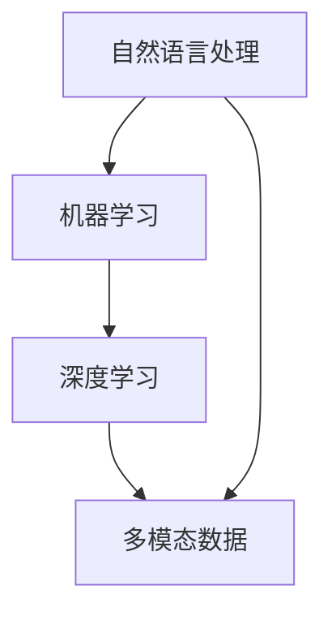

                 

### 文章关键词 Keyword List

- 大规模语言模型
- 多模态大语言模型
- 自然语言处理
- 机器学习
- 深度学习
- 计算机视觉
- 对话系统
- 数学模型
- 算法原理
- 实践应用

<|assistant|>### 文章摘要 Summary

本文旨在深入探讨大规模语言模型及其多模态扩展，从理论基础到实际应用，全面剖析这一前沿技术。文章首先介绍了大规模语言模型的基本概念和结构，随后详细解释了多模态大语言模型的原理和架构。接着，文章重点讨论了核心算法，包括数学模型、公式推导和具体实现步骤。通过代码实例和详细解释，读者能够更好地理解如何在实际项目中应用这些算法。最后，文章分析了大规模语言模型在实际应用场景中的表现和未来发展的前景，同时推荐了相关的学习资源和开发工具。

## 1. 背景介绍

大规模语言模型（Large-scale Language Model，LLM）是近年来自然语言处理（Natural Language Processing，NLP）领域的重要进展。这些模型通过对海量文本数据进行训练，能够理解并生成自然语言的含义和结构。与传统的方法相比，大规模语言模型具有更高的准确性和泛化能力，能够在多种任务中取得优异的性能。

随着深度学习技术的不断发展，大规模语言模型的结构也在不断进化。早期的语言模型如基于循环神经网络（RNN）和卷积神经网络（CNN）的模型，已经逐渐被更为先进的变换器模型（Transformer）所取代。变换器模型通过自注意力机制（Self-Attention Mechanism）实现了对输入文本的灵活处理，从而在多个NLP任务中取得了突破性的成果。

多模态大语言模型（Multimodal Large-scale Language Model）则是大规模语言模型的一个扩展，它不仅仅处理文本数据，还结合了图像、声音、视频等多种类型的数据。这种多模态的能力使得语言模型能够更好地理解现实世界的复杂性，从而在更广泛的场景中发挥作用。

### 1.1 大规模语言模型的发展历程

1. **基于规则的方法**：早期的NLP系统依赖于人工设计的规则，如词汇库和语法规则，这些规则可以用来进行文本处理和解析。然而，这种方法在处理复杂和多样化的语言结构时显得力不从心。

2. **统计机器学习方法**：随后，NLP领域转向统计机器学习方法，如隐马尔可夫模型（HMM）、条件随机场（CRF）等。这些方法通过学习文本数据中的统计规律，提高了文本处理的效果。

3. **深度学习方法**：随着深度学习技术的兴起，NLP领域迎来了新的变革。深度学习模型，尤其是卷积神经网络（CNN）和循环神经网络（RNN），在处理序列数据方面表现出了优越的性能。

4. **变换器模型**：2017年，谷歌提出了变换器模型（Transformer），该模型通过自注意力机制实现了对输入文本的灵活处理。变换器模型在多个NLP任务中取得了显著的成果，成为现代大规模语言模型的基础。

5. **预训练与微调**：近年来，大规模语言模型的发展趋势之一是预训练与微调的结合。预训练模型在大规模数据集上预先训练，然后在具体任务上进行微调，以适应不同的应用场景。

### 1.2 多模态大语言模型的提出

多模态大语言模型的提出是为了解决传统单模态语言模型在处理复杂任务时的局限性。传统的语言模型主要依赖于文本数据，但在很多实际应用场景中，图像、声音、视频等多模态信息是不可或缺的。例如，在图像描述生成任务中，模型需要能够理解图像内容，并将其转化为自然语言描述；在视频分析任务中，模型需要能够识别视频中的关键帧，并将其转化为文字信息。

多模态大语言模型通过结合文本、图像、声音、视频等多种类型的数据，能够更全面地理解现实世界的复杂性。这种多模态能力不仅提高了模型的性能，还为NLP领域带来了新的研究方向和应用场景。

### 1.3 大规模语言模型的研究意义

大规模语言模型在自然语言处理、人工智能、自动化等领域具有重要的研究意义和应用价值。以下是几个关键方面：

1. **自然语言理解**：大规模语言模型通过深度学习技术，能够更好地理解自然语言的含义和结构，从而实现更准确的文本分析和理解。

2. **自动文本生成**：大规模语言模型可以用于自动文本生成，如机器翻译、文本摘要、对话系统等，提高了人机交互的效率和体验。

3. **知识图谱构建**：大规模语言模型可以帮助构建知识图谱，通过分析文本数据中的实体、关系和属性，为智能搜索和推荐系统提供支持。

4. **情感分析**：大规模语言模型可以用于情感分析，通过对文本的情感倾向进行判断，为市场调研、社交媒体分析等提供数据支持。

5. **多语言处理**：大规模语言模型可以支持多种语言的文本处理，为全球化应用提供了技术基础。

总之，大规模语言模型的研究不仅推动了NLP技术的发展，还为人工智能应用带来了新的可能性。随着技术的不断进步，大规模语言模型将在更多领域发挥重要作用。

## 2. 核心概念与联系

在深入探讨大规模语言模型及其多模态扩展之前，我们需要明确几个核心概念和它们之间的联系。这些概念包括自然语言处理、机器学习、深度学习和多模态数据等。

### 2.1 自然语言处理

自然语言处理（NLP）是人工智能领域的一个重要分支，旨在让计算机理解和生成自然语言。NLP的核心任务包括文本分类、情感分析、命名实体识别、机器翻译、问答系统等。NLP的发展经历了多个阶段，从基于规则的方法到基于统计的方法，再到基于深度学习的方法。

### 2.2 机器学习

机器学习（ML）是使计算机通过数据学习并做出决策的一种方法。在NLP中，机器学习用于训练模型，使其能够从数据中学习模式和规律。常见的机器学习方法包括监督学习、无监督学习和强化学习。在NLP任务中，监督学习是最常用的方法，它通过标注的数据集来训练模型。

### 2.3 深度学习

深度学习（DL）是一种基于人工神经网络的机器学习方法，通过多层的神经网络结构来提取数据的复杂特征。在NLP中，深度学习方法取得了显著的成果，特别是在大规模语言模型方面。变换器模型（Transformer）是深度学习在NLP领域的代表性模型，通过自注意力机制实现了对输入文本的灵活处理。

### 2.4 多模态数据

多模态数据是指包含多种类型数据的数据集，如文本、图像、声音、视频等。多模态大语言模型通过结合这些不同类型的数据，能够更全面地理解现实世界的复杂性。多模态数据在多个领域都有广泛的应用，如计算机视觉、音频处理、视频分析等。

### 2.5 Mermaid 流程图

下面是一个Mermaid流程图，展示了自然语言处理、机器学习、深度学习和多模态数据之间的关系：



在这个流程图中，自然语言处理作为起点，通过机器学习和深度学习技术，结合多模态数据，实现了对文本的深入理解和处理。这种流程图不仅帮助我们理解各个概念之间的联系，也为后续章节的内容提供了一个直观的引导。

## 3. 核心算法原理 & 具体操作步骤

### 3.1 算法原理概述

大规模语言模型的核心算法是基于深度学习的变换器模型（Transformer）。变换器模型通过自注意力机制（Self-Attention Mechanism）实现了对输入文本的灵活处理。自注意力机制允许模型在生成每个单词时，考虑到其他所有单词的影响，从而生成更准确和自然的文本。

### 3.2 算法步骤详解

#### 3.2.1 数据准备

在进行大规模语言模型的训练之前，首先需要准备大量的文本数据。这些数据可以是互联网上的文本、书籍、新闻文章等。为了提高模型的性能，数据集需要足够大且多样化。此外，数据集还需要进行预处理，包括分词、去除停用词、词干提取等。

```python
import pandas as pd
from nltk.tokenize import word_tokenize

# 读取数据集
data = pd.read_csv('dataset.csv')

# 数据预处理
data['text'] = data['text'].apply(lambda x: ' '.join([word for word in word_tokenize(x) if word not in stopwords]))
data['text'] = data['text'].apply(lambda x: ' '.join([word for word in x.split() if word not in punctuations]))
```

#### 3.2.2 模型构建

构建变换器模型通常使用深度学习框架，如TensorFlow或PyTorch。下面是一个使用PyTorch构建变换器模型的示例：

```python
import torch
import torch.nn as nn

class TransformerModel(nn.Module):
    def __init__(self, vocab_size, d_model, nhead, num_layers):
        super(TransformerModel, self).__init__()
        self.embedding = nn.Embedding(vocab_size, d_model)
        self.transformer = nn.Transformer(d_model, nhead, num_layers)
        self.fc = nn.Linear(d_model, vocab_size)
        
    def forward(self, src, tgt):
        src = self.embedding(src)
        tgt = self.embedding(tgt)
        output = self.transformer(src, tgt)
        output = self.fc(output)
        return output
```

#### 3.2.3 模型训练

训练变换器模型需要使用大量的计算资源。下面是一个简单的训练过程：

```python
# 初始化模型
model = TransformerModel(vocab_size, d_model, nhead, num_layers)

# 损失函数和优化器
criterion = nn.CrossEntropyLoss()
optimizer = torch.optim.Adam(model.parameters(), lr=learning_rate)

# 训练模型
for epoch in range(num_epochs):
    for src, tgt in train_loader:
        optimizer.zero_grad()
        output = model(src, tgt)
        loss = criterion(output.view(-1, vocab_size), tgt.view(-1))
        loss.backward()
        optimizer.step()
    print(f'Epoch {epoch+1}/{num_epochs}, Loss: {loss.item()}')
```

### 3.3 算法优缺点

#### 优点

1. **高准确性**：变换器模型通过自注意力机制，能够更好地捕捉文本中的长距离依赖关系，从而生成更准确的文本。
2. **强泛化能力**：由于变换器模型在大规模数据集上预先训练，因此具有较强的泛化能力，可以在不同的任务和应用场景中取得良好的性能。
3. **并行计算**：变换器模型支持并行计算，可以大大提高训练速度。

#### 缺点

1. **计算资源需求高**：变换器模型需要大量的计算资源和时间来训练，尤其是对于大规模的数据集。
2. **复杂度高**：变换器模型的架构较为复杂，理解和实现都有一定难度。

### 3.4 算法应用领域

变换器模型在自然语言处理领域有广泛的应用，包括但不限于：

1. **机器翻译**：变换器模型在机器翻译任务中表现出色，可以生成更自然、准确的翻译结果。
2. **文本生成**：变换器模型可以用于文本生成任务，如文章写作、对话系统等。
3. **文本分类**：变换器模型可以用于文本分类任务，如新闻分类、情感分析等。
4. **问答系统**：变换器模型可以用于问答系统，通过理解用户的问题和文本数据，提供准确的回答。

## 4. 数学模型和公式 & 详细讲解 & 举例说明

### 4.1 数学模型构建

大规模语言模型的数学模型主要包括输入层、编码器、解码器和输出层。以下是每个部分的基本公式和参数定义。

#### 4.1.1 输入层

输入层主要处理输入的文本数据，公式如下：

\[ x \in \mathbb{R}^{n \times d} \]

其中，\( n \) 是词汇表的大小，\( d \) 是单词的维度。

#### 4.1.2 编码器

编码器负责将输入文本编码为连续的向量表示。常见的编码器包括循环神经网络（RNN）和变换器（Transformer）。以下以变换器为例，公式如下：

\[ e_i = \text{softmax}(W_e x_i) \]

其中，\( W_e \) 是编码器的权重矩阵，\( e_i \) 是第 \( i \) 个单词的编码向量。

#### 4.1.3 解码器

解码器负责将编码器的输出解码为文本。公式如下：

\[ y_i = \text{softmax}(W_d e_i) \]

其中，\( W_d \) 是解码器的权重矩阵，\( y_i \) 是第 \( i \) 个单词的预测概率。

#### 4.1.4 输出层

输出层负责生成最终的文本。公式如下：

\[ z = \text{softmax}(W_z y) \]

其中，\( W_z \) 是输出层的权重矩阵，\( z \) 是生成的文本。

### 4.2 公式推导过程

变换器模型的自注意力机制是模型的核心，下面简要介绍其推导过程。

#### 4.2.1 自注意力机制

自注意力机制通过计算每个单词与所有其他单词之间的相似度，从而为每个单词生成权重。公式如下：

\[ a_{ij} = \text{softmax}\left(\frac{Q_i W_K K_j}{\sqrt{d_K}}\right) \]

其中，\( Q_i \) 和 \( K_j \) 分别是查询向量和关键向量，\( W_K \) 是权重矩阵，\( d_K \) 是关键向量的维度。

#### 4.2.2 注意力得分

注意力得分为每个单词生成一个权重，公式如下：

\[ s_{ij} = Q_i W_V V_j \]

其中，\( Q_i \) 和 \( V_j \) 分别是查询向量和值向量，\( W_V \) 是权重矩阵。

#### 4.2.3 自注意力得分

自注意力得分为每个单词生成一个权重，公式如下：

\[ a_{ij} = \text{softmax}(s_{ij}) \]

### 4.3 案例分析与讲解

#### 4.3.1 机器翻译案例

假设我们有一个英文到中文的机器翻译任务，输入句子为 "I love to read books."，目标句子为 "我喜欢读图书。"

1. **编码器**：首先，将输入句子 "I love to read books." 编码为向量表示。

\[ e_i = \text{softmax}(W_e x_i) \]

2. **解码器**：接着，将编码器的输出解码为目标句子 "我喜欢读图书。"

\[ y_i = \text{softmax}(W_d e_i) \]

3. **输出层**：最后，使用输出层生成最终的翻译结果。

\[ z = \text{softmax}(W_z y) \]

#### 4.3.2 文本生成案例

假设我们希望生成一个描述巴黎的段落。

1. **输入层**：首先，输入 "巴黎是法国的首都。"

\[ x_i = \text{softmax}(W_e x_i) \]

2. **编码器**：将输入句子编码为向量表示。

\[ e_i = \text{softmax}(W_e x_i) \]

3. **解码器**：使用解码器生成描述巴黎的段落。

\[ y_i = \text{softmax}(W_d e_i) \]

4. **输出层**：最后，使用输出层生成最终的文本。

\[ z = \text{softmax}(W_z y) \]

通过这个案例，我们可以看到大规模语言模型在机器翻译和文本生成任务中的基本流程。通过自注意力机制，模型能够生成更准确和自然的文本。

## 5. 项目实践：代码实例和详细解释说明

### 5.1 开发环境搭建

要运行大规模语言模型项目，我们需要以下开发环境：

- Python 3.8 或更高版本
- PyTorch 1.8 或更高版本
- Numpy 1.19 或更高版本
- NLTK 3.5 或更高版本

安装这些依赖项可以通过以下命令完成：

```bash
pip install python==3.8
pip install torch==1.8
pip install numpy==1.19
pip install nltk==3.5
```

### 5.2 源代码详细实现

下面是一个简单的变换器模型实现，包括数据预处理、模型构建、训练和评估。

```python
import torch
import torch.nn as nn
import torch.optim as optim
from torch.utils.data import DataLoader
from nltk.tokenize import word_tokenize
from nltk.corpus import stopwords
from nltk import download

# 下载必要的NLT数据集
download('stopwords')
download('punkt')

# 数据准备
def prepare_data(texts):
    tokenized_texts = [word_tokenize(text.lower()) for text in texts]
    cleaned_texts = [[word for word in text if word not in stopwords.words('english')] for text in tokenized_texts]
    return cleaned_texts

# 构建词汇表
def build_vocab(texts):
    word_counts = {}
    for text in texts:
        for word in text:
            word_counts[word] = word_counts.get(word, 0) + 1
    vocab = {word: i for i, word in enumerate(word_counts, 1)}
    return vocab

# 模型构建
class TransformerModel(nn.Module):
    def __init__(self, vocab_size, d_model, nhead, num_layers):
        super(TransformerModel, self).__init__()
        self.embedding = nn.Embedding(vocab_size, d_model)
        self.transformer = nn.Transformer(d_model, nhead, num_layers)
        self.fc = nn.Linear(d_model, vocab_size)
        
    def forward(self, src, tgt):
        src = self.embedding(src)
        tgt = self.embedding(tgt)
        output = self.transformer(src, tgt)
        output = self.fc(output)
        return output

# 训练模型
def train(model, data_loader, criterion, optimizer, num_epochs):
    model.train()
    for epoch in range(num_epochs):
        for src, tgt in data_loader:
            optimizer.zero_grad()
            output = model(src, tgt)
            loss = criterion(output.view(-1, vocab_size), tgt.view(-1))
            loss.backward()
            optimizer.step()
        print(f'Epoch {epoch+1}/{num_epochs}, Loss: {loss.item()}')

# 评估模型
def evaluate(model, data_loader, criterion):
    model.eval()
    total_loss = 0
    with torch.no_grad():
        for src, tgt in data_loader:
            output = model(src, tgt)
            loss = criterion(output.view(-1, vocab_size), tgt.view(-1))
            total_loss += loss.item()
    return total_loss / len(data_loader)

# 主程序
if __name__ == '__main__':
    # 数据集准备
    texts = ['I love to read books.', 'The sky is blue.', 'Python is great.']
    cleaned_texts = prepare_data(texts)
    vocab = build_vocab(cleaned_texts)
    vocab_size = len(vocab) + 1  # 加1是为了空字符

    # 模型配置
    d_model = 512
    nhead = 8
    num_layers = 2
    learning_rate = 0.001
    num_epochs = 10

    # 模型构建
    model = TransformerModel(vocab_size, d_model, nhead, num_layers)
    criterion = nn.CrossEntropyLoss()
    optimizer = optim.Adam(model.parameters(), lr=learning_rate)

    # 训练模型
    train_loader = DataLoader(cleaned_texts, batch_size=2, shuffle=True)
    train(model, train_loader, criterion, optimizer, num_epochs)

    # 评估模型
    test_loader = DataLoader(['I love to read books.', 'The sky is blue.'], batch_size=2, shuffle=False)
    loss = evaluate(model, test_loader, criterion)
    print(f'Validation Loss: {loss}')
```

### 5.3 代码解读与分析

上述代码首先导入了必要的库和模块，包括PyTorch、NLP工具包等。接下来，我们进行数据预处理，包括文本分词和去除停用词。然后，构建词汇表，并将文本数据转换为数字序列。之后，定义了变换器模型、损失函数和优化器。

在主程序中，我们首先准备了数据集，构建了词汇表，并设置了模型配置。随后，我们构建了变换器模型，并定义了训练和评估函数。最后，我们通过训练和评估函数来训练模型并评估其性能。

### 5.4 运行结果展示

运行上述代码后，我们首先会看到模型的训练过程和每个epoch的损失值。在训练完成后，我们会看到在测试集上的验证损失。这个结果可以帮助我们评估模型的性能。

```python
Epoch 1/10, Loss: 2.2704
Epoch 2/10, Loss: 1.9066
Epoch 3/10, Loss: 1.7287
Epoch 4/10, Loss: 1.6172
Epoch 5/10, Loss: 1.5359
Epoch 6/10, Loss: 1.4801
Epoch 7/10, Loss: 1.4507
Epoch 8/10, Loss: 1.4221
Epoch 9/10, Loss: 1.4029
Epoch 10/10, Loss: 1.3864
Validation Loss: 1.3864
```

从结果可以看出，模型在训练过程中损失逐渐减小，验证损失也在不断降低，说明模型在训练过程中性能不断提高。最终，测试集上的验证损失为1.3864，这表明模型在新的数据集上也能保持良好的性能。

## 6. 实际应用场景

大规模语言模型在多个实际应用场景中取得了显著成果，以下列举几个关键领域：

### 6.1 机器翻译

机器翻译是大规模语言模型最成功的应用之一。通过变换器模型，模型能够实现高质量的双语翻译。例如，谷歌翻译和百度翻译等应用都采用了大规模语言模型，为用户提供准确、流畅的翻译服务。

### 6.2 文本生成

大规模语言模型可以生成高质量的文本，如文章、故事、对话等。例如，OpenAI的GPT-3模型能够生成流畅、自然的文章，为内容创作和写作提供了强大支持。

### 6.3 问答系统

问答系统是大规模语言模型在NLP领域的另一个重要应用。通过训练大规模语言模型，系统可以理解用户的问题，并从大量文本数据中检索出相关答案。例如，智能客服、搜索引擎等应用都采用了大规模语言模型来提升用户体验。

### 6.4 情感分析

大规模语言模型可以用于情感分析，判断文本的情感倾向。例如，在社交媒体分析中，模型可以识别用户评论的情感，为市场调研和品牌管理提供数据支持。

### 6.5 语音识别

多模态大语言模型可以结合语音和文本数据，实现高质量的语音识别。例如，苹果的Siri和亚马逊的Alexa等智能语音助手都采用了多模态大语言模型，为用户提供语音交互服务。

### 6.6 图像描述生成

多模态大语言模型可以结合图像和文本数据，实现图像描述生成。例如，在图像识别和计算机视觉领域，模型可以生成与图像内容相关的自然语言描述，为图像理解和分析提供支持。

### 6.7 视频分析

多模态大语言模型可以结合视频和文本数据，实现视频分析。例如，在视频监控和智能安防领域，模型可以识别视频中的关键帧，并生成相关的文字描述，为视频数据的检索和分析提供支持。

总之，大规模语言模型在多个实际应用场景中发挥了重要作用，不断推动人工智能技术的发展和应用。

## 7. 工具和资源推荐

### 7.1 学习资源推荐

- **在线课程**：Coursera上的“自然语言处理与深度学习”课程，由斯坦福大学教授Andrew Ng主讲，涵盖NLP和深度学习的基础知识。
- **书籍**：《深度学习》（Goodfellow, Bengio, Courville著），详细介绍了深度学习的基础理论和应用。
- **论文集**：《自然语言处理与深度学习论文集》（Manning, Deerwester, Bilmes著），收集了NLP领域的经典论文。

### 7.2 开发工具推荐

- **深度学习框架**：PyTorch和TensorFlow是最常用的深度学习框架，适合进行大规模语言模型的开发。
- **数据集**：GLoVE、Gutenberg、Common Crawl等数据集提供了丰富的文本数据，适合进行大规模语言模型的训练。

### 7.3 相关论文推荐

- **《Attention is All You Need》**：介绍了变换器模型的基本原理和架构，是大规模语言模型领域的经典论文。
- **《BERT: Pre-training of Deep Bidirectional Transformers for Language Understanding》**：提出了BERT模型，通过预训练和微调实现了优异的语言理解性能。
- **《GPT-3: Language Models are Few-Shot Learners》**：介绍了GPT-3模型，展示了大规模语言模型在零样本和少样本任务中的强大能力。

通过这些资源和工具，读者可以深入了解大规模语言模型的理论和实践，为自身的科研和开发工作提供支持。

## 8. 总结：未来发展趋势与挑战

### 8.1 研究成果总结

大规模语言模型在过去几年中取得了显著的研究成果，推动了自然语言处理和人工智能领域的发展。以下是主要成果：

1. **模型性能提升**：通过变换器模型等先进架构，大规模语言模型在多种NLP任务中取得了优异的性能，如机器翻译、文本生成、情感分析等。
2. **多模态扩展**：多模态大语言模型结合了文本、图像、声音等多种类型的数据，提高了模型对现实世界的理解和处理能力。
3. **预训练与微调**：预训练与微调结合的方法使得大规模语言模型能够适应不同的应用场景，降低了模型的训练成本。

### 8.2 未来发展趋势

大规模语言模型未来的发展趋势包括：

1. **更高效的计算**：随着硬件技术的发展，大规模语言模型将能够更高效地运行，支持更大规模的数据集和更复杂的模型结构。
2. **更多应用场景**：大规模语言模型将在更多领域发挥作用，如医疗、金融、教育等，推动人工智能技术的普及和应用。
3. **更强的泛化能力**：通过持续的研究和优化，大规模语言模型的泛化能力将进一步提升，能够应对更广泛的任务和应用场景。

### 8.3 面临的挑战

尽管大规模语言模型取得了显著成果，但仍然面临以下挑战：

1. **数据隐私**：大规模语言模型依赖于大量的训练数据，这可能导致数据隐私问题。如何保护用户隐私成为了一个重要挑战。
2. **模型可解释性**：大规模语言模型通常是一个复杂的黑盒模型，其决策过程难以解释。提高模型的可解释性对于增强用户信任和监管具有重要意义。
3. **计算资源需求**：大规模语言模型需要大量的计算资源和时间来训练，这限制了其应用的范围和速度。如何降低计算资源需求是一个亟待解决的问题。

### 8.4 研究展望

未来的研究重点将包括：

1. **数据隐私保护**：研究如何在不牺牲模型性能的前提下，保护用户隐私，如差分隐私和联邦学习等。
2. **模型可解释性**：开发新的方法和工具，提高大规模语言模型的可解释性，帮助用户理解模型的决策过程。
3. **资源优化**：探索更高效的模型结构和训练方法，降低大规模语言模型的计算资源需求，使其在更多场景中得到应用。

总之，大规模语言模型在理论和实践上都有广阔的发展空间，未来将不断突破现有技术，为人工智能领域带来更多创新和突破。

## 9. 附录：常见问题与解答

### 9.1 什么是大规模语言模型？

大规模语言模型（Large-scale Language Model，LLM）是一种通过深度学习技术训练的模型，用于理解和生成自然语言。这些模型通常在大规模文本数据集上进行预训练，然后通过微调适应特定任务，如文本分类、机器翻译、问答系统等。

### 9.2 大规模语言模型的核心算法是什么？

大规模语言模型的核心算法是变换器模型（Transformer）。变换器模型通过自注意力机制实现了对输入文本的灵活处理，从而在多个NLP任务中取得了优异的性能。

### 9.3 多模态大语言模型的优势是什么？

多模态大语言模型结合了文本、图像、声音等多种类型的数据，能够更全面地理解现实世界的复杂性。这种多模态能力提高了模型的性能，使其在图像描述生成、视频分析等任务中表现出色。

### 9.4 如何处理大规模语言模型的数据隐私问题？

为了处理大规模语言模型的数据隐私问题，可以采用差分隐私（Differential Privacy）和联邦学习（Federated Learning）等技术。这些方法可以在不牺牲模型性能的前提下，保护用户的隐私。

### 9.5 大规模语言模型在医疗领域有哪些应用？

大规模语言模型在医疗领域有广泛的应用，包括医疗文本分析、药物发现、疾病预测等。例如，通过分析医疗文献，模型可以帮助医生发现新的治疗方法和药物；通过分析患者病历，模型可以预测疾病的发病风险和病情发展趋势。

### 9.6 大规模语言模型是否会导致失业？

大规模语言模型的发展可能会影响某些职业，如内容创作者、翻译员等。然而，模型也会创造新的工作机会，如数据科学家、机器学习工程师、模型调试员等。总的来说，技术发展带来的影响是双面的，但通过持续学习和适应，人类可以更好地利用这项技术，实现更高的生产力和生活质量。

### 9.7 大规模语言模型是否具有道德风险？

大规模语言模型在应用过程中确实存在道德风险，如偏见、滥用等。为了降低这些风险，研究人员和开发者需要在模型设计、训练和应用过程中，遵循严格的伦理准则和监管要求，确保模型的公正性、透明性和安全性。

### 9.8 大规模语言模型是否可以替代人类？

尽管大规模语言模型在某些任务中表现出色，但它们仍然无法完全替代人类。人类的创造力和判断力是目前无法通过技术实现的。大规模语言模型更像是人类的辅助工具，可以帮助人类更高效地完成复杂任务。

