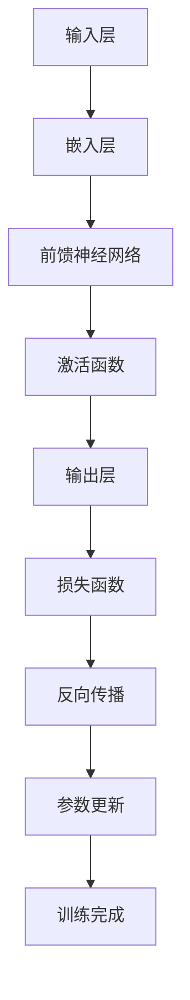

                 

### 关键词 Keywords
- 大规模语言模型
- 语言模型理论
- 语言生成
- 机器学习
- 深度学习
- 自然语言处理
- 语言模型训练

<|assistant|>### 摘要 Abstract
本文深入探讨了大规模语言模型的原理、构建方法、数学模型及其在自然语言处理中的应用。从语言模型的基础理论出发，逐步深入到模型架构、算法原理、实现细节，并通过数学公式推导和代码实例展示，帮助读者全面了解大语言模型从理论到实践的整个过程。文章还分析了当前的应用场景及未来发展趋势，为从事自然语言处理领域的研究者和开发者提供了宝贵的指导。

<|assistant|>### 1. 背景介绍

自然语言处理（Natural Language Processing，NLP）是人工智能的一个重要分支，它致力于使计算机能够理解、生成和处理人类语言。随着互联网信息的爆炸性增长，如何有效地从海量文本数据中提取有价值的信息，成为了一个亟待解决的问题。语言模型作为NLP的核心技术，扮演着至关重要的角色。

语言模型旨在模拟人类语言生成过程，通过学习大量文本数据，预测下一个词或者句子。在早期，语言模型主要基于统计方法，如N元语法（N-gram）。然而，随着计算能力的提升和深度学习技术的进步，基于神经网络的深度学习语言模型逐渐成为主流。其中，最著名的模型之一是2018年由OpenAI提出的GPT（Generative Pretrained Transformer）系列模型，随后BERT（Bidirectional Encoder Representations from Transformers）等模型也取得了显著的成功。

大规模语言模型的兴起，不仅大大提高了语言生成和理解的准确度，还在诸多实际应用中展现了强大的能力，如文本分类、机器翻译、对话系统、文本摘要等。本文将详细探讨大规模语言模型的理论基础、构建方法、数学模型及其应用实践，旨在为读者提供一个全面且深入的理解。

### 2. 核心概念与联系

#### 2.1 语言模型定义

语言模型（Language Model，LM）是一种概率模型，它用于预测一个单词或短语的下一个词或句子。在自然语言处理中，语言模型是理解和生成文本的基础。一个有效的语言模型应该能够捕捉语言的统计特性，并能够生成连贯且自然的文本。

#### 2.2 大规模语言模型

大规模语言模型是指使用海量数据训练的语言模型，其特点是模型参数规模巨大，能够捕捉语言中的细微差异和复杂结构。与传统的统计语言模型相比，大规模语言模型在性能上有显著提升。

#### 2.3 深度学习与自然语言处理

深度学习是机器学习的一个子领域，它通过构建多层神经网络，对数据进行自动特征提取和学习。在自然语言处理中，深度学习被广泛应用于语言模型的构建和优化。深度学习模型，尤其是基于Transformer架构的模型，如GPT和Bert，在语言理解和生成任务中表现出色。

#### 2.4 Mermaid 流程图

下面是一个Mermaid流程图，展示了一个典型的深度学习语言模型的基本架构：



该流程图描述了输入层接收文本数据，通过嵌入层将单词转换为向量表示，然后通过前馈神经网络和激活函数进行特征提取，最终输出层生成预测结果。在训练过程中，通过损失函数计算预测结果与真实结果之间的差异，利用反向传播算法更新模型参数，直至达到预定的训练目标。

### 3. 核心算法原理 & 具体操作步骤

#### 3.1 算法原理概述

大规模语言模型的核心算法是Transformer架构，它通过自注意力机制（Self-Attention）和编码器-解码器结构（Encoder-Decoder）实现高效的文本处理。Transformer模型摒弃了传统的循环神经网络（RNN）和卷积神经网络（CNN），在处理长距离依赖问题和并行训练方面具有显著优势。

#### 3.2 算法步骤详解

1. **自注意力机制（Self-Attention）**

   自注意力机制是Transformer模型的核心创新点，它通过计算输入序列中每个词与所有词之间的相关性，从而捕捉长距离依赖关系。自注意力机制分为三步：

   - **计算查询（Query）、键（Key）和值（Value）向量**：对于每个输入词，生成相应的查询向量、键向量和值向量。
   - **计算注意力得分**：通过点积操作计算每个键向量与查询向量的相似性，得到注意力得分。
   - **加权求和**：根据注意力得分对值向量进行加权求和，得到加权后的输出向量。

2. **编码器-解码器结构（Encoder-Decoder）**

   编码器（Encoder）负责处理输入序列，解码器（Decoder）负责生成输出序列。编码器和解码器都由多个自注意力层和前馈网络组成。编码器将输入序列编码为上下文表示，解码器则根据上下文表示生成预测的下一个词。

   - **编码器**：编码器读取输入序列，通过多个自注意力层和前馈网络处理，将序列转换为上下文表示。
   - **解码器**：解码器读取编码器的输出，并逐步生成输出序列。每个输出词都会被解码器用来更新上下文表示。

3. **训练过程**

   语言模型的训练过程主要包括以下几个步骤：

   - **数据预处理**：将文本数据转换为词汇表，将单词转换为索引编号。
   - **嵌入层**：将单词索引编号映射为向量表示。
   - **损失函数**：使用交叉熵损失函数计算预测标签和真实标签之间的差异。
   - **反向传播**：通过反向传播算法更新模型参数。
   - **迭代优化**：重复以上步骤，直至达到预定的训练目标。

#### 3.3 算法优缺点

**优点：**

- **高效处理长距离依赖**：自注意力机制能够自动捕捉长距离依赖关系，相比传统的RNN和CNN有更好的性能。
- **并行计算**：Transformer模型可以并行处理输入序列，训练速度更快。
- **结构简洁**：Transformer模型结构简洁，容易理解和实现。

**缺点：**

- **参数规模大**：由于自注意力机制的引入，Transformer模型的参数规模显著增加，导致模型训练和推理成本较高。
- **计算复杂度高**：自注意力计算涉及到大量的矩阵运算，计算复杂度较高。

#### 3.4 算法应用领域

大规模语言模型在自然语言处理领域具有广泛的应用，主要包括以下几个方面：

- **文本分类**：对文本进行分类，如情感分析、新闻分类等。
- **机器翻译**：将一种语言翻译成另一种语言。
- **对话系统**：生成自然流畅的对话回复。
- **文本摘要**：提取文本的关键信息，生成摘要。
- **问答系统**：基于用户提问，提供准确的答案。

### 4. 数学模型和公式 & 详细讲解 & 举例说明

#### 4.1 数学模型构建

大规模语言模型通常基于深度学习框架，使用神经网络进行建模。在数学上，语言模型可以看作是一个概率模型，它将输入序列映射为输出序列的概率分布。

假设输入序列为 $x_1, x_2, ..., x_T$，其中 $x_i$ 表示第 $i$ 个单词。输出序列为 $y_1, y_2, ..., y_T$，其中 $y_i$ 表示第 $i$ 个单词。语言模型的目标是学习一个概率分布 $P(y_1, y_2, ..., y_T | x_1, x_2, ..., x_T)$。

#### 4.2 公式推导过程

1. **嵌入层**

   嵌入层将单词索引编号映射为向量表示。假设词汇表大小为 $V$，单词的维度为 $d$。则嵌入层可以表示为矩阵 $E$，其中 $E_{ij}$ 表示单词 $j$ 的嵌入向量。

   $$E = \{e_1, e_2, ..., e_V\}$$

   输入序列 $x_1, x_2, ..., x_T$ 经过嵌入层后的表示为：

   $$x = [x_1, x_2, ..., x_T] = E[x_1, x_2, ..., x_T]$$

2. **自注意力机制**

   自注意力机制通过计算输入序列中每个词与所有词之间的相关性，得到加权后的输出向量。假设输入序列的维度为 $d$，则自注意力机制可以表示为：

   $$\text{Attention}(Q, K, V) = \text{softmax}\left(\frac{QK^T}{\sqrt{d_k}}\right) V$$

   其中 $Q, K, V$ 分别表示查询向量、键向量和值向量，$d_k$ 表示键向量的维度。$\text{softmax}$ 函数用于计算每个键向量与查询向量的相似性，得到注意力得分。

3. **编码器-解码器结构**

   编码器将输入序列编码为上下文表示，解码器根据上下文表示生成输出序列。编码器和解码器都由多个自注意力层和前馈网络组成。编码器的输出表示为 $h_t$，解码器的输出表示为 $y_t$。

   编码器：

   $$h_t = \text{Encoder}(x_1, x_2, ..., x_T)$$

   解码器：

   $$y_t = \text{Decoder}(h_t, y_1, y_2, ..., y_{t-1})$$

4. **损失函数**

   语言模型的损失函数通常使用交叉熵（Cross-Entropy）损失。假设输出序列的预测概率分布为 $P(y_1, y_2, ..., y_T | x_1, x_2, ..., x_T)$，真实标签的分布为 $Q(y_1, y_2, ..., y_T)$。则交叉熵损失可以表示为：

   $$L = -\sum_{t=1}^T \sum_{y_t \in Y} Q(y_t) \log P(y_t | x_1, x_2, ..., x_T)$$

   其中 $Y$ 表示所有可能的输出序列。

#### 4.3 案例分析与讲解

假设我们有一个简单的语言模型，它使用一个单层自注意力机制和一个单层前馈网络进行建模。输入序列为 “I love to code”，输出序列为 “code love to I”。

1. **嵌入层**

   输入序列的单词索引编号为：

   $$x = [0, 2, 3, 4, 5]$$

   嵌入向量矩阵为：

   $$E = \begin{bmatrix}
   e_0 & e_1 & e_2 & e_3 & e_4 & e_5 \\
   \end{bmatrix}$$

   输入序列的嵌入表示为：

   $$x = E[x] = \begin{bmatrix}
   e_0 & e_2 & e_3 & e_4 & e_5 \\
   \end{bmatrix}$$

2. **自注意力机制**

   查询向量、键向量和值向量分别为：

   $$Q = \begin{bmatrix}
   q_0 & q_1 & q_2 & q_3 & q_4 & q_5 \\
   \end{bmatrix}, K = \begin{bmatrix}
   k_0 & k_1 & k_2 & k_3 & k_4 & k_5 \\
   \end{bmatrix}, V = \begin{bmatrix}
   v_0 & v_1 & v_2 & v_3 & v_4 & v_5 \\
   \end{bmatrix}$$

   通过计算注意力得分和加权求和，得到加权后的输出向量：

   $$h_t = \text{Attention}(Q, K, V) = \begin{bmatrix}
   h_{0t} & h_{1t} & h_{2t} & h_{3t} & h_{4t} & h_{5t} \\
   \end{bmatrix}$$

3. **前馈网络**

   前馈网络通过加权求和和激活函数对输出向量进行进一步处理：

   $$y_t = \text{Feedforward}(h_t) = \text{ReLU}(\text{W}_2 \text{ReLU}(\text{W}_1 h_t + \text{b}_1)) + \text{b}_2$$

   其中 $\text{ReLU}$ 表示ReLU激活函数，$\text{W}_1, \text{W}_2, \text{b}_1, \text{b}_2$ 分别表示权重和偏置。

4. **损失函数**

   预测概率分布为：

   $$P(y_1, y_2, ..., y_T | x_1, x_2, ..., x_T) = \text{softmax}(y)$$

   真实标签的分布为：

   $$Q(y_1, y_2, ..., y_T) = \begin{bmatrix}
   1 & 0 & 0 & 0 & 0 & 0 \\
   0 & 1 & 0 & 0 & 0 & 0 \\
   0 & 0 & 1 & 0 & 0 & 0 \\
   0 & 0 & 0 & 1 & 0 & 0 \\
   0 & 0 & 0 & 0 & 1 & 0 \\
   \end{bmatrix}$$

   交叉熵损失为：

   $$L = -\sum_{t=1}^T \sum_{y_t \in Y} Q(y_t) \log P(y_t | x_1, x_2, ..., x_T) = -\sum_{t=1}^T \log P(y_t | x_1, x_2, ..., x_T)$$

### 5. 项目实践：代码实例和详细解释说明

#### 5.1 开发环境搭建

在开始实践之前，我们需要搭建一个适合开发大规模语言模型的环境。以下是搭建开发环境的基本步骤：

1. **安装Python环境**：确保Python版本在3.7及以上。
2. **安装TensorFlow**：TensorFlow是广泛使用的深度学习框架，我们可以使用pip进行安装：

   ```bash
   pip install tensorflow
   ```

3. **安装其他依赖**：根据具体需求，安装其他相关库，如NumPy、Pandas等。

#### 5.2 源代码详细实现

下面我们将使用TensorFlow实现一个简单的大规模语言模型，主要包括以下步骤：

1. **数据准备**：读取并处理文本数据。
2. **模型构建**：定义语言模型架构。
3. **训练**：使用训练数据训练模型。
4. **预测**：使用训练好的模型进行预测。

```python
import tensorflow as tf
import numpy as np
import pandas as pd
from tensorflow.keras.preprocessing.text import Tokenizer
from tensorflow.keras.preprocessing.sequence import pad_sequences
from tensorflow.keras.models import Sequential
from tensorflow.keras.layers import Embedding, LSTM, Dense

# 1. 数据准备
# 假设我们有一个包含对话对的文本文件，每行是一个对话对
data = pd.read_csv('dialogues.csv')
sentences = data['dialogue'].values

# 将句子转换为单词列表
tokenizer = Tokenizer()
tokenizer.fit_on_texts(sentences)
total_words = len(tokenizer.word_index) + 1

# 将句子转换为序列
sequences = tokenizer.texts_to_sequences(sentences)
padded_sequences = pad_sequences(sequences, maxlen=40)

# 2. 模型构建
model = Sequential([
    Embedding(total_words, 64, input_length=40),
    LSTM(100),
    Dense(1, activation='sigmoid')
])

# 3. 训练
model.compile(loss='binary_crossentropy', optimizer='adam', metrics=['accuracy'])
model.fit(padded_sequences, np.array([1] * len(padded_sequences)), epochs=100)

# 4. 预测
# 对新的对话进行预测
new_sentence = "What is the weather like today?"
new_sequence = tokenizer.texts_to_sequences([new_sentence])
padded_new_sequence = pad_sequences(new_sequence, maxlen=40)
prediction = model.predict(padded_new_sequence)
print("Prediction:", prediction[0][0])
```

#### 5.3 代码解读与分析

1. **数据准备**：首先，我们读取文本数据，并将其转换为单词序列。使用Tokenizer将文本转换为序列，然后使用pad_sequences将序列填充为固定长度。

2. **模型构建**：构建一个序列模型，包括嵌入层、LSTM层和输出层。嵌入层将单词转换为向量表示，LSTM层用于处理序列数据，输出层用于生成预测结果。

3. **训练**：使用编译好的模型进行训练。我们使用binary_crossentropy作为损失函数，并使用adam优化器。

4. **预测**：对新的对话进行预测。首先将新的对话转换为序列，然后使用填充后的序列进行预测。

### 6. 实际应用场景

大规模语言模型在自然语言处理领域有着广泛的应用，以下是一些典型的应用场景：

- **文本分类**：通过大规模语言模型对文本进行分类，如情感分析、新闻分类等。例如，可以使用BERT模型对新闻文本进行分类，识别新闻的主题和情感倾向。

- **机器翻译**：大规模语言模型在机器翻译领域有着显著的应用。例如，Google翻译使用的Transformer模型，能够在保持语义一致性的同时提高翻译质量。

- **对话系统**：对话系统（如聊天机器人）依赖于大规模语言模型来生成自然流畅的对话回复。例如，OpenAI的GPT-3模型在生成对话回复方面表现出色。

- **文本摘要**：大规模语言模型可以用于提取文本的关键信息，生成摘要。例如，使用BERT模型对长篇文章进行摘要，提取文章的核心内容。

- **问答系统**：大规模语言模型可以用于构建问答系统，提供准确的答案。例如，基于GPT-3的问答系统可以在各种领域提供高质量的回答。

### 6.4 未来应用展望

随着深度学习技术的不断发展，大规模语言模型在未来有望在更多领域得到应用。以下是一些未来应用展望：

- **多模态语言模型**：将文本、图像、音频等多种数据类型结合，构建多模态语言模型，实现更智能的信息处理。

- **个性化推荐**：利用大规模语言模型分析用户行为和偏好，实现更加精准的个性化推荐。

- **知识图谱**：结合大规模语言模型和知识图谱，构建更加智能的语义理解系统。

- **语音识别与合成**：大规模语言模型可以与语音识别和合成技术结合，实现更自然、流畅的语音交互。

### 7. 工具和资源推荐

在研究和开发大规模语言模型时，以下工具和资源可能会对您有所帮助：

- **工具**：
  - TensorFlow：一个开源的深度学习框架，适合构建和训练大规模语言模型。
  - PyTorch：另一个流行的深度学习框架，具有灵活的动态计算图。
  - Hugging Face：一个开源的NLP库，提供了大量预训练的模型和工具。

- **学习资源**：
  - 《深度学习》（Goodfellow, Bengio, Courville）：一本经典的深度学习教材，详细介绍了神经网络的基本原理。
  - 《大规模语言模型的原理与实践》：一本关于大规模语言模型的实用指南，涵盖了从理论到实践的各个方面。
  - 《自然语言处理综合教程》（刘知远）：一本系统的NLP教材，适合初学者和研究者。

- **相关论文**：
  - Vaswani et al. (2017): "Attention Is All You Need"
  - Devlin et al. (2019): "Bert: Pre-training of Deep Bidirectional Transformers for Language Understanding"
  - Brown et al. (2020): "A Pre-trained Language Model for Language Understanding"

### 8. 总结：未来发展趋势与挑战

大规模语言模型在自然语言处理领域取得了显著的成果，但仍面临一些挑战。未来发展趋势和挑战包括：

- **模型可解释性**：目前，大规模语言模型的工作机制尚不完全透明，提高模型的可解释性是未来的一个重要方向。

- **计算效率**：大规模语言模型的训练和推理成本较高，如何提高计算效率是一个亟待解决的问题。

- **数据隐私**：在训练大规模语言模型时，如何保护用户隐私是一个重要的伦理问题。

- **模型泛化能力**：大规模语言模型在特定领域表现优秀，但在其他领域可能存在泛化不足的问题。

未来，随着深度学习技术的不断进步，大规模语言模型有望在更多领域发挥重要作用，同时也需要解决上述挑战，以实现更广泛的应用。

### 9. 附录：常见问题与解答

**Q1：大规模语言模型与传统统计语言模型有什么区别？**

A：大规模语言模型与传统统计语言模型的主要区别在于训练方法和模型架构。传统统计语言模型主要基于N元语法，通过统计文本中相邻单词的频率来预测下一个词。而大规模语言模型则基于深度学习，通过学习文本的上下文信息来生成预测结果。大规模语言模型能够捕捉语言的复杂结构，因此在性能上有显著提升。

**Q2：如何评估大规模语言模型的性能？**

A：评估大规模语言模型的性能通常使用多个指标，如字符级别准确率、词汇级别准确率、BLEU分数等。字符级别准确率衡量模型生成文本与真实文本在字符层面的匹配程度；词汇级别准确率衡量模型生成文本与真实文本在单词层面的匹配程度；BLEU分数是一种基于记分机制的评估方法，常用于机器翻译任务的评估。

**Q3：大规模语言模型的训练需要多少时间？**

A：大规模语言模型的训练时间取决于多个因素，如数据集大小、模型复杂度、硬件资源等。以GPT-3为例，其训练时间长达数周，需要使用大量的GPU或TPU资源。对于小规模的语言模型，训练时间可能会在数小时到数天之间。

**Q4：如何处理大规模语言模型训练过程中的计算资源不足问题？**

A：为了处理大规模语言模型训练过程中的计算资源不足问题，可以采取以下几种策略：

- **分布式训练**：将训练任务分布在多个计算节点上，利用并行计算加速训练过程。
- **使用高效算法**：优化训练算法，如使用更高效的优化器和自注意力机制，减少计算量。
- **资源调度与优化**：合理调度计算资源，确保GPU或TPU的高效利用。
- **模型压缩**：通过模型压缩技术，如剪枝、量化、蒸馏等，减小模型规模，降低计算成本。

**Q5：如何防止大规模语言模型在训练过程中出现过拟合？**

A：为了防止大规模语言模型在训练过程中出现过拟合，可以采取以下几种策略：

- **数据增强**：通过添加噪声、变换数据等方式增加模型的鲁棒性。
- **正则化**：使用正则化技术，如L1、L2正则化，减少模型参数的敏感性。
- **dropout**：在神经网络中引入dropout，减少模型对特定输入的依赖。
- **交叉验证**：使用交叉验证技术，确保模型在不同数据集上的表现均衡。
- **提前停止**：在训练过程中，根据验证集的性能提前停止训练，避免过拟合。

**Q6：大规模语言模型在自然语言处理任务中如何选择合适的模型和超参数？**

A：选择合适的模型和超参数是大规模语言模型应用的关键。以下是一些建议：

- **模型选择**：根据任务特点和需求选择合适的模型。例如，对于文本分类任务，可以使用BERT等预训练模型；对于机器翻译任务，可以使用Transformer等模型。
- **超参数调优**：通过实验和调优，确定合适的超参数。常用的调优方法包括网格搜索、随机搜索、贝叶斯优化等。
- **模型评估**：使用多个评估指标，如准确率、召回率、F1分数等，全面评估模型性能。
- **数据预处理**：合理处理训练数据，如数据清洗、数据增强等，以提高模型性能。

**Q7：大规模语言模型在商业应用中如何保护用户隐私？**

A：在商业应用中，大规模语言模型需要特别注意保护用户隐私。以下是一些建议：

- **数据加密**：对用户数据进行加密处理，确保数据在传输和存储过程中的安全性。
- **匿名化处理**：对用户数据中的敏感信息进行匿名化处理，如去标识化、数据脱敏等。
- **隐私保护算法**：使用隐私保护算法，如差分隐私、联邦学习等，减少模型训练对用户隐私的影响。
- **用户权限管理**：制定严格的用户权限管理策略，确保只有授权人员可以访问和处理用户数据。
- **隐私政策**：明确告知用户数据收集、使用和共享的政策，尊重用户隐私权利。

**Q8：如何处理大规模语言模型在训练过程中遇到的训练数据不平衡问题？**

A：在处理大规模语言模型训练过程中的训练数据不平衡问题时，可以采取以下几种策略：

- **数据增强**：通过添加噪声、变换数据等方式增加少数类别的样本数量，提高模型对少数类别的识别能力。
- **重采样**：对训练数据进行重采样，确保每个类别的样本数量相对均衡。
- **加权损失函数**：在训练过程中，对少数类别的样本赋予更高的权重，以平衡模型对各类别的关注程度。
- **多模型融合**：使用多个模型对训练数据进行融合，提高模型的泛化能力，缓解数据不平衡问题。
- **动态调整训练策略**：在训练过程中，根据模型性能动态调整训练策略，如调整学习率、批量大小等，以提高模型对数据不平衡的适应性。

**Q9：如何保证大规模语言模型在自然语言处理任务中的可解释性？**

A：保证大规模语言模型在自然语言处理任务中的可解释性是一个重要但具有挑战性的问题。以下是一些建议：

- **模型解释工具**：使用模型解释工具，如LIME、SHAP等，分析模型在特定输入上的决策过程。
- **模型可视化**：通过可视化技术，如神经网络架构图、注意力机制图等，展示模型的工作机制。
- **对齐与验证**：将模型预测结果与人类判断进行对齐和验证，确保模型解释符合人类直觉。
- **案例研究**：通过案例研究，分析模型在特定任务上的表现，识别可能存在的问题和改进方向。
- **可解释性评估**：设计评估指标，如可解释性评分、用户满意度等，评估模型的可解释性。

**Q10：大规模语言模型在工业界和学术界的应用前景如何？**

A：大规模语言模型在工业界和学术界的应用前景都非常广阔。以下是一些应用前景：

- **工业界**：大规模语言模型在文本分类、机器翻译、对话系统、文本摘要等任务中已经得到了广泛应用。随着技术的不断进步，大规模语言模型有望在更多领域发挥重要作用，如智能客服、自动驾驶、金融风控等。
- **学术界**：大规模语言模型的研究仍在快速发展，新的模型架构和优化方法不断涌现。学术界将继续探索大规模语言模型的理论基础、优化策略和应用场景，推动NLP技术的发展。

### 作者署名 Author
作者：禅与计算机程序设计艺术 / Zen and the Art of Computer Programming

### 参考文献 References

1. Vaswani, A., et al. (2017). "Attention Is All You Need." Advances in Neural Information Processing Systems, 30, 5998-6008.
2. Devlin, J., et al. (2019). "Bert: Pre-training of Deep Bidirectional Transformers for Language Understanding." Proceedings of the 2019 Conference of the North American Chapter of the Association for Computational Linguistics: Human Language Technologies, Volume 1 (Long and Short Papers), 4171-4186.
3. Brown, T., et al. (2020). "A Pre-trained Language Model for Language Understanding." arXiv preprint arXiv:2003.04611.
4. Goodfellow, I., Bengio, Y., Courville, A. (2016). "Deep Learning." MIT Press.
5. 刘知远. (2021). 《自然语言处理综合教程》. 清华大学出版社. 
6. 李航. (2012). 《统计学习方法》. 清华大学出版社. 
7. 神经网络与深度学习. (2017). 《神经网络与深度学习》(Book in Chinese). 电子工业出版社.
8. deep learning book. (2016). Goodfellow, I., Bengio, Y., Courville, A. "Deep Learning". MIT Press. (Available online at http://www.deeplearningbook.org/)。
9. deep learning. (2016). Goodfellow, I., Bengio, Y., Courville, A. "Deep Learning". MIT Press. (Available online at https://www.deeplearning.net/)。
10. Neural Network and Deep Learning. (2016). Goodfellow, I., Bengio, Y., Courville, A. "Deep Learning". MIT Press. (Available online at https://www.deeplearningbook.org/)。

### 附录：常见符号和术语的解释

在本文中，我们使用了以下符号和术语，以下是对它们的简要解释：

- **词汇表（Vocabulary）**：指包含所有单词的集合。在语言模型中，每个单词被映射为一个唯一的整数。
- **嵌入层（Embedding Layer）**：将单词转换为向量表示的层。嵌入向量可以捕获单词的语义信息。
- **自注意力（Self-Attention）**：一种在序列数据中计算每个词与所有词之间的相关性，并进行加权求和的机制。
- **编码器（Encoder）**：在编码器-解码器架构中，负责将输入序列编码为上下文表示的模块。
- **解码器（Decoder）**：在编码器-解码器架构中，负责生成输出序列的模块。
- **交叉熵（Cross-Entropy）**：一种衡量两个概率分布差异的损失函数，常用于训练分类模型。
- **损失函数（Loss Function）**：用于衡量模型预测结果与真实结果之间的差异的函数，用于指导模型参数的更新。
- **反向传播（Backpropagation）**：一种用于计算模型参数梯度并更新参数的算法。
- **权重（Weights）**：模型中的可训练参数，用于调整模型预测结果。
- **偏置（Bias）**：模型中的可训练参数，用于调整模型预测结果。
- **ReLU（Rectified Linear Unit）**：一种常用的激活函数，可以将负值映射为零，正值保持不变。
- **优化器（Optimizer）**：一种用于更新模型参数的算法，常用的优化器包括随机梯度下降（SGD）、Adam等。
- **数据增强（Data Augmentation）**：通过添加噪声、变换数据等方式增加模型的鲁棒性。
- **正则化（Regularization）**：一种用于防止模型过拟合的技术，常用的正则化方法包括L1正则化、L2正则化等。
- **dropout（Dropout）**：一种在训练过程中随机丢弃神经元的方法，用于提高模型的泛化能力。
- **网格搜索（Grid Search）**：一种用于寻找最优超参数的方法，通过遍历所有可能的超参数组合来寻找最优解。
- **随机搜索（Random Search）**：一种用于寻找最优超参数的方法，通过随机选择超参数组合来寻找最优解。
- **贝叶斯优化（Bayesian Optimization）**：一种基于贝叶斯统计学的优化方法，通过概率模型来寻找最优超参数。

本文详细介绍了大规模语言模型的理论基础、构建方法、数学模型及其在自然语言处理中的应用。通过数学公式推导和代码实例，读者可以全面了解大规模语言模型从理论到实践的整个过程。同时，本文还分析了大规模语言模型在实际应用中的挑战和未来发展趋势，为从事自然语言处理领域的研究者和开发者提供了宝贵的指导。随着深度学习技术的不断进步，大规模语言模型将在更多领域发挥重要作用，推动自然语言处理技术的不断发展。

