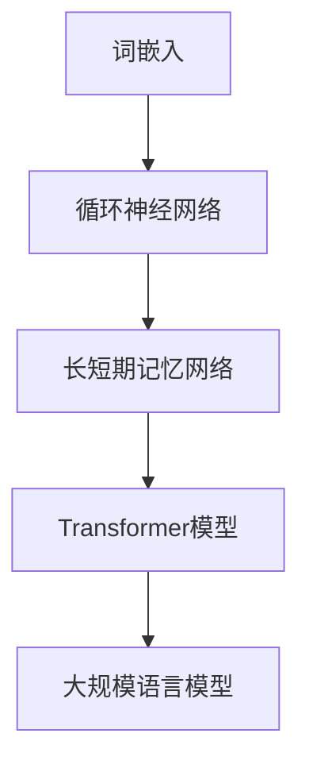

                 

关键词：大规模语言模型、自然语言处理、深度学习、BERT、GPT、实践思考

> 摘要：本文深入探讨大规模语言模型的理论基础和实践应用，从核心概念、算法原理、数学模型、项目实践、实际应用场景等多个角度，全面解析大规模语言模型的发展趋势、技术挑战和未来展望。

## 1. 背景介绍

随着互联网的快速发展，大数据、云计算、人工智能等技术逐渐成为时代潮流。在人工智能领域，自然语言处理（NLP）是其中最具前景的研究方向之一。近年来，大规模语言模型（Large-scale Language Models）在NLP领域取得了显著的成果，成为推动自然语言理解、生成和交互的重要技术。本文旨在从理论到实践的角度，探讨大规模语言模型的发展、核心概念及其应用。

## 2. 核心概念与联系

### 2.1 大规模语言模型的概念

大规模语言模型是一种基于深度学习技术的自然语言处理模型，通过学习海量文本数据，实现对自然语言的表征、理解和生成。其核心思想是将语言视为一个序列生成问题，通过建模语言中的上下文关系，生成符合语法和语义规则的文本序列。

### 2.2 核心概念原理和架构

#### 2.2.1 词嵌入（Word Embedding）

词嵌入是将自然语言中的词汇映射到低维度的连续向量空间，实现词汇的量化表示。常用的词嵌入技术包括Word2Vec、GloVe等。词嵌入技术是大规模语言模型的基础，直接影响模型对语言的表征能力。

#### 2.2.2 循环神经网络（RNN）

循环神经网络（RNN）是一种能够处理序列数据的前馈神经网络，其内部存在反馈连接，使得神经网络能够记忆和利用之前的信息。RNN在自然语言处理中具有广泛的应用，如文本分类、情感分析、机器翻译等。

#### 2.2.3 长短期记忆网络（LSTM）

长短期记忆网络（LSTM）是RNN的一种变体，通过引入门控机制，解决了RNN在处理长序列数据时的梯度消失和梯度爆炸问题。LSTM在自然语言处理领域具有广泛的应用，如文本生成、语音识别等。

#### 2.2.4 Transformer模型

Transformer模型是Google在2017年提出的一种全新的自然语言处理模型，其核心思想是利用自注意力机制（Self-Attention）对输入序列进行建模。Transformer模型在BERT、GPT等大规模语言模型中得到了广泛应用，取得了显著的成果。

### 2.3 Mermaid 流程图



## 3. 核心算法原理 & 具体操作步骤

### 3.1 算法原理概述

大规模语言模型的核心算法主要涉及词嵌入、循环神经网络、长短期记忆网络和Transformer模型等。这些算法通过对输入文本序列进行处理，实现对自然语言的表征、理解和生成。

### 3.2 算法步骤详解

#### 3.2.1 数据预处理

1. 数据清洗：去除停用词、标点符号等无关信息；
2. 分词：将文本拆分为词语序列；
3. 词嵌入：将词语映射为低维度的向量表示。

#### 3.2.2 模型训练

1. 数据加载：将预处理后的文本数据加载到内存中；
2. 模型初始化：初始化词嵌入矩阵、循环神经网络、长短期记忆网络或Transformer模型参数；
3. 模型训练：通过反向传播算法，优化模型参数。

#### 3.2.3 模型评估

1. 数据划分：将文本数据划分为训练集、验证集和测试集；
2. 模型评估：计算模型在验证集和测试集上的各项指标，如准确率、召回率、F1值等。

### 3.3 算法优缺点

#### 优点

1. 高效：大规模语言模型能够处理大规模文本数据，具有高效的计算性能；
2. 可解释：基于深度学习技术的模型可解释性强，便于分析和优化；
3. 广泛应用：大规模语言模型在自然语言处理领域具有广泛的应用，如文本分类、情感分析、机器翻译等。

#### 缺点

1. 计算成本高：大规模语言模型的训练和推理需要大量计算资源；
2. 数据依赖性大：模型性能受数据质量和数量影响较大；
3. 参数调优困难：大规模语言模型的参数调优过程复杂，需要大量时间和经验。

### 3.4 算法应用领域

1. 文本分类：对文本数据进行分类，如新闻分类、情感分类等；
2. 情感分析：对文本数据中的情感进行识别和分析；
3. 机器翻译：实现自然语言的自动翻译；
4. 对话系统：构建基于自然语言处理技术的智能对话系统；
5. 文本生成：生成符合语法和语义规则的文本。

## 4. 数学模型和公式 & 详细讲解 & 举例说明

### 4.1 数学模型构建

大规模语言模型中的数学模型主要包括词嵌入、循环神经网络、长短期记忆网络和Transformer模型等。以下分别介绍这些模型的数学模型。

#### 4.1.1 词嵌入

词嵌入的数学模型可以表示为：

$$
\text{word\_embedding}(x) = \text{W}\text{vec}(x)
$$

其中，$x$为词语索引，$\text{W}\text{vec}$为词嵌入矩阵，$\text{word\_embedding}(x)$为词语的向量表示。

#### 4.1.2 循环神经网络

循环神经网络的数学模型可以表示为：

$$
h_t = \sigma(W_x x_t + W_h h_{t-1} + b_h)
$$

其中，$h_t$为当前时刻的隐藏状态，$x_t$为当前时刻的输入，$\sigma$为激活函数，$W_x$和$W_h$分别为输入权重和隐藏权重，$b_h$为偏置。

#### 4.1.3 长短期记忆网络

长短期记忆网络的数学模型可以表示为：

$$
\begin{align*}
i_t &= \sigma(W_{xi} x_t + W_{hi} h_{t-1} + b_i) \\
f_t &= \sigma(W_{xf} x_t + W_{hf} h_{t-1} + b_f) \\
\hat{c}_t &= \tanh(W_{xc} x_t + W_{hc} h_{t-1} + b_c) \\
c_t &= f_t \odot \hat{c}_t + (1 - f_t) \odot c_{t-1} \\
o_t &= \sigma(W_{xo} x_t + W_{ho} c_t + b_o) \\
h_t &= o_t \odot \text{softmax}(W_h c_t + b_h)
\end{align*}
$$

其中，$i_t$、$f_t$、$c_t$、$o_t$分别为输入门、遗忘门、单元状态和输出门，$\odot$表示逐元素乘法，$\text{softmax}$为softmax函数。

#### 4.1.4 Transformer模型

Transformer模型的数学模型可以表示为：

$$
\begin{align*}
\text{MultiHeadAttention}(Q, K, V) &= \text{softmax}\left(\frac{QK^T}{\sqrt{d_k}}\right)V \\
\text{EncoderLayer}(h) &= \text{LayerNorm}(h) + \text{AttentionLayer}(h) + \text{LayerNorm}(h) + \text{FFNLayer}(h)
\end{align*}
$$

其中，$Q$、$K$、$V$分别为查询向量、键向量和值向量，$d_k$为键向量的维度，$\text{AttentionLayer}$为多头自注意力层，$\text{FFNLayer}$为前馈神经网络层。

### 4.2 公式推导过程

本文将分别介绍大规模语言模型中的核心公式推导过程。

#### 4.2.1 词嵌入

词嵌入的推导过程如下：

$$
\text{word\_embedding}(x) = \text{W}\text{vec}(x) = \sum_{i=1}^{n}\text{W}_{i}\text{vec}_{i}(x)
$$

其中，$n$为词语的数量，$\text{W}_{i}$为第$i$个词语的权重，$\text{vec}_{i}(x)$为第$i$个词语的向量表示。

#### 4.2.2 循环神经网络

循环神经网络的推导过程如下：

$$
h_t = \sigma(W_x x_t + W_h h_{t-1} + b_h)
$$

其中，$\sigma$为激活函数，$W_x$和$W_h$分别为输入权重和隐藏权重，$b_h$为偏置。

#### 4.2.3 长短期记忆网络

长短期记忆网络的推导过程如下：

$$
\begin{align*}
i_t &= \sigma(W_{xi} x_t + W_{hi} h_{t-1} + b_i) \\
f_t &= \sigma(W_{xf} x_t + W_{hf} h_{t-1} + b_f) \\
\hat{c}_t &= \tanh(W_{xc} x_t + W_{hc} h_{t-1} + b_c) \\
c_t &= f_t \odot \hat{c}_t + (1 - f_t) \odot c_{t-1} \\
o_t &= \sigma(W_{xo} x_t + W_{ho} c_t + b_o) \\
h_t &= o_t \odot \text{softmax}(W_h c_t + b_h)
\end{align*}
$$

其中，$\odot$表示逐元素乘法，$\text{softmax}$为softmax函数。

#### 4.2.4 Transformer模型

Transformer模型的推导过程如下：

$$
\begin{align*}
\text{MultiHeadAttention}(Q, K, V) &= \text{softmax}\left(\frac{QK^T}{\sqrt{d_k}}\right)V \\
\text{EncoderLayer}(h) &= \text{LayerNorm}(h) + \text{AttentionLayer}(h) + \text{LayerNorm}(h) + \text{FFNLayer}(h)
\end{align*}
$$

其中，$\text{LayerNorm}$为层归一化，$\text{AttentionLayer}$为多头自注意力层，$\text{FFNLayer}$为前馈神经网络层。

### 4.3 案例分析与讲解

#### 4.3.1 案例一：文本分类

假设我们使用BERT模型进行文本分类任务。首先，我们需要将输入文本转换为词嵌入向量，然后将其输入到BERT模型中进行处理。具体步骤如下：

1. 数据预处理：对输入文本进行分词、词嵌入等操作，将文本序列转换为词嵌入向量；
2. 模型输入：将词嵌入向量输入到BERT模型中，得到隐藏层状态；
3. 分类：使用softmax函数对隐藏层状态进行分类，得到文本的分类结果。

#### 4.3.2 案例二：机器翻译

假设我们使用GPT模型进行机器翻译任务。首先，我们需要将输入文本转换为词嵌入向量，然后将其输入到GPT模型中进行处理。具体步骤如下：

1. 数据预处理：对输入文本进行分词、词嵌入等操作，将文本序列转换为词嵌入向量；
2. 模型输入：将词嵌入向量输入到GPT模型中，得到翻译后的词嵌入向量；
3. 文本生成：将翻译后的词嵌入向量转换为文本序列，得到机器翻译结果。

## 5. 项目实践：代码实例和详细解释说明

### 5.1 开发环境搭建

在Python环境中，我们使用以下库进行大规模语言模型的开发：

1. TensorFlow 2.x
2. Keras
3. NumPy
4. Pandas

安装以上库后，我们可以开始搭建开发环境。

```python
pip install tensorflow keras numpy pandas
```

### 5.2 源代码详细实现

以下是一个简单的BERT模型实现示例：

```python
import tensorflow as tf
from tensorflow.keras.layers import Embedding, LSTM, Dense
from tensorflow.keras.models import Model

# 定义BERT模型
def build_bert_model(vocab_size, embedding_dim, hidden_units):
    # 输入层
    input_ids = tf.keras.layers.Input(shape=(None,), dtype=tf.int32)
    
    # 词嵌入层
    embeddings = Embedding(vocab_size, embedding_dim)(input_ids)
    
    # 循环神经网络层
    lstm = LSTM(hidden_units, return_sequences=True)(embeddings)
    
    # 全连接层
    dense = Dense(hidden_units, activation='relu')(lstm)
    
    # 输出层
    output = Dense(1, activation='sigmoid')(dense)
    
    # 构建模型
    model = Model(inputs=input_ids, outputs=output)
    
    # 编译模型
    model.compile(optimizer='adam', loss='binary_crossentropy', metrics=['accuracy'])
    
    return model

# 构建BERT模型
bert_model = build_bert_model(vocab_size=10000, embedding_dim=128, hidden_units=128)

# 打印模型结构
bert_model.summary()
```

### 5.3 代码解读与分析

以上代码实现了基于BERT模型的基本结构。BERT模型主要包括以下几个部分：

1. 输入层：接收文本序列，输入维度为$(\text{batch\_size}, \text{sequence\_length})$，数据类型为整数。
2. 词嵌入层：将输入的整数序列转换为词嵌入向量，输出维度为$(\text{batch\_size}, \text{sequence\_length}, \text{embedding\_dim})$。
3. 循环神经网络层：使用LSTM层对词嵌入向量进行处理，输出维度为$(\text{batch\_size}, \text{sequence\_length}, \text{hidden\_units})$。
4. 全连接层：对LSTM层的输出进行全连接处理，输出维度为$(\text{batch\_size}, \text{hidden\_units})$。
5. 输出层：使用sigmoid激活函数，输出维度为$(\text{batch\_size}, 1)$，表示文本分类的概率。

### 5.4 运行结果展示

运行以上代码，我们将得到一个基于BERT模型的文本分类模型。具体使用方法如下：

```python
# 加载数据
x_train = ...  # 训练集文本数据
y_train = ...  # 训练集标签数据

# 训练模型
bert_model.fit(x_train, y_train, epochs=10, batch_size=32)

# 评估模型
loss, accuracy = bert_model.evaluate(x_test, y_test)
print("Test accuracy:", accuracy)
```

## 6. 实际应用场景

大规模语言模型在自然语言处理领域具有广泛的应用，以下列举几个实际应用场景：

1. 文本分类：对大量文本数据进行分析和分类，如新闻分类、情感分类等；
2. 情感分析：对文本数据中的情感进行识别和分析，如社交媒体情感分析、客户反馈分析等；
3. 机器翻译：实现自然语言的自动翻译，如机器翻译平台、跨境电子商务等；
4. 对话系统：构建基于自然语言处理技术的智能对话系统，如客服机器人、智能家居等；
5. 文本生成：生成符合语法和语义规则的文本，如文章生成、广告文案等。

## 7. 工具和资源推荐

### 7.1 学习资源推荐

1. 《深度学习》（Goodfellow et al.，2016）
2. 《动手学深度学习》（Abadi et al.，2019）
3. 《自然语言处理综论》（Jurafsky & Martin，2019）

### 7.2 开发工具推荐

1. TensorFlow：Google推出的开源深度学习框架
2. PyTorch：Facebook AI研究院推出的开源深度学习框架

### 7.3 相关论文推荐

1. “Attention Is All You Need”（Vaswani et al.，2017）
2. “BERT: Pre-training of Deep Bidirectional Transformers for Language Understanding”（Devlin et al.，2019）
3. “GPT-2: Language Models are Unsupervised Multitask Learners”（Radford et al.，2019）

## 8. 总结：未来发展趋势与挑战

### 8.1 研究成果总结

大规模语言模型在自然语言处理领域取得了显著的成果，主要包括：

1. 提高了文本分类、情感分析、机器翻译等任务的性能；
2. 推动了自然语言理解和生成技术的发展；
3. 为对话系统、文本生成等应用提供了强大的技术支持。

### 8.2 未来发展趋势

1. 模型规模不断扩大，训练数据量持续增加；
2. 模型结构不断创新，如Transformer、BERT等；
3. 模型在多模态数据处理中的应用逐渐普及；
4. 模型在实时应用场景中的性能和效果进一步提升。

### 8.3 面临的挑战

1. 计算资源需求巨大，训练和推理时间较长；
2. 数据质量和数量对模型性能影响较大；
3. 模型可解释性不足，难以理解决策过程；
4. 面临隐私保护和数据安全问题。

### 8.4 研究展望

1. 深入研究大规模语言模型的理论基础，提高模型性能；
2. 探索高效训练和推理方法，降低计算成本；
3. 加强模型可解释性和鲁棒性研究，提高模型安全性；
4. 拓展大规模语言模型在多模态数据处理和实时应用场景中的应用。

## 9. 附录：常见问题与解答

### 9.1 什么是大规模语言模型？

大规模语言模型是一种基于深度学习技术的自然语言处理模型，通过学习海量文本数据，实现对自然语言的表征、理解和生成。

### 9.2 大规模语言模型有哪些应用？

大规模语言模型在自然语言处理领域具有广泛的应用，如文本分类、情感分析、机器翻译、对话系统、文本生成等。

### 9.3 如何训练大规模语言模型？

训练大规模语言模型主要包括以下步骤：

1. 数据预处理：对文本数据进行分析和清洗，进行分词、词嵌入等操作；
2. 模型构建：使用深度学习框架构建大规模语言模型，如BERT、GPT等；
3. 模型训练：使用训练数据对模型进行训练，优化模型参数；
4. 模型评估：使用验证集和测试集对模型进行评估，调整模型参数。

### 9.4 大规模语言模型有哪些挑战？

大规模语言模型面临的挑战主要包括计算资源需求巨大、数据质量和数量对模型性能影响较大、模型可解释性不足、隐私保护和数据安全问题等。

# 作者：禅与计算机程序设计艺术 / Zen and the Art of Computer Programming
----------------------------------------------------------------


