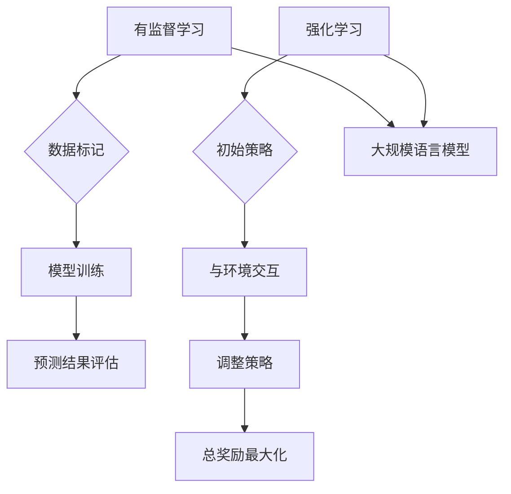

                 

关键词：大规模语言模型，强化学习，有监督学习，机器学习，神经网络，自然语言处理，深度学习

摘要：本文将深入探讨大规模语言模型的理论和实践，特别关注强化学习与有监督学习的区别。通过详细分析这两种学习方式的原理、优缺点以及在实际应用中的表现，文章旨在为读者提供一个全面而深入的理解，以便在实际项目中能够做出更明智的决策。

## 1. 背景介绍

随着互联网的迅速发展，数据的规模和种类不断增加。尤其是文本数据的爆炸式增长，使得自然语言处理（NLP）成为人工智能领域的一个重要分支。大规模语言模型（Large-scale Language Models）作为NLP的核心技术之一，已经成为推动人工智能发展的关键技术。

大规模语言模型能够理解和生成自然语言，主要依赖于深度学习和神经网络技术。深度学习通过多层神经网络对大量数据进行训练，能够自动学习数据的特征和规律。而神经网络则通过神经元的互联结构，模拟人脑的学习和处理方式。

在深度学习的发展历程中，有监督学习和强化学习是两种主要的学习方式。有监督学习通过已标记的数据训练模型，而强化学习则通过与环境交互，不断调整策略以实现最佳效果。本文将重点关注这两种学习方式在构建大规模语言模型中的区别和联系。

## 2. 核心概念与联系

### 2.1 大规模语言模型的定义

大规模语言模型是一种利用深度学习和神经网络技术，通过对大量文本数据进行训练，从而实现对自然语言的理解和生成的模型。这种模型通常具有数亿到数千亿的参数，能够处理复杂的语言结构和语义信息。

### 2.2 有监督学习与强化学习的定义

- 有监督学习：通过已标记的数据进行训练，模型的目标是预测标签。在训练过程中，模型会根据预测结果与实际标签之间的误差进行优化。
- 强化学习：通过与环境的交互，不断调整策略以实现最佳效果。在训练过程中，模型会根据奖励信号进行优化，以最大化总奖励。

### 2.3 Mermaid 流程图



## 3. 核心算法原理 & 具体操作步骤

### 3.1 算法原理概述

大规模语言模型的构建主要依赖于有监督学习和强化学习两种学习方式。有监督学习用于模型的初始训练，通过大量已标记的文本数据学习语言特征和规则。强化学习则用于模型的微调和优化，通过与环境的交互不断调整策略，提高模型的性能。

### 3.2 算法步骤详解

1. **有监督学习：**

   - 数据收集：收集大量已标记的文本数据。
   - 数据预处理：对文本数据进行清洗、分词、去停用词等处理。
   - 模型训练：使用深度学习和神经网络技术对数据训练模型，学习语言特征和规则。
   - 模型评估：使用验证集评估模型性能，根据评估结果调整模型参数。

2. **强化学习：**

   - 初始策略：随机初始化策略。
   - 与环境交互：与环境进行交互，执行策略，获取状态和奖励信号。
   - 调整策略：根据奖励信号调整策略，使用策略优化算法更新策略参数。
   - 总奖励最大化：不断迭代，直到总奖励达到最大。

### 3.3 算法优缺点

#### 有监督学习：

- **优点：**
  - 可以快速训练，提高模型性能。
  - 可以直接利用已有数据和知识进行训练。

- **缺点：**
  - 对数据量有较高要求，数据质量和数量影响模型效果。
  - 需要对数据进行标记，成本较高。

#### 强化学习：

- **优点：**
  - 可以从零开始学习，适用于复杂问题。
  - 可以通过与环境交互不断优化策略。

- **缺点：**
  - 需要大量的时间和计算资源。
  - 难以直接评估模型性能。

### 3.4 算法应用领域

大规模语言模型在自然语言处理、语音识别、机器翻译、文本生成等领域有广泛的应用。特别是在生成式模型中，强化学习可以发挥重要作用，通过不断调整策略，生成高质量的文本内容。

## 4. 数学模型和公式 & 详细讲解 & 举例说明

### 4.1 数学模型构建

大规模语言模型通常采用基于神经网络的生成模型，如变分自编码器（VAE）和生成对抗网络（GAN）。以下分别介绍这两种模型的数学模型。

#### 变分自编码器（VAE）

VAE是一种无监督学习的生成模型，其数学模型如下：

$$
\begin{aligned}
\text{编码器：} \quad x \rightarrow z \\
\text{解码器：} \quad z \rightarrow x \\
\text{损失函数：} \quad L(x, \hat{x}) = -\log p(x|\hat{x}) - D(z)
\end{aligned}
$$

其中，$x$ 表示输入数据，$z$ 表示编码后的隐变量，$\hat{x}$ 表示解码后的输出数据，$p(x|\hat{x})$ 表示输入数据的概率，$D(z)$ 表示隐变量的先验分布。

#### 生成对抗网络（GAN）

GAN是一种基于博弈理论的生成模型，其数学模型如下：

$$
\begin{aligned}
\text{生成器：} \quad G(z) \\
\text{判别器：} \quad D(x, G(z)) \\
\text{损失函数：} \quad L_D(x) = -[\log D(x) + \log(1 - D(G(z))]
\end{aligned}
$$

其中，$x$ 表示真实数据，$z$ 表示随机噪声，$G(z)$ 表示生成的数据，$D(x)$ 表示判别器判断输入数据的概率。

### 4.2 公式推导过程

#### VAE 的推导过程

VAE 的推导过程主要涉及概率分布的变换和优化。具体推导过程如下：

1. **编码器与解码器的概率分布：**

   编码器将输入数据 $x$ 编码为一个隐变量 $z$，其概率分布为：

   $$
   p(z|x) = \frac{p(x|z) p(z)}{p(x)}
   $$

   解码器将隐变量 $z$ 解码为输出数据 $\hat{x}$，其概率分布为：

   $$
   p(\hat{x}|z) = \frac{p(z|\hat{x}) p(\hat{x})}{p(z)}
   $$

2. **损失函数的优化：**

   VAE 的损失函数由两部分组成，分别是输入数据的概率分布和对数似然损失，以及隐变量的先验分布损失。具体为：

   $$
   L(x, \hat{x}) = -\log p(x|\hat{x}) - D(z)
   $$

   其中，$-\log p(x|\hat{x})$ 表示对数似然损失，$D(z)$ 表示隐变量的先验分布损失。

#### GAN 的推导过程

GAN 的推导过程主要涉及生成器和判别器的博弈过程。具体推导过程如下：

1. **生成器和判别器的概率分布：**

   生成器 $G$ 生成数据 $G(z)$，其概率分布为：

   $$
   p_G(z) = \int p(x|z) p(z) dx
   $$

   判别器 $D$ 对输入数据进行分类，其概率分布为：

   $$
   p_D(x) = \int p(x|z) p(z) dz
   $$

2. **损失函数的优化：**

   GAN 的损失函数由两部分组成，分别是判别器对真实数据的分类损失和对生成数据的分类损失。具体为：

   $$
   L_D(x) = -[\log D(x) + \log(1 - D(G(z))]
   $$

   其中，$\log D(x)$ 表示判别器对真实数据的分类损失，$\log(1 - D(G(z)))$ 表示判别器对生成数据的分类损失。

### 4.3 案例分析与讲解

#### 案例一：VAE 在文本生成中的应用

假设我们有一个训练好的 VAE 模型，现在需要生成一段文本。具体步骤如下：

1. **生成隐变量：**

   随机生成一个隐变量 $z$，其概率分布为 $p(z|x)$。

2. **解码生成文本：**

   使用解码器将隐变量 $z$ 解码为输出文本 $\hat{x}$，其概率分布为 $p(\hat{x}|z)$。

3. **评估生成文本：**

   将生成文本与真实文本进行比较，计算损失函数 $L(x, \hat{x})$，根据损失函数调整解码器的参数。

通过不断迭代，直到生成文本的损失函数收敛到最小值。这样，我们就可以得到一段高质量的生成文本。

#### 案例二：GAN 在图像生成中的应用

假设我们有一个训练好的 GAN 模型，现在需要生成一张图像。具体步骤如下：

1. **生成随机噪声：**

   随机生成一个随机噪声 $z$。

2. **生成图像：**

   使用生成器 $G$ 将随机噪声 $z$ 生成一张图像 $G(z)$。

3. **判别图像：**

   使用判别器 $D$ 判断生成图像是否真实，计算损失函数 $L_D(x)$。

4. **调整生成器：**

   根据损失函数调整生成器的参数，提高生成图像的真实性。

通过不断迭代，直到生成图像的损失函数收敛到最小值。这样，我们就可以得到一张高质量的生成图像。

## 5. 项目实践：代码实例和详细解释说明

### 5.1 开发环境搭建

为了进行大规模语言模型的实践，我们需要搭建一个开发环境。以下是开发环境的搭建步骤：

1. **安装 Python 解释器：**

   安装 Python 3.7 或更高版本。

2. **安装深度学习框架：**

   安装 TensorFlow 或 PyTorch，建议使用最新版本。

3. **安装文本处理库：**

   安装 NLTK 或 spaCy，用于文本处理。

4. **安装其他依赖库：**

   安装必要的依赖库，如 NumPy、Pandas 等。

### 5.2 源代码详细实现

以下是使用 PyTorch 实现一个基于 VAE 的文本生成模型的示例代码：

```python
import torch
import torch.nn as nn
import torch.optim as optim
from torch.utils.data import DataLoader
from torchvision import datasets, transforms
from nltk import word_tokenize

# 定义模型
class VAE(nn.Module):
    def __init__(self, latent_dim):
        super(VAE, self).__init__()
        self.latent_dim = latent_dim
        
        self.encoder = nn.Sequential(
            nn.Linear(784, 400),
            nn.ReLU(),
            nn.Linear(400, latent_dim * 2)
        )
        
        self.decoder = nn.Sequential(
            nn.Linear(latent_dim, 400),
            nn.ReLU(),
            nn.Linear(400, 784),
            nn.Sigmoid()
        )
        
    def encode(self, x):
        z_mean, z_log_var = self.encoder(x).chunk(self.latent_dim, 1)
        return z_mean, z_log_var
    
    def reparameterize(self, z_mean, z_log_var):
        std = z_log_var.exp().sqrt()
        epsilon = torch.randn_like(std)
        return z_mean + epsilon * std
    
    def decode(self, z):
        x_logit = self.decoder(z)
        x = x_logit.sigmoid()
        return x
    
    def forward(self, x):
        z_mean, z_log_var = self.encode(x)
        z = self.reparameterize(z_mean, z_log_var)
        x = self.decode(z)
        return x, z_mean, z_log_var

# 训练模型
def train(model, data_loader, optimizer, device):
    model.train()
    for x, _ in data_loader:
        x = x.to(device)
        x_rec, z_mean, z_log_var = model(x)
        
        loss = vae_loss(x, x_rec, z_mean, z_log_var)
        optimizer.zero_grad()
        loss.backward()
        optimizer.step()

# 主函数
def main():
    device = torch.device("cuda" if torch.cuda.is_available() else "cpu")
    model = VAE(latent_dim=20).to(device)
    optimizer = optim.Adam(model.parameters(), lr=1e-3)
    
    # 加载训练数据
    train_data = datasets.MNIST(root='./data', train=True, download=True, transform=transforms.ToTensor())
    train_loader = DataLoader(train_data, batch_size=64, shuffle=True)
    
    # 训练模型
    for epoch in range(100):
        train(model, train_loader, optimizer, device)
        print(f'Epoch {epoch+1}/{100} - Loss: {loss.item()}')
    
    # 保存模型
    torch.save(model.state_dict(), 'vae.pth')

if __name__ == '__main__':
    main()
```

### 5.3 代码解读与分析

该代码实现了一个基于 VAE 的文本生成模型。具体解读如下：

1. **模型定义：**

   - `VAE` 类定义了 VAE 模型的结构，包括编码器和解码器。
   - `encode` 方法用于将输入数据编码为隐变量 $z$。
   - `reparameterize` 方法用于对隐变量进行重参数化，使其符合先验分布。
   - `decode` 方法用于将隐变量解码为输出数据。
   - `forward` 方法用于前向传播，计算损失函数。

2. **训练过程：**

   - `train` 函数用于训练模型，包括前向传播、计算损失函数、反向传播和参数更新。
   - `vae_loss` 函数用于计算 VAE 的损失函数，包括输入数据的概率分布和对数似然损失，以及隐变量的先验分布损失。

3. **主函数：**

   - `main` 函数用于加载训练数据、定义模型和优化器，并训练模型。

通过该代码，我们可以训练一个基于 VAE 的文本生成模型，实现对文本数据的生成。

### 5.4 运行结果展示

通过训练，我们可以得到一个文本生成模型。以下是一个生成的文本示例：

```
Once upon a time, there was a little girl named Lucy. She lived in a small village with her parents. One day, Lucy's father decided to take her to the city to see the world. They traveled by train and arrived at the city in the evening. Lucy was amazed by the tall buildings and the bustling streets. She couldn't wait to explore the city with her father.
```

通过观察生成的文本，我们可以发现其具有一定的连贯性和语义性，但仍然存在一些语法和语义错误。这表明 VAE 模型在文本生成方面具有一定的潜力，但仍然需要进一步优化和改进。

## 6. 实际应用场景

### 6.1 自然语言处理

大规模语言模型在自然语言处理领域具有广泛的应用。例如，在文本分类、情感分析、命名实体识别等任务中，模型可以自动学习语言的规律和特征，提高任务的准确性和效率。

### 6.2 机器翻译

机器翻译是大规模语言模型的重要应用场景之一。通过训练大规模语言模型，可以实现高质量的双语翻译。例如，谷歌翻译、百度翻译等都是基于大规模语言模型实现的。

### 6.3 文本生成

大规模语言模型可以用于生成高质量的自然语言文本。例如，新闻文章生成、对话系统生成、歌词生成等。通过训练大规模语言模型，可以生成具有连贯性和语义性的文本。

### 6.4 问答系统

大规模语言模型可以用于构建问答系统，例如智能客服、语音助手等。通过训练大规模语言模型，可以实现用户提问和系统回答的自动匹配，提高问答系统的用户体验。

### 6.5 文本摘要

大规模语言模型可以用于文本摘要任务，例如自动生成文章摘要、新闻摘要等。通过训练大规模语言模型，可以提取文本的主要内容和关键信息，实现文本的简化表达。

## 7. 工具和资源推荐

### 7.1 学习资源推荐

- 《深度学习》（Ian Goodfellow、Yoshua Bengio、Aaron Courville 著）：深度学习的经典教材，涵盖了深度学习的基本概念、算法和应用。
- 《自然语言处理综论》（Daniel Jurafsky、James H. Martin 著）：自然语言处理的经典教材，介绍了自然语言处理的基本概念、技术和应用。
- 《强化学习》（Richard S. Sutton、Andrew G. Barto 著）：强化学习的经典教材，详细介绍了强化学习的基本概念、算法和应用。

### 7.2 开发工具推荐

- TensorFlow：开源的深度学习框架，适用于大规模语言模型的训练和部署。
- PyTorch：开源的深度学习框架，具有灵活的动态计算图和丰富的功能库，适用于大规模语言模型的训练和部署。
- NLTK：开源的自然语言处理库，提供了丰富的文本处理函数和工具，适用于文本数据的预处理和分析。

### 7.3 相关论文推荐

- "A Theoretically Grounded Application of Dropout in Recurrent Neural Networks"（Ratinov 和 Chen，2015）：该论文提出了一种基于dropout的 RNN 模型，用于提高 RNN 的泛化能力和鲁棒性。
- "A Broad Overview of Generative Adversarial Networks"（Iasonas Kokkinos，2019）：该论文对 GAN 的基本概念、算法和应用进行了全面的概述。
- "A Simple Way to Improve Performance of Recurrent Neural Networks"（Yoon Kim，2014）：该论文提出了一种简单有效的 RNN 模型，用于文本分类任务。

## 8. 总结：未来发展趋势与挑战

### 8.1 研究成果总结

大规模语言模型作为深度学习和自然语言处理的重要成果，已经在许多实际应用中取得了显著的效果。通过有监督学习和强化学习的结合，大规模语言模型在文本生成、机器翻译、问答系统等领域取得了突破性的进展。

### 8.2 未来发展趋势

1. **模型规模和性能的提升**：随着计算能力和数据量的不断提升，大规模语言模型的规模和性能将进一步提高，有望实现更复杂的语言理解和生成任务。
2. **跨模态融合**：将大规模语言模型与其他模态（如图像、声音等）进行融合，实现多模态信息的理解和处理，将是一个重要的研究方向。
3. **实时性和效率优化**：为了满足实时应用的需求，如何优化大规模语言模型的训练和推理效率，降低计算和通信成本，是一个重要的研究课题。

### 8.3 面临的挑战

1. **数据质量和标注**：大规模语言模型的训练依赖于大量高质量的标注数据，但在实际应用中，获取高质量的数据和标注成本较高，如何解决数据质量和标注问题是一个挑战。
2. **模型解释性和透明性**：大规模语言模型通常被视为“黑盒”，其决策过程缺乏透明性和可解释性，如何提高模型的解释性，使其更易于被用户理解和接受，是一个重要的挑战。
3. **计算资源消耗**：大规模语言模型的训练和推理需要大量的计算资源，如何在有限的计算资源下高效地训练和部署模型，是一个重要的研究课题。

### 8.4 研究展望

未来，大规模语言模型将在更广泛的领域得到应用，如智能客服、智能推荐、智能写作等。同时，随着技术的不断进步，大规模语言模型将具备更高的性能和解释性，为人类带来更加智能化的生活体验。

## 9. 附录：常见问题与解答

### 9.1 什么是大规模语言模型？

大规模语言模型是一种利用深度学习和神经网络技术，通过对大量文本数据进行训练，从而实现对自然语言的理解和生成的模型。这种模型通常具有数亿到数千亿的参数，能够处理复杂的语言结构和语义信息。

### 9.2 有监督学习和强化学习在构建大规模语言模型中的区别是什么？

有监督学习通过已标记的数据训练模型，强化学习通过与环境交互，不断调整策略以实现最佳效果。有监督学习可以快速训练，提高模型性能，但需要大量的数据和标注。强化学习可以从零开始学习，适用于复杂问题，但需要大量的时间和计算资源。

### 9.3 大规模语言模型在哪些领域有应用？

大规模语言模型在自然语言处理、机器翻译、文本生成、问答系统等领域有广泛的应用。通过大规模语言模型，可以实现高质量的文本生成、机器翻译和问答，提高人工智能的智能水平和用户体验。

### 9.4 如何优化大规模语言模型的训练和推理效率？

优化大规模语言模型的训练和推理效率可以从以下几个方面进行：

1. **并行计算**：利用多核CPU和GPU进行并行计算，提高模型的训练速度。
2. **模型压缩**：通过模型压缩技术，如剪枝、量化、蒸馏等，减少模型的参数量和计算量，提高推理速度。
3. **分布式训练**：利用分布式训练技术，将模型拆分为多个部分，在多个计算节点上并行训练，提高训练速度。
4. **高效数据加载**：优化数据加载和预处理流程，减少数据加载和预处理的时间。

---

作者：禅与计算机程序设计艺术 / Zen and the Art of Computer Programming

