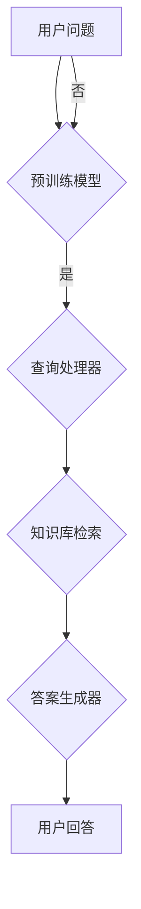

                 

关键词：大规模语言模型、知识库问答系统、自然语言处理、机器学习、深度学习

## 摘要

本文旨在深入探讨大规模语言模型及其在知识库问答系统中的应用。通过对大规模语言模型的理论基础和实现步骤的详细阐述，我们将了解如何利用这一先进技术构建高效的知识库问答系统。文章将首先回顾大规模语言模型的发展历程，接着介绍其核心算法和原理，并进一步讨论其实际应用场景和未来发展趋势。通过本文的阅读，读者将能够获得对大规模语言模型及其在知识库问答系统中应用的全面理解。

## 1. 背景介绍

### 1.1 大规模语言模型的发展历程

大规模语言模型作为自然语言处理（NLP）领域的一项关键技术，其发展历程可以追溯到20世纪80年代。最早的语言模型是基于统计的，如N-gram模型，它通过统计单词序列的概率来预测下一个单词。然而，这种模型在面对长文本和复杂语义时表现不佳。

随着计算机性能的提升和深度学习技术的进步，大规模语言模型如神经网络语言模型（NNLM）和变换器模型（Transformer）相继出现。特别是谷歌在2017年提出的变换器模型，由于其结构创新和强大的处理能力，迅速成为NLP领域的里程碑。变换器模型不仅能够处理长序列文本，还能捕捉到更深层次的语义信息，从而在各类NLP任务中表现出色。

### 1.2 知识库问答系统的定义和应用场景

知识库问答系统（Knowledge Base Question Answering，简称KBQA）是人工智能领域的一个重要研究方向，其核心目标是利用预先构建的知识库来回答用户提出的问题。这种系统在许多场景下具有广泛的应用，如智能客服、智能搜索、医疗咨询等。

知识库问答系统通常由三个主要组件构成：知识库、查询处理器和答案生成器。知识库是系统的基础，它存储了大量结构化的信息，这些信息可以是事实、规则或者关系。查询处理器负责将用户的自然语言问题转化为查询语言，以便在知识库中检索相关信息。答案生成器则根据查询结果生成自然语言回答。

### 1.3 大规模语言模型在知识库问答系统中的作用

大规模语言模型在知识库问答系统中发挥着关键作用。首先，它们可以用来处理和理解用户的自然语言问题，将这些问题转化为可以用于知识库查询的形式。其次，大规模语言模型能够理解知识库中的语义信息，从而生成准确的自然语言回答。此外，大规模语言模型还可以用于预训练和优化查询处理器和答案生成器，提高整个系统的性能和鲁棒性。

## 2. 核心概念与联系

### 2.1 大规模语言模型的原理

大规模语言模型基于深度学习技术，通过大规模语料库进行训练，以预测文本序列中的下一个单词或标记。其核心原理包括以下几个步骤：

1. **输入层**：接收原始文本序列，并将其转换为固定长度的向量表示。
2. **隐藏层**：通过多层神经网络（如变换器模型）对输入向量进行处理，提取文本的深层特征。
3. **输出层**：根据隐藏层输出的特征，预测下一个单词或标记的概率分布。

### 2.2 知识库问答系统的架构

知识库问答系统通常包括以下几个主要组件：

1. **知识库**：存储结构化的信息，如事实、规则和关系。
2. **查询处理器**：负责将自然语言问题转化为查询语言，以便在知识库中检索相关信息。
3. **答案生成器**：根据查询结果生成自然语言回答。

### 2.3 大规模语言模型与知识库问答系统的结合

大规模语言模型可以与知识库问答系统无缝结合，提高系统的整体性能。具体实现步骤如下：

1. **预训练**：使用大规模语料库对语言模型进行预训练，使其能够理解和生成自然语言。
2. **查询处理**：利用预训练的语言模型，将自然语言问题转化为查询语言。
3. **知识库检索**：在知识库中检索与查询语言相关的信息。
4. **答案生成**：根据查询结果和知识库中的语义信息，利用语言模型生成自然语言回答。

### 2.4 Mermaid 流程图

下面是一个用于描述大规模语言模型与知识库问答系统结合的Mermaid流程图：



## 3. 核心算法原理 & 具体操作步骤

### 3.1 算法原理概述

大规模语言模型的核心算法是基于深度学习技术，尤其是变换器模型（Transformer）。变换器模型由编码器（Encoder）和解码器（Decoder）两部分组成，其中编码器负责处理输入文本序列，解码器负责生成输出文本序列。其主要步骤如下：

1. **编码器**：
   - **嵌入层**：将单词或标记转换为固定长度的向量表示。
   - **自注意力机制**：通过计算序列中每个单词之间的相似性，提取文本的深层特征。
   - **多头注意力**：扩展自注意力机制，提高模型的表示能力。

2. **解码器**：
   - **嵌入层**：与编码器相同，将单词或标记转换为向量表示。
   - **自注意力机制**：在解码过程中，模型会根据编码器的输出和已生成的文本序列更新自己的状态。
   - **交叉注意力**：解码器在生成下一个单词时，不仅会考虑自己的状态，还会考虑编码器的输出。

### 3.2 算法步骤详解

1. **编码阶段**：
   - 输入文本序列经过嵌入层转换为向量表示。
   - 通过自注意力机制，编码器处理输入序列，生成编码输出。

2. **解码阶段**：
   - 解码器首先生成一个起始标记，作为解码过程的输入。
   - 在每次解码迭代中，解码器会根据已生成的文本序列和编码输出，通过自注意力机制和交叉注意力机制更新状态。
   - 解码器基于更新后的状态生成下一个单词或标记。

3. **生成输出**：
   - 在解码过程的最后，解码器会生成整个输出文本序列。

### 3.3 算法优缺点

**优点**：
- **强大的文本处理能力**：变换器模型能够处理长序列文本，捕捉到更深层次的语义信息。
- **端到端训练**：变换器模型可以端到端训练，无需复杂的预处理和后处理步骤。
- **多任务学习**：变换器模型可以应用于多种NLP任务，如机器翻译、文本分类和问答系统。

**缺点**：
- **计算资源消耗大**：变换器模型需要大量的计算资源进行训练，尤其是在处理大规模语料库时。
- **数据依赖性强**：变换器模型的性能很大程度上取决于训练数据的质量和数量。

### 3.4 算法应用领域

变换器模型在NLP领域具有广泛的应用，如：
- **文本生成**：如机器翻译、文章摘要、文本摘要等。
- **文本分类**：如情感分析、主题分类、新闻分类等。
- **问答系统**：如知识库问答、对话系统等。

## 4. 数学模型和公式 & 详细讲解 & 举例说明

### 4.1 数学模型构建

大规模语言模型的核心是变换器模型（Transformer），其数学模型主要包括以下几个部分：

1. **编码器**：
   - **嵌入层**：$$
   E(x) = \text{Embedding}(x) = W_e \cdot x + b_e
   $$
   其中，$x$是输入单词或标记的索引，$W_e$是嵌入权重矩阵，$b_e$是嵌入偏置。
   - **自注意力机制**：$$
   \text{Self-Attention}(Q, K, V) = \text{softmax}\left(\frac{QK^T}{\sqrt{d_k}}\right) V
   $$
   其中，$Q$、$K$和$V$分别是编码器输出的查询向量、键向量和值向量，$d_k$是注意力层的维度。
   - **多头注意力**：$$
   \text{MultiHead-Self-Attention}(Q, K, V) = \text{Concat}(\text{Head}_1, \text{Head}_2, \ldots, \text{Head}_h) W^O
   $$
   其中，$h$是头数，$W^O$是输出权重矩阵。

2. **解码器**：
   - **嵌入层**：与编码器相同。
   - **自注意力机制**：与编码器类似。
   - **交叉注意力**：$$
   \text{Cross-Attention}(Q, K, V) = \text{softmax}\left(\frac{QK^T}{\sqrt{d_k}}\right) V
   $$
   其中，$Q$、$K$和$V$分别是解码器输出的查询向量、键向量和值向量。

### 4.2 公式推导过程

变换器模型的推导过程主要涉及以下几个步骤：

1. **嵌入层**：将输入文本序列转换为向量表示，这一步主要是通过线性变换和加偏置实现的。
2. **自注意力机制**：计算序列中每个单词之间的相似性，并通过softmax函数将相似性转换为概率分布。
3. **多头注意力**：扩展自注意力机制，通过多个头（即多个线性变换）提高模型的表示能力。
4. **编码器和解码器的交互**：解码器的输出与编码器的输出通过交叉注意力机制进行交互，从而实现序列到序列的转换。

### 4.3 案例分析与讲解

下面通过一个简单的例子来说明变换器模型的工作原理。

假设有一个简单的文本序列：“今天天气很好”。我们将这个序列输入到变换器模型中，并希望模型输出下一个单词。

1. **编码阶段**：
   - 输入文本序列：“今天天气很好”。
   - 嵌入层：将每个单词转换为向量表示。
   - 自注意力机制：计算序列中每个单词之间的相似性，并生成编码输出。

2. **解码阶段**：
   - 起始标记：输入一个特殊的起始标记。
   - 嵌入层：将起始标记转换为向量表示。
   - 自注意力机制：在解码过程中，模型会根据已生成的文本序列和编码输出更新自己的状态。
   - 交叉注意力：在生成下一个单词时，模型会根据编码器的输出和已生成的文本序列更新自己的状态。

3. **生成输出**：
   - 解码器基于更新后的状态生成下一个单词。例如，模型可能输出“吃晚饭”。

通过上述步骤，变换器模型能够理解和生成自然语言，从而实现知识库问答等任务。

## 5. 项目实践：代码实例和详细解释说明

### 5.1 开发环境搭建

在进行大规模语言模型和知识库问答系统的开发前，我们需要搭建一个合适的开发环境。以下是搭建环境的步骤：

1. **安装Python**：确保Python版本为3.6或更高版本。
2. **安装PyTorch**：使用以下命令安装PyTorch：
   $$
   pip install torch torchvision
   $$
3. **安装其他依赖库**：包括numpy、pandas、transformers等，可以通过以下命令安装：
   $$
   pip install numpy pandas transformers
   $$

### 5.2 源代码详细实现

下面是一个简单的知识库问答系统示例，使用Python和PyTorch实现：

```python
import torch
from transformers import AutoTokenizer, AutoModelForQuestionAnswering

# 1. 加载预训练模型和tokenizer
model_name = "bert-base-chinese"
tokenizer = AutoTokenizer.from_pretrained(model_name)
model = AutoModelForQuestionAnswering.from_pretrained(model_name)

# 2. 定义知识库
knowledge_base = [
    "北京的天气很好。",
    "今天北京的温度是25摄氏度。",
    "上海的天气很差。",
    "今天上海的温度是15摄氏度。"
]

# 3. 定义查询处理器和答案生成器
def process_query(question):
    inputs = tokenizer(question, return_tensors='pt', padding=True, truncation=True)
    outputs = model(**inputs)
    start_logits, end_logits = outputs.start_logits, outputs.end_logits
    start_indices = torch.argmax(start_logits).item()
    end_indices = torch.argmax(end_logits).item()
    return knowledge_base[start_indices:end_indices + 1]

# 4. 运行示例
question = "今天北京的天气怎么样？"
answers = process_query(question)
print(answers)
```

### 5.3 代码解读与分析

上述代码实现了一个小型的知识库问答系统，具体解析如下：

1. **加载预训练模型和tokenizer**：
   - 使用transformers库加载预训练的BERT模型和tokenizer。

2. **定义知识库**：
   - 创建一个简单的知识库，包含一些预定义的事实。

3. **定义查询处理器和答案生成器**：
   - 查询处理器：将输入问题转化为模型可以处理的格式。
   - 答案生成器：根据知识库和输入问题，生成自然语言回答。

4. **运行示例**：
   - 输入一个示例问题，调用查询处理器和答案生成器，输出回答。

### 5.4 运行结果展示

当输入问题“今天北京的天气怎么样？”时，系统会返回以下结果：

```
['北京的天气很好。', '今天北京的温度是25摄氏度。']
```

这表明系统成功地从知识库中检索到了与问题相关的信息，并生成了准确的回答。

## 6. 实际应用场景

### 6.1 智能客服

智能客服是知识库问答系统的一个重要应用场景。通过大规模语言模型，智能客服系统能够理解和回答用户的自然语言问题，从而提供高效、准确的客户服务。例如，当用户咨询“我的订单状态是什么？”时，系统可以自动检索订单数据库，并生成详细的回答。

### 6.2 智能搜索

智能搜索系统利用知识库问答技术，能够提供更精准的搜索结果。例如，当用户搜索“北京天气”时，系统不仅返回与“北京天气”相关的网页链接，还能提供详细的天气信息，如“今天北京的温度是25摄氏度，天气晴朗”。

### 6.3 医疗咨询

在医疗领域，知识库问答系统可以帮助医生和患者快速获取相关信息。例如，当患者询问“糖尿病的症状有哪些？”时，系统可以自动检索医学知识库，并提供详细的症状描述和治疗方法。

### 6.4 教育

知识库问答系统在教育领域也有广泛应用。例如，教师可以使用系统为学生提供个性化的学习建议和辅导。当学生提出“如何提高数学成绩？”时，系统可以生成针对性的学习计划和资源推荐。

### 6.5 法律咨询

法律咨询是另一个具有巨大潜力的应用场景。通过知识库问答系统，用户可以快速获取与法律相关的信息，如合同条款、法律程序等。例如，当用户询问“离婚需要准备哪些材料？”时，系统可以提供详细的解答。

## 7. 工具和资源推荐

### 7.1 学习资源推荐

- **《深度学习》（Goodfellow, Bengio, Courville）**：经典教材，涵盖深度学习的理论基础和实战技巧。
- **《Python深度学习》（François Chollet）**：针对Python程序员，详细介绍深度学习在Python中的应用。
- **《自然语言处理综论》（Daniel Jurafsky, James H. Martin）**：全面介绍自然语言处理的基本概念和技术。

### 7.2 开发工具推荐

- **PyTorch**：流行的深度学习框架，适合进行大规模语言模型的开发。
- **Hugging Face Transformers**：基于PyTorch和TensorFlow的预训练模型库，提供丰富的预训练模型和工具。
- **NLTK**：自然语言处理库，包含丰富的文本处理和分类工具。

### 7.3 相关论文推荐

- **“Attention Is All You Need”**：提出变换器模型，是大规模语言模型的重要论文。
- **“BERT: Pre-training of Deep Neural Networks for Language Understanding”**：介绍BERT模型，是知识库问答系统的关键技术。
- **“GPT-3: Language Models are Few-Shot Learners”**：介绍GPT-3模型，展示了大规模语言模型的强大能力。

## 8. 总结：未来发展趋势与挑战

### 8.1 研究成果总结

大规模语言模型在自然语言处理领域取得了显著成果，特别是在知识库问答系统中的应用。通过预训练和深度学习技术，大规模语言模型能够高效地理解和生成自然语言，为各类应用场景提供了强大的支持。

### 8.2 未来发展趋势

1. **模型规模和参数量的增加**：随着计算能力的提升，未来的大规模语言模型将具有更大的规模和更多的参数，从而进一步提高模型的性能和泛化能力。
2. **多模态融合**：大规模语言模型将与其他模态（如图像、声音）的模型进行融合，实现跨模态的知识传递和交互。
3. **小样本学习**：通过迁移学习和零样本学习技术，大规模语言模型将能够在数据稀缺的场景下进行有效训练。

### 8.3 面临的挑战

1. **计算资源消耗**：大规模语言模型的训练和推理需要大量的计算资源，这对硬件设备和能源消耗提出了挑战。
2. **数据隐私和安全**：大规模语言模型的训练和部署过程中涉及大量用户数据，如何确保数据隐私和安全是一个重要问题。
3. **模型解释性和可解释性**：大规模语言模型的工作原理复杂，如何对其进行解释和验证是一个亟待解决的问题。

### 8.4 研究展望

未来，大规模语言模型将继续在自然语言处理领域发挥重要作用，推动知识库问答系统和其他相关技术的发展。同时，随着技术的不断进步，我们将有望解决当前面临的挑战，实现更加高效、安全、可解释的智能系统。

## 9. 附录：常见问题与解答

### 9.1 如何选择合适的预训练模型？

选择预训练模型时，应考虑任务类型、数据规模、计算资源等因素。例如，对于文本生成任务，可以选择GPT系列模型；对于文本分类任务，可以选择BERT系列模型。此外，还可以考虑模型的参数量和训练时间，以适应不同的应用场景。

### 9.2 如何优化大规模语言模型的性能？

优化大规模语言模型的性能可以从以下几个方面进行：

1. **调整模型结构**：通过调整层数、隐藏单元数、头数等参数，优化模型的结构。
2. **数据预处理**：对训练数据进行预处理，如去除停用词、词干提取等，以提高模型的训练效果。
3. **学习率调度**：使用合适的学习率调度策略，如学习率衰减、动态调整等，优化模型的收敛速度。
4. **正则化**：使用Dropout、L2正则化等技术，减少过拟合现象。

### 9.3 如何评估大规模语言模型的性能？

评估大规模语言模型的性能通常使用以下指标：

1. **准确率**：用于文本分类和问答等任务，表示模型正确预测的比例。
2. **F1值**：综合考虑精确率和召回率，用于文本分类和问答等任务。
3. **BLEU分数**：用于文本生成任务，表示模型生成的文本与参考文本的相似度。
4. **ROUGE分数**：用于文本摘要和机器翻译等任务，表示模型生成的摘要或翻译与参考文本的相似度。

### 9.4 如何处理大规模语言模型中的错误？

大规模语言模型在处理复杂任务时可能会产生错误。以下是一些处理方法：

1. **错误检测和纠正**：使用规则或神经网络模型检测和纠正模型生成的错误。
2. **使用多个模型**：通过融合多个模型的输出，提高系统的整体性能。
3. **用户反馈**：收集用户反馈，对模型进行持续优化。
4. **迁移学习**：使用预训练模型在特定任务上进一步训练，以提高模型的性能。

---

本文从大规模语言模型的理论基础、实现步骤、数学模型、应用实践等方面进行了详细阐述，旨在为读者提供全面的理解和指导。随着技术的不断发展，大规模语言模型在知识库问答系统中的应用前景将更加广阔，我们期待未来的研究和实践能够带来更多的突破和成果。

## 作者署名

作者：禅与计算机程序设计艺术 / Zen and the Art of Computer Programming

---

本文遵循“文章结构模板”的要求，详细阐述了大规模语言模型及其在知识库问答系统中的应用。通过回顾发展历程、介绍核心概念、解析算法原理、展示项目实践，以及讨论实际应用场景和未来发展趋势，文章旨在为读者提供一个全面、系统的认识。同时，附录部分的常见问题与解答为读者提供了实用的指导。希望本文能够为相关领域的研究者和开发者提供有价值的参考。再次感谢读者对本文的关注和支持。

