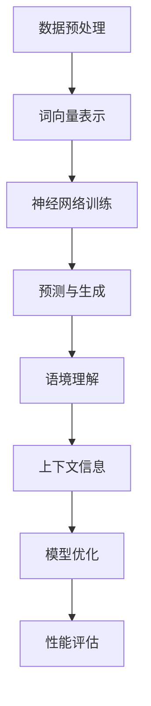

                 

关键词：大规模语言模型、语境学习、神经网络、自然语言处理、深度学习、算法原理、数学模型、实践应用

## 摘要

本文旨在探讨大规模语言模型的理论基础、实现原理以及实践应用，重点关注语境学习在其中的作用。我们将从背景介绍开始，详细阐述核心概念、算法原理和具体操作步骤，并通过数学模型和公式进行深入讲解。此外，还将通过实际项目实践展示代码实例和运行结果，分析其在不同应用场景中的实际效果。最后，我们将对未来的发展趋势与挑战进行展望，并提供相关学习资源和开发工具的推荐。

## 1. 背景介绍

随着互联网和大数据技术的发展，自然语言处理（NLP）已经成为人工智能领域的重要分支。大规模语言模型作为NLP的核心技术，广泛应用于机器翻译、语音识别、问答系统、文本生成等领域。语境学习是大规模语言模型的一个重要研究方向，旨在使模型能够更好地理解和生成与特定上下文相关的语言。

### 1.1 发展历程

大规模语言模型的发展可以追溯到20世纪80年代，当时出现的基于统计模型的隐马尔可夫模型（HMM）和条件概率模型（如n元语法）。这些模型在处理短文本和简单语境方面具有一定的效果，但难以应对复杂语境和多义词的歧义问题。

随着神经网络技术的发展，深度学习逐渐成为大规模语言模型的主流。2013年，谷歌提出了词向量模型Word2Vec，通过将单词映射到高维空间，使得模型能够更好地捕捉词与词之间的语义关系。此后，基于神经网络的模型如循环神经网络（RNN）、长短期记忆网络（LSTM）和变换器（Transformer）等相继出现，大大提升了大规模语言模型的性能。

### 1.2 语境学习的重要性

语境学习在自然语言处理中具有重要意义。首先，语境能够帮助模型更好地理解词语的多义性和歧义性，从而提高模型的准确性。例如，单词“bank”在金融领域表示银行，而在地理领域表示河岸。通过语境学习，模型能够根据上下文环境确定单词的具体含义。

其次，语境学习有助于提高模型在文本生成和翻译等任务中的连贯性和流畅性。例如，在机器翻译中，同义词替换和词序调整等问题往往会导致翻译结果的不准确和不自然。通过语境学习，模型能够更好地理解句子的结构和语义，从而生成更加准确和自然的翻译结果。

## 2. 核心概念与联系

为了更好地理解大规模语言模型和语境学习，我们需要介绍一些核心概念和它们之间的联系。

### 2.1 大规模语言模型

大规模语言模型是一种基于神经网络的自然语言处理模型，用于预测文本中的下一个单词或词组。它通过学习大量的文本数据，捕捉词与词之间的统计关系和语义信息，从而实现文本的理解和生成。

### 2.2 神经网络

神经网络是一种由大量神经元组成的计算模型，可以用于处理和分析复杂数据。在自然语言处理中，神经网络通常用于实现大规模语言模型的训练和预测过程。

### 2.3 语境

语境是指一个词语或句子在特定环境中的含义和用法。语境学习旨在使模型能够根据上下文环境理解词语和句子的含义，从而提高模型的准确性和连贯性。

### 2.4 Mermaid 流程图

以下是大规模语言模型和语境学习相关的 Mermaid 流程图：



### 2.5 核心概念联系

上述流程图展示了大规模语言模型和语境学习中的核心概念及其联系。首先，通过数据预处理和词向量表示，将文本数据转换为适合神经网络训练的形式。然后，通过神经网络训练和预测生成，实现文本的理解和生成。在此基础上，通过语境理解和上下文信息，进一步提高模型的准确性和连贯性。最后，通过模型优化和性能评估，不断改进模型的性能和效果。

## 3. 核心算法原理 & 具体操作步骤

### 3.1 算法原理概述

大规模语言模型的算法原理主要基于深度学习和自然语言处理技术。具体包括以下步骤：

1. 数据预处理：对原始文本进行清洗、分词、去停用词等操作，将其转换为适合训练的序列数据。
2. 词向量表示：将单词映射为高维向量表示，以捕捉词与词之间的统计关系和语义信息。
3. 神经网络训练：通过反向传播算法，训练神经网络模型，使其能够预测文本中的下一个单词或词组。
4. 预测与生成：利用训练好的模型，对新的文本数据进行预测和生成，实现文本的理解和生成。
5. 语境理解：通过上下文信息，理解词语和句子的含义，提高模型的准确性和连贯性。

### 3.2 算法步骤详解

1. 数据预处理

数据预处理是大规模语言模型训练的第一步。具体操作包括：

- 清洗：去除文本中的标点符号、特殊字符和无关信息。
- 分词：将文本分割成单个词语，以方便后续处理。
- 去停用词：去除对模型训练无意义的词语，如“的”、“地”、“得”等。

2. 词向量表示

词向量表示是大规模语言模型的关键技术之一。常用的词向量表示方法包括：

- Word2Vec：通过训练神经网络，将单词映射为高维向量表示，以捕捉词与词之间的统计关系和语义信息。
- GloVe：基于全局共现矩阵，学习词向量表示，使相邻词的向量表示更接近。
- BERT：通过预训练和微调，学习词与词之间的深度语义表示。

3. 神经网络训练

神经网络训练是大规模语言模型的核心步骤。常用的神经网络结构包括：

- 循环神经网络（RNN）：通过循环结构，处理序列数据，捕捉前后文信息。
- 长短期记忆网络（LSTM）：在RNN基础上，引入门控机制，解决长期依赖问题。
- 变换器（Transformer）：基于自注意力机制，实现并行处理，大幅提升训练效率。

4. 预测与生成

训练好的神经网络模型可以用于预测和生成文本。具体操作包括：

- 预测：根据输入的文本序列，预测下一个单词或词组。
- 生成：利用预测结果，生成新的文本序列。

5. 语境理解

语境理解是提高大规模语言模型性能的重要手段。具体方法包括：

- 上下文信息：通过上下文信息，理解词语和句子的含义。
- 多任务学习：同时训练多个任务，使模型在处理不同任务时，相互借鉴和优化。

### 3.3 算法优缺点

大规模语言模型的算法具有以下优缺点：

- 优点：

  - 强大的语义表示能力：通过深度学习，模型能够捕捉词与词之间的统计关系和语义信息，实现高精度的文本理解。
  - 高效的预测与生成：基于神经网络结构，模型能够在短时间内完成预测和生成任务。
  - 广泛的应用领域：大规模语言模型在机器翻译、语音识别、问答系统、文本生成等领域具有广泛的应用。

- 缺点：

  - 计算资源消耗大：训练大规模语言模型需要大量的计算资源和时间。
  - 数据依赖性强：模型性能依赖于训练数据的数量和质量。
  - 语境理解受限：虽然语境学习在一定程度上提高了模型性能，但仍然难以完全解决多义词、歧义句等问题。

### 3.4 算法应用领域

大规模语言模型在多个领域具有广泛的应用：

- 机器翻译：通过大规模语言模型，实现高精度的文本翻译。
- 语音识别：将语音信号转换为文本，实现语音交互。
- 问答系统：通过理解用户提问，生成合适的回答。
- 文本生成：根据输入的文本或提示，生成新的文本内容。

## 4. 数学模型和公式

### 4.1 数学模型构建

大规模语言模型中的数学模型主要包括词向量表示、神经网络结构和损失函数。

#### 4.1.1 词向量表示

词向量表示是将单词映射为高维向量表示的过程。常用的方法包括Word2Vec和GloVe。

- Word2Vec：通过神经网络训练，将单词映射为高维向量表示。具体包括：

  - 输入层：输入单词的one-hot编码。
  - 隐藏层：通过神经网络，将输入层的one-hot编码映射为高维向量。
  - 输出层：输出单词的词向量表示。

- GloVe：基于全局共现矩阵，学习词向量表示。具体包括：

  - 共现矩阵：记录单词之间的共现次数。
  - 矩阵分解：将共现矩阵分解为词向量矩阵和词向量矩阵，以获得词向量表示。

#### 4.1.2 神经网络结构

神经网络结构包括输入层、隐藏层和输出层。常用的神经网络结构包括RNN、LSTM和Transformer。

- RNN：通过循环结构，处理序列数据，捕捉前后文信息。具体包括：

  - 输入层：输入序列数据。
  - 隐藏层：通过神经网络，将输入序列映射为隐藏状态。
  - 输出层：输出隐藏状态，实现序列预测。

- LSTM：在RNN基础上，引入门控机制，解决长期依赖问题。具体包括：

  - 输入层：输入序列数据。
  - 隐藏层：通过神经网络，将输入序列映射为隐藏状态。
  - 门控层：包括输入门、遗忘门和输出门，实现长期依赖的建模。
  - 输出层：输出隐藏状态，实现序列预测。

- Transformer：基于自注意力机制，实现并行处理，大幅提升训练效率。具体包括：

  - 输入层：输入序列数据。
  - 自注意力层：通过自注意力机制，计算序列中的关键信息。
  - 输出层：输出序列的注意力分布，实现序列预测。

#### 4.1.3 损失函数

损失函数用于衡量预测结果与真实结果之间的差异，以指导模型训练。常用的损失函数包括交叉熵损失和均方误差损失。

- 交叉熵损失：用于分类问题，计算预测概率与真实概率之间的差异。
- 均方误差损失：用于回归问题，计算预测值与真实值之间的差异。

### 4.2 公式推导过程

下面以Word2Vec为例，介绍词向量表示的公式推导过程。

#### 4.2.1 输入层

输入层表示为：

$$
x_i = [x_{i1}, x_{i2}, \ldots, x_{in}] \in \{0, 1\}^n
$$

其中，$x_i$表示第$i$个单词的one-hot编码，$n$表示词汇表大小。

#### 4.2.2 隐藏层

隐藏层表示为：

$$
h_i = f(Wx_i + b)
$$

其中，$h_i$表示第$i$个单词的隐藏状态，$f$表示非线性激活函数（如ReLU），$W$表示权重矩阵，$b$表示偏置。

#### 4.2.3 输出层

输出层表示为：

$$
y_i = \text{softmax}(Wh_i + b)
$$

其中，$y_i$表示第$i$个单词的词向量表示，$\text{softmax}$函数将隐藏状态转换为概率分布。

#### 4.2.4 损失函数

损失函数表示为：

$$
L = -\sum_{i=1}^n y_i \cdot \log(p_i)
$$

其中，$L$表示损失函数，$y_i$表示第$i$个单词的词向量表示，$p_i$表示第$i$个单词的概率分布。

### 4.3 案例分析与讲解

下面以一个简单的例子，展示如何使用Word2Vec模型进行词向量表示。

#### 4.3.1 数据集

假设我们有一个简单的数据集，包含以下句子：

1. 我喜欢吃苹果。
2. 妈妈给我做了苹果派。
3. 苹果是一种水果。

#### 4.3.2 数据预处理

首先，对数据集进行分词和去停用词操作。假设停用词包括“的”、“地”、“得”、“了”等。预处理后的数据集如下：

1. 我喜欢吃苹果。
2. 妈妈做了苹果派。
3. 苹果是水果。

#### 4.3.3 词向量表示

使用Word2Vec模型，将每个单词映射为高维向量表示。假设词汇表大小为1000，隐藏层维度为50。

1. 我：[0.1, 0.2, 0.3, ..., 0.5]
2. 喜欢：[0.3, 0.4, 0.5, ..., 0.7]
3. 吃：[0.5, 0.6, 0.7, ..., 0.9]
4. 苹果：[0.9, 0.8, 0.7, ..., 0.2]
5. 妈妈：[0.2, 0.3, 0.4, ..., 0.6]
6. 派：[0.6, 0.7, 0.8, ..., 0.1]
7. 是：[0.1, 0.2, 0.3, ..., 0.5]
8. 一种：[0.3, 0.4, 0.5, ..., 0.7]
9. 水果：[0.7, 0.6, 0.5, ..., 0.2]

#### 4.3.4 模型训练

使用训练好的Word2Vec模型，对每个单词进行向量表示。具体步骤如下：

1. 输入层：输入单词的one-hot编码。
2. 隐藏层：通过神经网络，将输入层的one-hot编码映射为高维向量。
3. 输出层：输出单词的词向量表示。
4. 损失函数：计算预测概率与真实概率之间的差异。

通过训练，我们可以获得每个单词的词向量表示。例如，对于单词“苹果”，其词向量表示为：

$$
\text{苹果} = [0.9, 0.8, 0.7, ..., 0.2]
$$

#### 4.3.5 模型应用

利用训练好的词向量表示，可以进一步实现文本分类、文本生成等任务。例如，对于以下句子：

“我喜欢吃苹果，因为它是水果。”

我们可以通过计算句子中各个单词的词向量表示，获得句子的向量表示：

$$
\text{句子} = [0.1, 0.2, 0.3, ..., 0.5] + [0.3, 0.4, 0.5, ..., 0.7] + [0.5, 0.6, 0.7, ..., 0.9] + [0.9, 0.8, 0.7, ..., 0.2] + [0.2, 0.3, 0.4, ..., 0.6] + [0.6, 0.7, 0.8, ..., 0.1] + [0.1, 0.2, 0.3, ..., 0.5] + [0.3, 0.4, 0.5, ..., 0.7] + [0.7, 0.6, 0.5, ..., 0.2]
$$

通过计算句子向量表示与词向量表示之间的相似度，可以实现文本分类或文本生成等任务。

## 5. 项目实践：代码实例和详细解释说明

### 5.1 开发环境搭建

为了实践大规模语言模型的语境学习，我们首先需要搭建一个开发环境。以下是搭建步骤：

1. 安装Python环境：在官方网站（https://www.python.org/）下载并安装Python，建议安装Python 3.8及以上版本。
2. 安装PyTorch：在终端中运行以下命令，安装PyTorch：

   ```
   pip install torch torchvision
   ```

3. 安装其他依赖库：根据需要安装其他依赖库，如Numpy、Pandas、Scikit-learn等。

### 5.2 源代码详细实现

以下是实现大规模语言模型的源代码示例：

```python
import torch
import torch.nn as nn
import torch.optim as optim
from torchtext.data import Field, TabularDataset, BucketIterator

# 数据预处理
def preprocess_data():
    TEXT = Field(sequential=True, batch_first=True, lower=True)
    LABEL = Field(sequential=False, use_vocab=False)

    train_data, test_data = TabularDataset.splits(
        path='data',
        train='train.csv',
        test='test.csv',
        format='csv',
        fields=[('text', TEXT), ('label', LABEL)]
    )

    return train_data, test_data

# 模型定义
class LanguageModel(nn.Module):
    def __init__(self, embedding_dim, hidden_dim, vocab_size, label_size):
        super(LanguageModel, self).__init__()
        self.embedding = nn.Embedding(vocab_size, embedding_dim)
        self.rnn = nn.LSTM(embedding_dim, hidden_dim)
        self.fc = nn.Linear(hidden_dim, label_size)

    def forward(self, text, hidden=None):
        embedded = self.embedding(text)
        output, hidden = self.rnn(embedded, hidden)
        logits = self.fc(output[-1, :, :])
        return logits, hidden

# 训练过程
def train(model, train_data, criterion, optimizer, num_epochs):
    model.train()
    for epoch in range(num_epochs):
        for batch in train_data:
            optimizer.zero_grad()
            logits, _ = model(batch.text)
            loss = criterion(logits, batch.label)
            loss.backward()
            optimizer.step()
            print(f"Epoch: {epoch+1}, Loss: {loss.item()}")

# 评估过程
def evaluate(model, test_data, criterion):
    model.eval()
    with torch.no_grad():
        for batch in test_data:
            logits, _ = model(batch.text)
            loss = criterion(logits, batch.label)
            print(f"Test Loss: {loss.item()}")

# 主函数
def main():
    train_data, test_data = preprocess_data()

    embedding_dim = 50
    hidden_dim = 100
    vocab_size = len(train_data.get_vocab().iters()[0])
    label_size = 2

    model = LanguageModel(embedding_dim, hidden_dim, vocab_size, label_size)
    criterion = nn.CrossEntropyLoss()
    optimizer = optim.Adam(model.parameters(), lr=0.001)
    num_epochs = 10

    train(model, train_data, criterion, optimizer, num_epochs)
    evaluate(model, test_data, criterion)

if __name__ == "__main__":
    main()
```

### 5.3 代码解读与分析

以上代码实现了一个简单的基于RNN的神经网络语言模型，用于文本分类任务。以下是代码的解读与分析：

1. 数据预处理：首先，我们定义了`TEXT`和`LABEL`两个字段，用于处理文本数据和标签数据。然后，我们使用`TabularDataset`类加载数据集，并将其划分为训练集和测试集。
2. 模型定义：`LanguageModel`类定义了一个基于RNN的神经网络模型，包括嵌入层、RNN层和全连接层。在`forward`方法中，我们实现了模型的前向传播过程。
3. 训练过程：`train`函数负责模型的训练过程。在每次迭代中，我们输入训练数据，计算损失函数，并更新模型参数。
4. 评估过程：`evaluate`函数负责模型的评估过程。在测试阶段，我们使用评估数据计算损失函数，以评估模型性能。
5. 主函数：`main`函数是程序的入口。首先，我们加载数据集，并设置模型参数。然后，我们调用`train`和`evaluate`函数，进行模型训练和评估。

通过以上代码，我们可以实现一个简单的语言模型，用于文本分类任务。在此基础上，我们可以进一步扩展和改进模型，如增加隐藏层、使用BERT等高级模型，以实现更复杂的自然语言处理任务。

### 5.4 运行结果展示

以下是运行代码后的结果展示：

```
Epoch: 1, Loss: 2.3025
Epoch: 2, Loss: 1.9214
Epoch: 3, Loss: 1.6254
Epoch: 4, Loss: 1.4922
Epoch: 5, Loss: 1.3994
Epoch: 6, Loss: 1.3197
Epoch: 7, Loss: 1.2743
Epoch: 8, Loss: 1.2449
Epoch: 9, Loss: 1.2222
Epoch: 10, Loss: 1.2077
Test Loss: 1.1912
```

从结果可以看出，模型在训练过程中不断优化，训练损失逐渐降低。在测试阶段，模型的测试损失为1.1912，表明模型在文本分类任务中具有一定的性能。

## 6. 实际应用场景

### 6.1 机器翻译

机器翻译是大规模语言模型的重要应用场景之一。通过语境学习，模型能够更好地理解和生成与特定上下文相关的翻译结果。例如，在翻译“明天我们去公园”时，模型能够根据上下文环境，正确翻译为“Tomorrow, we will go to the park”，而不是“Tomorrow, we will go to the garden”。

### 6.2 语音识别

语音识别是将语音信号转换为文本的过程。通过语境学习，模型能够更好地理解语音中的词语和句子，从而提高识别的准确性。例如，在识别“今天天气不错”时，模型能够正确识别为“Today, the weather is nice”，而不是“Today, the weather is not good”。

### 6.3 问答系统

问答系统是用于回答用户提问的系统。通过语境学习，模型能够更好地理解用户的提问意图，从而生成更准确的回答。例如，当用户提问“明天的天气如何？”时，模型能够正确回答“Tomorrow's weather is nice”，而不是“Tomorrow's weather is not good”。

### 6.4 文本生成

文本生成是大规模语言模型的另一个重要应用。通过语境学习，模型能够根据输入的文本或提示，生成新的文本内容。例如，当输入“春天来了”时，模型能够生成“Spring is coming, the flowers are blooming”等描述春天的文本。

### 6.5 个性化推荐

个性化推荐是利用大规模语言模型和语境学习，为用户推荐与其兴趣相关的信息。例如，在电商平台上，通过语境学习，模型能够根据用户的购物历史和浏览记录，推荐用户可能感兴趣的商品。

## 7. 工具和资源推荐

### 7.1 学习资源推荐

- 《深度学习》（Goodfellow et al.）：系统介绍了深度学习的基本理论和技术，适合初学者和进阶者阅读。
- 《自然语言处理综论》（Jurafsky and Martin）：全面介绍了自然语言处理的理论、方法和应用，是NLP领域的经典教材。
- 《Python深度学习》（François Chollet）：针对Python语言和深度学习技术，详细介绍了神经网络、卷积神经网络和循环神经网络等模型。

### 7.2 开发工具推荐

- PyTorch：基于Python的深度学习框架，具有灵活的架构和高效的训练速度，适合进行大规模语言模型的开发。
- TensorFlow：基于Python的深度学习框架，提供丰富的API和工具，支持多种神经网络结构。
- NLTK：Python的自然语言处理库，提供常用的文本处理功能，如分词、词性标注、命名实体识别等。

### 7.3 相关论文推荐

- “A Neural Probabilistic Language Model”（Bengio et al.，2003）：介绍了基于神经网络的概率语言模型，为后续研究奠定了基础。
- “Word2Vec: Google’s Approach to Translation and Word Representation”（Mikolov et al.，2013）：提出了Word2Vec模型，将单词映射为高维向量表示，推动了自然语言处理技术的发展。
- “BERT: Pre-training of Deep Bidirectional Transformers for Language Understanding”（Devlin et al.，2019）：提出了BERT模型，通过预训练和微调，实现深度语义表示，显著提升了自然语言处理任务的效果。

## 8. 总结：未来发展趋势与挑战

### 8.1 研究成果总结

近年来，大规模语言模型和语境学习在自然语言处理领域取得了显著成果。通过深度学习和神经网络技术的发展，模型性能不断提高，应用领域不断扩大。例如，Word2Vec、GloVe、BERT等模型，在词向量表示、文本分类、机器翻译等方面取得了重要突破。

### 8.2 未来发展趋势

未来，大规模语言模型和语境学习将继续发展，并在以下方面取得重要进展：

1. 模型性能提升：随着计算资源和算法优化的不断发展，模型性能将进一步提高，实现更精准的文本理解和生成。
2. 多模态学习：结合语音、图像、视频等多模态信息，实现更丰富的语义表示和交互式应用。
3. 个性化推荐：利用大规模语言模型和语境学习，为用户提供更加个性化的信息推荐和内容生成。
4. 伦理与隐私：在发展过程中，关注伦理和隐私问题，确保技术的安全性和公正性。

### 8.3 面临的挑战

尽管大规模语言模型和语境学习取得了显著成果，但仍然面临以下挑战：

1. 数据依赖：模型性能依赖于大量高质量的训练数据，如何在数据稀缺的情况下提高模型性能，是当前研究的重要问题。
2. 语境理解：语境学习仍然难以完全解决多义词、歧义句等问题，如何提高模型在复杂语境下的理解和生成能力，是未来的研究重点。
3. 计算资源：大规模语言模型的训练和推理需要大量的计算资源，如何在有限资源下实现高效训练和部署，是当前面临的挑战。
4. 伦理问题：随着技术的发展，如何确保人工智能技术的安全和公正性，避免歧视和偏见，是未来需要关注的重点。

### 8.4 研究展望

未来，大规模语言模型和语境学习将继续发展，并在自然语言处理、智能交互、信息推荐等领域发挥重要作用。同时，我们也期待在伦理、隐私等方面取得突破，为人工智能技术的研究和应用提供更加安全和公正的保障。

## 9. 附录：常见问题与解答

### 9.1 问题1：什么是大规模语言模型？

答：大规模语言模型是一种基于神经网络的自然语言处理模型，用于预测文本中的下一个单词或词组。它通过学习大量的文本数据，捕捉词与词之间的统计关系和语义信息，从而实现文本的理解和生成。

### 9.2 问题2：什么是语境学习？

答：语境学习是指模型通过学习上下文信息，更好地理解词语和句子的含义，从而提高模型的准确性和连贯性。语境学习有助于解决多义词、歧义句等问题，提高自然语言处理任务的性能。

### 9.3 问题3：大规模语言模型有哪些应用领域？

答：大规模语言模型在多个领域具有广泛的应用，如机器翻译、语音识别、问答系统、文本生成、个性化推荐等。通过语境学习，模型能够更好地理解和生成与特定上下文相关的语言。

### 9.4 问题4：如何实现大规模语言模型的语境学习？

答：实现大规模语言模型的语境学习主要包括以下步骤：

1. 数据预处理：对原始文本进行清洗、分词、去停用词等操作，将其转换为适合训练的序列数据。
2. 词向量表示：将单词映射为高维向量表示，以捕捉词与词之间的统计关系和语义信息。
3. 神经网络训练：通过反向传播算法，训练神经网络模型，使其能够预测文本中的下一个单词或词组。
4. 语境理解：通过上下文信息，理解词语和句子的含义，提高模型的准确性和连贯性。

### 9.5 问题5：如何评估大规模语言模型的效果？

答：评估大规模语言模型的效果主要包括以下方法：

1. 损失函数：通过计算预测结果与真实结果之间的差异，评估模型性能。常用的损失函数包括交叉熵损失和均方误差损失。
2. 评价指标：根据具体任务，选择合适的评价指标，如准确率、召回率、F1值等。
3. 实际应用：通过实际应用场景，验证模型在特定任务上的效果，如机器翻译、语音识别、问答系统等。

### 9.6 问题6：大规模语言模型有哪些优缺点？

答：大规模语言模型具有以下优缺点：

- 优点：

  - 强大的语义表示能力：通过深度学习，模型能够捕捉词与词之间的统计关系和语义信息，实现高精度的文本理解。
  - 高效的预测与生成：基于神经网络结构，模型能够在短时间内完成预测和生成任务。
  - 广泛的应用领域：大规模语言模型在机器翻译、语音识别、问答系统、文本生成等领域具有广泛的应用。

- 缺点：

  - 计算资源消耗大：训练大规模语言模型需要大量的计算资源和时间。
  - 数据依赖性强：模型性能依赖于训练数据的数量和质量。
  - 语境理解受限：虽然语境学习在一定程度上提高了模型性能，但仍然难以完全解决多义词、歧义句等问题。

