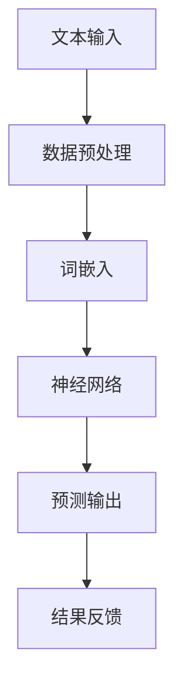

                 

关键词：大规模语言模型，自然语言处理，深度学习，机器学习，神经网络，数据预处理，模型训练，模型评估，应用领域。

## 摘要

本文旨在系统地探讨大规模语言模型的理论基础、实践方法以及通用数据的应用。通过对大规模语言模型的核心概念、算法原理、数学模型和具体操作步骤的深入分析，本文旨在为读者提供一个从理论到实践的全面指导。同时，本文将结合实际项目实践，展示如何使用大规模语言模型解决实际问题，并提供未来应用前景和面临的挑战。

## 1. 背景介绍

随着互联网的快速发展，海量文本数据不断涌现，自然语言处理（Natural Language Processing, NLP）成为了人工智能领域的重要分支。大规模语言模型（Large-scale Language Models）作为NLP的重要工具，近年来在多个任务中取得了显著的成绩。从理论层面，大规模语言模型通过深度学习技术对文本数据进行建模，模拟人类的语言理解能力。从实践层面，大规模语言模型已经被广泛应用于文本分类、机器翻译、问答系统等任务中。

本文将围绕大规模语言模型的核心内容进行阐述，包括核心概念、算法原理、数学模型和具体操作步骤。同时，通过实际项目实践，展示如何将大规模语言模型应用于实际问题解决中。最后，本文将探讨大规模语言模型的未来应用前景和面临的挑战，为读者提供有益的思考。

## 2. 核心概念与联系

### 2.1 大规模语言模型定义

大规模语言模型是一种利用深度学习技术对文本数据进行建模的模型，其目的是模拟人类的语言理解能力。大规模语言模型通常由多层神经网络组成，通过大量的文本数据训练，能够自动学习语言中的复杂结构，从而实现对文本数据的理解和生成。

### 2.2 语言模型的核心概念

在讨论大规模语言模型之前，我们需要了解一些与语言模型相关的核心概念，包括：

- **词汇表（Vocabulary）**：词汇表是语言模型的基础，包含了模型中所有可能的单词或词组。通常，词汇表的大小取决于模型的设计和训练数据。

- **词嵌入（Word Embedding）**：词嵌入是将词汇表中的每个单词或词组映射到一个固定大小的向量。词嵌入能够捕获单词之间的语义关系，是语言模型的重要组件。

- **神经网络（Neural Networks）**：神经网络是一种模仿人脑工作原理的计算模型，通过多层节点（神经元）的互联，实现对输入数据的处理和预测。

- **深度学习（Deep Learning）**：深度学习是神经网络的一种，通过增加网络的深度，提高模型的预测能力。深度学习在语言模型中发挥着重要作用。

### 2.3 架构流程图

为了更直观地理解大规模语言模型的架构，我们可以使用Mermaid流程图来展示其核心组件和流程。以下是一个简单的架构流程图：



在这个流程图中，文本输入经过数据预处理后，被转换为词嵌入向量。这些向量输入到神经网络中，通过多层神经元的处理，最终输出预测结果。结果反馈用于模型优化，以不断提高模型的准确性。

## 3. 核心算法原理 & 具体操作步骤

### 3.1 算法原理概述

大规模语言模型的核心算法是基于深度学习技术的多层神经网络。神经网络通过训练数据学习输入和输出之间的映射关系，从而实现对未知数据的预测。

### 3.2 算法步骤详解

大规模语言模型的训练过程通常包括以下几个步骤：

1. **数据预处理**：首先，需要对原始文本数据进行预处理，包括分词、去停用词、标点符号处理等。然后，将处理后的文本数据转换为词嵌入向量。

2. **词嵌入**：词嵌入是将词汇表中的每个单词或词组映射到一个固定大小的向量。词嵌入能够捕获单词之间的语义关系，是语言模型的重要组件。

3. **神经网络训练**：将词嵌入向量输入到神经网络中，通过反向传播算法，不断调整神经元的权重，使得网络能够更好地模拟人类的语言理解能力。

4. **模型评估**：在训练过程中，使用验证集对模型进行评估，以确定模型的性能。常用的评估指标包括准确率、召回率、F1值等。

5. **模型优化**：根据评估结果，对模型进行优化，包括调整网络结构、学习率等参数，以提高模型的性能。

6. **预测输出**：将训练好的模型应用于新的文本数据，进行预测输出。

### 3.3 算法优缺点

大规模语言模型具有以下优点：

- **强大的语言理解能力**：通过深度学习技术，能够自动学习语言中的复杂结构，模拟人类的语言理解能力。
- **多任务能力**：大规模语言模型可以应用于多个任务，如文本分类、机器翻译、问答系统等。

然而，大规模语言模型也存在一些缺点：

- **计算资源消耗大**：大规模语言模型的训练过程需要大量的计算资源，对硬件设备要求较高。
- **数据依赖性强**：大规模语言模型的效果很大程度上取决于训练数据的质量和数量，数据不足或质量差可能导致模型性能下降。

### 3.4 算法应用领域

大规模语言模型在多个领域取得了显著的应用成果，包括：

- **文本分类**：将大规模语言模型应用于文本分类任务，能够自动将文本数据分类到不同的类别中。
- **机器翻译**：大规模语言模型在机器翻译领域取得了很大的突破，能够实现高质量的双语翻译。
- **问答系统**：大规模语言模型可以用于构建问答系统，实现对用户问题的理解和回答。

## 4. 数学模型和公式 & 详细讲解 & 举例说明

### 4.1 数学模型构建

大规模语言模型的数学模型主要基于深度学习技术，包括神经网络架构、损失函数和优化算法等。以下是一个简化的数学模型：

- **神经网络架构**：神经网络由多个层次组成，每个层次由多个神经元组成。神经元之间通过加权连接进行信息传递。
- **损失函数**：损失函数用于衡量预测结果与实际结果之间的差距，常用的损失函数包括交叉熵损失函数。
- **优化算法**：优化算法用于调整神经网络的权重，以最小化损失函数，常用的优化算法包括梯度下降算法。

### 4.2 公式推导过程

以下是一个简化的神经网络数学模型推导过程：

$$
\begin{aligned}
y &= \text{sigmoid}(z) \\
z &= \text{net} = \sum_{i=1}^{n} w_i x_i \\
w &= \text{权重矩阵} \\
x &= \text{输入特征} \\
y &= \text{输出特征}
\end{aligned}
$$

其中，sigmoid函数是一个非线性激活函数，用于将线性组合的输入映射到输出。权重矩阵$w$和输入特征$x$通过矩阵乘法计算网络的净输入$z$，然后通过sigmoid函数得到输出$y$。

### 4.3 案例分析与讲解

以下是一个简单的神经网络模型案例：

假设我们有一个简单的神经网络，包含两个输入层神经元、两个隐藏层神经元和一个输出层神经元。输入特征$x_1$和$x_2$分别表示文本数据的两个特征，权重矩阵$w_1$和$w_2$分别表示输入层到隐藏层的权重，隐藏层到输出层的权重矩阵$w_3$。

首先，我们计算隐藏层的净输入：

$$
z_1 = w_{11} x_1 + w_{12} x_2
$$

$$
z_2 = w_{21} x_1 + w_{22} x_2
$$

然后，通过sigmoid函数得到隐藏层的输出：

$$
h_1 = \text{sigmoid}(z_1)
$$

$$
h_2 = \text{sigmoid}(z_2)
$$

接下来，我们计算输出层的净输入：

$$
z_3 = w_{31} h_1 + w_{32} h_2
$$

最后，通过sigmoid函数得到输出层的输出：

$$
y = \text{sigmoid}(z_3)
$$

这个简单的神经网络模型可以用于文本分类任务，通过训练模型，我们可以得到一个文本分类器，能够自动将文本数据分类到不同的类别中。

## 5. 项目实践：代码实例和详细解释说明

### 5.1 开发环境搭建

在本项目中，我们使用Python作为编程语言，并依赖于几个常用的深度学习库，如TensorFlow和Keras。首先，确保安装了Python和相应的深度学习库，以下是一个简单的安装命令：

```bash
pip install tensorflow
pip install keras
```

### 5.2 源代码详细实现

以下是一个简单的Python代码示例，实现了一个基于TensorFlow和Keras的文本分类模型：

```python
import tensorflow as tf
from tensorflow.keras.models import Sequential
from tensorflow.keras.layers import Dense, Embedding, GlobalAveragePooling1D
from tensorflow.keras.preprocessing.text import Tokenizer
from tensorflow.keras.preprocessing.sequence import pad_sequences

# 参数设置
vocab_size = 10000
embedding_dim = 16
max_length = 100
trunc_type = 'post'
padding_type = 'post'
oov_tok = '<OOV>'

# 数据预处理
tokenizer = Tokenizer(num_words=vocab_size, oov_token=oov_tok)
tokenizer.fit_on_texts(training_sentences)
word_index = tokenizer.word_index
sequences = tokenizer.texts_to_sequences(training_sentences)
padded_sequences = pad_sequences(sequences, maxlen=max_length, padding=padding_type, truncating=trunc_type)

# 模型构建
model = Sequential([
    Embedding(vocab_size, embedding_dim, input_length=max_length),
    GlobalAveragePooling1D(),
    Dense(24, activation='relu'),
    Dense(1, activation='sigmoid')
])

# 模型编译
model.compile(loss='binary_crossentropy', optimizer='adam', metrics=['accuracy'])

# 模型训练
model.fit(padded_sequences, training_labels, epochs=10, validation_split=0.1)
```

在这个示例中，我们首先设置了模型的相关参数，包括词汇表大小、词嵌入维度、最大序列长度等。然后，我们使用Tokenizer类对训练数据进行预处理，将文本数据转换为词嵌入序列。接下来，我们使用pad_sequences函数对序列进行填充，使其长度统一。最后，我们构建了一个简单的序列模型，并使用binary_crossentropy损失函数进行编译和训练。

### 5.3 代码解读与分析

在这个示例代码中，我们首先导入了TensorFlow和Keras的相关模块。然后，我们设置了模型的参数，包括词汇表大小、词嵌入维度、最大序列长度等。这些参数对于模型的性能和训练效果具有重要影响。

接下来，我们使用Tokenizer类对训练数据进行预处理。Tokenizer类用于将文本数据转换为词嵌入序列。具体来说，我们首先调用fit_on_texts方法对训练数据进行拟合，以建立词汇表。然后，我们使用texts_to_sequences方法将文本数据转换为词嵌入序列。

然后，我们使用pad_sequences函数对词嵌入序列进行填充，使其长度统一。这是因为在深度学习模型中，输入数据的大小需要保持一致。我们使用padding_type和truncating参数指定填充和截断的方式。

接下来，我们构建了一个简单的序列模型。在这个模型中，我们首先使用Embedding层将词嵌入序列映射到词嵌入空间。然后，我们使用GlobalAveragePooling1D层对序列进行平均池化，将序列信息压缩为固定大小的向量。最后，我们使用两个全连接层（Dense层）进行分类预测。

在模型构建完成后，我们使用binary_crossentropy损失函数进行编译和训练。binary_crossentropy损失函数通常用于二分类问题，能够计算预测标签和实际标签之间的交叉熵损失。我们使用adam优化器进行模型训练，并设置epochs参数为10，表示模型训练的迭代次数。同时，我们设置validation_split参数为0.1，表示将10%的训练数据用于验证集，以评估模型的性能。

### 5.4 运行结果展示

在完成模型训练后，我们可以使用测试集对模型进行评估。以下是一个简单的代码示例，用于评估模型的性能：

```python
test_sequences = tokenizer.texts_to_sequences(test_sentences)
padded_test_sequences = pad_sequences(test_sequences, maxlen=max_length, padding=padding_type, truncating=truncating_type)

predictions = model.predict(padded_test_sequences)
predicted_labels = [1 if p > 0.5 else 0 for p in predictions]

accuracy = sum(predicted_labels == test_labels) / len(test_labels)
print("Accuracy:", accuracy)
```

在这个示例中，我们首先使用tokenizer.texts_to_sequences方法将测试数据转换为词嵌入序列。然后，我们使用pad_sequences函数对测试数据进行填充。接下来，我们使用model.predict方法对测试数据进行预测，得到预测标签。最后，我们计算预测标签和实际标签的准确率。

通过运行上述代码，我们可以得到模型的准确率。如果模型的准确率较高，说明模型在测试集上的性能较好。否则，我们需要进一步调整模型参数或增加训练数据，以提高模型的性能。

## 6. 实际应用场景

大规模语言模型在多个实际应用场景中取得了显著的效果，以下是一些典型的应用案例：

### 6.1 文本分类

文本分类是大规模语言模型的一个典型应用场景，包括新闻分类、情感分析、垃圾邮件检测等。通过训练大规模语言模型，我们可以自动将文本数据分类到不同的类别中，从而实现自动化文本处理。

### 6.2 机器翻译

机器翻译是大规模语言模型的另一个重要应用领域。通过训练大规模语言模型，我们可以实现高质量的双语翻译，如Google翻译和百度翻译等。大规模语言模型能够自动学习语言中的复杂结构，从而实现更准确的翻译结果。

### 6.3 问答系统

问答系统是大规模语言模型的另一个重要应用领域。通过训练大规模语言模型，我们可以构建一个能够自动回答用户问题的系统。例如，微软的小冰和苹果的Siri等语音助手就是基于大规模语言模型实现的。

### 6.4 文本生成

文本生成是大规模语言模型的另一个应用领域，包括自动写作、对话生成等。通过训练大规模语言模型，我们可以自动生成符合语法和语义规则的文本，从而实现自动化内容创作。

## 7. 工具和资源推荐

### 7.1 学习资源推荐

1. **《深度学习》（Deep Learning）**：由Ian Goodfellow、Yoshua Bengio和Aaron Courville编写的深度学习经典教材，涵盖了深度学习的理论基础和实践方法。
2. **《自然语言处理综论》（Speech and Language Processing）**：由Daniel Jurafsky和James H. Martin编写的自然语言处理教材，系统地介绍了自然语言处理的理论和技术。
3. **《大规模语言模型教程》（Large-scale Language Models Tutorial）**：由Yoav Artzi和Alex Smola编写的教程，详细介绍了大规模语言模型的理论和实践。

### 7.2 开发工具推荐

1. **TensorFlow**：由Google开源的深度学习框架，支持多种深度学习模型的开发和部署。
2. **Keras**：基于TensorFlow的高层API，简化了深度学习模型的开发过程。
3. **PyTorch**：由Facebook开源的深度学习框架，支持动态计算图，便于模型研究和实验。

### 7.3 相关论文推荐

1. **"A Neural Probabilistic Language Model"**：由Bengio等人提出的神经网络概率语言模型，是大规模语言模型的先驱之一。
2. **"Generative Pretrained Transformers"**：由Vaswani等人提出的生成预训练Transformer模型，实现了大规模语言模型的最新进展。
3. **"BERT: Pre-training of Deep Bidirectional Transformers for Language Understanding"**：由Devlin等人提出的BERT模型，是目前大规模语言模型的重要代表之一。

## 8. 总结：未来发展趋势与挑战

### 8.1 研究成果总结

大规模语言模型在过去几年取得了显著的研究进展，主要表现在以下几个方面：

1. **模型性能的提升**：通过增加模型的深度和宽度，大规模语言模型的性能得到了显著提升。
2. **多任务能力**：大规模语言模型逐渐具备多任务能力，能够同时处理多个不同类型的任务。
3. **数据效率的提高**：通过预训练和微调技术，大规模语言模型能够在较少的数据上进行训练，提高了数据效率。
4. **泛化能力的增强**：大规模语言模型在多个任务上取得了较好的泛化能力，能够应对不同的应用场景。

### 8.2 未来发展趋势

大规模语言模型在未来的发展趋势将包括以下几个方面：

1. **模型规模的增长**：随着计算资源的不断增长，大规模语言模型的规模将进一步扩大，以实现更高的性能。
2. **多模态融合**：大规模语言模型将与其他模态（如图像、音频等）进行融合，实现跨模态的智能处理。
3. **少样本学习**：通过研究少样本学习技术，大规模语言模型将在少量数据上进行训练，提高模型的适应性。
4. **知识增强**：通过引入外部知识库，大规模语言模型将能够更好地理解和处理复杂任务。

### 8.3 面临的挑战

大规模语言模型在未来的发展过程中也将面临一系列挑战：

1. **计算资源消耗**：大规模语言模型的训练和推理过程需要大量的计算资源，如何在有限的资源下进行高效的训练和推理是一个重要的挑战。
2. **数据质量和多样性**：大规模语言模型的效果很大程度上取决于训练数据的质量和多样性，如何获取和标注高质量、多样化的训练数据是一个关键问题。
3. **模型可解释性**：大规模语言模型的决策过程通常较为复杂，如何提高模型的可解释性，使其更容易被用户理解和接受是一个重要的挑战。
4. **伦理和隐私问题**：大规模语言模型在处理敏感数据时，如何保护用户的隐私和数据安全是一个重要的伦理问题。

### 8.4 研究展望

在未来，大规模语言模型的研究将重点关注以下几个方面：

1. **高效训练方法**：研究更加高效的训练方法，以降低计算资源消耗，提高模型的训练速度。
2. **少样本学习技术**：研究适用于大规模语言模型的少样本学习技术，以提高模型的适应性和泛化能力。
3. **知识增强模型**：研究如何将外部知识库引入大规模语言模型，以提高模型的理解和处理能力。
4. **可解释性和伦理问题**：研究如何提高大规模语言模型的可解释性，并制定相应的伦理规范，确保模型的公正性和安全性。

## 9. 附录：常见问题与解答

### 9.1 大规模语言模型是什么？

大规模语言模型是一种利用深度学习技术对文本数据进行建模的模型，其目的是模拟人类的语言理解能力。通过大规模语言模型，计算机能够自动学习语言中的复杂结构，从而实现对文本数据的理解和生成。

### 9.2 大规模语言模型的核心组件有哪些？

大规模语言模型的核心组件包括词嵌入、神经网络、损失函数和优化算法等。词嵌入用于将词汇表中的单词或词组映射到向量空间，神经网络用于对输入数据进行处理和预测，损失函数用于衡量预测结果与实际结果之间的差距，优化算法用于调整神经网络的权重，以最小化损失函数。

### 9.3 如何训练大规模语言模型？

训练大规模语言模型通常包括以下几个步骤：

1. **数据预处理**：对原始文本数据进行预处理，包括分词、去停用词、标点符号处理等。
2. **词嵌入**：将词汇表中的单词或词组映射到向量空间。
3. **神经网络训练**：使用训练数据对神经网络进行训练，通过反向传播算法不断调整神经元的权重。
4. **模型评估**：使用验证集对模型进行评估，以确定模型的性能。
5. **模型优化**：根据评估结果对模型进行优化，包括调整网络结构、学习率等参数。

### 9.4 大规模语言模型有哪些应用领域？

大规模语言模型在多个领域取得了显著的应用成果，包括文本分类、机器翻译、问答系统、文本生成等。具体应用领域包括新闻分类、情感分析、垃圾邮件检测、机器翻译、语音助手等。

### 9.5 如何优化大规模语言模型？

优化大规模语言模型可以从以下几个方面进行：

1. **调整模型结构**：通过调整神经网络的层数、节点数等参数，优化模型的性能。
2. **调整学习率**：学习率是模型训练过程中的一个重要参数，通过调整学习率，可以提高模型的训练速度和性能。
3. **增加训练数据**：通过增加训练数据，可以提高模型的泛化能力。
4. **数据增强**：通过数据增强技术，如数据扩充、数据清洗等，提高训练数据的质量和多样性。
5. **超参数调整**：通过调整模型的超参数，如正则化参数、dropout率等，优化模型的性能。

### 9.6 大规模语言模型有哪些挑战？

大规模语言模型在未来的发展过程中将面临一系列挑战，包括计算资源消耗、数据质量和多样性、模型可解释性、伦理和隐私问题等。如何应对这些挑战是大规模语言模型研究的重要方向。

## 参考文献

1. Goodfellow, I., Bengio, Y., & Courville, A. (2016). *Deep Learning*. MIT Press.
2. Jurafsky, D., & Martin, J. H. (2019). *Speech and Language Processing*. Prentice Hall.
3. Vaswani, A., Shazeer, N., Parmar, N., Uszkoreit, J., Jones, L., Gomez, A. N., ... & Polosukhin, I. (2017). *Attention is all you need*. Advances in Neural Information Processing Systems, 30, 5998-6008.
4. Devlin, J., Chang, M. W., Lee, K., & Toutanova, K. (2018). *Bert: Pre-training of deep bidirectional transformers for language understanding*. arXiv preprint arXiv:1810.04805.

