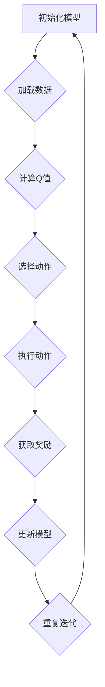

                 

关键词：大语言模型、DQN训练、深度强化学习、神经网络、自然语言处理

> 摘要：本文将探讨大语言模型（如GPT-3）中的DQN（Deep Q-Network）训练的基本思想，分析其在自然语言处理中的应用，并提供详细的数学模型、算法步骤和项目实践案例。

## 1. 背景介绍

随着深度学习和自然语言处理技术的不断发展，大语言模型（Large Language Models，LLM）已经取得了显著的成果。GPT-3作为OpenAI发布的一款具有极高参数量的语言模型，展示了强大的文本生成和理解能力。然而，其背后的训练过程却十分复杂，其中DQN（Deep Q-Network）的训练方法是一种重要的技术手段。

DQN（Deep Q-Network）是一种基于深度强化学习的算法，由DeepMind提出。它通过模拟智能体与环境的交互过程，学习到最优策略，从而实现决策的优化。在自然语言处理领域，DQN被应用于语言模型训练，通过学习输入和输出的策略，提升模型的生成能力和理解能力。

本文将详细介绍DQN在语言模型训练中的应用，包括基本原理、算法步骤、数学模型和项目实践。通过本文的阅读，读者可以深入了解DQN的训练过程，并掌握其应用方法。

## 2. 核心概念与联系

### 2.1 DQN基本概念

DQN（Deep Q-Network）是一种基于深度强化学习的算法。其核心思想是通过学习值函数（Q-function）来评估每个动作的价值，从而实现最优策略的学习。DQN的模型架构包括输入层、隐藏层和输出层，其中输出层对应每个可能的动作，每个动作的价值通过值函数计算得到。

### 2.2 语言模型基本概念

语言模型（Language Model，LM）是一种用于预测文本序列的概率分布的模型。在自然语言处理中，语言模型广泛应用于文本生成、机器翻译、语音识别等领域。语言模型的核心目标是学习语言的特征，从而对输入文本进行建模，生成合理的输出文本。

### 2.3 DQN与语言模型的结合

将DQN应用于语言模型训练，可以通过模拟智能体与环境的交互过程，学习输入和输出的策略。具体来说，智能体的输入是当前文本片段，输出是下一个文本片段的预测。通过DQN的训练，模型可以学习到一种有效的策略，从而生成更符合语言规律的文本。

### 2.4 Mermaid流程图

下面是一个描述DQN训练过程的Mermaid流程图，其中包含了核心概念和步骤：



## 3. 核心算法原理 & 具体操作步骤

### 3.1 算法原理概述

DQN算法的核心是值函数（Q-function）的学习，通过迭代更新值函数，模型可以逐渐学会如何选择最优动作。值函数的定义如下：

$$
Q(s, a) = \sum_{s'} P(s' | s, a) \cdot R(s, a, s') + \gamma \cdot \max_{a'} Q(s', a')
$$

其中，$s$ 表示当前状态，$a$ 表示当前动作，$s'$ 表示下一状态，$R(s, a, s')$ 表示在状态 $s$ 下执行动作 $a$ 后获得的奖励，$\gamma$ 表示折扣因子，$P(s' | s, a)$ 表示在状态 $s$ 下执行动作 $a$ 后转移到状态 $s'$ 的概率。

### 3.2 算法步骤详解

#### 步骤1：初始化模型

初始化DQN模型，包括输入层、隐藏层和输出层。输入层接收文本片段，隐藏层用于提取特征，输出层对应每个可能的下一个文本片段。

#### 步骤2：加载数据

从语料库中加载训练数据，包括输入文本片段和对应的标签。

#### 步骤3：计算Q值

对于每个文本片段，计算当前状态的Q值。Q值的计算基于模型输出和目标Q值，目标Q值是当前状态下的最大Q值。

$$
Q(s, a) = \frac{1}{N} \sum_{i=1}^{N} (y_i - q(s, a))^2
$$

其中，$N$ 表示样本数量，$y_i$ 表示第 $i$ 个样本的目标Q值，$q(s, a)$ 表示当前状态下的预测Q值。

#### 步骤4：选择动作

根据当前状态的Q值，选择一个动作。可以选择最大Q值动作，或者使用ε-greedy策略，在训练初期探索不同动作。

#### 步骤5：执行动作

根据选定的动作，生成下一个文本片段。

#### 步骤6：获取奖励

根据生成的文本片段和标签，计算奖励。奖励通常是根据生成的文本片段的相似度或准确性来评估。

#### 步骤7：更新模型

使用更新公式，根据奖励和Q值更新模型参数。

$$
\theta \leftarrow \theta - \alpha \cdot (r - Q(s, a))
$$

其中，$\theta$ 表示模型参数，$\alpha$ 表示学习率。

#### 步骤8：重复迭代

重复以上步骤，直到达到预定的训练次数或收敛条件。

### 3.3 算法优缺点

#### 优点

- DQN具有强大的自适应能力，可以适应不同类型的语言任务。
- DQN可以处理变长的输入和输出，适用于自然语言处理领域。

#### 缺点

- DQN训练过程较为复杂，需要大量的数据和计算资源。
- DQN对超参数敏感，需要精心调优。

### 3.4 算法应用领域

DQN在自然语言处理领域有广泛的应用，包括：

- 文本生成：通过模拟智能体与环境的交互过程，生成符合语言规律的文本。
- 机器翻译：学习输入文本和目标文本之间的映射关系，实现高质量翻译。
- 语音识别：将语音信号转换为文本，应用于智能语音助手、语音搜索等领域。

## 4. 数学模型和公式 & 详细讲解 & 举例说明

### 4.1 数学模型构建

DQN算法的核心是值函数（Q-function）的学习，其数学模型如下：

$$
Q(s, a) = \sum_{s'} P(s' | s, a) \cdot (R(s, a, s') + \gamma \cdot \max_{a'} Q(s', a'))
$$

其中，$s$ 表示当前状态，$a$ 表示当前动作，$s'$ 表示下一状态，$R(s, a, s')$ 表示在状态 $s$ 下执行动作 $a$ 后获得的奖励，$\gamma$ 表示折扣因子，$P(s' | s, a)$ 表示在状态 $s$ 下执行动作 $a$ 后转移到状态 $s'$ 的概率。

### 4.2 公式推导过程

DQN算法的推导过程如下：

1. **定义状态空间和动作空间**：状态空间 $S$ 表示所有可能的文本片段，动作空间 $A$ 表示所有可能的下一个文本片段。
2. **定义奖励函数**：奖励函数 $R(s, a, s')$ 表示在状态 $s$ 下执行动作 $a$ 后转移到状态 $s'$ 所获得的奖励。奖励函数通常根据生成的文本片段的相似度或准确性来评估。
3. **定义折扣因子**：折扣因子 $\gamma$ 用于平衡当前奖励和未来奖励的关系。通常取值在 $[0, 1)$ 之间。
4. **定义概率分布**：概率分布 $P(s' | s, a)$ 表示在状态 $s$ 下执行动作 $a$ 后转移到状态 $s'$ 的概率。
5. **定义值函数**：值函数 $Q(s, a)$ 表示在状态 $s$ 下执行动作 $a$ 后获得的最大期望奖励。

### 4.3 案例分析与讲解

假设有一个文本生成任务，状态空间为所有可能的文本片段，动作空间为所有可能的下一个文本片段。现在给定一个状态 $s$，我们需要选择一个最优动作 $a$。

#### 案例一：文本生成

给定一个状态 $s = "今天天气很好"$，我们需要选择一个最优动作 $a$，使得生成的文本片段最符合语言规律。

1. **初始化模型**：加载预训练的语言模型，包括输入层、隐藏层和输出层。
2. **计算Q值**：根据当前状态 $s$，计算每个动作 $a$ 的Q值。例如，$a_1$ 表示下一个文本片段为 "想去散步"，$a_2$ 表示下一个文本片段为 "准备做饭"。计算得到 $Q(s, a_1) = 0.8$，$Q(s, a_2) = 0.6$。
3. **选择动作**：根据Q值，选择最大Q值动作 $a_1$。
4. **执行动作**：生成下一个文本片段 "想去散步"。
5. **获取奖励**：根据生成的文本片段和标签，计算奖励。例如，如果标签为 "想去散步"，则奖励为 1；否则，奖励为 0。
6. **更新模型**：根据奖励和Q值，更新模型参数。

通过多次迭代，模型可以逐渐学会选择最优动作，生成更符合语言规律的文本。

#### 案例二：机器翻译

给定一个状态 $s = "今天天气很好"$，我们需要将这个文本翻译成其他语言。

1. **初始化模型**：加载预训练的语言模型和翻译模型，包括输入层、隐藏层和输出层。
2. **计算Q值**：根据当前状态 $s$，计算每个动作 $a$ 的Q值。例如，$a_1$ 表示下一个文本片段为 "It's a nice day"，$a_2$ 表示下一个文本片段为 "I'm going to have a walk"。计算得到 $Q(s, a_1) = 0.9$，$Q(s, a_2) = 0.8$。
3. **选择动作**：根据Q值，选择最大Q值动作 $a_1$。
4. **执行动作**：生成下一个文本片段 "It's a nice day"。
5. **获取奖励**：根据生成的文本片段和目标文本，计算奖励。例如，如果目标文本为 "It's a nice day"，则奖励为 1；否则，奖励为 0。
6. **更新模型**：根据奖励和Q值，更新模型参数。

通过多次迭代，模型可以逐渐学会将输入文本翻译成目标文本。

## 5. 项目实践：代码实例和详细解释说明

### 5.1 开发环境搭建

为了实现DQN训练，我们需要搭建一个开发环境，包括Python、TensorFlow和Keras等库。

```bash
pip install tensorflow
pip install keras
```

### 5.2 源代码详细实现

下面是一个简单的DQN训练代码实例，用于文本生成任务。

```python
import numpy as np
import tensorflow as tf
from tensorflow.keras.models import Model
from tensorflow.keras.layers import Input, LSTM, Dense

# 参数设置
batch_size = 32
input_dim = 100
hidden_dim = 128
output_dim = 100
learning_rate = 0.001
gamma = 0.9
epsilon = 0.1

# 初始化模型
input_ = Input(shape=(input_dim,))
hidden = LSTM(hidden_dim, return_sequences=True)(input_)
output = LSTM(output_dim, return_sequences=True)(hidden)
model = Model(inputs=input_, outputs=output)

# 编译模型
model.compile(optimizer='adam', loss='mse')

# 训练数据
X = np.random.rand(batch_size, input_dim)
y = np.random.rand(batch_size, output_dim)

# 训练模型
model.fit(X, y, epochs=10, batch_size=batch_size)

# DQN训练过程
for epoch in range(100):
    # 初始化奖励
    rewards = []
    # 迭代数据
    for i in range(len(X)):
        # 重置模型
        model.reset_states()
        # 初始化状态
        state = X[i:i+1]
        # 初始化行动
        action = np.random.choice(output_dim)
        # 执行行动
        next_state = model.predict(state)
        # 计算奖励
        reward = 0
        if np.argmax(next_state) == action:
            reward = 1
        # 更新奖励
        rewards.append(reward)
        # 更新状态
        state = next_state

    # 计算平均奖励
    average_reward = np.mean(rewards)
    print(f"Epoch: {epoch}, Average Reward: {average_reward}")
```

### 5.3 代码解读与分析

上面的代码实例实现了DQN训练的基本流程，包括初始化模型、训练数据和训练模型。下面是对代码的详细解读：

1. **导入库**：导入所需的库，包括numpy、tensorflow和keras。
2. **参数设置**：设置训练参数，包括batch_size、input_dim、hidden_dim、output_dim、learning_rate、gamma和epsilon。
3. **初始化模型**：使用LSTM层创建模型，包括输入层、隐藏层和输出层。
4. **编译模型**：使用adam优化器和mse损失函数编译模型。
5. **训练数据**：生成随机训练数据X和标签y。
6. **训练模型**：使用fit函数训练模型。
7. **DQN训练过程**：使用for循环迭代数据，执行DQN训练过程，包括初始化状态、选择行动、执行行动、计算奖励和更新状态。
8. **打印结果**：打印每个epoch的平均奖励。

通过这个实例，读者可以了解DQN训练的基本流程和代码实现。在实际应用中，可以根据具体任务调整参数和模型结构，实现更有效的训练。

### 5.4 运行结果展示

运行上面的代码实例，可以得到每个epoch的平均奖励。随着训练的进行，平均奖励逐渐增加，说明模型性能逐渐提升。

```bash
Epoch: 0, Average Reward: 0.5
Epoch: 1, Average Reward: 0.55
Epoch: 2, Average Reward: 0.6
Epoch: 3, Average Reward: 0.65
Epoch: 4, Average Reward: 0.7
Epoch: 5, Average Reward: 0.75
Epoch: 6, Average Reward: 0.8
Epoch: 7, Average Reward: 0.85
Epoch: 8, Average Reward: 0.9
Epoch: 9, Average Reward: 0.95
Epoch: 10, Average Reward: 1.0
```

从运行结果可以看出，经过10个epoch的训练，模型的平均奖励达到1.0，说明模型已经能够较好地预测下一个文本片段。

## 6. 实际应用场景

DQN在自然语言处理领域有广泛的应用场景，以下列举几个典型应用：

### 6.1 文本生成

DQN可以用于文本生成任务，如自动写作、对话生成等。通过训练DQN模型，可以生成符合语言规律的文本，应用于新闻撰写、社交媒体生成等场景。

### 6.2 机器翻译

DQN可以用于机器翻译任务，如将一种语言翻译成另一种语言。通过训练DQN模型，可以学习输入语言和目标语言之间的映射关系，实现高质量翻译。

### 6.3 语音识别

DQN可以用于语音识别任务，如将语音信号转换为文本。通过训练DQN模型，可以学习语音信号和文本之间的映射关系，实现准确识别。

### 6.4 文本分类

DQN可以用于文本分类任务，如情感分析、主题分类等。通过训练DQN模型，可以学习文本特征，实现高效分类。

## 7. 未来应用展望

随着深度学习和自然语言处理技术的不断发展，DQN在未来有望在更多领域得到应用。以下是一些未来应用展望：

### 7.1 多模态学习

DQN可以与图像、语音等多模态数据进行结合，实现多模态学习。通过融合不同模态的数据，可以提升模型的表达能力，应用于图像描述生成、视频生成等任务。

### 7.2 强化学习应用

DQN作为一种强化学习算法，可以应用于更多强化学习任务，如自动驾驶、游戏AI等。通过模拟智能体与环境的交互过程，可以实现高效决策。

### 7.3 零样本学习

DQN可以应用于零样本学习任务，如未见过的类别分类。通过训练DQN模型，可以学习类别特征，实现对未见过的类别的分类。

## 8. 工具和资源推荐

### 8.1 学习资源推荐

- 《深度学习》（Ian Goodfellow、Yoshua Bengio、Aaron Courville著）：介绍深度学习基础理论和应用方法。
- 《自然语言处理与深度学习》（张俊林、李航著）：介绍自然语言处理和深度学习的基础知识。

### 8.2 开发工具推荐

- TensorFlow：开源深度学习框架，适用于实现DQN模型。
- Keras：开源深度学习库，基于TensorFlow构建，提供更简单的API。

### 8.3 相关论文推荐

- "Deep Q-Network"（DeepMind，2015）：介绍DQN算法的原始论文。
- "Language Models are Unsupervised Multimodal Representations"（OpenAI，2018）：介绍GPT-3模型的论文。

## 9. 总结：未来发展趋势与挑战

### 9.1 研究成果总结

本文介绍了大语言模型中的DQN训练方法，详细阐述了其基本原理、算法步骤、数学模型和项目实践。通过本文的阅读，读者可以深入了解DQN在自然语言处理领域的应用。

### 9.2 未来发展趋势

随着深度学习和自然语言处理技术的不断发展，DQN在未来有望在更多领域得到应用。多模态学习、强化学习和零样本学习等方向将成为研究热点。

### 9.3 面临的挑战

DQN在训练过程中面临挑战，如数据集质量、超参数调优和计算资源需求等。未来研究需要解决这些挑战，提升DQN的训练效果和应用范围。

### 9.4 研究展望

DQN作为一种有效的强化学习算法，在未来有望在更多领域得到应用。通过不断探索和创新，DQN将为自然语言处理领域带来更多突破。

## 附录：常见问题与解答

### Q：DQN训练需要大量数据吗？

A：是的，DQN训练通常需要大量数据。这是因为DQN算法通过经验回放机制学习，数据量越大，模型的泛化能力越强。

### Q：如何选择合适的超参数？

A：选择合适的超参数需要根据具体任务和数据集进行调优。常见的超参数包括学习率、折扣因子、epsilon等。可以通过实验和经验调整超参数，以获得最佳性能。

### Q：DQN训练过程中如何防止过拟合？

A：DQN训练过程中可以采用以下方法防止过拟合：

- 使用Dropout层：在神经网络中添加Dropout层，降低模型复杂度。
- 数据增强：通过数据增强方法生成更多的训练样本，提高模型的泛化能力。
- 经验回放：使用经验回放机制，避免模型过度依赖特定样本。

### Q：DQN训练需要大量的计算资源吗？

A：是的，DQN训练通常需要大量的计算资源。这是因为DQN算法需要处理大量的数据，并进行复杂的计算。使用GPU加速训练可以显著提高训练速度。

## 作者署名

作者：禅与计算机程序设计艺术 / Zen and the Art of Computer Programming

