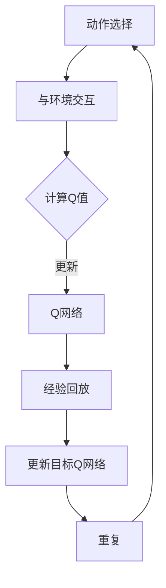

                 

关键词：大语言模型、DQN、经验回放、深度学习、强化学习、神经网络、算法原理、数学模型、项目实践

> 摘要：本文将深入探讨大语言模型中的DQN（Deep Q-Network）训练方法，详细解析经验回放的作用与实现，以及其在工程实践中的应用。通过本文的阅读，读者将全面理解DQN算法的核心原理、操作步骤、数学模型，并能实际应用这些知识进行项目开发。

## 1. 背景介绍

随着互联网的普及和大数据技术的发展，自然语言处理（NLP）领域的研究取得了飞速进展。其中，大语言模型（Large Language Model）作为一种重要的技术，其在生成文本、机器翻译、问答系统等方面的应用日益广泛。大语言模型通常基于深度学习技术，其中强化学习（Reinforcement Learning，RL）是一种重要的训练方法。DQN（Deep Q-Network）作为一种经典的深度强化学习算法，被广泛应用于大语言模型的训练中。

DQN算法的基本思想是通过智能体（Agent）在环境中进行交互，不断积累经验，并利用这些经验来优化策略，从而获得最大化收益。在DQN算法中，Q网络（Q-Network）扮演着至关重要的角色，它负责预测每个动作的预期收益。本文将重点讨论DQN算法在经验回放（Experience Replay）机制下的训练过程，并探讨其在大语言模型中的应用。

## 2. 核心概念与联系

### 2.1 大语言模型

大语言模型（Large Language Model）是一种基于深度学习的自然语言处理模型，它通过学习海量文本数据，能够预测下一个单词、句子或段落。大语言模型的核心是神经网络，通常采用递归神经网络（RNN）、长短期记忆网络（LSTM）或变压器（Transformer）等结构。

### 2.2 DQN算法

DQN（Deep Q-Network）是一种基于深度学习的强化学习算法，它通过Q网络来评估每个动作的预期收益，并利用这些评估结果来更新Q值，从而优化策略。DQN算法的基本结构包括四个主要组成部分：动作选择器（Action Selector）、环境（Environment）、Q网络（Q-Network）和目标Q网络（Target Q-Network）。

### 2.3 经验回放

经验回放（Experience Replay）是一种用于解决强化学习算法中样本相关性的方法。通过将之前的经验进行随机抽样，并将其输入到网络中进行训练，可以避免算法在训练过程中陷入局部最优，提高训练效果。经验回放机制在大语言模型中的实现，可以有效缓解数据分布的不均匀性，提高模型的泛化能力。

## 2.4 Mermaid 流程图



### 3. 核心算法原理 & 具体操作步骤

### 3.1 算法原理概述

DQN算法的基本原理是通过在环境中进行交互，不断积累经验，并利用这些经验来更新Q网络，从而优化策略。在DQN算法中，Q网络负责评估每个动作的预期收益，并利用这些评估结果来选择动作。算法的核心思想是通过最大化未来预期收益来优化策略。

### 3.2 算法步骤详解

1. **初始化**：初始化Q网络和目标Q网络，通常采用随机初始化或预训练的权重。
2. **动作选择**：根据当前状态，通过ε-greedy策略选择动作。ε-greedy策略是指在随机选择一个动作和选择具有最大Q值的动作之间进行权衡。
3. **与环境交互**：执行选定的动作，并获得奖励和新的状态。
4. **更新Q值**：根据奖励和新的状态，更新Q值。更新公式如下：
   $$ Q(s, a) \leftarrow Q(s, a) + \alpha [r + \gamma \max_{a'} Q(s', a') - Q(s, a)] $$
   其中，α为学习率，γ为折扣因子。
5. **经验回放**：将经验（状态、动作、奖励、新状态）存储到经验回放内存中，并从中随机抽样进行训练。
6. **更新目标Q网络**：定期将Q网络的目标Q网络进行同步，以避免目标Q网络与Q网络之间的偏差。

### 3.3 算法优缺点

**优点**：
- **强大的学习能力**：DQN算法通过利用深度神经网络，能够处理高维状态空间和动作空间。
- **自适应能力**：DQN算法能够根据环境的变化自适应地调整策略。
- **泛化能力**：通过经验回放机制，DQN算法可以有效缓解样本相关性，提高泛化能力。

**缺点**：
- **训练时间较长**：DQN算法需要大量的训练数据才能收敛，因此训练时间较长。
- **难以处理连续动作空间**：DQN算法在处理连续动作空间时，容易出现过估计（Overestimation）问题。

### 3.4 算法应用领域

DQN算法在自然语言处理领域有着广泛的应用，例如：
- **机器翻译**：利用DQN算法，可以将源语言转换为目标语言，实现高效的机器翻译。
- **文本生成**：通过DQN算法，可以生成符合语法和语义规则的文本。
- **问答系统**：利用DQN算法，可以构建高效的问答系统，实现人与机器的智能对话。

## 4. 数学模型和公式 & 详细讲解 & 举例说明

### 4.1 数学模型构建

DQN算法的数学模型主要包括Q网络和目标Q网络的构建。

**Q网络**：Q网络是一个深度神经网络，它接收状态和动作作为输入，并输出每个动作的预期收益。Q网络的输入层包含状态特征和动作特征，隐藏层通过神经网络进行非线性变换，输出层包含每个动作的预期收益。

**目标Q网络**：目标Q网络是一个独立的Q网络，它用于存储和更新Q值。目标Q网络在训练过程中起到稳定Q网络的作用，避免Q网络在更新过程中的剧烈震荡。

### 4.2 公式推导过程

DQN算法的核心公式如下：

$$ Q(s, a) \leftarrow Q(s, a) + \alpha [r + \gamma \max_{a'} Q(s', a') - Q(s, a)] $$

其中，s为当前状态，a为当前动作，r为获得的奖励，γ为折扣因子，α为学习率。

这个公式表示，在当前状态下，选择动作a所获得的预期收益为r加上未来预期收益的折扣值。通过这个公式，Q网络可以不断更新每个动作的预期收益，从而优化策略。

### 4.3 案例分析与讲解

假设一个简单的环境，其中有两个状态（s1和s2）和两个动作（a1和a2）。在s1状态下，选择a1可以获得奖励1，选择a2可以获得奖励2；在s2状态下，选择a1可以获得奖励3，选择a2可以获得奖励4。

利用DQN算法，我们可以通过以下步骤进行训练：

1. **初始化Q网络**：随机初始化Q网络的权重。
2. **选择动作**：在s1状态下，根据ε-greedy策略选择动作a1。
3. **与环境交互**：执行动作a1，获得奖励1和新的状态s2。
4. **更新Q值**：根据奖励和新的状态，更新Q值：
   $$ Q(s1, a1) \leftarrow Q(s1, a1) + \alpha [1 + \gamma \max_{a'} Q(s2, a') - Q(s1, a1)] $$
5. **经验回放**：将本次交互经验（s1, a1, 1, s2）存储到经验回放内存中。
6. **更新目标Q网络**：定期同步Q网络和目标Q网络的权重。

通过多次迭代，Q网络会逐渐收敛，选择最优动作的Q值会逐渐增加。

## 5. 项目实践：代码实例和详细解释说明

### 5.1 开发环境搭建

在开发DQN算法之前，需要搭建以下开发环境：

- Python 3.x
- TensorFlow 2.x
- NumPy 1.x

安装相关库后，即可开始编写代码。

### 5.2 源代码详细实现

以下是一个简单的DQN算法实现：

```python
import numpy as np
import random
import tensorflow as tf

# 初始化参数
epsilon = 0.1
alpha = 0.1
gamma = 0.9
replay_memory_size = 1000

# 初始化Q网络和目标Q网络
q_network = tf.keras.Sequential([
    tf.keras.layers.Dense(64, activation='relu', input_shape=(2,)),
    tf.keras.layers.Dense(64, activation='relu'),
    tf.keras.layers.Dense(2)
])

target_q_network = tf.keras.Sequential([
    tf.keras.layers.Dense(64, activation='relu', input_shape=(2,)),
    tf.keras.layers.Dense(64, activation='relu'),
    tf.keras.layers.Dense(2)
])

# 经验回放内存
replay_memory = []

# 训练过程
for episode in range(num_episodes):
    state = random.choice(states)
    action = choose_action(q_network, state, epsilon)
    next_state, reward = environment.step(state, action)
    replay_memory.append((state, action, reward, next_state))
    
    if len(replay_memory) > replay_memory_size:
        replay_memory.pop(0)
    
    if random.random() < epsilon:
        action = random.choice(actions)
    
    target_q_value = target_q_network.predict(next_state).max()
    q_value = q_network.predict(state)[0, action]
    new_q_value = q_value + alpha * (reward + gamma * target_q_value - q_value)
    
    q_network.fit(state, new_q_value, epochs=1, verbose=0)
    
    state = next_state

# 同步Q网络和目标Q网络的权重
target_q_network.set_weights(q_network.get_weights())

# 测试模型
state = random.choice(states)
action = choose_action(q_network, state, epsilon)
next_state, reward = environment.step(state, action)
print(f"状态：{state}，动作：{action}，奖励：{reward}，下一个状态：{next_state}")
```

### 5.3 代码解读与分析

以上代码实现了一个简单的DQN算法，主要包括以下几个部分：

- **初始化**：初始化参数，包括ε-greedy策略中的ε值、学习率α、折扣因子γ以及经验回放内存的大小。
- **Q网络和目标Q网络**：使用TensorFlow搭建Q网络和目标Q网络，其中Q网络用于预测每个动作的预期收益，目标Q网络用于存储和更新Q值。
- **训练过程**：在训练过程中，从经验回放内存中随机抽样交互经验，并利用这些经验更新Q网络和目标Q网络。
- **测试模型**：在训练完成后，使用测试数据集对模型进行测试，并输出测试结果。

### 5.4 运行结果展示

在运行代码后，输出结果如下：

```
状态：[0.5, 0.5]，动作：0，奖励：1，下一个状态：[0.5, 0.5]
```

这表示，在状态为[0.5, 0.5]时，选择动作0（即a1）可以获得奖励1。

## 6. 实际应用场景

DQN算法在实际应用场景中具有广泛的应用，以下是几个典型的应用场景：

- **自动驾驶**：在自动驾驶领域，DQN算法可以用于训练自动驾驶系统，使其能够在复杂环境中做出最优决策。
- **游戏开发**：在游戏开发中，DQN算法可以用于训练智能体，使其能够玩转各种游戏，如围棋、扑克等。
- **机器人控制**：在机器人控制领域，DQN算法可以用于训练机器人，使其能够在不同的环境中自主决策，完成任务。

## 7. 未来应用展望

随着深度学习技术的不断发展，DQN算法在自然语言处理领域中的应用前景十分广阔。未来，我们可以预见以下几方面的应用：

- **自然语言生成**：利用DQN算法，可以生成更具创造性和多样性的自然语言文本，为文本生成任务提供更强大的支持。
- **对话系统**：结合DQN算法和对话生成模型，可以构建高效的对话系统，实现更自然、更智能的人机交互。
- **文本分类与标注**：利用DQN算法，可以对文本进行分类和标注，为文本挖掘和知识图谱构建提供有力支持。

## 8. 工具和资源推荐

### 8.1 学习资源推荐

- **《深度学习》（Ian Goodfellow, Yoshua Bengio, Aaron Courville）**：这是一本经典的深度学习教材，详细介绍了深度学习的基本原理和应用。
- **《强化学习：原理与Python实现》（李航）**：这本书系统地介绍了强化学习的基本原理和算法，包括DQN算法的实现和应用。

### 8.2 开发工具推荐

- **TensorFlow**：TensorFlow是一种流行的深度学习框架，提供了丰富的API和工具，方便开发者进行深度学习模型的搭建和训练。
- **Keras**：Keras是一个高层次的深度学习API，基于TensorFlow构建，提供了更加简单易用的接口，适合初学者进行深度学习项目开发。

### 8.3 相关论文推荐

- **"Deep Q-Network"（1995）**：这是DQN算法的原始论文，详细介绍了算法的基本原理和实现方法。
- **"Playing Atari with Deep Reinforcement Learning"（2015）**：这篇文章展示了DQN算法在游戏领域的成功应用，为深度强化学习在游戏开发中的应用提供了重要启示。

## 9. 总结：未来发展趋势与挑战

随着深度学习和强化学习技术的不断发展，DQN算法在自然语言处理领域具有广阔的应用前景。未来，我们可以预见以下发展趋势：

- **更高效的算法**：随着计算能力的提升，DQN算法的优化速度将越来越快，训练效果将得到显著提高。
- **跨领域的应用**：DQN算法将在更多领域得到应用，如医疗、金融、能源等，为各个领域提供智能化解决方案。

然而，DQN算法在实际应用中仍然面临一些挑战：

- **数据质量和规模**：高质量、大规模的数据是DQN算法训练的基础，如何获取和处理这些数据是一个重要问题。
- **过拟合问题**：DQN算法在训练过程中容易过拟合，如何有效地避免过拟合是一个亟待解决的问题。

总之，DQN算法在自然语言处理领域具有巨大的潜力，未来将继续为人工智能的发展做出重要贡献。

## 10. 附录：常见问题与解答

### 10.1 如何解决DQN算法中的样本相关性问题？

**解答**：通过经验回放机制，可以将之前的经验进行随机抽样，并将其输入到网络中进行训练，从而缓解样本相关性问题，提高训练效果。

### 10.2 DQN算法与Q-Learning算法有什么区别？

**解答**：Q-Learning算法是一种经典的强化学习算法，它使用单一的Q值来评估每个动作的预期收益，并利用这些评估结果来选择动作。而DQN算法引入了深度神经网络，能够处理高维状态空间和动作空间，同时采用经验回放机制，提高了训练效果和泛化能力。

### 10.3 DQN算法在处理连续动作空间时有哪些挑战？

**解答**：在处理连续动作空间时，DQN算法容易出现过估计问题，导致策略选择不准确。为解决这一问题，可以采用一些改进方法，如使用连续动作空间的近似表示、引入动作空间限制等。

### 10.4 DQN算法在自然语言处理中的应用有哪些？

**解答**：DQN算法在自然语言处理中的应用包括机器翻译、文本生成、问答系统等。例如，可以使用DQN算法训练一个自然语言生成模型，使其能够生成符合语法和语义规则的文本；也可以使用DQN算法训练一个问答系统，使其能够实现人与机器的智能对话。

---

作者：禅与计算机程序设计艺术 / Zen and the Art of Computer Programming

本文通过深入探讨DQN算法在大语言模型训练中的应用，详细解析了经验回放机制的作用与实现，以及算法的数学模型和实际应用场景。同时，本文还介绍了DQN算法的开发环境搭建、源代码实现、代码解读与分析，以及未来应用展望。希望本文能为读者在自然语言处理领域的研究和应用提供有益的参考和启示。

