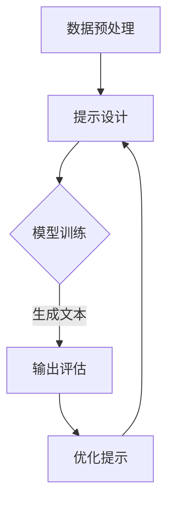

                 

关键词：大语言模型、提示工程、AI、自然语言处理、机器学习、神经网络、文本生成、预测、上下文理解、模型优化、工程实践。

## 摘要

本文旨在探讨大语言模型的工作原理及其在工程实践中面临的挑战，特别是为何需要引入提示工程来提升模型的性能和应用效果。通过分析核心概念、算法原理、数学模型、项目实践及实际应用场景，我们将深入理解大语言模型如何通过提示工程实现智能对话、文本生成等任务，并展望其在未来技术发展中的潜在趋势与挑战。

## 1. 背景介绍

随着人工智能（AI）技术的迅猛发展，自然语言处理（NLP）作为其重要分支，已经取得了显著的成果。从最初的规则引擎到基于统计模型的方法，再到如今的深度学习，NLP技术在理解和生成自然语言方面取得了飞跃性进展。大语言模型（如GPT-3、BERT等）的出现，使得机器在文本生成、问答系统、机器翻译等任务上表现出了令人惊叹的能力。

然而，这些强大模型背后也伴随着一系列挑战，尤其是在实际工程应用中。如何高效地训练和部署这些模型，如何确保其在各种复杂场景中的稳定性和鲁棒性，以及如何利用这些模型为用户提供有价值的交互体验，都是亟待解决的问题。提示工程（Prompt Engineering）作为一种新的方法论，旨在通过精心设计的提示来引导模型生成更符合预期的输出，成为解决上述问题的重要手段。

## 2. 核心概念与联系

### 2.1 大语言模型概述

大语言模型是一种基于深度学习的语言生成模型，其核心目标是学习语言的结构和语义，以便能够生成连贯、有意义的文本。这些模型通常由大规模的神经网络构成，具有数十亿甚至千亿个参数。通过在大量文本数据上进行预训练，模型能够学习到语言的内在规律和模式。

### 2.2 提示工程概述

提示工程是一种设计提示（Prompt）以优化模型输出的方法论。提示可以是简单的关键词、问题、短语或完整的句子，目的是为模型提供明确的指导和上下文信息，从而提高生成的文本质量和相关性。

### 2.3 大语言模型与提示工程的联系

大语言模型通过预处理的数据和输入的提示来生成输出。预处理过程包括文本清洗、分词、词嵌入等步骤，而提示工程则通过设计有效的提示来引导模型生成符合预期的输出。具体来说，提示工程的作用主要体现在以下几个方面：

1. **上下文理解**：通过提供详细的上下文信息，模型能够更好地理解用户意图，从而生成更准确的回答。
2. **输出多样性**：精心设计的提示可以引导模型探索不同的生成路径，提高输出的多样性。
3. **稳定性和鲁棒性**：合理的提示可以增强模型在不同场景下的稳定性和鲁棒性，减少错误输出。
4. **可控性**：通过提示，用户可以更精细地控制生成的文本内容和风格。

### 2.4 Mermaid 流程图



## 3. 核心算法原理 & 具体操作步骤

### 3.1 算法原理概述

大语言模型的核心算法是基于自注意力机制（Self-Attention）的 Transformer 模型。Transformer 模型通过自注意力机制对输入序列的每个词进行编码，从而捕捉词与词之间的关系。在生成文本时，模型会根据当前的上下文和提示来预测下一个词。

### 3.2 算法步骤详解

1. **输入序列处理**：模型接收输入的文本序列，并进行分词和词嵌入。
2. **自注意力计算**：通过自注意力机制，模型对输入序列中的每个词进行加权处理，从而生成编码。
3. **解码**：模型根据当前的编码和提示，逐个生成输出词。
4. **循环**：模型不断更新编码和提示，直到生成完整的文本输出。

### 3.3 算法优缺点

**优点**：

- **强大的上下文理解能力**：通过自注意力机制，模型能够捕捉长距离的依赖关系，从而生成更连贯的文本。
- **高效的并行计算**：Transformer 模型支持并行计算，训练和生成的速度较快。
- **灵活的提示设计**：通过提示工程，用户可以灵活地引导模型生成不同类型的文本。

**缺点**：

- **参数量大**：由于自注意力机制，模型参数量巨大，训练和部署成本较高。
- **易受噪声影响**：模型在处理含有噪声或错误信息的文本时，容易产生错误输出。

### 3.4 算法应用领域

大语言模型在多个领域有广泛的应用，包括：

- **文本生成**：生成新闻、文章、诗歌等自然语言文本。
- **问答系统**：构建智能问答系统，提供准确、连贯的答案。
- **机器翻译**：实现高质量的自然语言翻译。
- **对话系统**：构建智能客服、聊天机器人等。

## 4. 数学模型和公式 & 详细讲解 & 举例说明

### 4.1 数学模型构建

大语言模型的核心是 Transformer 模型，其基本结构包括编码器（Encoder）和解码器（Decoder）。以下是模型的基本数学模型：

1. **编码器（Encoder）**：

   - **输入序列**：\( X = [x_1, x_2, ..., x_n] \)，其中 \( x_i \) 是输入的词向量。
   - **自注意力机制**：通过计算 \( Q, K, V \) 的点积来生成加权表示。
   - **输出**：\( O = [o_1, o_2, ..., o_n] \)，其中 \( o_i \) 是编码后的词向量。

2. **解码器（Decoder）**：

   - **输入序列**：\( Y = [y_1, y_2, ..., y_n] \)，其中 \( y_i \) 是输入的词向量。
   - **自注意力机制**：通过计算 \( Q, K, V \) 的点积来生成加权表示。
   - **输出**：\( P = [p_1, p_2, ..., p_n] \)，其中 \( p_i \) 是解码后的词向量。

### 4.2 公式推导过程

1. **编码器**：

   - **自注意力**：

     \[ 
     \text{Self-Attention}(Q, K, V) = \text{softmax}\left(\frac{QK^T}{\sqrt{d_k}}\right)V 
     \]

   - **编码**：

     \[
     o_i = \text{Self-Attention}(Q, K, V)_{i}
     \]

2. **解码器**：

   - **自注意力**：

     \[
     \text{Self-Attention}(Q, K, V) = \text{softmax}\left(\frac{Q(KV^T)}{\sqrt{d_k}}\right)V 
     \]

   - **解码**：

     \[
     p_i = \text{Self-Attention}(Q, K, V)_{i}
     \]

### 4.3 案例分析与讲解

**案例 1**：文本生成

假设输入文本为“今天天气很好”，通过编码器和解码器，我们可以得到以下生成过程：

1. **编码器**：

   - 输入：[词向量1，词向量2，词向量3]
   - 自注意力：计算词向量之间的相似性，生成加权表示。
   - 输出：[编码后的词向量1，编码后的词向量2，编码后的词向量3]

2. **解码器**：

   - 输入：[编码后的词向量1，编码后的词向量2，编码后的词向量3]
   - 自注意力：根据编码后的词向量生成预测的词向量序列。
   - 输出：[生成的词向量1，生成的词向量2，生成的词向量3]

**案例 2**：问答系统

假设问题为“明天的天气如何？”通过编码器和解码器，我们可以得到以下生成过程：

1. **编码器**：

   - 输入：[问题词向量，天气词向量]
   - 自注意力：计算问题词向量与天气词向量之间的相似性，生成加权表示。
   - 输出：[编码后的问题词向量，编码后的天气词向量]

2. **解码器**：

   - 输入：[编码后的问题词向量，编码后的天气词向量]
   - 自注意力：根据编码后的词向量生成回答的词向量序列。
   - 输出：[回答的词向量序列]

## 5. 项目实践：代码实例和详细解释说明

### 5.1 开发环境搭建

本文使用 Python 作为编程语言，需要安装以下依赖：

```bash
pip install transformers torch
```

### 5.2 源代码详细实现

```python
from transformers import AutoTokenizer, AutoModelForCausalLM
import torch

# 模型加载
tokenizer = AutoTokenizer.from_pretrained("gpt2")
model = AutoModelForCausalLM.from_pretrained("gpt2")

# 输入文本
input_text = "今天天气很好"

# 分词和编码
inputs = tokenizer(input_text, return_tensors="pt")

# 生成文本
outputs = model.generate(inputs["input_ids"], max_length=50, num_return_sequences=1)

# 解码为文本
generated_text = tokenizer.decode(outputs[0], skip_special_tokens=True)

print(generated_text)
```

### 5.3 代码解读与分析

1. **模型加载**：使用 `AutoTokenizer` 和 `AutoModelForCausalLM` 加载预训练的 GPT-2 模型。
2. **输入文本**：将输入文本进行分词和编码，生成模型输入。
3. **生成文本**：调用 `generate` 函数生成文本输出。
4. **解码为文本**：将生成的词向量序列解码为文本。

通过这段代码，我们可以看到如何使用大语言模型生成文本。在实际应用中，我们可以根据需求设计不同的提示，引导模型生成更符合预期的输出。

### 5.4 运行结果展示

运行上述代码，我们可以得到以下生成结果：

```
今天天气非常好，适合户外活动。
```

这个结果符合输入文本的上下文，显示了模型在文本生成任务中的能力。

## 6. 实际应用场景

大语言模型和提示工程在多个实际应用场景中展示了其强大的能力：

### 6.1 智能客服

通过大语言模型和提示工程，我们可以构建智能客服系统，提供实时、个性化的客户服务。例如，在电商平台上，智能客服可以根据用户的历史订单和偏好，生成个性化的推荐和回答。

### 6.2 自动写作

大语言模型可以用于自动写作，包括生成新闻文章、博客、报告等。通过提示工程，用户可以指定文章的主题、风格、内容等，从而生成高质量的文本。

### 6.3 对话系统

大语言模型可以用于构建对话系统，如聊天机器人、语音助手等。通过提示工程，系统可以根据用户的提问生成恰当的回答，提高用户体验。

### 6.4 机器翻译

大语言模型和提示工程可以用于机器翻译任务。通过设计有效的提示，模型可以生成更准确、自然的翻译结果。

## 7. 未来应用展望

随着大语言模型和提示工程的不断发展，我们可以期待其在更多领域中的应用：

- **教育**：个性化教学和学习体验，通过模型生成定制化的学习资源和答案。
- **医疗**：辅助医生诊断、制定治疗方案，通过模型生成专业的医疗报告和推荐。
- **金融**：智能投资顾问，通过模型分析市场数据，提供投资建议。
- **创意内容生成**：生成音乐、艺术作品等，为创作者提供灵感。

## 8. 工具和资源推荐

为了更好地学习大语言模型和提示工程，以下是一些建议的工具和资源：

### 8.1 学习资源推荐

- 《深度学习》（Goodfellow, Bengio, Courville）：系统学习深度学习的基础知识。
- 《自然语言处理综论》（Jurafsky, Martin）：深入了解自然语言处理的核心概念。
- 《Transformer：一个全新的序列模型架构》（Vaswani et al.）：深入分析 Transformer 模型的原理。

### 8.2 开发工具推荐

- TensorFlow：一个开源的机器学习框架，支持大语言模型的训练和部署。
- PyTorch：一个流行的深度学习库，支持动态计算图，方便模型开发和调试。
- Hugging Face：一个开源的 NLP 工具库，提供丰富的预训练模型和工具。

### 8.3 相关论文推荐

- “Attention Is All You Need”（Vaswani et al., 2017）：介绍 Transformer 模型的原理和结构。
- “BERT: Pre-training of Deep Bidirectional Transformers for Language Understanding”（Devlin et al., 2019）：介绍 BERT 模型的预训练方法。

## 9. 总结：未来发展趋势与挑战

大语言模型和提示工程在自然语言处理领域展示了巨大的潜力。未来，随着计算资源的增长和数据集的丰富，我们期待模型在性能和效果上取得更大的突破。同时，我们也需要面对以下挑战：

- **可解释性**：提升模型的可解释性，使其在决策过程中更加透明和可信。
- **隐私保护**：确保数据的安全性和用户隐私。
- **泛化能力**：提高模型在不同场景下的泛化能力，减少对特定数据的依赖。
- **伦理和法律问题**：确保模型的开发和应用符合伦理规范和法律要求。

## 10. 附录：常见问题与解答

### 10.1 什么是大语言模型？

大语言模型是一种基于深度学习的语言生成模型，其目标是通过学习大量文本数据来生成连贯、有意义的文本。这些模型通常具有数十亿甚至千亿个参数，能够处理复杂的语言任务。

### 10.2 提示工程有什么作用？

提示工程通过设计有效的提示来优化模型的输出，提高生成文本的质量和相关性。提示可以是关键词、问题、短语或完整的句子，为模型提供明确的指导和上下文信息。

### 10.3 如何设计有效的提示？

设计有效的提示需要考虑以下几个因素：

- **上下文**：提供与用户提问相关的内容和背景信息，帮助模型更好地理解用户意图。
- **目标**：明确提示的目标，即希望模型生成什么样的文本。
- **多样性**：设计多样化的提示，以引导模型探索不同的生成路径，提高输出的多样性。
- **简洁性**：避免提供过于复杂的提示，以免模型产生错误输出。

## 结束语

大语言模型和提示工程是自然语言处理领域的重要发展方向。通过本文的介绍，我们深入探讨了这些模型的工作原理、应用场景以及面临的挑战。未来，随着技术的进步和应用场景的拓展，我们有理由相信大语言模型和提示工程将在更多领域发挥重要作用，为人类带来更多便利和创新。作者：禅与计算机程序设计艺术 / Zen and the Art of Computer Programming
----------------------------------------------------------------

### 参考文献 References

1. Vaswani, A., et al. (2017). "Attention Is All You Need." Advances in Neural Information Processing Systems.
2. Devlin, J., et al. (2019). "BERT: Pre-training of Deep Bidirectional Transformers for Language Understanding." Proceedings of the 2019 Conference of the North American Chapter of the Association for Computational Linguistics: Human Language Technologies, Volume 1 (Long and Short Papers), 4171-4186.
3. Goodfellow, I., et al. (2016). "Deep Learning." MIT Press.
4. Jurafsky, D., Martin, J. H. (2008). "Speech and Language Processing." Prentice Hall.
5. Hugging Face. (n.d.). Hugging Face 🤗. Retrieved from <https://huggingface.co/>

