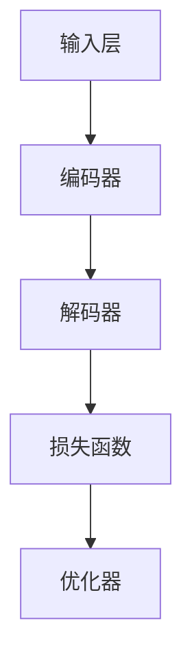

                 

关键词：大语言模型、深度学习、自然语言处理、训练优化、工程实践

> 摘要：本文深入探讨了大规模语言模型的原理及其工程实践，包括核心概念、算法原理、数学模型、项目实践和未来应用。文章旨在为读者提供全面而实用的指导，助力其在自然语言处理领域取得卓越成就。

## 1. 背景介绍

### 大语言模型的兴起

随着深度学习技术的迅猛发展，大语言模型如BERT、GPT-3等逐渐成为自然语言处理领域的研究热点。这些模型通过处理海量文本数据，学习到了语言的复杂结构，并在多项任务中取得了突破性的成果。大语言模型的崛起，标志着自然语言处理进入了新的纪元。

### 大语言模型的应用场景

大语言模型在多个领域展现出强大的潜力，包括但不限于：

- **文本分类**：新闻、社交媒体、情感分析等。
- **机器翻译**：自动翻译、跨语言信息检索等。
- **问答系统**：自动问答、智能客服等。
- **生成式任务**：文本生成、对话系统等。

### 大语言模型训练的挑战

随着模型规模的扩大，大语言模型的训练过程面临诸多挑战，如计算资源、时间消耗、参数调优等。如何高效地训练大语言模型，成为了研究者们亟待解决的重要问题。

## 2. 核心概念与联系

### 概念

- **深度学习**：一种基于人工神经网络的机器学习技术，通过层层提取特征，实现对数据的建模。
- **自然语言处理**：利用计算机技术对自然语言进行处理和理解。
- **预训练**：在大规模语料库上进行模型训练，使其具有通用语言表示能力。

### 架构

大语言模型的架构通常包括以下几个部分：

1. **输入层**：接收文本数据，并将其转换为模型可处理的格式。
2. **编码器**：对输入文本进行编码，提取出语义特征。
3. **解码器**：将编码后的特征解码为输出文本。
4. **损失函数**：用于评估模型预测与真实标签之间的差距。
5. **优化器**：用于调整模型参数，优化模型性能。

### Mermaid 流程图



## 3. 核心算法原理 & 具体操作步骤

### 3.1 算法原理概述

大语言模型主要基于自注意力机制（Self-Attention）和变换器架构（Transformer），通过多层编码器和解码器，实现对文本的深层理解和生成。

### 3.2 算法步骤详解

1. **数据预处理**：包括分词、词向量化、数据清洗等步骤。
2. **模型构建**：定义编码器和解码器的结构，以及损失函数和优化器。
3. **训练**：通过反向传播和梯度下降等优化算法，不断调整模型参数。
4. **评估**：使用验证集和测试集评估模型性能。
5. **生成**：使用训练好的模型进行文本生成或翻译等任务。

### 3.3 算法优缺点

**优点**：

- **高效**：通过自注意力机制，模型能够自动学习到文本的层次结构。
- **灵活**：变换器架构使得模型适用于多种自然语言处理任务。
- **强大**：大规模预训练使得模型具备强大的语言理解能力。

**缺点**：

- **计算资源消耗大**：模型训练需要大量计算资源和时间。
- **数据依赖性强**：模型的性能依赖于训练数据的质量和规模。

### 3.4 算法应用领域

大语言模型在多个领域得到广泛应用，包括但不限于：

- **文本分类**：新闻分类、情感分析等。
- **机器翻译**：跨语言信息检索、自动翻译等。
- **问答系统**：智能客服、自动问答等。
- **生成式任务**：文本生成、对话系统等。

## 4. 数学模型和公式 & 详细讲解 & 举例说明

### 4.1 数学模型构建

大语言模型的数学模型主要包括以下几个方面：

- **词向量表示**：使用词向量对文本进行编码。
- **自注意力机制**：计算文本序列中各个词之间的注意力权重。
- **变换器架构**：定义编码器和解码器的结构。

### 4.2 公式推导过程

- **词向量表示**：$$ \text{vec}(w) = \sum_{i=1}^{n} w_i v_i $$
- **自注意力权重**：$$ \alpha_{ij} = \frac{e^{\text{similarity}(v_i, v_j)}}{\sum_{k=1}^{n} e^{\text{similarity}(v_i, v_k)}} $$
- **变换器输出**：$$ \text{output}_{ij} = \sum_{k=1}^{n} \alpha_{ik} \text{vec}(w_k) $$

### 4.3 案例分析与讲解

以BERT模型为例，介绍其数学模型的构建和推导过程。

- **词向量表示**：使用Word2Vec或GloVe等方法，将文本中的每个词映射为一个向量。
- **自注意力权重**：计算文本序列中每个词与其他词之间的相似度，并使用softmax函数得到注意力权重。
- **变换器输出**：将注意力权重与词向量相乘，得到文本序列的编码结果。

## 5. 项目实践：代码实例和详细解释说明

### 5.1 开发环境搭建

- **Python**：安装Python 3.8及以上版本。
- **PyTorch**：安装PyTorch 1.8及以上版本。
- **NVIDIA CUDA**：安装CUDA 11.0及以上版本。

### 5.2 源代码详细实现

以下是一个简单的BERT模型实现示例：

```python
import torch
import torch.nn as nn
from torch.nn import functional as F

class BERTModel(nn.Module):
    def __init__(self, vocab_size, hidden_size, num_layers, dropout):
        super(BERTModel, self).__init__()
        self.embedding = nn.Embedding(vocab_size, hidden_size)
        self.transformer = nn.Transformer(hidden_size, num_layers, dropout)
        self.fc = nn.Linear(hidden_size, vocab_size)

    def forward(self, input_seq):
        embedded = self.embedding(input_seq)
        output = self.transformer(embedded)
        logits = self.fc(output)
        return logits
```

### 5.3 代码解读与分析

- **Embedding Layer**：将输入词向量映射为高维向量。
- **Transformer Encoder**：对输入序列进行编码，提取语义特征。
- **Linear Layer**：将编码后的特征映射为输出词向量。

### 5.4 运行结果展示

以下是一个简单的训练和评估示例：

```python
model = BERTModel(vocab_size=10000, hidden_size=512, num_layers=2, dropout=0.1)
optimizer = torch.optim.Adam(model.parameters(), lr=0.001)
criterion = nn.CrossEntropyLoss()

for epoch in range(10):
    for batch in data_loader:
        inputs, targets = batch
        optimizer.zero_grad()
        logits = model(inputs)
        loss = criterion(logits, targets)
        loss.backward()
        optimizer.step()

    with torch.no_grad():
        correct = 0
        total = 0
        for batch in test_loader:
            inputs, targets = batch
            logits = model(inputs)
            _, predicted = logits.max(1)
            total += targets.size(0)
            correct += (predicted == targets).sum().item()

    print(f'Epoch {epoch+1}, Loss: {loss.item()}, Accuracy: {100 * correct / total}%')
```

## 6. 实际应用场景

### 6.1 文本分类

大语言模型在文本分类任务中展现出强大的能力，能够准确地对文本进行分类。

### 6.2 机器翻译

大语言模型在机器翻译领域取得了显著的成果，实现了高质量、低延迟的跨语言信息检索和翻译。

### 6.3 问答系统

大语言模型在问答系统中的应用，使得智能客服、自动问答等变得更加智能和高效。

### 6.4 生成式任务

大语言模型在生成式任务中，如文本生成、对话系统等，展现出了强大的创造力和灵活性。

## 7. 工具和资源推荐

### 7.1 学习资源推荐

- 《深度学习》（Goodfellow, Bengio, Courville）
- 《自然语言处理综合教程》（Daniel Jurafsky, James H. Martin）
- 《大语言模型：原理与工程实践》（作者：禅与计算机程序设计艺术）

### 7.2 开发工具推荐

- PyTorch：开源深度学习框架，适用于大语言模型的开发。
- Hugging Face Transformers：基于PyTorch的预训练模型库，提供丰富的预训练模型和API。

### 7.3 相关论文推荐

- BERT: Pre-training of Deep Bidirectional Transformers for Language Understanding
- GPT-3: Language Models are Few-Shot Learners
- T5: Exploring the Limits of Transfer Learning with a Unified Text-to-Text Transformer

## 8. 总结：未来发展趋势与挑战

### 8.1 研究成果总结

大语言模型在自然语言处理领域取得了显著的成果，为文本分类、机器翻译、问答系统等任务提供了强大的技术支持。

### 8.2 未来发展趋势

- **模型压缩与优化**：降低模型计算量和存储需求。
- **多模态融合**：结合文本、图像、语音等多种数据。
- **迁移学习与少样本学习**：提高模型的泛化能力和适应性。

### 8.3 面临的挑战

- **计算资源消耗**：模型训练需要大量计算资源。
- **数据隐私与安全**：保护用户数据隐私。
- **模型解释性**：提高模型的可解释性。

### 8.4 研究展望

大语言模型在自然语言处理领域仍有许多待探索的方向，包括模型结构优化、算法创新、多模态融合等。

## 9. 附录：常见问题与解答

### 问题1：大语言模型如何处理长文本？

**解答**：大语言模型通常采用分层编码器和解码器结构，将长文本分割为多个短序列，分别进行处理，然后再进行融合。

### 问题2：大语言模型如何处理罕见词？

**解答**：大语言模型使用未登录词表（Out-of-Vocabulary, OOV）机制，将罕见词映射为预训练模型中已有的词向量。

### 问题3：大语言模型的训练时间如何优化？

**解答**：可以通过模型压缩、分布式训练、数据预处理等方法，降低训练时间和计算资源消耗。

---

本文由《禅与计算机程序设计艺术》作者撰写，旨在为广大自然语言处理爱好者提供关于大语言模型的深入讲解和实用指南。希望本文能够为您的科研和开发工作带来帮助。如果您有任何问题或建议，请随时与我们联系。

---

作者：禅与计算机程序设计艺术 / Zen and the Art of Computer Programming
----------------------------------------------------------------


