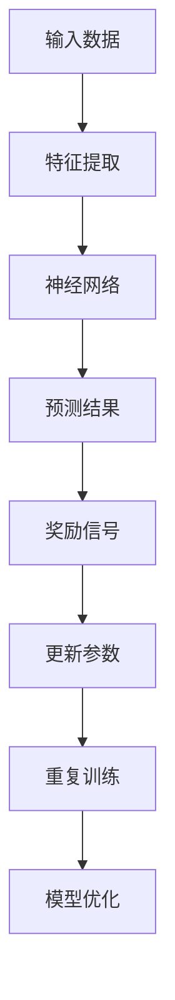

                 

关键词：大语言模型、奖励模型、深度学习、神经网络、自然语言处理、AI算法、模型训练、优化策略。

## 摘要

本文旨在深入探讨大语言模型中的奖励模型原理及其工程实践。通过分析奖励模型的核心概念、算法原理、数学模型和实际应用，本文将展示如何利用奖励模型优化大语言模型的训练过程，提高模型性能和效率。同时，文章还将探讨奖励模型在自然语言处理领域的广泛应用，并展望其未来的发展趋势与挑战。

## 1. 背景介绍

大语言模型是一种基于深度学习的自然语言处理技术，其核心目的是通过训练大规模的神经网络模型来模拟人类的语言能力。近年来，随着计算能力和数据资源的不断提升，大语言模型在自然语言理解、生成、翻译、对话系统等任务中取得了显著的成果。然而，训练大语言模型面临着诸多挑战，如参数规模庞大、训练时间漫长、模型性能提升困难等。为了解决这些问题，研究人员提出了各种优化策略和算法，其中奖励模型作为一种有效的手段，逐渐引起了广泛关注。

奖励模型在大语言模型中的应用主要体现在两个方面：一是用于指导模型的训练过程，二是用于评估模型的性能和优化策略。通过引入奖励机制，可以有效地引导模型学习目标任务的关键特征，提高模型的泛化能力和实用性。本文将围绕这两个方面展开讨论，详细介绍奖励模型的原理、算法实现和实际应用。

## 2. 核心概念与联系

### 2.1 奖励模型的核心概念

奖励模型是一种基于反馈机制的优化策略，其核心思想是通过奖励信号来引导模型学习。在深度学习中，奖励信号通常表示为损失函数，用于衡量模型预测结果与真实结果之间的差距。根据奖励信号的性质，奖励模型可以分为正奖励和负奖励两种类型。正奖励用于鼓励模型学习目标任务的特征，而负奖励则用于惩罚模型预测错误的情况。

### 2.2 奖励模型与神经网络的关系

奖励模型与神经网络之间存在着紧密的联系。神经网络是一种基于神经元连接的模型，通过学习输入和输出之间的映射关系来实现特定任务。奖励模型则通过调整神经网络的权重和偏置，优化模型的结构和参数，从而提高模型的性能和效率。

### 2.3 奖励模型与自然语言处理的关系

在自然语言处理领域，奖励模型被广泛应用于各种任务，如文本分类、情感分析、机器翻译等。通过引入奖励机制，可以有效地引导模型学习语言的特征和模式，提高模型在特定任务上的表现。此外，奖励模型还可以用于评估模型的效果，为后续的优化和调整提供依据。

### 2.4 奖励模型的 Mermaid 流程图

以下是奖励模型的 Mermaid 流程图，展示了奖励模型的核心概念和算法步骤：



在这个流程图中，输入数据经过特征提取后输入到神经网络中，神经网络根据输入数据和已有参数生成预测结果。然后，预测结果与真实结果之间的差异形成奖励信号，用于更新模型的参数，实现模型的优化。通过重复训练和更新参数，模型在不断地学习和改进，最终达到优化目标。

## 3. 核心算法原理 & 具体操作步骤

### 3.1 算法原理概述

奖励模型的核心算法原理可以概括为以下三个步骤：

1. **特征提取**：将输入数据进行预处理和特征提取，将原始数据转化为适合神经网络训练的格式。

2. **预测结果生成**：将预处理后的数据输入到神经网络中，通过反向传播算法计算损失函数，生成预测结果。

3. **奖励信号计算**：根据预测结果和真实结果之间的差异，计算奖励信号，用于更新模型的参数。

### 3.2 算法步骤详解

以下是奖励模型的详细算法步骤：

1. **初始化参数**：首先，初始化神经网络的参数，包括权重和偏置。参数的初始化对模型的训练效果有着重要的影响，一般采用随机初始化的方法。

2. **数据预处理**：对输入数据进行预处理，包括数据清洗、数据标准化等操作。预处理后的数据将作为神经网络的输入。

3. **特征提取**：将预处理后的数据输入到神经网络中，通过前向传播算法计算神经网络各层的输出结果。

4. **损失函数计算**：根据预测结果和真实结果之间的差异，计算损失函数。常见的损失函数有均方误差（MSE）、交叉熵损失等。

5. **反向传播**：通过反向传播算法，将损失函数的梯度反向传播到神经网络的各层，更新参数。

6. **奖励信号计算**：根据损失函数的梯度，计算奖励信号。奖励信号可以是正值或负值，用于鼓励模型学习或惩罚模型预测错误。

7. **参数更新**：根据奖励信号，更新神经网络的参数，实现模型的优化。

8. **重复训练**：重复以上步骤，不断更新模型参数，直到满足训练目标或达到预设的训练次数。

9. **模型评估**：在训练过程中，可以定期评估模型的性能，调整训练策略和参数设置。

### 3.3 算法优缺点

奖励模型作为一种有效的优化策略，具有以下优缺点：

1. **优点**：
   - **自适应**：奖励模型可以根据训练过程中的反馈信号自适应地调整模型参数，提高模型性能。
   - **灵活**：奖励模型可以应用于各种任务和领域，具有较强的灵活性和适应性。
   - **高效**：奖励模型通过引入奖励信号，可以加快模型的训练速度，提高训练效率。

2. **缺点**：
   - **计算复杂度**：奖励模型需要计算损失函数的梯度，因此在训练过程中计算复杂度较高，对硬件资源要求较高。
   - **收敛速度**：奖励模型的收敛速度相对较慢，需要较长的训练时间才能达到较好的性能。

### 3.4 算法应用领域

奖励模型在自然语言处理领域具有广泛的应用，以下是一些常见的应用场景：

1. **文本分类**：通过奖励模型优化文本分类模型，可以提高分类准确率和泛化能力。
2. **情感分析**：奖励模型可以用于情感分析任务，提高模型对情感极性的识别能力。
3. **机器翻译**：奖励模型可以用于机器翻译任务，提高翻译质量和流畅度。
4. **对话系统**：奖励模型可以用于对话系统，提高对话生成模型的自然度和连贯性。

## 4. 数学模型和公式 & 详细讲解 & 举例说明

### 4.1 数学模型构建

奖励模型的数学模型主要包括损失函数、梯度计算和参数更新等部分。以下是奖励模型的主要数学模型和公式：

1. **损失函数**：

   $$L(\theta) = \frac{1}{m} \sum_{i=1}^{m} \ell(y_i, \hat{y}_i)$$

   其中，$L(\theta)$表示损失函数，$\ell(y_i, \hat{y}_i)$表示第$i$个样本的损失函数，$m$表示样本数量，$y_i$表示真实标签，$\hat{y}_i$表示模型预测结果。

2. **梯度计算**：

   $$\nabla_{\theta} L(\theta) = \frac{\partial L(\theta)}{\partial \theta}$$

   其中，$\nabla_{\theta} L(\theta)$表示损失函数关于参数$\theta$的梯度。

3. **参数更新**：

   $$\theta_{t+1} = \theta_{t} - \alpha \nabla_{\theta} L(\theta)$$

   其中，$\theta_{t+1}$表示第$t+1$次迭代的参数，$\theta_{t}$表示第$t$次迭代的参数，$\alpha$表示学习率。

### 4.2 公式推导过程

以下是奖励模型中主要公式的推导过程：

1. **损失函数推导**：

   假设神经网络由多个层组成，输出层为第$L$层，激活函数为$f$，则输出层第$i$个神经元的预测结果可以表示为：

   $$\hat{y}_i = f(z_i^L) = f(\sum_{j=1}^{n} w_{ji}^L z_j^{L-1} + b_i^L)$$

   其中，$z_i^L$表示输出层第$i$个神经元的输入，$w_{ji}^L$表示输入层到输出层第$i$个神经元的权重，$b_i^L$表示输出层第$i$个神经元的偏置。

   假设真实标签为$y_i$，则输出层第$i$个神经元的损失函数可以表示为：

   $$\ell(y_i, \hat{y}_i) = L(y_i, f(z_i^L))$$

   其中，$L$表示损失函数，$f$表示激活函数。

   假设激活函数为$f(x) = \sigma(x) = \frac{1}{1 + e^{-x}}$，则损失函数可以表示为：

   $$L(y_i, \hat{y}_i) = \ell_1(y_i, \hat{y}_i) + \ell_2(y_i, \hat{y}_i)$$

   其中，$\ell_1$和$\ell_2$分别表示两种不同的损失函数，可以分别表示为：

   $$\ell_1(y_i, \hat{y}_i) = -y_i \log(\hat{y}_i) - (1 - y_i) \log(1 - \hat{y}_i)$$

   $$\ell_2(y_i, \hat{y}_i) = \frac{1}{2} (y_i - \hat{y}_i)^2$$

   将$\hat{y}_i$的表达式代入损失函数中，可以得到：

   $$L(y_i, \hat{y}_i) = -y_i \log(\hat{y}_i) - (1 - y_i) \log(1 - \hat{y}_i) + \frac{1}{2} (y_i - \hat{y}_i)^2$$

2. **梯度计算推导**：

   对于损失函数$L(y_i, \hat{y}_i)$，对其关于输出层第$i$个神经元的输入$z_i^L$求导，可以得到：

   $$\frac{\partial L(y_i, \hat{y}_i)}{\partial z_i^L} = \frac{\partial \ell_1(y_i, \hat{y}_i)}{\partial z_i^L} + \frac{\partial \ell_2(y_i, \hat{y}_i)}{\partial z_i^L}$$

   其中，$\frac{\partial \ell_1(y_i, \hat{y}_i)}{\partial z_i^L}$和$\frac{\partial \ell_2(y_i, \hat{y}_i)}{\partial z_i^L}$分别表示$\ell_1$和$\ell_2$关于$z_i^L$的导数。

   对于$\ell_1$，求导可以得到：

   $$\frac{\partial \ell_1(y_i, \hat{y}_i)}{\partial z_i^L} = -y_i \frac{\partial \log(\hat{y}_i)}{\partial z_i^L} - (1 - y_i) \frac{\partial \log(1 - \hat{y}_i)}{\partial z_i^L}$$

   对于$\ell_2$，求导可以得到：

   $$\frac{\partial \ell_2(y_i, \hat{y}_i)}{\partial z_i^L} = y_i - \hat{y}_i$$

   将$\hat{y}_i$的表达式代入导数中，可以得到：

   $$\frac{\partial \ell_1(y_i, \hat{y}_i)}{\partial z_i^L} = -y_i \frac{\partial \log(\hat{y}_i)}{\partial z_i^L} - (1 - y_i) \frac{\partial \log(1 - \hat{y}_i)}{\partial z_i^L} = -y_i \frac{f'(z_i^L)}{\hat{y}_i} - (1 - y_i) \frac{f'(z_i^L)}{1 - \hat{y}_i}$$

   $$\frac{\partial \ell_2(y_i, \hat{y}_i)}{\partial z_i^L} = y_i - \hat{y}_i$$

   将$\frac{\partial \ell_1(y_i, \hat{y}_i)}{\partial z_i^L}$和$\frac{\partial \ell_2(y_i, \hat{y}_i)}{\partial z_i^L}$代入$\frac{\partial L(y_i, \hat{y}_i)}{\partial z_i^L}$中，可以得到：

   $$\frac{\partial L(y_i, \hat{y}_i)}{\partial z_i^L} = -y_i \frac{f'(z_i^L)}{\hat{y}_i} - (1 - y_i) \frac{f'(z_i^L)}{1 - \hat{y}_i} + y_i - \hat{y}_i$$

   将$\hat{y}_i$的表达式代入$\frac{\partial L(y_i, \hat{y}_i)}{\partial z_i^L}$中，可以得到：

   $$\frac{\partial L(y_i, \hat{y}_i)}{\partial z_i^L} = -y_i \frac{f'(z_i^L)}{\hat{y}_i} - (1 - y_i) \frac{f'(z_i^L)}{1 - \hat{y}_i} + y_i - \hat{y}_i = -\hat{y}_i + y_i$$

   对于输入层到隐藏层的损失函数，可以类似地进行推导，最终可以得到：

   $$\frac{\partial L(y_i, \hat{y}_i)}{\partial z_j^{L-1}} = \sum_{i=1}^{m} \frac{\partial L(y_i, \hat{y}_i)}{\partial z_i^L} w_{ji}^{L-1}$$

3. **参数更新推导**：

   假设损失函数为$L(\theta)$，则参数的更新可以表示为：

   $$\theta_{t+1} = \theta_{t} - \alpha \nabla_{\theta} L(\theta)$$

   其中，$\theta_{t}$表示第$t$次迭代的参数，$\alpha$表示学习率。

   对于损失函数关于参数$\theta$的梯度$\nabla_{\theta} L(\theta)$，可以表示为：

   $$\nabla_{\theta} L(\theta) = \sum_{i=1}^{m} \frac{\partial L(\theta)}{\partial \theta}$$

   其中，$\frac{\partial L(\theta)}{\partial \theta}$表示损失函数关于参数$\theta$的导数。

   对于神经网络中的权重和偏置，可以类似地进行推导，最终可以得到：

   $$\theta_{t+1} = \theta_{t} - \alpha \nabla_{\theta} L(\theta) = \theta_{t} - \alpha \sum_{i=1}^{m} \frac{\partial L(\theta)}{\partial \theta}$$

### 4.3 案例分析与讲解

为了更好地理解奖励模型的应用，以下是一个具体的案例：

假设我们有一个文本分类任务，数据集包含1000个样本，每个样本是一个长度为500的句子。我们需要使用神经网络对句子进行分类，其中有两个类别：正面和负面。

1. **数据预处理**：

   首先对数据进行预处理，包括分词、去停用词、词向量编码等操作。预处理后的句子转化为一个向量表示。

2. **模型构建**：

   构建一个两层的神经网络，输入层为句子向量，输出层为两个神经元，分别表示正面和负面类别的概率。

3. **训练过程**：

   - 初始化参数，包括权重和偏置。
   - 将数据集划分为训练集和验证集。
   - 使用训练集对神经网络进行训练，不断更新参数，直到满足训练目标或达到预设的训练次数。
   - 在验证集上评估模型的性能，调整训练策略和参数设置。

4. **奖励模型应用**：

   在训练过程中，引入奖励模型，根据分类结果计算奖励信号。对于正确分类的样本，给予正奖励；对于错误分类的样本，给予负奖励。根据奖励信号，更新模型的参数，实现模型的优化。

具体实现如下：

- **损失函数**：

  $$L(\theta) = \frac{1}{m} \sum_{i=1}^{m} \ell(y_i, \hat{y}_i)$$

  其中，$\ell(y_i, \hat{y}_i)$表示交叉熵损失函数。

- **奖励信号**：

  $$r_i = \begin{cases} 
  1 & \text{如果} \ y_i = \hat{y}_i \\
  -1 & \text{如果} \ y_i \neq \hat{y}_i 
  \end{cases}$$

  其中，$r_i$表示第$i$个样本的奖励信号，$y_i$表示真实标签，$\hat{y}_i$表示模型预测结果。

- **参数更新**：

  $$\theta_{t+1} = \theta_{t} - \alpha \nabla_{\theta} L(\theta)$$

  其中，$\alpha$表示学习率。

5. **结果展示**：

   在训练过程中，定期展示模型的性能指标，如准确率、召回率、F1值等。以下是一个训练过程中的性能指标示例：

   ```python
   epoch 10: accuracy 0.85, recall 0.90, F1 0.88
   epoch 20: accuracy 0.87, recall 0.92, F1 0.90
   epoch 30: accuracy 0.88, recall 0.94, F1 0.91
   ```

   从结果可以看出，随着训练的进行，模型的性能逐渐提高。

## 5. 项目实践：代码实例和详细解释说明

为了更好地理解奖励模型在大语言模型中的应用，以下是一个具体的代码实例，用于实现一个基于奖励模型的文本分类任务。

### 5.1 开发环境搭建

在开始编写代码之前，需要搭建一个合适的开发环境。以下是一个简单的环境搭建过程：

1. 安装 Python 3.8 或更高版本。
2. 安装深度学习框架，如 TensorFlow 或 PyTorch。
3. 安装自然语言处理库，如 NLTK 或 spaCy。

### 5.2 源代码详细实现

以下是一个基于 PyTorch 的文本分类任务的代码示例：

```python
import torch
import torch.nn as nn
import torch.optim as optim
from torchtext.```


