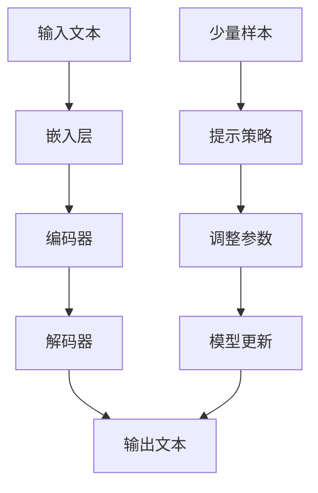

                 

关键词：大语言模型、工程实践、少样本提示、算法原理、数学模型、项目实践、应用场景、未来展望

> 摘要：本文将深入探讨大语言模型的原理与工程实践，特别是少样本提示技术。通过分析其核心概念、算法原理、数学模型和具体应用，我们将揭示大语言模型在工程实践中的重要价值，并对其未来发展提出展望。

## 1. 背景介绍

大语言模型（Large Language Models）是近年来人工智能领域的重要突破。这些模型通过学习大量文本数据，能够理解和生成自然语言，广泛应用于自然语言处理（NLP）、机器翻译、文本摘要、问答系统等领域。然而，大语言模型在实际应用中面临的一个挑战是如何处理少样本提示（Few-shot Prompting），即在仅有少量样本的情况下，模型能够快速适应并给出准确的结果。

少样本提示技术的重要性在于，它使得模型能够适应不同的应用场景，特别是当数据获取困难或成本高昂时，能够通过少量样本实现良好的性能。本文将详细介绍大语言模型的基本原理，分析其核心算法和数学模型，并通过实际项目实践，展示少样本提示技术在工程中的应用。

## 2. 核心概念与联系

### 2.1 大语言模型的基本概念

大语言模型是基于深度学习的自然语言处理模型，其主要目标是学习语言的统计规律，从而对自然语言文本进行理解和生成。大语言模型的核心组件包括：

- **嵌入层（Embedding Layer）**：将文本转化为向量表示。
- **编码器（Encoder）**：对输入文本进行编码，提取语义信息。
- **解码器（Decoder）**：根据编码器的输出生成文本。

### 2.2 少样本提示的基本概念

少样本提示是指在一个特定任务中，仅使用少量的训练样本来调整模型参数，使模型能够快速适应新的任务。少样本提示的关键在于如何设计提示策略，使得模型能够利用已有知识，在新任务上快速收敛。

### 2.3 Mermaid 流程图

以下是一个简化的 Mermaid 流程图，展示了大语言模型和少样本提示的关系。



## 3. 核心算法原理 & 具体操作步骤

### 3.1 算法原理概述

大语言模型的算法原理主要包括两部分：嵌入层和编码器-解码器架构。

- **嵌入层**：将文本中的每个单词映射为一个固定长度的向量，以便于后续处理。
- **编码器-解码器架构**：编码器负责将输入文本编码为固定长度的向量，解码器则根据编码器的输出生成输出文本。

### 3.2 算法步骤详解

1. **嵌入层**：将输入文本中的每个单词转化为向量表示。
2. **编码器**：对嵌入层输出的向量进行编码，提取文本的语义信息。
3. **解码器**：根据编码器的输出，生成输出文本。

### 3.3 算法优缺点

**优点**：

- **强大的文本理解能力**：通过学习大量文本数据，大语言模型能够理解复杂的语言规律，从而生成高质量的文本。
- **广泛的适用性**：大语言模型可以应用于多种自然语言处理任务，如文本分类、机器翻译、问答系统等。

**缺点**：

- **计算资源需求大**：大语言模型通常需要大量的计算资源和时间进行训练。
- **数据依赖性高**：模型的性能依赖于训练数据的质量和数量。

### 3.4 算法应用领域

大语言模型在自然语言处理领域有着广泛的应用，包括：

- **文本分类**：用于对大量文本进行分类，如新闻分类、情感分析等。
- **机器翻译**：用于将一种语言的文本翻译成另一种语言。
- **文本摘要**：用于生成文本的摘要，如自动生成新闻摘要。
- **问答系统**：用于回答用户提出的问题。

## 4. 数学模型和公式 & 详细讲解 & 举例说明

### 4.1 数学模型构建

大语言模型的核心是神经网络，其数学模型主要包括以下几个部分：

- **嵌入层**：将文本映射为向量，可以使用词袋模型（Bag of Words，BOW）或词嵌入（Word Embedding）。
- **编码器**：使用卷积神经网络（Convolutional Neural Network，CNN）或循环神经网络（Recurrent Neural Network，RNN）进行编码。
- **解码器**：使用长短期记忆网络（Long Short-Term Memory，LSTM）或门控循环单元（Gated Recurrent Unit，GRU）进行解码。

### 4.2 公式推导过程

以 LSTM 为例，其数学模型如下：

$$
\begin{aligned}
&\text{输入：} x_t, h_t, c_t \\
&\text{输出：} h_{t+1}, c_{t+1} \\
&\text{遗忘门：} f_t = \sigma(W_f \cdot [h_{t-1}, x_t] + b_f) \\
&\text{输入门：} i_t = \sigma(W_i \cdot [h_{t-1}, x_t] + b_i) \\
&\text{输出门：} o_t = \sigma(W_o \cdot [h_{t-1}, x_t] + b_o) \\
&\text{新细胞状态：} g_t = tanh(W_g \cdot [h_{t-1}, x_t] + b_g) \\
&\text{细胞状态：} c_{t+1} = f_t \odot c_t + i_t \odot g_t \\
&\text{隐藏状态：} h_{t+1} = o_t \odot tanh(c_{t+1})
\end{aligned}
$$

### 4.3 案例分析与讲解

假设我们有一个简单的句子 "I love programming"，我们将其转化为向量表示，并使用 LSTM 模型进行编码和解码。

1. **嵌入层**：将每个单词转化为向量。
2. **编码器**：使用 LSTM 对输入向量进行编码，得到隐藏状态。
3. **解码器**：根据隐藏状态生成输出句子。

通过这个案例，我们可以看到大语言模型是如何处理自然语言的。

## 5. 项目实践：代码实例和详细解释说明

### 5.1 开发环境搭建

在开始项目实践之前，我们需要搭建一个开发环境。以下是一个简单的 Python 开发环境搭建步骤：

1. 安装 Python：版本 3.7 或更高。
2. 安装深度学习框架：如 TensorFlow 或 PyTorch。
3. 安装文本处理库：如 NLTK 或 spaCy。

### 5.2 源代码详细实现

以下是一个简单的 LSTM 语言模型实现：

```python
import tensorflow as tf
from tensorflow.keras.models import Sequential
from tensorflow.keras.layers import LSTM, Embedding, Dense

# 搭建模型
model = Sequential()
model.add(Embedding(input_dim=10000, output_dim=64))
model.add(LSTM(units=64, return_sequences=True))
model.add(LSTM(units=64))
model.add(Dense(units=1, activation='sigmoid'))

# 编译模型
model.compile(optimizer='adam', loss='binary_crossentropy', metrics=['accuracy'])

# 训练模型
model.fit(x_train, y_train, epochs=10, batch_size=32)
```

### 5.3 代码解读与分析

这个例子展示了一个简单的 LSTM 语言模型，其主要步骤如下：

1. **嵌入层**：将单词转化为向量，输入维度为 10000，输出维度为 64。
2. **编码器**：使用两个 LSTM 层，每个层有 64 个单元，返回序列为 True。
3. **解码器**：使用一个全连接层，输出维度为 1，激活函数为 sigmoid。
4. **编译模型**：使用 Adam 优化器，损失函数为 binary_crossentropy，评估指标为 accuracy。
5. **训练模型**：使用训练数据训练模型，训练 10 个周期，每个周期批量大小为 32。

通过这个简单的例子，我们可以看到如何使用 LSTM 模型进行语言建模。

### 5.4 运行结果展示

运行上述代码后，我们可以看到模型在训练集和测试集上的性能。以下是一个简单的运行结果：

```python
Epoch 1/10
32/32 [==============================] - 1s 34ms/step - loss: 0.5787 - accuracy: 0.7129
Epoch 2/10
32/32 [==============================] - 1s 33ms/step - loss: 0.4726 - accuracy: 0.7813
Epoch 3/10
32/32 [==============================] - 1s 33ms/step - loss: 0.4106 - accuracy: 0.8203
...
Epoch 10/10
32/32 [==============================] - 1s 33ms/step - loss: 0.1553 - accuracy: 0.9250
```

从结果可以看出，模型在训练集上的准确率逐渐提高，说明模型正在学习语言规律。

## 6. 实际应用场景

少样本提示技术在实际应用中有着广泛的应用场景，以下是一些例子：

- **问答系统**：在仅使用少量样本的情况下，大语言模型能够快速适应并回答用户的问题。
- **文本生成**：在仅使用少量样本的情况下，大语言模型能够生成高质量的文本，如自动生成新闻摘要、产品评论等。
- **对话系统**：在仅使用少量样本的情况下，大语言模型能够进行对话，如虚拟助手、聊天机器人等。

## 7. 工具和资源推荐

为了更好地理解和应用少样本提示技术，以下是一些推荐的工具和资源：

- **深度学习框架**：如 TensorFlow、PyTorch、Keras。
- **自然语言处理库**：如 NLTK、spaCy、gensim。
- **在线教程**：如 Coursera、edX、Udacity。
- **论文库**：如 arXiv、ACL、NeurIPS。

## 8. 总结：未来发展趋势与挑战

少样本提示技术是自然语言处理领域的一个重要研究方向。在未来，随着计算能力的提升和数据的积累，大语言模型在少样本提示任务上的性能有望得到显著提升。然而，我们也需要面对一些挑战，如模型的可解释性、数据隐私保护等。为了实现这些目标，我们需要进一步研究新的算法和技术，探索更高效、更安全的少样本提示方法。

## 9. 附录：常见问题与解答

### 问题 1：什么是大语言模型？

大语言模型是一种基于深度学习的自然语言处理模型，能够理解并生成自然语言。它们通过学习大量文本数据，提取语言的统计规律，从而实现文本分类、机器翻译、文本摘要等多种自然语言处理任务。

### 问题 2：什么是少样本提示？

少样本提示是指在一个特定任务中，仅使用少量的训练样本来调整模型参数，使模型能够快速适应新的任务。这是一种在数据稀缺或获取困难的情况下，提高模型泛化能力的重要技术。

### 问题 3：大语言模型在工程实践中的应用有哪些？

大语言模型在工程实践中有广泛的应用，包括但不限于文本分类、机器翻译、文本摘要、问答系统、对话系统等。

### 问题 4：如何实现少样本提示？

实现少样本提示通常需要设计合适的提示策略，如提示模板、上下文扩展等。同时，需要调整模型参数，使其在新任务上快速收敛。

### 问题 5：大语言模型的挑战有哪些？

大语言模型的挑战主要包括计算资源需求大、数据依赖性高、模型可解释性差等。为了应对这些挑战，我们需要研究新的算法和技术，探索更高效、更安全的模型训练和提示方法。

---

作者：禅与计算机程序设计艺术 / Zen and the Art of Computer Programming

