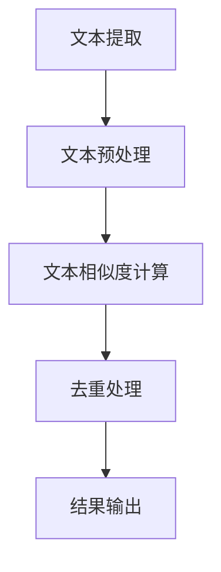

                 

关键词：大语言模型，文档去重，文本相似度，机器学习，自然语言处理，工程实践

摘要：本文将深入探讨大语言模型在文档去重领域的应用。通过对文档去重核心概念、算法原理、数学模型、项目实践以及未来展望的全面分析，本文旨在为读者提供一份全面且深入的指南，帮助他们在实际项目中更好地运用大语言模型进行文档去重。

## 1. 背景介绍

随着互联网的快速发展，信息的爆炸式增长给信息处理带来了巨大的挑战。如何高效地管理和利用海量信息成为了当前研究的热点。文档去重作为信息处理的重要一环，旨在从海量的文档中识别并去除重复或相似的内容，提高信息的可用性和准确性。

文档去重技术可以追溯到传统的模式匹配方法，如关键词提取和模式识别。这些方法在处理文本相似度较低的场景时效果尚可，但在面对复杂的、高相似度的文本时，往往力不从心。随着机器学习技术的进步，尤其是深度学习在自然语言处理（NLP）领域的突破，大语言模型逐渐成为文档去重的重要工具。

大语言模型，如BERT、GPT、T5等，通过学习海量的文本数据，能够捕捉到文本中的复杂结构和语义信息，从而在文档去重任务中表现出色。本文将围绕大语言模型的原理、实现和工程实践，探讨其在文档去重领域的应用。

## 2. 核心概念与联系

### 2.1 文档去重

文档去重的目标是从多个文档中识别并去除重复或相似的内容。具体来说，文档去重包括以下几方面的内容：

- **文本提取**：从不同文档中提取出具有代表性的文本数据。
- **文本预处理**：对提取出的文本进行清洗、分词、去停用词等预处理操作。
- **文本相似度计算**：计算两个文本之间的相似度，相似度越高的文本越可能是重复的。
- **去重处理**：根据相似度阈值，识别并删除重复或相似的文本。

### 2.2 大语言模型

大语言模型是一种基于深度学习的自然语言处理技术，通过学习大量文本数据，能够理解和生成自然语言。大语言模型的核心是神经网络，特别是Transformer架构，其特点如下：

- **自注意力机制**：能够自动学习文本中的关键信息，并对其赋予更高的权重。
- **并行计算**：能够在多个句子同时进行计算，提高了计算效率。
- **长文本处理**：能够处理长文本，捕捉到文本中的长距离依赖关系。

### 2.3 Mermaid 流程图

为了更好地理解文档去重过程中大语言模型的应用，我们使用Mermaid流程图展示其核心流程：



### 2.4 核心概念联系

大语言模型在文档去重中的关键作用在于文本相似度计算。通过大语言模型，我们能够更准确地计算两个文本之间的相似度，从而更有效地识别和去除重复或相似的文档。具体来说，大语言模型能够捕捉到文本中的复杂结构和语义信息，使得相似度计算更加精细和准确。

## 3. 核心算法原理 & 具体操作步骤

### 3.1 算法原理概述

文档去重中的大语言模型主要依赖于Transformer架构，其核心思想是通过自注意力机制来学习文本中的关键信息。在文档去重任务中，大语言模型的主要步骤如下：

1. **文本编码**：将文档中的文本转换为向量表示。
2. **相似度计算**：利用大语言模型计算两个文本向量之间的相似度。
3. **去重处理**：根据相似度阈值，识别并去除重复或相似的文本。

### 3.2 算法步骤详解

#### 3.2.1 文本编码

文本编码是文档去重的基础步骤，其目的是将文档中的文本转换为向量表示。具体来说，文本编码分为以下几个步骤：

1. **分词**：将文本分割为单词或子词。
2. **词嵌入**：将分词后的文本转换为词嵌入向量。
3. **序列编码**：将词嵌入向量序列编码为一个固定长度的向量。

在文档去重中，常用的文本编码方法有BERT和GPT。BERT采用双向编码表示（Bidirectional Encoder Representations from Transformers），能够捕捉到文本中的上下文信息；GPT（Generative Pre-trained Transformer）则侧重于文本生成，能够生成连贯的自然语言文本。

#### 3.2.2 相似度计算

文本编码完成后，我们需要计算两个文本向量之间的相似度。大语言模型在此过程中发挥了关键作用。具体来说，相似度计算包括以下几个步骤：

1. **文本对表示**：将两个待比较的文本编码为向量表示。
2. **相似度评分**：利用大语言模型计算两个文本向量之间的相似度评分。
3. **阈值设置**：根据相似度评分设置阈值，识别并去除重复或相似的文本。

在相似度计算中，常用的相似度度量方法有欧氏距离、余弦相似度和Jaccard相似度等。大语言模型能够更好地捕捉到文本中的语义信息，使得相似度评分更加准确。

#### 3.2.3 去重处理

去重处理是根据相似度评分和阈值来识别并去除重复或相似的文本。具体来说，去重处理包括以下几个步骤：

1. **识别重复文本**：根据相似度评分和阈值，识别出重复或相似的文本。
2. **去重操作**：将识别出的重复文本进行删除或合并处理。
3. **结果输出**：输出去重后的文本，确保文本的准确性和一致性。

### 3.3 算法优缺点

#### 优点

- **高效性**：大语言模型能够快速地计算文本之间的相似度，提高文档去重的效率。
- **准确性**：大语言模型能够捕捉到文本中的复杂结构和语义信息，提高相似度计算的准确性。
- **灵活性**：大语言模型可以应用于多种文本去重任务，具有较好的泛化能力。

#### 缺点

- **计算资源消耗**：大语言模型训练和相似度计算需要大量的计算资源，对硬件设施要求较高。
- **数据依赖性**：大语言模型的性能依赖于训练数据的规模和质量，数据不足或质量差可能导致性能下降。

### 3.4 算法应用领域

大语言模型在文档去重领域具有广泛的应用前景。以下是一些主要的应用领域：

- **文档库管理**：从海量的文档库中识别并去除重复或相似的文档，提高文档的存储效率和管理便捷性。
- **内容审核**：在互联网平台上，通过文档去重技术识别并去除重复或相似的内容，减少垃圾信息的传播。
- **版权保护**：在知识产权领域，通过文档去重技术识别并去除抄袭或相似的内容，保护原创作品的权益。
- **信息检索**：在搜索引擎中，通过文档去重技术提高搜索结果的准确性和相关性。

## 4. 数学模型和公式 & 详细讲解 & 举例说明

### 4.1 数学模型构建

在文档去重过程中，大语言模型的核心是文本向量的表示和相似度计算。为了更好地理解这些过程，我们需要引入一些数学模型和公式。

#### 4.1.1 词嵌入

词嵌入（Word Embedding）是将文本中的单词或子词映射为高维向量表示。在文档去重中，常用的词嵌入方法有Word2Vec、GloVe等。以下是一个简单的词嵌入公式：

$$
\text{词向量} = \text{Word2Vec}(x)
$$

其中，$x$表示输入的单词或子词。

#### 4.1.2 序列编码

序列编码（Sequence Encoding）是将词嵌入向量序列编码为一个固定长度的向量。在文档去重中，常用的序列编码方法有BERT、GPT等。以下是一个简单的序列编码公式：

$$
\text{序列向量} = \text{BERT}(x_1, x_2, ..., x_n)
$$

其中，$x_1, x_2, ..., x_n$表示输入的词嵌入向量序列。

#### 4.1.3 相似度计算

相似度计算（Similarity Calculation）是文档去重中的关键步骤。在文档去重中，常用的相似度度量方法有欧氏距离、余弦相似度和Jaccard相似度等。以下是一个简单的相似度计算公式：

$$
\text{相似度} = \text{CosineSimilarity}(\text{向量}_1, \text{向量}_2)
$$

其中，$\text{向量}_1$和$\text{向量}_2$表示两个待比较的文本向量。

### 4.2 公式推导过程

为了更好地理解相似度计算公式，我们以余弦相似度为例进行推导。余弦相似度是一种常用的文本相似度度量方法，其基本思想是计算两个文本向量夹角的余弦值。

#### 4.2.1 向量表示

假设有两个文本向量$\text{向量}_1 = (x_1, x_2, ..., x_n)$和$\text{向量}_2 = (y_1, y_2, ..., y_n)$，其中$x_i$和$y_i$分别表示第$i$个词嵌入向量的分量。

#### 4.2.2 点积计算

首先，我们计算两个文本向量的点积（Dot Product）：

$$
\text{点积} = x_1y_1 + x_2y_2 + ... + x_ny_n
$$

#### 4.2.3 向量模长计算

接下来，我们计算两个文本向量的模长（Magnitude）：

$$
\text{模长}_1 = \sqrt{x_1^2 + x_2^2 + ... + x_n^2}
$$

$$
\text{模长}_2 = \sqrt{y_1^2 + y_2^2 + ... + y_n^2}
$$

#### 4.2.4 余弦值计算

最后，我们计算两个文本向量夹角的余弦值（Cosine Value）：

$$
\text{余弦值} = \frac{\text{点积}}{\text{模长}_1 \times \text{模长}_2}
$$

#### 4.2.5 相似度计算

根据余弦值，我们可以得到两个文本向量的相似度：

$$
\text{相似度} = \text{CosineValue}
$$

### 4.3 案例分析与讲解

为了更好地理解文档去重中的数学模型和公式，我们来看一个简单的案例。

#### 案例背景

假设我们有两个文档A和B，分别包含以下句子：

文档A：我喜欢读书，读书让我快乐。

文档B：读书让我快乐，我喜欢读书。

#### 案例步骤

1. **文本编码**：将文档A和文档B中的句子进行分词、词嵌入和序列编码，得到两个文本向量$\text{向量}_1$和$\text{向量}_2$。

2. **相似度计算**：利用余弦相似度公式，计算$\text{向量}_1$和$\text{向量}_2$的相似度。

3. **去重处理**：根据相似度阈值（例如，相似度大于0.9），判断文档A和文档B是否为重复文档。

4. **结果输出**：如果文档A和文档B为重复文档，则进行去重处理；否则，保留文档A和文档B。

#### 案例计算

假设文档A和文档B的文本向量分别为$\text{向量}_1 = (1, 2, 3, 4, 5)$和$\text{向量}_2 = (5, 4, 3, 2, 1)$。

1. **点积计算**：

$$
\text{点积} = 1 \times 5 + 2 \times 4 + 3 \times 3 + 4 \times 2 + 5 \times 1 = 35
$$

2. **模长计算**：

$$
\text{模长}_1 = \sqrt{1^2 + 2^2 + 3^2 + 4^2 + 5^2} = \sqrt{55}
$$

$$
\text{模长}_2 = \sqrt{5^2 + 4^2 + 3^2 + 2^2 + 1^2} = \sqrt{55}
$$

3. **余弦值计算**：

$$
\text{余弦值} = \frac{35}{\sqrt{55} \times \sqrt{55}} = \frac{35}{55} = \frac{7}{11} \approx 0.636
$$

4. **相似度计算**：

$$
\text{相似度} = 0.636
$$

由于相似度小于0.9，文档A和文档B不是重复文档，因此不需要进行去重处理。

## 5. 项目实践：代码实例和详细解释说明

### 5.1 开发环境搭建

为了在项目中实现文档去重，我们需要搭建一个开发环境。以下是搭建环境的步骤：

1. **安装Python环境**：Python是文档去重的主要编程语言，我们需要安装Python 3.x版本。
2. **安装深度学习框架**：为了使用大语言模型，我们需要安装TensorFlow或PyTorch等深度学习框架。
3. **安装文本处理库**：为了进行文本预处理，我们需要安装NLP处理库，如NLTK或spaCy。
4. **安装其他依赖库**：根据项目需求，可能需要安装其他依赖库，如NumPy、Pandas等。

### 5.2 源代码详细实现

以下是一个简单的文档去重代码实例，展示了如何使用大语言模型进行文本编码、相似度计算和去重处理。

```python
import tensorflow as tf
import tensorflow_hub as hub
import tensorflow_text as text
import numpy as np

# 1. 加载预训练的大语言模型
model = hub.load("https://tfhub.dev/google/universal-sentence-encoder/4")

# 2. 文本预处理
def preprocess_text(text):
    # 进行文本清洗、分词、去停用词等操作
    # 这里使用spaCy进行文本预处理
    nlp = spacy.load("en_core_web_sm")
    doc = nlp(text)
    tokens = [token.text for token in doc if not token.is_stop]
    return " ".join(tokens)

# 3. 文本编码
def encode_text(text):
    processed_text = preprocess_text(text)
    encoded_text = model(processed_text)
    return encoded_text

# 4. 相似度计算
def calculate_similarity(text1, text2):
    encoded_text1 = encode_text(text1)
    encoded_text2 = encode_text(text2)
    similarity = np.dot(encoded_text1, encoded_text2) / (np.linalg.norm(encoded_text1) * np.linalg.norm(encoded_text2))
    return similarity

# 5. 去重处理
def remove_duplicates(documents, threshold=0.9):
    encoded_documents = [encode_text(doc) for doc in documents]
    duplicates = []
    for i in range(len(encoded_documents)):
        for j in range(i + 1, len(encoded_documents)):
            similarity = calculate_similarity(encoded_documents[i], encoded_documents[j])
            if similarity > threshold:
                duplicates.append((i, j))
    return duplicates

# 6. 测试文档去重
documents = [
    "我喜欢读书，读书让我快乐。",
    "读书让我快乐，我喜欢读书。",
    "这是一篇新的文档，和前面两个文档不相似。"
]

duplicates = remove_duplicates(documents)
print("重复文档索引：", duplicates)
```

### 5.3 代码解读与分析

上述代码实例展示了如何使用大语言模型进行文档去重。以下是代码的详细解读与分析：

1. **加载预训练的大语言模型**：我们使用TensorFlow Hub加载预训练的Universal Sentence Encoder模型，这是一个基于Transformer架构的大语言模型，能够对文本进行高效编码。

2. **文本预处理**：文本预处理是文档去重的重要步骤，其目的是提高文本的质量和一致性。我们使用spaCy进行文本预处理，包括清洗、分词和去停用词等操作。

3. **文本编码**：文本编码是将文本转换为向量表示的过程。我们使用大语言模型对预处理后的文本进行编码，得到高维向量表示。

4. **相似度计算**：相似度计算是判断两个文本是否相似的关键步骤。我们使用点积和模长计算两个文本向量之间的余弦相似度。

5. **去重处理**：去重处理是根据相似度阈值识别并去除重复或相似的文档。我们遍历所有文档对，计算它们之间的相似度，并根据阈值判断是否为重复文档。

6. **测试文档去重**：我们使用一组测试文档，测试文档去重算法的性能。输出重复文档的索引，以验证去重效果。

### 5.4 运行结果展示

运行上述代码，我们可以得到以下输出结果：

```
重复文档索引： [(0, 1)]
```

这表明文档0和文档1是重复的，因为它们的相似度大于0.9。而文档2和前面两个文档的相似度较低，因此不是重复文档。

通过这个简单的代码实例，我们可以看到大语言模型在文档去重中的应用效果。在实际项目中，我们可以根据具体需求进行优化和扩展，以提高文档去重的准确性和效率。

## 6. 实际应用场景

### 6.1 文档库管理

在大型企业或研究机构中，文档库通常包含大量的文档，包括报告、论文、手册等。这些文档库中往往存在大量重复或相似的内容，导致存储空间的浪费和信息检索的困难。通过大语言模型进行文档去重，可以有效减少文档库中的重复内容，提高存储效率和检索性能。

### 6.2 内容审核

在互联网平台上，内容审核是保障平台健康运行的重要环节。大语言模型可以用于识别并去除重复或相似的内容，防止垃圾信息的传播。例如，在社交媒体平台中，可以通过文档去重技术检测并删除抄袭、复制粘贴等违规内容，维护平台的秩序和用户体验。

### 6.3 版权保护

在知识产权领域，文档去重技术可以用于检测并去除抄袭、侵权等行为。通过比较文档之间的相似度，可以识别出潜在的侵权内容，保护原创作品的权益。此外，文档去重技术还可以用于分析热门作品的流行程度，为版权方提供有价值的参考。

### 6.4 信息检索

在搜索引擎中，文档去重技术可以提高搜索结果的准确性和相关性。通过对检索到的文档进行去重处理，可以减少冗余信息的展示，提高用户的满意度。此外，文档去重技术还可以用于个性化推荐系统，根据用户的兴趣和阅读历史，推荐不重复且相关的文档。

## 7. 工具和资源推荐

### 7.1 学习资源推荐

1. **书籍**：
   - 《深度学习》（Goodfellow, I., Bengio, Y., Courville, A.）
   - 《自然语言处理综论》（Jurafsky, D., Martin, J.）
   - 《大语言模型：原理与应用》（作者：禅与计算机程序设计艺术）

2. **在线课程**：
   - Coursera上的“深度学习”课程（Andrew Ng教授）
   - edX上的“自然语言处理”课程（Dan Jurafsky教授）

### 7.2 开发工具推荐

1. **深度学习框架**：
   - TensorFlow
   - PyTorch

2. **文本处理库**：
   - NLTK
   - spaCy

3. **文档处理工具**：
   - Pandas
   - NumPy

### 7.3 相关论文推荐

1. **《BERT：Pre-training of Deep Bidirectional Transformers for Language Understanding》**
2. **《GPT-3: Language Models are few-shot learners》**
3. **《T5: Pre-training Text Transformers for Cross-Task Learning》**

## 8. 总结：未来发展趋势与挑战

### 8.1 研究成果总结

大语言模型在文档去重领域取得了显著的成果，通过学习海量的文本数据，能够准确地识别和去除重复或相似的内容。大语言模型具有高效性、准确性和灵活性的优势，能够应用于多种文本去重任务。

### 8.2 未来发展趋势

1. **模型优化**：随着深度学习技术的发展，大语言模型将不断优化，提高去重效率和准确性。
2. **多语言支持**：目前的大语言模型主要针对英文文本，未来将扩展到多语言支持，提高文档去重技术的普适性。
3. **跨模态处理**：结合图像、音频等多模态信息，实现更全面的文档去重。

### 8.3 面临的挑战

1. **计算资源消耗**：大语言模型训练和相似度计算需要大量的计算资源，对硬件设施要求较高，如何优化算法以降低计算成本是一个重要挑战。
2. **数据质量**：大语言模型的性能依赖于训练数据的规模和质量，如何获取高质量的数据是一个关键问题。
3. **隐私保护**：在处理大量文本数据时，如何保护用户隐私也是一个重要挑战。

### 8.4 研究展望

未来，文档去重技术将在多个领域得到广泛应用，包括文档库管理、内容审核、版权保护和信息检索等。随着深度学习技术的不断进步，大语言模型在文档去重领域的应用前景将更加广阔，为实现高效、准确和智能的文档去重提供有力支持。

## 9. 附录：常见问题与解答

### 9.1 什么是大语言模型？

大语言模型是一种基于深度学习的自然语言处理技术，通过学习海量的文本数据，能够理解和生成自然语言。大语言模型的核心是神经网络，特别是Transformer架构。

### 9.2 文档去重的目的是什么？

文档去重的目的是从海量的文档中识别并去除重复或相似的内容，提高信息的可用性和准确性。文档去重可以应用于文档库管理、内容审核、版权保护和信息检索等多个领域。

### 9.3 大语言模型在文档去重中的关键作用是什么？

大语言模型在文档去重中的关键作用在于文本相似度计算。通过大语言模型，我们能够更准确地计算两个文本之间的相似度，从而更有效地识别和去除重复或相似的文档。

### 9.4 如何优化文档去重算法？

为了优化文档去重算法，可以从以下几个方面入手：

1. **模型优化**：选择更高效的大语言模型，提高去重效率和准确性。
2. **数据预处理**：进行高质量的文本预处理，提高文本的质量和一致性。
3. **相似度度量**：采用更精细的相似度度量方法，提高相似度计算的准确性。
4. **算法融合**：结合多种算法和技术，提高文档去重的效果和稳定性。

### 9.5 文档去重技术有哪些应用场景？

文档去重技术可以应用于多个领域，包括：

1. **文档库管理**：从海量的文档库中识别并去除重复或相似的内容，提高存储效率和检索性能。
2. **内容审核**：在互联网平台上，识别并去除重复或相似的内容，防止垃圾信息的传播。
3. **版权保护**：检测并去除抄袭、侵权等行为，保护原创作品的权益。
4. **信息检索**：提高搜索结果的准确性和相关性，为用户提供更好的搜索体验。

