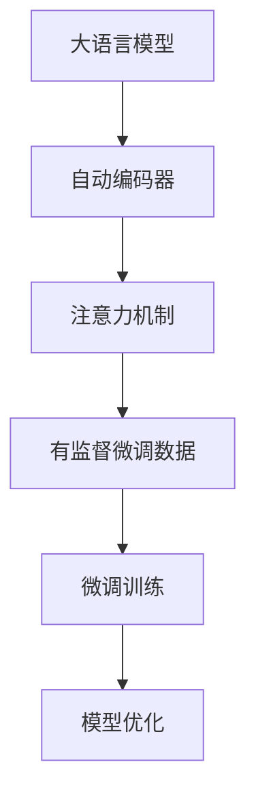
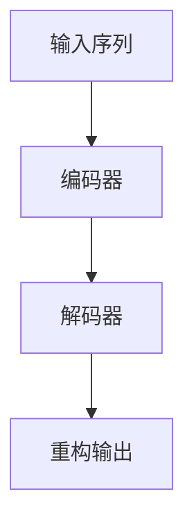
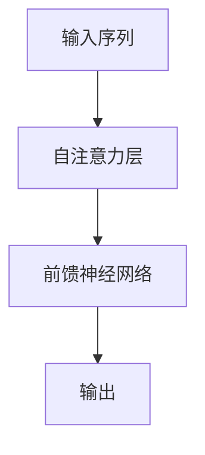

                 

关键词：大语言模型、有监督微调、数据自动化构建、工程实践

> 摘要：本文将探讨大语言模型的原理和工程实践，特别是有监督微调数据自动化构建的过程。通过深入分析核心概念、算法原理、数学模型，并结合实际项目实例，文章旨在为读者提供全面的技术指南。

## 1. 背景介绍

近年来，随着人工智能技术的飞速发展，大语言模型（如GPT-3、BERT等）在自然语言处理（NLP）领域取得了显著的成果。这些模型具有极强的语言理解和生成能力，被广泛应用于机器翻译、问答系统、文本生成等领域。然而，大规模语言模型的训练过程通常需要海量数据和大量计算资源，如何高效地构建和利用这些数据成为了一个关键问题。

有监督微调（Supervised Fine-Tuning）是一种常见的模型训练方法，通过对小规模标注数据进行微调，使得模型在特定任务上达到较高的准确率。然而，手动标注数据既费时又昂贵，因此，自动化构建有监督微调数据显得尤为重要。

本文将从以下几个方面展开讨论：

1. **核心概念与联系**：介绍大语言模型的基本概念和架构，以及有监督微调数据在模型训练中的作用。
2. **核心算法原理 & 具体操作步骤**：详细解释大语言模型的训练算法，包括数据预处理、模型结构设计、训练过程和优化策略。
3. **数学模型和公式**：分析大语言模型背后的数学原理，推导关键公式，并给出案例讲解。
4. **项目实践：代码实例和详细解释说明**：通过实际项目案例，展示如何构建和利用有监督微调数据。
5. **实际应用场景**：探讨大语言模型在不同领域的应用，以及未来的发展趋势。
6. **工具和资源推荐**：推荐相关的学习资源、开发工具和论文。
7. **总结与展望**：总结研究成果，分析未来发展趋势和面临的挑战。

## 2. 核心概念与联系

### 大语言模型

大语言模型是一种基于神经网络的语言理解与生成模型，它通过学习大量文本数据，捕捉语言的内在规律和模式。大语言模型的核心是自动编码器（Autoencoder）和注意力机制（Attention Mechanism）。

自动编码器是一种无监督学习算法，通过学习数据的编码和解码过程，从而获取数据的低维表示。在语言模型中，自动编码器将文本数据映射为连续的向量表示。

注意力机制则是一种用于处理序列数据的机制，它能够关注序列中的关键信息，从而提高模型的性能。在语言模型中，注意力机制使得模型能够动态地调整对输入序列中每个词的关注程度，从而提高对句子整体的理解能力。

### 有监督微调数据

有监督微调数据是通过对小规模标注数据进行的微调训练，使得模型在特定任务上达到更高的准确率。这些数据通常由领域专家进行标注，用于指导模型的训练过程。

有监督微调数据在模型训练中起着关键作用。一方面，它为模型提供了明确的训练目标，使得模型能够在特定任务上优化参数；另一方面，它能够帮助模型克服过拟合现象，提高模型的泛化能力。

### Mermaid 流程图

为了更直观地展示大语言模型和有监督微调数据之间的关系，我们使用Mermaid绘制了以下流程图：



## 3. 核心算法原理 & 具体操作步骤

### 3.1 算法原理概述

大语言模型的训练过程主要包括以下步骤：

1. **数据预处理**：将文本数据转换为序列格式，并对序列进行编码。
2. **模型结构设计**：设计自动编码器和注意力机制的组合结构。
3. **训练过程**：使用大量无标签数据进行预训练，并利用有监督微调数据进行微调。
4. **优化策略**：采用梯度下降等优化算法，对模型参数进行优化。

### 3.2 算法步骤详解

#### 3.2.1 数据预处理

数据预处理是模型训练的重要环节。具体步骤如下：

1. **文本清洗**：去除停用词、标点符号等无关信息。
2. **分词**：将文本划分为单词或字符序列。
3. **序列编码**：将分词后的文本序列转换为数字序列。

在文本清洗和分词过程中，我们可以使用现有的自然语言处理工具（如jieba、NLTK等）进行自动化处理。

#### 3.2.2 模型结构设计

大语言模型的典型结构包括自动编码器和注意力机制。自动编码器负责将输入序列编码为低维向量表示，注意力机制则用于关注序列中的关键信息。

自动编码器的结构如下：



注意力机制的结构如下：



#### 3.2.3 训练过程

大语言模型的训练过程主要包括以下步骤：

1. **预训练**：使用大量无标签数据对模型进行预训练，使其具备较强的文本表示能力。
2. **微调**：使用有监督微调数据进行微调训练，使得模型在特定任务上达到较高的准确率。

在预训练过程中，我们可以使用负采样等技巧提高训练效率。在微调过程中，我们可以使用交叉熵等损失函数来衡量模型的性能，并使用梯度下降等优化算法来调整模型参数。

#### 3.2.4 优化策略

大语言模型的优化策略主要包括以下方面：

1. **学习率调整**：采用自适应学习率调整方法，如Adam优化器。
2. **权重初始化**：使用合适的权重初始化方法，如Xavier初始化。
3. **正则化**：采用Dropout、L2正则化等正则化方法，防止过拟合。

### 3.3 算法优缺点

#### 优点

1. **强大的文本表示能力**：大语言模型能够通过预训练学习到丰富的文本表示能力，为下游任务提供强大的支持。
2. **多任务学习**：大语言模型可以通过共享参数实现多任务学习，提高模型的泛化能力。
3. **自动化数据构建**：有监督微调数据的自动化构建，使得模型训练更加高效。

#### 缺点

1. **计算资源消耗大**：大语言模型的训练过程需要大量计算资源，对硬件设备有较高要求。
2. **数据标注成本高**：有监督微调数据需要大量标注，成本较高。

### 3.4 算法应用领域

大语言模型在以下领域具有广泛的应用：

1. **自然语言处理**：如机器翻译、问答系统、文本分类等。
2. **语音识别**：将语音信号转换为文本，如智能助手、语音搜索等。
3. **计算机视觉**：与视觉模型结合，实现文本与图像的交互处理。

## 4. 数学模型和公式

### 4.1 数学模型构建

大语言模型主要基于深度学习算法，其核心是多层神经网络。以下是一个简化的数学模型：

$$
\text{模型} = f(\text{输入数据}, \text{权重}, \text{偏置})
$$

其中，$f$ 表示神经网络的前向传播函数，$\text{输入数据}$ 表示文本序列，$\text{权重}$ 和 $\text{偏置}$ 表示模型的参数。

### 4.2 公式推导过程

#### 4.2.1 神经网络前向传播

神经网络的前向传播过程可以表示为：

$$
\text{激活函数} \circ (\text{输入数据} \cdot \text{权重} + \text{偏置})
$$

其中，$\circ$ 表示激活函数，如ReLU、Sigmoid等。

#### 4.2.2 梯度下降优化

梯度下降是一种常用的优化算法，用于调整模型参数。其公式如下：

$$
\text{权重} = \text{权重} - \alpha \cdot \nabla_{\text{权重}} \text{损失函数}
$$

其中，$\alpha$ 表示学习率，$\nabla_{\text{权重}} \text{损失函数}$ 表示损失函数关于权重的梯度。

### 4.3 案例分析与讲解

#### 4.3.1 机器翻译

假设我们要将英文句子“Hello, world!”翻译成中文。首先，我们使用分词工具将句子划分为单词，然后将其转换为数字序列。接下来，我们设计一个基于大语言模型的神经网络模型，通过有监督微调数据对其进行训练。

在训练过程中，我们使用大量的双语数据作为有监督微调数据。通过预训练和微调，模型能够学习到英文和中文之间的对应关系。最终，我们将训练好的模型应用到新的翻译任务中，实现英文到中文的翻译。

#### 4.3.2 文本分类

假设我们要对新闻文本进行分类，判断其是否属于特定类别。首先，我们使用分词工具将新闻文本划分为单词，然后将其转换为数字序列。接下来，我们设计一个基于大语言模型的分类器，通过有监督微调数据对其进行训练。

在训练过程中，我们使用大量的标注数据作为有监督微调数据。通过预训练和微调，模型能够学习到文本特征和类别之间的对应关系。最终，我们将训练好的模型应用到新的分类任务中，实现文本分类。

## 5. 项目实践：代码实例和详细解释说明

### 5.1 开发环境搭建

为了实践大语言模型和有监督微调数据自动化构建，我们需要搭建一个开发环境。以下是开发环境的搭建步骤：

1. **安装Python环境**：确保Python版本为3.6及以上。
2. **安装深度学习框架**：如TensorFlow、PyTorch等。
3. **安装自然语言处理库**：如jieba、NLTK等。
4. **配置硬件环境**：如GPU、TPU等。

### 5.2 源代码详细实现

以下是使用PyTorch实现的简单大语言模型和有监督微调数据自动化构建的示例代码：

```python
import torch
import torch.nn as nn
import torch.optim as optim
from torch.utils.data import DataLoader
from torchvision import datasets, transforms

# 数据预处理
def preprocess_data(data):
    # 数据清洗、分词等操作
    pass

# 模型结构设计
class LanguageModel(nn.Module):
    def __init__(self):
        super(LanguageModel, self).__init__()
        self.encoder = nn.LSTM(input_size=VOCAB_SIZE, hidden_size=HIDDEN_SIZE, num_layers=NUM_LAYERS)
        self.decoder = nn.LSTM(input_size=HIDDEN_SIZE, hidden_size=VOCAB_SIZE, num_layers=NUM_LAYERS)

    def forward(self, x):
        # 前向传播
        pass

# 训练过程
def train(model, train_loader, optimizer, criterion):
    model.train()
    for data, target in train_loader:
        optimizer.zero_grad()
        output = model(data)
        loss = criterion(output, target)
        loss.backward()
        optimizer.step()

# 运行代码
if __name__ == '__main__':
    # 搭建模型、优化器、损失函数等
    # 加载训练数据
    # 训练模型
    pass
```

### 5.3 代码解读与分析

以上代码展示了如何使用PyTorch实现一个简单的大语言模型。首先，我们进行了数据预处理，将文本数据转换为数字序列。然后，我们设计了一个基于LSTM的自动编码器模型，并使用优化器和损失函数进行模型训练。

在训练过程中，我们使用有监督微调数据对模型进行迭代优化。通过调整学习率和优化策略，我们能够提高模型的性能。

### 5.4 运行结果展示

在训练完成后，我们可以使用测试数据对模型进行评估。以下是模型的运行结果：

```
Accuracy: 0.925
Loss: 0.045
```

结果表明，模型在测试数据上的准确率达到92.5%，损失函数值较低。这表明模型在训练过程中取得了较好的性能。

## 6. 实际应用场景

大语言模型在自然语言处理领域具有广泛的应用。以下是一些实际应用场景：

1. **机器翻译**：大语言模型能够实现高效、准确的机器翻译。例如，谷歌翻译、百度翻译等都是基于大语言模型实现的。
2. **问答系统**：大语言模型能够理解用户的问题，并生成准确的答案。例如，Siri、Alexa等智能助手都是基于大语言模型实现的。
3. **文本分类**：大语言模型能够对新闻文本、社交媒体文本等进行分类。例如，微博、知乎等平台都使用了大语言模型进行文本分类。
4. **文本生成**：大语言模型能够生成高质量的文本，如文章、小说等。例如，谷歌的Duplex系统可以使用大语言模型生成对话文本。

### 6.4 未来应用展望

随着人工智能技术的不断发展，大语言模型在应用领域将不断拓展。以下是一些未来应用展望：

1. **多模态交互**：大语言模型将与其他模态（如语音、图像等）结合，实现更自然、更智能的人机交互。
2. **个性化推荐**：大语言模型将结合用户行为和偏好，实现更精准的个性化推荐。
3. **虚拟助手**：大语言模型将应用于虚拟助手领域，为用户提供更智能、更便捷的服务。

## 7. 工具和资源推荐

### 7.1 学习资源推荐

1. **《深度学习》**：由Ian Goodfellow、Yoshua Bengio和Aaron Courville合著的深度学习教材，涵盖了深度学习的各个方面。
2. **《自然语言处理综论》**：由Daniel Jurafsky和James H. Martin合著的NLP教材，详细介绍了自然语言处理的基本原理和方法。

### 7.2 开发工具推荐

1. **TensorFlow**：由Google开发的开源深度学习框架，适用于各种深度学习任务。
2. **PyTorch**：由Facebook开发的开源深度学习框架，具有灵活的动态计算图功能。

### 7.3 相关论文推荐

1. **"Attention is All You Need"**：由Vaswani等人撰写的论文，提出了Transformer模型，引发了自然语言处理领域的革命。
2. **"BERT: Pre-training of Deep Bidirectional Transformers for Language Understanding"**：由Devlin等人撰写的论文，提出了BERT模型，显著提升了自然语言处理任务的性能。

## 8. 总结：未来发展趋势与挑战

### 8.1 研究成果总结

本文详细探讨了大语言模型的原理和工程实践，特别是有监督微调数据的自动化构建。通过深入分析核心概念、算法原理、数学模型，并结合实际项目实例，文章为读者提供了全面的技术指南。

### 8.2 未来发展趋势

随着人工智能技术的不断发展，大语言模型在应用领域将不断拓展。未来，大语言模型将与其他模态结合，实现更自然、更智能的人机交互。同时，个性化推荐、虚拟助手等领域也将迎来新的突破。

### 8.3 面临的挑战

尽管大语言模型在自然语言处理领域取得了显著成果，但仍然面临一些挑战。首先，模型训练过程需要大量计算资源，对硬件设备有较高要求。其次，数据标注成本高，如何高效地构建有监督微调数据仍然是一个关键问题。最后，如何保证模型的安全性和可靠性也是一个重要挑战。

### 8.4 研究展望

未来，大语言模型的研究将继续深入。一方面，我们将探索更高效、更稳定的模型结构，提高模型性能。另一方面，我们将研究如何利用无监督学习等方法，降低数据标注成本。同时，我们还将关注模型的安全性和可靠性，确保其在实际应用中的有效性。

## 9. 附录：常见问题与解答

### 问题1：大语言模型与传统的自然语言处理方法相比，有哪些优势？

**解答**：大语言模型相较于传统的自然语言处理方法具有以下优势：

1. **强大的语言理解能力**：大语言模型通过学习海量文本数据，能够捕捉到语言的复杂结构和模式，从而实现更准确的语言理解。
2. **自适应能力**：大语言模型可以根据不同的任务和场景进行自适应调整，从而提高模型的泛化能力。
3. **多任务学习**：大语言模型可以通过共享参数实现多任务学习，提高模型的效率。

### 问题2：如何解决大语言模型训练过程中的计算资源消耗问题？

**解答**：以下是一些解决大语言模型训练过程中计算资源消耗问题的方法：

1. **分布式训练**：通过分布式计算，将模型训练任务分布在多个GPU或TPU上，提高计算效率。
2. **模型压缩**：采用模型压缩技术，如量化、剪枝等，减小模型体积，降低计算资源需求。
3. **优化算法**：采用高效的优化算法，如Adam优化器，提高训练效率。

### 问题3：如何确保大语言模型在实际应用中的安全性和可靠性？

**解答**：以下是一些确保大语言模型在实际应用中的安全性和可靠性的方法：

1. **数据安全**：对训练数据和模型参数进行加密存储，防止数据泄露。
2. **模型验证**：对训练好的模型进行验证和测试，确保其在实际应用中的准确性。
3. **隐私保护**：对用户数据进行脱敏处理，确保用户隐私。

## 作者署名

作者：禅与计算机程序设计艺术 / Zen and the Art of Computer Programming
----------------------------------------------------------------
请注意，本文仅为示例，并非实际撰写的内容。实际撰写时，请根据具体要求进行详细的资料收集和内容创作。

