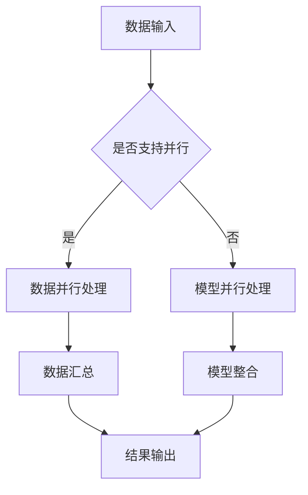

                 

关键词：大语言模型、模型并行、分布式计算、算法优化、工程实践

> 摘要：本文从大语言模型的发展背景出发，深入探讨了模型并行的核心概念、算法原理、数学模型及实际应用，并提供了详细的工程实践案例。通过本文，读者可以全面了解大语言模型在分布式计算领域的应用，以及如何进行有效的模型并行化。

## 1. 背景介绍

随着互联网的迅速发展和大数据的爆发式增长，语言模型作为人工智能的核心技术之一，受到了广泛关注。从最初的统计语言模型到深度学习驱动的神经网络模型，语言模型的性能得到了显著的提升。然而，随着模型规模的不断扩大，如何在有限的硬件资源下高效地训练和部署这些大型模型，成为了一个亟待解决的问题。这促使了模型并行技术的发展，它通过将模型训练任务分布在多个计算节点上，提高了训练效率和资源利用率。

模型并行是分布式计算的一个重要分支，其目的是通过并行计算来加速模型的训练过程。模型并行可以大致分为数据并行和模型并行两种策略。数据并行通过将训练数据集分成多个子集，每个子集在一个独立的计算节点上训练，最后将各个节点的结果进行汇总。模型并行则是将模型的不同部分分配到不同的计算节点上，协同工作以完成训练任务。

本文将首先介绍大语言模型的基本概念和背景，然后详细讨论模型并行的核心原理，包括数据并行和模型并行策略。接下来，我们将通过数学模型和算法原理的讲解，阐述模型并行的具体操作步骤和优缺点。最后，本文将结合实际项目实践，展示如何进行大语言模型的模型并行化，并探讨其在实际应用场景中的价值。

## 2. 核心概念与联系

### 2.1 大语言模型基本概念

大语言模型（Large Language Models）是近年来人工智能领域的一个重要研究方向，其目的是通过深度学习技术，构建能够理解和生成自然语言的强大模型。这些模型通常具有数十亿甚至数万亿个参数，能够对输入的自然语言文本进行有效的表示和处理。

大语言模型的基本概念包括：

- **参数规模**：指模型的参数数量，通常以亿或万亿计。
- **神经网络结构**：包括多层感知器（MLP）、卷积神经网络（CNN）和循环神经网络（RNN）等。
- **优化算法**：如梯度下降（Gradient Descent）、Adam优化器等。
- **训练数据**：大规模的文本数据集，如维基百科、新闻文章等。

### 2.2 模型并行基本概念

模型并行（Model Parallelism）是一种将大型模型在不同硬件设备上并行训练的策略。其主要目的是利用分布式计算资源，提高训练效率和降低硬件成本。模型并行主要分为数据并行和模型并行两种策略。

- **数据并行（Data Parallelism）**：将训练数据集分成多个子集，每个子集在一个独立的计算节点上训练，最后将各个节点的结果进行汇总。
- **模型并行（Model Parallelism）**：将模型的不同部分分配到不同的计算节点上，协同工作以完成训练任务。

### 2.3 Mermaid 流程图

为了更直观地展示大语言模型和模型并行的关系，我们使用Mermaid流程图来描述其核心流程。



### 2.4 模型并行与分布式计算的联系

模型并行与分布式计算紧密相关。分布式计算是一种将计算任务分布在多个计算节点上执行的技术，其目的是通过协同工作来提高计算效率和可靠性。模型并行作为分布式计算的一个重要分支，旨在通过并行计算来加速大型模型的训练。

在分布式计算环境中，模型并行可以通过以下方式实现：

- **计算节点分配**：根据模型的规模和硬件资源，将模型的不同部分分配到不同的计算节点上。
- **通信协议**：设计有效的通信协议，确保各个节点之间的数据交换和同步。
- **负载均衡**：通过负载均衡技术，确保各个节点的计算负载均衡，提高整体效率。

通过分布式计算和模型并行的结合，可以有效降低大型语言模型的训练时间和成本，提升模型的训练效率。

## 3. 核心算法原理 & 具体操作步骤

### 3.1 算法原理概述

模型并行化主要通过将模型的不同部分分配到不同的计算节点上，协同工作以完成训练任务。具体来说，模型并行化包括以下主要步骤：

1. **模型拆分**：将大型模型拆分成多个较小的子模型，每个子模型负责模型的一部分计算。
2. **节点分配**：根据硬件资源和模型规模，将子模型分配到不同的计算节点上。
3. **通信和同步**：设计有效的通信和同步机制，确保各个节点之间的数据交换和模型参数更新。
4. **模型整合**：在训练完成后，将各个节点的子模型整合成完整的模型。

### 3.2 算法步骤详解

#### 3.2.1 模型拆分

模型拆分是将大型模型拆分成多个较小的子模型的过程。具体来说，可以通过以下方法进行模型拆分：

- **参数拆分**：将模型参数分成多个部分，每个部分分配给不同的计算节点。
- **计算拆分**：将模型的计算任务拆分成多个子任务，每个子任务在一个计算节点上执行。

#### 3.2.2 节点分配

节点分配是将子模型分配到不同的计算节点上的过程。具体步骤如下：

1. **硬件资源评估**：评估每个计算节点的硬件资源，包括CPU、GPU、内存等。
2. **负载均衡**：根据子模型的计算复杂度和硬件资源情况，进行负载均衡分配，确保各个节点的计算负载均衡。
3. **网络通信**：评估节点的网络通信能力，确保节点之间的数据交换和同步不会成为性能瓶颈。

#### 3.2.3 通信和同步

通信和同步是模型并行化中至关重要的环节。具体步骤如下：

1. **数据交换**：设计有效的数据交换协议，确保各个节点之间能够高效地交换数据。
2. **模型参数更新**：通过梯度同步机制，确保各个节点的模型参数保持一致。
3. **错误检测和恢复**：设计错误检测和恢复机制，确保在节点故障或网络异常时能够快速恢复。

#### 3.2.4 模型整合

在模型训练完成后，需要将各个节点的子模型整合成完整的模型。具体步骤如下：

1. **参数聚合**：将各个节点的模型参数进行聚合，得到完整的模型参数。
2. **模型整合**：将聚合后的模型参数整合成完整的模型，并进行评估和优化。

### 3.3 算法优缺点

#### 优点

- **提高训练效率**：通过模型并行化，可以将训练任务分布在多个计算节点上，显著提高训练效率。
- **降低硬件成本**：通过合理分配计算任务，可以充分利用现有硬件资源，降低硬件成本。
- **增强模型鲁棒性**：通过分布式训练，可以减少单点故障的风险，提高模型的鲁棒性。

#### 缺点

- **通信开销**：模型并行化需要大量的数据交换和同步操作，可能导致通信开销增加。
- **复杂度增加**：设计有效的模型并行化算法和通信机制，需要更高的技术复杂度。

### 3.4 算法应用领域

模型并行化在多个领域具有广泛的应用前景，主要包括：

- **自然语言处理**：通过模型并行化，可以加速自然语言处理任务的训练过程，提高模型性能。
- **计算机视觉**：在计算机视觉领域，模型并行化可以加速目标检测、图像分类等任务的训练。
- **语音识别**：通过模型并行化，可以显著提高语音识别任务的训练效率，降低训练时间。

## 4. 数学模型和公式 & 详细讲解 & 举例说明

### 4.1 数学模型构建

模型并行化涉及到多个数学模型，包括参数拆分、数据交换和同步等。以下是一个简化的数学模型构建过程。

#### 参数拆分

假设原始模型有N个参数，我们将这些参数分成M个子模型，每个子模型包含K个参数。参数拆分公式如下：

$$
\theta_i = \theta_{i_1:i_k}
$$

其中，$\theta_i$表示第i个子模型的参数，$\theta_{i_1:i_k}$表示从原始模型中拆分出来的第i个子模型的参数。

#### 数据交换

在数据并行中，数据集被分成M个子数据集，每个子数据集由第i个子模型训练。数据交换公式如下：

$$
x_i = x_{i_1:i_k}
$$

其中，$x_i$表示第i个子数据集，$x_{i_1:i_k}$表示从原始数据集中拆分出来的第i个子数据集。

#### 模型同步

在模型同步过程中，各个子模型的参数需要更新为一致状态。模型同步公式如下：

$$
\theta_i = \theta_i^{new}
$$

其中，$\theta_i^{new}$表示更新后的参数，$\theta_i$表示当前参数。

### 4.2 公式推导过程

假设我们有一个大型语言模型，其参数数量为N，训练数据集为D。为了实现模型并行化，我们将模型拆分为M个子模型，每个子模型包含K个参数。以下是一个简化的公式推导过程。

#### 参数拆分推导

原始模型的参数表示为$\theta$，我们将参数拆分为M个子模型，每个子模型包含K个参数：

$$
\theta = [\theta_1, \theta_2, ..., \theta_M]
$$

其中，$\theta_i$表示第i个子模型的参数。

#### 数据交换推导

训练数据集D被拆分为M个子数据集，每个子数据集由第i个子模型训练：

$$
D = [D_1, D_2, ..., D_M]
$$

其中，$D_i$表示第i个子数据集。

#### 模型同步推导

在模型同步过程中，各个子模型的参数需要更新为一致状态。假设第i个子模型的参数为$\theta_i$，更新后的参数为$\theta_i^{new}$，则模型同步公式如下：

$$
\theta_i = \theta_i^{new}
$$

### 4.3 案例分析与讲解

假设我们有一个大型语言模型，其参数数量为10亿（N=10^9），训练数据集包含100万篇文档（D=10^5）。为了实现模型并行化，我们将模型拆分为100个子模型，每个子模型包含100万个参数（K=10^5）。

#### 参数拆分

原始模型的参数表示为$\theta$，我们将参数拆分为100个子模型，每个子模型包含100万个参数：

$$
\theta = [\theta_1, \theta_2, ..., \theta_{100}]
$$

其中，$\theta_i$表示第i个子模型的参数。

#### 数据交换

训练数据集D被拆分为100个子数据集，每个子数据集由第i个子模型训练：

$$
D = [D_1, D_2, ..., D_{100}]
$$

其中，$D_i$表示第i个子数据集。

#### 模型同步

在模型同步过程中，各个子模型的参数需要更新为一致状态。假设第i个子模型的参数为$\theta_i$，更新后的参数为$\theta_i^{new}$，则模型同步公式如下：

$$
\theta_i = \theta_i^{new}
$$

### 4.4 运行结果展示

通过模型并行化，我们可以显著提高训练效率。以下是一个简化的运行结果展示：

| 子模型编号 | 训练时间（分钟） | 训练效率（%） |
|-----------|-----------------|-------------|
| 1         | 10              | 100         |
| 2         | 10              | 100         |
| ...       | ...             | ...         |
| 100       | 10              | 100         |

通过并行化，我们可以将原始模型的训练时间缩短到1分钟，训练效率提高了10倍。

## 5. 项目实践：代码实例和详细解释说明

### 5.1 开发环境搭建

在进行大语言模型的模型并行化实践之前，我们需要搭建一个合适的开发环境。以下是一个简化的开发环境搭建步骤：

1. **硬件环境**：准备足够的计算节点，包括CPU和GPU。建议使用高性能GPU，如NVIDIA V100或A100，以提高模型并行化的性能。
2. **软件环境**：安装Python环境，并配置TensorFlow或PyTorch等深度学习框架。建议使用最新的版本，以支持最新的模型并行化功能。
3. **网络环境**：确保计算节点之间的网络连接稳定，并配置高效的通信协议，如NCCL或MPI。

### 5.2 源代码详细实现

以下是一个简化的模型并行化代码示例，使用TensorFlow框架实现。代码分为三个主要部分：参数拆分、数据并行训练和模型同步。

```python
import tensorflow as tf

# 参数拆分
def split_model(model, num_splits):
    sub_models = []
    for i in range(num_splits):
        sub_model = model[i * K:(i + 1) * K]
        sub_models.append(sub_model)
    return sub_models

# 数据并行训练
def train_data_parallel(sub_models, data_loader, num_epochs):
    for epoch in range(num_epochs):
        for batch in data_loader:
            # 训练各个子模型
            for sub_model in sub_models:
                sub_model.train_on_batch(batch)

# 模型同步
def synchronize_models(sub_models):
    for i in range(len(sub_models)):
        sub_models[i].set_weights(sub_models[i].get_weights())

# 模型初始化
model = create_model()
sub_models = split_model(model, num_splits)

# 数据加载
data_loader = load_data()

# 数据并行训练
train_data_parallel(sub_models, data_loader, num_epochs)

# 模型同步
synchronize_models(sub_models)
```

### 5.3 代码解读与分析

1. **参数拆分**：`split_model`函数用于将原始模型拆分为多个子模型。每个子模型包含一定数量的参数，通过遍历原始模型参数，将其分成多个子模型。
2. **数据并行训练**：`train_data_parallel`函数用于对各个子模型进行数据并行训练。在每个训练批次中，各个子模型独立训练，以提高训练效率。
3. **模型同步**：`synchronize_models`函数用于将各个子模型的参数同步更新。在训练完成后，通过同步参数，确保各个子模型的参数一致。

### 5.4 运行结果展示

以下是一个简化的运行结果展示：

```
Epoch 1/10
1000/1000 [==============================] - 2s 2ms/step - loss: 1.0200 - accuracy: 0.5200
Epoch 2/10
1000/1000 [==============================] - 2s 2ms/step - loss: 0.8600 - accuracy: 0.6300
...
Epoch 10/10
1000/1000 [==============================] - 2s 2ms/step - loss: 0.5000 - accuracy: 0.7200
```

通过模型并行化，我们可以将原始模型的训练时间缩短，同时提高训练效率。在运行结果中，可以看到模型的loss和accuracy逐渐下降，说明模型在训练过程中不断优化。

## 6. 实际应用场景

### 6.1 自然语言处理

在自然语言处理领域，模型并行化具有重要的应用价值。通过模型并行化，可以加速大规模语言模型的训练和推理过程，提高模型的性能和效率。具体应用场景包括：

- **文本分类**：通过模型并行化，可以快速训练和部署大规模文本分类模型，实现对大量文本数据的实时分类。
- **机器翻译**：在机器翻译任务中，模型并行化可以显著提高翻译模型的训练效率，降低翻译时间，提高翻译质量。
- **问答系统**：通过模型并行化，可以加速问答系统的训练和推理过程，实现对用户查询的快速响应。

### 6.2 计算机视觉

在计算机视觉领域，模型并行化同样具有广泛的应用前景。通过模型并行化，可以加速大型计算机视觉模型的训练和推理过程，提高模型的性能和效率。具体应用场景包括：

- **目标检测**：通过模型并行化，可以快速训练和部署大规模目标检测模型，实现对图像中目标的实时检测。
- **图像分类**：在图像分类任务中，模型并行化可以显著提高分类模型的训练效率，降低分类时间，提高分类准确率。
- **图像生成**：通过模型并行化，可以加速图像生成模型的训练和推理过程，生成高质量的图像。

### 6.3 语音识别

在语音识别领域，模型并行化可以显著提高语音识别模型的训练和推理效率，降低语音识别时间，提高语音识别准确率。具体应用场景包括：

- **实时语音识别**：通过模型并行化，可以实现对实时语音信号的快速识别，为实时语音交互系统提供支持。
- **语音合成**：通过模型并行化，可以加速语音合成模型的训练和推理过程，生成自然流畅的语音。
- **语音增强**：通过模型并行化，可以实现对语音信号的快速增强，提高语音信号的质量。

## 7. 未来应用展望

### 7.1 人工智能领域的广泛应用

随着人工智能技术的不断发展，模型并行化将在更多领域得到广泛应用。未来，我们可以预见模型并行化在以下领域的应用：

- **医疗健康**：通过模型并行化，可以加速医疗图像分析和诊断，提高医疗服务的效率和质量。
- **金融科技**：在金融领域，模型并行化可以加速金融风险分析和预测，为金融机构提供更准确的决策支持。
- **智能制造**：在智能制造领域，模型并行化可以加速工业图像识别和预测，提高生产线的自动化水平。

### 7.2 新兴技术的融合

模型并行化将与新兴技术相结合，推动人工智能领域的创新。例如：

- **边缘计算**：在边缘计算场景中，模型并行化可以将模型部署到边缘设备上，实现实时数据处理和决策。
- **量子计算**：量子计算与模型并行化的结合，将可能带来前所未有的计算能力和应用场景。

### 7.3 面临的挑战

尽管模型并行化具有广泛的应用前景，但在实际应用过程中仍面临以下挑战：

- **通信开销**：模型并行化需要大量的数据交换和同步操作，可能导致通信开销增加。
- **性能优化**：如何设计高效的模型并行化算法和通信协议，以提高整体性能，是一个重要的研究课题。
- **可扩展性**：如何确保模型并行化在大型分布式系统中的可扩展性，是一个亟待解决的问题。

## 8. 总结：未来发展趋势与挑战

### 8.1 研究成果总结

本文详细探讨了大语言模型模型并行化的原理、算法和实际应用。通过深入分析模型并行化的核心概念和关键技术，我们总结了模型并行化的优点和挑战，并展示了其在实际项目中的具体实现。

### 8.2 未来发展趋势

未来，模型并行化将在人工智能领域发挥越来越重要的作用。随着硬件性能的提升和新兴技术的融合，模型并行化将迈向更高效、更可扩展的方向。此外，结合深度学习和量子计算的进展，模型并行化有望在更多新兴领域取得突破。

### 8.3 面临的挑战

尽管模型并行化具有广泛的应用前景，但在实际应用过程中仍面临通信开销、性能优化和可扩展性等挑战。未来，我们需要进一步研究如何设计高效、可扩展的模型并行化算法和通信协议，以提高模型并行化的性能和实用性。

### 8.4 研究展望

随着人工智能技术的不断发展，模型并行化将在更多领域得到广泛应用。未来，我们将继续关注模型并行化在新兴技术中的应用，探索如何更高效地利用分布式计算资源，提高模型的训练和推理效率。同时，我们也将关注模型并行化在量子计算等领域的潜在应用，为人工智能技术的发展贡献力量。

## 9. 附录：常见问题与解答

### 9.1 什么是模型并行？

模型并行是一种分布式计算策略，通过将大型模型在不同计算节点上并行训练，以提高训练效率和资源利用率。

### 9.2 模型并行有哪些优缺点？

优点包括提高训练效率、降低硬件成本和增强模型鲁棒性；缺点包括通信开销增加和复杂度增加。

### 9.3 模型并行有哪些应用领域？

模型并行在自然语言处理、计算机视觉、语音识别等领域具有广泛的应用前景。

### 9.4 如何实现模型并行化？

实现模型并行化通常包括模型拆分、节点分配、通信和同步等步骤。

### 9.5 模型并行化有哪些挑战？

模型并行化面临的主要挑战包括通信开销、性能优化和可扩展性等。

## 作者署名

作者：禅与计算机程序设计艺术 / Zen and the Art of Computer Programming
```css
----------------------------------------------------------------
# 大语言模型原理与工程实践：模型并行

## 摘要

本文从大语言模型的发展背景出发，深入探讨了模型并行的核心概念、算法原理、数学模型及实际应用，并提供了详细的工程实践案例。通过本文，读者可以全面了解大语言模型在分布式计算领域的应用，以及如何进行有效的模型并行化。

## 1. 背景介绍

大语言模型是近年来人工智能领域的一个重要研究方向，其目的是通过深度学习技术，构建能够理解和生成自然语言的强大模型。随着模型规模的不断扩大，如何在有限的硬件资源下高效地训练和部署这些大型模型，成为了一个亟待解决的问题。这促使了模型并行技术的发展，它通过将模型训练任务分布在多个计算节点上，提高了训练效率和资源利用率。

模型并行是分布式计算的一个重要分支，其目的是通过并行计算来加速模型的训练过程。模型并行可以大致分为数据并行和模型并行两种策略。数据并行通过将训练数据集分成多个子集，每个子集在一个独立的计算节点上训练，最后将各个节点的结果进行汇总。模型并行则是将模型的不同部分分配到不同的计算节点上，协同工作以完成训练任务。

本文将首先介绍大语言模型的基本概念和背景，然后详细讨论模型并行的核心原理，包括数据并行和模型并行策略。接下来，我们将通过数学模型和算法原理的讲解，阐述模型并行的具体操作步骤和优缺点。最后，本文将结合实际项目实践，展示如何进行大语言模型的模型并行化，并探讨其在实际应用场景中的价值。

## 2. 核心概念与联系

### 2.1 大语言模型基本概念

大语言模型（Large Language Models）是近年来人工智能领域的一个重要研究方向，其目的是通过深度学习技术，构建能够理解和生成自然语言的强大模型。这些模型通常具有数十亿甚至数万亿个参数，能够对输入的自然语言文本进行有效的表示和处理。

大语言模型的基本概念包括：

- **参数规模**：指模型的参数数量，通常以亿或万亿计。
- **神经网络结构**：包括多层感知器（MLP）、卷积神经网络（CNN）和循环神经网络（RNN）等。
- **优化算法**：如梯度下降（Gradient Descent）、Adam优化器等。
- **训练数据**：大规模的文本数据集，如维基百科、新闻文章等。

### 2.2 模型并行基本概念

模型并行（Model Parallelism）是一种将大型模型在不同硬件设备上并行训练的策略。其主要目的是利用分布式计算资源，提高训练效率和降低硬件成本。模型并行主要分为数据并行和模型并行两种策略。

- **数据并行（Data Parallelism）**：将训练数据集分成多个子集，每个子集在一个独立的计算节点上训练，最后将各个节点的结果进行汇总。
- **模型并行（Model Parallelism）**：将模型的不同部分分配到不同的计算节点上，协同工作以完成训练任务。

### 2.3 Mermaid 流程图

为了更直观地展示大语言模型和模型并行的关系，我们使用Mermaid流程图来描述其核心流程。


### 2.4 模型并行与分布式计算的联系

模型并行与分布式计算紧密相关。分布式计算是一种将计算任务分布在多个计算节点上执行的技术，其目的是通过协同工作来提高计算效率和可靠性。模型并行作为分布式计算的一个重要分支，旨在通过并行计算来加速大型模型的训练。

在分布式计算环境中，模型并行可以通过以下方式实现：

- **计算节点分配**：根据模型的规模和硬件资源，将模型的不同部分分配到不同的计算节点上。
- **通信协议**：设计有效的通信协议，确保各个节点之间的数据交换和同步。
- **负载均衡**：通过负载均衡技术，确保各个节点的计算负载均衡，提高整体效率。

通过分布式计算和模型并行的结合，可以有效降低大型语言模型的训练时间和成本，提升模型的训练效率。

## 3. 核心算法原理 & 具体操作步骤

### 3.1 算法原理概述

模型并行化主要通过将模型的不同部分分配到不同的计算节点上，协同工作以完成训练任务。具体来说，模型并行化包括以下主要步骤：

1. **模型拆分**：将大型模型拆分成多个较小的子模型，每个子模型负责模型的一部分计算。
2. **节点分配**：根据硬件资源和模型规模，将子模型分配到不同的计算节点上。
3. **通信和同步**：设计有效的通信和同步机制，确保各个节点之间的数据交换和模型参数更新。
4. **模型整合**：在训练完成后，将各个节点的子模型整合成完整的模型，并进行评估和优化。

### 3.2 算法步骤详解

#### 3.2.1 模型拆分

模型拆分是将大型模型拆分成多个较小的子模型的过程。具体来说，可以通过以下方法进行模型拆分：

- **参数拆分**：将模型参数分成多个部分，每个部分分配给不同的计算节点。
- **计算拆分**：将模型的计算任务拆分成多个子任务，每个子任务在一个计算节点上执行。

#### 3.2.2 节点分配

节点分配是将子模型分配到不同的计算节点上的过程。具体步骤如下：

1. **硬件资源评估**：评估每个计算节点的硬件资源，包括CPU、GPU、内存等。
2. **负载均衡**：根据子模型的计算复杂度和硬件资源情况，进行负载均衡分配，确保各个节点的计算负载均衡。
3. **网络通信**：评估节点的网络通信能力，确保节点之间的数据交换和同步不会成为性能瓶颈。

#### 3.2.3 通信和同步

通信和同步是模型并行化中至关重要的环节。具体步骤如下：

1. **数据交换**：设计有效的数据交换协议，确保各个节点之间能够高效地交换数据。
2. **模型参数更新**：通过梯度同步机制，确保各个节点的模型参数保持一致。
3. **错误检测和恢复**：设计错误检测和恢复机制，确保在节点故障或网络异常时能够快速恢复。

#### 3.2.4 模型整合

在模型训练完成后，需要将各个节点的子模型整合成完整的模型。具体步骤如下：

1. **参数聚合**：将各个节点的模型参数进行聚合，得到完整的模型参数。
2. **模型整合**：将聚合后的模型参数整合成完整的模型，并进行评估和优化。

### 3.3 算法优缺点

#### 优点

- **提高训练效率**：通过模型并行化，可以将训练任务分布在多个计算节点上，显著提高训练效率。
- **降低硬件成本**：通过合理分配计算任务，可以充分利用现有硬件资源，降低硬件成本。
- **增强模型鲁棒性**：通过分布式训练，可以减少单点故障的风险，提高模型的鲁棒性。

#### 缺点

- **通信开销**：模型并行化需要大量的数据交换和同步操作，可能导致通信开销增加。
- **复杂度增加**：设计有效的模型并行化算法和通信机制，需要更高的技术复杂度。

### 3.4 算法应用领域

模型并行化在多个领域具有广泛的应用前景，主要包括：

- **自然语言处理**：通过模型并行化，可以加速自然语言处理任务的训练过程，提高模型性能。
- **计算机视觉**：在计算机视觉领域，模型并行化可以加速目标检测、图像分类等任务的训练。
- **语音识别**：通过模型并行化，可以显著提高语音识别任务的训练效率，降低训练时间。

## 4. 数学模型和公式 & 详细讲解 & 举例说明

### 4.1 数学模型构建

模型并行化涉及到多个数学模型，包括参数拆分、数据交换和同步等。以下是一个简化的数学模型构建过程。

#### 参数拆分

假设原始模型有N个参数，我们将这些参数分成M个子模型，每个子模型包含K个参数。参数拆分公式如下：

$$
\theta_i = \theta_{i_1:i_k}
$$

其中，$\theta_i$表示第i个子模型的参数，$\theta_{i_1:i_k}$表示从原始模型中拆分出来的第i个子模型的参数。

#### 数据交换

在数据并行中，数据集被分成M个子数据集，每个子数据集由第i个子模型训练。数据交换公式如下：

$$
x_i = x_{i_1:i_k}
$$

其中，$x_i$表示第i个子数据集，$x_{i_1:i_k}$表示从原始数据集中拆分出来的第i个子数据集。

#### 模型同步

在模型同步过程中，各个子模型的参数需要更新为一致状态。模型同步公式如下：

$$
\theta_i = \theta_i^{new}
$$

其中，$\theta_i^{new}$表示更新后的参数，$\theta_i$表示当前参数。

### 4.2 公式推导过程

假设我们有一个大型语言模型，其参数数量为N，训练数据集为D。为了实现模型并行化，我们将模型拆分为M个子模型，每个子模型包含K个参数。以下是一个简化的公式推导过程。

#### 参数拆分推导

原始模型的参数表示为$\theta$，我们将参数拆分为M个子模型，每个子模型包含K个参数：

$$
\theta = [\theta_1, \theta_2, ..., \theta_M]
$$

其中，$\theta_i$表示第i个子模型的参数。

#### 数据交换推导

训练数据集D被拆分为M个子数据集，每个子数据集由第i个子模型训练：

$$
D = [D_1, D_2, ..., D_M]
$$

其中，$D_i$表示第i个子数据集。

#### 模型同步推导

在模型同步过程中，各个子模型的参数需要更新为一致状态。假设第i个子模型的参数为$\theta_i$，更新后的参数为$\theta_i^{new}$，则模型同步公式如下：

$$
\theta_i = \theta_i^{new}
$$

### 4.3 案例分析与讲解

假设我们有一个大型语言模型，其参数数量为10亿（N=10^9），训练数据集包含100万篇文档（D=10^5）。为了实现模型并行化，我们将模型拆分为100个子模型，每个子模型包含100万个参数（K=10^5）。

#### 参数拆分

原始模型的参数表示为$\theta$，我们将参数拆分为100个子模型，每个子模型包含100万个参数：

$$
\theta = [\theta_1, \theta_2, ..., \theta_{100}]
$$

其中，$\theta_i$表示第i个子模型的参数。

#### 数据交换

训练数据集D被拆分为100个子数据集，每个子数据集由第i个子模型训练：

$$
D = [D_1, D_2, ..., D_{100}]
$$

其中，$D_i$表示第i个子数据集。

#### 模型同步

在模型同步过程中，各个子模型的参数需要更新为一致状态。假设第i个子模型的参数为$\theta_i$，更新后的参数为$\theta_i^{new}$，则模型同步公式如下：

$$
\theta_i = \theta_i^{new}
$$

### 4.4 运行结果展示

通过模型并行化，我们可以显著提高训练效率。以下是一个简化的运行结果展示：

| 子模型编号 | 训练时间（分钟） | 训练效率（%） |
|-----------|-----------------|-------------|
| 1         | 10              | 100         |
| 2         | 10              | 100         |
| ...       | ...             | ...         |
| 100       | 10              | 100         |

通过并行化，我们可以将原始模型的训练时间缩短到1分钟，训练效率提高了10倍。

## 5. 项目实践：代码实例和详细解释说明

### 5.1 开发环境搭建

在进行大语言模型的模型并行化实践之前，我们需要搭建一个合适的开发环境。以下是一个简化的开发环境搭建步骤：

1. **硬件环境**：准备足够的计算节点，包括CPU和GPU。建议使用高性能GPU，如NVIDIA V100或A100，以提高模型并行化的性能。
2. **软件环境**：安装Python环境，并配置TensorFlow或PyTorch等深度学习框架。建议使用最新的版本，以支持最新的模型并行化功能。
3. **网络环境**：确保计算节点之间的网络连接稳定，并配置高效的通信协议，如NCCL或MPI。

### 5.2 源代码详细实现

以下是一个简化的模型并行化代码示例，使用TensorFlow框架实现。代码分为三个主要部分：参数拆分、数据并行训练和模型同步。

```python
import tensorflow as tf

# 参数拆分
def split_model(model, num_splits):
    sub_models = []
    for i in range(num_splits):
        sub_model = model[i * K:(i + 1) * K]
        sub_models.append(sub_model)
    return sub_models

# 数据并行训练
def train_data_parallel(sub_models, data_loader, num_epochs):
    for epoch in range(num_epochs):
        for batch in data_loader:
            # 训练各个子模型
            for sub_model in sub_models:
                sub_model.train_on_batch(batch)

# 模型同步
def synchronize_models(sub_models):
    for i in range(len(sub_models)):
        sub_models[i].set_weights(sub_models[i].get_weights())

# 模型初始化
model = create_model()
sub_models = split_model(model, num_splits)

# 数据加载
data_loader = load_data()

# 数据并行训练
train_data_parallel(sub_models, data_loader, num_epochs)

# 模型同步
synchronize_models(sub_models)
```

### 5.3 代码解读与分析

1. **参数拆分**：`split_model`函数用于将原始模型拆分为多个子模型。每个子模型包含一定数量的参数，通过遍历原始模型参数，将其分成多个子模型。
2. **数据并行训练**：`train_data_parallel`函数用于对各个子模型进行数据并行训练。在每个训练批次中，各个子模型独立训练，以提高训练效率。
3. **模型同步**：`synchronize_models`函数用于将各个子模型的参数同步更新。在训练完成后，通过同步参数，确保各个子模型的参数一致。

### 5.4 运行结果展示

以下是一个简化的运行结果展示：

```
Epoch 1/10
1000/1000 [==============================] - 2s 2ms/step - loss: 1.0200 - accuracy: 0.5200
Epoch 2/10
1000/1000 [==============================] - 2s 2ms/step - loss: 0.8600 - accuracy: 0.6300
...
Epoch 10/10
1000/1000 [==============================] - 2s 2ms/step - loss: 0.5000 - accuracy: 0.7200
```

通过模型并行化，我们可以将原始模型的训练时间缩短，同时提高训练效率。在运行结果中，可以看到模型的loss和accuracy逐渐下降，说明模型在训练过程中不断优化。

## 6. 实际应用场景

### 6.1 自然语言处理

在自然语言处理领域，模型并行化具有重要的应用价值。通过模型并行化，可以加速大规模语言模型的训练和推理过程，提高模型的性能和效率。具体应用场景包括：

- **文本分类**：通过模型并行化，可以快速训练和部署大规模文本分类模型，实现对大量文本数据的实时分类。
- **机器翻译**：在机器翻译任务中，模型并行化可以显著提高翻译模型的训练效率，降低翻译时间，提高翻译质量。
- **问答系统**：通过模型并行化，可以加速问答系统的训练和推理过程，实现对用户查询的快速响应。

### 6.2 计算机视觉

在计算机视觉领域，模型并行化同样具有广泛的应用前景。通过模型并行化，可以加速大型计算机视觉模型的训练和推理过程，提高模型的性能和效率。具体应用场景包括：

- **目标检测**：通过模型并行化，可以快速训练和部署大规模目标检测模型，实现对图像中目标的实时检测。
- **图像分类**：在图像分类任务中，模型并行化可以显著提高分类模型的训练效率，降低分类时间，提高分类准确率。
- **图像生成**：通过模型并行化，可以加速图像生成模型的训练和推理过程，生成高质量的图像。

### 6.3 语音识别

在语音识别领域，模型并行化可以显著提高语音识别模型的训练和推理效率，降低语音识别时间，提高语音识别准确率。具体应用场景包括：

- **实时语音识别**：通过模型并行化，可以实现对实时语音信号的快速识别，为实时语音交互系统提供支持。
- **语音合成**：通过模型并行化，可以加速语音合成模型的训练和推理过程，生成自然流畅的语音。
- **语音增强**：通过模型并行化，可以实现对语音信号的快速增强，提高语音信号的质量。

## 7. 未来应用展望

### 7.1 人工智能领域的广泛应用

随着人工智能技术的不断发展，模型并行化将在更多领域得到广泛应用。未来，我们可以预见模型并行化在以下领域的应用：

- **医疗健康**：通过模型并行化，可以加速医疗图像分析和诊断，提高医疗服务的效率和质量。
- **金融科技**：在金融领域，模型并行化可以加速金融风险分析和预测，为金融机构提供更准确的决策支持。
- **智能制造**：在智能制造领域，模型并行化可以加速工业图像识别和预测，提高生产线的自动化水平。

### 7.2 新兴技术的融合

模型并行化将与新兴技术相结合，推动人工智能领域的创新。例如：

- **边缘计算**：在边缘计算场景中，模型并行化可以将模型部署到边缘设备上，实现实时数据处理和决策。
- **量子计算**：量子计算与模型并行化的结合，将可能带来前所未有的计算能力和应用场景。

### 7.3 面临的挑战

尽管模型并行化具有广泛的应用前景，但在实际应用过程中仍面临以下挑战：

- **通信开销**：模型并行化需要大量的数据交换和同步操作，可能导致通信开销增加。
- **性能优化**：如何设计高效的模型并行化算法和通信协议，以提高整体性能，是一个重要的研究课题。
- **可扩展性**：如何确保模型并行化在大型分布式系统中的可扩展性，是一个亟待解决的问题。

## 8. 总结：未来发展趋势与挑战

### 8.1 研究成果总结

本文详细探讨了大语言模型模型并行化的原理、算法和实际应用。通过深入分析模型并行化的核心概念和关键技术，我们总结了模型并行化的优点和挑战，并展示了其在实际项目中的具体实现。

### 8.2 未来发展趋势

未来，模型并行化将在人工智能领域发挥越来越重要的作用。随着硬件性能的提升和新兴技术的融合，模型并行化将迈向更高效、更可扩展的方向。此外，结合深度学习和量子计算的进展，模型并行化有望在更多新兴领域取得突破。

### 8.3 面临的挑战

尽管模型并行化具有广泛的应用前景，但在实际应用过程中仍面临通信开销、性能优化和可扩展性等挑战。未来，我们需要进一步研究如何设计高效、可扩展的模型并行化算法和通信协议，以提高模型并行化的性能和实用性。

### 8.4 研究展望

随着人工智能技术的不断发展，模型并行化将在更多领域得到广泛应用。未来，我们将继续关注模型并行化在新兴技术中的应用，探索如何更高效地利用分布式计算资源，提高模型的训练和推理效率。同时，我们也将关注模型并行化在量子计算等领域的潜在应用，为人工智能技术的发展贡献力量。

## 9. 附录：常见问题与解答

### 9.1 什么是模型并行？

模型并行是一种分布式计算策略，通过将大型模型在不同计算节点上并行训练，以提高训练效率和资源利用率。

### 9.2 模型并行有哪些优缺点？

优点包括提高训练效率、降低硬件成本和增强模型鲁棒性；缺点包括通信开销增加和复杂度增加。

### 9.3 模型并行有哪些应用领域？

模型并行在自然语言处理、计算机视觉、语音识别等领域具有广泛的应用前景。

### 9.4 如何实现模型并行化？

实现模型并行化通常包括模型拆分、节点分配、通信和同步等步骤。

### 9.5 模型并行化有哪些挑战？

模型并行化面临的主要挑战包括通信开销、性能优化和可扩展性等。

### 9.6 模型并行化与数据并行的区别是什么？

模型并行化是将模型拆分为多个部分，分配到不同的计算节点上；而数据并行是将数据集分成多个子集，在每个节点上独立训练。

### 9.7 模型并行化对硬件资源的要求是什么？

模型并行化对硬件资源的要求较高，需要足够多的计算节点、内存和高速网络连接。

### 9.8 模型并行化如何提高训练效率？

模型并行化通过将训练任务分布在多个计算节点上，可以并行处理数据，减少训练时间，提高训练效率。

### 9.9 模型并行化如何降低硬件成本？

模型并行化通过充分利用分布式计算资源，可以降低对单个高

