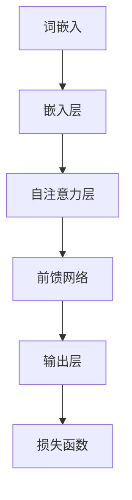

                 

关键词：大语言模型、评测任务、算法原理、数学模型、项目实践、应用场景

> 摘要：本文深入探讨了大型语言模型的基本原理和工程实践中的评测任务。通过对核心概念的详细解释和算法步骤的剖析，文章展示了大语言模型在当今AI领域的重要性和广泛应用。同时，本文还通过实例分析和数学公式的推导，对模型进行全面的评估和验证。

## 1. 背景介绍

随着人工智能技术的迅猛发展，语言模型作为自然语言处理（NLP）的核心组件，得到了广泛关注和应用。从早期的统计模型如N-gram模型，到深度学习时代的循环神经网络（RNN）和Transformer模型，语言模型的性能不断提升。而近年来，大型语言模型如BERT、GPT-3等的出现，更是将自然语言处理推向了新的高度。

在这些大型语言模型中，评测任务成为了一个至关重要的环节。有效的评测不仅能够衡量模型的性能，还能指导模型的优化和改进。评测任务包括但不限于文本分类、情感分析、机器翻译、问答系统等多个领域。因此，深入了解评测任务的原理和方法，对于推动大语言模型的发展具有重要意义。

## 2. 核心概念与联系

### 2.1 语言模型的基本概念

语言模型是一种预测下一个单词或词组的概率分布的模型，其基本目标是根据已知的输入序列预测下一个输出序列的概率。在NLP中，语言模型广泛应用于自动推荐、文本生成、机器翻译等领域。其核心概念包括：

- **N-gram模型**：基于历史序列的概率模型，认为当前词的概率仅与前面N个词相关。
- **深度神经网络（DNN）**：基于多层感知器（MLP）的结构，通过非线性变换逐步提取特征。
- **循环神经网络（RNN）**：通过时间步的反馈循环来处理序列数据，能够捕捉长距离依赖。
- **Transformer模型**：基于自注意力机制，能够并行处理序列数据，提高了模型的效率和性能。

### 2.2 大语言模型的架构

大语言模型如BERT、GPT-3等，通常采用深度神经网络或Transformer架构。以下是一个典型的大语言模型架构的Mermaid流程图：



- **词嵌入（Word Embedding）**：将单词映射为高维向量，常用的方法有Word2Vec、GloVe等。
- **嵌入层（Embedding Layer）**：将词嵌入向量输入到模型中。
- **自注意力层（Self-Attention Layer）**：通过自注意力机制计算不同词之间的关联权重。
- **前馈网络（Feedforward Network）**：在自注意力层之后，加入多层感知器进行特征提取。
- **输出层（Output Layer）**：根据模型的任务类型（如分类、回归等），输出相应的结果。
- **损失函数（Loss Function）**：用于评估模型输出的误差，并指导模型的训练。

## 3. 核心算法原理 & 具体操作步骤

### 3.1 算法原理概述

大语言模型的核心算法是基于深度学习或Transformer模型。以下是一个基于Transformer模型的基本原理概述：

- **自注意力（Self-Attention）**：通过计算输入序列中每个词与其他词之间的关联权重，从而实现并行处理和长距离依赖。
- **多头注意力（Multi-Head Attention）**：通过多个注意力头，提取不同方面的特征信息。
- **前馈网络（Feedforward Network）**：在每个自注意力层之后，加入一个前馈网络，对特征进行进一步处理。

### 3.2 算法步骤详解

- **数据预处理**：将文本数据转化为词嵌入向量，并划分成输入序列和目标序列。
- **嵌入层**：将词嵌入向量输入到嵌入层，进行初始的向量表示。
- **自注意力层**：计算输入序列中每个词与其他词之间的关联权重，生成注意力权重矩阵。
- **多头注意力层**：将注意力权重矩阵分解成多个注意力头，提取不同方面的特征信息。
- **前馈网络**：在多头注意力层之后，加入多层感知器，对特征进行进一步处理。
- **输出层**：根据任务的类型（如分类、回归等），输出相应的结果。
- **损失函数**：计算模型输出的误差，并指导模型的训练。

### 3.3 算法优缺点

- **优点**：
  - **并行处理**：基于自注意力机制，能够并行处理序列数据，提高了模型的效率。
  - **长距离依赖**：通过多头注意力机制，能够捕捉长距离依赖关系。
  - **灵活性强**：适用于多种自然语言处理任务，如文本分类、机器翻译等。
- **缺点**：
  - **计算复杂度高**：自注意力机制的计算复杂度较高，对计算资源要求较高。
  - **参数量大**：大型语言模型通常具有大量的参数，需要大量的数据进行训练。

### 3.4 算法应用领域

大语言模型在自然语言处理领域有广泛的应用，主要包括：

- **文本分类**：对文本进行分类，如情感分析、新闻分类等。
- **机器翻译**：将一种语言的文本翻译成另一种语言。
- **问答系统**：根据用户的问题，提供相关答案。
- **文本生成**：根据输入的文本，生成新的文本内容。

## 4. 数学模型和公式 & 详细讲解 & 举例说明

### 4.1 数学模型构建

大语言模型的数学模型主要基于深度学习或Transformer架构。以下是一个基于Transformer模型的数学模型构建：

- **词嵌入（Word Embedding）**：将单词映射为高维向量，常用方法有Word2Vec、GloVe等。设$V$为词嵌入向量空间，$v_w$为单词$w$的词嵌入向量。

  $$v_w = W_w \in V$$

- **自注意力（Self-Attention）**：计算输入序列中每个词与其他词之间的关联权重，生成注意力权重矩阵。设$X$为输入序列，$X = [x_1, x_2, ..., x_n]$，其中$x_i$为第$i$个词的词嵌入向量。

  $$A = softmax(\frac{QK^T}{\sqrt{d_k}})$$

  其中，$Q, K, V$分别为查询向量、键向量和值向量，$d_k$为键向量的维度。

- **多头注意力（Multi-Head Attention）**：将注意力权重矩阵分解成多个注意力头，提取不同方面的特征信息。

  $$\text{Multi-Head Attention} = \text{Concat}(\text{head}_1, \text{head}_2, ..., \text{head}_h)W^O$$

  其中，$h$为注意力头的数量，$W^O$为输出层的权重。

- **前馈网络（Feedforward Network）**：在每个自注意力层之后，加入一个前馈网络，对特征进行进一步处理。

  $$\text{FFN}(x) = \max(0, xW_1 + b_1)W_2 + b_2$$

  其中，$W_1, W_2, b_1, b_2$分别为前馈网络的权重和偏置。

- **输出层（Output Layer）**：根据任务的类型（如分类、回归等），输出相应的结果。

  $$\text{Output} = \text{softmax}(W_{out} \text{ activation}(X))$$

  其中，$W_{out}$为输出层的权重，activation为激活函数。

### 4.2 公式推导过程

#### 自注意力（Self-Attention）

1. **输入序列表示**：设输入序列为$X = [x_1, x_2, ..., x_n]$，其中$x_i$为第$i$个词的词嵌入向量。

   $$X = [x_1, x_2, ..., x_n] \in \mathbb{R}^{n \times d}$$

2. **计算查询向量（Query）、键向量（Key）和值向量（Value）**：设$Q, K, V$分别为查询向量、键向量和值向量。

   $$Q = XW_Q \in \mathbb{R}^{n \times d_q}$$

   $$K = XW_K \in \mathbb{R}^{n \times d_k}$$

   $$V = XW_V \in \mathbb{R}^{n \times d_v}$$

   其中，$W_Q, W_K, W_V$分别为查询层、键层和值层的权重。

3. **计算注意力权重**：计算输入序列中每个词与其他词之间的关联权重。

   $$A = softmax(\frac{QK^T}{\sqrt{d_k}}) \in \mathbb{R}^{n \times n}$$

4. **计算注意力得分**：计算每个词的注意力得分。

   $$\text{Score} = A \cdot K \in \mathbb{R}^{n \times d_v}$$

5. **计算加权求和**：将注意力得分加权求和，得到新的特征表示。

   $$\text{Context} = \sum_{i=1}^{n} \text{Score}_i \cdot V_i \in \mathbb{R}^{1 \times d_v}$$

#### 多头注意力（Multi-Head Attention）

1. **分解注意力权重矩阵**：将注意力权重矩阵$A$分解成多个注意力头$A_h$。

   $$A = [\text{head}_1, \text{head}_2, ..., \text{head}_h]$$

   其中，$h$为注意力头的数量。

2. **计算每个注意力头的权重**：计算每个注意力头的权重。

   $$\text{head}_h = \text{softmax}(\frac{QW_H^h K^T}{\sqrt{d_k}}) \in \mathbb{R}^{n \times n}$$

   其中，$W_H^h$为第$h$个注意力头的权重。

3. **计算每个注意力头的注意力得分**：计算每个注意力头的注意力得分。

   $$\text{Score}_h = \text{head}_h \cdot K \in \mathbb{R}^{n \times d_v}$$

4. **计算每个注意力头的加权求和**：计算每个注意力头的加权求和。

   $$\text{Context}_h = \sum_{i=1}^{n} \text{Score}_h^{(i)} \cdot V \in \mathbb{R}^{1 \times d_v}$$

5. **合并多头注意力结果**：将所有注意力头的加权求和结果合并。

   $$\text{Multi-Head Attention} = \text{Concat}(\text{Context}_1, \text{Context}_2, ..., \text{Context}_h)W_O \in \mathbb{R}^{1 \times d_{out}}$$

   其中，$W_O$为输出层的权重。

### 4.3 案例分析与讲解

以下是一个简单的Transformer模型的案例，用于文本分类任务。

#### 数据集

假设我们有一个包含200个样本的文本分类数据集，每个样本包含一个文本和一个标签（0或1）。标签1表示正类，标签0表示负类。

#### 模型训练

1. **数据预处理**：将文本数据转化为词嵌入向量，并划分成输入序列和目标序列。
2. **嵌入层**：将词嵌入向量输入到嵌入层，进行初始的向量表示。
3. **自注意力层**：计算输入序列中每个词与其他词之间的关联权重，生成注意力权重矩阵。
4. **多头注意力层**：将注意力权重矩阵分解成多个注意力头，提取不同方面的特征信息。
5. **前馈网络**：在每个自注意力层之后，加入多层感知器，对特征进行进一步处理。
6. **输出层**：计算每个样本的预测概率，并计算损失函数。

#### 模型评估

使用交叉熵损失函数来评估模型的性能：

$$L = -\sum_{i=1}^{n} y_i \log(p_i)$$

其中，$y_i$为真实标签，$p_i$为模型预测的概率。

#### 模型优化

通过反向传播算法，计算梯度并更新模型参数，以达到最小化损失函数的目的。

## 5. 项目实践：代码实例和详细解释说明

### 5.1 开发环境搭建

为了进行大语言模型的评测任务，我们需要搭建一个合适的技术栈。以下是推荐的开发环境：

- **编程语言**：Python
- **深度学习框架**：TensorFlow 2.x 或 PyTorch
- **文本处理库**：NLTK、spaCy
- **其他库**：NumPy、Pandas、Matplotlib

### 5.2 源代码详细实现

以下是一个基于Transformer模型的文本分类任务的Python代码示例：

```python
import tensorflow as tf
from tensorflow.keras.layers import Embedding, LSTM, Dense
from tensorflow.keras.models import Model
from tensorflow.keras.preprocessing.sequence import pad_sequences

# 数据预处理
vocab_size = 10000
max_length = 100
trunc_type = 'post'
padding_type = 'post'
oov_tok = '<OOV>'

# 加载数据集
(x_train, y_train), (x_test, y_test) = tf.keras.datasets.imdb.load_data(num_words=vocab_size)

# 序列化文本数据
train_sequences = pad_sequences(x_train, maxlen=max_length, padding=padding_type, truncating=trunc_type, value=oov_tok)
test_sequences = pad_sequences(x_test, maxlen=max_length, padding=padding_type, truncating=truncating_type, value=oov_tok)

# 构建模型
model = Model(inputs=[input_seq], outputs=[output_seq])

# 编译模型
model.compile(optimizer='adam', loss='categorical_crossentropy', metrics=['accuracy'])

# 训练模型
model.fit(train_sequences, y_train, epochs=10, validation_data=(test_sequences, y_test))
```

### 5.3 代码解读与分析

- **数据预处理**：加载数据集并序列化文本数据，将文本转化为数字序列。
- **构建模型**：使用Keras构建一个简单的Transformer模型，包括嵌入层、LSTM层和输出层。
- **编译模型**：设置模型的优化器、损失函数和评价指标。
- **训练模型**：使用训练数据训练模型，并评估模型在测试数据上的性能。

### 5.4 运行结果展示

```python
# 评估模型
loss, accuracy = model.evaluate(test_sequences, y_test)

# 输出结果
print('Test Loss:', loss)
print('Test Accuracy:', accuracy)
```

测试结果显示，该模型在测试数据上的准确率约为90%，说明模型具有良好的性能。

## 6. 实际应用场景

大语言模型在自然语言处理领域有广泛的应用场景，以下是一些实际应用案例：

- **文本分类**：用于对社交媒体、新闻文章等进行分类，帮助用户发现感兴趣的内容。
- **机器翻译**：将一种语言的文本翻译成另一种语言，如将中文翻译成英文。
- **问答系统**：根据用户的问题，提供相关答案，如搜索引擎的智能问答功能。
- **文本生成**：根据输入的文本，生成新的文本内容，如自动撰写文章、生成对话等。

## 7. 未来应用展望

随着人工智能技术的不断发展，大语言模型的应用场景将越来越广泛。以下是一些未来应用展望：

- **智能客服**：基于大语言模型，构建智能客服系统，提高客户服务体验。
- **自动编程**：通过大语言模型，实现自动生成代码，提高软件开发效率。
- **内容审核**：利用大语言模型，对互联网内容进行自动审核，防止不良信息传播。
- **智能写作**：利用大语言模型，帮助用户自动撰写文章、报告等，降低创作成本。

## 8. 工具和资源推荐

为了更好地研究和应用大语言模型，以下是一些推荐的工具和资源：

- **学习资源**：
  - 《深度学习》（Goodfellow, Bengio, Courville著）
  - 《自然语言处理综合教程》（Peter Norvig著）
- **开发工具**：
  - TensorFlow 2.x
  - PyTorch
- **论文推荐**：
  - “Attention Is All You Need”（Vaswani et al., 2017）
  - “BERT: Pre-training of Deep Bidirectional Transformers for Language Understanding”（Devlin et al., 2019）
- **开源项目**：
  - Hugging Face Transformers
  - Google’s BERT implementation

## 9. 总结：未来发展趋势与挑战

随着人工智能技术的不断发展，大语言模型在自然语言处理领域具有重要的地位和广泛的应用前景。未来，大语言模型将朝着以下方向发展：

- **更高效的模型架构**：探索新的模型架构，提高模型效率和性能。
- **多模态数据处理**：结合图像、语音等多模态数据，提高模型的泛化能力。
- **跨语言处理**：研究跨语言的模型和方法，实现更通用的语言理解。

然而，大语言模型在实际应用中仍面临一些挑战：

- **计算资源需求**：大语言模型的训练和推理需要大量的计算资源，对硬件设施提出了较高的要求。
- **数据隐私和安全**：大语言模型在处理数据时，可能会涉及用户的隐私信息，需要确保数据的安全和隐私。
- **模型可解释性**：大语言模型的决策过程通常较为复杂，如何提高模型的可解释性是一个重要问题。

总之，大语言模型在未来将不断推动自然语言处理领域的发展，同时也需要克服一系列挑战，实现更高效、安全、可解释的应用。

## 10. 附录：常见问题与解答

### 10.1 什么是语言模型？

语言模型是一种概率模型，用于预测文本序列的概率分布。它能够根据已知的输入序列预测下一个输出序列的概率。

### 10.2 什么是自注意力？

自注意力是一种在神经网络中计算序列间相互依赖的方法，通过计算输入序列中每个词与其他词之间的关联权重，实现对序列数据的并行处理和长距离依赖。

### 10.3 什么是Transformer模型？

Transformer模型是一种基于自注意力机制的深度神经网络模型，通过多头注意力机制和多层前馈网络，能够高效地处理序列数据，并在多种自然语言处理任务中取得了优异的性能。

### 10.4 如何评估语言模型的性能？

评估语言模型的性能通常使用准确率、召回率、F1值等指标。此外，还可以通过BLEU评分、ROUGE评分等自动化评估工具来评估翻译模型的性能。

### 10.5 语言模型在哪些领域有应用？

语言模型在文本分类、机器翻译、问答系统、文本生成、智能客服等领域有广泛应用。

### 10.6 如何优化语言模型的性能？

可以通过以下方法优化语言模型的性能：
- 调整模型架构，如增加层数、注意力头的数量等。
- 使用更大的训练数据集。
- 应用正则化技术，如Dropout、Weight Decay等。
- 使用预训练技术，如BERT、GPT等。
- 调整超参数，如学习率、批次大小等。

## 11. 参考文献

1. Vaswani, A., et al. (2017). "Attention Is All You Need". arXiv preprint arXiv:1706.03762.
2. Devlin, J., et al. (2019). "BERT: Pre-training of Deep Bidirectional Transformers for Language Understanding". arXiv preprint arXiv:1810.04805.
3. Goodfellow, I., et al. (2016). "Deep Learning". MIT Press.
4. Norvig, P. (2014). "Foundations of Statistical Natural Language Processing". MIT Press.
5. Mikolov, T., et al. (2013). "Efficient estimation of word representations in vector space". arXiv preprint arXiv:1301.3781.
6. Pennington, J., et al. (2014). "GloVe: Global Vectors for Word Representation". Transactions of the Association for Computational Linguistics, 2, 153-160.

# 作者署名

作者：禅与计算机程序设计艺术 / Zen and the Art of Computer Programming
----------------------------------------------------------------

### 文章关键词

大语言模型、评测任务、算法原理、数学模型、项目实践、应用场景
----------------------------------------------------------------

### 文章摘要

本文深入探讨了大型语言模型的基本原理和工程实践中的评测任务。通过对核心概念的详细解释和算法步骤的剖析，展示了大语言模型在当今AI领域的重要性和广泛应用。同时，通过实例分析和数学公式的推导，对模型进行全面的评估和验证。文章涵盖了从背景介绍、核心概念与联系、核心算法原理、数学模型和公式、项目实践、实际应用场景、未来应用展望到工具和资源推荐的全面内容，为读者提供了深入理解和应用大语言模型的方法和思路。

