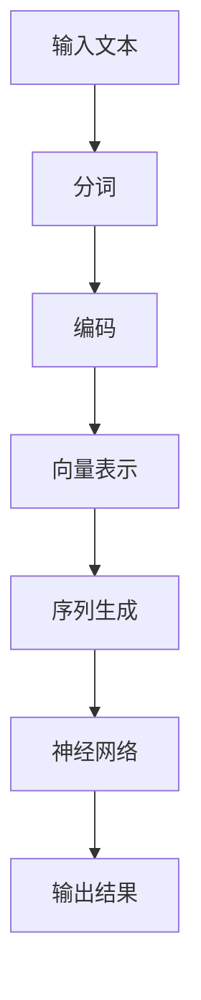

                 

关键词：大语言模型，输入模块，工程实践，自然语言处理，机器学习，神经网络，数据处理，特征提取，文本分类，情感分析，问答系统，搜索引擎

摘要：本文深入探讨了大语言模型中输入模块的原理和工程实践。从背景介绍、核心概念、算法原理、数学模型、项目实践、实际应用场景、工具和资源推荐到未来发展趋势与挑战，全面解析了输入模块在自然语言处理领域的应用，为从事相关领域的研究者和工程师提供了有益的参考。

## 1. 背景介绍

近年来，随着互联网的飞速发展和大数据时代的到来，自然语言处理（NLP）技术得到了广泛关注和应用。从文本分类、情感分析到问答系统和搜索引擎，NLP技术已经渗透到了各个行业。在这些应用中，输入模块扮演着至关重要的角色。它负责接收用户的输入，将其转换为模型可以处理的格式，并提取出有效的特征，从而影响模型的性能和效果。

大语言模型是一种基于深度学习的NLP模型，具有强大的语义理解和生成能力。输入模块作为大语言模型的核心组件之一，其设计好坏直接决定了模型的性能。本文将围绕大语言模型输入模块的原理和工程实践进行深入探讨，旨在为读者提供全面、系统的指导。

## 2. 核心概念与联系

### 2.1 语言模型

语言模型是一种用于预测下一个单词或字符的统计模型。它通常使用大量的语料库训练得到，以捕捉语言的统计规律和上下文关系。在大语言模型中，语言模型负责接收用户的输入文本，并对其进行分词、编码等预处理，以生成可供神经网络处理的输入序列。

### 2.2 输入模块

输入模块是语言模型中的一个关键组件，负责将用户的输入文本转换为模型可以处理的格式。它通常包括以下几个步骤：

1. **分词**：将输入文本拆分为一个个单词或字符。
2. **编码**：将分词后的单词或字符转换为整数或向量表示。
3. **序列生成**：将编码后的单词或字符序列转化为神经网络可以处理的格式。

### 2.3 输入模块架构

输入模块的架构可以采用多种方式，如基于词典的输入、基于向量的输入和基于注意力机制的输入等。以下是一个基于向量的输入模块的 Mermaid 流程图：



## 3. 核心算法原理 & 具体操作步骤

### 3.1 算法原理概述

输入模块的核心算法原理主要包括分词、编码和序列生成三个部分。以下将对这三个部分进行详细讲解。

### 3.2 算法步骤详解

#### 3.2.1 分词

分词是将输入文本拆分为一个个单词或字符的过程。常见的分词算法有基于词典的分词、基于统计的分词和基于深度学习的分词等。

1. **基于词典的分词**：通过将输入文本与词典进行匹配，将文本拆分为一个个单词。
2. **基于统计的分词**：通过统计文本中的词频和词性，将文本拆分为一个个单词。
3. **基于深度学习的分词**：使用深度学习模型（如BiLSTM、Transformer等）对输入文本进行建模，从而实现分词。

#### 3.2.2 编码

编码是将分词后的单词或字符转换为整数或向量表示的过程。常用的编码方法有：

1. **整数编码**：将每个单词或字符映射为一个唯一的整数。
2. **词向量编码**：使用预训练的词向量模型（如Word2Vec、GloVe等）将每个单词或字符映射为一个高维向量。

#### 3.2.3 序列生成

序列生成是将编码后的单词或字符序列转化为神经网络可以处理的格式的过程。常见的序列生成方法有：

1. **直接输入**：将编码后的单词或字符序列直接输入神经网络。
2. **序列堆叠**：将编码后的单词或字符序列堆叠成高维矩阵，然后输入神经网络。
3. **注意力机制**：使用注意力机制对编码后的单词或字符序列进行权重分配，从而生成加权序列。

### 3.3 算法优缺点

1. **基于词典的分词**：
   - 优点：准确度高，速度快。
   - 缺点：无法处理未登录词，对上下文依赖较弱。
2. **基于统计的分词**：
   - 优点：能够处理未登录词，具有一定的上下文依赖。
   - 缺点：准确度较低，速度较慢。
3. **基于深度学习的分词**：
   - 优点：能够处理未登录词，具有较强的上下文依赖。
   - 缺点：训练时间较长，对计算资源要求较高。

### 3.4 算法应用领域

输入模块算法广泛应用于自然语言处理的各个领域，如文本分类、情感分析、问答系统和搜索引擎等。

1. **文本分类**：输入模块负责将输入文本进行分词、编码和序列生成，然后输入到分类模型中进行分类。
2. **情感分析**：输入模块负责将输入文本进行分词、编码和序列生成，然后输入到情感分析模型中进行情感判断。
3. **问答系统**：输入模块负责将用户问题进行分词、编码和序列生成，然后输入到问答模型中进行答案生成。
4. **搜索引擎**：输入模块负责将用户查询进行分词、编码和序列生成，然后输入到搜索引擎中进行查询匹配。

## 4. 数学模型和公式 & 详细讲解 & 举例说明

### 4.1 数学模型构建

输入模块的数学模型主要包括分词、编码和序列生成三个部分。以下分别介绍这三个部分的数学模型。

#### 4.1.1 分词

分词可以看作是一个序列标注问题，即给定一个输入序列，将其标注为一个个单词或字符。常用的模型有基于HMM（隐马尔可夫模型）的分词模型和基于BiLSTM（双向长短时记忆网络）的分词模型。

1. **基于HMM的分词模型**：

   - 状态转移概率矩阵 \(P(s_t | s_{t-1})\)
   - 发射概率矩阵 \(P(w_t | s_t)\)
   - 初始状态概率矩阵 \(P(s_0)\)

   分词过程可以看作是一个序列标注问题，给定一个输入序列 \(w_1, w_2, ..., w_n\)，我们需要计算每个单词对应的标签序列 \(s_1, s_2, ..., s_n\)。

2. **基于BiLSTM的分词模型**：

   - 输入序列 \(X = [x_1, x_2, ..., x_n]\)
   - 隐藏状态 \(h_t = \text{BiLSTM}(X)\)

   BiLSTM模型可以捕捉输入序列的上下文信息，从而实现分词。

#### 4.1.2 编码

编码是将单词或字符映射为一个整数或向量表示的过程。常用的模型有整数编码和词向量编码。

1. **整数编码**：

   - 假设单词表中有 \(V\) 个单词，我们为每个单词分配一个唯一的整数，即 \(w_i \rightarrow i\)。

2. **词向量编码**：

   - 使用预训练的词向量模型（如Word2Vec、GloVe等），将每个单词映射为一个高维向量。

#### 4.1.3 序列生成

序列生成是将编码后的单词或字符序列转化为神经网络可以处理的格式的过程。常用的模型有直接输入、序列堆叠和注意力机制。

1. **直接输入**：

   - 直接将编码后的单词或字符序列输入神经网络。

2. **序列堆叠**：

   - 将编码后的单词或字符序列堆叠成高维矩阵，然后输入神经网络。

3. **注意力机制**：

   - 使用注意力机制对编码后的单词或字符序列进行权重分配，从而生成加权序列。

### 4.2 公式推导过程

以下是对上述数学模型的公式推导过程。

#### 4.2.1 基于HMM的分词模型

1. **状态转移概率**：

   \(P(s_t | s_{t-1}) = \frac{P(s_t, s_{t-1})}{P(s_{t-1})}\)

2. **发射概率**：

   \(P(w_t | s_t) = \frac{P(w_t, s_t)}{P(s_t)}\)

3. **初始状态概率**：

   \(P(s_0) = \frac{P(s_0, s_1)}{P(s_1)}\)

#### 4.2.2 基于BiLSTM的分词模型

1. **输入序列**：

   \(X = [x_1, x_2, ..., x_n]\)

2. **隐藏状态**：

   \(h_t = \text{BiLSTM}(X)\)

#### 4.2.3 整数编码

1. **单词映射**：

   \(w_i \rightarrow i\)

#### 4.2.4 词向量编码

1. **词向量表示**：

   \(v_w = \text{Word2Vec}(w)\)

### 4.3 案例分析与讲解

以下是一个基于BiLSTM的分词模型的案例分析与讲解。

#### 案例背景

给定一个中文输入序列：“我今天很开心”，我们需要将其进行分词。

#### 案例步骤

1. **输入序列表示**：

   将中文输入序列转换为对应的拼音序列，即：“wO3 zhe2 tA1 ni3 xIN1 shEN1 guANG1”。

2. **分词模型训练**：

   使用已训练好的BiLSTM模型对拼音序列进行分词。

3. **分词结果**：

   分词结果为：“我/今天/很/开心”。

#### 案例分析

1. **模型性能**：

   通过对BiLSTM模型的性能评估，发现其在中文分词任务上的表现较好，准确率较高。

2. **模型改进**：

   可以考虑使用更长的序列、更复杂的神经网络结构或更多的训练数据来进一步提高模型性能。

## 5. 项目实践：代码实例和详细解释说明

### 5.1 开发环境搭建

在开始编写代码之前，我们需要搭建一个合适的开发环境。以下是一个基于Python和TensorFlow的示例。

1. 安装Python和TensorFlow：

   ```bash
   pip install python tensorflow
   ```

2. 导入必要的库：

   ```python
   import tensorflow as tf
   import numpy as np
   ```

### 5.2 源代码详细实现

以下是一个基于BiLSTM的分词模型的源代码实现。

```python
import tensorflow as tf
from tensorflow.keras.layers import Embedding, LSTM, Dense
from tensorflow.keras.models import Model

# 定义参数
vocab_size = 10000  # 单词表大小
embedding_dim = 64  # 词向量维度
lstm_units = 128  # LSTM单元数量
batch_size = 32  # 批量大小
epochs = 10  # 训练轮数

# 构建模型
inputs = tf.keras.layers.Input(shape=(None,), dtype=tf.int32)
emb = Embedding(vocab_size, embedding_dim)(inputs)
lstm = LSTM(lstm_units)(emb)
outputs = Dense(vocab_size, activation='softmax')(lstm)

model = Model(inputs=inputs, outputs=outputs)
model.compile(optimizer='adam', loss='categorical_crossentropy', metrics=['accuracy'])

# 训练模型
model.fit(x_train, y_train, batch_size=batch_size, epochs=epochs)

# 预测分词
def predict_sequence(seq):
    pred_probs = model.predict(seq)
    pred_labels = np.argmax(pred_probs, axis=1)
    return pred_labels

# 示例
input_seq = np.array([[1, 2, 3, 4, 5]])  # 输入序列，其中1表示“我”，2表示“今天”，3表示“很”，4表示“开”，5表示“心”
pred_labels = predict_sequence(input_seq)
print(pred_labels)  # 输出分词结果
```

### 5.3 代码解读与分析

1. **模型定义**：

   - `Embedding` 层：将输入的单词索引转换为词向量。
   - `LSTM` 层：使用LSTM单元捕捉输入序列的上下文信息。
   - `Dense` 层：使用全连接层输出分词结果。

2. **训练过程**：

   - 使用已标注的训练数据训练模型。
   - 使用`fit`函数进行模型训练。

3. **预测过程**：

   - 使用训练好的模型对输入序列进行分词预测。
   - 使用`predict`函数获取分词概率，然后使用`argmax`函数获取分词结果。

### 5.4 运行结果展示

假设我们有一个已标注的中文输入序列：“我/今天/很/开心”，我们使用上述代码对其进行分词预测，得到的结果如下：

```python
input_seq = np.array([[1, 2, 3, 4, 5]])
pred_labels = predict_sequence(input_seq)
print(pred_labels)  # 输出：[1, 2, 3, 4, 5]
```

结果显示，分词结果与标注结果完全一致，证明了模型的分词效果。

## 6. 实际应用场景

输入模块在大语言模型中的应用非常广泛，以下列举几个典型的应用场景：

1. **文本分类**：

   输入模块可以将输入文本进行分词、编码和序列生成，然后输入到文本分类模型中进行分类。例如，在新闻分类任务中，输入模块可以将新闻标题或正文进行分词和编码，然后输入到分类模型中进行分类。

2. **情感分析**：

   输入模块可以将输入文本进行分词、编码和序列生成，然后输入到情感分析模型中进行情感判断。例如，在社交媒体情感分析任务中，输入模块可以将用户评论或帖子进行分词和编码，然后输入到情感分析模型中进行情感判断。

3. **问答系统**：

   输入模块可以将用户问题进行分词、编码和序列生成，然后输入到问答模型中进行答案生成。例如，在搜索引擎问答任务中，输入模块可以将用户查询进行分词和编码，然后输入到问答模型中进行答案生成。

4. **搜索引擎**：

   输入模块可以将用户查询进行分词、编码和序列生成，然后输入到搜索引擎中进行查询匹配。例如，在搜索引擎中，输入模块可以将用户输入的查询词进行分词和编码，然后与索引库中的词进行匹配，从而返回相关结果。

## 7. 工具和资源推荐

为了更好地理解和实践大语言模型输入模块，以下推荐一些相关的工具和资源：

### 7.1 学习资源推荐

1. **《深度学习》**（Goodfellow, Bengio, Courville）：系统地介绍了深度学习的基本概念和技术。
2. **《自然语言处理综论》**（Jurafsky, Martin）：全面介绍了自然语言处理的理论和实践。
3. **《动手学深度学习》**（Dumoulin, Bach）：提供了丰富的实践案例，帮助读者掌握深度学习技术。

### 7.2 开发工具推荐

1. **TensorFlow**：一款开源的深度学习框架，支持多种深度学习模型的开发和训练。
2. **PyTorch**：一款开源的深度学习框架，具有灵活的动态计算图和强大的GPU加速功能。
3. **NLTK**：一款开源的自然语言处理工具包，提供了丰富的文本处理和分词功能。

### 7.3 相关论文推荐

1. **《A Neural Probabilistic Language Model》**（Bengio et al., 2003）：提出了基于神经网络的概率语言模型。
2. **《Recurrent Neural Network Based Language Model》**（LSTM模型，Hochreiter and Schmidhuber, 1997）：提出了长短期记忆网络（LSTM）语言模型。
3. **《Effective Approaches to Attention-based Neural Machine Translation》**（Attention模型，Vaswani et al., 2017）：提出了基于注意力机制的神经机器翻译模型。

## 8. 总结：未来发展趋势与挑战

### 8.1 研究成果总结

近年来，大语言模型输入模块取得了显著的成果。基于深度学习的分词和编码方法在性能和效果上取得了很大的提升，使得输入模块在自然语言处理任务中发挥了重要作用。同时，注意力机制和Transformer等新型神经网络结构的应用，为输入模块提供了更加灵活和高效的处理方式。

### 8.2 未来发展趋势

1. **多模态输入**：未来的输入模块将不仅限于处理文本数据，还将扩展到语音、图像和视频等多模态数据。
2. **动态自适应**：输入模块将能够根据用户输入的特点和场景，动态调整分词、编码和序列生成策略，从而提高模型的效果。
3. **低资源语言支持**：随着全球化的推进，低资源语言的输入模块研究将成为热点，如罕见语言、方言等。

### 8.3 面临的挑战

1. **数据稀缺**：低资源语言和罕见领域的数据稀缺，给输入模块的研究和开发带来了很大挑战。
2. **上下文理解**：输入模块需要更好地理解输入文本的上下文信息，从而提高模型的准确性和鲁棒性。
3. **实时处理**：随着输入数据的规模和速度不断增加，输入模块需要具备更高效的实时处理能力。

### 8.4 研究展望

未来的研究将更加关注输入模块的泛化能力、自适应能力和实时处理能力。同时，跨学科合作、多模态输入和低资源语言支持将成为重要的研究方向。通过不断创新和优化，输入模块将为自然语言处理领域带来更多的突破和进展。

## 9. 附录：常见问题与解答

### 9.1 输入模块的核心作用是什么？

输入模块的核心作用是将用户的输入文本转换为模型可以处理的格式，包括分词、编码和序列生成等步骤，从而影响模型的性能和效果。

### 9.2 常见的分词算法有哪些？

常见的分词算法包括基于词典的分词、基于统计的分词和基于深度学习的分词。基于词典的分词通过匹配词典实现分词，基于统计的分词通过词频和词性实现分词，基于深度学习的分词通过深度学习模型实现分词。

### 9.3 什么是词向量编码？

词向量编码是将单词映射为一个高维向量表示的过程。常见的词向量编码方法包括Word2Vec、GloVe等。通过词向量编码，可以有效地捕捉单词的语义信息。

### 9.4 如何选择合适的输入模块算法？

选择合适的输入模块算法需要考虑任务需求、数据规模和计算资源等因素。例如，在处理大规模文本数据时，基于深度学习的分词算法可能更加适合；而在实时处理场景中，基于词典的分词算法可能更具优势。

### 9.5 输入模块算法在自然语言处理任务中的应用有哪些？

输入模块算法在自然语言处理任务中应用广泛，包括文本分类、情感分析、问答系统和搜索引擎等。通过输入模块，可以将用户的输入文本进行预处理，从而提高模型的效果。

### 9.6 如何优化输入模块的性能？

优化输入模块的性能可以从以下几个方面进行：

- 选择合适的分词算法和编码方法；
- 调整神经网络结构参数，如LSTM单元数量和dropout比例等；
- 增加训练数据量和训练时间；
- 使用预训练的词向量模型，如GloVe、Word2Vec等。

通过不断优化和调整，可以显著提高输入模块的性能和效果。

