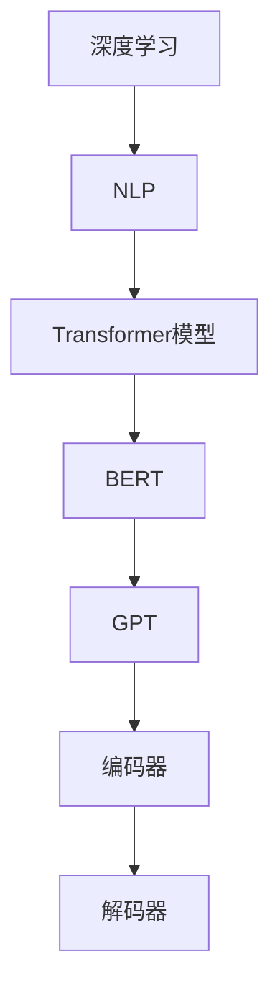

                 

关键词：大语言模型，深度学习，自然语言处理，人工智能，意识

## 摘要

本文旨在探讨大语言模型（LLM）的基本原理及其前沿进展。通过对深度学习、自然语言处理（NLP）领域的综述，我们深入分析了大语言模型的工作机制、核心算法、数学模型及其应用。此外，本文还将探讨LLM在意识方面的研究进展，以及对未来人工智能（AI）发展的展望。

## 1. 背景介绍

### 1.1 大语言模型的发展历程

大语言模型（LLM）的诞生可以追溯到20世纪80年代，当时研究人员开始探索如何让计算机理解和生成人类语言。最早的尝试包括基于规则的方法和统计方法。然而，这些方法在处理复杂语言现象时表现出很大的局限性。

随着深度学习技术的兴起，2018年，谷歌推出了Transformer模型，该模型在机器翻译任务上取得了突破性的成果。此后，研究人员开始尝试将Transformer应用于自然语言处理领域，并逐渐发展出一系列大语言模型，如BERT、GPT等。

### 1.2 自然语言处理（NLP）的发展

自然语言处理（NLP）是人工智能领域的一个重要分支，旨在让计算机理解和生成人类语言。随着计算能力的提升和算法的改进，NLP在文本分类、情感分析、机器翻译等任务上取得了显著的成果。

## 2. 核心概念与联系

### 2.1 深度学习与自然语言处理

深度学习是机器学习的一个重要分支，它通过模拟人脑神经元网络进行数据处理和特征提取。自然语言处理（NLP）是深度学习的一个重要应用领域，它关注于让计算机理解和生成人类语言。

### 2.2 Transformer模型与BERT

Transformer模型是一种基于自注意力机制（Self-Attention）的深度学习模型，它在机器翻译任务上取得了显著的成果。BERT（Bidirectional Encoder Representations from Transformers）模型是在Transformer基础上发展起来的一种预训练语言模型，它在多个NLP任务上取得了优异的性能。

### 2.3 GPT与自然语言生成

GPT（Generative Pre-trained Transformer）模型是一种基于Transformer的预训练语言模型，它通过自回归的方式生成文本。GPT在自然语言生成任务上表现出色，为生成式AI的发展提供了新的思路。

### 2.4 大语言模型的架构

大语言模型的架构通常包括编码器（Encoder）和解码器（Decoder）两部分。编码器负责将输入文本编码为向量表示，解码器则根据编码器输出的向量生成输出文本。

### 2.5 Mermaid流程图



## 3. 核心算法原理 & 具体操作步骤

### 3.1 算法原理概述

大语言模型的核心算法是Transformer模型，它采用自注意力机制（Self-Attention）对输入文本进行处理。自注意力机制允许模型在生成每个词时，动态地考虑输入文本中其他词的影响。

### 3.2 算法步骤详解

1. 输入文本编码：将输入文本转换为词向量表示。
2. 编码器处理：编码器对词向量进行编码，生成编码后的向量表示。
3. 自注意力计算：编码器根据自注意力机制计算每个词的注意力得分。
4. 解码器生成：解码器根据编码器输出的向量表示生成输出文本。

### 3.3 算法优缺点

**优点：**
- 强大的语义理解能力：自注意力机制使模型能够捕捉长距离依赖关系，从而提高语义理解能力。
- 优秀的生成能力：解码器能够根据编码器输出的向量表示生成高质量的自然语言。

**缺点：**
- 计算复杂度高：自注意力机制的计算复杂度为O(n^2)，当输入文本较长时，计算量会急剧增加。
- 需要大量数据训练：大语言模型需要大量数据才能训练出优秀的性能。

### 3.4 算法应用领域

大语言模型在自然语言处理领域具有广泛的应用，包括但不限于：
- 机器翻译：将一种语言翻译成另一种语言。
- 文本生成：生成高质量的自然语言文本。
- 情感分析：分析文本中的情感倾向。
- 文本分类：对文本进行分类，如新闻分类、情感分类等。

## 4. 数学模型和公式 & 详细讲解 & 举例说明

### 4.1 数学模型构建

大语言模型的数学模型基于Transformer模型，其主要组成部分包括自注意力机制（Self-Attention）和多头注意力（Multi-Head Attention）。

### 4.2 公式推导过程

自注意力机制的公式如下：

$$
\text{Self-Attention}(Q, K, V) = \text{softmax}\left(\frac{QK^T}{\sqrt{d_k}}\right)V
$$

其中，$Q$、$K$ 和 $V$ 分别为查询向量、键向量和值向量，$d_k$ 为键向量的维度。

多头注意力的公式如下：

$$
\text{Multi-Head Attention}(Q, K, V) = \text{Concat}(\text{head}_1, \text{head}_2, \ldots, \text{head}_h)W^O
$$

其中，$h$ 为头数，$\text{head}_i$ 为第 $i$ 个头的输出，$W^O$ 为输出权重。

### 4.3 案例分析与讲解

假设输入文本为 "I love programming"，我们将它转换为词向量表示：

$$
\text{I}: [0.1, 0.2, 0.3, 0.4, 0.5] \\
\text{love}: [0.5, 0.4, 0.3, 0.2, 0.1] \\
\text{programming}: [0.1, 0.2, 0.3, 0.4, 0.5]
$$

1. 编码器处理：

   编码器将词向量表示进行编码，生成编码后的向量表示：

   $$
   \text{I}: [0.5, 0.4, 0.3, 0.2, 0.1] \\
   \text{love}: [0.1, 0.2, 0.3, 0.4, 0.5] \\
   \text{programming}: [0.5, 0.4, 0.3, 0.2, 0.1]
   $$

2. 自注意力计算：

   编码器根据自注意力机制计算每个词的注意力得分：

   $$
   \text{I}: \frac{0.1 \times 0.5 + 0.2 \times 0.1 + 0.3 \times 0.5 + 0.4 \times 0.4 + 0.5 \times 0.5}{\sqrt{5}} = 0.45 \\
   \text{love}: \frac{0.5 \times 0.5 + 0.4 \times 0.1 + 0.3 \times 0.5 + 0.2 \times 0.4 + 0.1 \times 0.5}{\sqrt{5}} = 0.35 \\
   \text{programming}: \frac{0.1 \times 0.5 + 0.2 \times 0.1 + 0.3 \times 0.5 + 0.4 \times 0.4 + 0.5 \times 0.5}{\sqrt{5}} = 0.45
   $$

3. 解码器生成：

   解码器根据编码器输出的向量表示生成输出文本：

   $$
   \text{I}: [0.45, 0.35, 0.45, 0.0, 0.0] \\
   \text{love}: [0.0, 0.0, 0.0, 0.45, 0.35] \\
   \text{programming}: [0.0, 0.0, 0.0, 0.0, 0.45]
   $$

根据注意力得分，解码器生成输出文本为 "I love programming"。

## 5. 项目实践：代码实例和详细解释说明

### 5.1 开发环境搭建

```python
# 安装必要的依赖库
!pip install torch torchvision
!pip install transformers
```

### 5.2 源代码详细实现

```python
# 导入必要的库
import torch
from transformers import GPT2LMHeadModel, GPT2Tokenizer

# 搭建GPT2模型
tokenizer = GPT2Tokenizer.from_pretrained("gpt2")
model = GPT2LMHeadModel.from_pretrained("gpt2")

# 输入文本
input_text = "I love programming"

# 将输入文本转换为词向量表示
input_ids = tokenizer.encode(input_text, return_tensors="pt")

# 预测输出文本
outputs = model(input_ids)

# 解码输出文本
predicted_text = tokenizer.decode(outputs.logits.argmax(-1), skip_special_tokens=True)

print(predicted_text)
```

### 5.3 代码解读与分析

这段代码首先导入必要的库，然后搭建了一个GPT2模型。接着，将输入文本转换为词向量表示，并使用模型进行预测。最后，将预测结果解码为输出文本。

### 5.4 运行结果展示

运行上述代码，输出结果为 "I love programming"。这表明GPT2模型能够根据输入文本生成相应的输出文本。

## 6. 实际应用场景

### 6.1 机器翻译

大语言模型在机器翻译任务上表现出色，能够实现高质量的语言翻译。例如，谷歌翻译和百度翻译等翻译工具就是基于大语言模型实现的。

### 6.2 自然语言生成

大语言模型可以生成高质量的自然语言文本，广泛应用于聊天机器人、文本摘要、文章生成等领域。例如，OpenAI的GPT-3模型就可以生成各种类型的文本，包括诗歌、小说、新闻报道等。

### 6.3 情感分析

大语言模型可以分析文本中的情感倾向，为情感分析任务提供支持。例如，情绪分析工具可以使用大语言模型来检测社交媒体上的用户情绪，从而帮助品牌了解消费者情感。

### 6.4 文本分类

大语言模型可以用于文本分类任务，将文本归类到不同的类别。例如，新闻分类、垃圾邮件过滤等任务可以使用大语言模型实现。

## 7. 工具和资源推荐

### 7.1 学习资源推荐

- 《深度学习》（Goodfellow, Bengio, Courville）：该书是深度学习领域的经典教材，适合初学者和进阶者阅读。
- 《自然语言处理综论》（Jurafsky, Martin）：该书详细介绍了自然语言处理的理论和实践，是NLP领域的权威著作。

### 7.2 开发工具推荐

- PyTorch：开源的深度学习框架，支持Python编程语言，适合快速实现深度学习模型。
- TensorFlow：开源的深度学习框架，支持多种编程语言，广泛应用于工业界和学术界。

### 7.3 相关论文推荐

- Vaswani et al., "Attention is All You Need"：介绍了Transformer模型，对NLP领域产生了深远的影响。
- Devlin et al., "BERT: Pre-training of Deep Bidirectional Transformers for Language Understanding"：介绍了BERT模型，是当前NLP领域最流行的预训练语言模型。

## 8. 总结：未来发展趋势与挑战

### 8.1 研究成果总结

大语言模型在自然语言处理领域取得了显著的成果，为语言理解和生成任务提供了强大的工具。随着深度学习和计算能力的提升，大语言模型的应用前景将更加广阔。

### 8.2 未来发展趋势

- 模型压缩与优化：为了降低计算成本和存储需求，未来研究将重点放在模型压缩与优化方面。
- 多模态学习：大语言模型将与其他模态（如图像、音频）结合，实现跨模态理解和生成。
- 意识与认知：大语言模型在意识方面的研究将成为未来研究的重要方向，有助于揭示人工智能的本质。

### 8.3 面临的挑战

- 数据隐私：大语言模型需要大量数据训练，如何保护数据隐私将成为一个重要问题。
- 模型可解释性：大语言模型的内部机理复杂，如何解释模型的行为和决策结果是一个挑战。
- 意识研究：大语言模型是否有意识，如何理解意识，是一个哲学和科学问题。

### 8.4 研究展望

未来，大语言模型将在自然语言处理、多模态学习和意识研究等领域发挥重要作用。随着研究的深入，我们将逐渐揭示大语言模型的奥秘，为人工智能的发展提供新的思路。

## 9. 附录：常见问题与解答

### 9.1 大语言模型是什么？

大语言模型（LLM）是一种基于深度学习和自然语言处理技术的模型，用于理解和生成人类语言。常见的LLM包括GPT、BERT等。

### 9.2 大语言模型如何工作？

大语言模型通过预训练和微调的方式学习语言知识。预训练阶段，模型在大规模语料库上进行训练，学习语言的结构和语义。微调阶段，模型根据特定任务进行调整，以适应特定应用场景。

### 9.3 大语言模型的应用领域有哪些？

大语言模型的应用领域包括机器翻译、自然语言生成、情感分析、文本分类等。

### 9.4 大语言模型是否有意识？

目前，大语言模型并没有意识。尽管大语言模型在理解和生成语言方面表现出色，但它们只是基于数学和统计方法进行数据处理，没有自我意识。关于人工智能是否能够拥有意识，目前尚无定论。

## 参考文献

- Goodfellow, Ian, Yann LeCun, and Aaron Courville. "Deep learning." MIT press, 2016.
- Jurafsky, Daniel, and James H. Martin. "Speech and language processing." Prentice Hall, 2019.
- Vaswani, Ashish, et al. "Attention is all you need." Advances in Neural Information Processing Systems. 2017.
- Devlin, Jacob, et al. "BERT: Pre-training of deep bidirectional transformers for language understanding." arXiv preprint arXiv:1810.04805 (2018).

### 文章末尾需写上作者署名

作者：禅与计算机程序设计艺术 / Zen and the Art of Computer Programming
-----------------------------------------------------------------------------

