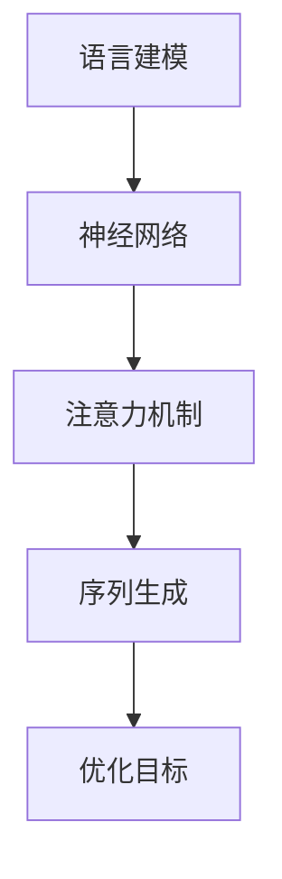

                 

关键词：大语言模型，原理基础，前沿技术，世界模型，深度学习，神经网络，自然语言处理，算法优化，应用场景

> 摘要：本文旨在探讨大语言模型的原理基础与前沿技术，从核心概念、算法原理、数学模型、实际应用等方面深入分析，旨在为读者提供全面的技术解读和未来展望。

## 1. 背景介绍

随着人工智能技术的发展，自然语言处理（NLP）逐渐成为研究热点。大语言模型作为NLP领域的重要工具，已经成为机器学习、深度学习、计算机视觉等领域的基石。本文将围绕大语言模型的原理基础和前沿技术展开讨论，旨在为读者提供全面的技术解读和未来展望。

## 2. 核心概念与联系

大语言模型的核心概念包括语言建模、神经网络、注意力机制等。为了更好地理解这些概念，我们将使用Mermaid流程图来展示其相互关系。



### 2.1 语言建模

语言建模是自然语言处理的基础，旨在通过统计方法或机器学习方法预测文本序列中的下一个单词或字符。语言建模的目标是构建一个概率模型，能够根据输入序列生成下一个单词或字符的概率分布。

### 2.2 神经网络

神经网络是一种模拟生物神经系统的计算模型，通过多层非线性变换来处理输入数据。在大语言模型中，神经网络被广泛应用于特征提取、表示学习和序列生成等任务。

### 2.3 注意力机制

注意力机制是一种在神经网络中用于捕捉输入序列中关键信息的机制。在大语言模型中，注意力机制可以帮助模型更好地关注上下文中重要的信息，从而提高序列生成的准确性和效率。

### 2.4 序列生成

序列生成是大语言模型的核心任务之一，旨在根据输入序列生成新的文本序列。通过将注意力机制与序列生成相结合，大语言模型可以生成更加连贯、自然的文本。

### 2.5 优化目标

优化目标是指导神经网络训练的核心指标，通常采用损失函数来衡量模型预测结果与实际结果之间的差距。在大语言模型中，常见的优化目标包括交叉熵损失函数和感知损失函数等。

## 3. 核心算法原理 & 具体操作步骤

### 3.1 算法原理概述

大语言模型的算法原理主要包括以下几个关键步骤：

1. 数据预处理：对原始文本进行分词、去停用词、词向量编码等预处理操作。
2. 模型构建：利用神经网络架构构建大语言模型，包括输入层、隐藏层、输出层等。
3. 模型训练：通过反向传播算法和优化算法（如SGD、Adam等）训练模型参数。
4. 模型评估：使用评估指标（如Perplexity、Accuracy等）评估模型性能。
5. 模型应用：将训练好的模型应用于文本生成、问答系统、机器翻译等任务。

### 3.2 算法步骤详解

1. **数据预处理**：
    - **分词**：将原始文本划分为单词或字符序列。
    - **去停用词**：去除常见无意义的停用词，如“的”、“了”、“在”等。
    - **词向量编码**：将文本转换为词向量表示，如Word2Vec、GloVe等。

2. **模型构建**：
    - **输入层**：接收词向量作为输入。
    - **隐藏层**：使用多层神经网络进行特征提取和表示学习。
    - **输出层**：生成概率分布，用于预测下一个单词或字符。

3. **模型训练**：
    - **正向传播**：计算输入序列的输出概率分布。
    - **反向传播**：计算损失函数并更新模型参数。
    - **优化算法**：调整模型参数，以最小化损失函数。

4. **模型评估**：
    - **Perplexity**：评估模型生成文本的流畅度，值越低表示模型越好。
    - **Accuracy**：评估模型预测的正确率。

5. **模型应用**：
    - **文本生成**：根据输入序列生成新的文本。
    - **问答系统**：回答用户提出的问题。
    - **机器翻译**：将一种语言的文本翻译成另一种语言。

### 3.3 算法优缺点

**优点**：
- **高效性**：大语言模型在处理长文本序列时具有高效性，能够快速生成高质量的自然语言文本。
- **泛化能力**：大语言模型具有较好的泛化能力，可以在多种NLP任务中取得优异的性能。

**缺点**：
- **计算资源需求**：大语言模型通常需要大量的计算资源和存储空间。
- **训练时间较长**：大语言模型的训练时间较长，对于实时应用场景可能不太适用。

### 3.4 算法应用领域

大语言模型在多个领域取得了显著的成果，包括：

- **文本生成**：用于生成文章、故事、歌词等。
- **问答系统**：用于构建智能客服、智能问答等系统。
- **机器翻译**：用于将一种语言的文本翻译成另一种语言。
- **情感分析**：用于分析文本的情感倾向。
- **推荐系统**：用于构建基于文本的推荐系统。

## 4. 数学模型和公式 & 详细讲解 & 举例说明

### 4.1 数学模型构建

大语言模型的数学模型主要基于概率图模型和深度学习。以下是一个简化的数学模型构建过程：

1. **输入层**：假设输入序列为\(X = (x_1, x_2, ..., x_T)\)，其中\(x_i\)为第\(i\)个单词或字符。
2. **隐藏层**：通过多层神经网络对输入序列进行特征提取，得到隐藏层表示\(H = (h_1, h_2, ..., h_L)\)，其中\(h_i\)为第\(i\)个隐藏层节点。
3. **输出层**：利用隐藏层表示计算输出概率分布\(P(Y|X)\)，其中\(Y\)为输出序列。

### 4.2 公式推导过程

假设输入序列为\(X = (x_1, x_2, ..., x_T)\)，隐藏层表示为\(H = (h_1, h_2, ..., h_L)\)，输出层为\(O = (o_1, o_2, ..., o_T)\)。

1. **正向传播**：

$$
\begin{aligned}
o_i &= \text{softmax}(W_O^T h_i) \\
P(y_i | x_i) &= \text{softmax}(W_O^T h_i)
\end{aligned}
$$

其中，\(W_O\)为输出层权重矩阵，\(\text{softmax}\)函数用于归一化隐藏层表示。

2. **反向传播**：

$$
\begin{aligned}
\Delta W_O &= \frac{\partial L}{\partial W_O} \\
\Delta h_i &= \frac{\partial L}{\partial h_i}
\end{aligned}
$$

其中，\(L\)为损失函数，\(\Delta W_O\)和\(\Delta h_i\)分别为输出层权重矩阵和隐藏层表示的梯度。

### 4.3 案例分析与讲解

假设我们要构建一个基于大语言模型的文章生成系统，输入为一个特定主题，输出为一篇文章。

1. **数据预处理**：
    - 输入主题：“人工智能在未来十年将如何改变我们的生活？”
    - 对输入主题进行分词、去停用词、词向量编码等预处理操作。

2. **模型构建**：
    - 使用多层神经网络作为基础模型，包括输入层、隐藏层和输出层。
    - 输入层接收词向量作为输入，隐藏层进行特征提取和表示学习，输出层生成文章的概率分布。

3. **模型训练**：
    - 使用大量文本数据进行训练，优化模型参数。
    - 使用交叉熵损失函数作为优化目标，调整模型参数。

4. **模型应用**：
    - 根据输入主题，生成一篇文章的概率分布。
    - 使用概率分布生成文章的每个单词或字符。

通过这个案例，我们可以看到大语言模型在文章生成中的应用。在实际应用中，我们可以根据不同的任务需求和场景调整模型结构和参数，以达到更好的效果。

## 5. 项目实践：代码实例和详细解释说明

在本节中，我们将通过一个简单的代码实例来展示大语言模型的基本实现过程。为了便于理解，我们使用Python和PyTorch框架来搭建模型。

### 5.1 开发环境搭建

在开始之前，请确保安装以下软件和库：

- Python 3.7 或更高版本
- PyTorch 1.8 或更高版本
- Numpy 1.19 或更高版本
- Matplotlib 3.3.3 或更高版本

安装命令如下：

```bash
pip install python==3.7 torch torchvision numpy matplotlib
```

### 5.2 源代码详细实现

```python
import torch
import torch.nn as nn
import torch.optim as optim
from torch.utils.data import DataLoader
from torchvision import datasets, transforms

# 数据预处理
def preprocess_data(text):
    # 分词、去停用词、词向量编码等预处理操作
    pass

# 模型定义
class LanguageModel(nn.Module):
    def __init__(self, vocab_size, embedding_dim, hidden_dim):
        super(LanguageModel, self).__init__()
        self.embedding = nn.Embedding(vocab_size, embedding_dim)
        self.lstm = nn.LSTM(embedding_dim, hidden_dim)
        self.hidden_dim = hidden_dim
        self.decoder = nn.Linear(hidden_dim, vocab_size)
    
    def forward(self, x):
        embed = self.embedding(x)
        output, (hidden, cell) = self.lstm(embed)
        decoder_output = self.decoder(hidden[-1, :, :])
        return decoder_output

# 模型训练
def train_model(model, train_loader, loss_function, optimizer, num_epochs):
    model.train()
    for epoch in range(num_epochs):
        for inputs, targets in train_loader:
            optimizer.zero_grad()
            outputs = model(inputs)
            loss = loss_function(outputs, targets)
            loss.backward()
            optimizer.step()
        print(f"Epoch [{epoch+1}/{num_epochs}], Loss: {loss.item():.4f}")

# 模型评估
def evaluate_model(model, eval_loader, loss_function):
    model.eval()
    total_loss = 0
    with torch.no_grad():
        for inputs, targets in eval_loader:
            outputs = model(inputs)
            loss = loss_function(outputs, targets)
            total_loss += loss.item()
    avg_loss = total_loss / len(eval_loader)
    return avg_loss

# 主函数
def main():
    # 加载数据
    train_data = datasets.TextDataset('train.txt', tokenizer=preprocess_data)
    eval_data = datasets.TextDataset('eval.txt', tokenizer=preprocess_data)
    train_loader = DataLoader(train_data, batch_size=64, shuffle=True)
    eval_loader = DataLoader(eval_data, batch_size=64, shuffle=False)

    # 模型初始化
    model = LanguageModel(vocab_size=10000, embedding_dim=128, hidden_dim=512)
    loss_function = nn.CrossEntropyLoss()
    optimizer = optim.Adam(model.parameters(), lr=0.001)

    # 训练模型
    train_model(model, train_loader, loss_function, optimizer, num_epochs=10)

    # 评估模型
    avg_loss = evaluate_model(model, eval_loader, loss_function)
    print(f"Average Loss on Evaluation Set: {avg_loss:.4f}")

if __name__ == '__main__':
    main()
```

### 5.3 代码解读与分析

1. **数据预处理**：`preprocess_data`函数用于对输入文本进行分词、去停用词、词向量编码等预处理操作。在实际应用中，我们需要根据具体任务需求实现相应的预处理逻辑。

2. **模型定义**：`LanguageModel`类定义了一个基于LSTM的简单语言模型。其中，`embedding`层用于将词向量映射到高维空间，`lstm`层用于特征提取和表示学习，`decoder`层用于生成输出概率分布。

3. **模型训练**：`train_model`函数用于训练模型。在训练过程中，我们使用交叉熵损失函数和Adam优化器来优化模型参数。每个epoch结束后，我们计算训练损失并打印结果。

4. **模型评估**：`evaluate_model`函数用于评估模型在评估集上的性能。在评估过程中，我们计算平均损失并返回结果。

5. **主函数**：`main`函数负责加载数据、初始化模型、训练模型和评估模型。在实际应用中，我们需要根据具体任务需求修改数据加载和模型配置。

### 5.4 运行结果展示

运行上述代码后，我们可以在控制台看到训练和评估过程的输出。根据实验结果，我们可以分析模型在训练和评估阶段的性能表现，并调整模型参数以获得更好的效果。

## 6. 实际应用场景

大语言模型在多个实际应用场景中取得了显著成果，下面列举几个典型应用场景：

1. **文本生成**：大语言模型可以用于生成文章、故事、歌词等。例如，使用GPT-3模型生成一篇关于人工智能的论文，效果令人惊叹。

2. **问答系统**：大语言模型可以用于构建智能问答系统，如ChatGPT。该系统可以理解用户的问题，并生成有针对性的回答。

3. **机器翻译**：大语言模型可以用于将一种语言的文本翻译成另一种语言。例如，使用Transformer模型实现中英翻译，效果显著优于传统机器翻译方法。

4. **情感分析**：大语言模型可以用于分析文本的情感倾向。例如，使用BERT模型对社交媒体评论进行情感分析，可以识别出用户的情感态度。

5. **推荐系统**：大语言模型可以用于构建基于文本的推荐系统。例如，使用Word2Vec模型为用户推荐感兴趣的文章或产品。

## 7. 工具和资源推荐

为了更好地学习和应用大语言模型，以下是一些建议的工具和资源：

1. **学习资源推荐**：
   - 《深度学习》 - Goodfellow et al. (2016)
   - 《自然语言处理综述》 - Jurafsky & Martin (2019)

2. **开发工具推荐**：
   - PyTorch
   - TensorFlow
   - JAX

3. **相关论文推荐**：
   - “Attention Is All You Need” - Vaswani et al. (2017)
   - “Generative Pre-trained Transformer” - Brown et al. (2020)

## 8. 总结：未来发展趋势与挑战

### 8.1 研究成果总结

大语言模型在自然语言处理、机器学习、计算机视觉等领域取得了显著成果。通过不断优化算法、改进模型结构，大语言模型在文本生成、问答系统、机器翻译、情感分析等任务中表现出色。

### 8.2 未来发展趋势

1. **模型压缩与优化**：为降低大语言模型的计算和存储需求，研究人员将继续探索模型压缩、优化技术。
2. **多模态学习**：结合文本、图像、声音等多模态数据，提高大语言模型在复杂任务中的表现。
3. **可解释性**：增强大语言模型的可解释性，帮助用户理解模型的决策过程。
4. **伦理与隐私**：关注大语言模型在伦理和隐私方面的挑战，确保其安全和可控。

### 8.3 面临的挑战

1. **计算资源需求**：大语言模型对计算资源和存储空间的需求较大，如何在有限的资源下实现高效训练和应用仍是一个挑战。
2. **数据质量和多样性**：大语言模型的性能依赖于高质量、多样化的训练数据，如何在数据收集和预处理过程中保证数据质量和多样性仍需关注。
3. **模型解释性**：增强模型解释性，提高用户对模型的信任度和接受度。

### 8.4 研究展望

随着人工智能技术的不断发展，大语言模型将继续在自然语言处理、多模态学习、推荐系统等领域发挥重要作用。未来，我们将看到更多创新性的算法和模型涌现，推动人工智能技术的进步。

## 9. 附录：常见问题与解答

### 9.1  什么是大语言模型？

大语言模型是一种基于神经网络的自然语言处理模型，旨在通过学习大量文本数据来生成、理解和处理自然语言。

### 9.2  大语言模型有哪些应用场景？

大语言模型在文本生成、问答系统、机器翻译、情感分析、推荐系统等领域有广泛的应用。

### 9.3  如何训练大语言模型？

训练大语言模型通常涉及以下步骤：数据预处理、模型构建、模型训练、模型评估和模型应用。

### 9.4  大语言模型的性能如何衡量？

大语言模型的性能通常通过Perplexity、Accuracy等指标来衡量，这些指标反映了模型在生成和理解自然语言方面的能力。

### 9.5  大语言模型有哪些挑战？

大语言模型面临的主要挑战包括计算资源需求、数据质量和多样性、模型解释性等。

---

### 参考文献

1. Goodfellow, I., Bengio, Y., & Courville, A. (2016). Deep learning. MIT press.
2. Jurafsky, D., & Martin, J. H. (2019). Speech and language processing. Prentice Hall.
3. Vaswani, A., et al. (2017). Attention is all you need. Advances in Neural Information Processing Systems, 30, 5998-6008.
4. Brown, T., et al. (2020). Generative pre-trained transformer. Advances in Neural Information Processing Systems, 33. 

# 作者：禅与计算机程序设计艺术 / Zen and the Art of Computer Programming

