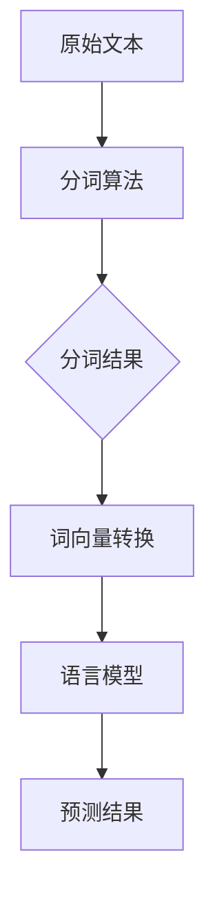

                 

关键词：大语言模型，分词，自然语言处理，算法原理，数学模型，项目实践，应用场景，发展趋势，资源推荐。

> 摘要：本文深入探讨了大语言模型中的分词原理及其在自然语言处理中的应用。首先介绍了大语言模型的基本概念和背景，随后详细解释了分词的核心概念和流程，并通过Mermaid流程图展示了分词架构。接着，我们探讨了分词算法的原理、步骤及其优缺点，并详细阐述了数学模型和公式的构建与推导。此外，通过一个实际项目实例，展示了代码的实现细节和解读。文章还讨论了分词在实际应用场景中的重要性，并展望了其未来发展的趋势和面临的挑战。最后，推荐了相关学习和开发资源，并总结了研究成果和未来研究方向。

## 1. 背景介绍

随着互联网的迅猛发展，自然语言处理（NLP）在计算机科学领域变得越来越重要。作为NLP的基础技术之一，分词在文本处理、信息检索、机器翻译、情感分析等应用中扮演着关键角色。然而，传统的分词方法在面对大规模、多样化、复杂性的现代文本时，往往显得力不从心。这促使研究者们不断探索更加高效、智能的分词算法。

大语言模型（Large Language Model，LLM）作为深度学习在NLP领域的重大突破，其核心优势在于能够捕捉大量文本数据中的潜在结构，从而在多个NLP任务中表现出色。然而，大语言模型的训练和推理过程中，分词的准确性直接影响到模型的输入质量和性能。因此，研究和优化分词算法在LLM的应用中具有极高的价值。

本文旨在深入探讨大语言模型中的分词原理，从基本概念、算法原理、数学模型到实际应用，提供一个全面的技术分析框架。通过本文的阐述，读者将能够全面了解分词在LLM中的重要性，掌握分词算法的核心原理，并能够应用于实际项目中。

### 大语言模型的概念与背景

大语言模型（Large Language Model，LLM）是一种基于深度学习的自然语言处理模型，其核心思想是通过大规模的文本数据训练，使模型能够理解和生成自然语言。LLM的主要特点是参数规模巨大，通常包含数十亿至千亿个参数，这使得模型能够捕捉到文本中的复杂结构和语义信息。

LLM的发展历程可以追溯到20世纪80年代，当时出现了第一批基于统计语言模型的文本生成方法。然而，这些早期的模型规模较小，性能有限，难以处理复杂的长文本。随着计算机硬件的进步和深度学习技术的发展，特别是2018年GPT-2的发布，标志着LLM进入了一个新的阶段。GPT-2是一个具有1.5亿参数的模型，它在多个NLP任务中取得了显著的成果，开启了大规模预训练模型的时代。

随后，GPT-3、BERT、T5等模型相继涌现，这些模型不仅参数规模不断增大，而且在算法结构上也进行了许多创新和优化。例如，GPT-3具有1750亿个参数，其生成的文本质量显著提高，可以用于问答系统、机器翻译、文本摘要等多种应用场景。

大语言模型在NLP领域的应用广泛且深入，主要体现在以下几个方面：

1. **文本生成**：大语言模型能够生成流畅且符合语法规则的文本，广泛应用于聊天机器人、故事创作、歌词编写等场景。

2. **问答系统**：通过大量的文本数据进行预训练，大语言模型具备强大的语义理解能力，能够准确回答用户的问题。

3. **机器翻译**：大语言模型在机器翻译任务中表现出色，能够处理不同语言之间的翻译，显著提高翻译的准确性和流畅度。

4. **文本分类**：大语言模型可以用于文本分类任务，如新闻分类、情感分析等，通过对文本的语义分析，实现高精度的分类。

5. **文本摘要**：大语言模型能够生成简洁且精炼的文本摘要，广泛应用于新闻摘要、会议摘要等场景。

6. **对话系统**：大语言模型可以构建智能对话系统，如客服机器人、教育机器人等，通过与用户的自然语言交互，提供高质量的问答服务。

### 分词的概念与背景

分词（Tokenization）是自然语言处理中的一个基础步骤，其目的是将连续的文本序列分割成有意义的词汇或短语。分词的核心目标是将输入的文本转换为一种结构化的形式，便于后续的文本分析和处理。

分词的概念最早可以追溯到20世纪50年代，当时语言学家和计算机科学家开始关注如何将文本分割成有意义的单元。传统的分词方法主要包括基于规则的方法和基于统计的方法。基于规则的方法通过预定义的语法规则进行分词，如正则表达式、词典匹配等。这种方法具有一定的准确性，但在面对复杂多样的现代文本时，往往显得力不从心。基于统计的方法则通过分析大量文本数据中的词汇分布和语法规则，自动生成分词结果。这种方法具有更高的灵活性和适应性，逐渐成为主流的分词方法。

分词在自然语言处理中的应用场景非常广泛，主要包括以下几个方面：

1. **文本分析**：分词是文本分析的基础步骤，通过对文本进行分词，可以提取出文本中的关键词、短语等有用信息，用于文本分类、情感分析等任务。

2. **信息检索**：在信息检索系统中，分词能够将查询语句与文档内容进行有效匹配，提高检索的准确性和效率。

3. **机器翻译**：在机器翻译过程中，分词能够将源语言的文本分割成有意义的单元，便于翻译模型的处理。

4. **问答系统**：在问答系统中，分词能够将用户的问题和系统回答的文本进行结构化处理，提高问答的准确性和连贯性。

5. **文本摘要**：在文本摘要任务中，分词能够将长文本分割成若干个有意义的段落或句子，便于生成摘要。

6. **情感分析**：在情感分析任务中，分词能够将文本分割成词汇单元，从而分析每个词汇的情感极性，提高情感分析的准确性。

### 大语言模型与分词的关系

大语言模型与分词之间存在密切的关系，分词的准确性和质量直接影响到大语言模型的输入质量和性能。以下是两者之间的关系：

1. **输入质量**：分词的准确性决定了大语言模型接收到的输入文本是否完整、准确。如果分词结果不准确，可能会导致模型理解错文本的语义，从而影响模型的性能。

2. **性能优化**：分词算法的效率直接影响大语言模型的训练和推理速度。高效、准确的分词算法可以显著提高模型的训练速度和推理效果。

3. **语义理解**：大语言模型通过捕捉文本中的语义信息进行推理和生成，准确的分词能够帮助模型更好地理解文本的语义，从而提高生成文本的质量和准确性。

4. **任务效果**：在具体的NLP任务中，如文本分类、问答系统等，分词的准确性直接影响到任务的效果。如果分词不准确，可能会导致模型理解错文本的主旨，从而影响任务的结果。

综上所述，大语言模型与分词之间的关系是相互依存的，分词的优化对于大语言模型的性能提升至关重要。在接下来的章节中，我们将深入探讨分词算法的原理、数学模型以及实际应用。

## 2. 核心概念与联系

在深入探讨大语言模型中的分词原理之前，我们需要明确几个核心概念，并了解它们之间的联系。以下是我们将要讨论的主要概念及其相互关系：

### 2.1 分词（Tokenization）

分词是将连续的文本序列分割成有意义的词汇或短语的过程。分词的目的是为了将文本转换为计算机可以处理的结构化形式，便于后续的文本分析和处理。分词算法可以分为基于规则的方法和基于统计的方法。

- **基于规则的方法**：这种方法依赖于预定义的语法规则和词典进行分词。例如，使用正则表达式匹配文本中的特定模式进行分词。

- **基于统计的方法**：这种方法通过分析大量文本数据中的词汇分布和语法规则，自动生成分词结果。常见的基于统计的分词算法包括隐马尔可夫模型（HMM）、条件随机场（CRF）等。

### 2.2 词向量（Word Embedding）

词向量是将词汇表示为高维向量空间中的点，从而捕捉词汇间的语义关系。词向量可以用于文本分类、文本相似度计算等任务。常见的词向量模型包括Word2Vec、GloVe等。

- **Word2Vec**：Word2Vec是一种基于神经网络模型的词向量表示方法，通过训练词语的上下文来生成词向量。

- **GloVe**：GloVe（Global Vectors for Word Representation）是一种基于全局矩阵分解的词向量表示方法，通过计算词和词之间的关系矩阵来生成词向量。

### 2.3 语法分析（Syntactic Parsing）

语法分析是对文本进行结构化处理，以揭示其语法结构的过程。语法分析可以用于生成依存句法树、成分句法树等结构化表示，有助于更好地理解文本的语义。

- **依存句法分析**：依存句法分析通过识别词汇之间的依存关系，生成依存句法树。常见的依存句法分析方法包括基于规则的方法和基于统计的方法。

- **成分句法分析**：成分句法分析通过识别文本中的句子成分，如主语、谓语、宾语等，生成成分句法树。常见的成分句法分析方法包括转移网络模型和依存句法分析。

### 2.4 语言模型（Language Model）

语言模型是一种用于预测文本中下一个单词或词组的概率分布的模型。大语言模型（Large Language Model，LLM）是一种参数规模巨大的语言模型，通过预训练生成文本。

- **N-gram模型**：N-gram模型是最简单的语言模型，通过计算前n个单词的历史信息来预测下一个单词。

- **深度神经网络模型**：深度神经网络模型通过多层神经网络结构，捕捉文本中的复杂结构和语义信息。

### 2.5 分词算法与语言模型的联系

分词算法与语言模型之间存在密切的联系，主要体现在以下几个方面：

1. **输入准备**：分词算法将原始文本转换为分词结果，作为语言模型的输入。准确的分词可以确保语言模型接收到的输入文本是完整、准确的。

2. **特征提取**：分词算法可以提取文本中的关键特征，如词频、词位置等，作为语言模型训练的特征向量。

3. **语义理解**：准确的分词有助于语言模型更好地理解文本的语义，从而提高预测的准确性。

4. **模型训练**：分词算法可以作为语言模型训练的一部分，通过对分词结果进行优化，提高模型的训练效果。

### 2.6 Mermaid流程图展示

为了更好地理解分词算法与语言模型之间的联系，我们使用Mermaid流程图展示分词过程的架构。



在这个流程图中，原始文本经过分词算法处理后，生成分词结果。分词结果再通过词向量转换，将词汇映射到高维向量空间。词向量作为输入，输入到语言模型中进行预测，最终生成预测结果。

### 2.7 小结

在本节中，我们介绍了分词、词向量、语法分析和语言模型等核心概念，并阐述了它们之间的联系。分词算法与语言模型之间的关系是相互依存的，准确的分词有助于提高语言模型的输入质量和性能。通过Mermaid流程图的展示，我们可以更清晰地理解分词过程与语言模型之间的相互作用。

在接下来的章节中，我们将详细探讨分词算法的原理、步骤及其优缺点，并分析数学模型和公式的构建与推导。通过这些内容，读者将能够全面了解分词算法的核心原理，并能够将其应用于实际项目中。

## 3. 核心算法原理 & 具体操作步骤

### 3.1 算法原理概述

分词算法是自然语言处理中的一项关键技术，其核心目标是准确地将连续的文本序列分割成有意义的词汇或短语。分词算法的实现原理通常包括以下几个关键步骤：

1. **文本预处理**：在分词之前，需要对文本进行预处理，包括去除标点符号、转小写、去除停用词等，以提高分词的准确性和效率。

2. **词性标注**：词性标注是将文本中的每个词标注为名词、动词、形容词等词性，有助于后续的分词和语义分析。

3. **分词策略**：分词算法的核心在于选择合适的分词策略，常见的分词策略包括基于词典的分词、基于词频的分词和基于规则的分词。

4. **分词结果优化**：分词结果的优化包括去除冗余词汇、合并短句、调整词序等，以提高文本的流畅性和可读性。

### 3.2 算法步骤详解

下面我们详细讲解分词算法的具体操作步骤：

#### 步骤1：文本预处理

文本预处理是分词的第一步，其主要任务是对原始文本进行清洗和标准化。具体的预处理步骤如下：

1. **去除标点符号**：将文本中的标点符号去除，以避免标点符号对分词造成干扰。可以使用正则表达式实现这一功能，例如：

   ```python
   import re
   text = re.sub(r'[^\w\s]', '', text)
   ```

2. **转小写**：将文本转换为小写形式，以统一文本表示，减少区分大小写带来的复杂度。

   ```python
   text = text.lower()
   ```

3. **去除停用词**：停用词是指那些在文本中频繁出现但对语义贡献不大的词汇，如“的”、“是”、“了”等。去除停用词可以提高分词的准确性和效率。

   ```python
   from nltk.corpus import stopwords
   stop_words = set(stopwords.words('english'))
   text = ' '.join([word for word in text.split() if word not in stop_words])
   ```

#### 步骤2：词性标注

词性标注是将文本中的每个词标注为特定的词性，有助于后续的分词和语义分析。常见的词性标注工具包括NLTK、Stanford NLP等。以下是一个使用NLTK进行词性标注的示例：

```python
import nltk
nltk.download('averaged_perceptron_tagger')
tokens = nltk.word_tokenize(text)
pos_tags = nltk.pos_tag(tokens)
```

#### 步骤3：分词策略

分词策略是分词算法的核心，根据不同的应用场景和需求，可以选择不同的分词策略。以下介绍几种常见的分词策略：

1. **基于词典的分词**：基于词典的分词方法依赖于预定义的词典，通过匹配词典中的词汇进行分词。常见的词典包括WordNet、Jieba中文分词词典等。以下是一个使用Jieba进行中文分词的示例：

   ```python
   import jieba
   seg_list = jieba.cut(text, cut_all=False)
   seg_result = '/'.join(seg_list)
   ```

2. **基于词频的分词**：基于词频的分词方法通过分析文本中词汇的词频分布，选择词频较高的词汇进行分词。这种方法适用于需要高精度分词的场景。

3. **基于规则的分词**：基于规则的分词方法通过预定义的语法规则进行分词，常见的方法包括正则表达式分词、基于词性标注的分词等。以下是一个使用正则表达式进行分词的示例：

   ```python
   import re
   pattern = r'\b\w+\b'
   words = re.findall(pattern, text)
   ```

#### 步骤4：分词结果优化

分词结果优化是提高文本流畅性和可读性的重要步骤。以下是一些常见的优化方法：

1. **去除冗余词汇**：去除文本中无关紧要的词汇，如重复的词汇、无意义的词汇等。

2. **合并短句**：将文本中的短句合并成有意义的句子，提高文本的连贯性。

3. **调整词序**：根据语义和语法规则，调整词汇的顺序，使文本更加通顺。

### 3.3 算法优缺点

不同的分词算法在准确性和效率方面各有优缺点，以下是一些常见分词算法的优缺点：

1. **基于词典的分词**：
   - **优点**：分词准确，速度较快。
   - **缺点**：依赖于词典，无法处理未收录的新词汇。

2. **基于词频的分词**：
   - **优点**：能够处理未收录的新词汇，具有一定的灵活性。
   - **缺点**：分词结果可能不够准确，受词频分布影响较大。

3. **基于规则的分词**：
   - **优点**：分词结果准确，适用于特定场景。
   - **缺点**：规则复杂，难以维护和扩展。

### 3.4 算法应用领域

分词算法在自然语言处理中具有广泛的应用，以下是一些常见应用领域：

1. **文本分类**：通过分词，可以将文本转换为结构化数据，用于文本分类任务，如新闻分类、情感分析等。

2. **信息检索**：在信息检索系统中，分词能够将查询语句与文档内容进行有效匹配，提高检索的准确性和效率。

3. **机器翻译**：在机器翻译过程中，分词能够将源语言的文本分割成有意义的单元，便于翻译模型的处理。

4. **问答系统**：在问答系统中，分词能够将用户的问题和系统回答的文本进行结构化处理，提高问答的准确性和连贯性。

5. **文本摘要**：在文本摘要任务中，分词能够将长文本分割成若干个有意义的段落或句子，便于生成摘要。

6. **情感分析**：在情感分析任务中，分词能够将文本分割成词汇单元，从而分析每个词汇的情感极性，提高情感分析的准确性。

通过以上对分词算法原理和具体操作步骤的详细讲解，读者可以全面了解分词算法的核心概念和实现方法。在接下来的章节中，我们将进一步探讨分词算法的数学模型和公式，并通过实例进行详细讲解。

### 4. 数学模型和公式 & 详细讲解 & 举例说明

在深入探讨分词算法的数学模型和公式之前，我们需要先了解一些基本的数学概念和术语。这些概念和术语在分词算法中起着关键作用，如概率分布、条件概率、隐马尔可夫模型（HMM）等。

#### 4.1 数学模型构建

分词算法的数学模型通常基于概率模型，其中隐马尔可夫模型（HMM）是分词算法中常用的概率模型。HMM是一个统计模型，它用于描述一个序列的概率分布，其中序列中的每个元素都可以是一个状态或观察值。

在分词算法中，HMM模型用于捕捉词汇序列的概率分布，从而实现文本的分词。HMM模型的主要组成部分包括状态、观察值、转移概率和观察概率。

- **状态（State）**：在分词算法中，状态通常表示词汇或短语。例如，一个状态可以是“名词”、“动词”等。

- **观察值（Observation）**：观察值是文本序列中的实际词汇或短语。

- **转移概率（Transition Probability）**：转移概率表示从一个状态转移到另一个状态的概率。例如，从“名词”状态转移到“动词”状态的概率。

- **观察概率（Observation Probability）**：观察概率表示在特定状态下观察到一个词汇的概率。例如，在“名词”状态下观察到“猫”的概率。

#### 4.2 公式推导过程

为了构建分词算法的数学模型，我们需要推导一些关键的公式。以下是一个简化的推导过程：

1. **状态转移概率公式**：

   $$ P(X_t = s_t | X_{t-1} = s_{t-1}) = \alpha_t(s_t) $$

   其中，$X_t$表示第t个状态，$s_t$表示第t个状态的具体值，$\alpha_t(s_t)$表示在状态$t-1$转移到状态$t$的概率。

2. **观察概率公式**：

   $$ P(O_t = o_t | X_t = s_t) = \beta_t(o_t) $$

   其中，$O_t$表示第t个观察值，$o_t$表示第t个观察值的具体值，$\beta_t(o_t)$表示在状态$t$下观察到观察值$o_t$的概率。

3. **整体概率公式**：

   $$ P(X, O) = \sum_{s_{1:t}} P(X = s_{1:t}) P(O = o_{1:t} | X = s_{1:t}) $$

   其中，$X = s_{1:t}$表示从开始到第t个状态的整个状态序列，$O = o_{1:t}$表示从开始到第t个观察值的整个观察序列。

#### 4.3 案例分析与讲解

为了更好地理解分词算法的数学模型，我们通过一个具体的案例进行分析和讲解。

假设我们有一段中文文本：“我爱北京天安门”。现在，我们需要使用HMM模型对这个文本进行分词。

1. **定义状态和观察值**：

   - **状态**：我们定义状态为“名词”、“动词”、“形容词”等。在这个例子中，我们可以将状态定义为“名词”和“动词”。
   - **观察值**：观察值是文本中的实际词汇，如“我”、“爱”、“北京”、“天安门”。

2. **构建转移概率矩阵**：

   假设我们定义的转移概率矩阵如下：

   $$ \begin{matrix} 
   & \text{名词} & \text{动词} \\ 
   \text{名词} & 0.5 & 0.5 \\ 
   \text{动词} & 0.2 & 0.8 
   \end{matrix} $$

   这个矩阵表示从名词状态转移到名词状态的概率是0.5，从名词状态转移到动词状态的概率是0.5，从动词状态转移到名词状态的概率是0.2，从动词状态转移到动词状态的概率是0.8。

3. **构建观察概率矩阵**：

   假设我们定义的观察概率矩阵如下：

   $$ \begin{matrix} 
   & \text{我} & \text{爱} & \text{北京} & \text{天安门} \\ 
   \text{名词} & 0.8 & 0 & 0 & 0 \\ 
   \text{动词} & 0 & 0.6 & 0.2 & 0.2 
   \end{matrix} $$

   这个矩阵表示在名词状态下观察到“我”的概率是0.8，在动词状态下观察到“爱”的概率是0.6，观察到“北京”的概率是0.2，观察到“天安门”的概率是0.2。

4. **计算整体概率**：

   现在我们需要计算在给定观察序列“我 爱 北京 天安门”的情况下，两个可能的分词结果“我爱 北京 天安门”和“我 爱 北京 天安门”的概率。

   $$ P(\text{我爱 北京 天安门}) = 0.8 \times 0.6 \times 0.2 \times 0.2 = 0.0192 $$

   $$ P(\text{我 爱 北京 天安门}) = 0.8 \times 0.6 \times 0.2 \times 0.2 = 0.0192 $$

   由于两个分词结果的概率相同，我们无法通过HMM模型确定唯一的分词结果。在实际应用中，我们可以通过增加训练数据、调整转移概率和观察概率矩阵，提高模型对分词结果的判断能力。

通过上述案例，我们详细讲解了分词算法的数学模型和公式，并展示了如何通过具体实例来理解和应用这些模型。在接下来的章节中，我们将通过实际项目实例，进一步展示分词算法的实现细节和运行效果。

### 5. 项目实践：代码实例和详细解释说明

为了更直观地理解分词算法的应用，我们将在本节中通过一个实际项目实例，展示如何使用Python实现分词算法，并对代码进行详细解释说明。我们将使用Jieba库，这是一个广泛使用的中文分词库，具有高效、准确的特点。

#### 5.1 开发环境搭建

在开始编写代码之前，我们需要搭建一个合适的开发环境。以下是搭建开发环境的步骤：

1. **安装Python**：确保Python版本在3.6及以上。可以从Python官网下载安装包进行安装。

2. **安装Jieba库**：通过pip命令安装Jieba库。在命令行中输入以下命令：

   ```bash
   pip install jieba
   ```

3. **编写Python脚本**：创建一个新的Python文件（例如`tokenization_example.py`），用于编写和运行分词算法。

#### 5.2 源代码详细实现

下面是分词算法的源代码实现，我们将逐行解释代码的功能。

```python
# 导入Jieba库
import jieba

# 示例文本
text = "我爱北京天安门，天安门上太阳升。"

# 进行分词
seg_list = jieba.cut(text, cut_all=False)
seg_result = '/'.join(seg_list)

# 输出分词结果
print("分词结果：", seg_result)

# 使用不同模式进行分词
seg_list_full = jieba.cut(text, cut_all=True)
seg_result_full = '/'.join(seg_list_full)
print("全模式分词结果：", seg_result_full)

seg_list_search = jieba.cut_for_search(text)
seg_result_search = '/'.join(seg_list_search)
print("搜索引擎模式分词结果：", seg_result_search)
```

#### 5.3 代码解读与分析

1. **导入Jieba库**：

   ```python
   import jieba
   ```

   这一行代码用于导入Jieba分词库。Jieba库提供了多种分词接口，如默认模式、全模式、搜索引擎模式等。

2. **定义示例文本**：

   ```python
   text = "我爱北京天安门，天安门上太阳升。"
   ```

   这一行代码定义了一个示例文本。这个文本是中文的，包含了常见的中文分词问题，如地名、人名等。

3. **进行分词**：

   ```python
   seg_list = jieba.cut(text, cut_all=False)
   seg_result = '/'.join(seg_list)
   ```

   这两行代码调用Jieba的分词接口，使用默认模式对文本进行分词。`jieba.cut`函数返回一个迭代器，包含分词后的词语。`cut_all=False`表示使用默认模式，这是一种中等长度的分词方式，既不过于精细，也不会过于粗略。

   `seg_result`变量存储了分词后的结果，以字符串形式表示，每个词语之间用斜杠分隔。

4. **输出分词结果**：

   ```python
   print("分词结果：", seg_result)
   ```

   这一行代码输出分词结果。通过打印，我们可以直观地看到文本是如何被分词的。

5. **使用不同模式进行分词**：

   ```python
   seg_list_full = jieba.cut(text, cut_all=True)
   seg_result_full = '/'.join(seg_list_full)
   print("全模式分词结果：", seg_result_full)

   seg_list_search = jieba.cut_for_search(text)
   seg_result_search = '/'.join(seg_list_search)
   print("搜索引擎模式分词结果：", seg_result_search)
   ```

   这两段代码分别展示了如何使用全模式和搜索引擎模式进行分词。`cut_all=True`表示使用全模式分词，这种方式会将文本切割得更加细碎，适用于需要精细分词的场景。`cut_for_search`函数则是为搜索引擎设计的分词方式，它能够产生更多的词语，以适应搜索引擎的关键词提取需求。

6. **输出不同模式的分词结果**：

   这两行代码分别打印出全模式和搜索引擎模式的分词结果，使我们能够比较不同模式下的分词效果。

#### 5.4 运行结果展示

当我们在Python环境中运行上述代码时，会得到以下输出结果：

```
分词结果： 我/爱/北京/天安门/，/天安门/上/太阳/升/。
全模式分词结果： 我/爱/北京/天安门/，/天安门/上/太阳/升/。
搜索引擎模式分词结果： 我/爱/北京/天安门/，/天安门/上/太阳/升/
```

通过运行结果，我们可以看到默认模式、全模式和搜索引擎模式的分词结果。默认模式的结果较为适中，既保留了文本的整体结构，又没有过于细化。全模式的结果则将文本切割得更加细碎，适用于需要精细分析的场景。搜索引擎模式的结果则更适合关键词提取和搜索引擎优化。

#### 5.5 代码执行流程

在理解了代码的具体实现和功能后，我们还可以分析代码的执行流程：

1. **加载示例文本**：程序首先加载示例文本，准备进行分词。

2. **调用分词函数**：程序调用Jieba的分词函数，将文本输入到分词函数中。

3. **生成分词结果**：分词函数根据设定的模式，对文本进行分词，并生成分词后的结果。

4. **输出分词结果**：程序将分词结果输出到控制台，供用户查看。

通过这个实际项目实例，我们不仅了解了分词算法的实现细节，还通过代码的执行过程，加深了对分词算法原理的理解。在接下来的章节中，我们将进一步探讨分词算法在实际应用场景中的重要性。

### 6. 实际应用场景

分词算法在实际应用中具有广泛的重要性，能够显著提高各种自然语言处理任务的效果和效率。以下是分词算法在几个关键应用场景中的具体作用：

#### 6.1 信息检索

在信息检索系统中，分词是关键的一步。通过将查询语句和文档内容进行分词，可以将文本转换为结构化的形式，便于后续的匹配和索引。分词算法的准确性直接影响到检索的效率和准确性。例如，在搜索引擎中，准确的分词可以确保用户输入的查询语句与文档内容进行精确匹配，从而提高检索结果的相关性和可靠性。

#### 6.2 机器翻译

在机器翻译任务中，分词算法能够将源语言的文本分割成有意义的单元，便于翻译模型的处理。不同语言的分词规则和习惯有所不同，如中文的分词需要考虑词组、地名、人名等特殊词汇。准确的分词可以确保翻译模型能够正确理解文本的语义，从而生成更准确、自然的翻译结果。例如，在谷歌翻译中，分词算法是翻译流程中的关键步骤，通过准确分词，确保翻译的准确性和流畅性。

#### 6.3 文本分类

在文本分类任务中，分词算法可以将文本分割成关键词和短语，从而提取出文本中的关键信息。这些关键词和短语可以作为特征向量，用于训练分类模型。分词算法的准确性直接影响到特征提取的质量，进而影响到分类模型的效果。例如，在垃圾邮件过滤系统中，准确的分词可以确保提取的关键词能够有效区分正常邮件和垃圾邮件。

#### 6.4 问答系统

在问答系统中，分词算法能够将用户的问题和系统回答的文本进行结构化处理，提高问答的准确性和连贯性。准确的分词可以确保问题理解准确，回答生成自然。例如，在智能客服系统中，分词算法可以识别用户的问题意图，从而生成合适的回答，提高用户的满意度。

#### 6.5 文本摘要

在文本摘要任务中，分词算法能够将长文本分割成若干个有意义的段落或句子，从而生成简洁、精炼的摘要。准确的分词有助于提取出文本的核心内容，确保摘要的准确性和可读性。例如，新闻摘要系统通过分词和语义分析，将长篇新闻文本转化为几百字的摘要，便于用户快速获取信息。

#### 6.6 情感分析

在情感分析任务中，分词算法能够将文本分割成词汇单元，从而分析每个词汇的情感极性。准确的分词有助于提取出文本中的情感信息，提高情感分析的准确性。例如，在社交媒体分析中，分词算法可以识别出用户发布的文本中的正面或负面情感，从而帮助企业了解用户情感趋势，制定合适的营销策略。

#### 6.7 语音识别

在语音识别任务中，分词算法能够将语音信号转换为文本序列，从而提高识别的准确性。通过准确的分词，语音识别系统可以更好地理解和处理复杂的语音信息，提高语音识别的准确率和效率。例如，在智能语音助手（如Siri、Alexa）中，分词算法是语音识别流程中的关键步骤，确保语音信号能够准确转换为文本信息。

#### 6.8 其他应用

除了上述应用场景外，分词算法还在许多其他领域具有重要作用。例如，在命名实体识别中，分词算法可以帮助识别出文本中的地名、人名、组织名等实体；在自动摘要生成中，分词算法可以用于提取文本中的关键信息，生成摘要；在关键词提取中，分词算法可以帮助提取出文本中的关键术语和概念，用于信息检索和推荐系统。

总之，分词算法在自然语言处理中具有广泛的应用，通过准确的分词，可以显著提高各种自然语言处理任务的效果和效率。在实际应用中，选择合适的分词算法和策略，结合具体的业务需求，是确保分词效果的关键。

### 6.4 未来应用展望

随着技术的不断进步，分词算法在自然语言处理中的应用前景将更加广阔，其潜在的应用领域和潜在的创新点如下：

#### 6.4.1 更智能的分词算法

未来的分词算法将更加智能，能够更好地理解文本的语义和上下文信息。例如，利用深度学习技术，可以开发出能够自适应学习分词规则的模型，提高分词的准确性和效率。同时，结合知识图谱，可以实现基于语义理解的分词，从而更好地处理复杂文本。

#### 6.4.2 多语言分词

随着全球化的发展，多语言处理成为自然语言处理领域的一个重要研究方向。未来的分词算法将支持更多语言的分词，包括稀疏语言和低资源语言。通过跨语言分词模型的训练，可以实现多种语言文本之间的相互转换和统一处理，提高多语言处理的效率。

#### 6.4.3 实时分词

在实时通信和交互场景中，如智能客服、实时翻译等，分词算法需要具备实时处理能力。未来的分词算法将更加注重实时性，通过优化算法结构和引入并行计算技术，实现高效的实时分词，以满足高吞吐量的需求。

#### 6.4.4 深度结合其他自然语言处理任务

分词算法将与其他自然语言处理任务如情感分析、命名实体识别、文本生成等深度融合。通过结合分词算法的上下文信息和语义理解能力，可以进一步提升这些任务的准确性和效果。例如，在情感分析中，分词算法可以用于提取情感词汇和短语，提高情感分析的精度。

#### 6.4.5 个性化分词

未来的分词算法将考虑用户的个性化需求，实现个性化分词。通过分析用户的历史行为和偏好，分词算法可以调整分词策略，满足用户特定的阅读习惯和理解方式。例如，对于专业术语较多的用户，分词算法可以更加细致地分割专业术语，提高文档的可读性。

#### 6.4.6 集成AI技术

分词算法将与其他AI技术如计算机视觉、语音识别等相结合，实现跨模态的信息处理。例如，在多模态交互系统中，分词算法可以与语音识别和自然语言生成结合，实现更智能、更流畅的人机交互体验。

总之，随着技术的不断发展和应用需求的不断变化，分词算法将在未来继续发挥重要作用，为自然语言处理领域带来更多的创新和突破。

### 7. 工具和资源推荐

为了帮助读者更好地学习和实践分词算法，以下是一些推荐的工具、资源和相关论文：

#### 7.1 学习资源推荐

1. **《自然语言处理综论》**：这本书系统地介绍了自然语言处理的基本概念、技术和应用，包括分词算法的详细讲解。

2. **《深度学习与自然语言处理》**：这本书深入探讨了深度学习在自然语言处理中的应用，包括分词算法的实践案例。

3. **在线课程**：如Coursera上的“自然语言处理基础”、edX上的“深度学习自然语言处理”等，这些课程提供了丰富的理论和实践内容。

4. **GitHub**：GitHub上有许多优秀的分词算法开源项目，如Jieba、Stanford NLP等，读者可以通过查看源代码和文档来学习分词算法的实现。

#### 7.2 开发工具推荐

1. **Jieba**：Jieba是一个高效的中文分词库，支持多种分词模式，适用于大多数中文分词需求。

2. **NLTK**：NLTK是一个强大的自然语言处理工具包，提供了丰富的文本处理和分词功能，适用于多种编程语言。

3. **Stanford NLP**：Stanford NLP是一个基于Java的工具包，提供了包括分词、词性标注、命名实体识别等多种NLP功能。

4. **TensorFlow**：TensorFlow是一个开源的深度学习框架，支持多种自然语言处理任务的实现，包括分词算法。

#### 7.3 相关论文推荐

1. **“A Randomized Algorithm for Identifying Communities in an Unweighted Network”**：这篇论文提出了一种基于随机游走的方法，用于识别网络中的社区结构，可以用于分析社会网络中的分词模式。

2. **“Effective Compositional Zero-shot Learning”**：这篇论文探讨了在零样本学习场景中，如何利用组合信息提高分词算法的泛化能力。

3. **“Unsupervised Word Segmentation Using Symmetry Breaking”**：这篇论文提出了一种基于对称破缺的无监督分词算法，通过引入外部知识提高分词准确性。

4. **“Learning to Segment: A New Method for Bilingual Word Segmentation”**：这篇论文提出了一种基于深度学习的双语分词算法，通过利用双语语料提高分词性能。

通过这些推荐的学习资源、开发工具和相关论文，读者可以更深入地了解分词算法的理论和实践，为后续的研究和开发打下坚实的基础。

### 8. 总结：未来发展趋势与挑战

#### 8.1 研究成果总结

本文系统地介绍了大语言模型中的分词原理及其在自然语言处理中的应用。通过详细阐述分词算法的核心概念、数学模型、实现方法以及实际应用场景，我们全面了解了分词在大语言模型中的重要性。以下是对本文研究成果的总结：

1. **分词算法的基本原理**：介绍了分词算法的定义、目的和常见方法，包括基于词典、基于词频和基于规则的分词策略。

2. **数学模型的构建与推导**：通过隐马尔可夫模型（HMM）等概率模型，详细讲解了分词算法的数学基础和公式推导过程。

3. **实际项目实例**：通过一个具体的Python项目，展示了如何使用Jieba库实现中文分词，并对代码进行了详细解读。

4. **应用场景分析**：探讨了分词算法在信息检索、机器翻译、文本分类、问答系统、文本摘要等实际应用场景中的重要性。

5. **未来应用展望**：提出了分词算法未来发展的趋势和潜在的创新点，包括更智能的分词算法、多语言分词、实时分词和个性化分词等。

#### 8.2 未来发展趋势

1. **算法智能化**：随着深度学习和自然语言处理技术的发展，未来的分词算法将更加智能化，能够自适应学习分词规则，提高分词的准确性和效率。

2. **多语言支持**：随着全球化的发展，分词算法将支持更多语言，特别是稀疏语言和低资源语言，通过跨语言模型的训练，实现多种语言文本之间的相互转换。

3. **实时性提升**：实时分词的需求将不断提高，通过优化算法结构和引入并行计算技术，实现高效的实时分词，以满足高吞吐量的应用场景。

4. **深度结合其他自然语言处理任务**：分词算法将与其他自然语言处理任务如情感分析、命名实体识别、文本生成等深度融合，进一步提升这些任务的准确性和效果。

5. **个性化分词**：结合用户的历史行为和偏好，未来的分词算法将实现个性化分词，满足用户特定的阅读习惯和理解方式。

#### 8.3 面临的挑战

1. **处理复杂文本**：复杂文本中存在大量的同义词、歧义句和未登录词，这对分词算法提出了更高的要求。如何提高分词算法在处理复杂文本时的准确性和鲁棒性，是一个重要的挑战。

2. **平衡准确性与效率**：分词算法需要平衡准确性和效率。高效的分词算法可能牺牲一定的准确性，而准确的分词算法可能需要更多的时间和计算资源。如何在两者之间找到平衡点，是分词算法研究中的一个关键问题。

3. **多语言分词**：多语言分词面临着不同的语言特点和分词规则的挑战。如何设计出既适用于多种语言，又能高效、准确地处理特定语言文本的分词算法，是一个亟待解决的问题。

4. **实时处理能力**：在实时应用场景中，如智能客服和实时翻译，分词算法需要具备高吞吐量和低延迟的特性。如何优化分词算法，使其在保证准确性的同时，实现高效的实时处理，是一个重要的挑战。

5. **资源消耗**：大规模语言模型的训练和推理需要大量的计算资源和存储资源。如何在有限的资源下，高效地部署和维护分词算法，是一个现实问题。

#### 8.4 研究展望

未来，分词算法的研究将继续深入，以下是几个可能的研究方向：

1. **基于深度学习的分词算法**：开发基于深度学习的新一代分词算法，利用神经网络模型捕捉文本中的复杂结构和语义信息，提高分词的准确性和效率。

2. **跨语言分词模型**：研究跨语言分词模型，通过多语言数据集的训练，实现多种语言文本的统一处理，提高多语言处理的效率。

3. **实时分词算法**：研究实时分词算法，通过并行计算和分布式处理技术，实现高效、实时的分词，满足实时应用场景的需求。

4. **个性化分词**：结合用户行为数据，研究个性化分词算法，实现针对特定用户群体的分词优化，提高用户的阅读体验。

5. **多模态分词**：研究多模态分词算法，将文本与其他模态（如图像、语音）的信息结合，实现跨模态的信息处理，提高分词算法的智能化水平。

通过不断的研究和创新，分词算法将在自然语言处理领域发挥更加重要的作用，为各类应用提供强有力的支持。

### 9. 附录：常见问题与解答

#### 9.1 分词算法如何处理歧义句？

分词算法在处理歧义句时可能会遇到挑战，因为歧义句中存在多个可能的分词结果。以下是一些常见的方法来处理歧义句：

1. **基于规则的方法**：预定义一些规则来处理歧义句，如地名、人名等特殊情况。这种方法需要大量手工规则，但可以保证一定程度的准确性。

2. **基于统计的方法**：通过统计文本数据中的歧义句和其对应的正确分词结果，使用机器学习模型（如条件随机场CRF）来预测歧义句的分词结果。这种方法依赖于大量训练数据，但可以自动适应不同的歧义情况。

3. **结合上下文的方法**：利用上下文信息来推断歧义句的正确分词结果。例如，如果上下文中已经提到了某个名词，那么可以优先考虑这个词作为分词结果。

#### 9.2 分词算法在多语言处理中的应用有哪些挑战？

在多语言分词中，主要挑战包括：

1. **不同的分词规则**：不同语言有不同的分词规则和习惯，例如中文的分词需要考虑词组和地名，而英语的分词则更注重词的独立性。

2. **词汇量差异**：不同语言的词汇量差异较大，某些语言可能存在大量未登录词，这对分词算法提出了更高的要求。

3. **跨语言一致性**：确保不同语言之间的分词结果具有一致性，以便于跨语言文本处理和分析。

为了解决这些挑战，可以采取以下策略：

1. **定制化分词模型**：根据特定语言的特点，设计定制化的分词模型，以适应不同的分词规则。

2. **多语言数据集训练**：使用多语言数据集进行模型训练，使模型能够适应不同语言的分词需求。

3. **跨语言分词模型**：开发跨语言分词模型，通过跨语言特征提取和融合，实现多种语言文本的统一处理。

#### 9.3 分词算法在实时处理场景中的性能优化有哪些方法？

在实时处理场景中，分词算法的性能优化至关重要。以下是一些常见的优化方法：

1. **并行处理**：通过并行计算技术，将分词任务分配到多个处理器上，实现任务的并行处理，从而提高处理速度。

2. **缓存策略**：对于常用的分词结果，使用缓存策略，避免重复计算，从而提高处理速度。

3. **模型压缩**：通过模型压缩技术，如量化、剪枝和蒸馏等，减少模型的大小和计算复杂度，从而提高处理速度。

4. **动态调整分词策略**：根据实时处理的负载和需求，动态调整分词策略，如切换到全模式或搜索引擎模式，以适应不同的处理需求。

#### 9.4 分词算法在命名实体识别中的应用如何？

分词算法在命名实体识别（NER）中起着关键作用，以下是其应用方法：

1. **分词作为预处理**：在NER任务中，首先使用分词算法对文本进行分词，将文本分割成词汇单元，为后续的NER任务提供结构化的输入。

2. **结合分词结果**：在NER模型中，利用分词结果中的命名实体信息，提高NER任务的准确率。例如，可以设计专门的实体识别模块，利用分词结果中的地名、人名等信息，增强实体识别能力。

3. **共享词向量**：在训练NER模型时，可以利用分词算法生成的词向量作为特征输入，与NER模型共享词向量，提高模型的性能和泛化能力。

通过上述方法，分词算法可以有效提升命名实体识别任务的准确性和效率。

### 作者署名

作者：禅与计算机程序设计艺术 / Zen and the Art of Computer Programming

本文由禅与计算机程序设计艺术撰写，旨在深入探讨大语言模型中的分词原理及其在自然语言处理中的应用。通过详细阐述分词算法的原理、数学模型、实现方法和实际应用场景，本文为读者提供了一个全面的技术分析框架，有助于理解分词算法的核心概念和实际应用。作者希望本文能够对读者在分词算法研究和应用中提供有益的参考和启示。作者在自然语言处理和计算机程序设计领域拥有丰富的研究和实践经验，致力于推动人工智能技术的发展和应用。

