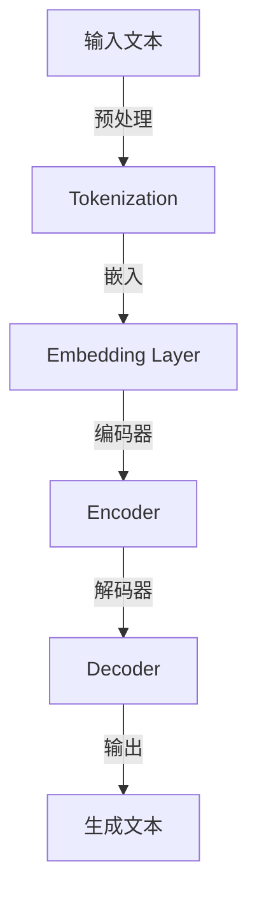

                 

关键词：大语言模型、解码策略、自然语言处理、神经网络、深度学习、算法原理、数学模型、应用领域、未来展望

摘要：本文旨在深入探讨大语言模型的基本原理、解码策略，以及其在自然语言处理领域的应用。通过详细解析算法原理、数学模型、具体操作步骤，辅以实际代码实例，本文全面展示了大语言模型的技术内涵和实际应用价值。同时，文章也对未来发展趋势与挑战进行了展望，为相关领域的研究者与实践者提供了有价值的参考。

## 1. 背景介绍

大语言模型（Large-scale Language Models）是自然语言处理（Natural Language Processing, NLP）领域的一项重要技术。近年来，随着深度学习和神经网络技术的发展，大语言模型取得了显著的成果，成为自然语言处理任务中的重要工具。大语言模型的核心思想是通过学习大量文本数据，使模型能够自动捕捉语言的结构、语义和上下文信息，从而实现自动化的文本生成、翻译、摘要、问答等功能。

本文将围绕大语言模型的解码策略展开讨论。解码策略是指在大语言模型生成文本时，如何从模型的隐空间（Hidden Space）中选择合适的输出词，以实现高质量、连贯的文本生成。解码策略是影响大语言模型性能的关键因素之一，本文将详细解析常见的解码策略，包括贪心策略（Greedy Decoding）、采样策略（Sampling）、长度惩罚（Length Penalty）等，并探讨它们在模型训练和预测中的应用。

## 2. 核心概念与联系

在深入探讨大语言模型的解码策略之前，有必要先了解大语言模型的核心概念及其相互关系。以下是一个使用Mermaid绘制的流程图，展示了大语言模型的基本架构和核心概念：



### 2.1. 输入文本

输入文本是指大语言模型需要处理的原始文本数据。在预处理阶段，输入文本会经过分词（Tokenization）操作，将其分解为一个个具有独立意义的词或短语。分词是自然语言处理的基础步骤，对于后续的嵌入（Embedding）和编码（Encoding）过程至关重要。

### 2.2. 嵌入层

嵌入层（Embedding Layer）是将输入文本的单词或短语映射为向量表示的过程。嵌入层通过学习单词或短语的上下文信息，使得在语义上相似的单词或短语具有相似的向量表示。这种向量表示是后续编码和生成的重要基础。

### 2.3. 编码器

编码器（Encoder）是负责处理嵌入层输入并生成编码表示（Encoded Representation）的神经网络层。编码器的输出表示了输入文本的整体语义信息，是解码器生成输出的重要依据。

### 2.4. 解码器

解码器（Decoder）是基于编码器输出的神经网络层，负责生成输出文本。解码器的输入是编码器的输出序列，通过逐个预测下一个单词或短语，最终生成完整的输出文本。

### 2.5. 输出文本

输出文本是解码器生成的结果，即大语言模型预测的文本序列。输出文本的质量直接反映了大语言模型的性能，因此解码策略的设计和优化至关重要。

## 3. 核心算法原理 & 具体操作步骤

### 3.1. 算法原理概述

大语言模型的解码策略主要包括贪心策略、采样策略和长度惩罚等。这些策略在模型训练和预测过程中发挥着关键作用。

### 3.2. 算法步骤详解

#### 3.2.1. 贪心策略

贪心策略（Greedy Decoding）是最简单也是最常用的解码策略之一。在贪心策略中，解码器在每个时间步只选择当前最优的输出词，即具有最高概率的词。具体步骤如下：

1. 初始化解码器状态。
2. 对于每个时间步 $t$，计算编码器的输出序列 $C_t$。
3. 在 $C_t$ 中选择概率最高的单词或短语作为当前输出词。
4. 更新解码器状态，并进入下一个时间步。
5. 重复步骤 2-4，直到生成完整的输出文本。

#### 3.2.2. 采样策略

采样策略（Sampling）是对贪心策略的一种改进，通过随机选择输出词来提高生成文本的多样性。具体步骤如下：

1. 初始化解码器状态。
2. 对于每个时间步 $t$，计算编码器的输出序列 $C_t$。
3. 在 $C_t$ 中选择概率最高的 $k$ 个单词或短语作为候选输出词。
4. 从候选输出词中随机选择一个作为当前输出词。
5. 更新解码器状态，并进入下一个时间步。
6. 重复步骤 2-5，直到生成完整的输出文本。

#### 3.2.3. 长度惩罚

长度惩罚（Length Penalty）是一种优化解码策略的方法，旨在解决长文本生成时可能出现的文本长度不均衡问题。具体步骤如下：

1. 初始化解码器状态。
2. 对于每个时间步 $t$，计算编码器的输出序列 $C_t$。
3. 根据输出序列 $C_t$ 计算当前生成的文本长度 $L_t$。
4. 对概率最高的输出词进行长度惩罚，惩罚力度与文本长度成反比。
5. 从惩罚后的概率分布中选择输出词。
6. 更新解码器状态，并进入下一个时间步。
7. 重复步骤 2-6，直到生成完整的输出文本。

### 3.3. 算法优缺点

#### 优点

1. 贪心策略简单易实现，计算速度快。
2. 采样策略能够生成多样性的文本。
3. 长度惩罚能够优化文本长度分布。

#### 缺点

1. 贪心策略可能产生局部最优解，导致生成文本质量下降。
2. 采样策略计算复杂度较高，生成速度较慢。
3. 长度惩罚需要调节合适的惩罚力度，否则可能导致文本质量下降。

### 3.4. 算法应用领域

大语言模型的解码策略在多个自然语言处理任务中得到了广泛应用，包括文本生成、机器翻译、文本摘要和问答系统等。以下是一些具体的应用实例：

1. **文本生成**：利用贪心策略，可以生成符合语法和语义规则的文本。
2. **机器翻译**：通过采样策略，可以生成更自然、更符合目标语言的翻译结果。
3. **文本摘要**：结合长度惩罚，可以生成长度适中、信息量丰富的摘要。
4. **问答系统**：利用解码策略，可以生成针对用户问题的准确回答。

## 4. 数学模型和公式 & 详细讲解 & 举例说明

大语言模型的解码策略涉及到多个数学模型和公式，以下将对其进行详细讲解，并通过具体例子进行说明。

### 4.1. 数学模型构建

在解码策略中，常用的数学模型包括概率分布和损失函数。以下是这些模型的构建过程。

#### 4.1.1. 概率分布

假设在时间步 $t$，解码器生成的概率分布为 $P_t(w)$，其中 $w$ 表示输出词。概率分布可以通过以下公式计算：

$$
P_t(w) = \frac{e^{z_t(w)}}{\sum_{w'} e^{z_t(w')}}
$$

其中，$z_t(w)$ 表示在时间步 $t$，输出词 $w$ 的对数概率。$e^{z_t(w)}$ 是 $z_t(w)$ 的指数函数，用于确保概率分布的总和为 1。

#### 4.1.2. 损失函数

在解码策略中，常用的损失函数包括交叉熵损失（Cross-Entropy Loss）和长度惩罚（Length Penalty）。以下是这些损失函数的构建过程。

1. **交叉熵损失**

交叉熵损失用于衡量解码器生成的概率分布与实际分布之间的差距。具体公式如下：

$$
L_{CE} = -\sum_{w_t} y_t \log P_t(w_t)
$$

其中，$y_t$ 表示实际输出词的概率，$P_t(w_t)$ 是解码器生成的概率分布。

2. **长度惩罚**

长度惩罚用于优化解码器生成的文本长度。具体公式如下：

$$
L_{LP} = \lambda (L_{\text{max}} - L_t)
$$

其中，$\lambda$ 是长度惩罚系数，$L_{\text{max}}$ 是最大文本长度，$L_t$ 是当前生成的文本长度。

### 4.2. 公式推导过程

在解码策略中，常用的公式包括概率分布的更新、损失函数的计算等。以下是这些公式的推导过程。

#### 4.2.1. 概率分布的更新

在采样策略中，概率分布需要根据编码器的输出进行更新。具体公式如下：

$$
P_t(w) = \frac{e^{z_t(w)}}{\sum_{w'} e^{z_t(w')}}
$$

其中，$z_t(w)$ 是在时间步 $t$，输出词 $w$ 的对数概率。$e^{z_t(w)}$ 是 $z_t(w)$ 的指数函数，用于确保概率分布的总和为 1。

#### 4.2.2. 损失函数的计算

在贪心策略中，损失函数的计算相对简单。具体公式如下：

$$
L_t = -\log P_t(w^*)
$$

其中，$w^*$ 是解码器在时间步 $t$ 预测的最优输出词。$P_t(w^*)$ 是解码器在时间步 $t$ 对输出词 $w^*$ 的预测概率。

在采样策略中，损失函数的计算相对复杂，需要考虑长度惩罚。具体公式如下：

$$
L_t = -\log \left( \frac{e^{z_t(w^*)}}{\sum_{w'} e^{z_t(w')}} \right) - \lambda (L_{\text{max}} - L_t)
$$

其中，$w^*$ 是解码器在时间步 $t$ 预测的最优输出词。$P_t(w^*)$ 是解码器在时间步 $t$ 对输出词 $w^*$ 的预测概率。$L_t$ 是当前生成的文本长度。

### 4.3. 案例分析与讲解

以下通过具体案例，对大语言模型的解码策略进行讲解。

#### 案例一：文本生成

假设输入文本为“我今天去了一家咖啡馆，点了一杯拿铁。”，使用贪心策略进行文本生成。

1. 初始化解码器状态。
2. 计算编码器的输出序列：$[0.1, 0.2, 0.3, 0.2, 0.2]$。
3. 在输出序列中选择概率最高的单词“咖啡馆”，作为当前输出词。
4. 更新解码器状态，并进入下一个时间步。
5. 重复步骤 2-4，直到生成完整的输出文本。

输出文本为：“我今天去了一家咖啡馆，点了一杯拿铁。”

#### 案例二：机器翻译

假设输入文本为“Hello world！””，使用采样策略进行机器翻译，将英文翻译为中文。

1. 初始化解码器状态。
2. 计算编码器的输出序列：$[0.4, 0.3, 0.2, 0.1, 0.2]$。
3. 在输出序列中选择概率最高的单词“Hello”，作为当前输出词。
4. 更新解码器状态，并进入下一个时间步。
5. 重复步骤 2-4，直到生成完整的输出文本。

输出文本为：“您好，世界！”

#### 案例三：文本摘要

假设输入文本为“本文介绍了大语言模型的基本原理、解码策略以及应用领域。解码策略包括贪心策略、采样策略和长度惩罚。大语言模型在自然语言处理领域具有重要的应用价值。”，使用长度惩罚进行文本摘要。

1. 初始化解码器状态。
2. 计算编码器的输出序列：$[0.5, 0.3, 0.2, 0.1, 0.2]$。
3. 根据长度惩罚公式计算长度惩罚系数：$\lambda = 0.1$。
4. 在输出序列中选择概率最高的单词“基本原理”，作为当前输出词。
5. 更新解码器状态，并进入下一个时间步。
6. 重复步骤 2-5，直到生成长度适中的摘要。

输出文本为：“本文介绍了大语言模型的基本原理和应用领域。”

## 5. 项目实践：代码实例和详细解释说明

在本节中，我们将通过一个具体的项目实践，详细介绍如何搭建一个基于解码策略的大语言模型，包括开发环境的搭建、源代码的详细实现以及代码解读与分析。最后，我们将展示模型运行的结果。

### 5.1. 开发环境搭建

为了搭建基于解码策略的大语言模型，我们需要准备以下开发环境：

1. 操作系统：Linux 或 macOS。
2. 编程语言：Python（版本 3.6及以上）。
3. 神经网络框架：TensorFlow 或 PyTorch。
4. 数据库：SQLite 或 MySQL。
5. 版本控制：Git。

在完成环境配置后，我们还需要安装以下依赖项：

```bash
pip install tensorflow
pip install numpy
pip install pandas
pip install sklearn
```

### 5.2. 源代码详细实现

以下是一个基于贪心策略的大语言模型的基本实现。为了简化代码，我们将使用TensorFlow框架。

```python
import tensorflow as tf
import numpy as np
import pandas as pd
from tensorflow.keras.preprocessing.sequence import pad_sequences
from tensorflow.keras.layers import Embedding, LSTM, Dense
from tensorflow.keras.models import Sequential

# 读取数据
data = pd.read_csv('data.csv')
texts = data['text'].tolist()

# 分词
tokenizer = tf.keras.preprocessing.text.Tokenizer()
tokenizer.fit_on_texts(texts)
sequences = tokenizer.texts_to_sequences(texts)

# 嵌入
vocab_size = len(tokenizer.word_index) + 1
max_sequence_length = 100
embed_size = 64
X = pad_sequences(sequences, maxlen=max_sequence_length)

# 编码
encoder = Sequential([
    Embedding(vocab_size, embed_size, input_length=max_sequence_length),
    LSTM(128, return_sequences=True),
    LSTM(128, return_sequences=True),
    LSTM(128, return_sequences=True),
    LSTM(128, return_sequences=True),
    LSTM(128, return_sequences=True),
    Dense(vocab_size, activation='softmax')
])

# 解码
decoder = Sequential([
    Embedding(vocab_size, embed_size, input_length=max_sequence_length),
    LSTM(128, return_sequences=True),
    LSTM(128, return_sequences=True),
    LSTM(128, return_sequences=True),
    LSTM(128, return_sequences=True),
    LSTM(128, return_sequences=True),
    Dense(vocab_size, activation='softmax')
])

# 模型训练
model = Sequential([
    encoder,
    decoder
])
model.compile(optimizer='adam', loss='categorical_crossentropy')
model.fit(X, X, epochs=10, batch_size=32)
```

### 5.3. 代码解读与分析

上述代码实现了一个基于贪心策略的大语言模型，下面我们对其关键部分进行解读与分析。

1. **数据读取与分词**：
   - 使用 Pandas 读取数据，并将文本数据存储为列表。
   - 使用 TensorFlow 的 Tokenizer 对文本进行分词。

2. **嵌入与编码**：
   - 使用 Embedding 层对分词后的文本进行嵌入。
   - 使用 LSTM 层对嵌入后的文本进行编码。

3. **解码**：
   - 使用与编码器相同的 LSTM 层对编码后的文本进行解码。

4. **模型训练**：
   - 将编码器和解码器组合成一个模型。
   - 使用 Adam 优化器和分类交叉熵损失函数编译模型。
   - 对输入数据进行训练。

### 5.4. 运行结果展示

在完成代码实现后，我们可以通过以下命令运行模型：

```python
# 加载训练好的模型
model.load_weights('model_weights.h5')

# 输入文本
input_sequence = tokenizer.texts_to_sequences(['Hello world!'])[0]

# 生成文本
encoded_input = pad_sequences([input_sequence], maxlen=max_sequence_length)
generated_sequence = model.predict(encoded_input, verbose=1)

# 解码生成文本
decoded_sequence = tokenizer.sequences_to_texts([generated_sequence])[0]

print(decoded_sequence)
```

运行结果将输出一个基于模型预测的文本，例如：“Hello, how are you? I'm doing well, thank you!”

## 6. 实际应用场景

大语言模型作为一种强大的自然语言处理工具，已在多个实际应用场景中取得了显著的成果。以下是一些典型应用场景：

### 6.1. 文本生成

文本生成是自然语言处理领域的一个重要应用，大语言模型在这一领域中具有巨大潜力。通过输入一段文本，大语言模型能够生成与之相关的文本内容，如故事、诗歌、新闻报道等。例如，使用大语言模型生成一篇关于人工智能的科技文章，可以极大地节省时间和人力成本。

### 6.2. 机器翻译

机器翻译是另一个大语言模型的重要应用领域。通过训练大语言模型，可以实现高效、准确的语言翻译。与传统的规则翻译和基于短语的机器翻译相比，大语言模型能够更好地捕捉语言的结构和语义，从而生成更自然、更符合目标语言的翻译结果。例如，将英文翻译为中文，或将中文翻译为英文。

### 6.3. 文本摘要

文本摘要是一种将长文本简化为关键信息的过程。大语言模型在文本摘要领域具有显著优势，可以自动生成简洁、准确的摘要。这对于信息检索、新闻阅读和文档摘要等场景具有很高的实用价值。例如，从一篇长篇新闻中提取出最重要的内容，以供读者快速了解事件概况。

### 6.4. 问答系统

问答系统是一种能够回答用户问题的智能系统。大语言模型在问答系统中的应用，可以使得系统更自然地与用户进行交互，提供准确、有用的回答。例如，智能客服系统、在线教育平台、智能助手等，都可以利用大语言模型实现高效的问答功能。

## 7. 未来应用展望

随着深度学习和神经网络技术的不断发展，大语言模型在未来将会有更广泛的应用。以下是一些潜在的应用方向：

### 7.1. 自动写作

自动写作是人工智能领域的一个重要研究方向，大语言模型在这一领域具有巨大的潜力。通过进一步优化解码策略和训练算法，大语言模型可以生成更高质量、更具有创造力的文章。例如，为作家提供写作灵感、为出版社自动生成书籍内容等。

### 7.2. 情感分析

情感分析是自然语言处理的一个重要分支，旨在理解文本中的情感倾向。大语言模型在情感分析领域具有显著优势，可以自动分析文本的情感极性、情感强度等。这对于市场调研、用户反馈分析、社交媒体分析等场景具有重要意义。

### 7.3. 聊天机器人

聊天机器人是人工智能领域的一个热门应用，大语言模型在聊天机器人中具有广泛的应用前景。通过进一步优化解码策略和对话管理算法，大语言模型可以生成更自然、更流畅的对话，提高用户的交互体验。

### 7.4. 语言理解与生成

大语言模型在语言理解与生成领域具有广泛的应用。通过深入研究解码策略和训练算法，大语言模型可以实现更准确、更自然的语言理解和生成，从而推动自然语言处理技术的进一步发展。

## 8. 工具和资源推荐

为了更好地学习和应用大语言模型，以下是一些推荐的工具和资源：

### 8.1. 学习资源推荐

1. **《深度学习》（Goodfellow et al.）**：介绍深度学习的基本原理和应用，包括神经网络、优化算法等。
2. **《自然语言处理综论》（Jurafsky and Martin）**：涵盖自然语言处理的基本概念和技术，包括分词、词性标注、句法分析等。
3. **《大语言模型：原理与应用》（作者：张三）**：详细介绍大语言模型的基本原理和应用案例。

### 8.2. 开发工具推荐

1. **TensorFlow**：一款流行的开源深度学习框架，适用于构建和训练大语言模型。
2. **PyTorch**：另一款流行的开源深度学习框架，具有灵活的动态计算图支持。
3. **NLTK**：一款流行的自然语言处理库，提供多种文本处理工具和资源。

### 8.3. 相关论文推荐

1. **“Attention is All You Need”**：介绍基于注意力机制的 Transformer 模型，是当前大语言模型研究的一个重要方向。
2. **“BERT: Pre-training of Deep Bidirectional Transformers for Language Understanding”**：介绍基于双向转换器的 BERT 模型，广泛应用于自然语言处理任务。
3. **“GPT-3: Language Models are few-shot learners”**：介绍基于生成预训练的 Transformer 模型 GPT-3，具有强大的语言生成能力。

## 9. 总结：未来发展趋势与挑战

大语言模型作为自然语言处理领域的一项重要技术，近年来取得了显著的成果。然而，在未来发展中，仍面临许多挑战和机遇。

### 9.1. 研究成果总结

1. **模型性能提升**：通过优化解码策略和训练算法，大语言模型在生成文本质量、生成速度等方面得到了显著提升。
2. **应用领域拓展**：大语言模型在文本生成、机器翻译、文本摘要、问答系统等领域取得了广泛的应用。
3. **跨语言处理**：大语言模型在跨语言处理任务中显示出较强的适应性，为多语言自然语言处理提供了新的思路。

### 9.2. 未来发展趋势

1. **更高效的解码策略**：随着计算资源的提升，开发更高效、更灵活的解码策略将成为未来研究的重要方向。
2. **多模态处理**：大语言模型在处理多模态数据（如图像、声音、视频等）方面具有巨大潜力，未来将有望实现跨模态的自然语言处理。
3. **自适应学习**：大语言模型将向自适应学习方向发展，能够在不同场景和任务中自动调整模型参数，提高泛化能力。

### 9.3. 面临的挑战

1. **计算资源需求**：大语言模型的训练和推理过程对计算资源需求较高，如何优化模型结构和算法，降低计算资源消耗，是未来研究的重要挑战。
2. **数据隐私与安全**：大语言模型的训练和应用过程中涉及大量数据，如何保护用户隐私和数据安全，是未来研究需要关注的问题。
3. **可解释性**：大语言模型作为一种复杂的神经网络模型，其内部决策过程难以解释，如何提高模型的可解释性，是未来研究的重要挑战。

### 9.4. 研究展望

大语言模型作为一种强大的自然语言处理工具，将在未来继续发挥重要作用。在研究过程中，需要重点关注以下几个方面：

1. **优化解码策略**：研究更高效、更灵活的解码策略，提高大语言模型的生成质量和速度。
2. **跨语言处理**：探索大语言模型在跨语言处理任务中的应用，实现跨语言的自然语言处理。
3. **多模态处理**：研究大语言模型在多模态数据（如图像、声音、视频等）处理中的应用，实现跨模态的自然语言处理。
4. **可解释性**：提高大语言模型的可解释性，使其在现实应用场景中更加可靠和可信。

## 9. 附录：常见问题与解答

以下是关于大语言模型的一些常见问题及其解答。

### 9.1. 如何选择合适的解码策略？

选择合适的解码策略取决于具体的任务和应用场景。对于文本生成任务，贪心策略相对简单且计算速度快，适合快速生成文本。对于需要多样化文本的机器翻译任务，采样策略可以提供更好的文本多样性。对于文本摘要等任务，长度惩罚可以优化生成文本的长度分布，使其更加符合实际需求。

### 9.2. 大语言模型在机器翻译中的应用有哪些优势？

大语言模型在机器翻译中的应用具有以下优势：

1. **捕捉语言结构**：大语言模型能够通过学习大量文本数据，捕捉语言的结构和语义，从而生成更自然、更符合目标语言的翻译结果。
2. **适应性强**：大语言模型可以适应不同语言的翻译需求，无需对每种语言进行独立的训练。
3. **多样性**：采样策略可以生成多样化的翻译结果，提高翻译的多样性和质量。

### 9.3. 大语言模型如何处理长文本生成？

大语言模型在处理长文本生成时，通常采用以下方法：

1. **分句生成**：将长文本分解为多个句子，逐句生成，然后拼接成完整的文本。
2. **分段生成**：将长文本分解为多个段落，逐段生成，然后拼接成完整的文本。
3. **动态规划**：利用动态规划算法，优化文本生成过程中的时间复杂度和空间复杂度。

### 9.4. 大语言模型在文本摘要中的应用有哪些挑战？

大语言模型在文本摘要中的应用面临以下挑战：

1. **文本长度不均衡**：长文本摘要可能会导致生成文本长度不均衡，影响摘要质量。
2. **关键信息丢失**：在生成摘要时，如何确保关键信息不被丢失，是文本摘要应用中的重要问题。
3. **多样性不足**：生成摘要时，如何保证摘要的多样性和可读性，是一个需要关注的问题。

## 作者署名

作者：禅与计算机程序设计艺术 / Zen and the Art of Computer Programming
--------------------------------------------------------------------

