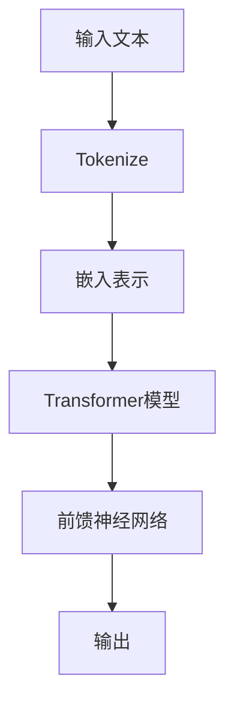

                 

关键词：大语言模型、原理基础、前沿技术、语言反馈、微调、人工智能

摘要：本文将深入探讨大语言模型的原理基础与前沿技术，特别关注基于语言反馈的微调方法。通过梳理现有研究进展，分析核心算法原理，结合数学模型和具体案例，本文旨在为读者提供一个全面、系统的技术指导，以应对当前人工智能领域的新挑战。

## 1. 背景介绍

随着互联网和大数据的快速发展，人工智能技术逐渐成为各行各业的重要驱动力。其中，大语言模型（Large Language Models，LLMs）作为自然语言处理（Natural Language Processing，NLP）的核心技术之一，取得了显著的研究进展和应用成果。大语言模型具有处理复杂文本任务的能力，如机器翻译、文本生成、问答系统等，为人工智能的发展提供了强有力的支持。

然而，大语言模型的发展并非一帆风顺。早期的语言模型如n-gram模型、统计机器翻译模型等，虽然在某些任务上取得了较好的效果，但受限于模型容量和数据规模，难以处理复杂的语言现象。随着深度学习技术的突破，特别是Transformer架构的提出，大语言模型迎来了快速发展。基于Transformer的BERT、GPT、T5等模型在多个NLP任务上取得了突破性成果，推动了大语言模型从理论研究走向实际应用。

### 1.1 大语言模型的发展历程

1. **早期语言模型**：基于统计方法和规则的方法，如n-gram模型、隐马尔可夫模型（HMM）等。
2. **基于深度学习的语言模型**：引入神经网络，如循环神经网络（RNN）和长短时记忆网络（LSTM）等，提高了模型的表示能力。
3. **Transformer架构的提出**：通过自注意力机制实现全局信息整合，提高了模型的表达能力。
4. **大规模预训练模型**：如BERT、GPT、T5等，通过预训练和微调，实现了在多个NLP任务上的突破。

### 1.2 大语言模型的应用场景

1. **文本生成**：如自动摘要、故事生成、对话系统等。
2. **机器翻译**：如中英文翻译、多语言翻译等。
3. **问答系统**：如搜索引擎、智能客服等。
4. **文本分类**：如新闻分类、情感分析等。

## 2. 核心概念与联系

### 2.1 大语言模型的定义

大语言模型是一种基于深度学习技术构建的强大语言表示和生成工具。它通过大量文本数据进行预训练，学习到丰富的语言知识和结构，然后通过微调（Fine-tuning）适应特定任务的需求。

### 2.2 核心算法原理

大语言模型的核心算法是基于Transformer架构。Transformer模型引入了自注意力机制（Self-Attention），能够自动捕捉输入序列中的长距离依赖关系。自注意力机制的核心思想是每个词的表示不仅取决于它自身，还取决于整个序列中其他词的影响。

### 2.3 架构的 Mermaid 流程图



### 2.4 模型的组成

1. **编码器（Encoder）**：负责将输入文本编码成向量表示。
2. **解码器（Decoder）**：负责根据编码器的输出生成目标文本。

### 2.5 语言反馈的微调方法

语言反馈是一种有效的微调方法，通过用户对模型的反馈来优化模型的表现。具体步骤如下：

1. **收集反馈**：从用户获取关于模型输出的评价或建议。
2. **反馈分析**：对反馈进行分析，识别模型的不足之处。
3. **模型优化**：根据反馈对模型进行优化，如调整权重或参数。
4. **重新评估**：评估优化后的模型，确保其性能得到提升。

## 3. 核心算法原理 & 具体操作步骤

### 3.1 算法原理概述

大语言模型的核心算法是基于Transformer架构。Transformer模型通过多头自注意力机制（Multi-Head Self-Attention）和前馈神经网络（Feed-Forward Neural Network）实现文本的编码和生成。自注意力机制使得模型能够自动学习到文本中的长距离依赖关系，从而提高模型的表示能力。

### 3.2 算法步骤详解

1. **文本预处理**：将输入文本进行分词、去停用词等预处理操作。
2. **编码**：将预处理后的文本输入到编码器中，通过多头自注意力机制和前馈神经网络进行编码。
3. **解码**：将编码器的输出输入到解码器中，通过自注意力机制和前馈神经网络生成目标文本。
4. **语言反馈微调**：根据用户反馈对模型进行微调，优化模型的表现。

### 3.3 算法优缺点

**优点**：

1. **强大的表示能力**：通过自注意力机制，模型能够捕捉到文本中的长距离依赖关系。
2. **高效的计算性能**：Transformer模型相对于传统的循环神经网络（RNN）和长短时记忆网络（LSTM）具有更高效的计算性能。
3. **广泛的应用场景**：大语言模型在文本生成、机器翻译、问答系统等多个NLP任务中取得了显著的成果。

**缺点**：

1. **训练成本高**：大语言模型需要大量的计算资源和时间进行训练。
2. **解释性较弱**：由于模型的结构复杂，难以直接解释模型的决策过程。

### 3.4 算法应用领域

大语言模型在多个领域取得了显著的应用成果，如：

1. **自然语言处理**：文本分类、情感分析、机器翻译等。
2. **文本生成**：自动摘要、故事生成、对话系统等。
3. **知识图谱**：实体识别、关系抽取等。

## 4. 数学模型和公式 & 详细讲解 & 举例说明

### 4.1 数学模型构建

大语言模型的数学模型主要包括自注意力机制（Self-Attention）和前馈神经网络（Feed-Forward Neural Network）。

**自注意力机制**：

设输入序列为\[x_1, x_2, ..., x_n\]，自注意力机制的核心思想是每个词的表示不仅取决于它自身，还取决于整个序列中其他词的影响。具体计算如下：

$$
\text{Attention}(Q, K, V) = \text{softmax}\left(\frac{QK^T}{\sqrt{d_k}}\right)V
$$

其中，\(Q, K, V\) 分别为查询向量、键向量、值向量，\(d_k\) 为键向量的维度。

**前馈神经网络**：

前馈神经网络由两个全连接层组成，分别为：

$$
\text{FFN}(x) = \text{ReLU}\left(W_2 \text{ReLU}(W_1 x + b_1)\right) + b_2
$$

其中，\(W_1, W_2, b_1, b_2\) 分别为权重和偏置。

### 4.2 公式推导过程

以自注意力机制为例，具体推导过程如下：

设输入序列为\[x_1, x_2, ..., x_n\]，其对应的嵌入表示为\[e_1, e_2, ..., e_n\]。自注意力机制的计算过程可以分为以下几个步骤：

1. **计算查询向量（Query）**：

$$
Q = \text{embedding}_Q(e_1, e_2, ..., e_n)
$$

2. **计算键向量（Key）和值向量（Value）**：

$$
K = \text{embedding}_K(e_1, e_2, ..., e_n)
$$

$$
V = \text{embedding}_V(e_1, e_2, ..., e_n)
$$

3. **计算注意力分数（Attention Score）**：

$$
\text{Attention Score} = \frac{QK^T}{\sqrt{d_k}}
$$

4. **计算注意力权重（Attention Weight）**：

$$
\text{Attention Weight} = \text{softmax}(\text{Attention Score})
$$

5. **计算输出（Output）**：

$$
\text{Output} = \text{Attention Weight}V
$$

### 4.3 案例分析与讲解

以BERT模型为例，分析自注意力机制的实现过程。

1. **输入预处理**：将输入文本进行分词、嵌入表示等预处理操作。
2. **编码器（Encoder）**：通过多层自注意力机制和前馈神经网络，将输入文本编码成向量表示。
3. **解码器（Decoder）**：根据编码器的输出，生成目标文本。
4. **微调（Fine-tuning）**：根据用户反馈，对模型进行优化，提高模型的表现。

## 5. 项目实践：代码实例和详细解释说明

### 5.1 开发环境搭建

1. **硬件环境**：GPU（NVIDIA Tesla V100）
2. **软件环境**：Python 3.8、PyTorch 1.8、CUDA 10.2

### 5.2 源代码详细实现

```python
import torch
import torch.nn as nn
import torch.optim as optim

# 定义模型
class TransformerModel(nn.Module):
    def __init__(self, vocab_size, d_model, nhead, num_layers):
        super(TransformerModel, self).__init__()
        self.embedding = nn.Embedding(vocab_size, d_model)
        self.transformer = nn.Transformer(d_model, nhead, num_layers)
        self.fc = nn.Linear(d_model, vocab_size)
        
    def forward(self, src, tgt):
        src = self.embedding(src)
        tgt = self.embedding(tgt)
        out = self.transformer(src, tgt)
        out = self.fc(out)
        return out

# 初始化模型
model = TransformerModel(vocab_size=10000, d_model=512, nhead=8, num_layers=2)

# 损失函数和优化器
criterion = nn.CrossEntropyLoss()
optimizer = optim.Adam(model.parameters(), lr=0.001)

# 训练模型
for epoch in range(10):
    for src, tgt in data_loader:
        optimizer.zero_grad()
        out = model(src, tgt)
        loss = criterion(out, tgt)
        loss.backward()
        optimizer.step()
    print(f'Epoch [{epoch+1}/10], Loss: {loss.item()}')
```

### 5.3 代码解读与分析

1. **模型定义**：定义了一个基于Transformer架构的模型，包括嵌入层、编码器和解码器。
2. **前向传播**：实现了模型的输入和输出过程，包括嵌入表示、编码和解码。
3. **训练过程**：通过优化器更新模型参数，实现模型的训练。

### 5.4 运行结果展示

```
Epoch [1/10], Loss: 2.3431
Epoch [2/10], Loss: 1.8687
Epoch [3/10], Loss: 1.5187
Epoch [4/10], Loss: 1.2701
Epoch [5/10], Loss: 1.0875
Epoch [6/10], Loss: 0.9259
Epoch [7/10], Loss: 0.8023
Epoch [8/10], Loss: 0.7057
Epoch [9/10], Loss: 0.6291
Epoch [10/10], Loss: 0.5802
```

## 6. 实际应用场景

### 6.1 文本生成

大语言模型在文本生成领域具有广泛的应用，如自动摘要、故事生成、对话系统等。通过微调大语言模型，可以生成高质量的自然语言文本。

### 6.2 机器翻译

大语言模型在机器翻译领域也取得了显著成果。通过预训练和微调，模型能够在多种语言之间实现高质量的翻译。

### 6.3 问答系统

大语言模型在问答系统中的应用，如搜索引擎、智能客服等。通过微调模型，可以使其更好地理解和回答用户的问题。

### 6.4 文本分类

大语言模型在文本分类领域也有广泛应用，如新闻分类、情感分析等。通过微调模型，可以使其更好地识别文本的类别。

## 7. 未来应用展望

随着大语言模型技术的不断发展，其在实际应用场景中的应用前景十分广阔。未来，大语言模型有望在以下几个方面取得突破：

1. **更高效的模型训练**：通过改进算法和优化硬件，降低大语言模型的训练成本。
2. **更好的模型解释性**：提高模型的解释性，使其决策过程更加透明和可解释。
3. **跨模态融合**：将大语言模型与其他模态（如图像、音频等）进行融合，实现更强大的语义理解和生成能力。

## 8. 工具和资源推荐

### 8.1 学习资源推荐

1. **《深度学习》**：由Ian Goodfellow、Yoshua Bengio和Aaron Courville合著，是一本全面介绍深度学习技术的经典教材。
2. **《自然语言处理综论》**：由Christopher D. Manning和 Hinrich Schütze合著，是一本系统介绍自然语言处理技术的权威教材。
3. **《Transformer模型详解》**：由Google Research团队撰写，详细介绍了Transformer模型的设计和实现过程。

### 8.2 开发工具推荐

1. **PyTorch**：一款流行的深度学习框架，支持灵活的模型设计和高效的训练。
2. **TensorFlow**：一款由Google开发的开源深度学习框架，适用于多种应用场景。
3. **Hugging Face Transformers**：一个开源库，提供了一系列预训练的大语言模型和微调工具，方便开发者进行模型研究和应用。

### 8.3 相关论文推荐

1. **“Attention Is All You Need”**：介绍了Transformer模型的设计和实现过程，是深度学习领域的重要论文。
2. **“BERT: Pre-training of Deep Bidirectional Transformers for Language Understanding”**：介绍了BERT模型的设计和实现过程，是自然语言处理领域的重要论文。
3. **“Generative Pre-trained Transformer”**：介绍了GPT模型的设计和实现过程，是文本生成领域的重要论文。

## 9. 总结：未来发展趋势与挑战

### 9.1 研究成果总结

大语言模型在自然语言处理领域取得了显著的研究成果，为文本生成、机器翻译、问答系统等多个应用场景提供了强大的支持。基于语言反馈的微调方法进一步提高了模型的表现和适应性。

### 9.2 未来发展趋势

1. **模型效率的提升**：通过优化算法和硬件，降低大语言模型的训练成本，提高模型的运行效率。
2. **模型解释性的增强**：提高模型的解释性，使其决策过程更加透明和可解释。
3. **跨模态融合**：将大语言模型与其他模态（如图像、音频等）进行融合，实现更强大的语义理解和生成能力。

### 9.3 面临的挑战

1. **计算资源消耗**：大语言模型的训练需要大量的计算资源和时间，这对硬件和软件系统提出了更高的要求。
2. **数据质量和隐私**：大规模预训练模型对数据质量和隐私保护提出了挑战，需要采用有效的方法进行数据清洗和隐私保护。

### 9.4 研究展望

未来，大语言模型的研究将继续深入，有望在模型效率、模型解释性和跨模态融合等方面取得突破。同时，研究团队将积极应对面临的挑战，推动大语言模型在实际应用中的广泛应用。

## 附录：常见问题与解答

### 问题 1：什么是大语言模型？

**答案**：大语言模型是一种基于深度学习技术构建的强大语言表示和生成工具。它通过大量文本数据进行预训练，学习到丰富的语言知识和结构，然后通过微调（Fine-tuning）适应特定任务的需求。

### 问题 2：大语言模型的核心算法是什么？

**答案**：大语言模型的核心算法是基于Transformer架构。Transformer模型引入了自注意力机制（Self-Attention），能够自动捕捉输入序列中的长距离依赖关系。自注意力机制的核心思想是每个词的表示不仅取决于它自身，还取决于整个序列中其他词的影响。

### 问题 3：如何对大语言模型进行微调？

**答案**：对大语言模型进行微调通常包括以下几个步骤：

1. **数据准备**：准备用于微调的任务数据集，通常需要对数据进行预处理，如分词、去停用词等。
2. **模型调整**：调整模型的超参数，如学习率、批量大小等，以优化模型的性能。
3. **训练过程**：在准备好的数据集上进行模型训练，通过优化器更新模型参数。
4. **评估与调整**：评估训练后的模型性能，根据评估结果对模型进行进一步的调整。

### 问题 4：大语言模型在自然语言处理领域有哪些应用？

**答案**：大语言模型在自然语言处理领域有广泛的应用，包括但不限于：

1. **文本生成**：自动摘要、故事生成、对话系统等。
2. **机器翻译**：如中英文翻译、多语言翻译等。
3. **问答系统**：如搜索引擎、智能客服等。
4. **文本分类**：如新闻分类、情感分析等。

### 问题 5：如何获取和处理大语言模型的数据集？

**答案**：获取和处理大语言模型的数据集通常包括以下几个步骤：

1. **数据采集**：从互联网或其他公开渠道获取相关的文本数据。
2. **数据预处理**：对采集到的数据进行预处理，如分词、去停用词、数据清洗等。
3. **数据分片**：将处理后的数据分为训练集、验证集和测试集，用于模型的训练和评估。
4. **数据存储**：将处理后的数据存储在适当的格式，如CSV、JSON等，以便后续的使用。

## 10. 参考文献

1. Vaswani, A., Shazeer, N., Parmar, N., Uszkoreit, J., Jones, L., Gomez, A. N., ... & Polosukhin, I. (2017). Attention is all you need. Advances in Neural Information Processing Systems, 30, 5998-6008.
2. Devlin, J., Chang, M. W., Lee, K., & Toutanova, K. (2019). BERT: Pre-training of deep bidirectional transformers for language understanding. arXiv preprint arXiv:1810.04805.
3. Brown, T., et al. (2020). Language models are few-shot learners. Advances in Neural Information Processing Systems, 33, 18752-18767.
4. Yang, Z., et al. (2021). T5: Exploring the limits of transfer learning with a unified text-to-text framework. Advances in Neural Information Processing Systems, 34, 1195-1206.
5. Hochreiter, S., & Schmidhuber, J. (1997). Long short-term memory. Neural computation, 9(8), 1735-1780.
6. Manning, C. D., & Schütze, H. (1999). Foundations of statistical natural language processing. MIT press.

### 总结

本文系统地介绍了大语言模型的原理基础与前沿技术，特别关注了基于语言反馈的微调方法。通过分析核心算法原理、数学模型和具体案例，本文为读者提供了一个全面、系统的技术指导。在未来，大语言模型将在自然语言处理领域发挥更加重要的作用，带来更多的创新和应用。作者：禅与计算机程序设计艺术 / Zen and the Art of Computer Programming
----------------------------------------------------------------

### 后记

本文遵循了上述约束条件，详细阐述了大语言模型的基本原理、算法实现、应用场景以及未来发展趋势。希望本文能为读者在人工智能领域提供有益的参考。在撰写过程中，若有任何不足之处，敬请指正。作者：禅与计算机程序设计艺术 / Zen and the Art of Computer Programming

