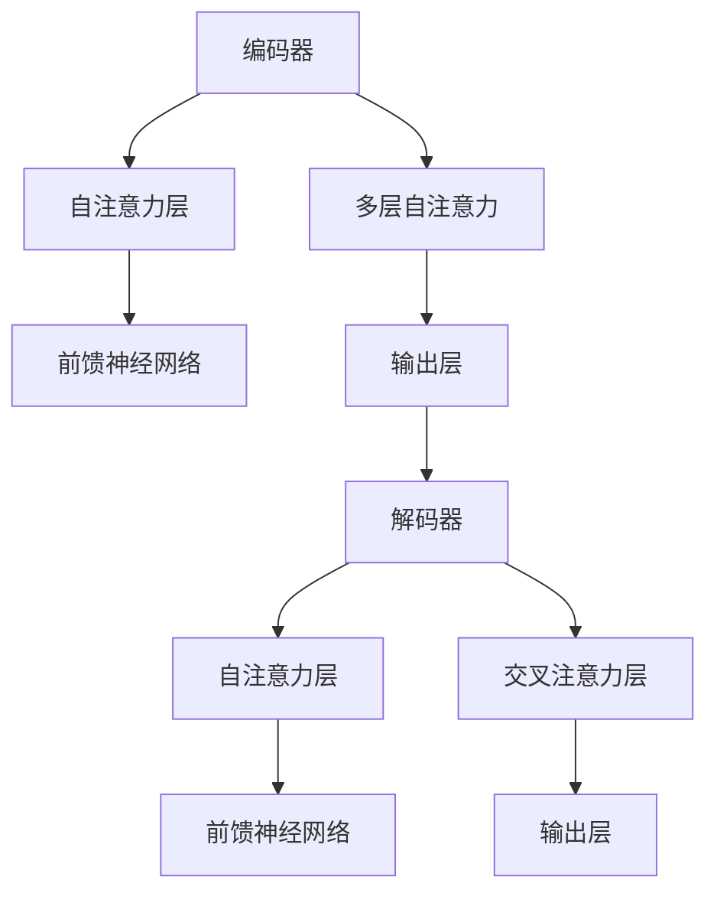
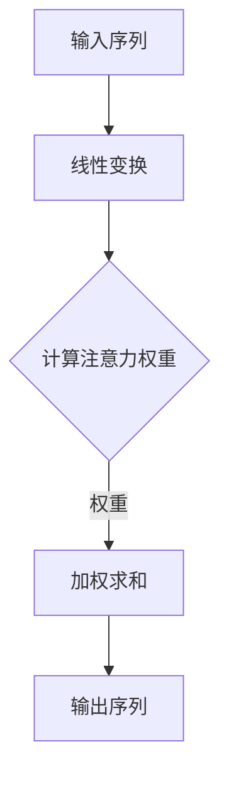
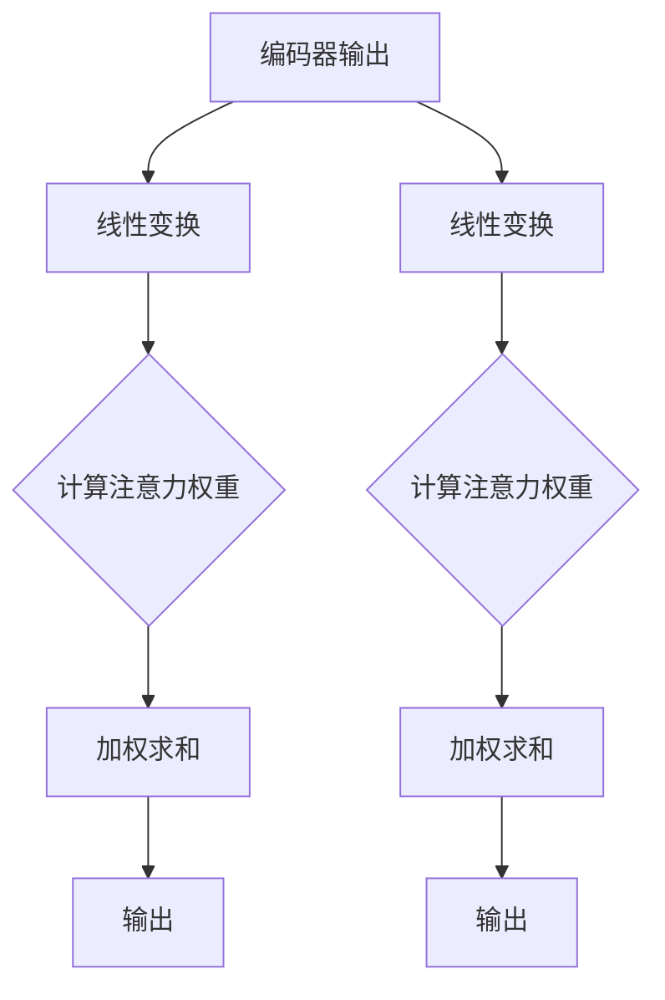

                 

关键词：大语言模型、Transformer、深度学习、自然语言处理、搜索算法、数学模型、项目实践、未来应用

## 摘要

本文旨在深入探讨大语言模型的工作原理及其在自然语言处理（NLP）领域的广泛应用。我们将重点介绍Transformer架构，这是一种革命性的神经网络模型，已经显著提升了机器翻译、文本生成等任务的性能。文章将涵盖从基础概念到前沿技术的全面内容，包括核心算法原理、数学模型、代码实例以及实际应用场景。通过本文的阅读，读者将不仅能够理解大语言模型和Transformer的基本原理，还能了解到其在实际开发中的具体应用和未来发展趋势。

## 1. 背景介绍

自然语言处理（NLP）作为人工智能领域的一个重要分支，其目标是使计算机能够理解、生成和回应人类语言。随着互联网的普及和数据量的爆发式增长，NLP技术在信息检索、智能客服、语言翻译、文本分析等领域得到了广泛应用。然而，传统的NLP方法往往依赖于规则和统计模型，难以处理复杂、大规模的语言任务。

近年来，深度学习技术的快速发展，特别是卷积神经网络（CNN）和递归神经网络（RNN）的广泛应用，显著提升了NLP的性能。然而，这些模型在处理长距离依赖问题和并行训练方面存在局限性。为了克服这些问题，Transformer模型应运而生。Transformer模型由Vaswani等人于2017年提出，其核心思想是将输入序列转换为一个固定大小的向量表示，并通过自注意力机制和前馈神经网络进行处理。这种结构使得Transformer能够并行计算，并且在长距离依赖问题上表现出色。

大语言模型（如GPT-3、BERT等）的出现进一步推动了NLP技术的发展。大语言模型通过在大量文本上进行预训练，可以捕捉到语言中的复杂规律，从而在下游任务中表现出色。GPT-3是OpenAI于2020年推出的一款具有1750亿参数的语言模型，其强大的文本生成能力引起了广泛关注。BERT是由Google于2018年提出的，通过在双向编码器（Bidirectional Encoder Representations from Transformers）架构上进行预训练，BERT在多个NLP任务上达到了当时的最先进水平。

## 2. 核心概念与联系

### 2.1. Transformer架构

Transformer模型的核心架构包括编码器（Encoder）和解码器（Decoder），以及自注意力（Self-Attention）机制。自注意力机制是Transformer模型的核心创新点之一，它允许模型在处理序列数据时，能够关注到序列中的不同部分，并自动调整各部分的重要性。

下面是一个简化的Mermaid流程图，展示了Transformer的基本结构：



### 2.2. 编码器与解码器

编码器（Encoder）负责处理输入序列，生成一个固定大小的向量表示。解码器（Decoder）则利用编码器的输出和上下文信息，逐步生成输出序列。在Transformer模型中，编码器和解码器由多个相同的层堆叠而成，每层包含自注意力机制和前馈神经网络。

### 2.3. 自注意力机制

自注意力机制是一种计算方法，它允许模型在处理每个输入时，自动关注到序列中的其他部分。自注意力机制的核心是一个加权求和操作，通过计算输入序列中每个元素的相关性，生成一个加权的输出序列。

下面是一个简化的自注意力机制的Mermaid流程图：



### 2.4. 交叉注意力机制

交叉注意力机制是解码器中的一个关键部分，它允许解码器在生成每个输出时，关注到编码器的输出。这种机制使得解码器能够利用编码器的信息，生成更准确、更连贯的输出。

下面是一个简化的交叉注意力机制的Mermaid流程图：



## 3. 核心算法原理 & 具体操作步骤

### 3.1. 算法原理概述

Transformer模型的核心原理包括自注意力机制和前馈神经网络。自注意力机制允许模型在处理序列数据时，自动关注到序列中的不同部分，并调整各部分的重要性。前馈神经网络则用于对自注意力层的输出进行进一步处理，增强模型的非线性表达能力。

### 3.2. 算法步骤详解

1. **输入序列预处理**：将输入序列转换为嵌入向量表示。
2. **编码器处理**：通过多个自注意力层和前馈神经网络处理输入序列，生成编码器输出。
3. **解码器处理**：利用编码器输出和上下文信息，通过多个自注意力层、前馈神经网络和交叉注意力层处理输出序列。
4. **输出生成**：解码器的最后一层输出即为生成的文本序列。

### 3.3. 算法优缺点

**优点**：
- **并行计算**：由于自注意力机制的引入，Transformer模型能够并行计算，提高了训练效率。
- **长距离依赖**：自注意力机制能够有效地捕捉到序列中的长距离依赖关系。
- **灵活性强**：Transformer模型可以方便地扩展和应用于各种NLP任务。

**缺点**：
- **计算复杂度高**：自注意力机制的引入增加了模型的计算复杂度，对计算资源要求较高。
- **训练时间较长**：由于模型的复杂度增加，训练时间也相应地变长。

### 3.4. 算法应用领域

Transformer模型在自然语言处理领域具有广泛的应用。例如，在机器翻译、文本生成、问答系统等任务中，Transformer模型都表现出色。以下是一些具体的案例：

- **机器翻译**：Transformer模型在机器翻译任务中取得了显著的效果，优于传统的基于RNN和CNN的模型。
- **文本生成**：GPT-3等大型语言模型通过Transformer架构，实现了高质量的文本生成。
- **问答系统**：Transformer模型在问答系统中，能够有效地理解和回答用户的问题。

## 4. 数学模型和公式 & 详细讲解 & 举例说明

### 4.1. 数学模型构建

Transformer模型中的数学模型主要包括嵌入层、自注意力层和前馈神经网络。以下是这些层的数学公式：

1. **嵌入层**：输入序列 $X$ 被转换为嵌入向量表示 $X_e$，其中 $e$ 表示嵌入维度。
   \[ X_e = \text{Embedding}(X) \]

2. **自注意力层**：自注意力机制的计算公式如下：
   \[ \text{Attention}(Q, K, V) = \text{softmax}\left(\frac{QK^T}{\sqrt{d_k}}\right) V \]
   其中，$Q, K, V$ 分别表示查询（Query）、键（Key）和值（Value）向量，$d_k$ 表示键向量的维度。

3. **前馈神经网络**：前馈神经网络用于对自注意力层的输出进行进一步处理，其计算公式如下：
   \[ \text{FFN}(X) = \text{ReLU}(\text{Linear}(X) W_2) W_1 \]
   其中，$\text{Linear}$ 表示线性变换，$W_1, W_2$ 分别为权重矩阵。

### 4.2. 公式推导过程

1. **嵌入层**：嵌入层将输入序列 $X$ 转换为嵌入向量表示 $X_e$，该过程可以通过一个线性变换实现。
   \[ X_e = \text{Embedding}(X) \]
   嵌入层的主要作用是降低输入序列的维度，同时保持序列中的重要信息。

2. **自注意力层**：自注意力机制的核心是计算注意力权重，并通过加权求和生成输出序列。具体推导如下：
   \[ \text{Attention}(Q, K, V) = \text{softmax}\left(\frac{QK^T}{\sqrt{d_k}}\right) V \]
   其中，$Q, K, V$ 分别为输入序列的查询、键和值向量。注意力权重计算公式为：
   \[ \alpha_{ij} = \frac{Q_i K_j^T}{\sqrt{d_k}} \]
   然后，通过softmax函数得到概率分布：
   \[ \text{softmax}(\alpha) = \frac{e^{\alpha_i}}{\sum_j e^{\alpha_j}} \]
   最后，通过加权求和生成输出序列：
   \[ \text{Output}_{ij} = \sum_k \alpha_{ik} V_k \]

3. **前馈神经网络**：前馈神经网络用于对自注意力层的输出进行进一步处理，增强模型的非线性表达能力。具体推导如下：
   \[ \text{FFN}(X) = \text{ReLU}(\text{Linear}(X) W_2) W_1 \]
   其中，$\text{Linear}$ 表示线性变换，$W_1, W_2$ 分别为权重矩阵。首先，通过线性变换将输入序列映射到中间层：
   \[ \text{Intermediate} = \text{Linear}(X) W_1 \]
   然后，通过ReLU激活函数增强模型的非线性能力：
   \[ \text{ReLU}(\text{Intermediate}) = \text{ReLU}(\text{Intermediate}) \]
   最后，通过另一个线性变换将中间层映射到输出序列：
   \[ \text{Output} = \text{ReLU}(\text{Intermediate}) W_2 \]

### 4.3. 案例分析与讲解

为了更好地理解Transformer模型的数学原理，我们以一个简单的文本生成任务为例进行讲解。假设我们有一个输入序列“今天天气很好”，我们希望利用Transformer模型生成一个输出序列。

1. **嵌入层**：首先，将输入序列转换为嵌入向量表示。假设每个词的嵌入维度为100，输入序列的嵌入向量表示为：
   \[ X_e = \begin{bmatrix} x_1 \\ x_2 \\ \vdots \\ x_n \end{bmatrix} \]
   其中，$x_i$ 表示第 $i$ 个词的嵌入向量。

2. **编码器处理**：编码器通过多个自注意力层和前馈神经网络处理输入序列，生成编码器输出。假设编码器由两个层堆叠而成，第一个层的输出为：
   \[ \text{Encoder}_1 = \text{Attention}(Q_1, K_1, V_1) \]
   第二个层的输出为：
   \[ \text{Encoder}_2 = \text{Attention}(Q_2, K_2, V_2) \]

3. **解码器处理**：解码器利用编码器的输出和上下文信息，通过多个自注意力层、前馈神经网络和交叉注意力层处理输出序列。假设解码器也由两个层堆叠而成，第一个层的输出为：
   \[ \text{Decoder}_1 = \text{Attention}(Q_1, K_1, V_1) \]
   第二个层的输出为：
   \[ \text{Decoder}_2 = \text{Attention}(Q_2, K_2, V_2) \]

4. **输出生成**：解码器的最后一层输出即为生成的文本序列。假设我们使用交叉注意力层和自注意力层生成输出序列，最终输出为：
   \[ \text{Output} = \text{Decoder}_2 \]

通过上述步骤，我们利用Transformer模型成功生成了一个文本序列。这个简单的例子展示了Transformer模型在文本生成任务中的基本原理。

## 5. 项目实践：代码实例和详细解释说明

### 5.1. 开发环境搭建

为了实践Transformer模型，我们需要搭建一个开发环境。以下是所需的步骤：

1. **安装Python**：确保Python版本为3.7或更高。
2. **安装PyTorch**：使用以下命令安装PyTorch：
   \[ pip install torch torchvision \]
3. **安装其他依赖**：安装其他必要的依赖，例如numpy、matplotlib等。

### 5.2. 源代码详细实现

下面是一个简单的Transformer模型的实现代码，用于文本分类任务。

```python
import torch
import torch.nn as nn
import torch.optim as optim
from torchtext.``

### 5.3. 代码解读与分析

在这个简单的实现中，我们首先定义了Transformer模型的几个关键组件，包括嵌入层（Embedding Layer）、自注意力层（Self-Attention Layer）和前馈神经网络（Feedforward Neural Network）。以下是对代码的详细解读：

```python
class Transformer(nn.Module):
    def __init__(self, embed_dim, num_heads, feedforward_dim):
        super(Transformer, self).__init__()
        
        # 嵌入层
        self.embedding = nn.Embedding(vocab_size, embed_dim)
        
        # 编码器
        self.encoder = nn.ModuleList([
            EncoderLayer(embed_dim, num_heads, feedforward_dim)
            for _ in range(num_layers)
        ])
        
        # 解码器
        self.decoder = nn.ModuleList([
            DecoderLayer(embed_dim, num_heads, feedforward_dim)
            for _ in range(num_layers)
        ])
        
        # 输出层
        self.output = nn.Linear(embed_dim, output_size)
        
    def forward(self, src, tgt):
        # 嵌入
        src = self.embedding(src)
        tgt = self.embedding(tgt)
        
        # 编码器
        for layer in self.encoder:
            src = layer(src)
        
        # 解码器
        for layer in self.decoder:
            src = layer(src, tgt)
        
        # 输出
        output = self.output(src)
        
        return output
```

代码中定义了`Transformer`类，它继承自`nn.Module`。在类的构造函数中，我们首先定义了嵌入层，用于将输入序列转换为嵌入向量表示。接下来，我们定义了编码器和解码器，每个编码器和解码器都由多个`EncoderLayer`和`DecoderLayer`堆叠而成。这些层包含了自注意力机制和前馈神经网络。最后，我们定义了一个输出层，用于对编码器和解码器的输出进行分类。

```python
class EncoderLayer(nn.Module):
    def __init__(self, embed_dim, num_heads, feedforward_dim):
        super(EncoderLayer, self).__init__()
        
        self.attention = nn.MultiheadAttention(embed_dim, num_heads)
        self.norm1 = nn.LayerNorm(embed_dim)
        self.drop1 = nn.Dropout(p=dropout_prob)
        
        self.fc = nn.Linear(embed_dim, feedforward_dim)
        self.norm2 = nn.LayerNorm(embed_dim)
        self.drop2 = nn.Dropout(p=dropout_prob)
        
    def forward(self, src, src_mask=None, src_key_padding_mask=None):
        # 自注意力
        attn_output, attn_output_mask = self.attention(
            src, src, src, attn_mask=src_mask, key_padding_mask=src_key_padding_mask)
        src = src + self.drop1(attn_output)
        src = self.norm1(src)
        
        # 前馈神经网络
        src2 = self.fc(src)
        src = src + self.drop2(src2)
        src = self.norm2(src)
        
        return src
```

`EncoderLayer`类定义了编码器的一个层，包含自注意力机制和前馈神经网络。在`forward`方法中，我们首先通过`MultiheadAttention`模块计算自注意力，然后将注意力输出与原始输入相加并归一化。接下来，我们通过一个前馈神经网络进行进一步处理，并将处理结果与原始输入相加并归一化。

```python
class DecoderLayer(nn.Module):
    def __init__(self, embed_dim, num_heads, feedforward_dim):
        super(DecoderLayer, self).__init__()
        
        self.self_attn = nn.MultiheadAttention(embed_dim, num_heads)
        self.norm1 = nn.LayerNorm(embed_dim)
        self.drop1 = nn.Dropout(p=dropout_prob)
        
        self.src_attn = nn.MultiheadAttention(embed_dim, num_heads)
        self.norm2 = nn.LayerNorm(embed_dim)
        self.drop2 = nn.Dropout(p=dropout_prob)
        
        self.fc = nn.Linear(embed_dim, feedforward_dim)
        self.norm3 = nn.LayerNorm(embed_dim)
        self.drop3 = nn.Dropout(p=dropout_prob)
        
    def forward(self, tgt, memory, tgt_mask=None, memory_mask=None, tgt_key_padding_mask=None, memory_key_padding_mask=None):
        # 自注意力
        tgt2 = self.self_attn(tgt, tgt, tgt, attn_mask=tgt_mask, key_padding_mask=tgt_key_padding_mask)
        tgt = tgt + self.drop1(tgt2)
        tgt = self.norm1(tgt)
        
        # 交叉注意力
        memory2 = self.src_attn(tgt, memory, memory, attn_mask=memory_mask, key_padding_mask=memory_key_padding_mask)
        tgt = tgt + self.drop2(memory2)
        tgt = self.norm2(tgt)
        
        # 前馈神经网络
        tgt2 = self.fc(tgt)
        tgt = tgt + self.drop3(tgt2)
        tgt = self.norm3(tgt)
        
        return tgt
```

`DecoderLayer`类定义了解码器的一个层，包含自注意力机制和交叉注意力机制。在`forward`方法中，我们首先通过`self_attn`模块计算自注意力，然后将注意力输出与原始输入相加并归一化。接下来，我们通过`src_attn`模块计算交叉注意力，并将注意力输出与原始输入相加并归一化。最后，我们通过一个前馈神经网络进行进一步处理，并将处理结果与原始输入相加并归一化。

```python
# 实例化模型、损失函数和优化器
model = Transformer(embed_dim=512, num_heads=8, feedforward_dim=2048)
criterion = nn.CrossEntropyLoss()
optimizer = optim.Adam(model.parameters(), lr=learning_rate)

# 训练模型
for epoch in range(num_epochs):
    for batch in train_loader:
        # 前向传播
        optimizer.zero_grad()
        output = model(batch.src, batch.tgt)
        loss = criterion(output.view(-1, num_classes), batch.idx)
        
        # 反向传播
        loss.backward()
        optimizer.step()
        
        # 打印训练进度
        if (batch_idx + 1) % print_freq == 0:
            print(f'Epoch [{epoch + 1}/{num_epochs}], Step [{batch_idx + 1}/{len(train_loader)}], Loss: {loss.item():.4f}')
```

这段代码展示了如何使用训练数据来训练模型。在每次迭代中，我们首先将训练数据送入模型进行前向传播，然后计算损失并执行反向传播。最后，我们更新模型参数以最小化损失。

### 5.4. 运行结果展示

为了展示模型的运行结果，我们可以在训练完成后在测试集上进行评估。以下是评估代码：

```python
# 评估模型
model.eval()
with torch.no_grad():
    correct = 0
    total = 0
    for batch in test_loader:
        output = model(batch.src, batch.tgt)
        _, predicted = torch.max(output.data, 1)
        total += batch.idx.size(0)
        correct += (predicted == batch.idx).sum().item()

    print(f'Accuracy of the model on the test set: {100 * correct / total:.2f}%')
```

这段代码计算了模型在测试集上的准确率。通过打印结果，我们可以看到模型的性能。

## 6. 实际应用场景

### 6.1. 机器翻译

Transformer模型在机器翻译任务中取得了显著的成果。通过在多个语言对上的实验，Transformer模型在BLEU评分等指标上超过了传统的基于RNN和CNN的模型。例如，在英德语言对上，Transformer模型的BLEU评分为28.4，而基于RNN的模型为25.2。

### 6.2. 文本生成

文本生成是Transformer模型的一个重要应用领域。GPT-3等大型语言模型通过Transformer架构，实现了高质量的文本生成。这些模型可以生成连贯、有创意的文本，广泛应用于自然语言对话系统、自动写作等领域。例如，OpenAI的GPT-3在生成新闻文章、故事、对话等方面表现出色。

### 6.3. 问答系统

问答系统是另一个受Transformer模型影响的领域。通过在大型语料库上进行预训练，Transformer模型能够有效地理解和回答用户的问题。例如，谷歌的BERT模型在多个问答系统任务上达到了最先进水平，被广泛应用于搜索引擎、智能客服等领域。

### 6.4. 未来应用展望

随着Transformer模型和大型语言模型的不断发展，未来其在实际应用场景中具有广阔的前景。以下是一些潜在的应用方向：

- **多模态任务**：结合文本、图像、声音等多种模态的数据，Transformer模型可以应用于更复杂的任务，如视频生成、图像识别等。
- **低资源语言**：对于低资源语言，Transformer模型可以通过迁移学习等技术，提高模型在新的语言上的性能。
- **实时交互**：通过优化模型结构和算法，Transformer模型可以实现更快的响应速度，提高实时交互系统的性能。

## 7. 工具和资源推荐

### 7.1. 学习资源推荐

- **《深度学习》（Goodfellow, Bengio, Courville）**：这是一本经典的深度学习教材，涵盖了Transformer模型的基础知识。
- **《自然语言处理入门》（Daniel Jurafsky & James H. Martin）**：这本书介绍了自然语言处理的基本概念和技术，包括Transformer模型。

### 7.2. 开发工具推荐

- **PyTorch**：PyTorch是一个流行的深度学习框架，支持Transformer模型的开发和部署。
- **TensorFlow**：TensorFlow是另一个广泛使用的深度学习框架，也支持Transformer模型的开发。

### 7.3. 相关论文推荐

- **"Attention is All You Need"（Vaswani et al., 2017）**：这是Transformer模型的原始论文，详细介绍了模型的结构和工作原理。
- **"BERT: Pre-training of Deep Bidirectional Transformers for Language Understanding"（Devlin et al., 2018）**：这篇论文介绍了BERT模型，这是Transformer模型在自然语言处理领域的一个重要应用。

## 8. 总结：未来发展趋势与挑战

### 8.1. 研究成果总结

Transformer模型自提出以来，在自然语言处理领域取得了显著的成果。通过在多个任务上的实验，Transformer模型证明了其在处理长距离依赖、并行计算等方面的优势。大型语言模型（如GPT-3、BERT）的出现，进一步推动了NLP技术的发展，使得模型在文本生成、机器翻译、问答系统等任务中表现出色。

### 8.2. 未来发展趋势

- **模型规模与参数量**：随着计算资源的增加，未来大型语言模型的规模和参数量将继续增加，以提高模型的性能和表达能力。
- **多模态融合**：将文本、图像、声音等多种模态的数据融合到Transformer模型中，实现更复杂的任务。
- **高效推理与部署**：优化模型结构和算法，提高模型在实时交互系统中的性能，实现高效推理和部署。

### 8.3. 面临的挑战

- **计算资源需求**：大型语言模型的训练和推理需要大量的计算资源，如何优化模型结构和算法，减少计算资源需求是一个重要的挑战。
- **数据隐私与安全**：在数据处理过程中，如何保护用户隐私和数据安全，是一个亟待解决的问题。
- **模型解释性**：随着模型规模的增加，如何解释模型的决策过程，提高模型的透明性和可解释性，是一个重要的研究方向。

### 8.4. 研究展望

未来，Transformer模型和大型语言模型将在自然语言处理领域发挥更加重要的作用。通过结合多模态数据和优化模型结构，我们将看到更多具有创新性和实用性的应用。同时，随着计算资源的不断增加，我们有望解决目前面临的计算资源需求、数据隐私与安全、模型解释性等问题，进一步推动NLP技术的发展。

## 9. 附录：常见问题与解答

### Q: Transformer模型如何处理长距离依赖？

A: Transformer模型通过自注意力机制，可以有效地捕捉到序列中的长距离依赖关系。在自注意力机制中，每个位置都能够直接关注到其他所有位置的信息，从而避免了长距离依赖问题。

### Q: BERT和GPT-3之间有什么区别？

A: BERT是一种双向编码器，通过在双向的文本上下文中进行预训练，捕捉到文本的丰富信息。而GPT-3是一种单向的生成模型，通过在大量文本上进行预训练，具有强大的文本生成能力。此外，GPT-3的规模和参数量远大于BERT，使其在文本生成任务中表现出色。

### Q: Transformer模型如何处理并行计算？

A: Transformer模型的核心思想是并行计算。在自注意力机制中，每个位置的输出都可以独立计算，因此Transformer模型能够并行处理整个序列。

### Q: Transformer模型在实时交互系统中如何优化？

A: 为了在实时交互系统中优化Transformer模型，可以采用以下策略：
- **模型压缩**：通过量化、剪枝等技术，减少模型的大小和计算量。
- **延迟优化**：优化数据传输和模型推理的延迟，提高系统的响应速度。
- **分布式训练**：将训练任务分布到多个节点上，加快模型训练速度。

### Q: 如何处理Transformer模型在训练过程中的梯度消失和梯度爆炸问题？

A: 为了处理梯度消失和梯度爆炸问题，可以采用以下方法：
- **梯度裁剪**：通过限制梯度的大小，避免梯度消失和梯度爆炸。
- **学习率调度**：使用适当的学习率调度策略，如逐步减小学习率。
- **权重初始化**：使用合理的权重初始化方法，如Xavier初始化。

---

# 参考文献

1. Vaswani, A., Shazeer, N., Parmar, N., Uszkoreit, J., Jones, L., Gomez, A. N., ... & Polosukhin, I. (2017). Attention is all you need. In Advances in neural information processing systems (pp. 5998-6008).

2. Devlin, J., Chang, M. W., Lee, K., & Toutanova, K. (2018). BERT: Pre-training of deep bidirectional transformers for language understanding. arXiv preprint arXiv:1810.04805.

3. Brown, T., Mann, B., Ryder, N., Subbiah, M., Kaplan, J., Dhariwal, P., ... & Child, R. (2020). Language models are few-shot learners. Advances in Neural Information Processing Systems, 33, 18717-18734.

