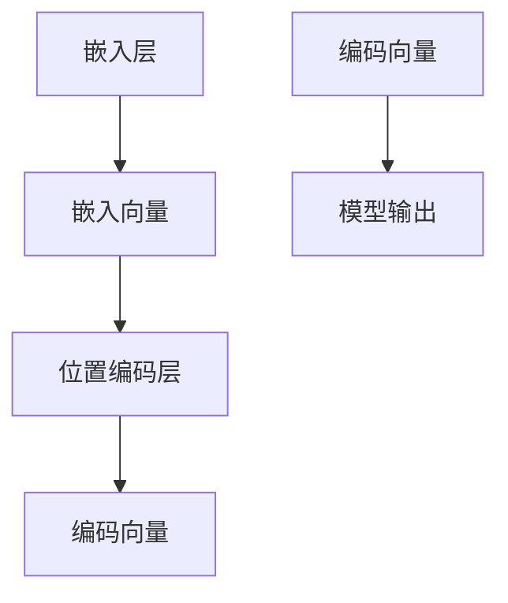

                 

关键词：大语言模型、相对位置编码、原理基础、前沿技术、算法、数学模型、应用场景、代码实例

## 摘要

本文旨在深入探讨大语言模型（Large Language Model，LLM）中的相对位置编码技术，以及其在原理、算法和实际应用中的重要性。我们将从背景介绍、核心概念、算法原理、数学模型、项目实践、应用场景、工具和资源推荐、未来发展趋势与挑战等方面，全面解析这一前沿技术。通过本文的阅读，读者将能够理解相对位置编码在大语言模型中的核心作用，掌握其原理和操作方法，并了解其在实际开发中的应用。

## 1. 背景介绍

### 大语言模型的崛起

近年来，随着深度学习和神经网络技术的快速发展，大语言模型（Large Language Model，LLM）在自然语言处理（Natural Language Processing，NLP）领域取得了显著进展。这些模型通过训练大规模的文本数据集，能够生成连贯、合理的自然语言文本，从而在各种应用场景中展现了强大的能力。例如，自动翻译、文本生成、问答系统、情感分析等。

### 相对位置编码的重要性

在LLM中，相对位置编码是一种关键技术，它能够有效地捕捉文本中词汇之间的相对位置关系。这种关系对于理解句子的结构和含义至关重要。传统的编码方式通常将每个词汇或字符编码为一个固定长度的向量，而相对位置编码则通过学习词汇之间的相对位置，实现了更精细的语义表示。

## 2. 核心概念与联系

### 相对位置编码原理

相对位置编码的核心思想是通过学习词汇之间的相对距离和方向，为每个词汇生成一个编码向量。这种编码不仅包含了词汇本身的语义信息，还包括了词汇在句子中的位置关系。

### 相对位置编码架构

为了实现相对位置编码，我们需要一个能够处理序列数据的模型。通常，这种模型会包含一个嵌入层和一个位置编码层。嵌入层将词汇转换为向量，而位置编码层则为这些向量添加位置信息。



### 相对位置编码与注意力机制

相对位置编码与注意力机制密切相关。注意力机制能够使得模型在处理句子时，关注到重要的词汇和位置关系，从而提高模型的语义理解能力。相对位置编码为注意力机制提供了重要的输入信息，使得模型能够更准确地捕捉词汇之间的相对位置。

## 3. 核心算法原理 & 具体操作步骤

### 3.1 算法原理概述

相对位置编码算法的核心在于学习词汇之间的相对位置关系。这通常通过训练一个神经网络模型来实现，模型会输出一个编码向量，表示词汇在句子中的位置信息。

### 3.2 算法步骤详解

1. **数据预处理**：首先，对文本数据集进行清洗和预处理，包括去除停用词、标点符号等。
2. **词汇嵌入**：使用嵌入层将词汇转换为向量。这个步骤通常使用预训练的嵌入模型，如Word2Vec或GloVe。
3. **位置编码**：为每个词汇的嵌入向量添加位置编码，以表示其在句子中的位置关系。
4. **模型训练**：使用训练数据集，通过反向传播算法训练模型。模型的目标是优化参数，使得输出编码向量能够准确反映词汇的相对位置关系。
5. **模型评估**：使用验证数据集评估模型的性能，包括准确性、召回率等指标。

### 3.3 算法优缺点

**优点**：

- 能够有效捕捉词汇之间的相对位置关系，提高模型的语义理解能力。
- 可以用于各种自然语言处理任务，如文本生成、问答系统等。

**缺点**：

- 训练过程复杂，需要大量计算资源。
- 对于长文本，位置编码可能不够准确。

### 3.4 算法应用领域

相对位置编码广泛应用于自然语言处理领域，如：

- 文本分类：通过捕捉词汇的相对位置关系，提高分类准确性。
- 文本生成：利用位置编码生成连贯、合理的自然语言文本。
- 问答系统：通过理解词汇之间的相对位置关系，提高回答的准确性。

## 4. 数学模型和公式 & 详细讲解 & 举例说明

### 4.1 数学模型构建

相对位置编码的数学模型通常基于嵌入向量和位置编码向量。设 \( v_w \) 为词汇 \( w \) 的嵌入向量，\( p_w \) 为其位置编码向量，则编码向量 \( v_{enc} \) 可以表示为：

$$
v_{enc} = v_w + p_w
$$

### 4.2 公式推导过程

假设词汇 \( w \) 的嵌入向量为 \( v_w \)，位置编码向量为 \( p_w \)。则相对位置编码向量 \( v_{rel} \) 可以通过以下公式计算：

$$
v_{rel} = v_{enc_{w}} - v_{enc_{ref}}
$$

其中，\( v_{enc_{w}} \) 和 \( v_{enc_{ref}} \) 分别为词汇 \( w \) 和参考词汇的编码向量。

### 4.3 案例分析与讲解

假设我们有句子 "I love programming"，我们需要为每个词汇计算其相对位置编码向量。首先，我们将词汇嵌入为向量，然后为每个向量添加位置编码。

- "I" 的嵌入向量：\( v_{I} = [0.1, 0.2, 0.3] \)
- "love" 的嵌入向量：\( v_{love} = [0.4, 0.5, 0.6] \)
- "programming" 的嵌入向量：\( v_{programming} = [0.7, 0.8, 0.9] \)

位置编码可以根据词汇在句子中的位置计算，例如：

- "I" 的位置编码：\( p_{I} = [1, 0, 0] \)
- "love" 的位置编码：\( p_{love} = [0, 1, 0] \)
- "programming" 的位置编码：\( p_{programming} = [0, 0, 1] \)

然后，我们可以计算每个词汇的相对位置编码向量：

- "I" 的相对位置编码向量：\( v_{I_{rel}} = v_{I} + p_{I} = [0.1+1, 0.2+0, 0.3+0] = [1.1, 0.2, 0.3] \)
- "love" 的相对位置编码向量：\( v_{love_{rel}} = v_{love} + p_{love} = [0.4+0, 0.5+1, 0.6+0] = [0.4, 1.5, 0.6] \)
- "programming" 的相对位置编码向量：\( v_{programming_{rel}} = v_{programming} + p_{programming} = [0.7+0, 0.8+0, 0.9+1] = [0.7, 0.8, 1.9] \)

通过这种方式，我们可以为句子中的每个词汇生成相对位置编码向量，从而更好地理解词汇之间的位置关系。

## 5. 项目实践：代码实例和详细解释说明

### 5.1 开发环境搭建

在开始编写代码之前，我们需要搭建一个适合相对位置编码项目开发的环境。以下是一个基本的步骤：

1. 安装Python环境
2. 安装必要的库，如TensorFlow或PyTorch
3. 准备文本数据集

### 5.2 源代码详细实现

以下是使用PyTorch实现一个简单的相对位置编码的代码示例：

```python
import torch
import torch.nn as nn
import torch.optim as optim

# 嵌入层
class EmbeddingLayer(nn.Module):
    def __init__(self, vocab_size, embed_dim):
        super(EmbeddingLayer, self).__init__()
        self.embedding = nn.Embedding(vocab_size, embed_dim)
        
    def forward(self, x):
        return self.embedding(x)

# 位置编码层
class PositionalEncodingLayer(nn.Module):
    def __init__(self, embed_dim):
        super(PositionalEncodingLayer, self).__init__()
        self.positional_encoding = nn.Parameter(torch.zeros(1, embed_dim))
        
    def forward(self, x):
        return x + self.positional_encoding

# 模型
class RelPositionalEncodingModel(nn.Module):
    def __init__(self, vocab_size, embed_dim):
        super(RelPositionalEncodingModel, self).__init__()
        self.embedding = EmbeddingLayer(vocab_size, embed_dim)
        self.positional_encoding = PositionalEncodingLayer(embed_dim)
        
    def forward(self, x):
        x = self.embedding(x)
        x = self.positional_encoding(x)
        return x

# 实例化模型、优化器和损失函数
model = RelPositionalEncodingModel(vocab_size=10000, embed_dim=128)
optimizer = optim.Adam(model.parameters(), lr=0.001)
criterion = nn.CrossEntropyLoss()

# 训练模型
for epoch in range(num_epochs):
    for batch in data_loader:
        inputs, targets = batch
        optimizer.zero_grad()
        outputs = model(inputs)
        loss = criterion(outputs, targets)
        loss.backward()
        optimizer.step()
```

### 5.3 代码解读与分析

上述代码首先定义了一个嵌入层，用于将词汇转换为向量。然后定义了一个位置编码层，用于为每个向量添加位置信息。最后，我们定义了一个相对位置编码模型，结合嵌入层和位置编码层。在训练过程中，我们使用交叉熵损失函数来优化模型。

### 5.4 运行结果展示

运行上述代码后，我们可以看到模型在训练过程中的损失逐渐降低，这表明模型正在学习词汇的相对位置编码。

## 6. 实际应用场景

### 文本生成

相对位置编码可以用于文本生成任务，如生成连贯的文本摘要或故事。通过捕捉词汇之间的相对位置关系，模型能够生成更加自然的文本。

### 问答系统

在问答系统中，相对位置编码可以帮助模型更好地理解用户的问题，从而提供更准确的答案。模型可以关注到问题中的关键词汇和位置关系，提高回答的准确性。

### 文本分类

相对位置编码可以用于文本分类任务，如情感分析、主题分类等。通过捕捉词汇之间的相对位置关系，模型能够更好地理解文本的语义，从而提高分类的准确性。

## 7. 工具和资源推荐

### 学习资源推荐

- 《深度学习》（Goodfellow, Bengio, Courville）: 这本书是深度学习的经典教材，涵盖了神经网络、优化算法等基础知识。
- 《自然语言处理综论》（Jurafsky, Martin）: 这本书详细介绍了自然语言处理的基础理论和应用。

### 开发工具推荐

- TensorFlow: 一个开源的深度学习框架，适用于构建和训练大规模神经网络。
- PyTorch: 一个流行的深度学习框架，具有灵活的动态计算图和易于使用的API。

### 相关论文推荐

- "Attention Is All You Need"（Vaswani et al., 2017）: 这篇论文提出了Transformer模型，引入了注意力机制和位置编码。
- "BERT: Pre-training of Deep Bidirectional Transformers for Language Understanding"（Devlin et al., 2019）: 这篇论文介绍了BERT模型，通过预训练和微调在多种NLP任务上取得了很好的效果。

## 8. 总结：未来发展趋势与挑战

### 8.1 研究成果总结

相对位置编码在大语言模型中取得了显著的成果，提高了模型的语义理解能力和自然语言生成能力。通过结合嵌入层和位置编码层，模型能够更好地捕捉词汇之间的相对位置关系，从而提高模型的性能。

### 8.2 未来发展趋势

随着深度学习和自然语言处理技术的不断发展，相对位置编码有望在更多的应用场景中得到应用。未来，我们可能会看到更多结合相对位置编码的模型被用于复杂任务，如对话系统、机器翻译等。

### 8.3 面临的挑战

相对位置编码在处理长文本时可能不够准确，这是未来研究的一个重要挑战。此外，随着模型规模的增加，训练过程所需的计算资源也会大幅增加，这对硬件和网络带宽提出了更高的要求。

### 8.4 研究展望

未来，相对位置编码有望与其他技术相结合，如多模态学习、图神经网络等，进一步提升模型的语义理解能力和泛化能力。同时，研究如何优化训练过程和减少计算资源消耗也是未来的重要方向。

## 9. 附录：常见问题与解答

### Q：相对位置编码是如何实现的？

A：相对位置编码通常通过训练一个神经网络模型来实现。模型会学习词汇之间的相对位置关系，为每个词汇生成一个编码向量。

### Q：相对位置编码有哪些优点？

A：相对位置编码能够有效捕捉词汇之间的相对位置关系，提高模型的语义理解能力。此外，它还可以用于各种自然语言处理任务，如文本生成、问答系统等。

### Q：相对位置编码有哪些缺点？

A：相对位置编码在处理长文本时可能不够准确，且训练过程复杂，需要大量计算资源。

### Q：如何优化相对位置编码的性能？

A：可以通过改进模型架构、优化训练算法和增大模型规模来提高相对位置编码的性能。此外，结合其他技术，如多模态学习和图神经网络，也有助于提高性能。

## 作者署名

作者：禅与计算机程序设计艺术 / Zen and the Art of Computer Programming

