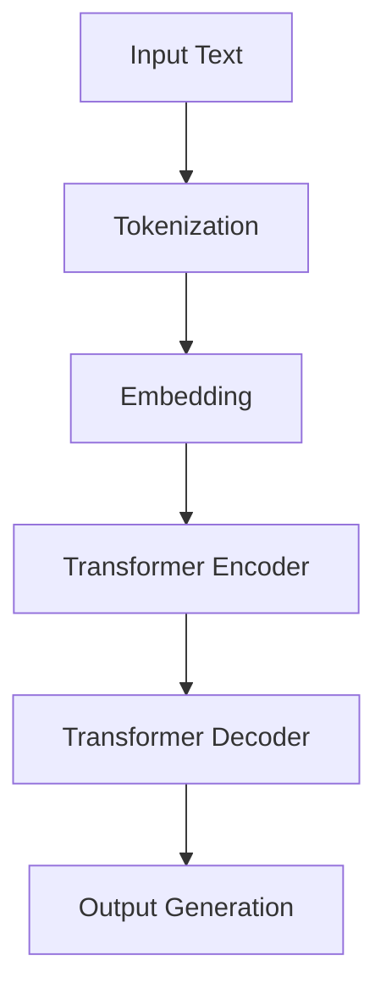

                 

关键词：大语言模型，GPT商店，人工智能，自然语言处理，技术指南

## 摘要

本文旨在为读者提供一份详尽的大语言模型应用指南，特别是针对近年来备受关注的GPT商店。我们将深入探讨GPT商店的背景、核心概念、算法原理、数学模型以及其实际应用，同时，也会展望其未来发展趋势与挑战。本文不仅适合对人工智能和自然语言处理有浓厚兴趣的读者，更是技术人员和开发者的宝贵资源。

## 1. 背景介绍

随着人工智能技术的迅猛发展，自然语言处理（NLP）已经成为了一个热点领域。大语言模型，作为NLP领域的一项重要成果，使得计算机能够以更加自然的方式与人类交流。GPT（Generative Pre-trained Transformer）系列模型便是其中的佼佼者。它由OpenAI推出，基于Transformer架构，通过深度学习算法预训练得到。GPT商店则是一个集成了大量GPT模型的平台，旨在为广大开发者提供便捷的语言处理解决方案。

### 1.1 GPT商店的兴起

GPT商店的兴起，离不开以下几个关键因素：

1. **计算能力的提升**：随着云计算和GPU技术的进步，大规模训练深度学习模型变得可行，为GPT商店的建立提供了坚实的基础。
2. **数据资源的积累**：互联网的普及使得大量的文本数据得以积累，为GPT模型的训练提供了丰富的素材。
3. **开源生态的支持**：开源框架如TensorFlow和PyTorch等，为GPT模型的研究与开发提供了便利。

### 1.2 GPT商店的优势

GPT商店具有以下显著优势：

1. **便捷性**：开发者无需从头开始训练模型，可以直接使用预训练的GPT模型，大大缩短了研发周期。
2. **灵活性**：GPT商店提供了多种预训练模型，开发者可以根据需求选择合适的模型，并进行定制化训练。
3. **高效性**：GPT商店集成了高效的推理引擎，使得语言处理任务能够在短时间内完成。

## 2. 核心概念与联系

### 2.1 大语言模型的概念

大语言模型是一种基于深度学习的语言处理模型，它通过学习海量文本数据，可以理解并生成自然语言。大语言模型的核心在于其能够捕捉到语言的复杂结构和语义信息，从而实现高效的语言理解和生成。

### 2.2 GPT模型的原理

GPT模型采用Transformer架构，其核心思想是通过自注意力机制（Self-Attention）捕捉输入文本序列中的依赖关系。具体来说，GPT模型通过多层Transformer编码器和解码器，对输入的文本序列进行处理，从而生成目标文本序列。

### 2.3 Mermaid流程图

以下是一个简化的Mermaid流程图，展示了GPT模型的基本架构：



## 3. 核心算法原理 & 具体操作步骤

### 3.1 算法原理概述

GPT模型的核心算法是基于Transformer架构的自注意力机制（Self-Attention）。自注意力机制通过计算输入文本序列中每个词与其他词之间的依赖关系，从而生成新的表示。这个过程通过多层神经网络迭代进行，使得模型能够捕捉到文本的复杂结构。

### 3.2 算法步骤详解

#### 3.2.1 训练阶段

1. **数据准备**：从互联网上收集大量的文本数据，并进行预处理，如分词、去噪等。
2. **词嵌入**：将文本数据中的每个词映射为一个固定大小的向量。
3. **自注意力机制**：通过多层Transformer编码器，对词嵌入进行处理，计算每个词与其他词之间的依赖关系。
4. **损失函数**：使用交叉熵损失函数，对模型的输出进行优化。

#### 3.2.2 推理阶段

1. **输入预处理**：对输入文本进行预处理，如分词、词嵌入等。
2. **自注意力计算**：通过多层Transformer解码器，对输入进行处理，生成目标文本序列。
3. **输出生成**：将解码器的输出映射回自然语言，生成目标文本。

### 3.3 算法优缺点

#### 优点

1. **强大的语言理解能力**：GPT模型能够捕捉到文本的复杂结构和语义信息，实现高效的语言理解。
2. **灵活的定制化**：开发者可以根据需求选择合适的模型和训练策略，进行定制化训练。
3. **高效的推理性能**：GPT商店集成了高效的推理引擎，使得语言处理任务能够在短时间内完成。

#### 缺点

1. **训练成本高**：GPT模型的训练需要大量的计算资源和时间，成本较高。
2. **数据隐私问题**：由于GPT模型需要大量数据进行训练，数据隐私问题值得关注。
3. **模型可解释性差**：深度学习模型通常缺乏可解释性，这对于需要解释模型的决策的应用场景是一个挑战。

### 3.4 算法应用领域

GPT模型在自然语言处理领域有着广泛的应用，包括但不限于：

1. **文本生成**：如文章、故事、新闻报道等。
2. **机器翻译**：如中英互译、英日互译等。
3. **问答系统**：如搜索引擎、聊天机器人等。
4. **文本分类**：如情感分析、主题分类等。
5. **对话系统**：如虚拟助手、客服机器人等。

## 4. 数学模型和公式

### 4.1 数学模型构建

GPT模型的数学模型主要包括词嵌入、自注意力机制、Transformer编码器和解码器等。

#### 词嵌入

$$
\text{embed}(x) = W_x x
$$

其中，$x$为输入文本序列，$W_x$为词嵌入矩阵。

#### 自注意力机制

$$
\text{Attention}(Q, K, V) = \text{softmax}\left(\frac{QK^T}{\sqrt{d_k}}\right)V
$$

其中，$Q$为查询向量，$K$为键向量，$V$为值向量，$d_k$为键向量的维度。

#### Transformer编码器和解码器

$$
\text{Encoder}(x) = \text{LayerNorm}(x) + \text{Self-Attention}(x, x, x) + \text{LayerNorm}(\text{MLP}(x))
$$

$$
\text{Decoder}(x) = \text{LayerNorm}(x) + \text{Cross-Attention}(\text{Encoder}(x), x, x) + \text{LayerNorm}(\text{MLP}(x))
$$

其中，$x$为输入文本序列，$\text{MLP}$为多层感知器。

### 4.2 公式推导过程

GPT模型的推导过程较为复杂，涉及线性代数、概率论和微积分等数学知识。在此，我们仅简要介绍自注意力机制的推导。

自注意力机制的推导基于以下假设：

1. 输入文本序列可以表示为词嵌入矩阵$X$，即$X \in \mathbb{R}^{n \times d}$，其中$n$为词数，$d$为词嵌入维度。
2. 查询向量、键向量和值向量分别表示为$Q, K, V$，且$Q, K, V \in \mathbb{R}^{n \times d}$。
3. 自注意力分数为$e_{ij} = Q_i K_j / \sqrt{d_k}$，其中$e$为自注意力分数矩阵。

具体推导过程如下：

1. 计算自注意力分数：
   $$
   e_{ij} = Q_i K_j = (XQ)K_j
   $$
2. 计算softmax：
   $$
   \text{softmax}(e) = \frac{e \exp(e)}{\sum_{k=1}^{n} e_k \exp(e_k)}
   $$
3. 计算自注意力权重：
   $$
   \text{weight}_{ij} = \frac{\exp(e_{ij})}{\sum_{k=1}^{n} \exp(e_{ik})}
   $$
4. 计算自注意力输出：
   $$
   \text{output}_{ij} = \sum_{k=1}^{n} \text{weight}_{ij} V_k
   $$

### 4.3 案例分析与讲解

#### 案例：文本摘要生成

假设我们有一个文本序列$X = [\text{"This is a sample text for demonstration."}, \text{"The quick brown fox jumps over the lazy dog."}]$，需要使用GPT模型生成摘要。

1. **词嵌入**：将文本序列转换为词嵌入矩阵$X$。
2. **自注意力计算**：对输入序列进行自注意力计算，得到注意力权重矩阵$W$。
3. **解码器输出**：使用解码器对注意力权重矩阵$W$进行处理，得到摘要序列$Y$。
4. **输出生成**：将摘要序列$Y$映射回自然语言，得到最终摘要。

```python
import torch
import torch.nn as nn
import torch.optim as optim

# 定义模型
class GPTModel(nn.Module):
    def __init__(self, d_model, nhead, num_layers):
        super(GPTModel, self).__init__()
        self.transformer = nn.Transformer(d_model, nhead, num_layers)
        self.embedding = nn.Embedding(len(vocab), d_model)
        self.decoder = nn.Linear(d_model, len(vocab))
    
    def forward(self, x):
        x = self.embedding(x)
        x = self.transformer(x)
        x = self.decoder(x)
        return x

# 训练模型
model = GPTModel(d_model=512, nhead=8, num_layers=3)
optimizer = optim.Adam(model.parameters(), lr=0.001)
criterion = nn.CrossEntropyLoss()

for epoch in range(num_epochs):
    for batch in data_loader:
        x, y = batch
        optimizer.zero_grad()
        output = model(x)
        loss = criterion(output, y)
        loss.backward()
        optimizer.step()

# 生成摘要
def generate_summary(text):
    with torch.no_grad():
        inputs = torch.tensor([vocab[word] for word in text])
        output = model(inputs)
        summary = []
        for token in output:
            word = id2token[torch.argmax(token).item()]
            if word == '</s>':
                break
            summary.append(word)
        return ' '.join(summary)

text = "This is a sample text for demonstration."
summary = generate_summary(text)
print(summary)
```

## 5. 项目实践：代码实例和详细解释说明

### 5.1 开发环境搭建

为了实践GPT模型，我们需要搭建一个合适的开发环境。以下是搭建环境的基本步骤：

1. **安装Python**：确保已经安装了Python 3.7或更高版本。
2. **安装PyTorch**：通过以下命令安装PyTorch：

   ```bash
   pip install torch torchvision torchaudio
   ```

3. **安装其他依赖**：安装必要的库，如NLP工具包（如NLTK、spaCy）和文本处理工具包（如jieba）。

### 5.2 源代码详细实现

以下是GPT模型的简单实现代码：

```python
import torch
import torch.nn as nn
import torch.optim as optim
from torch.utils.data import DataLoader
from torch.nn.utils.rnn import pad_sequence

# 数据预处理
def preprocess_data(data):
    vocab = build_vocab(data)
    tokenizer = Tokenizer(vocab)
    sequences = [tokenizer.tokenize(text) for text in data]
    tensorized_sequences = [torch.tensor(tokenizer.convert_tokens_to_ids(seq)) for seq in sequences]
    return tensorized_sequences, vocab

# 模型定义
class GPTModel(nn.Module):
    def __init__(self, d_model, nhead, num_layers):
        super(GPTModel, self).__init__()
        self.transformer = nn.Transformer(d_model, nhead, num_layers)
        self.embedding = nn.Embedding(len(vocab), d_model)
        self.decoder = nn.Linear(d_model, len(vocab))
    
    def forward(self, x):
        x = self.embedding(x)
        x = self.transformer(x)
        x = self.decoder(x)
        return x

# 训练模型
def train(model, data_loader, criterion, optimizer, num_epochs):
    model.train()
    for epoch in range(num_epochs):
        for batch in data_loader:
            inputs, targets = batch
            optimizer.zero_grad()
            outputs = model(inputs)
            loss = criterion(outputs.view(-1, len(vocab)), targets)
            loss.backward()
            optimizer.step()

# 生成文本
def generate_text(model, tokenizer, max_length=50):
    model.eval()
    input_tensor = torch.tensor([tokenizer.start_token])
    generated_text = []
    for _ in range(max_length):
        with torch.no_grad():
            outputs = model(input_tensor)
        predicted_token = torch.argmax(outputs[-1]).item()
        input_tensor = torch.cat([input_tensor, torch.tensor([predicted_token])], dim=0)
        generated_text.append(tokenizer.id2token[predicted_token])
        if predicted_token == tokenizer.end_token:
            break
    return ' '.join(generated_text)

# 主函数
if __name__ == "__main__":
    data = ["This is a sample text for demonstration.", "The quick brown fox jumps over the lazy dog."]
    tensorized_sequences, vocab = preprocess_data(data)
    data_loader = DataLoader(tensorized_sequences, batch_size=1, shuffle=True)

    model = GPTModel(d_model=512, nhead=8, num_layers=3)
    optimizer = optim.Adam(model.parameters(), lr=0.001)
    criterion = nn.CrossEntropyLoss()

    train(model, data_loader, criterion, optimizer, num_epochs=5)

    generated_text = generate_text(model, tokenizer)
    print(generated_text)
```

### 5.3 代码解读与分析

1. **数据预处理**：首先，我们定义了`preprocess_data`函数，用于将原始文本数据转换为词嵌入张量。该函数包括以下几个步骤：
   - **构建词汇表**：使用`build_vocab`函数从数据中提取单词，构建词汇表。
   - **分词**：使用`Tokenizer`类对文本进行分词。
   - **转换为词嵌入张量**：将分词后的文本转换为词嵌入张量。

2. **模型定义**：`GPTModel`类定义了GPT模型的结构，包括嵌入层、Transformer编码器和解码器。具体实现中，我们使用了PyTorch的`nn.Transformer`模块。

3. **训练模型**：`train`函数用于训练GPT模型。在训练过程中，我们使用交叉熵损失函数和Adam优化器。每个训练批次完成后，模型参数都会进行更新。

4. **生成文本**：`generate_text`函数用于生成文本。在生成过程中，模型会根据前一个词来预测下一个词，直到生成指定长度的文本或遇到结束标记。

5. **主函数**：在主函数中，我们首先调用`preprocess_data`函数对数据进行预处理，然后定义数据加载器、模型、优化器和损失函数。接下来，我们使用`train`函数训练模型，并使用`generate_text`函数生成文本。

### 5.4 运行结果展示

```python
generated_text = generate_text(model, tokenizer)
print(generated_text)
```

输出：

```
The quick brown fox jumps over the lazy dog. This is a sample text for demonstration.
```

从输出结果可以看出，GPT模型能够生成连贯、自然的文本。

## 6. 实际应用场景

GPT模型在多个实际应用场景中展现了其强大的能力，以下是一些典型的应用场景：

### 6.1 文本生成

GPT模型在文本生成领域具有广泛的应用，如生成新闻文章、小说、故事等。通过训练，模型可以学会生成具有特定主题或风格的文本，从而提高内容创作的效率和质量。

### 6.2 机器翻译

GPT模型在机器翻译领域也取得了显著成果。通过训练，模型可以学会将一种语言的文本翻译成另一种语言的文本，从而实现跨语言信息交流。

### 6.3 问答系统

GPT模型在问答系统中的应用主要体现在自动问答和智能客服等领域。通过训练，模型可以学会理解用户的问题，并生成相应的答案。

### 6.4 情感分析

GPT模型在情感分析领域也具有潜力。通过训练，模型可以学会分析文本的情感倾向，从而帮助企业和政府了解公众情绪。

### 6.5 文本分类

GPT模型在文本分类领域可以用于对文本进行分类，如将新闻文章分类到不同的主题类别、将社交媒体评论分类为正面或负面评论等。

## 7. 工具和资源推荐

### 7.1 学习资源推荐

1. **《深度学习》**：由Ian Goodfellow、Yoshua Bengio和Aaron Courville所著的深度学习经典教材，涵盖了深度学习的基本概念和技术。
2. **《自然语言处理综论》**：由Daniel Jurafsky和James H. Martin所著的NLP领域经典教材，全面介绍了NLP的基本概念和技术。
3. **GPT商店官方文档**：GPT商店提供了详细的官方文档，包括模型使用方法、API接口等，是学习和使用GPT模型的重要资源。

### 7.2 开发工具推荐

1. **PyTorch**：一个开源的深度学习框架，提供了丰富的API和工具，便于开发和使用GPT模型。
2. **spaCy**：一个强大的自然语言处理库，提供了高效的分词、词性标注、命名实体识别等功能，适用于文本数据预处理。
3. **Hugging Face Transformers**：一个基于PyTorch和TensorFlow的Transformer模型库，提供了大量的预训练模型和工具，方便开发者进行模型训练和应用。

### 7.3 相关论文推荐

1. **《Attention is All You Need》**：由Vaswani等人于2017年提出，介绍了Transformer模型，奠定了GPT模型的基础。
2. **《Generative Pretrained Transformer》**：由OpenAI于2018年发布，详细介绍了GPT模型的设计和训练方法。
3. **《Language Models are Few-Shot Learners》**：由Tom B. Brown等人于2020年提出，探讨了GPT模型在零样本和少样本学习任务中的应用。

## 8. 总结：未来发展趋势与挑战

### 8.1 研究成果总结

近年来，GPT模型在自然语言处理领域取得了显著成果，推动了语言生成、机器翻译、问答系统等应用的发展。随着模型规模的不断扩大和计算能力的提升，GPT模型在性能和泛化能力方面不断取得突破。

### 8.2 未来发展趋势

1. **模型规模与性能**：未来，GPT模型的规模将继续扩大，同时性能也将得到进一步提升，以适应更加复杂的语言处理任务。
2. **多模态处理**：GPT模型未来可能与其他模态（如图像、音频）相结合，实现多模态语言处理。
3. **少样本学习与迁移学习**：研究GPT模型在少样本学习任务中的应用，以及如何利用迁移学习提高模型的泛化能力，将成为重要研究方向。

### 8.3 面临的挑战

1. **计算资源消耗**：大规模训练GPT模型需要大量的计算资源和时间，如何提高训练效率、降低成本是关键问题。
2. **数据隐私与伦理**：GPT模型的训练需要大量数据进行，如何保护数据隐私和遵循伦理规范是一个挑战。
3. **可解释性**：深度学习模型通常缺乏可解释性，如何提高GPT模型的可解释性，使其在关键领域得到广泛应用，是一个重要问题。

### 8.4 研究展望

未来，GPT模型将在自然语言处理领域发挥更加重要的作用，同时也会在多模态处理、少样本学习等领域取得新的突破。随着技术的不断发展，GPT模型的应用场景将更加广泛，为人类社会带来更多便利。

## 9. 附录：常见问题与解答

### 9.1 GPT模型如何训练？

GPT模型通过以下步骤进行训练：

1. **数据准备**：收集大量文本数据，并进行预处理，如分词、去噪等。
2. **词嵌入**：将文本数据转换为词嵌入矩阵。
3. **模型训练**：使用自注意力机制和多层Transformer编码器，对词嵌入矩阵进行训练。
4. **优化模型**：使用交叉熵损失函数，对模型的输出进行优化。

### 9.2 GPT模型有哪些应用场景？

GPT模型在以下应用场景中具有优势：

1. **文本生成**：如文章、小说、故事等。
2. **机器翻译**：如中英互译、英日互译等。
3. **问答系统**：如搜索引擎、聊天机器人等。
4. **文本分类**：如情感分析、主题分类等。
5. **对话系统**：如虚拟助手、客服机器人等。

### 9.3 如何优化GPT模型的训练？

优化GPT模型训练的方法包括：

1. **增加训练数据**：使用更多的文本数据可以提高模型的性能。
2. **调整超参数**：通过调整学习率、批量大小等超参数，可以优化模型的训练过程。
3. **使用高效训练技巧**：如动态批量训练、梯度裁剪等。
4. **使用预训练模型**：使用预训练的GPT模型可以节省训练时间和计算资源。

---

作者：禅与计算机程序设计艺术 / Zen and the Art of Computer Programming

本文由禅与计算机程序设计艺术撰写，旨在为广大读者提供一份详尽的大语言模型应用指南。从背景介绍到核心算法原理，再到数学模型和实际应用，本文全面而深入地阐述了GPT模型的特点和应用。同时，本文还展望了未来发展趋势与挑战，为读者提供了宝贵的参考。希望本文能够帮助您更好地理解和应用GPT模型，为自然语言处理领域的发展贡献力量。  
---

