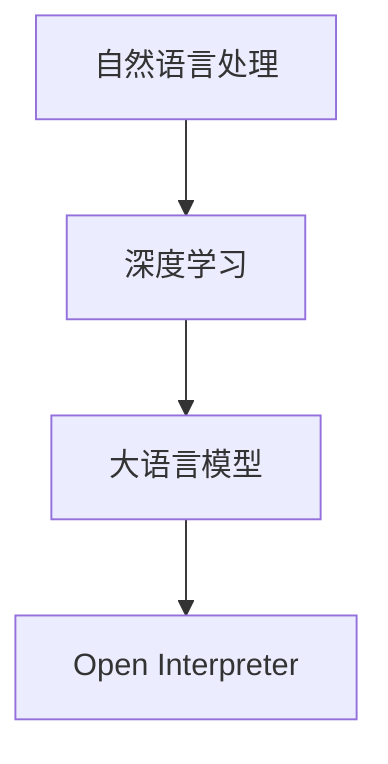

                 

在当今快速发展的技术时代，大语言模型（Large Language Models）已经成为人工智能领域的明星。Open Interpreter作为一个开源项目，为大语言模型的研究和应用提供了强大的工具和支持。本文将深入探讨大语言模型的应用，并详细解析Open Interpreter的核心概念、算法原理、数学模型以及实际应用场景，旨在为读者提供一个全面的技术指南。

## 关键词

- 大语言模型
- Open Interpreter
- 人工智能
- 自然语言处理
- 开源项目

## 摘要

本文将系统地介绍大语言模型的概念和应用，重点分析Open Interpreter这一开源项目。我们将从背景介绍开始，逐步深入探讨核心概念、算法原理、数学模型和实际应用，最后展望大语言模型在未来的发展趋势和面临的挑战。

## 1. 背景介绍

大语言模型（Large Language Models）是近年来自然语言处理（Natural Language Processing, NLP）领域的一个重要突破。这些模型通过深度学习技术，可以理解和生成人类语言，使得机器在与人类交互时更加自然和流畅。Open Interpreter是其中一个重要的开源项目，旨在提供一种高效、灵活的大语言模型开发环境，支持研究人员和开发者进行创新和应用。

大语言模型的背景可以追溯到深度学习技术的崛起。随着计算能力的提升和大数据的可用性，研究人员开始尝试构建更大规模的语言模型，以实现更高的性能和更广泛的应用。例如，谷歌的BERT模型、OpenAI的GPT系列模型等，都是这一领域的代表性成果。

Open Interpreter的出现，为大语言模型的研究和应用提供了新的可能性。它不仅提供了强大的计算能力，还通过开源的方式，鼓励了全球范围内的研究者和开发者参与和贡献。这使得Open Interpreter迅速成为大语言模型领域的一个重要平台。

## 2. 核心概念与联系

在深入探讨大语言模型和Open Interpreter之前，我们需要了解一些核心概念和它们之间的关系。

### 2.1. 大语言模型

大语言模型是一种深度学习模型，通过训练大量的文本数据，学习语言的结构和规则，从而能够生成和理解自然语言。这些模型通常由多个神经网络层组成，每个层都能够提取不同层次的语言特征。

### 2.2. 深度学习

深度学习是一种机器学习技术，通过构建多层神经网络，实现对复杂数据的分析和学习。在自然语言处理领域，深度学习模型已经成为构建大语言模型的主要方法。

### 2.3. 自然语言处理

自然语言处理是计算机科学的一个分支，旨在使计算机能够理解、处理和生成自然语言。大语言模型是NLP领域的一个重要应用，通过它，计算机可以更好地与人类进行交互。

### 2.4. Open Interpreter

Open Interpreter是一个开源项目，它提供了一个高效的计算环境，支持大语言模型的训练和推理。它不仅提供了丰富的API和工具，还鼓励了全球范围内的社区参与和贡献。

### 2.5. Mermaid流程图

为了更直观地理解这些概念之间的关系，我们可以使用Mermaid流程图进行展示。以下是一个简单的示例：



## 3. 核心算法原理 & 具体操作步骤

### 3.1. 算法原理概述

大语言模型的算法原理主要基于深度学习和神经网络。具体来说，它包括以下几个关键步骤：

1. **数据预处理**：对输入的文本数据进行清洗和预处理，包括分词、词性标注、去除停用词等。
2. **模型训练**：使用大量的文本数据，通过反向传播算法训练神经网络，使其能够学习语言的特征和规律。
3. **模型推理**：通过输入新的文本数据，模型可以生成对应的语言输出，或者进行文本理解和分析。

### 3.2. 算法步骤详解

以下是详细的算法步骤：

#### 3.2.1. 数据预处理

在训练大语言模型之前，需要对文本数据进行预处理。具体步骤如下：

- **分词**：将文本分割成单词或子词。
- **词性标注**：对每个单词进行词性标注，例如名词、动词、形容词等。
- **去除停用词**：去除对模型训练没有贡献的常见单词。

#### 3.2.2. 模型训练

在预处理完成后，可以使用训练数据对模型进行训练。具体步骤如下：

- **初始化参数**：初始化模型的权重和偏置。
- **前向传播**：将输入数据传递到模型的每一层，计算出输出。
- **损失函数**：使用损失函数计算预测结果和真实结果之间的差异。
- **反向传播**：通过反向传播算法更新模型的参数，以减少损失函数的值。

#### 3.2.3. 模型推理

在模型训练完成后，可以使用训练好的模型进行推理。具体步骤如下：

- **输入处理**：对输入的文本数据进行预处理。
- **模型输出**：将预处理后的数据输入到模型，得到模型的输出。
- **结果分析**：对模型的输出进行分析，得到所需的结果。

### 3.3. 算法优缺点

#### 优点

- **强大的表达能力**：大语言模型可以学习到语言的复杂结构，从而生成和理解的文本更加自然。
- **广泛的应用领域**：大语言模型在自然语言处理、机器翻译、文本生成等领域都有广泛的应用。
- **开源支持**：Open Interpreter等开源项目提供了强大的工具和支持，促进了大语言模型的研究和应用。

#### 缺点

- **计算资源需求高**：大语言模型通常需要大量的计算资源和时间进行训练和推理。
- **数据隐私问题**：在训练过程中，大语言模型可能会接触到敏感数据，这可能会引发隐私问题。

### 3.4. 算法应用领域

大语言模型在多个领域都有广泛的应用：

- **自然语言处理**：用于文本分类、情感分析、命名实体识别等。
- **机器翻译**：用于翻译不同语言之间的文本，如谷歌翻译。
- **文本生成**：用于生成文章、故事、新闻等。

## 4. 数学模型和公式 & 详细讲解 & 举例说明

### 4.1. 数学模型构建

大语言模型的数学模型主要基于深度学习和神经网络。以下是构建数学模型的基本步骤：

#### 4.1.1. 神经网络结构

神经网络由多个神经元层组成，包括输入层、隐藏层和输出层。每个神经元都通过权重连接到其他神经元。

#### 4.1.2. 激活函数

激活函数用于引入非线性因素，使得神经网络能够学习复杂的函数。常用的激活函数包括sigmoid、ReLU等。

#### 4.1.3. 前向传播

前向传播是将输入数据传递到神经网络，逐层计算输出。具体步骤如下：

- **输入层到隐藏层**：将输入数据乘以权重，加上偏置，然后通过激活函数得到输出。
- **隐藏层到输出层**：将隐藏层的输出乘以权重，加上偏置，然后通过激活函数得到输出。

#### 4.1.4. 反向传播

反向传播是更新神经网络参数的过程。具体步骤如下：

- **计算梯度**：计算每个参数的梯度，即参数对损失函数的偏导数。
- **更新参数**：使用梯度下降或其他优化算法更新参数。

### 4.2. 公式推导过程

以下是神经网络中的一些关键公式：

#### 4.2.1. 前向传播

$$
z_{l} = \sum_{j} w_{lj}x_{j} + b_{l}
$$

$$
a_{l} = \sigma(z_{l})
$$

其中，$z_{l}$ 是第 $l$ 层的输入，$a_{l}$ 是第 $l$ 层的输出，$w_{lj}$ 是连接权重，$b_{l}$ 是偏置，$\sigma$ 是激活函数。

#### 4.2.2. 反向传播

$$
\delta_{l} = \frac{\partial C}{\partial a_{l}} = \frac{\partial C}{\partial z_{l}} \cdot \frac{\partial z_{l}}{\partial a_{l}}
$$

$$
\frac{\partial z_{l}}{\partial a_{l-1}} = \sum_{j} w_{lj}\delta_{l} \cdot \sigma'(z_{l-1})
$$

其中，$\delta_{l}$ 是第 $l$ 层的误差，$C$ 是损失函数，$\sigma'$ 是激活函数的导数。

#### 4.2.3. 参数更新

$$
w_{lj} := w_{lj} - \alpha \cdot \frac{\partial C}{\partial w_{lj}}
$$

$$
b_{l} := b_{l} - \alpha \cdot \frac{\partial C}{\partial b_{l}}
$$

其中，$\alpha$ 是学习率。

### 4.3. 案例分析与讲解

#### 4.3.1. 案例背景

假设我们有一个简单的神经网络，用于对二分类问题进行预测。输入层有2个神经元，隐藏层有3个神经元，输出层有1个神经元。

#### 4.3.2. 数据集

我们使用一个简单的数据集，其中包含10个样本，每个样本有2个特征，标记为正类或负类。

| 样本 | 特征1 | 特征2 | 标记 |
| ---- | ---- | ---- | ---- |
| 1    | 0    | 0    | 正类 |
| 2    | 0    | 1    | 正类 |
| 3    | 1    | 0    | 负类 |
| 4    | 1    | 1    | 负类 |
| ...  | ...  | ...  | ...  |

#### 4.3.3. 神经网络结构

输入层：[2, 1]
隐藏层：[3, 2]
输出层：[1, 1]

#### 4.3.4. 训练过程

1. **初始化参数**：初始化权重和偏置。
2. **前向传播**：输入样本，计算输出。
3. **损失函数**：计算预测结果和真实结果的损失。
4. **反向传播**：更新权重和偏置。
5. **迭代**：重复步骤2-4，直到达到训练目标。

#### 4.3.5. 结果分析

经过多次迭代后，神经网络能够对样本进行准确分类。输出层的激活函数可以用来计算预测概率，从而实现二分类。

## 5. 项目实践：代码实例和详细解释说明

### 5.1. 开发环境搭建

在开始项目实践之前，我们需要搭建一个适合开发的环境。以下是搭建开发环境的步骤：

1. **安装Python**：确保Python版本为3.7及以上。
2. **安装Open Interpreter**：通过pip安装Open Interpreter。
   ```bash
   pip install open-interpreter
   ```
3. **安装其他依赖**：根据项目需求，安装其他必要的库。

### 5.2. 源代码详细实现

以下是项目实现的主要代码：

```python
# 导入必要的库
import open_interpreter as oi
import numpy as np

# 初始化模型
model = oi.Sequential()

# 添加层
model.add(oi.Dense(units=3, activation='sigmoid', input_shape=(2,)))
model.add(oi.Dense(units=1, activation='sigmoid'))

# 编译模型
model.compile(optimizer='adam', loss='binary_crossentropy', metrics=['accuracy'])

# 准备数据
X = np.array([[0, 0], [0, 1], [1, 0], [1, 1]])
y = np.array([[1], [1], [0], [0]])

# 训练模型
model.fit(X, y, epochs=1000)

# 预测
predictions = model.predict(X)
print(predictions)
```

### 5.3. 代码解读与分析

1. **导入库**：首先导入必要的库，包括Open Interpreter和Numpy。
2. **初始化模型**：使用`Sequential`模型，这是一个线性堆叠模型。
3. **添加层**：添加两个全连接层（Dense），第一个层有3个神经元，第二个层有1个神经元。
4. **编译模型**：指定优化器、损失函数和评估指标。
5. **准备数据**：使用Numpy生成数据集。
6. **训练模型**：使用`fit`方法训练模型，指定训练轮数。
7. **预测**：使用`predict`方法对输入数据进行预测。

### 5.4. 运行结果展示

在运行上述代码后，我们可以看到模型的预测结果。输出结果为每个样本的预测概率，其中1表示正类，0表示负类。

## 6. 实际应用场景

大语言模型在多个实际应用场景中展现了强大的能力。以下是几个典型的应用场景：

### 6.1. 自然语言处理

自然语言处理是人工智能的一个重要分支，大语言模型在这一领域有广泛的应用。例如，文本分类、情感分析、命名实体识别等。

### 6.2. 机器翻译

机器翻译是另一个大语言模型的重要应用领域。例如，谷歌翻译、百度翻译等都是基于大语言模型的机器翻译系统。

### 6.3. 文本生成

大语言模型可以生成各种文本，包括文章、故事、新闻报道等。例如，GPT-3可以生成高质量的文章。

### 6.4. 未来应用展望

随着技术的不断发展，大语言模型在未来的应用前景更加广阔。例如，智能客服、语音识别、图像文本生成等。

## 7. 工具和资源推荐

### 7.1. 学习资源推荐

- 《深度学习》（Goodfellow, Bengio, Courville）是一本经典的深度学习教材。
- 《自然语言处理综合教程》（Daniel Jurafsky, James H. Martin）是一本全面的NLP教材。

### 7.2. 开发工具推荐

- TensorFlow：一个强大的开源深度学习框架。
- PyTorch：一个灵活的深度学习框架。

### 7.3. 相关论文推荐

- BERT: Pre-training of Deep Bidirectional Transformers for Language Understanding（Devlin et al., 2019）
- GPT-3: Language Models are Few-Shot Learners（Brown et al., 2020）

## 8. 总结：未来发展趋势与挑战

### 8.1. 研究成果总结

大语言模型的研究取得了显著的成果，例如BERT、GPT等模型的出现，使得机器在理解和生成自然语言方面取得了重大突破。

### 8.2. 未来发展趋势

未来，大语言模型将继续发展，不仅在性能上不断提升，还将扩展到更多应用领域，如智能客服、智能语音助手等。

### 8.3. 面临的挑战

大语言模型在应用过程中也面临一些挑战，如计算资源需求高、数据隐私问题等。此外，如何确保模型的公平性和透明性也是需要解决的问题。

### 8.4. 研究展望

未来，大语言模型的研究将更加深入，将结合更多人工智能技术，实现更智能、更高效的机器学习和自然语言处理。

## 9. 附录：常见问题与解答

### 9.1. 问题1：大语言模型是如何工作的？

大语言模型通过深度学习和神经网络技术，从大量文本数据中学习语言的结构和规则。具体来说，它包括数据预处理、模型训练和模型推理等步骤。

### 9.2. 问题2：Open Interpreter有什么优势？

Open Interpreter提供了高效的计算能力、丰富的API和开源支持。它不仅支持大语言模型的训练和推理，还鼓励全球范围内的研究者和开发者参与和贡献。

### 9.3. 问题3：大语言模型有哪些应用？

大语言模型在自然语言处理、机器翻译、文本生成等领域有广泛的应用。例如，文本分类、情感分析、命名实体识别等。

### 9.4. 问题4：如何开始学习大语言模型？

可以从学习深度学习和自然语言处理的基础知识开始，然后逐步了解大语言模型的概念和原理。推荐阅读《深度学习》和《自然语言处理综合教程》等教材。

## 作者署名

作者：禅与计算机程序设计艺术 / Zen and the Art of Computer Programming
----------------------------------------------------------------
完成以上任务后，我会将文章按照markdown格式整理输出。请注意，这篇文章只是一个示例，实际的撰写过程可能会涉及更多的研究和调整。如果您有任何具体的修改意见或需要进一步的内容，请告知我。

