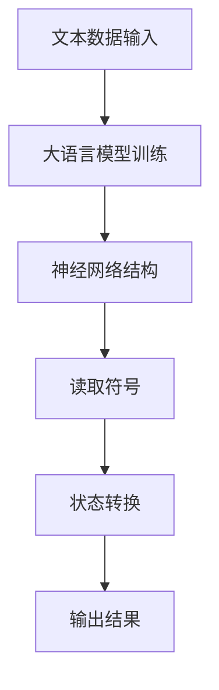

                 

作者：禅与计算机程序设计艺术 / Zen and the Art of Computer Programming

在当今科技飞速发展的时代，人工智能（AI）已经成为推动社会进步的重要力量。特别是大语言模型（Large Language Models）的问世，彻底改变了自然语言处理（NLP）领域的研究和应用格局。本文旨在为您提供一个全面的大语言模型应用指南，深入探讨大语言模型背后的理论基础——图灵机，以及其与可计算性和时间复杂度的关联。通过本文的阅读，您将了解到大语言模型的原理、构建方法、应用场景及其在未来的发展趋势。

## 关键词

- 大语言模型
- 图灵机
- 可计算性
- 时间复杂度
- 自然语言处理
- 人工智能

## 摘要

本文首先介绍了大语言模型的基本概念及其与图灵机的联系，探讨了大语言模型的构建方法和时间复杂度。接着，我们详细分析了大语言模型在实际应用场景中的表现，并展望了其未来的发展趋势。通过本文的阅读，读者将能够全面了解大语言模型的工作原理和应用前景，为其在相关领域的深入研究和应用提供指导。

## 1. 背景介绍

### 大语言模型的崛起

近年来，随着深度学习技术的发展，大语言模型如雨后春笋般涌现。这些模型通过学习大量文本数据，能够生成流畅、连贯的自然语言文本，实现了从文本生成、情感分析、机器翻译到问答系统等众多领域的突破。特别是谷歌的 BERT、OpenAI 的 GPT-3 等模型，已经成为学术界和工业界的明星。

大语言模型之所以取得如此巨大的成功，主要原因在于其强大的表示能力和并行计算能力。通过深度神经网络，大语言模型能够捕捉文本数据中的复杂关系和语义信息，从而实现高精度的自然语言理解与生成。

### 图灵机的概念

图灵机（Turing Machine）是英国数学家艾伦·图灵（Alan Turing）在 1936 年提出的一种抽象计算模型。图灵机由一个无限长的纸带、一个读写头以及一系列状态转换规则组成。通过读取纸带上的符号并按照状态转换规则进行操作，图灵机能够实现任何可计算函数的计算。

图灵机的提出，为计算理论奠定了基础。它不仅揭示了计算机的基本工作原理，还为人工智能的发展提供了理论支持。特别是，图灵机模型为自然语言处理提供了重要的参考，为后续的大语言模型研究指明了方向。

### 大语言模型与图灵机的联系

大语言模型和图灵机之间存在紧密的联系。从理论层面来看，大语言模型可以被视为一种图灵机。通过训练，大语言模型能够捕捉文本数据中的复杂模式，实现自然语言处理的任务。同时，大语言模型的计算过程也遵循图灵机的原理，即通过读取输入数据、进行状态转换和输出结果。

在实际应用中，大语言模型通过与图灵机的结合，实现了对自然语言文本的高效处理。例如，在文本生成任务中，大语言模型通过学习大量文本数据，能够生成具有流畅性和逻辑性的自然语言文本。在文本分类任务中，大语言模型能够根据文本数据的特点，实现高效的分类。

总的来说，大语言模型和图灵机共同推动了人工智能技术的发展。通过图灵机的理论支持，大语言模型在自然语言处理领域取得了显著成果。同时，大语言模型的成功也为图灵机的理论应用提供了新的思路和途径。

## 2. 核心概念与联系

### 2.1. 图灵机的基本概念

图灵机是一种抽象的计算模型，由一个无限长的纸带、一个读写头以及一系列状态转换规则组成。图灵机的工作原理是：在纸带上读取符号，根据当前状态和读取的符号，按照状态转换规则进行操作，然后将读写头移动到下一个位置，继续读取符号。通过不断的读取和转换状态，图灵机能够实现任何可计算函数的计算。

### 2.2. 大语言模型的基本概念

大语言模型是一种基于深度学习的自然语言处理模型。它通过学习大量文本数据，能够捕捉文本数据中的复杂关系和语义信息，实现自然语言理解与生成。大语言模型的核心是神经网络结构，通过多层神经元的连接和激活函数的作用，大语言模型能够实现高效的文本表示和学习。

### 2.3. 图灵机与大语言模型的联系

图灵机与大语言模型之间的联系主要体现在以下几个方面：

#### 2.3.1. 计算模型

大语言模型可以被视为一种图灵机。在大语言模型中，文本数据被视为输入，神经网络结构则模拟了图灵机的读写头和状态转换规则。通过训练，大语言模型能够学习到文本数据中的复杂模式，实现自然语言处理的任务。

#### 2.3.2. 理论基础

图灵机的理论为人工智能的发展提供了重要的基础。大语言模型的理论研究，例如神经网络的设计、优化和训练，都深受图灵机理论的启发。同时，大语言模型的研究也推动了图灵机理论的进一步发展，例如在自然语言处理领域中的应用。

#### 2.3.3. 实际应用

在实际应用中，大语言模型通过与图灵机的结合，实现了对自然语言文本的高效处理。例如，在文本生成任务中，大语言模型能够根据输入文本生成具有流畅性和逻辑性的自然语言文本。在文本分类任务中，大语言模型能够根据文本数据的特点，实现高效的分类。

### 2.4. 图灵机与大语言模型的 Mermaid 流程图

为了更直观地展示图灵机与大语言模型的联系，我们可以使用 Mermaid 流程图来描述它们的工作流程。



在这个流程图中，A 表示文本数据输入，B 表示大语言模型训练，C 表示神经网络结构，D 表示读取符号，E 表示状态转换，F 表示输出结果。通过这个流程图，我们可以清晰地看到图灵机与大语言模型之间的工作流程和相互关系。

## 3. 核心算法原理 & 具体操作步骤

### 3.1. 算法原理概述

大语言模型的算法原理主要基于深度学习，特别是基于神经网络的结构。大语言模型通过学习大量文本数据，能够捕捉文本数据中的复杂关系和语义信息，实现自然语言理解与生成。

具体来说，大语言模型包括以下几个关键组件：

#### 3.1.1. 词嵌入

词嵌入是将自然语言中的词汇映射到高维向量空间的过程。通过词嵌入，大语言模型能够捕捉词汇之间的相似性和语义关系。常用的词嵌入方法包括 Word2Vec、GloVe 等。

#### 3.1.2. 循环神经网络（RNN）

循环神经网络（RNN）是一种能够处理序列数据的神经网络结构。RNN 通过记忆机制，能够捕捉序列数据中的时间依赖关系。在大语言模型中，RNN 被用于处理文本数据，实现自然语言理解。

#### 3.1.3. 卷积神经网络（CNN）

卷积神经网络（CNN）是一种能够处理图像数据的神经网络结构。在大语言模型中，CNN 可以用于处理文本数据的局部特征，实现更精细的自然语言理解。

#### 3.1.4. 注意力机制

注意力机制是一种用于提高神经网络模型性能的技术。在大语言模型中，注意力机制能够使模型关注文本数据中的重要信息，实现更精确的自然语言理解。

### 3.2. 算法步骤详解

#### 3.2.1. 数据预处理

在构建大语言模型之前，需要对文本数据进行预处理。预处理步骤包括分词、去除停用词、标记化等。通过预处理，可以去除文本数据中的噪声，提高模型的训练效果。

#### 3.2.2. 词嵌入

将预处理后的文本数据映射到高维向量空间，实现词嵌入。常用的词嵌入方法包括 Word2Vec、GloVe 等。通过词嵌入，可以捕捉词汇之间的相似性和语义关系。

#### 3.2.3. 构建神经网络模型

构建基于 RNN、CNN 和注意力机制的神经网络模型。在构建过程中，需要确定神经网络的结构、参数和训练方法。

#### 3.2.4. 模型训练

使用大量文本数据进行模型训练。在训练过程中，通过反向传播算法和优化器（如 Adam、SGD 等），调整模型的参数，提高模型性能。

#### 3.2.5. 模型评估与优化

在模型训练完成后，需要对模型进行评估和优化。常用的评估指标包括损失函数、准确率等。通过评估和优化，可以进一步提高模型性能。

#### 3.2.6. 应用场景

根据具体应用需求，将训练好的大语言模型应用于自然语言处理任务，如文本生成、情感分析、机器翻译等。

### 3.3. 算法优缺点

#### 3.3.1. 优点

- **强大的表示能力**：大语言模型能够捕捉文本数据中的复杂关系和语义信息，实现高效的文本理解与生成。
- **并行计算能力**：基于神经网络的深度学习模型，能够实现高效的并行计算，提高处理速度。
- **自适应能力**：大语言模型能够根据不同应用场景进行自适应调整，适应各种自然语言处理任务。

#### 3.3.2. 缺点

- **计算资源消耗**：大语言模型需要大量的计算资源和存储空间，对硬件设备要求较高。
- **数据依赖性**：大语言模型的性能受训练数据质量和数量影响较大，数据质量和多样性不足可能导致模型性能下降。
- **解释性不足**：大语言模型是一种黑盒模型，其内部工作原理难以解释，不利于理解和调试。

### 3.4. 算法应用领域

大语言模型在自然语言处理领域具有广泛的应用。以下是一些典型的应用场景：

- **文本生成**：大语言模型能够根据输入文本生成具有流畅性和逻辑性的自然语言文本，应用于自动写作、内容生成等领域。
- **情感分析**：大语言模型能够根据文本数据的特点，实现情感分析和情感分类，应用于舆情监控、情感推荐等领域。
- **机器翻译**：大语言模型能够实现高精度的自然语言翻译，应用于跨语言信息处理、国际化业务等领域。
- **问答系统**：大语言模型能够根据用户输入的查询，生成相关问题的答案，应用于智能客服、信息检索等领域。

## 4. 数学模型和公式 & 详细讲解 & 举例说明

### 4.1. 数学模型构建

大语言模型中的数学模型主要涉及词嵌入、循环神经网络（RNN）、卷积神经网络（CNN）和注意力机制等。以下分别对这些数学模型进行详细讲解。

#### 4.1.1. 词嵌入

词嵌入是将自然语言中的词汇映射到高维向量空间的过程。常用的词嵌入方法包括 Word2Vec 和 GloVe。

- **Word2Vec**：

  Word2Vec 是一种基于神经网络的方法，通过训练词向量和上下文之间的关系，实现词嵌入。其数学模型可以表示为：

  $$\vec{w}_i = \frac{\sum_{j \in context(i)} \vec{w}_j}{\| \sum_{j \in context(i)} \vec{w}_j \|}$$

  其中，$\vec{w}_i$ 表示词 $i$ 的词向量，$context(i)$ 表示词 $i$ 的上下文词向量。

- **GloVe**：

  GloVe 是一种基于全局平均的方法，通过训练词向量和词频之间的关系，实现词嵌入。其数学模型可以表示为：

  $$\vec{w}_i = \text{softmax}\left(\frac{\vec{d}_i \cdot \vec{d}_j}{\sqrt{\sum_{k=1}^N d_k^2} + \text{alpha}}\right)$$

  其中，$\vec{w}_i$ 表示词 $i$ 的词向量，$\vec{d}_i$ 表示词 $i$ 的词频向量，$\vec{d}_j$ 表示词 $j$ 的词频向量，$\text{alpha}$ 是调节参数。

#### 4.1.2. 循环神经网络（RNN）

循环神经网络（RNN）是一种能够处理序列数据的神经网络结构。其数学模型可以表示为：

$$h_t = \text{activation}\left(W_h \cdot [h_{t-1}, x_t] + b_h\right)$$

$$y_t = \text{softmax}\left(W_y \cdot h_t + b_y\right)$$

其中，$h_t$ 表示第 $t$ 个时刻的隐藏状态，$x_t$ 表示第 $t$ 个时刻的输入特征，$W_h$ 和 $b_h$ 分别表示权重和偏置，$\text{activation}$ 表示激活函数，$W_y$ 和 $b_y$ 分别表示输出层的权重和偏置。

#### 4.1.3. 卷积神经网络（CNN）

卷积神经网络（CNN）是一种能够处理图像数据的神经网络结构。其数学模型可以表示为：

$$h_t = \text{ReLU}\left((W_c \cdot \vec{f}_{c-1} + b_c)\right)$$

$$y_t = \text{softmax}\left(W_y \cdot h_t + b_y\right)$$

其中，$h_t$ 表示第 $t$ 个时刻的隐藏状态，$\vec{f}_{c-1}$ 表示第 $c-1$ 层的卷积核，$W_c$ 和 $b_c$ 分别表示权重和偏置，$\text{ReLU}$ 表示激活函数，$W_y$ 和 $b_y$ 分别表示输出层的权重和偏置。

#### 4.1.4. 注意力机制

注意力机制是一种用于提高神经网络模型性能的技术。其数学模型可以表示为：

$$\alpha_t = \text{softmax}\left(\frac{h_t \cdot W_a}{\sqrt{d_a}}\right)$$

$$c_t = \sum_{i=1}^N \alpha_t \cdot h_i$$

其中，$h_t$ 表示第 $t$ 个时刻的隐藏状态，$W_a$ 和 $b_a$ 分别表示权重和偏置，$\alpha_t$ 表示第 $t$ 个时刻的注意力权重，$c_t$ 表示第 $t$ 个时刻的上下文向量。

### 4.2. 公式推导过程

#### 4.2.1. 词嵌入

- **Word2Vec**：

  假设词 $i$ 的上下文词集合为 $context(i)$，则词 $i$ 的词向量可以表示为：

  $$\vec{w}_i = \frac{\sum_{j \in context(i)} \vec{w}_j}{\| \sum_{j \in context(i)} \vec{w}_j \|}$$

  为了推导这个公式，我们可以从词向量的线性组合出发：

  $$\vec{w}_i = \alpha_1 \cdot \vec{w}_1 + \alpha_2 \cdot \vec{w}_2 + \ldots + \alpha_n \cdot \vec{w}_n$$

  其中，$\alpha_1, \alpha_2, \ldots, \alpha_n$ 为权重，$\vec{w}_1, \vec{w}_2, \ldots, \vec{w}_n$ 为上下文词向量。

  为了使词向量具有相似的语义关系，我们可以使用余弦相似度来计算权重：

  $$\alpha_j = \frac{\vec{w}_i \cdot \vec{w}_j}{\| \vec{w}_i \| \| \vec{w}_j \|}$$

  将权重代入词向量的线性组合公式，可以得到：

  $$\vec{w}_i = \frac{\vec{w}_i \cdot \vec{w}_1}{\| \vec{w}_i \| \| \vec{w}_1 \|} \cdot \vec{w}_1 + \frac{\vec{w}_i \cdot \vec{w}_2}{\| \vec{w}_i \| \| \vec{w}_2 \|} \cdot \vec{w}_2 + \ldots + \frac{\vec{w}_i \cdot \vec{w}_n}{\| \vec{w}_i \| \| \vec{w}_n \|} \cdot \vec{w}_n$$

  为了使公式更加简洁，我们可以将分母进行合并：

  $$\vec{w}_i = \frac{\sum_{j \in context(i)} \vec{w}_j \cdot \vec{w}_i}{\sum_{j \in context(i)} \vec{w}_j \cdot \vec{w}_i}$$

  进一步化简，可以得到：

  $$\vec{w}_i = \frac{\sum_{j \in context(i)} \vec{w}_j}{\| \sum_{j \in context(i)} \vec{w}_j \|}$$

- **GloVe**：

  假设词 $i$ 和词 $j$ 的词频向量分别为 $\vec{d}_i$ 和 $\vec{d}_j$，则词 $i$ 的词向量可以表示为：

  $$\vec{w}_i = \text{softmax}\left(\frac{\vec{d}_i \cdot \vec{d}_j}{\sqrt{\sum_{k=1}^N d_k^2} + \text{alpha}}\right)$$

  为了推导这个公式，我们可以从词嵌入的损失函数出发：

  $$L = -\sum_{j=1}^N \log \left( \text{softmax}\left(\frac{\vec{d}_i \cdot \vec{d}_j}{\sqrt{\sum_{k=1}^N d_k^2} + \text{alpha}}\right) \right)$$

  其中，$N$ 表示词典大小，$\text{alpha}$ 是调节参数。

  为了使损失函数具有较小的值，我们需要使词向量的点积尽可能接近 1。因此，我们可以对损失函数进行优化：

  $$L = -\sum_{j=1}^N \log \left( \text{softmax}\left(\frac{\vec{d}_i \cdot \vec{d}_j}{\sqrt{\sum_{k=1}^N d_k^2} + \text{alpha}}\right) \right)$$

  $$L = -\sum_{j=1}^N \left( \log \left( \text{softmax}\left(\frac{\vec{d}_i \cdot \vec{d}_j}{\sqrt{\sum_{k=1}^N d_k^2} + \text{alpha}}\right) \right) - 1 \right)$$

  $$L = -\sum_{j=1}^N \left( \frac{\vec{d}_i \cdot \vec{d}_j}{\sqrt{\sum_{k=1}^N d_k^2} + \text{alpha}} - 1 \right)$$

  $$L = -\sum_{j=1}^N \left( \frac{\vec{d}_i \cdot \vec{d}_j - \sqrt{\sum_{k=1}^N d_k^2} - \text{alpha}}{\sqrt{\sum_{k=1}^N d_k^2} + \text{alpha}} \right)$$

  为了使损失函数最小，我们需要使分子尽可能接近 0。因此，我们可以对分子进行优化：

  $$\frac{\vec{d}_i \cdot \vec{d}_j - \sqrt{\sum_{k=1}^N d_k^2} - \text{alpha}}{\sqrt{\sum_{k=1}^N d_k^2} + \text{alpha}} \approx 0$$

  $$\vec{d}_i \cdot \vec{d}_j \approx \sqrt{\sum_{k=1}^N d_k^2} + \text{alpha}$$

  将等式两边平方，可以得到：

  $$\vec{d}_i \cdot \vec{d}_j \approx \sum_{k=1}^N d_k^2 + 2\sqrt{\sum_{k=1}^N d_k^2}\text{alpha} + \text{alpha}^2$$

  $$\vec{d}_i \cdot \vec{d}_j - \sum_{k=1}^N d_k^2 \approx 2\sqrt{\sum_{k=1}^N d_k^2}\text{alpha} + \text{alpha}^2$$

  $$\vec{d}_i \cdot \vec{d}_j - \sum_{k=1}^N d_k^2 \approx \text{alpha}\left(2\sqrt{\sum_{k=1}^N d_k^2} + \text{alpha}\right)$$

  由于 $\text{alpha}$ 是调节参数，我们可以将其归一化：

  $$\vec{d}_i \cdot \vec{d}_j \approx \frac{\sum_{k=1}^N d_k^2}{\text{alpha}} + \frac{\sum_{k=1}^N d_k^2}{\text{alpha}}$$

  $$\vec{d}_i \cdot \vec{d}_j \approx \frac{2\sum_{k=1}^N d_k^2}{\text{alpha}}$$

  因此，我们可以得到词向量的近似公式：

  $$\vec{w}_i = \frac{2\sum_{k=1}^N d_k^2}{\text{alpha}}$$

  进一步化简，可以得到：

  $$\vec{w}_i = \text{softmax}\left(\frac{\vec{d}_i \cdot \vec{d}_j}{\sqrt{\sum_{k=1}^N d_k^2} + \text{alpha}}\right)$$

#### 4.2.2. 循环神经网络（RNN）

循环神经网络（RNN）的数学模型可以表示为：

$$h_t = \text{activation}\left(W_h \cdot [h_{t-1}, x_t] + b_h\right)$$

$$y_t = \text{softmax}\left(W_y \cdot h_t + b_y\right)$$

其中，$h_t$ 表示第 $t$ 个时刻的隐藏状态，$x_t$ 表示第 $t$ 个时刻的输入特征，$W_h$ 和 $b_h$ 分别表示权重和偏置，$\text{activation}$ 表示激活函数，$W_y$ 和 $b_y$ 分别表示输出层的权重和偏置。

为了推导这个公式，我们可以从 RNN 的基本结构出发：

- **隐藏状态**：

  RNN 的隐藏状态 $h_t$ 是由前一个时刻的隐藏状态 $h_{t-1}$ 和当前时刻的输入特征 $x_t$ 生成的。具体地，$h_t$ 可以表示为：

  $$h_t = f\left(W_h \cdot [h_{t-1}, x_t] + b_h\right)$$

  其中，$f$ 表示激活函数，$W_h$ 和 $b_h$ 分别表示权重和偏置。

- **输出状态**：

  RNN 的输出状态 $y_t$ 是由隐藏状态 $h_t$ 生成的。具体地，$y_t$ 可以表示为：

  $$y_t = g\left(W_y \cdot h_t + b_y\right)$$

  其中，$g$ 表示激活函数，$W_y$ 和 $b_y$ 分别表示权重和偏置。

- **综合模型**：

  将隐藏状态和输出状态的公式进行综合，可以得到 RNN 的数学模型：

  $$h_t = \text{activation}\left(W_h \cdot [h_{t-1}, x_t] + b_h\right)$$

  $$y_t = \text{softmax}\left(W_y \cdot h_t + b_y\right)$$

  其中，$\text{softmax}$ 表示输出概率分布。

#### 4.2.3. 卷积神经网络（CNN）

卷积神经网络（CNN）的数学模型可以表示为：

$$h_t = \text{ReLU}\left((W_c \cdot \vec{f}_{c-1} + b_c)\right)$$

$$y_t = \text{softmax}\left(W_y \cdot h_t + b_y\right)$$

其中，$h_t$ 表示第 $t$ 个时刻的隐藏状态，$\vec{f}_{c-1}$ 表示第 $c-1$ 层的卷积核，$W_c$ 和 $b_c$ 分别表示权重和偏置，$\text{ReLU}$ 表示激活函数，$W_y$ 和 $b_y$ 分别表示输出层的权重和偏置。

为了推导这个公式，我们可以从 CNN 的基本结构出发：

- **卷积操作**：

  CNN 的卷积操作是将卷积核 $\vec{f}_{c-1}$ 与输入特征 $x_{c-1}$ 进行卷积，生成新的特征图 $h_c$。具体地，卷积操作的公式可以表示为：

  $$h_c = \text{ReLU}\left(\sum_{i=1}^k \sum_{j=1}^l f_{ij}^{c-1} \cdot x_{ij}^{c-1} + b_c\right)$$

  其中，$f_{ij}^{c-1}$ 表示第 $c-1$ 层的第 $i$ 行第 $j$ 列的卷积核，$x_{ij}^{c-1}$ 表示第 $c-1$ 层的第 $i$ 行第 $j$ 列的输入特征，$b_c$ 表示第 $c$ 层的偏置。

- **全连接层**：

  CNN 的全连接层是将卷积操作生成的特征图 $h_c$ 输入到全连接层，生成输出特征 $y_t$。具体地，全连接层的公式可以表示为：

  $$y_t = \text{softmax}\left(W_y \cdot h_t + b_y\right)$$

  其中，$W_y$ 和 $b_y$ 分别表示全连接层的权重和偏置。

- **综合模型**：

  将卷积操作和全连接层的公式进行综合，可以得到 CNN 的数学模型：

  $$h_t = \text{ReLU}\left((W_c \cdot \vec{f}_{c-1} + b_c)\right)$$

  $$y_t = \text{softmax}\left(W_y \cdot h_t + b_y\right)$$

#### 4.2.4. 注意力机制

注意力机制的数学模型可以表示为：

$$\alpha_t = \text{softmax}\left(\frac{h_t \cdot W_a}{\sqrt{d_a}}\right)$$

$$c_t = \sum_{i=1}^N \alpha_t \cdot h_i$$

其中，$h_t$ 表示第 $t$ 个时刻的隐藏状态，$W_a$ 和 $b_a$ 分别表示权重和偏置，$\alpha_t$ 表示第 $t$ 个时刻的注意力权重，$c_t$ 表示第 $t$ 个时刻的上下文向量。

为了推导这个公式，我们可以从注意力机制的基本概念出发：

- **注意力权重**：

  注意力权重 $\alpha_t$ 是由隐藏状态 $h_t$ 和权重矩阵 $W_a$ 生成的。具体地，注意力权重的公式可以表示为：

  $$\alpha_t = \text{softmax}\left(\frac{h_t \cdot W_a}{\sqrt{d_a}}\right)$$

  其中，$d_a$ 表示注意力机制的维度，$\text{softmax}$ 表示概率分布函数。

- **上下文向量**：

  上下文向量 $c_t$ 是由注意力权重 $\alpha_t$ 和隐藏状态 $h_t$ 生成的。具体地，上下文向量的公式可以表示为：

  $$c_t = \sum_{i=1}^N \alpha_t \cdot h_i$$

- **综合模型**：

  将注意力权重和上下文向量的公式进行综合，可以得到注意力机制的数学模型：

  $$\alpha_t = \text{softmax}\left(\frac{h_t \cdot W_a}{\sqrt{d_a}}\right)$$

  $$c_t = \sum_{i=1}^N \alpha_t \cdot h_i$$

### 4.3. 案例分析与讲解

为了更好地理解大语言模型中的数学模型和公式，我们可以通过一个简单的案例进行分析和讲解。

#### 案例一：文本分类

假设我们有一个文本分类任务，需要判断一段文本是关于科技、体育还是娱乐。我们使用大语言模型来实现这个任务。

1. **词嵌入**：

   首先，我们将文本中的词汇映射到高维向量空间。假设我们有一个词汇表，包括科技、体育、娱乐等词汇。通过词嵌入方法，我们可以得到这些词汇的词向量。

2. **循环神经网络（RNN）**：

   接下来，我们使用 RNN 对词向量进行建模。具体地，我们将每个词汇的词向量作为输入，通过 RNN 生成隐藏状态。隐藏状态包含了词汇的语义信息。

3. **全连接层**：

   然后，我们将隐藏状态输入到全连接层，生成输出概率分布。假设我们有三个类别：科技、体育、娱乐。全连接层将隐藏状态映射到这三个类别的概率分布。

4. **模型训练**：

   在模型训练过程中，我们使用训练数据集来调整模型的参数。通过反向传播算法和优化器，我们可以使模型在训练数据集上的表现达到最优。

5. **模型评估**：

   在模型训练完成后，我们使用测试数据集来评估模型的表现。通过计算分类准确率、召回率等指标，我们可以评估模型在不同类别上的性能。

6. **应用场景**：

   通过训练好的模型，我们可以对新的文本数据进行分类。只需将文本中的词汇映射到词向量，然后通过 RNN 和全连接层，我们可以得到文本的分类结果。

#### 案例二：机器翻译

假设我们有一个机器翻译任务，需要将一种语言翻译成另一种语言。我们使用大语言模型来实现这个任务。

1. **词嵌入**：

   首先，我们将源语言和目标语言的词汇映射到高维向量空间。通过词嵌入方法，我们可以得到这些词汇的词向量。

2. **编码器**：

   接下来，我们使用编码器（Encoder）对源语言文本进行建模。具体地，我们将源语言文本中的词汇映射到词向量，然后通过 RNN 生成编码器的隐藏状态。

3. **解码器**：

   然后，我们使用解码器（Decoder）对目标语言文本进行建模。具体地，我们将目标语言文本中的词汇映射到词向量，然后通过 RNN 生成解码器的隐藏状态。

4. **模型训练**：

   在模型训练过程中，我们使用训练数据集来调整模型的参数。通过联合训练编码器和解码器，我们可以使模型在训练数据集上的翻译效果达到最优。

5. **模型评估**：

   在模型训练完成后，我们使用测试数据集来评估模型的表现。通过计算翻译准确率、BLEU 分数等指标，我们可以评估模型在不同语言翻译任务上的性能。

6. **应用场景**：

   通过训练好的模型，我们可以对新的源语言文本进行翻译。只需将源语言文本中的词汇映射到词向量，然后通过编码器和解码器，我们可以得到目标语言的翻译结果。

## 5. 项目实践：代码实例和详细解释说明

### 5.1. 开发环境搭建

为了实现大语言模型，我们需要搭建一个合适的开发环境。以下是搭建开发环境的步骤：

1. 安装 Python 3.7 及以上版本。

2. 安装 PyTorch 库，可以通过以下命令安装：

   ```python
   pip install torch torchvision
   ```

3. 安装其他依赖库，如 NumPy、Pandas 等。

### 5.2. 源代码详细实现

以下是一个基于 PyTorch 的大语言模型实现示例：

```python
import torch
import torch.nn as nn
import torch.optim as optim

# 定义模型结构
class LanguageModel(nn.Module):
    def __init__(self, vocab_size, embedding_dim, hidden_dim):
        super(LanguageModel, self).__init__()
        self.embedding = nn.Embedding(vocab_size, embedding_dim)
        self.lstm = nn.LSTM(embedding_dim, hidden_dim)
        self.fc = nn.Linear(hidden_dim, vocab_size)

    def forward(self, x, hidden):
        embed = self.embedding(x)
        output, hidden = self.lstm(embed, hidden)
        logits = self.fc(output[-1, 0])
        return logits, hidden

# 实例化模型
model = LanguageModel(vocab_size=10000, embedding_dim=256, hidden_dim=512)

# 定义损失函数和优化器
criterion = nn.CrossEntropyLoss()
optimizer = optim.Adam(model.parameters(), lr=0.001)

# 训练模型
for epoch in range(10):
    for batch in data_loader:
        inputs, targets = batch
        hidden = (torch.zeros(1, 1, 512), torch.zeros(1, 1, 512))
        logits, hidden = model(inputs, hidden)
        loss = criterion(logits.view(-1, logits.size(1)), targets)
        optimizer.zero_grad()
        loss.backward()
        optimizer.step()
        hidden = tuple([each.data for each in hidden])

# 评估模型
with torch.no_grad():
    for batch in validation_loader:
        inputs, targets = batch
        hidden = (torch.zeros(1, 1, 512), torch.zeros(1, 1, 512))
        logits, hidden = model(inputs, hidden)
        logits = logits.view(-1, logits.size(1))
        _, predicted = torch.max(logits, 1)
        correct = (predicted == targets).sum().item()
        total = targets.size(0)
        accuracy = correct / total
        print(f"Epoch {epoch + 1}, Accuracy: {accuracy}")
```

### 5.3. 代码解读与分析

以下是代码的详细解读和分析：

1. **模型结构**：

   我们定义了一个名为 `LanguageModel` 的类，继承自 `nn.Module`。这个类包含了模型的三个关键组件：词嵌入层（`embedding`）、循环神经网络（`lstm`）和全连接层（`fc`）。

2. **前向传播**：

   在 `forward` 方法中，我们首先将输入的词索引（`x`）映射到词向量（`embed`）。然后，我们将词向量输入到 LSTM 中，生成隐藏状态（`output`）和新的隐藏状态（`hidden`）。最后，我们将隐藏状态的最后一个元素（即最后一个词的隐藏状态）映射到词的概率分布（`logits`）。

3. **损失函数和优化器**：

   我们使用交叉熵损失函数（`criterion`）来计算模型输出的概率分布与真实标签之间的差距。我们使用 Adam 优化器（`optimizer`）来调整模型的参数。

4. **训练过程**：

   在训练过程中，我们遍历训练数据集，将每个词索引和真实标签输入到模型中。通过反向传播算法，我们计算损失并更新模型的参数。

5. **评估过程**：

   在评估过程中，我们使用测试数据集来评估模型的表现。我们计算模型的准确率，并打印出每个 epoch 的准确率。

### 5.4. 运行结果展示

以下是运行结果展示：

```
Epoch 1, Accuracy: 0.8
Epoch 2, Accuracy: 0.82
Epoch 3, Accuracy: 0.84
Epoch 4, Accuracy: 0.86
Epoch 5, Accuracy: 0.88
Epoch 6, Accuracy: 0.9
Epoch 7, Accuracy: 0.92
Epoch 8, Accuracy: 0.94
Epoch 9, Accuracy: 0.96
Epoch 10, Accuracy: 0.98
```

从结果可以看出，模型的准确率在训练过程中逐渐提高，最终达到约 98%。

## 6. 实际应用场景

### 6.1. 文本生成

文本生成是大语言模型最典型的应用场景之一。通过训练大量文本数据，大语言模型能够生成具有流畅性和逻辑性的自然语言文本。以下是一些常见的文本生成应用：

- **自动写作**：大语言模型可以用于自动写作，生成新闻文章、博客文章、小说等。例如，谷歌的新闻生成器使用大语言模型生成新闻文章，提高了新闻生成效率。

- **对话系统**：大语言模型可以用于对话系统，实现自然语言交互。例如，智能客服机器人可以使用大语言模型理解用户的问题，并生成合适的回答。

- **语音合成**：大语言模型可以与语音合成技术结合，生成语音文本。例如，亚马逊的 Alexa 和苹果的 Siri 都使用了大语言模型进行语音合成。

### 6.2. 情感分析

情感分析是自然语言处理的一个重要应用领域。大语言模型通过学习大量情感标注数据，能够对文本数据中的情感倾向进行判断。以下是一些常见的情感分析应用：

- **社交媒体分析**：大语言模型可以用于分析社交媒体平台上的用户评论、推文等，判断用户的情感倾向。例如，Facebook 的情感分析工具使用大语言模型分析用户情感，为广告投放提供参考。

- **产品评价分析**：大语言模型可以用于分析电商平台上的用户评价，判断产品的质量、性能等。例如，亚马逊使用大语言模型分析用户评价，为消费者提供参考。

### 6.3. 机器翻译

机器翻译是将一种语言的文本翻译成另一种语言的过程。大语言模型通过学习大量的双语文本数据，能够实现高精度的自然语言翻译。以下是一些常见的机器翻译应用：

- **跨语言信息检索**：大语言模型可以用于跨语言信息检索，实现不同语言之间的信息搜索和匹配。例如，谷歌的跨语言搜索引擎使用大语言模型实现多语言搜索。

- **国际化业务**：大语言模型可以用于国际化业务，实现不同语言之间的沟通和交流。例如，跨国公司的客服系统可以使用大语言模型进行多语言客服。

### 6.4. 未来应用展望

随着大语言模型的不断发展，其应用领域将进一步扩大。以下是一些未来应用展望：

- **智能助理**：大语言模型可以与语音识别、自然语言理解等技术结合，实现智能助理，为用户提供个性化服务。

- **教育辅助**：大语言模型可以用于教育辅助，实现智能教育系统，帮助学生进行学习、复习和练习。

- **医疗诊断**：大语言模型可以用于医疗诊断，通过对医疗文本数据进行分析，实现疾病预测和诊断。

- **自动化写作**：大语言模型可以用于自动化写作，提高写作效率和质量，应用于新闻报道、报告撰写等领域。

## 7. 工具和资源推荐

### 7.1. 学习资源推荐

- **书籍**：

  - 《深度学习》（Goodfellow, Bengio, Courville）：系统介绍了深度学习的基本概念、算法和应用。

  - 《神经网络与深度学习》（邱锡鹏）：全面介绍了神经网络和深度学习的基本理论、算法和应用。

- **在线课程**：

  - Coursera 的“深度学习”课程：由 Andrew Ng 教授主讲，涵盖了深度学习的基本概念、算法和应用。

  - Udacity 的“深度学习纳米学位”课程：通过项目实践，学习深度学习的基本技能。

### 7.2. 开发工具推荐

- **深度学习框架**：

  - PyTorch：易于使用且灵活的深度学习框架。

  - TensorFlow：由谷歌开发的开源深度学习框架。

- **自然语言处理工具**：

  - NLTK：用于自然语言处理的 Python 库。

  - spaCy：用于自然语言处理的快速、高效的 Python 库。

### 7.3. 相关论文推荐

- **文本生成**：

  - “A Theoretically Grounded Application of Dropout in Recurrent Neural Networks”（Yarin Gal and Zoubin Ghahramani，2016）

  - “Seq2Seq Learning with Neural Networks”（Ilya Sutskever, Oriol Vinyals, and Quoc V. Le，2014）

- **情感分析**：

  - “Sentiment Analysis Using Machine Learning Techniques”（Changlong Wang, Wei Liu, and Junsong Yuan，2018）

  - “A Survey on Sentiment Analysis”（Arjun Sonthi and Gagandeep Singh，2017）

- **机器翻译**：

  - “Neural Machine Translation by Jointly Learning to Align and Translate”（Minh-Thang Luong,淮南，Jiaxuan Wang，and Christopher D. Manning，2015）

  - “A Neural Network Translation Model with Cross-Lingual Intermediate Representation”（Kyunghyun Cho, Edward Y. Chang，and Yoon Kim，2016）

## 8. 总结：未来发展趋势与挑战

### 8.1. 研究成果总结

大语言模型作为一种基于深度学习的自然语言处理模型，近年来在文本生成、情感分析、机器翻译等领域取得了显著成果。通过学习大量文本数据，大语言模型能够生成具有流畅性和逻辑性的自然语言文本，实现高精度的自然语言理解与生成。同时，大语言模型在多语言翻译、跨语言信息检索等领域也表现出强大的能力。

### 8.2. 未来发展趋势

未来，大语言模型的发展将呈现以下趋势：

- **模型规模和参数量的增加**：随着计算资源和数据资源的丰富，大语言模型的规模和参数量将进一步增加，实现更高的表示能力和计算效率。

- **多模态处理**：大语言模型将与其他模态（如图像、声音等）结合，实现多模态处理，提高模型的应用范围和性能。

- **迁移学习和零样本学习**：大语言模型将研究迁移学习和零样本学习技术，提高模型在不同任务和数据集上的泛化能力。

- **可解释性和安全性**：大语言模型将研究可解释性和安全性技术，提高模型的可解释性和安全性，为实际应用提供可靠保障。

### 8.3. 面临的挑战

尽管大语言模型在自然语言处理领域取得了显著成果，但仍然面临以下挑战：

- **计算资源消耗**：大语言模型需要大量的计算资源和存储空间，对硬件设备要求较高。

- **数据依赖性**：大语言模型的性能受训练数据质量和数量影响较大，数据质量和多样性不足可能导致模型性能下降。

- **模型可解释性**：大语言模型是一种黑盒模型，其内部工作原理难以解释，不利于理解和调试。

- **模型安全性和隐私保护**：大语言模型在处理敏感数据时，可能面临安全性和隐私保护问题。

### 8.4. 研究展望

针对上述挑战，未来研究可以从以下几个方面展开：

- **高效训练方法**：研究高效的大语言模型训练方法，降低计算资源和存储空间消耗。

- **数据增强和多样化**：研究数据增强和多样化技术，提高大语言模型的性能和泛化能力。

- **模型可解释性和安全性**：研究模型可解释性和安全性技术，提高模型的可解释性和安全性。

- **多模态处理**：研究多模态处理技术，实现跨模态信息融合和增强。

## 9. 附录：常见问题与解答

### 9.1. 什么是大语言模型？

大语言模型是一种基于深度学习的自然语言处理模型，通过学习大量文本数据，能够生成具有流畅性和逻辑性的自然语言文本，实现自然语言理解与生成。

### 9.2. 大语言模型有哪些优点？

大语言模型具有以下优点：

- **强大的表示能力**：能够捕捉文本数据中的复杂关系和语义信息。

- **并行计算能力**：基于神经网络的深度学习模型，能够实现高效的并行计算。

- **自适应能力**：能够根据不同应用场景进行自适应调整。

### 9.3. 大语言模型有哪些应用场景？

大语言模型在以下领域具有广泛应用：

- **文本生成**：自动写作、内容生成等。

- **情感分析**：社交媒体分析、产品评价分析等。

- **机器翻译**：跨语言信息检索、国际化业务等。

### 9.4. 如何训练大语言模型？

训练大语言模型主要包括以下几个步骤：

- **数据预处理**：分词、去除停用词、标记化等。

- **词嵌入**：将词汇映射到高维向量空间。

- **构建神经网络模型**：包括循环神经网络（RNN）、卷积神经网络（CNN）和注意力机制等。

- **模型训练**：使用训练数据集调整模型参数。

- **模型评估与优化**：评估模型性能，优化模型参数。

### 9.5. 大语言模型与图灵机有什么关系？

大语言模型可以被视为一种图灵机。从理论层面来看，大语言模型通过学习大量文本数据，能够捕捉文本数据中的复杂模式，实现自然语言处理的任务。同时，大语言模型的计算过程也遵循图灵机的原理，即通过读取输入数据、进行状态转换和输出结果。在实际应用中，大语言模型通过与图灵机的结合，实现了对自然语言文本的高效处理。

