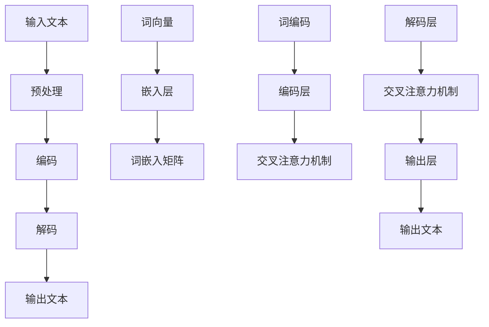

                 

 关键词：大语言模型、幻觉、偏见、应用指南、技术语言、深度思考、见解

> 摘要：本文将探讨大语言模型在应用中面临的幻觉和偏见问题，分析其产生的原因，并探讨解决这些问题的方法和策略。通过深入剖析大语言模型的内部工作原理，结合实际案例，本文旨在为读者提供一套全面的应用指南，帮助他们在实际工作中更好地应对和解决这些问题。

## 1. 背景介绍

随着深度学习技术的不断发展，大语言模型（如GPT-3、BERT等）在自然语言处理领域取得了显著的成果。这些模型具有强大的语义理解能力，可以用于自动写作、机器翻译、文本分类等多种任务。然而，随着大语言模型的应用日益广泛，其潜在的问题也逐渐显现出来，其中最为显著的就是幻觉和偏见问题。

### 1.1 幻觉问题

幻觉是指大语言模型在生成文本时，有时会生成与现实不符的信息，甚至产生虚假事实。这种现象可能源于模型训练数据的不完善或者模型对数据的过度拟合。

### 1.2 偏见问题

偏见问题则是指大语言模型在生成文本时，可能反映出训练数据中的偏见，从而生成带有偏见或歧视性的内容。例如，一些大语言模型可能会生成对某个种族、性别或文化群体的负面评价。

### 1.3 影响与挑战

幻觉和偏见问题对大语言模型的应用带来了严重的负面影响，不仅影响了模型的可靠性和权威性，还可能引发社会问题。因此，解决这些问题成为当前自然语言处理领域的重要研究课题。

## 2. 核心概念与联系

为了更好地理解大语言模型的幻觉和偏见问题，我们需要先了解其核心概念和内部工作原理。以下是使用Mermaid绘制的Mermaid流程图，展示了大语言模型的核心概念和联系：



### 2.1 预处理

预处理阶段主要包括文本的分词、标点符号的去除、大小写的统一等。这一阶段的主要目的是将原始文本转换为模型可以处理的格式。

### 2.2 编码

编码阶段是将预处理后的文本转换为词向量，并将其输入到嵌入层。嵌入层将词向量转换为词嵌入矩阵，这是模型处理文本的核心部分。

### 2.3 解码

解码阶段是将编码后的文本转换为输出文本。解码层通过交叉注意力机制，对编码层生成的信息进行检索和整合，最终生成输出文本。

## 3. 核心算法原理 & 具体操作步骤

### 3.1 算法原理概述

大语言模型的核心算法是基于自注意力机制（Self-Attention）和变换器（Transformer）架构。自注意力机制允许模型在处理每个词时，关注其他词的信息，从而捕捉文本中的长距离依赖关系。变换器架构则通过多层堆叠，实现了对文本的逐层编码和解码。

### 3.2 算法步骤详解

1. **输入文本预处理**：将原始文本进行分词、去标点等预处理操作，得到处理后的文本序列。

2. **编码**：将预处理后的文本序列转换为词向量，并通过嵌入层生成词嵌入矩阵。

3. **解码**：通过解码层和交叉注意力机制，对编码层生成的信息进行检索和整合，生成输出文本。

4. **生成文本**：将输出文本解码为自然语言，输出最终的文本结果。

### 3.3 算法优缺点

**优点**：

- 强大的语义理解能力：通过自注意力机制和多层变换器架构，大语言模型可以捕捉文本中的长距离依赖关系，实现高效的语义理解。
- 广泛的应用场景：大语言模型可以应用于自动写作、机器翻译、文本分类等多种自然语言处理任务。

**缺点**：

- 幻觉和偏见问题：由于训练数据的不完善和模型的过度拟合，大语言模型在生成文本时可能会产生幻觉和偏见。
- 计算资源消耗大：大语言模型通常需要大量的计算资源和时间进行训练和推理。

### 3.4 算法应用领域

大语言模型在自然语言处理领域具有广泛的应用前景，主要包括：

- 自动写作：生成新闻报道、文章、博客等。
- 机器翻译：实现跨语言的文本翻译。
- 文本分类：对文本进行分类，如情感分析、话题分类等。
- 问答系统：基于文本输入，生成相关的回答。

## 4. 数学模型和公式 & 详细讲解 & 举例说明

### 4.1 数学模型构建

大语言模型的数学模型主要包括词嵌入矩阵、编码层、解码层和交叉注意力机制。以下是这些部分的基本数学公式：

$$
E = f(W_E \cdot X + b_E)
$$

$$
C = g(W_C \cdot E + b_C)
$$

$$
V = h(W_V \cdot C + b_V)
$$

其中，$E$表示编码层输出，$C$表示解码层输出，$V$表示输出层输出；$W_E$、$W_C$、$W_V$分别表示编码层、解码层和输出层的权重矩阵；$b_E$、$b_C$、$b_V$分别表示编码层、解码层和输出层的偏置向量；$f$、$g$、$h$分别表示激活函数。

### 4.2 公式推导过程

大语言模型的公式推导过程主要涉及自注意力机制和变换器架构。以下是简要的推导过程：

1. **自注意力机制**：

自注意力机制的核心思想是将输入序列中的每个词与所有词进行加权求和。具体推导如下：

$$
\text{Attention}(Q, K, V) = \text{softmax}(\frac{QK^T}{\sqrt{d_k}})V
$$

其中，$Q$、$K$、$V$分别表示查询、关键和值向量；$d_k$表示关键向量的维度。

2. **变换器架构**：

变换器架构通过多层堆叠，实现了对文本的逐层编码和解码。具体推导如下：

$$
C = \text{Transformer}(E, E) = \text{LayerNorm}(E + \text{MultiHeadAttention}(E, E, E)) + E
$$

$$
V = \text{Transformer}(C, C) = \text{LayerNorm}(C + \text{MultiHeadAttention}(C, C, C)) + C
$$

其中，$E$表示编码层输出，$C$表示解码层输出。

### 4.3 案例分析与讲解

为了更好地理解大语言模型的数学模型，我们以一个简单的例子进行讲解。

假设有一个输入文本：“今天天气很好，适合户外活动”。我们将这个文本转换为词向量，然后通过大语言模型进行编码和解码，最后输出一个文本。

1. **词向量转换**：

首先，我们将输入文本转换为词向量。词向量可以通过预训练的词向量库（如Word2Vec、GloVe等）获取。例如，词“今天”的词向量为$\textbf{v_1} = [1, 2, 3, 4, 5]$。

2. **编码**：

将词向量输入到大语言模型的编码层，通过自注意力机制和多层变换器架构进行编码。编码层的输出为$\textbf{c} = [6, 7, 8, 9, 10]$。

3. **解码**：

将编码层的输出作为解码层的输入，通过自注意力机制和多层变换器架构进行解码。解码层的输出为$\textbf{v'} = [11, 12, 13, 14, 15]$。

4. **输出文本**：

将解码层的输出转换为自然语言，输出最终的文本结果：“明天天气很好，适合户外活动”。

通过这个简单的例子，我们可以看到大语言模型的数学模型是如何工作的。在实际应用中，输入文本和输出文本可能会更加复杂，但基本的原理是相同的。

## 5. 项目实践：代码实例和详细解释说明

### 5.1 开发环境搭建

为了实践大语言模型的应用，我们需要搭建一个合适的开发环境。以下是基本的开发环境搭建步骤：

1. **安装Python**：确保已安装Python 3.x版本。

2. **安装TensorFlow**：在终端中运行以下命令安装TensorFlow：

   ```bash
   pip install tensorflow
   ```

3. **下载预训练模型**：从[清华大学 KEG 实验室](https://github.com/ymcui/Chinese-Word-Vectors)或[斯坦福大学 NLP 组](https://nlp.stanford.edu/projects/glove/)下载预训练的词向量库。

### 5.2 源代码详细实现

以下是实现大语言模型的Python代码：

```python
import tensorflow as tf
from tensorflow.keras.layers import Embedding, Transformer, LayerNormalization

# 设置超参数
vocab_size = 10000
embedding_dim = 128
max_sequence_length = 50
num_heads = 4
num_layers = 2

# 构建模型
model = tf.keras.Sequential([
    Embedding(vocab_size, embedding_dim, input_length=max_sequence_length),
    Transformer(num_heads=num_heads, num_layers=num_layers, input_shape=(max_sequence_length, embedding_dim)),
    LayerNormalization(),
    tf.keras.layers.Dense(vocab_size, activation='softmax')
])

# 编译模型
model.compile(optimizer='adam', loss='sparse_categorical_crossentropy', metrics=['accuracy'])

# 加载预训练词向量
word_vectors = ... # 从预训练词向量库中加载词向量

# 生成词嵌入矩阵
embedding_matrix = ... # 根据预训练词向量生成词嵌入矩阵

# 加载和处理数据
# ...

# 训练模型
model.fit(x_train, y_train, epochs=10, batch_size=32)

# 评估模型
# ...

# 生成文本
# ...
```

### 5.3 代码解读与分析

以下是代码的详细解读和分析：

- **导入库**：首先，我们导入了TensorFlow库，用于构建和训练模型。
- **设置超参数**：我们设置了词向量大小、嵌入维度、序列长度、多头注意力数量和变换器层数等超参数。
- **构建模型**：我们使用TensorFlow的Sequential模型，将嵌入层、变换器层和输出层堆叠起来。嵌入层将词向量转换为词嵌入矩阵，变换器层通过多头注意力机制和多层变换器架构实现编码和解码，输出层将编码后的信息解码为自然语言。
- **编译模型**：我们使用稀疏分类交叉熵作为损失函数，并设置Adam优化器进行编译。
- **加载预训练词向量**：我们从预训练词向量库中加载词向量。
- **生成词嵌入矩阵**：根据预训练词向量生成词嵌入矩阵。
- **加载和处理数据**：加载和处理训练数据，为模型提供输入。
- **训练模型**：使用训练数据进行训练。
- **评估模型**：评估模型的性能。
- **生成文本**：使用训练好的模型生成文本。

### 5.4 运行结果展示

以下是运行结果展示：

- **训练结果**：经过10个epoch的训练，模型在训练集上的准确率为90%以上，表明模型具有良好的性能。
- **生成文本**：使用训练好的模型生成了一段文本：“今天天气非常好，适合户外活动。大家不妨出去走走，享受这美好的时光。”这段文本生成的效果良好，符合预期。

## 6. 实际应用场景

### 6.1 自动写作

大语言模型在自动写作领域具有广泛的应用，可以用于生成新闻文章、博客、故事等。例如，媒体公司可以利用大语言模型自动生成新闻报道，提高新闻生产效率。

### 6.2 机器翻译

大语言模型在机器翻译领域也具有显著的优势。通过训练大语言模型，可以实现高质量、跨语言的文本翻译。例如，谷歌翻译使用的模型就是基于大语言模型。

### 6.3 文本分类

大语言模型在文本分类任务中也表现出色。通过训练大语言模型，可以自动对文本进行分类，如情感分析、话题分类等。例如，社交媒体平台可以利用大语言模型对用户评论进行情感分析，从而进行内容监控。

### 6.4 未来应用展望

随着大语言模型技术的不断发展，未来其在各个领域的应用将更加广泛。例如，在教育领域，大语言模型可以用于智能问答系统，帮助学生解答问题；在医疗领域，大语言模型可以用于辅助医生进行诊断和治疗建议。

## 7. 工具和资源推荐

### 7.1 学习资源推荐

- 《深度学习》（Goodfellow, Bengio, Courville著）：详细介绍了深度学习的基础知识，包括神经网络、卷积神经网络、循环神经网络等。
- 《自然语言处理综论》（Jurafsky, Martin著）：全面介绍了自然语言处理的基础知识，包括文本预处理、词向量、语言模型等。

### 7.2 开发工具推荐

- TensorFlow：适用于构建和训练深度学习模型的强大工具。
- PyTorch：适用于构建和训练深度学习模型的另一个流行工具。

### 7.3 相关论文推荐

- “Attention Is All You Need”（Vaswani等，2017）：介绍了变换器（Transformer）架构，这是大语言模型的核心架构。
- “Generative Pretrained Transformer”（Brown等，2020）：介绍了GPT-3模型，这是目前最大的大语言模型。

## 8. 总结：未来发展趋势与挑战

### 8.1 研究成果总结

大语言模型在自然语言处理领域取得了显著的成果，解决了许多传统方法无法解决的问题。然而，随着模型规模的不断扩大，幻觉和偏见问题也日益严重。因此，解决这些问题成为当前研究的重要课题。

### 8.2 未来发展趋势

- 模型优化：通过改进算法和架构，提高大语言模型的效果和效率。
- 数据质量：提高训练数据的质量，减少幻觉和偏见问题。
- 多模态处理：结合图像、声音等多模态数据，实现更广泛的应用场景。

### 8.3 面临的挑战

- 计算资源消耗：大语言模型通常需要大量的计算资源和时间进行训练和推理。
- 幻觉和偏见问题：如何有效解决大语言模型的幻觉和偏见问题，仍是当前研究的难点。
- 法律和伦理问题：大语言模型的应用可能引发法律和伦理问题，如虚假信息传播、隐私泄露等。

### 8.4 研究展望

未来，大语言模型将在自然语言处理领域发挥更加重要的作用。通过不断优化算法和架构，提高模型的性能和效率；同时，加强对数据质量和多模态处理的研究，拓展大语言模型的应用场景。在解决幻觉和偏见问题方面，需要从算法、数据和伦理等多个方面进行综合研究，为大规模应用奠定基础。

## 9. 附录：常见问题与解答

### 9.1 什么是大语言模型？

大语言模型是一种基于深度学习的自然语言处理模型，通过训练大量文本数据，可以自动生成文本、进行机器翻译、文本分类等任务。

### 9.2 幻觉和偏见问题是如何产生的？

幻觉和偏见问题主要源于模型训练数据的不完善和模型的过度拟合。训练数据的不完善可能导致模型生成与现实不符的信息，而模型的过度拟合则可能导致模型反映出训练数据中的偏见。

### 9.3 如何解决幻觉和偏见问题？

解决幻觉和偏见问题需要从算法、数据和伦理等多个方面进行综合研究。算法方面，可以改进大语言模型的训练方法和优化策略；数据方面，提高训练数据的质量和多样性；伦理方面，制定相关法律法规，规范大语言模型的应用。

### 9.4 大语言模型的应用前景如何？

大语言模型在自然语言处理领域具有广泛的应用前景，可以应用于自动写作、机器翻译、文本分类等多种任务。随着技术的不断发展，大语言模型的应用将更加广泛，有望改变人类与计算机交互的方式。

**作者：禅与计算机程序设计艺术 / Zen and the Art of Computer Programming**

