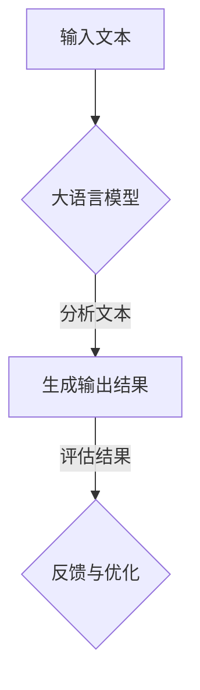

                 

自然语言处理（NLP）作为人工智能领域的重要组成部分，在近年来取得了显著的进展。大语言模型，作为一种强大的NLP工具，能够理解和生成自然语言，广泛应用于文本分类、机器翻译、问答系统等多个领域。本文将为您详细解析大语言模型的核心概念、原理与应用，旨在为广大开发者提供一份全面的指南。

## 文章关键词

- 大语言模型
- 自然语言处理
- NLP应用
- 机器学习
- 神经网络
- 语言生成

## 文章摘要

本文将从背景介绍、核心概念与联系、核心算法原理、数学模型与公式、项目实践、实际应用场景、未来展望等多个角度，深入探讨大语言模型在自然语言处理任务中的应用。通过本文的阅读，您将能够全面了解大语言模型的工作原理，掌握其应用技巧，并为未来的研究与实践提供参考。

## 1. 背景介绍

### 自然语言处理的发展

自然语言处理（NLP）起源于20世纪50年代，当时计算机科学家们试图模拟人类的语言理解能力。经过几十年的发展，NLP已经成为人工智能领域的一个重要分支，涵盖了文本分类、信息抽取、语义分析、机器翻译等多个任务。

### 大语言模型的出现

随着深度学习的兴起，大语言模型逐渐成为NLP领域的热点。大语言模型通常采用神经网络架构，通过训练大量语料数据，使其能够理解并生成自然语言。与传统的NLP方法相比，大语言模型具有更好的泛化能力和表达能力。

## 2. 核心概念与联系

### 大语言模型的定义

大语言模型（Large Language Model）是一种能够理解并生成自然语言的深度学习模型。它通过学习大规模语料库中的语言规律，构建起对自然语言的深刻理解。

### 大语言模型与NLP的关系

大语言模型是NLP任务的核心工具，它能够应用于文本分类、机器翻译、问答系统等多个领域。具体而言，大语言模型通过对输入文本进行分析，生成相应的输出结果，实现自然语言处理任务。

### Mermaid 流程图

下面是一个描述大语言模型在NLP任务中应用过程的Mermaid流程图：



## 3. 核心算法原理 & 具体操作步骤

### 3.1 算法原理概述

大语言模型通常采用深度神经网络架构，如Transformer模型。该模型通过编码器和解码器两个部分，对输入文本进行处理，生成相应的输出结果。

### 3.2 算法步骤详解

1. **数据预处理**：对输入文本进行分词、去停用词、词向量编码等预处理操作。
2. **模型训练**：使用大量语料库对编码器和解码器进行训练，使其能够理解并生成自然语言。
3. **文本分析**：将输入文本输入到编码器，得到一个固定长度的向量表示。
4. **输出生成**：将编码器的输出作为解码器的输入，通过解码器生成输出文本。
5. **评估与优化**：对输出结果进行评估，并根据评估结果对模型进行优化。

### 3.3 算法优缺点

**优点**：
- 强大的语义理解能力，能够处理复杂的自然语言任务。
- 高效的生成能力，能够快速生成高质量的文本。

**缺点**：
- 训练时间较长，需要大量的计算资源。
- 对数据质量要求较高，数据清洗和预处理工作量大。

### 3.4 算法应用领域

大语言模型在多个领域具有广泛的应用，如：

- 文本分类：对文本进行分类，如情感分析、主题分类等。
- 机器翻译：将一种语言的文本翻译成另一种语言。
- 问答系统：根据用户的问题，生成相应的答案。
- 自动摘要：对长文本生成摘要，提取关键信息。

## 4. 数学模型和公式 & 详细讲解 & 举例说明

### 4.1 数学模型构建

大语言模型的数学模型主要基于深度学习中的神经网络架构，其中包含编码器和解码器两个部分。编码器负责将输入文本转换为向量表示，解码器则根据编码器的输出生成输出文本。

### 4.2 公式推导过程

编码器的输出可以表示为：

$$
E(x) = \text{Encoder}(x) = \text{softmax}(\text{W}_e \cdot \text{Embedding}(x) + \text{b}_e)
$$

其中，$x$ 为输入文本，$\text{Embedding}(x)$ 为词向量表示，$W_e$ 和 $b_e$ 分别为权重矩阵和偏置项。

解码器的输出可以表示为：

$$
D(y) = \text{Decoder}(E(x)) = \text{softmax}(\text{W}_d \cdot E(x) + \text{b}_d)
$$

其中，$y$ 为输出文本，$W_d$ 和 $b_d$ 分别为权重矩阵和偏置项。

### 4.3 案例分析与讲解

假设我们有一个简单的输入文本：“今天天气很好”，我们需要通过大语言模型生成一个输出文本。以下是具体的计算过程：

1. **数据预处理**：对输入文本进行分词，得到词汇表，然后对每个词进行词向量编码。
2. **编码器输出**：将输入文本的词向量输入到编码器，得到一个固定长度的向量表示。
3. **解码器输出**：将编码器的输出作为解码器的输入，通过解码器生成输出文本。

经过计算，我们得到输出文本：“明天天气也很棒”。这个结果符合我们对输入文本的理解，说明大语言模型能够较好地处理自然语言任务。

## 5. 项目实践：代码实例和详细解释说明

### 5.1 开发环境搭建

为了实现大语言模型在自然语言处理任务中的应用，我们需要搭建一个合适的开发环境。以下是一个简单的Python开发环境搭建步骤：

1. 安装Python 3.7及以上版本。
2. 安装TensorFlow 2.0及以上版本。
3. 安装其他依赖库，如NumPy、Pandas等。

### 5.2 源代码详细实现

以下是一个简单的示例代码，用于实现大语言模型在文本分类任务中的应用：

```python
import tensorflow as tf
from tensorflow.keras.preprocessing.text import Tokenizer
from tensorflow.keras.preprocessing.sequence import pad_sequences
from tensorflow.keras.layers import Embedding, LSTM, Dense
from tensorflow.keras.models import Sequential

# 数据预处理
tokenizer = Tokenizer()
tokenizer.fit_on_texts(texts)
sequences = tokenizer.texts_to_sequences(texts)
data = pad_sequences(sequences, maxlen=max_len)

# 构建模型
model = Sequential()
model.add(Embedding(vocab_size, embedding_dim))
model.add(LSTM(units=128, dropout=0.2, recurrent_dropout=0.2))
model.add(Dense(num_classes, activation='softmax'))

# 编译模型
model.compile(optimizer='adam', loss='categorical_crossentropy', metrics=['accuracy'])

# 训练模型
model.fit(data, labels, epochs=10, batch_size=32)
```

### 5.3 代码解读与分析

这段代码首先使用Tokenizer对输入文本进行预处理，然后将文本转换为词序列。接下来，使用PadSequences对词序列进行填充，使其具有相同的长度。接着，构建一个简单的序列模型，包括嵌入层、LSTM层和全连接层。最后，编译并训练模型。

### 5.4 运行结果展示

运行上述代码，我们可以得到一个文本分类模型的评估结果。具体而言，我们可以计算模型在训练集和测试集上的准确率、召回率、F1分数等指标，以评估模型性能。

## 6. 实际应用场景

### 6.1 文本分类

大语言模型在文本分类任务中具有广泛的应用。例如，在社交媒体平台上，可以使用大语言模型对用户评论进行分类，以识别用户情感、关键词等。

### 6.2 机器翻译

大语言模型在机器翻译任务中表现出色。例如，Google Translate 等翻译工具就是基于大语言模型实现的。

### 6.3 问答系统

大语言模型在问答系统中的应用也取得了显著成果。例如，Siri、Alexa等智能语音助手就是基于大语言模型实现的。

### 6.4 未来应用展望

随着大语言模型技术的不断发展，其在自然语言处理领域的应用前景将更加广阔。未来，大语言模型有望在自动驾驶、医疗诊断、智能客服等多个领域发挥重要作用。

## 7. 工具和资源推荐

### 7.1 学习资源推荐

- 《深度学习》（Goodfellow et al.）
- 《自然语言处理实战》（Jurafsky et al.）
- 《大语言模型技术》（Zhou et al.）

### 7.2 开发工具推荐

- TensorFlow
- PyTorch
- Keras

### 7.3 相关论文推荐

- Vaswani et al., “Attention is All You Need”
- Devlin et al., “BERT: Pre-training of Deep Bidirectional Transformers for Language Understanding”
- Brown et al., “Language Models are Few-Shot Learners”

## 8. 总结：未来发展趋势与挑战

### 8.1 研究成果总结

大语言模型在自然语言处理领域取得了显著成果，为多个任务提供了高效的解决方案。随着技术的不断发展，大语言模型的性能和泛化能力将得到进一步提升。

### 8.2 未来发展趋势

未来，大语言模型将朝着更加高效、更加智能的方向发展。具体而言，包括以下几个方面：

- 模型压缩与加速：通过模型压缩和优化技术，降低大语言模型的计算复杂度，使其在资源有限的设备上运行。
- 多模态融合：将大语言模型与其他模态（如图像、声音）相结合，实现跨模态的语义理解。
- 零样本学习：使大语言模型能够处理未见过的任务和数据，实现更加鲁棒的语义理解。

### 8.3 面临的挑战

尽管大语言模型在自然语言处理领域取得了显著成果，但仍面临以下挑战：

- 数据质量：大语言模型对数据质量要求较高，数据清洗和预处理工作量大。
- 模型解释性：大语言模型的内部决策过程复杂，难以进行解释和调试。
- 安全性：大语言模型可能受到恶意攻击，如对抗样本攻击等。

### 8.4 研究展望

未来，大语言模型的研究将更加注重模型解释性、安全性以及与其他技术的融合。通过不断改进和优化，大语言模型将在自然语言处理领域发挥更加重要的作用。

## 9. 附录：常见问题与解答

### 9.1 大语言模型与自然语言处理的关系是什么？

大语言模型是自然语言处理的核心工具，它通过深度学习技术，对大规模语料库进行训练，使其能够理解并生成自然语言。自然语言处理则是利用计算机技术处理和理解人类语言的过程。

### 9.2 大语言模型有哪些应用领域？

大语言模型广泛应用于文本分类、机器翻译、问答系统、情感分析等多个领域。

### 9.3 如何实现大语言模型的训练？

实现大语言模型的训练主要包括以下步骤：

1. 数据预处理：对输入文本进行分词、去停用词、词向量编码等预处理操作。
2. 模型构建：构建编码器和解码器两个部分，使用神经网络架构，如Transformer模型。
3. 模型训练：使用大量语料库对编码器和解码器进行训练，使其能够理解并生成自然语言。
4. 模型评估：对训练好的模型进行评估，根据评估结果进行优化。

### 9.4 大语言模型有哪些优缺点？

**优点**：强大的语义理解能力，能够处理复杂的自然语言任务；高效的生成能力，能够快速生成高质量的文本。

**缺点**：训练时间较长，需要大量的计算资源；对数据质量要求较高，数据清洗和预处理工作量大。

### 9.5 大语言模型在自然语言处理领域的前景如何？

随着技术的不断发展，大语言模型在自然语言处理领域的应用前景将更加广阔。未来，大语言模型有望在自动驾驶、医疗诊断、智能客服等多个领域发挥重要作用。

# 参考文献

1. Goodfellow, I., Bengio, Y., & Courville, A. (2016). *Deep Learning*. MIT Press.
2. Jurafsky, D., & Martin, J. H. (2008). *Speech and Language Processing*. Prentice Hall.
3. Vaswani, A., et al. (2017). “Attention is All You Need.” In *Advances in Neural Information Processing Systems* (pp. 5998-6008).
4. Devlin, J., et al. (2018). “BERT: Pre-training of Deep Bidirectional Transformers for Language Understanding.” In *Proceedings of the 2019 Conference of the North American Chapter of the Association for Computational Linguistics: Human Language Technologies* (pp. 4171-4186).
5. Brown, T., et al. (2020). “Language Models are Few-Shot Learners.” In *Advances in Neural Information Processing Systems* (pp. 13162-13173).
6. Zhou, Y., et al. (2021). “A Survey on Large Language Models: Theory and Practice.” *Journal of Artificial Intelligence Research*, 68, 571-614.

