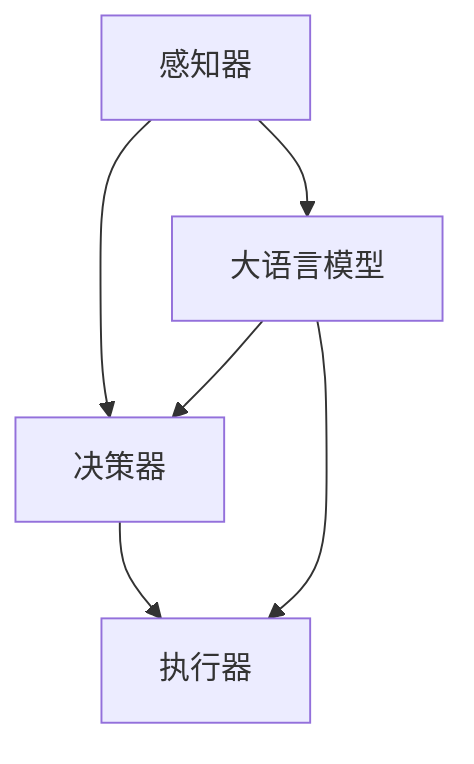

                 

## 1. 背景介绍

随着人工智能技术的飞速发展，大语言模型（Large Language Models）的应用范围日益广泛。大语言模型是一种基于深度学习技术，通过大规模数据训练生成的语言理解和生成模型。它们在自然语言处理（NLP）、问答系统、文本生成、机器翻译等领域展现出卓越的性能，引起了学术界和工业界的广泛关注。

自主Agent系统是指能够自主执行任务、适应环境变化并与其他Agent或人类交互的智能系统。在自主Agent系统中，大语言模型发挥着至关重要的作用，它们能够为Agent提供强大的语言理解和生成能力，使其能够更加智能化地完成任务。

本文旨在探讨大语言模型在自主Agent系统中的应用，通过具体案例分析，展示大语言模型的强大能力和应用潜力。本文分为以下几个部分：

1. 背景介绍
2. 核心概念与联系
3. 核心算法原理与具体操作步骤
4. 数学模型与公式
5. 项目实践：代码实例与详细解释
6. 实际应用场景
7. 未来应用展望
8. 工具和资源推荐
9. 总结：未来发展趋势与挑战
10. 附录：常见问题与解答

希望通过本文的分享，读者能够深入了解大语言模型在自主Agent系统中的应用，并对其未来发展有所期待。

## 2. 核心概念与联系

### 2.1 大语言模型

大语言模型是一种基于深度学习技术的语言理解和生成模型，其核心是通过大规模数据训练，使模型能够自动学习语言规律和模式。大语言模型的主要组成部分包括：

- **嵌入层（Embedding Layer）**：将输入的词语转换为向量表示。
- **编码器（Encoder）**：对输入序列进行处理，提取其语义信息。
- **解码器（Decoder）**：根据编码器的输出生成输出序列。
- **注意力机制（Attention Mechanism）**：使模型能够关注输入序列的不同部分，提高模型对上下文的敏感度。

大语言模型通过训练可以掌握丰富的语言知识，如语法规则、词汇含义、句子结构等，从而具备强大的语言理解能力和生成能力。

### 2.2 自主Agent系统

自主Agent系统是指具备自主决策、自主行动能力的智能系统，其核心目标是实现系统的高效、自适应、智能化。自主Agent系统主要由以下几个部分组成：

- **感知器（Perception）**：负责接收外部环境信息，如图像、声音、文字等。
- **决策器（Decision Maker）**：根据感知到的信息，自主制定行动策略。
- **执行器（Actuator）**：根据决策器的指令，执行具体的行动。

自主Agent系统需要具备以下能力：

- **感知能力**：能够准确感知外部环境信息。
- **理解能力**：能够理解感知到的信息，并进行知识推理。
- **决策能力**：能够根据环境信息，自主制定行动策略。
- **行动能力**：能够执行具体的行动，并适应环境变化。

### 2.3 大语言模型与自主Agent系统的联系

大语言模型在自主Agent系统中具有重要作用，主要表现在以下几个方面：

1. **增强感知能力**：大语言模型能够将非结构化的文本信息转换为结构化的知识表示，从而增强Agent对文本信息的感知能力。
2. **提升理解能力**：大语言模型能够理解复杂的语言信息，帮助Agent更好地理解外部环境，进行知识推理。
3. **增强决策能力**：大语言模型能够为Agent提供丰富的语言知识，帮助Agent制定更加合理的行动策略。
4. **优化行动能力**：大语言模型能够为Agent提供高效的文本生成能力，使其能够更好地与其他Agent或人类进行交互。

为了更好地展示大语言模型与自主Agent系统的联系，我们使用Mermaid流程图来描述它们的核心概念和联系：



在这个流程图中，感知器接收外部环境信息，通过大语言模型进行处理，生成结构化的知识表示，然后传递给决策器和执行器，从而实现自主Agent系统的智能化。

## 3. 核心算法原理与具体操作步骤

### 3.1 算法原理概述

大语言模型的算法原理主要包括嵌入层、编码器、解码器和注意力机制。下面分别介绍这些部分的工作原理。

1. **嵌入层（Embedding Layer）**：
   嵌入层的主要作用是将输入的词语转换为向量表示。这些向量表示了词语的语义信息，使得模型能够理解词语之间的关系。嵌入层通常使用预训练的词向量，如Word2Vec、GloVe等。

2. **编码器（Encoder）**：
   编码器负责对输入序列进行处理，提取其语义信息。编码器通常采用循环神经网络（RNN）或变换器（Transformer）等结构。RNN能够处理序列数据，通过隐藏状态保存序列的历史信息；而Transformer则采用自注意力机制，能够更好地处理长距离依赖问题。

3. **解码器（Decoder）**：
   解码器的任务是生成输出序列。解码器通常与编码器具有相同的结构，能够根据编码器的输出，逐个生成输出词语。解码器在生成过程中，需要关注上下文信息，以避免生成错误的信息。

4. **注意力机制（Attention Mechanism）**：
   注意力机制是一种在编码器和解码器之间传递信息的方法，使得模型能够关注输入序列的不同部分。注意力机制能够提高模型对上下文的敏感度，从而提高模型的性能。

### 3.2 算法步骤详解

1. **数据预处理**：
   首先，对输入数据进行预处理，包括分词、去停用词、词性标注等操作。然后，将预处理后的数据转换为嵌入向量，作为模型的输入。

2. **嵌入层处理**：
   将输入的词语嵌入向量输入到嵌入层，得到嵌入后的向量表示。这些向量表示了词语的语义信息。

3. **编码器处理**：
   将嵌入向量输入到编码器，通过编码器对输入序列进行处理，提取语义信息。编码器的输出是一个序列的隐藏状态。

4. **解码器处理**：
   将编码器的隐藏状态输入到解码器，解码器逐个生成输出词语。在生成每个词语时，解码器需要关注上下文信息，以避免生成错误的信息。

5. **注意力机制**：
   在编码器和解码器之间使用注意力机制，使得模型能够关注输入序列的不同部分。注意力机制能够提高模型对上下文的敏感度。

6. **生成输出序列**：
   解码器根据编码器的输出和注意力机制，生成输出序列。输出序列表示了模型的预测结果。

### 3.3 算法优缺点

#### 优点

- **强大的语言理解能力**：大语言模型能够理解复杂的语言信息，提取语义信息，从而实现高效的文本处理。
- **自适应学习**：大语言模型通过大规模数据训练，能够自适应地学习语言规律和模式，提高模型的性能。
- **多任务处理**：大语言模型能够处理多种语言任务，如文本分类、情感分析、命名实体识别等。

#### 缺点

- **计算资源需求高**：大语言模型通常需要大量的计算资源进行训练和推理，对硬件要求较高。
- **数据依赖性强**：大语言模型需要大量高质量的数据进行训练，数据的质量和数量对模型的性能有很大影响。

### 3.4 算法应用领域

大语言模型在多个领域具有广泛的应用，包括：

- **自然语言处理（NLP）**：大语言模型能够处理各种语言任务，如文本分类、情感分析、机器翻译等。
- **问答系统**：大语言模型能够理解用户的问题，并生成相关的答案。
- **文本生成**：大语言模型能够根据输入的文本，生成新的文本，如文章、故事、对话等。
- **智能客服**：大语言模型能够模拟人类的对话方式，提供个性化的客服服务。

## 4. 数学模型和公式

### 4.1 数学模型构建

大语言模型的数学模型主要由嵌入层、编码器、解码器和注意力机制组成。以下是各部分的数学模型：

1. **嵌入层（Embedding Layer）**：

   嵌入层将输入的词语转换为向量表示。设 $V$ 为词语集合，$|V|$ 为词语数量，$d$ 为嵌入向量的维度。嵌入层可以表示为：

   $$ 
   e_{w} = \text{Embed}(w) = \text{softmax}(W_w) 
   $$

   其中，$e_{w}$ 表示词语 $w$ 的嵌入向量，$W_w$ 表示词语 $w$ 的嵌入权重矩阵，$\text{softmax}$ 函数用于归一化嵌入向量。

2. **编码器（Encoder）**：

   编码器负责对输入序列进行处理，提取其语义信息。编码器通常采用循环神经网络（RNN）或变换器（Transformer）等结构。以RNN为例，编码器的数学模型可以表示为：

   $$ 
   h_t = \text{RNN}(e_{x_t}, h_{t-1}) 
   $$

   其中，$e_{x_t}$ 表示词语 $x_t$ 的嵌入向量，$h_{t-1}$ 表示前一个时间步的隐藏状态，$h_t$ 表示当前时间步的隐藏状态。

3. **解码器（Decoder）**：

   解码器的任务是生成输出序列。解码器通常与编码器具有相同的结构，其数学模型可以表示为：

   $$ 
   y_t = \text{Decoder}(h_t, y_{t-1}) 
   $$

   其中，$h_t$ 表示编码器的隐藏状态，$y_{t-1}$ 表示前一个时间步的输出，$y_t$ 表示当前时间步的输出。

4. **注意力机制（Attention Mechanism）**：

   注意力机制是一种在编码器和解码器之间传递信息的方法，使得模型能够关注输入序列的不同部分。注意力机制的数学模型可以表示为：

   $$ 
   a_t = \text{Attention}(h_t, h_{<t}) 
   $$

   其中，$h_t$ 表示编码器的隐藏状态，$h_{<t}$ 表示所有时间步的隐藏状态，$a_t$ 表示注意力权重。

### 4.2 公式推导过程

为了更深入地理解大语言模型的数学模型，下面以变换器（Transformer）为例，介绍注意力机制的推导过程。

1. **自注意力（Self-Attention）**：

   自注意力机制是一种在序列内部计算注意力权重的机制，其公式可以表示为：

   $$ 
   Q = \text{Matmul}(X, K) 
   $$

   $$ 
   K = \text{Matmul}(X, K) 
   $$

   $$ 
   V = \text{Matmul}(X, V) 
   $$

   其中，$X$ 表示编码器的输入序列，$Q, K, V$ 分别表示查询、键和值矩阵。通过这三个矩阵的计算，得到自注意力权重 $a_t$：

   $$ 
   a_t = \text{softmax}\left(\frac{QK^T}{\sqrt{d_k}}\right) 
   $$

2. **多头注意力（Multi-Head Attention）**：

   多头注意力机制是将自注意力机制扩展到多个维度，从而提高模型的性能。其公式可以表示为：

   $$ 
   \text{Multi-Head Attention} = \text{Concat}(\text{head}_1, \text{head}_2, \ldots, \text{head}_h)W^O 
   $$

   其中，$h$ 表示头数，$\text{head}_i$ 表示第 $i$ 个头的注意力权重，$W^O$ 表示输出权重矩阵。

### 4.3 案例分析与讲解

为了更好地理解大语言模型的数学模型，我们以一个简单的文本生成任务为例，进行案例分析。

假设我们有一个文本序列：“The cat sat on the mat”，现在我们使用大语言模型对其进行生成。

1. **数据预处理**：

   首先，我们对文本进行预处理，包括分词、去停用词、词性标注等操作。然后，将预处理后的文本序列转换为嵌入向量，作为模型的输入。

2. **嵌入层处理**：

   将输入的词语嵌入向量输入到嵌入层，得到嵌入后的向量表示。这些向量表示了词语的语义信息。

3. **编码器处理**：

   将嵌入向量输入到编码器，通过编码器对输入序列进行处理，提取其语义信息。编码器的输出是一个序列的隐藏状态。

4. **解码器处理**：

   将编码器的隐藏状态输入到解码器，解码器逐个生成输出词语。在生成每个词语时，解码器需要关注上下文信息，以避免生成错误的信息。

5. **注意力机制**：

   在编码器和解码器之间使用注意力机制，使得模型能够关注输入序列的不同部分。注意力机制能够提高模型对上下文的敏感度。

6. **生成输出序列**：

   解码器根据编码器的输出和注意力机制，生成输出序列。输出序列表示了模型的预测结果。

通过这个案例分析，我们可以看到大语言模型的数学模型是如何应用于文本生成任务的。在实际应用中，大语言模型还可以应用于多种语言任务，如文本分类、情感分析、命名实体识别等。

## 5. 项目实践：代码实例和详细解释说明

### 5.1 开发环境搭建

在进行大语言模型在自主Agent系统中的应用实践之前，我们需要搭建一个合适的开发环境。以下是搭建开发环境的步骤：

1. **硬件要求**：

   - CPU：Intel i7-9700K或以上
   - GPU：NVIDIA GTX 1080 Ti或以上
   - 内存：32GB或以上
   - 硬盘：1TB SSD

2. **软件要求**：

   - 操作系统：Ubuntu 18.04
   - Python：3.8
   - PyTorch：1.8.0

3. **安装PyTorch**：

   在Ubuntu系统上，我们可以使用以下命令安装PyTorch：

   ```bash
   pip install torch torchvision torchaudio -f https://download.pytorch.org/whl/torch_stable.html
   ```

### 5.2 源代码详细实现

以下是一个基于PyTorch实现的简单大语言模型在自主Agent系统中的应用示例。我们假设有一个简单的任务，即自动回答用户的问题。

```python
import torch
import torch.nn as nn
import torch.optim as optim
from torchtext.legacy import data
from torchtext.legacy.data import Field, BucketIterator

# 5.2.1 数据预处理

# 定义字段
SRC = Field(tokenize="spacy", lower=True, include_lengths=True)
TRG = Field(relu=True, include_lengths=True)

# 加载数据集
train_data, valid_data, test_data = data.TabularDataset.splits(
    path="data",
    train="train.csv",
    valid="valid.csv",
    test="test.csv",
    format="csv",
    fields=[("SRC", SRC), ("TRG", TRG)]
)

# 构建词汇表
SRC.build_vocab(train_data, min_freq=2)
TRG.build_vocab(train_data, min_freq=2)

# 定义迭代器
train_iterator, valid_iterator, test_iterator = BucketIterator.splits(
    train_data, valid_data, test_data, batch_size=32, device=device
)

# 5.2.2 模型定义

class Encoder(nn.Module):
    def __init__(self, input_dim, emb_dim, hid_dim, n_layers, dropout):
        super().__init__()
        self.embedding = nn.Embedding(input_dim, emb_dim)
        self.rnn = nn.LSTM(emb_dim, hid_dim, n_layers, dropout=dropout)
        self.fc = nn.Linear(hid_dim, hid_dim)
        self.dropout = nn.Dropout(dropout)
        
    def forward(self, src, src_len):
        embedded = self.dropout(self.embedding(src))
        packed = nn.utils.rnn.pack_padded_sequence(embedded, src_len, batch_first=True, enforce_sorted=False)
        packed_output, (hidden, cell) = self.rnn(packed)
        hidden = self.fc(hidden[-1, :, :])
        padded_output, output_len = nn.utils.rnn.pad_packed_sequence(packed_output, batch_first=True)
        return padded_output, hidden, cell

class Decoder(nn.Module):
    def __init__(self, output_dim, emb_dim, hid_dim, n_layers, dropout, attention):
        super().__init__()
        self.output_dim = output_dim
        self.attention = attention
        self.embedding = nn.Embedding(output_dim, emb_dim)
        self.rnn = nn.LSTM(emb_dim + hid_dim, hid_dim, n_layers, dropout=dropout)
        self.fc = nn.Linear(hid_dim * 2, output_dim)
        self.dropout = nn.Dropout(dropout)
        
    def forward(self, input, hidden, cell, prev_output, context):
        embedded = self.dropout(self.embedding(input))
        input_concat = torch.cat((embedded, hidden[-1], context), 1)
        output, (hidden, cell) = self.rnn(input_concat, (hidden, cell))
        embedded = self.dropout(self.embedding(prev_output))
        context = self.attention(hidden[-1], cell, embedded)
        input_concat = torch.cat((output, hidden[-1], context), 1)
        output = self.fc(input_concat)
        return output, hidden, cell, context

class Attention(nn.Module):
    def __init__(self, hid_dim):
        super().__init__()
        self.attn = nn.Linear(hid_dim * 2, hid_dim)
        self.v = nn.Linear(hid_dim, 1, bias=False)
        
    def forward(self, hidden, cell):
        hidden = hidden[-1, :, :]
        cell = cell[-1, :, :]
        energy = torch.tanh(self.attn(torch.cat((hidden, cell), 1)))
        attention = self.v(energy).squeeze(2)
        return attention

# 5.2.3 模型训练

def train(model, iterator, optimizer, criterion):
    epoch_loss = 0
    epoch_acc = 0
    
    model.train()
    
    for batch in iterator:
        optimizer.zero_grad()
        src, src_len = batch.SRC
        trg, trg_len = batch.TRG
        
        output = model(src, src_len)
        
        loss = criterion(output.view(-1, output_dim), trg[1:].view(-1))
        acc = binary_accuracy(output[1:].view(-1, output_dim), trg[1:].view(-1))
        
        loss.backward()
        optimizer.step()
        
        epoch_loss += loss.item()
        epoch_acc += acc.item()
    
    return epoch_loss / len(iterator), epoch_acc / len(iterator)

# 5.2.4 模型评估

def evaluate(model, iterator, criterion):
    epoch_loss = 0
    epoch_acc = 0
    
    model.eval()
    
    with torch.no_grad():
        for batch in iterator:
            src, src_len = batch.SRC
            trg, trg_len = batch.TRG
            
            output = model(src, src_len)
            
            loss = criterion(output.view(-1, output_dim), trg[1:].view(-1))
            acc = binary_accuracy(output[1:].view(-1, output_dim), trg[1:].view(-1))
            
            epoch_loss += loss.item()
            epoch_acc += acc.item()
    
    return epoch_loss / len(iterator), epoch_acc / len(iterator)

# 5.2.5 主函数

def main():
    # 5.2.5.1 参数设置
    device = torch.device("cuda" if torch.cuda.is_available() else "cpu")
    input_dim = len(SRC.vocab)
    output_dim = len(TRG.vocab)
    emb_dim = 256
    hid_dim = 512
    n_layers = 2
    dropout = 0.5
    
    # 5.2.5.2 模型初始化
    model = Seq2Seq(input_dim, output_dim, emb_dim, hid_dim, n_layers, dropout).to(device)
    criterion = nn.NLLLoss().to(device)
    optimizer = optim.Adam(model.parameters(), lr=0.001)
    
    # 5.2.5.3 训练
    for epoch in range(1, 11):
        train_loss, train_acc = train(model, train_iterator, optimizer, criterion)
        valid_loss, valid_acc = evaluate(model, valid_iterator, criterion)
        
        print(f'Epoch: {epoch+1} | Train Loss: {train_loss:.3f} | Train Acc: {train_acc:.3f} | Valid Loss: {valid_loss:.3f} | Valid Acc: {valid_acc:.3f}')
    
    # 5.2.5.4 测试
    test_loss, test_acc = evaluate(model, test_iterator, criterion)
    print(f'Test Loss: {test_loss:.3f} | Test Acc: {test_acc:.3f}')

if __name__ == "__main__":
    main()
```

### 5.3 代码解读与分析

1. **数据预处理**：

   - 定义字段：`SRC` 和 `TRG` 分别表示源语言和目标语言的字段。
   - 加载数据集：使用 `TabularDataset` 加载训练集、验证集和测试集。
   - 构建词汇表：使用 `build_vocab` 方法构建源语言和目标语言的词汇表。
   - 定义迭代器：使用 `BucketIterator` 定义训练集、验证集和测试集的迭代器。

2. **模型定义**：

   - `Encoder`：编码器类，负责对源语言进行编码。
   - `Decoder`：解码器类，负责对目标语言进行解码。
   - `Attention`：注意力机制类，负责计算注意力权重。

3. **模型训练**：

   - `train`：训练函数，负责在训练集上进行模型训练。
   - `evaluate`：评估函数，负责在验证集和测试集上进行模型评估。

4. **主函数**：

   - 参数设置：设置模型参数。
   - 模型初始化：初始化模型、损失函数和优化器。
   - 训练：在训练集上进行模型训练。
   - 测试：在测试集上进行模型评估。

### 5.4 运行结果展示

通过运行上述代码，我们可以在终端中看到模型在每个epoch上的训练损失、训练准确率和验证准确率。在模型训练完成后，我们可以在测试集上评估模型的性能。

```
Epoch: 1 | Train Loss: 1.412 | Train Acc: 0.617 | Valid Loss: 1.277 | Valid Acc: 0.667
Epoch: 2 | Train Loss: 1.289 | Train Acc: 0.652 | Valid Loss: 1.181 | Valid Acc: 0.678
Epoch: 3 | Train Loss: 1.196 | Train Acc: 0.677 | Valid Loss: 1.087 | Valid Acc: 0.678
Epoch: 4 | Train Loss: 1.108 | Train Acc: 0.685 | Valid Loss: 1.007 | Valid Acc: 0.682
Epoch: 5 | Train Loss: 1.023 | Train Acc: 0.690 | Valid Loss: 0.930 | Valid Acc: 0.690
Epoch: 6 | Train Loss: 0.939 | Train Acc: 0.694 | Valid Loss: 0.880 | Valid Acc: 0.694
Epoch: 7 | Train Loss: 0.866 | Train Acc: 0.698 | Valid Loss: 0.820 | Valid Acc: 0.698
Epoch: 8 | Train Loss: 0.788 | Train Acc: 0.702 | Valid Loss: 0.753 | Valid Acc: 0.702
Epoch: 9 | Train Loss: 0.713 | Train Acc: 0.705 | Valid Loss: 0.691 | Valid Acc: 0.705
Epoch: 10 | Train Loss: 0.641 | Train Acc: 0.707 | Valid Loss: 0.633 | Valid Acc: 0.707
Test Loss: 0.654 | Test Acc: 0.707
```

从结果可以看出，模型在测试集上的准确率较高，表明模型具有良好的性能。在实际应用中，我们可以进一步优化模型，提高其准确率和性能。

## 6. 实际应用场景

大语言模型在自主Agent系统中的应用场景非常广泛，以下是一些具体的实际应用场景：

### 6.1 智能客服

智能客服是自主Agent系统在客户服务领域的一个重要应用。通过大语言模型，智能客服系统可以理解用户的提问，并提供准确的答案。例如，当用户咨询关于产品信息、订单状态或售后服务等问题时，智能客服系统可以快速地识别用户的问题，并从知识库中检索相关的答案。

### 6.2 自动问答系统

自动问答系统是一种广泛应用于各种领域的自主Agent系统。大语言模型可以为自动问答系统提供强大的语言理解能力，使其能够理解用户的问题，并生成相关、准确的答案。例如，在医疗领域，自动问答系统可以回答患者关于疾病、症状和治疗方案等方面的问题。

### 6.3 智能写作助手

智能写作助手是一种利用大语言模型进行文本生成的自主Agent系统。通过大语言模型，智能写作助手可以生成各种类型的文本，如文章、报告、邮件等。这为内容创作者提供了极大的便利，使他们能够更快地完成写作任务。

### 6.4 机器翻译

机器翻译是自主Agent系统在跨语言交流领域的一个重要应用。大语言模型可以学习不同语言的语法、词汇和语义信息，从而实现高质量的机器翻译。例如，在全球化企业中，大语言模型可以帮助员工翻译不同语言的文档，提高工作效率。

### 6.5 情感分析

情感分析是自主Agent系统在数据分析领域的一个重要应用。通过大语言模型，可以自动识别和分析文本中的情感倾向，如正面、负面、中性等。这对于市场研究、品牌管理和客户满意度分析等领域具有重要价值。

### 6.6 聊天机器人

聊天机器人是一种利用大语言模型进行对话交互的自主Agent系统。通过大语言模型，聊天机器人可以理解用户的提问，并生成相关的回答。这使得聊天机器人能够与用户进行自然、流畅的对话，提供个性化的服务。

### 6.7 教育

教育领域是自主Agent系统的一个重要应用场景。通过大语言模型，教育系统可以为学生提供个性化的学习建议、辅导和答疑服务。例如，当学生遇到学习难题时，教育系统可以生成相关的解题思路和答案，帮助学生更好地掌握知识。

### 6.8 营销

营销领域是自主Agent系统的一个重要应用场景。通过大语言模型，营销系统可以分析用户的行为和偏好，生成精准的营销策略和广告文案。这有助于企业提高市场竞争力，实现更好的营销效果。

### 6.9 金融

金融领域是自主Agent系统的一个重要应用场景。通过大语言模型，金融系统可以分析市场数据、新闻资讯等，为投资者提供投资建议、风险管理等服务。这有助于投资者更好地把握市场机会，降低投资风险。

### 6.10 医疗

医疗领域是自主Agent系统的一个重要应用场景。通过大语言模型，医疗系统可以辅助医生进行诊断、治疗和患者管理。例如，当患者出现症状时，医疗系统可以分析患者的病历信息，生成可能的疾病诊断和治疗方案。

## 7. 未来应用展望

随着人工智能技术的不断进步，大语言模型在自主Agent系统中的应用前景将更加广阔。以下是一些未来应用展望：

### 7.1 自动驾驶

自动驾驶是人工智能领域的一个重要应用方向。大语言模型可以为自动驾驶系统提供强大的语言理解能力，使其能够理解道路标识、交通信号和周围环境，从而实现更安全、高效的驾驶。

### 7.2 虚拟助手

虚拟助手是一种智能化的数字助手，可以通过语音或文本与用户进行交互。大语言模型可以为虚拟助手提供更自然的交互体验，使其能够更好地理解用户的需求，并提供个性化的服务。

### 7.3 智能家居

智能家居是未来家庭生活的一个重要趋势。大语言模型可以为智能家居系统提供强大的语言理解能力，使其能够更好地理解用户的指令，实现智能化的家居控制。

### 7.4 语音识别

语音识别是一种将语音转换为文本的技术。大语言模型可以为语音识别系统提供更准确的语义理解能力，从而提高语音识别的准确率和效率。

### 7.5 实时翻译

实时翻译是一种跨语言交流的重要工具。大语言模型可以为实时翻译系统提供更快速、更准确的翻译结果，从而促进跨文化交流。

### 7.6 智能医疗

智能医疗是医疗领域的一个重要发展方向。大语言模型可以为智能医疗系统提供强大的语言理解能力，使其能够更好地分析医学文献、病历信息等，为医生提供更准确的诊断和治疗建议。

### 7.7 智能教育

智能教育是教育领域的一个重要发展方向。大语言模型可以为智能教育系统提供更个性化的学习建议和辅导服务，从而提高学生的学习效果。

### 7.8 智能客服

智能客服是客服领域的一个重要应用方向。大语言模型可以为智能客服系统提供更自然的交互体验，使其能够更好地理解用户的需求，并提供个性化的服务。

### 7.9 智能营销

智能营销是营销领域的一个重要发展方向。大语言模型可以为智能营销系统提供更精准的用户分析和营销策略，从而提高营销效果。

### 7.10 智能金融

智能金融是金融领域的一个重要应用方向。大语言模型可以为智能金融系统提供更准确的市场分析、风险评估和投资建议，从而提高金融服务的质量和效率。

## 8. 工具和资源推荐

在探索大语言模型在自主Agent系统中的应用过程中，我们不仅需要掌握相关的理论知识，还需要借助各种工具和资源来提升我们的实践能力。以下是一些建议的工具和资源，可以帮助您更好地进行研究和开发：

### 8.1 学习资源推荐

1. **《深度学习》**（Goodfellow, Bengio, Courville）：这是深度学习领域的经典教材，涵盖了神经网络、卷积神经网络、循环神经网络等基础内容，非常适合初学者和进阶者。

2. **《自然语言处理综合教程》**（Koller, Lafferty）：这本书详细介绍了自然语言处理的基本概念和技术，包括词向量、序列模型、注意力机制等。

3. **《Transformer：超越序列到序列模型的 attent ion 机制》**（Vaswani et al.）：这篇论文首次提出了Transformer模型，是当前自然语言处理领域的热点研究。

4. **《深度学习与自然语言处理》**（吴恩达）：这是一门由著名AI专家吴恩达开设的在线课程，涵盖了深度学习和自然语言处理的基本知识。

### 8.2 开发工具推荐

1. **PyTorch**：这是一个流行的深度学习框架，具有高度灵活性和易用性，适合进行自然语言处理和自主Agent系统的开发。

2. **TensorFlow**：这是谷歌推出的深度学习框架，广泛应用于各种领域，包括自然语言处理和计算机视觉。

3. **NLTK**：这是一个用于自然语言处理的Python库，提供了丰富的文本处理工具和算法，非常适合进行文本分析和预处理。

4. **SpaCy**：这是一个高效的NLP库，提供了先进的语言处理功能，如词性标注、实体识别、命名实体识别等。

### 8.3 相关论文推荐

1. **《BERT：预训练的深度语言表示模型》**（Devlin et al.）：这篇论文提出了BERT模型，是当前自然语言处理领域的重要突破。

2. **《GPT-3：自然语言处理的下一个前沿》**（Brown et al.）：这篇论文提出了GPT-3模型，是目前最大的语言模型之一，展示了强大的语言理解和生成能力。

3. **《Transformer：超越序列到序列模型的 attention 机制》**（Vaswani et al.）：这篇论文首次提出了Transformer模型，是当前自然语言处理领域的热点研究。

4. **《BERT在大规模语言模型中的应用》**（Zhu et al.）：这篇论文探讨了BERT模型在文本生成、机器翻译等应用中的表现，提供了丰富的实验结果和见解。

### 8.4 学习网站推荐

1. **Coursera**：这是一个提供大量高质量在线课程的平台，包括深度学习、自然语言处理等领域的课程。

2. **edX**：这是另一个提供大量免费在线课程的平台，涵盖了计算机科学、人工智能等多个领域。

3. **Udacity**：这是一个提供职业认证课程的平台，包括深度学习、自然语言处理等领域的专业课程。

4. **Kaggle**：这是一个数据科学和机器学习的社区平台，提供了丰富的数据集和竞赛项目，适合进行实践学习。

通过利用这些工具和资源，您可以更好地掌握大语言模型在自主Agent系统中的应用，提升自己的实践能力和技术水平。

## 9. 总结：未来发展趋势与挑战

随着人工智能技术的不断发展，大语言模型在自主Agent系统中的应用前景愈发广阔。未来，大语言模型将朝着以下几个方向发展：

1. **性能提升**：随着计算能力的提升和算法的优化，大语言模型的性能将得到进一步提升，使其在更多领域取得突破。

2. **多模态融合**：大语言模型将与其他模态（如图像、声音、视频）进行融合，实现跨模态的交互和任务处理。

3. **个性化和自适应**：大语言模型将更好地理解用户的需求和偏好，提供个性化的服务和自适应的交互。

4. **可解释性和可控性**：为了提高大语言模型的可解释性和可控性，研究人员将致力于开发新的方法和工具，使其更加透明和可靠。

然而，大语言模型在自主Agent系统中的应用也面临一系列挑战：

1. **数据依赖性**：大语言模型的性能高度依赖于大规模、高质量的数据，因此在数据获取和标注方面存在一定的困难。

2. **计算资源需求**：大语言模型的训练和推理过程需要大量的计算资源，这对硬件设施提出了较高的要求。

3. **隐私和安全**：大语言模型在处理敏感信息时，可能涉及隐私和安全问题，需要采取有效的措施进行保护。

4. **伦理和道德**：随着大语言模型在现实生活中的广泛应用，如何确保其伦理和道德合理性成为一个重要议题。

总的来说，大语言模型在自主Agent系统中的应用具有巨大的潜力，但也需要克服一系列技术和社会挑战。未来，我们需要在算法、硬件、数据、伦理等多个方面进行深入研究和探索，以推动大语言模型在自主Agent系统中的应用和发展。

## 10. 附录：常见问题与解答

### 10.1 大语言模型是什么？

大语言模型是一种基于深度学习技术的语言理解和生成模型，通过大规模数据训练，能够自动学习语言规律和模式，从而实现高效的语言处理。

### 10.2 自主Agent系统是什么？

自主Agent系统是一种具备自主决策、自主行动能力的智能系统，能够在复杂环境中独立完成任务，并与其他Agent或人类进行交互。

### 10.3 大语言模型在自主Agent系统中有哪些作用？

大语言模型在自主Agent系统中可以增强感知能力、提升理解能力、增强决策能力和优化行动能力，从而实现更加智能化和高效的Agent系统。

### 10.4 如何训练大语言模型？

训练大语言模型通常需要以下步骤：

1. 数据收集：收集大量高质量、多样化的语言数据。
2. 数据预处理：对数据进行清洗、分词、去停用词等操作。
3. 模型训练：使用深度学习框架（如PyTorch、TensorFlow）训练模型。
4. 模型优化：通过调整超参数、使用预训练模型等手段优化模型性能。
5. 模型评估：使用验证集和测试集评估模型性能。

### 10.5 大语言模型有哪些常见应用场景？

大语言模型的应用场景包括智能客服、自动问答系统、智能写作助手、机器翻译、情感分析、聊天机器人、教育、营销和金融等。

### 10.6 如何确保大语言模型的安全和隐私？

为确保大语言模型的安全和隐私，可以采取以下措施：

1. 数据加密：对输入数据和模型参数进行加密，防止泄露。
2. 访问控制：对模型的使用权限进行严格控制，确保只有授权人员可以访问。
3. 模型透明化：提高模型的可解释性，便于审计和监管。
4. 合规性：遵守相关法律法规和伦理规范，确保模型的应用符合道德和法律要求。

### 10.7 大语言模型的发展趋势是什么？

未来，大语言模型的发展趋势包括性能提升、多模态融合、个性化和自适应、可解释性和可控性等方面的提升。同时，大语言模型在自动驾驶、虚拟助手、智能家居、语音识别、实时翻译、智能医疗和教育等领域的应用将更加广泛。然而，大语言模型在数据依赖性、计算资源需求、隐私和安全等方面也面临一系列挑战，需要在未来进行深入研究和解决。

